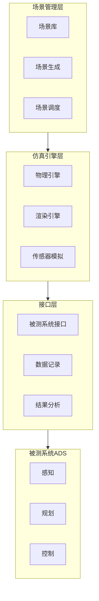

+++
title = "08. 仿真测试与安全验证"
description = "仿真测试体系：场景构建、传感器仿真、安全验证方法与测试评价体系"
date = 2025-01-16
weight = 8000
[taxonomies]
tags = ["autonomous-driving", "simulation", "testing", "safety", "verification"]
+++

# 自动驾驶仿真测试与安全验证

## 一、仿真测试的必要性

### 1.1 为什么需要仿真

**里程数需求**：
- 统计表明：证明自动驾驶比人类安全需要数十亿英里测试
- 实际道路测试：成本高、周期长、危险场景难以覆盖
- 仿真测试：低成本、可重复、可覆盖极端场景

**加速开发**：
- 快速迭代算法
- 并行测试多个版本
- 回归测试保证质量

### 1.2 仿真的价值

| 方面 | 实际道路测试 | 仿真测试 |
|------|-------------|----------|
| 成本 | 高（车辆、人员、保险） | 低（计算资源） |
| 效率 | 1x（实时） | 10-1000x（可加速） |
| 安全 | 有风险 | 零风险 |
| 覆盖 | 受限于实际遇到的场景 | 可构造任意场景 |
| 可重复 | 难以精确重复 | 完全可重复 |

### 1.3 仿真不能完全替代实测

**仿真的局限**：
- 模型与现实有差异（Sim2Real Gap）
- 无法穷尽所有场景
- 未知场景无法仿真

**实测仍然必要**：
- 验证仿真结果
- 发现未知问题
- 满足法规要求

---

## 二、仿真系统架构

### 2.1 仿真系统组成



### 2.2 核心组件

**场景引擎**：
- 管理交通参与者
- 控制场景演进
- 实现交互逻辑

**物理引擎**：
- 车辆动力学仿真
- 碰撞检测
- 物理效果模拟

**渲染引擎**：
- 生成视觉图像
- 光照、天气效果
- 用于摄像头仿真

**传感器仿真**：
- 摄像头图像生成
- 激光雷达点云生成
- 毫米波雷达模拟

---

## 三、场景构建

### 3.1 场景要素

**静态要素**：
- 道路结构
- 交通标志
- 建筑物
- 植被

**动态要素**：
- 车辆
- 行人
- 骑行者
- 动物

**环境要素**：
- 天气（晴、雨、雪、雾）
- 光照（白天、黄昏、夜晚）
- 路面状况

### 3.2 场景来源

**真实数据重建**：
- 从实际道路测试数据提取
- 保留真实性
- 覆盖率受限于测试范围

**人工设计**：
- 基于事故案例设计
- 基于法规要求设计
- 针对性强但主观

**自动生成**：
- 基于规则的变异
- 基于搜索的场景发现
- 基于对抗的场景生成

### 3.3 场景描述语言

**OpenSCENARIO**：
- 标准化场景描述格式
- 描述动态行为
- 行业广泛采用

**OpenDRIVE**：
- 描述道路网络
- 车道、标线、交通标志
- 与OpenSCENARIO配合使用

### 3.4 关键场景

**预定义场景类型**：
- 跟车（Car Following）
- 切入（Cut-in）
- 切出（Cut-out）
- 交叉路口
- 行人穿越
- 紧急制动

**边缘场景（Edge Cases）**：
- 罕见但危险的场景
- 如：异形障碍物、极端天气
- 需要特别关注

---

## 四、传感器仿真

### 4.1 仿真保真度

**低保真**：
- 直接输出目标列表
- 不模拟传感器特性
- 速度快，但跳过感知测试

**中保真**：
- 加入传感器噪声
- 模拟遮挡、误检
- 平衡速度和真实性

**高保真**：
- 物理级仿真
- 光线追踪渲染
- 最接近真实，但计算量大

### 4.2 摄像头仿真

**渲染方法**：
- 光栅化渲染（快速）
- 光线追踪（逼真）
- 神经渲染（新趋势）

**仿真要素**：
- 分辨率和视场角
- 曝光、噪声
- 运动模糊
- 镜头畸变

### 4.3 激光雷达仿真

**仿真方法**：
- 光线投射计算距离
- 考虑材质反射率
- 多回波模拟

**仿真要素**：
- 扫描模式
- 噪声特性
- 雨雪衰减
- 运动畸变

### 4.4 毫米波雷达仿真

**仿真要素**：
- 目标RCS（雷达散射截面）
- 多径效应
- 杂波干扰
- 目标遮挡

---

## 五、测试方法

### 5.1 测试类型

**功能测试**：
- 验证功能是否正确实现
- 如：能否识别红灯

**性能测试**：
- 验证性能指标
- 如：检测距离、响应时间

**鲁棒性测试**：
- 验证对异常情况的处理
- 如：传感器失效、极端天气

**回归测试**：
- 验证修改未引入新问题
- 每次更新后执行

### 5.2 测试流程

```
场景选择 → 仿真执行 → 数据采集 → 结果评估 → 问题分析
    ↑                                        ↓
    └────────────────────────────────────────┘
                   迭代改进
```

### 5.3 并行测试

**云端仿真**：
- 大规模并行执行
- 自动化调度
- 快速覆盖大量场景

**持续集成**：
- 代码提交触发测试
- 自动化回归
- 及时发现问题

---

## 六、安全验证

### 6.1 安全标准

**ISO 26262**：
- 汽车功能安全标准
- ASIL等级划分
- 开发流程要求

**ISO 21448（SOTIF）**：
- 预期功能安全
- 关注非故障导致的危险
- 针对自动驾驶特性

**UL 4600**：
- 自动驾驶安全评估
- 安全案例方法论

### 6.2 安全指标

**碰撞相关指标**：
- 碰撞率
- 碰撞严重程度
- 近碰撞事件

**反应能力指标**：
- TTC（碰撞时间）
- TTA（制动时间）
- 最小安全距离

**舒适性指标**：
- 加速度
- Jerk（加速度变化率）
- 变道频率

### 6.3 覆盖率分析

**场景覆盖**：
- ODD（运行设计域）覆盖
- 关键场景覆盖
- 参数空间覆盖

**代码覆盖**：
- 语句覆盖
- 分支覆盖
- 条件覆盖

### 6.4 安全验证方法

**基于场景的验证**：
- 定义场景库
- 执行并评估
- 统计通过率

**形式化验证**：
- 数学证明安全性
- 适用于简化模型
- 可证明边界情况

**基于风险的验证**：
- 识别危害
- 评估风险
- 验证缓解措施

---

## 七、Sim2Real问题

### 7.1 什么是Sim2Real Gap

仿真与真实世界的差异：
- 传感器模型不够精确
- 物理仿真有简化
- 场景分布不匹配

### 7.2 差异来源

**传感器差异**：
- 噪声特性不同
- 边缘情况未建模
- 故障模式未覆盖

**环境差异**：
- 渲染与真实图像有差异
- 物理效果简化
- 交通行为模型化

**动力学差异**：
- 车辆模型简化
- 路面状况简化
- 执行器响应差异

### 7.3 缩小Gap的方法

**提高仿真保真度**：
- 更精确的物理模型
- 更真实的渲染
- 数据驱动的模型

**域适应（Domain Adaptation）**：
- 让模型适应真实和仿真的差异
- 迁移学习
- 域随机化

**实测验证**：
- 对比仿真和实测结果
- 校准仿真参数
- 验证仿真有效性

---

## 八、工具与平台

### 8.1 开源仿真平台

**CARLA**：
- 开源、免费
- 支持多种传感器
- 社区活跃

**LGSVL Simulator**：
- 高保真渲染
- 支持ROS/Apollo
- 已停止更新

**SUMO**：
- 交通流仿真
- 微观仿真
- 常用于交通研究

### 8.2 商业仿真平台

**VTD（Vires）**：
- 工业级仿真
- 广泛应用

**CarMaker（IPG）**：
- 车辆动力学仿真
- 整车级测试

**Cognata**：
- 云原生
- 大规模仿真

### 8.3 自建仿真平台

**大公司趋势**：
- Waymo、Tesla、百度等自建仿真平台
- 针对自身系统深度定制
- 与开发流程深度集成

---

## 九、总结

### 9.1 核心要点

1. **仿真是必要手段**：无法仅靠实测验证自动驾驶安全
2. **场景是核心**：场景库的质量决定测试效果
3. **传感器仿真是难点**：保真度与效率的平衡
4. **Sim2Real是挑战**：需要持续缩小仿真与现实的差距
5. **安全验证需要体系**：标准、方法、工具的结合

### 9.2 发展趋势

- 数据驱动的仿真（NeRF、神经渲染）
- 大规模云端仿真
- 自动化场景生成
- 仿真与实测结合的验证体系

---

## 相关文章

- [上一篇：技术难点与挑战](@/articles/autonomous-driving/ad-07-技术难点与挑战.md)
- [下一篇：业界实践案例](@/articles/autonomous-driving/ad-09-业界实践案例.md)
