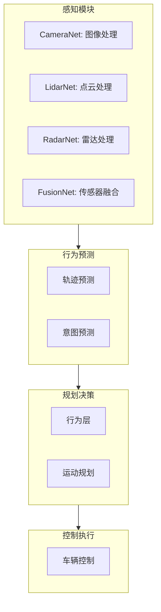
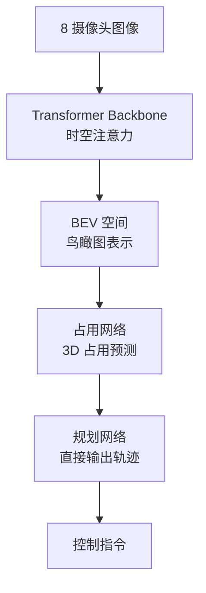
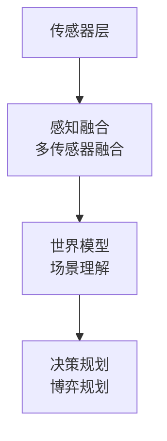

+++
title = "业界实践案例"
date = 2026-01-13
weight = 9000
description = "全球主流自动驾驶公司技术方案深度解析：Waymo、Tesla、百度Apollo、华为等典型案例"
[taxonomies]
tags = ["autonomous-driving", "industry", "waymo", "tesla", "apollo"]
+++

# 自动驾驶业界实践案例详解

本文深入分析全球领先自动驾驶公司的技术路线、系统架构与实践经验，帮助理解行业发展现状。

---

## 一、行业格局总览

### 1.1 技术路线分类

| 路线 | 代表企业 | 特点 |
|-----|---------|------|
| L4 Robotaxi | Waymo、Cruise、百度 | 限定区域全自动 |
| L2+ 渐进式 | Tesla、小鹏、理想 | 量产车辅助驾驶 |
| L4 货运 | 图森、小马智行 | 干线物流 |
| 供应商 | Mobileye、华为 | 提供解决方案 |

### 1.2 传感器路线分歧

| 路线 | 代表 | 传感器配置 |
|-----|------|-----------|
| 纯视觉 | Tesla | 摄像头为主 |
| 激光雷达为主 | Waymo、百度 | 多激光雷达 |
| 融合方案 | 华为、蔚来 | 摄像头+激光雷达 |

---

## 二、Waymo（谷歌系）

### 2.1 公司背景

| 维度 | 信息 |
|-----|------|
| 成立时间 | 2009年（谷歌内部），2016年独立 |
| 定位 | L4 Robotaxi 和 货运 |
| 测试里程 | >2000 万英里（2024年） |
| 运营城市 | 旧金山、凤凰城、洛杉矶 |
| 员工规模 | ~2500人 |

### 2.2 技术架构

**传感器配置**：

| 传感器 | 数量 | 说明 |
|-------|------|------|
| 激光雷达 | 5 | 自研，360° 覆盖 |
| 摄像头 | 29 | 多分辨率，360° |
| 毫米波雷达 | 6 | 多距离覆盖 |
| 麦克风 | 若干 | 检测警报声 |

**计算平台**：
- 自研计算硬件
- 多重冗余设计
- 算力：数百 TOPS

### 2.3 软件架构

### 2.4 关键技术

| 技术 | 说明 |
|-----|------|
| 自研激光雷达 | Laser Bear 系列，成本降低90%+ |
| 仿真系统 | Simulation City，每天数百万里程 |
| 地图系统 | 高精地图自动化生成 |
| 安全验证 | SSS（Safety Safety Safety）框架 |

### 2.5 运营模式

| 模式 | 说明 |
|-----|------|
| Waymo One | 付费 Robotaxi 服务 |
| Waymo Via | 货运服务 |
| 无安全员 | 部分区域已实现 |
| 商业化 | 旧金山等地收费运营 |

### 2.6 经验教训

| 事件 | 教训 |
|-----|------|
| 凤凰城骚扰事件 | 社区关系重要 |
| 初期保守运营 | 安全第一策略 |
| 扩张谨慎 | 逐步扩大 ODD |

---

## 三、Tesla

### 3.1 公司背景

| 维度 | 信息 |
|-----|------|
| Autopilot 发布 | 2014年 |
| FSD 发布 | 2020年 |
| 车队规模 | 500万+ 辆（2024年） |
| 数据量 | 数十亿英里行驶数据 |

### 3.2 技术路线

**纯视觉方案**：

| 决策 | 理由 |
|-----|------|
| 移除雷达 | 多模态融合复杂性 |
| 移除超声波 | 视觉可替代 |
| 纯摄像头 | 人类用眼睛就能开车 |

**摄像头配置**：

| 位置 | 数量 | 用途 |
|-----|------|------|
| 前视 | 3 | 窄角/主/广角 |
| 侧视 | 4 | B柱前后 |
| 后视 | 1 | 后方感知 |
| 总计 | 8 | 360° 覆盖 |

### 3.3 FSD 架构演进

| 版本 | 架构 | 特点 |
|-----|------|------|
| V10 及之前 | 模块化 | 感知→规划→控制分离 |
| V11 | 单栈 | 城市/高速统一 |
| V12 | 端到端 | 神经网络直接输出控制 |

### 3.4 V12 端到端架构

### 3.5 数据引擎

| 组件 | 作用 |
|-----|------|
| 影子模式 | 对比人类驾驶和AI预测 |
| 自动标注 | 大规模自动生成标签 |
| 困难样本挖掘 | 自动找出困难场景 |
| 仿真生成 | 生成训练数据 |

### 3.6 Dojo 超算

| 特性 | 说明 |
|-----|------|
| 自研芯片 | D1 芯片 |
| 训练算力 | ExaFLOP 级别 |
| 目标 | 训练大规模视觉模型 |
| 状态 | 2023年部分上线 |

### 3.7 商业模式

| 模式 | 说明 |
|-----|------|
| FSD 订阅 | $199/月 |
| FSD 买断 | $12,000 |
| 未来 Robotaxi | 计划中 |

---

## 四、百度 Apollo

### 4.1 公司背景

| 维度 | 信息 |
|-----|------|
| 启动时间 | 2017年 |
| 定位 | 开放平台 + Robotaxi |
| 开源版本 | Apollo 9.0 |
| 萝卜快跑 | Robotaxi 品牌 |
| 运营城市 | 武汉、北京、上海等10+ |

### 4.2 技术架构

**Apollo 9.0 架构**：

| 层级 | 组件 |
|------|------|
| **应用层** | 感知 / 定位 / 规划 / 控制 |
| **中间件层** | CyberRT（实时通信） |
| **驱动层** | 传感器驱动 / 执行器驱动 |

### 4.3 传感器方案

**萝卜快跑车型**：

| 传感器 | 配置 |
|-------|------|
| 激光雷达 | 2-3 个（禾赛/速腾） |
| 摄像头 | 9-11 个 |
| 毫米波雷达 | 5 个 |
| 定位 | RTK + IMU |

### 4.4 第六代无人车

| 特性 | 说明 |
|-----|------|
| 成本 | 25万元人民币 |
| 无方向盘 | 纯无人设计 |
| 冗余 | 双计算、双电源 |
| 运营 | 武汉大规模部署 |

### 4.5 核心技术

| 技术 | 说明 |
|-----|------|
| Apollo 9.0 | 模块化开放架构 |
| 高精地图 | 自采集自建图 |
| 仿真平台 | AADS、日行500万公里 |
| 5G V2X | 车路协同 |

### 4.6 商业运营

| 指标 | 数据（2024年） |
|-----|--------------|
| 累计单量 | 700万+ |
| 日均单量 | 10万+ |
| 全无人订单占比 | 70%+ |
| 盈利情况 | 部分城市接近盈亏平衡 |

---

## 五、华为 ADS

### 5.1 定位

| 维度 | 信息 |
|-----|------|
| 定位 | 智能汽车解决方案供应商 |
| 模式 | 为车企提供方案 |
| 合作车型 | 问界、阿维塔、智界等 |
| 版本 | ADS 2.0/3.0 |

### 5.2 ADS 2.0 架构

**硬件配置**：

| 传感器 | 数量 |
|-------|------|
| 激光雷达 | 1-3 |
| 摄像头 | 11 |
| 毫米波雷达 | 3 |
| 超声波 | 12 |

**计算平台**：MDC（移动数据中心）
- MDC 810: 400+ TOPS
- 车规级设计

### 5.3 技术特点

| 特点 | 说明 |
|-----|------|
| 不依赖高精地图 | 在线建图 |
| GOD 网络 | 通用障碍物检测 |
| RCR | 道路拓扑推理 |
| PDP | 预测决策规划一体化 |

### 5.4 GOD 网络

**General Obstacle Detection**：

| 特点 | 说明 |
|-----|------|
| 不区分类别 | 检测所有障碍物 |
| 白名单机制 | 只关心"可碰"vs"不可碰" |
| 占用网络 | 体素级占用预测 |

### 5.5 城区NCA

**Navigation Cruise Assist**：

| 功能 | 说明 |
|-----|------|
| 城区领航 | 跟导航自动驾驶 |
| 红绿灯识别 | 自动过路口 |
| 无保护左转 | 复杂场景处理 |
| 施工区域 | 自动绕行 |

### 5.6 商业模式

| 模式 | 说明 |
|-----|------|
| HI 模式 | 深度合作，提供全套 |
| 部件模式 | 提供单一组件 |
| 授权模式 | 软件授权 |

---

## 六、小鹏汽车

### 6.1 技术路线

| 阶段 | 方案 |
|-----|------|
| 早期 | 激光雷达 + 高精地图 |
| 现在 | 纯视觉（部分车型） |
| XNGP | 不依赖高精地图 |

### 6.2 XNGP 架构

**传感器方案**：

| 车型 | 激光雷达 | 摄像头 |
|-----|---------|-------|
| P7i | 2 | 11 |
| G6 | 2 | 11 |
| X9 | 2 | 12 |

### 6.3 技术特点

| 技术 | 说明 |
|-----|------|
| XNet | 自研感知网络 |
| 占用网络 | 3D 空间理解 |
| 轻地图 | 不依赖高精地图 |
| 分钟级开城 | 快速适应新城市 |

### 6.4 XNet 2.0

| 特点 | 说明 |
|-----|------|
| 动态 BEV | 时序融合 |
| 3D 占用预测 | 体素级预测 |
| 道路结构推理 | 在线建图 |

---

## 七、蔚来汽车

### 7.1 技术路线

| 维度 | 方案 |
|-----|------|
| 传感器 | 激光雷达 + 摄像头融合 |
| 芯片 | NVIDIA Orin × 4 |
| 算力 | 1016 TOPS |
| 功能 | NOP+、NAD |

### 7.2 Banyan 榕树架构

### 7.3 硬件配置

| 传感器 | 数量 |
|-------|------|
| 激光雷达 | 1（图达通） |
| 摄像头 | 11 |
| 毫米波雷达 | 5 |
| 超声波 | 12 |

---

## 八、理想汽车

### 8.1 技术路线

| 维度 | 方案 |
|-----|------|
| 方案 | 纯视觉 + 激光雷达可选 |
| 芯片 | 双 Orin-X |
| 算力 | 508 TOPS |

### 8.2 AD Max 系统

| 功能 | 说明 |
|-----|------|
| 城市 NOA | 城区领航辅助 |
| 高速 NOA | 高速领航 |
| AEB | 自动紧急制动 |
| LCC | 车道居中 |

### 8.3 技术特点

| 特点 | 说明 |
|-----|------|
| 轻量化地图 | 减少地图依赖 |
| 端到端探索 | 正在研发 |
| 数据闭环 | 量产车数据回流 |

---

## 九、Cruise（通用系）

### 9.1 公司背景

| 维度 | 信息 |
|-----|------|
| 成立 | 2013年，2016年被通用收购 |
| 定位 | L4 Robotaxi |
| 运营城市 | 旧金山（暂停中） |
| 现状 | 2023年底因事故暂停 |

### 9.2 技术方案

**Origin 无人车**：

| 特性 | 说明 |
|-----|------|
| 无方向盘 | 纯无人设计 |
| 对称设计 | 双向对称 |
| 传感器 | 多激光雷达 |

### 9.3 事故教训

| 事件 | 教训 |
|-----|------|
| 2023年行人事故 | 拖拽行人 |
| 后果 | 暂停运营，CEO离职 |
| 教训 | 安全冗余、事故处理 |

---

## 十、图森未来（货运）

### 10.1 公司背景

| 维度 | 信息 |
|-----|------|
| 成立 | 2015年 |
| 定位 | L4 干线物流 |
| 特点 | 卡车自动驾驶 |
| 路线 | OEM 合作 |

### 10.2 技术方案

| 传感器 | 配置 |
|-------|------|
| 激光雷达 | 长距 + 近距多个 |
| 摄像头 | 环视 + 前向 |
| 毫米波 | 多角度覆盖 |

### 10.3 卡车特殊性

| 特点 | 要求 |
|-----|------|
| 高速场景 | 超长感知距离 |
| 长车身 | 特殊转弯控制 |
| 载重变化 | 自适应控制 |
| 制动距离 | 更长的规划 |

---

## 十一、技术对比总结

### 11.1 传感器方案对比

| 公司 | 激光雷达 | 摄像头 | 路线 |
|-----|---------|-------|------|
| Waymo | 5 | 29 | 重传感器 |
| Tesla | 0 | 8 | 纯视觉 |
| 百度 | 2-3 | 9-11 | 融合 |
| 华为 | 1-3 | 11 | 融合 |
| 小鹏 | 0-2 | 11 | 可变 |

### 11.2 技术路线对比

| 公司 | 高精地图 | 端到端 | 商业化 |
|-----|---------|-------|-------|
| Waymo | 需要 | 探索中 | Robotaxi |
| Tesla | 不需要 | V12已上线 | 辅助驾驶 |
| 百度 | 需要→轻地图 | 探索中 | Robotaxi |
| 华为 | 轻地图 | 探索中 | 卖方案 |

### 11.3 关键经验

| 经验 | 说明 |
|-----|------|
| 数据规模 | Tesla 优势明显 |
| 安全第一 | Cruise 教训深刻 |
| 成本控制 | 量产关键因素 |
| 商业模式 | 找到可持续路径 |
| 本地化 | 中国场景独特性 |

---

## 参考资料

- [Waymo Safety Report](https://waymo.com/safety/)
- [Tesla AI Day](https://www.youtube.com/c/Tesla)
- [Apollo Documentation](https://apollo.auto/docs/)
- [Huawei ADS](https://www.huawei.com/en/huawei-intelligent-vehicle-solution)
- [Cruise Transparency Report](https://getcruise.com/transparency)

---

## 相关文章

- [上一篇：仿真测试与安全验证](@/articles/autonomous-driving/ad-08-仿真测试与安全验证.md)
