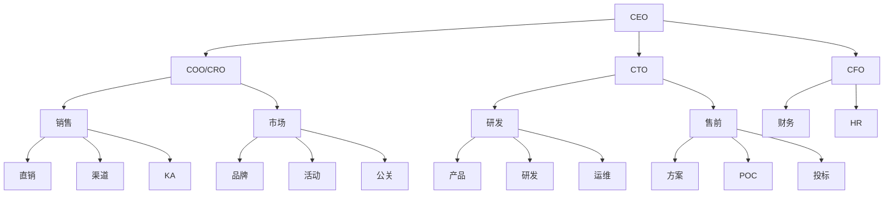
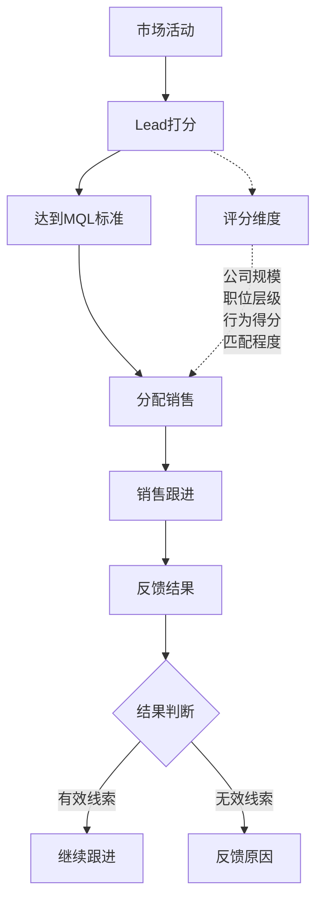
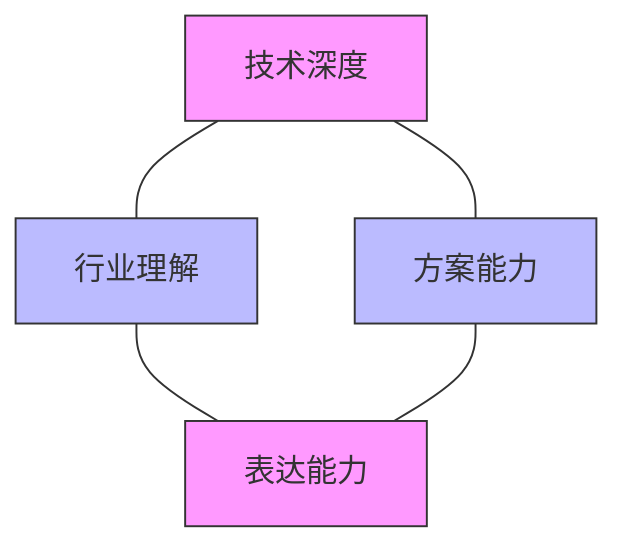
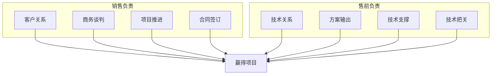
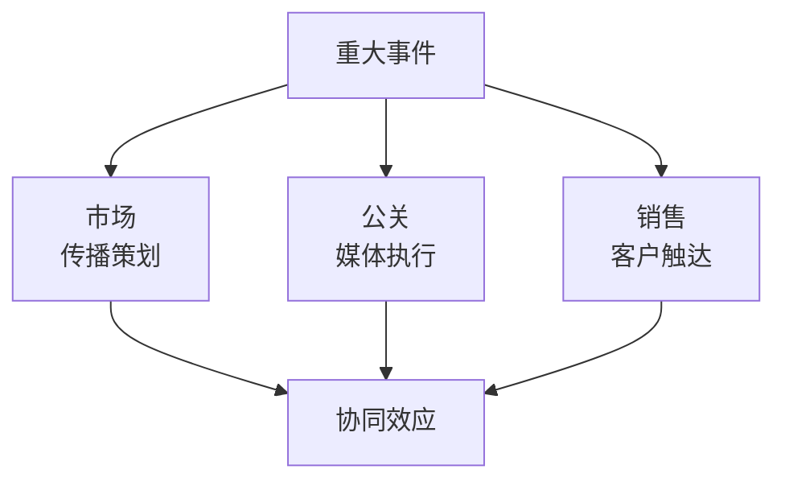
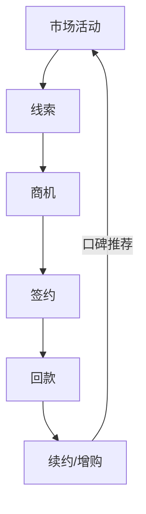

+++
title = "01. 企业部门职能与协作详解"
description = "通过具体案例解释市场部、销售部、售前、渠道、公关等部门的职责与协作"
date = 2025-01-16
weight = 1000
[taxonomies]
tags = ["business", "organization", "sales", "marketing", "enterprise"]
+++

# 企业部门职能与协作详解

## 一、核心部门概览

### 1.1 To B企业典型组织架构



### 1.2 各部门核心定位

| 部门 | 核心目标 | 关键指标 |
|------|----------|----------|
| **市场部** | 品牌建设 + 线索获取 | MQL数量、品牌知名度 |
| **销售部** | 成交转化 + 回款 | 销售额、回款率 |
| **售前部** | 技术支撑 + 方案输出 | 支持项目数、中标率 |
| **渠道部** | 合作伙伴管理 | 渠道销售额、伙伴数量 |
| **公关部** | 危机管理 + 媒体关系 | 媒体曝光度、舆情处理 |

---

## 二、市场部（Marketing）

### 2.1 核心职责

**品牌营销（Brand Marketing）**
- 品牌定位与策略制定
- VI设计与品牌传播
- 行业影响力建设

**数字营销（Digital Marketing）**
- 官网运营与SEO优化
- 社交媒体运营
- 内容营销（白皮书、案例、博客）

**活动营销（Event Marketing）**
- 行业峰会与展会
- 客户沙龙与研讨会
- 线上Webinar

**需求生成（Demand Generation）**
- 线索获取（Lead Generation）
- 线索培育（Lead Nurturing）
- 线索交接（MQL → SQL）

### 2.2 实际案例：云计算公司市场部

**案例背景**：某云计算公司市场部年度预算2000万

**预算分配**：
```
品牌广告投放：    500万（25%）
行业峰会参展：    400万（20%）
内容营销：        300万（15%）
数字营销：        300万（15%）
客户活动：        300万（15%）
PR公关：          200万（10%）
```

**线索漏斗**：
```
市场活动 → 注册用户（10000）
           ↓ 20%
        MQL（2000）
           ↓ 30%
        SQL（600）
           ↓ 25%
        成交（150）
        
平均客单价：50万
年度销售额：7500万
营销ROI：3.75x
```

### 2.3 市场部与销售部的协作

**线索交接流程**：



**常见冲突与解决**：

| 销售抱怨 | 市场抱怨 | 解决方案 |
|----------|----------|----------|
| 线索质量差 | 销售跟进不及时 | 建立SLA（48小时必须首次联系） |
| 数量不够 | 预算有限 | 数据驱动的预算分配 |
| 不了解客户 | 销售不反馈 | CRM强制填写跟进记录 |

---

## 三、销售部（Sales）

### 3.1 销售组织形态

**按客户规模划分**：
```
销售部
├── KA（Key Account，大客户）
│   └── 客户经理负责年销售额>500万的客户
│
├── 中型客户
│   └── 销售代表负责年销售额50-500万的客户
│
└── SMB（中小企业）
    └── 电销/在线销售覆盖
```

**按行业划分**：
```
销售部
├── 金融行业事业部
├── 政府行业事业部
├── 能源行业事业部
├── 制造行业事业部
└── 互联网行业事业部
```

### 3.2 销售角色详解

**客户经理（Account Executive）**
- 负责指定客户群的销售业绩
- 协调内部资源推进项目
- 维护客户关系

**商务经理（Business Development）**
- 开拓新客户、新市场
- 建立客户初步关系
- 完成初步需求挖掘后交给AE

**销售总监（Sales Director）**
- 管理销售团队
- 制定销售策略
- 把控重大项目

### 3.3 实际案例：企业软件销售流程

**案例背景**：某ERP厂商向制造企业销售MES系统

**销售流程**：

```
Week 1-2：需求确认
├── 客户背景调研
├── 首次拜访（了解痛点）
└── 需求初步确认

Week 3-4：方案输出
├── 售前介入（技术调研）
├── 方案编写与评审
└── 方案汇报

Week 5-8：POC验证
├── POC方案制定
├── 现场部署与测试
└── POC总结汇报

Week 9-12：商务谈判
├── 报价与谈判
├── 合同条款确认
└── 签约

Week 13+：交付回款
├── 项目实施
├── 验收
└── 回款
```

**项目各阶段人员配置**：

| 阶段 | 销售 | 售前 | 产品 | 研发 | 交付 |
|------|------|------|------|------|------|
| 需求确认 | ● | ○ | | | |
| 方案输出 | ○ | ● | ○ | | |
| POC验证 | ○ | ● | | ● | |
| 商务谈判 | ● | ○ | | | |
| 交付 | ○ | | | | ● |

● 主导  ○ 参与

---

## 四、售前部（Pre-Sales / Solution）

### 4.1 核心职责

**技术交流**
- 产品演示（Demo）
- 技术答疑
- 竞品分析

**方案设计**
- 需求调研与分析
- 解决方案编写
- 架构设计

**POC支持**
- POC方案制定
- 现场实施
- 结果汇报

**投标支持**
- 技术标编写
- 标书评审
- 答疑准备

### 4.2 售前能力模型



**优秀售前的特质**：
- 能用客户听得懂的语言解释技术
- 能快速理解客户业务痛点
- 能将产品能力映射到客户需求
- 能在压力下完成高质量交付

### 4.3 售前与销售的配合

**理想配合模式**：



**常见配合问题**：

| 问题 | 原因 | 解决方案 |
|------|------|----------|
| 售前被过度占用 | 销售不筛选项目 | 建立项目立项机制 |
| 方案与客户需求脱节 | 售前未参与需求调研 | 强制售前参加首次拜访 |
| 承诺过度 | 销售为签单乱承诺 | 技术承诺需售前确认 |

---

## 五、渠道部（Channel）

### 5.1 渠道体系

**渠道类型**：

```
渠道体系
├── 代理商（Reseller）
│   └── 转售产品，赚取差价
│
├── ISV（独立软件开发商）
│   └── 基于平台开发解决方案
│
├── SI（系统集成商）
│   └── 提供整体解决方案和实施服务
│
└── 战略合作伙伴
    └── 联合解决方案、联合销售
```

**渠道分级**：
```
合作伙伴等级
├── 金牌（年销售额>1000万）
│   └── 最优折扣、专属支持
│
├── 银牌（年销售额>300万）
│   └── 优惠折扣、优先支持
│
└── 注册（入门级）
    └── 基础折扣、标准支持
```

### 5.2 渠道与直销的关系

**分工模式**：

```
市场划分：
├── 直销覆盖
│   └── 行业大客户（年销售额>500万）
│   └── 战略客户
│
└── 渠道覆盖
    └── 中小客户
    └── 区域市场
    └── 垂直行业
```

**冲突管理**：
- **报备机制**：项目报备优先原则
- **区域保护**：指定区域独家代理
- **行业保护**：指定行业独家合作

---

## 六、公关部（Public Relations）

### 6.1 核心职责

**媒体关系**
- 媒体沟通与维护
- 新闻稿撰写与发布
- 媒体采访安排

**危机公关**
- 舆情监控
- 危机应对
- 声誉修复

**政府关系**
- 政策沟通
- 政府项目对接
- 行业协会参与

### 6.2 公关与市场的协作



---

## 七、部门协作实战案例

### 7.1 案例：新产品上市

**背景**：某云厂商发布新一代云数据库产品

**各部门分工**：

```
发布前2个月：
├── 产品部：产品GA、文档准备
├── 市场部：传播策划、物料准备
├── 公关部：媒体资源对接
└── 销售部：种子客户筛选

发布当月：
├── 公关部：新闻发布会、媒体采访
├── 市场部：发布会执行、内容传播
├── 售前部：技术白皮书
└── 销售部：重点客户定向邀约

发布后：
├── 市场部：持续内容营销
├── 销售部：客户跟进转化
├── 售前部：方案支持
└── 渠道部：伙伴培训赋能
```

### 7.2 案例：大项目攻关

**背景**：某银行3000万IT项目

**项目团队组成**：

```
项目组
├── 销售总监：项目总负责
├── 客户经理：日常客户关系
├── 售前经理：方案负责
├── 产品经理：产品适配
├── 交付经理：实施规划
└── 商务经理：合同商务
```

**阶段性配合**：

| 阶段 | 关键动作 | 主导角色 |
|------|----------|----------|
| 商机识别 | 客户需求挖掘 | 销售 |
| 需求确认 | 技术调研 | 售前+销售 |
| 方案竞争 | 方案汇报 | 售前 |
| 投标 | 标书编写 | 售前+商务 |
| 商务谈判 | 价格谈判 | 销售+商务 |
| 签约 | 合同签订 | 商务 |
| 交付 | 项目实施 | 交付团队 |

---

## 八、效益产生机制

### 8.1 价值链条



### 8.2 各部门贡献度量化

**示例：1亿销售额的贡献拆解**

```
线索来源：
├── 市场线索：60%（6000万）
│   └── 市场部贡献
│
├── 渠道线索：25%（2500万）
│   └── 渠道部贡献
│
└── 销售自拓：15%（1500万）
    └── 销售部贡献

转化环节：
├── 销售转化能力
├── 售前方案能力
└── 产品竞争力
```

### 8.3 协作效率提升

**高效协作特征**：
- 信息透明：CRM系统实时更新
- 流程清晰：SOP标准化执行
- 责任明确：RACI矩阵定义
- 激励对齐：共享成功

**低效协作表现**：
- 部门墙严重
- 信息不共享
- 相互推诿
- 各自为政

---

## 九、总结

### 9.1 部门职责速查表

| 部门 | 一句话职责 | 核心KPI |
|------|------------|---------|
| 市场部 | 让客户知道我们并产生兴趣 | 线索数量、品牌知名度 |
| 销售部 | 把产品卖出去并收回钱 | 销售额、回款率 |
| 售前部 | 用技术帮助销售赢单 | 支持项目数、中标率 |
| 渠道部 | 通过伙伴扩大销售覆盖 | 渠道销售额 |
| 公关部 | 维护公司形象和媒体关系 | 媒体曝光、舆情处理 |

### 9.2 协作的本质

> 所有部门的存在，都是为了**让客户买单**这一最终目标服务。
> 
> 没有单独一个部门能完成从"客户不知道你"到"客户持续付费"的全流程。
> 
> **协作的本质是：分工提高效率，协同创造价值。**

---

## 相关文章

- [下一篇：销售获客与客户开发](@/articles/business/biz-02-销售获客与客户开发.md)
