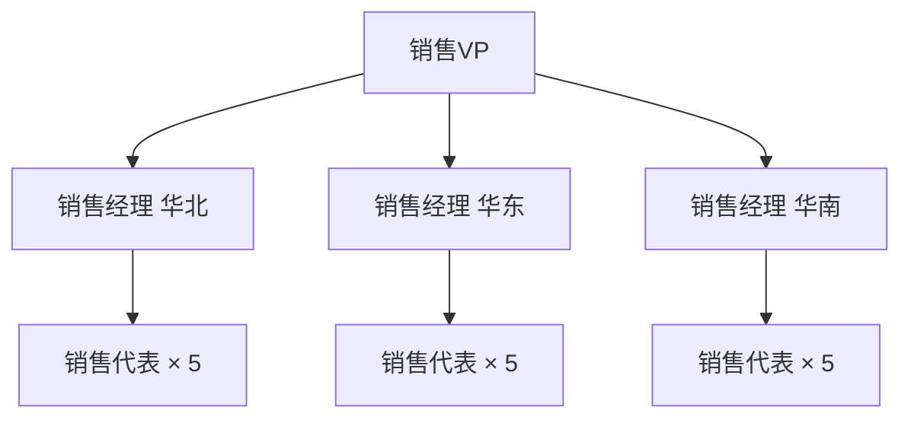
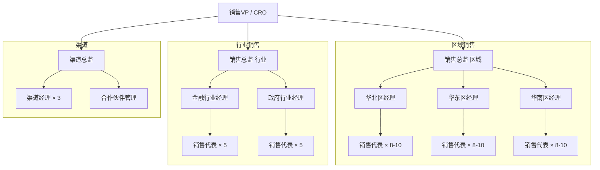
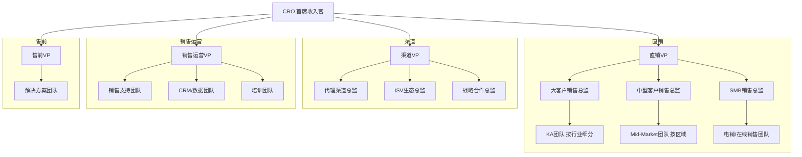
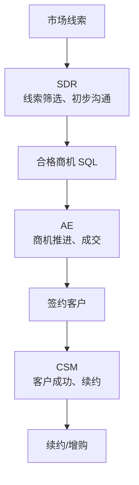
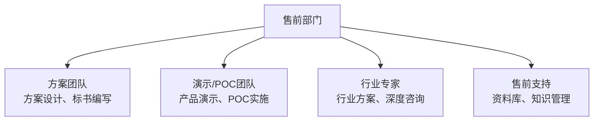
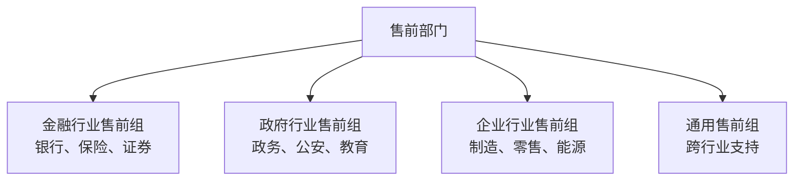
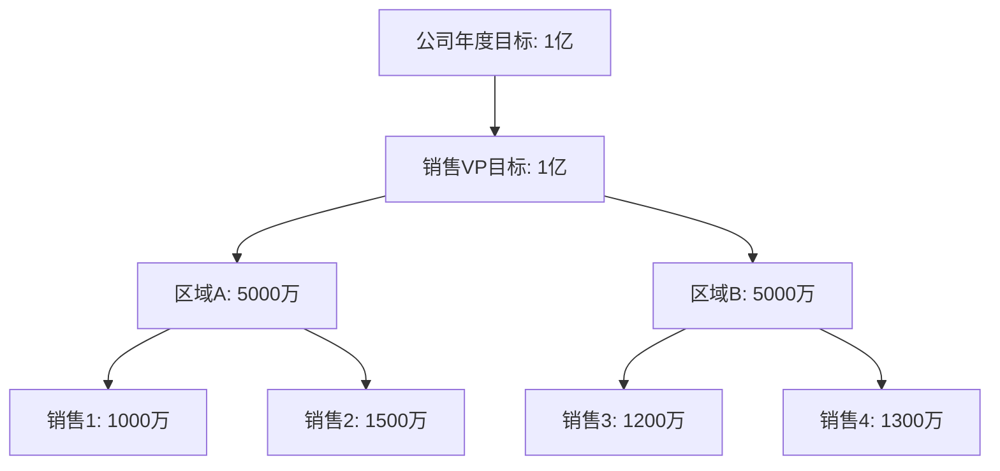
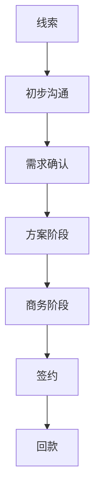
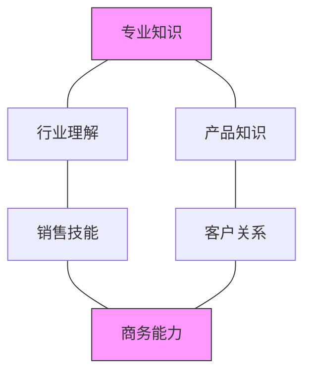
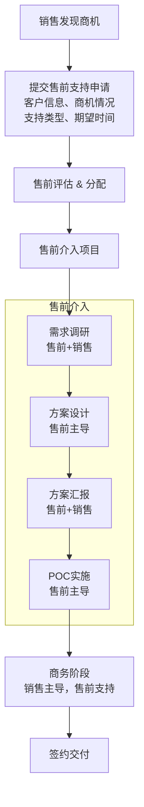

+++
title = "04.销售团队管理与组织架构"
description = "如何搭建和管理销售团队，销售与售前团队的典型组织架构"
date = 2025-01-16
[taxonomies]
tags = ["sales", "business", "team-management", "organization", "pre-sales"]
+++

# 销售团队管理与组织架构

## 一、销售团队组织架构

### 1.1 典型销售组织结构

**小型公司（<50人销售）**：



**中型公司（50-200人销售）**：



**大型公司（>200人销售）**：



### 1.2 销售组织的三种模式

**模式一：区域制**

| 维度 | 说明 |
|------|------|
| **优点** | 属地化深耕，客户关系强；降低差旅成本；便于本地化服务 |
| **缺点** | 行业专业度可能不够；跨区域项目协调困难；区域发展不均衡 |
| **适用** | 客户分散、重服务的业务 |

**模式二：行业制**

| 维度 | 说明 |
|------|------|
| **优点** | 行业理解深刻；方案更专业；复制性强 |
| **缺点** | 差旅成本高；跨行业客户难覆盖；行业人才难找 |
| **适用** | 行业差异大、专业度要求高的业务 |

**模式三：客户规模制**

| 维度 | 说明 |
|------|------|
| **优点** | 资源匹配客户价值；销售方法针对性强；ROI可控 |
| **缺点** | 客户成长后交接困难；小客户可能被忽视；层级间可能有冲突 |
| **适用** | 客户规模差异大的业务 |

### 1.3 现代销售组织趋势

**SDR/BDR模式**：



**角色分工**：

| 角色 | 职责 | 核心指标 |
|------|------|----------|
| SDR | 线索筛选、商机挖掘 | SQL数量、会议数 |
| BDR | 外呼开发新客户 | 新商机数、会议数 |
| AE | 商机推进到成交 | 签约额、成交率 |
| CSM | 客户成功、续约增购 | 续约率、NRR |

---

## 二、售前团队组织架构

### 2.1 售前团队定位

**三种定位模式**：

| 模式 | 结构 | 优点 | 缺点 |
|------|------|------|------|
| 销售附属 | 售前隶属于销售部门，向销售VP汇报 | 响应快、配合紧密 | 专业建设可能被忽视 |
| 独立部门 | 售前独立于销售、研发，售前VP与销售VP平级 | 专业建设、资源保护 | 可能产生配合摩擦 |
| 矩阵式 | 专业上归售前部管，项目上配合销售 | 两者兼顾 | 管理复杂 |

### 2.2 售前团队结构

**按技能分工**：



**按行业分工**：



### 2.3 销售与售前配比

**典型配比参考**：

| 业务类型 | 销售:售前 | 说明 |
|----------|-----------|------|
| 标准化SaaS | 5:1 到 10:1 | 产品简单，售前需求少 |
| 平台型产品 | 3:1 到 5:1 | 需要方案支持 |
| 解决方案型 | 2:1 到 3:1 | 重度方案依赖 |
| 项目制交付 | 1:1 到 2:1 | 每单都需深度支持 |

**配比计算示例**：

```
假设：
├── 销售团队：30人
├── 每个销售每月处理商机：5个
├── 每个商机需要售前支持：60%
├── 每个售前每月可支持商机：10个

售前需求 = 30 × 5 × 60% = 90个商机/月
售前人数 = 90 / 10 = 9人
配比 = 30:9 ≈ 3.3:1
```

---

## 三、销售团队管理

### 3.1 销售目标管理

**目标设定原则**：

| SMART原则 | 说明 |
|-----------|------|
| Specific（具体） | 明确数字目标 |
| Measurable（可衡量） | 有清晰标准 |
| Achievable（可实现） | 挑战但可达 |
| Relevant（相关） | 与公司目标对齐 |
| Time-bound（时限） | 有明确时间节点 |

**目标分解方法**：



**目标跟踪机制**：

| 周期 | 关注内容 | 管理动作 |
|------|----------|----------|
| 每日 | 销售活动量 | 检查任务完成 |
| 每周 | 商机进展 | Pipeline Review |
| 每月 | 签约/回款 | 目标达成复盘 |
| 每季度 | 季度业绩 | 战略调整 |

### 3.2 销售过程管理

**销售漏斗管理**：

| 阶段 | 标准 | 转化率 | 周期 |
|------|------|--------|------|
| 线索 | 有联系方式 | 100% | - |
| 初步沟通 | 确认需求真实 | 50% | 1周 |
| 需求确认 | 明确需求、预算、时间 | 30% | 2周 |
| 方案阶段 | 提交方案、演示完成 | 40% | 3周 |
| 商务阶段 | 报价、谈判中 | 60% | 2周 |
| 签约 | 合同签署 | 80% | 1周 |
| 回款 | 款项到账 | 95% | 按合同 |



**Pipeline健康度检查**：

| 类型 | 特征 |
|------|------|
| **健康特征** | 各阶段商机数量成漏斗型分布；商机在各阶段不滞留；新增商机持续补充；输单有分析有改进；预测准确率>80% |
| **问题信号** | 商机集中在某阶段（堆积）；长期不动的商机太多（僵尸）；漏斗上宽下窄（转化率低）；预测和实际差异大；主要依赖几个大单（风险） |

### 3.3 销售团队激励

**薪酬结构设计**：

| 组成 | 占比 | 说明 |
|------|------|------|
| 基本工资（固定） | 50-70% | 保障生活基本需求 |
| 绩效奖金（浮动） | 20-40% | 与个人业绩挂钩 |
| 其他激励（可选） | 5-10% | 团队奖金、超额奖励、长期激励 |

**提成方案设计**：

| 方案类型 | 描述 | 适用场景 |
|----------|------|----------|
| 固定比例 | 销售额×固定提成率 | 产品标准、毛利稳定 |
| 阶梯提成 | 越高越多的提成率 | 激励冲刺高目标 |
| 毛利提成 | 按毛利计提 | 需控制折扣 |
| 回款提成 | 回款后计提 | 重视现金流 |

**阶梯提成示例**：

| 完成率 | 提成率 |
|--------|--------|
| <80% | 0.5% |
| 80-100% | 1.0% |
| 100-120% | 1.5% |
| 120-150% | 2.0% |
| >150% | 3.0% |

**示例计算**：目标100万，完成130万

| 区间 | 计算 | 金额 |
|------|------|------|
| 80万 | × 1.0% | 8000元 |
| 20万 | × 1.5% | 3000元 |
| 30万 | × 2.0% | 6000元 |
| **合计** | | **17000元** |

### 3.4 销售团队培养

**销售能力模型**：



**培训体系**：

| 阶段 | 培训内容 | 方式 | 周期 |
|------|----------|------|------|
| 新人入职 | 产品、流程、基础技能 | 集中培训 | 2-4周 |
| 上岗初期 | 老带新、实战演练 | 师徒制 | 1-3月 |
| 成熟期 | 进阶技能、行业深耕 | 专题培训 | 持续 |
| 管理储备 | 管理技能、领导力 | 管理培训 | 按需 |

**销售例会制度**：

| 会议类型 | 时长 | 内容 |
|----------|------|------|
| 每日站会 | 15分钟 | 今天要做什么；有什么困难；需要什么支持 |
| 每周例会 | 1-2小时 | 上周业绩回顾；本周重点商机；Pipeline Review；案例/经验分享 |
| 每月复盘会 | 半天 | 月度业绩分析；输单/赢单分析；问题总结改进；下月目标规划 |

---

## 四、销售与售前协作管理

### 4.1 协作流程规范

**项目协作流程**：



**协作SLA**：

| 事项 | 响应时限 | 升级机制 |
|------|----------|----------|
| 技术答疑 | 4小时 | 超时升级售前经理 |
| 方案支持 | 3工作日 | 提前沟通延期 |
| 现场支持 | 提前3天申请 | 紧急走审批 |
| 投标支持 | 提前1周申请 | 优先级排序 |

### 4.2 资源分配机制

**售前资源有限时如何分配**：

| 评分维度 | 权重 | 评分标准 |
|----------|------|----------|
| 商机金额 | 30% | >100万=10分，50-100万=7分，<50万=4分 |
| 成交概率 | 25% | 高=10分，中=7分，低=4分 |
| 战略价值 | 20% | 标杆客户=10分，一般客户=5分 |
| 紧急程度 | 15% | 投标=10分，一般=5分 |
| 客户关系 | 10% | 老客户=10分，新客户=6分 |

**总分排序，优先支持高分项目**

### 4.3 冲突处理

**常见冲突场景**：

| 冲突 | 原因 | 解决方案 |
|------|------|----------|
| 售前资源不够 | 需求>供给 | 项目评审、优先级排序 |
| 售前认为项目没戏 | 判断不一致 | 建立评估标准、主管协调 |
| 销售承诺过度 | 销售压力大 | 技术承诺需售前确认 |
| 项目归属争议 | 规则不清 | 明确报备规则 |

---

## 五、绩效考核体系

### 5.1 销售绩效考核

**考核指标设计**：

```
销售代表考核（示例）：

结果指标（70%）：
├── 签约金额（40%）
├── 回款金额（20%）
└── 新客户签约（10%）

过程指标（20%）：
├── 商机数量（5%）
├── 客户拜访（5%）
├── 方案数量（5%）
└── 预测准确率（5%）

行为指标（10%）：
├── 客户满意度
├── 团队配合
└── 规范执行
```

**销售经理考核**：

| 指标类型 | 权重 | 细项 |
|----------|------|------|
| **团队业绩** | 50% | 团队签约完成率；团队回款完成率 |
| **团队建设** | 25% | 团队人员保留率；团队培养成效；新人转化率 |
| **管理指标** | 25% | Pipeline健康度；预测准确率；流程合规性 |

### 5.2 售前绩效考核

**售前考核指标**：

| 指标类型 | 权重 | 细项 |
|----------|------|------|
| **结果指标** | 50% | 支持项目中标率（20%）；支持项目金额（15%）；客户满意度（15%） |
| **过程指标** | 30% | 方案数量/质量（10%）；项目支持数量（10%）；响应及时性（10%） |
| **能力指标** | 20% | 知识沉淀（5%）；内部分享（5%）；技能提升（5%）；创新贡献（5%） |

---

## 六、团队组建与招聘

### 6.1 销售人才画像

**优秀销售特质**：

| 类型 | 特质 |
|------|------|
| **必备特质** | 目标驱动：有强烈的赢单欲望；抗压能力：能承受拒绝和压力；沟通能力：表达清晰、善于倾听；学习能力：快速掌握产品和行业；执行力：说到做到、持续行动 |
| **加分项** | 行业资源：有客户积累；行业经验：了解行业know-how；大客户经验：做过大项目；成功记录：有可验证的业绩 |

**销售面试评估**：

| 评估维度 | 面试问题 | 关注点 |
|----------|----------|--------|
| 过往业绩 | 讲讲你最大的一单 | 细节真实性、贡献度 |
| 销售能力 | 遇到拒绝怎么处理 | 韧性、方法 |
| 客户理解 | 如何判断客户需求真伪 | 经验、思考 |
| 目标感 | 目标完不成怎么办 | 态度、行动 |
| 协作能力 | 售前配合不了怎么办 | 情商、协调 |

### 6.2 售前人才画像

**优秀售前特质**：

| 类型 | 特质 |
|------|------|
| **必备特质** | 技术功底：能深入理解产品技术；表达能力：能把技术讲清楚；需求理解：能洞察客户真实需求；方案能力：能设计解决方案；抗压能力：能在客户现场从容应对 |
| **加分项** | 行业经验：了解行业业务；咨询背景：系统化思考；开发经验：动手能力强；演讲经验：公开分享能力 |

### 6.3 团队文化建设

**高绩效销售团队文化**：

| 文化类型 | 核心要点 |
|----------|----------|
| **目标文化** | 数字说话，结果导向；公开透明，良性竞争；承诺必达，说到做到 |
| **协作文化** | 信息共享，互帮互助；功劳共享，问题共担；老带新，传帮带 |
| **学习文化** | 复盘总结，持续改进；案例分享，经验传承；开放心态，拥抱变化 |

---

## 七、总结

### 7.1 关键要点

1. **组织设计要匹配业务**
   - 没有最好的组织，只有最适合的
   - 随业务发展要持续调整

2. **销售售前配比要合理**
   - 根据业务复杂度确定配比
   - 资源有限时要有分配机制

3. **过程管理很重要**
   - 结果指标是滞后的
   - 过程健康才能保证结果

4. **激励机制要对齐**
   - 销售和售前激励要协同
   - 避免零和博弈

5. **人才是核心竞争力**
   - 招对人比管对人更重要
   - 培养体系要系统化

### 7.2 健康团队自检

```
□ 目标是否清晰、可追踪？
□ 销售售前配比是否合理？
□ Pipeline是否健康？
□ 激励机制是否有效？
□ 协作流程是否顺畅？
□ 团队士气是否高涨？
□ 人才储备是否充足？
□ 培训体系是否完善？
```

---

## 相关文章

- [上一篇：销售市场开拓策略](/articles/business/biz-03-销售市场开拓策略/)
- [下一篇：售前工作方法论](/articles/business/biz-05-售前工作方法论/)
