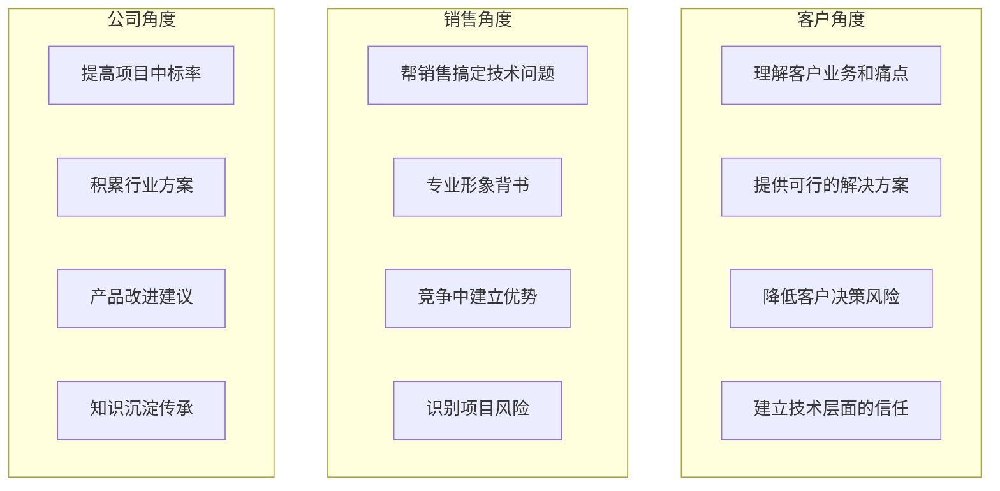
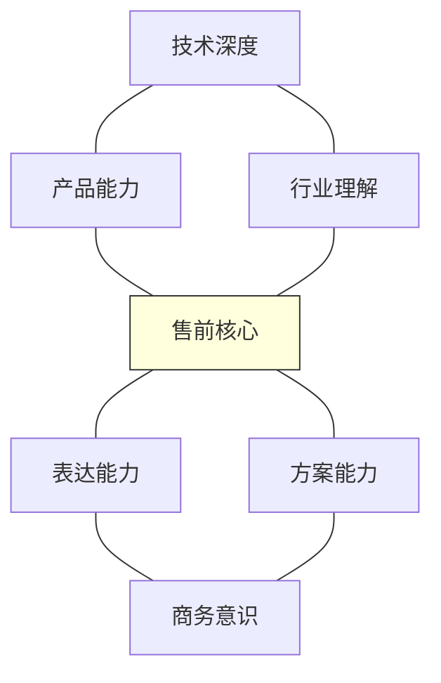
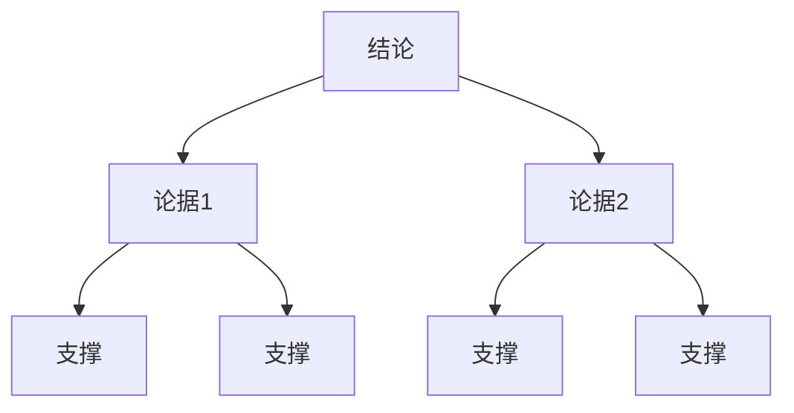
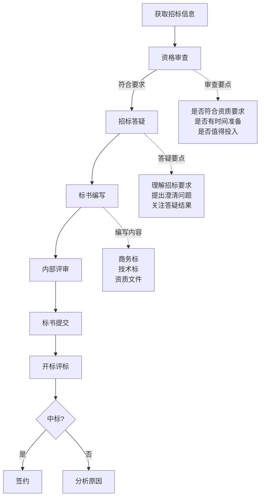

+++
title = "05.售前工作方法论"
description = "如何做好售前工作：需求调研、方案设计、演示汇报、POC实施全流程详解"
date = 2025-01-16
[taxonomies]
tags = ["pre-sales", "business", "solution", "demo", "poc"]
+++

# 售前工作方法论

## 一、售前的核心价值

### 1.1 售前是做什么的

**一句话定义**：
> 售前是用专业能力帮助销售赢单的人。

**价值体现**：



### 1.2 优秀售前的能力模型



**六大核心能力**：

| 能力 | 描述 | 表现 |
|------|------|------|
| 技术深度 | 技术原理理解透彻 | 能回答深度技术问题 |
| 产品能力 | 熟悉产品功能和价值 | 能演示、能讲价值 |
| 行业理解 | 了解客户业务 | 能说客户听得懂的话 |
| 方案能力 | 能设计解决方案 | 能写方案、能画架构 |
| 表达能力 | 能清晰表达观点 | 汇报演讲有感染力 |
| 商务意识 | 理解商业目标 | 知道什么时候该说什么 |

---

## 二、需求调研

### 2.1 需求调研的目的

搞清楚三个问题：
- **客户要什么？**（需求）
- **为什么要？**（动机）
- **能成吗？**（条件）

### 2.2 需求调研准备

**调研前准备清单**：

| 类别 | 具体内容 |
|------|----------|
| **客户背景调研** | 公司基本信息（规模、业务、发展阶段）、IT现状（现有系统、技术栈）、行业特点（监管要求、业务特性）、相关新闻（项目动态、组织变化） |
| **内部信息收集** | 销售已了解的信息、历史交互记录、相似客户案例、竞争对手情况 |
| **准备调研问题** | 开放式问题（了解背景）、封闭式问题（确认细节）、引导式问题（挖掘痛点）、假设式问题（验证判断） |

### 2.3 需求调研执行

**调研会议结构**（1-2小时）：

| 阶段 | 时间 | 内容 |
|------|------|------|
| 开场 | 5分钟 | 自我介绍、说明会议目的、确认参会人员 |
| 背景了解 | 20分钟 | 请客户介绍项目背景、了解业务现状、确认项目目标 |
| 需求挖掘 | 40分钟 | 功能需求、性能需求、非功能需求、痛点和期望 |
| 深度讨论 | 20分钟 | 重点问题深入、技术可行性探讨、方案方向沟通 |
| 总结确认 | 15分钟 | 需求要点复述、确认理解是否正确、约定下一步计划 |

**需求调研技巧**：

**SPIN提问法**：

| 类型 | 说明 | 示例问题 |
|------|------|----------|
| **S（Situation）** | 背景问题 | "目前贵司用的是什么系统？""现在团队有多少人在使用？" |
| **P（Problem）** | 难点问题 | "现在系统遇到什么问题？""哪些工作让您感到困扰？" |
| **I（Implication）** | 暗示问题 | "这个问题如果不解决，会带来什么影响？""这种情况已经持续多久了？" |
| **N（Need-payoff）** | 需求-效益问题 | "如果能解决这个问题，对您意味着什么？""理想状态应该是什么样的？" |

### 2.4 需求整理

**需求规格模板**：

```
1. 项目背景
   ├── 客户信息
   ├── 项目来源
   └── 项目目标

2. 业务需求
   ├── 业务场景描述
   ├── 用户角色
   └── 核心功能列表

3. 技术需求
   ├── 系统架构要求
   ├── 性能要求
   ├── 安全要求
   ├── 集成要求
   └── 部署要求

4. 非功能需求
   ├── 可用性
   ├── 扩展性
   ├── 运维要求
   └── 合规要求

5. 项目约束
   ├── 时间要求
   ├── 预算范围
   └── 其他约束

6. 风险识别
   └── 已识别风险点
```

---

## 三、方案设计

### 3.1 方案设计原则

**好方案的标准**：

| 维度 | 要求 |
|------|------|
| **解决问题** | 真正解决客户痛点、不是功能堆砌、有针对性 |
| **可行可信** | 技术上可实现、资源上可保障、有成功案例背书 |
| **差异化** | 与竞争对手有区别、突出自身优势、建立竞争壁垒 |
| **商务合理** | 成本在预算范围、ROI可计算、性价比突出 |

### 3.2 方案结构

**标准方案结构**：

```
1. 项目概述
   ├── 背景与目标
   ├── 需求理解
   └── 项目范围

2. 方案设计
   ├── 总体架构
   ├── 功能设计
   ├── 技术架构
   └── 部署方案

3. 实施计划
   ├── 实施方法论
   ├── 阶段划分
   ├── 里程碑
   └── 交付物

4. 项目保障
   ├── 团队配置
   ├── 风险管理
   └── 质量保证

5. 案例参考
   └── 类似项目案例

6. 报价（可选）
   └── 商务报价
```

### 3.3 方案写作技巧

**写作原则**：

```
客户视角：
├── 用客户的语言
├── 关注客户收益
├── 不要自说自话

结构清晰：
├── 逻辑层次分明
├── 先总后分
├── 重点突出

图文并茂：
├── 架构图
├── 流程图
├── 数据图表

简洁有力：
├── 每页一个核心观点
├── 减少大段文字
├── 关键信息突出
```

**架构图设计**：

好的架构图特点：
- 层次分明（应用层/服务层/数据层）
- 关系清楚（模块之间的交互）
- 重点突出（核心组件强调）
- 颜色协调（不要太花哨）
- 文字精简（能识别即可）

常用架构图类型：总体架构图、技术架构图、部署架构图、数据流图、集成架构图

### 3.4 方案评审

**内部评审checklist**：

```
□ 需求理解是否准确？
□ 方案能否解决客户问题？
□ 技术上是否可行？
□ 与竞对比有什么优势？
□ 案例是否匹配？
□ 报价是否合理？
□ 实施计划是否可行？
□ 风险是否识别并有预案？
□ 表述是否清晰易懂？
□ 格式是否规范专业？
```

---

## 四、产品演示

### 4.1 演示的目的

| 演示不是 | 演示是 |
|----------|--------|
| 展示所有功能 | 让客户看到价值 |
| 按菜单讲一遍 | 建立产品信心 |
| 证明功能都有 | 推进项目下一步 |
| - | 与竞对拉开差距 |

### 4.2 演示准备

**演示环境准备**：

| 检查项 | 具体内容 |
|--------|----------|
| **环境检查** | 演示环境可用性、数据是否匹配客户场景、网络是否稳定、是否有Plan B、所需账号和权限 |
| **设备检查** | 电脑电量、投影/视频连接、音频设备、翻页笔/指示笔、备用设备 |

**演示内容准备**：

| 类别 | 内容 |
|------|------|
| **演示脚本** | 开场白、背景铺垫、核心演示流程（3-5个场景）、亮点功能、总结收尾、Q&A准备 |
| **时间控制** | 30分钟演示：3个核心场景；60分钟演示：5个核心场景；预留提问时间；准备调整方案 |

### 4.3 演示技巧

**演示原则**：

| 原则 | 说明 |
|------|------|
| **场景化** | 不是功能点列表，是业务场景串联，是用户故事演绎 |
| **价值化** | 每个功能点都关联价值，"这个功能可以让您..."，量化收益更有说服力 |
| **互动化** | 不要独角戏，适时提问确认，观察反应调整，鼓励客户动手尝试 |

**演示话术**：

```
功能介绍公式：
"在[业务场景]下，您可以通过[产品功能]，实现[业务价值]"

示例：
"当您需要分析销售数据时，
可以通过我们的智能报表功能，
一键生成多维分析报告，
原来需要2天的工作，现在只需要5分钟"
```

### 4.4 应对演示意外

**常见意外及应对**：

| 意外情况 | 应对方法 |
|----------|----------|
| 系统崩溃 | 切换备用环境/改用PPT讲解 |
| 功能有Bug | 轻描淡写带过，记录后续解决 |
| 客户问题刁钻 | 诚实回答，不知道就记录后反馈 |
| 时间不够 | 优先演示核心场景，略过次要功能 |
| 网络问题 | 提前准备离线版本或录屏 |
| 竞对攻击 | 客观回应，突出自身优势 |

---

## 五、方案汇报

### 5.1 汇报准备

**了解汇报对象**：

谁会参加？
- 决策者（关注战略价值、ROI）
- 技术负责人（关注技术可行性）
- 业务负责人（关注业务匹配度）
- 采购（关注商务条款）
- 使用者（关注易用性）

**不同角色关注点**：

| 角色 | 关注点 |
|------|--------|
| CXO | 战略价值、投资回报、风险 |
| IT负责人 | 技术架构、运维成本、安全 |
| 业务负责人 | 业务匹配度、实施影响 |
| 项目经理 | 时间表、资源、交付 |
| 最终用户 | 易用性、培训支持 |

**汇报材料准备**：

| 类别 | 内容 |
|------|------|
| **核心PPT** | 控制在20-30页；关键页面：需求理解、方案架构、价值收益、案例；每页一个核心信息；准备附录（详细技术内容） |
| **辅助材料** | 一页纸方案摘要、案例材料、报价单（如需要）、Q&A准备文档 |

### 5.2 汇报技巧

**汇报结构（金字塔原则）**：



示例：
- "我们建议采用XX方案"（结论）
  - "因为能解决贵司XX问题"（论据1）
    - 需求匹配度分析
    - 技术可行性说明
  - "同时具有XX优势"（论据2）
    - 竞品对比
    - 成功案例
  - "投资回报清晰"（论据3）
    - TCO分析
    - ROI计算

**汇报节奏控制**：

时间分配（1小时汇报）：

| 环节 | 时间 |
|------|------|
| 开场 + 议程 | 5分钟 |
| 需求回顾 | 5分钟 |
| 方案介绍 | 25分钟 |
| 案例分享 | 10分钟 |
| 总结 + 下一步 | 5分钟 |
| Q&A | 10分钟 |

**高层汇报技巧**：

| Do | Don't |
|----|-------|
| 直接给结论，再展开细节 | 一上来就讲技术细节 |
| 用数据说话 | 用太多术语 |
| 关联业务价值 | 面面俱到没有重点 |
| 控制时间 | 超时 |
| 留足提问时间 | 回避问题 |

### 5.3 应对质疑

**常见质疑及应对**：

| 客户质疑 | 应对策略 |
|----------|----------|
| "你们的产品能做到吗？" | 展示案例 + 承诺POC验证 |
| "价格太贵了" | 强调价值 + 对比TCO |
| "我们自己开发" | 计算自研成本 + 强调专业度 |
| "竞对说他们更好" | 客观对比 + 强调差异化优势 |
| "时间来不及" | 提供快速交付方案 + 风险说明 |
| "我需要再考虑" | 确认顾虑点 + 提供更多信息 |

---

## 六、POC实施

### 6.1 POC的定位

**什么时候需要POC**：

| 需要POC的情况 | 可以不做POC的情况 |
|---------------|-------------------|
| 客户对技术可行性有疑虑 | 标准化产品，风险低 |
| 竞争激烈，需要证明能力 | 已有完全匹配的案例 |
| 大项目，客户决策谨慎 | 客户已经高度信任 |
| 新产品/新场景 | 项目规模小，成本不合算 |
| 客户明确要求 | 时间紧迫 |

### 6.2 POC规划

**POC目标设定**：

| 类别 | 要点 |
|------|------|
| **明确验证目标** | 验证什么功能？验证什么场景？成功标准是什么？如何评判通过/不通过？ |
| **POC范围控制** | 不要贪多，聚焦核心；选择最能体现价值的场景；控制在2-4周完成；明确不在范围内的内容 |

**POC方案模板**：

```
1. POC目标
   └── 验证什么，达成什么

2. POC范围
   ├── 验证功能列表
   ├── 验证场景说明
   └── 不包含内容

3. 成功标准
   ├── 功能验证通过标准
   ├── 性能验证指标
   └── 其他评估标准

4. 实施计划
   ├── 阶段划分
   ├── 时间安排
   └── 里程碑

5. 资源需求
   ├── 人员配置
   ├── 环境需求
   └── 客户配合事项

6. 交付物
   └── POC总结报告
```

### 6.3 POC执行

**POC执行要点**：

| 类别 | 要点 |
|------|------|
| **环境准备** | 搭建独立测试环境、准备测试数据、确保环境稳定、备份和恢复能力 |
| **过程管理** | 每日进展同步、问题快速响应、客户参与见证、及时调整策略、记录所有问题和解决方案 |
| **风险控制** | 识别可能的技术风险、准备应对方案、适时升级问题、管理客户预期 |

### 6.4 POC总结

**POC总结报告**：

```
1. POC概述
   ├── 背景和目标
   └── 验证范围

2. 验证结果
   ├── 功能验证结果（逐项）
   ├── 性能测试结果
   └── 问题及解决方案

3. 结论
   ├── 总体评价
   ├── 达成目标情况
   └── 遗留问题

4. 建议
   ├── 项目实施建议
   └── 后续工作计划
```

**POC汇报技巧**：

| 汇报重点 | 避免 |
|----------|------|
| 明确说"POC成功" | 过度强调困难 |
| 用数据证明结果 | 遗留太多问题 |
| 解答客户疑虑 | 没有明确结论 |
| 推动下一步行动 | 不敢要下一步 |

---

## 七、投标支持

### 7.1 投标流程

**标准投标流程**：



### 7.2 标书编写

**技术标书结构**：

```
1. 项目理解
   ├── 需求理解
   └── 项目目标

2. 技术方案
   ├── 总体架构
   ├── 功能设计
   ├── 技术实现
   └── 安全设计

3. 实施方案
   ├── 实施方法
   ├── 阶段计划
   └── 项目管理

4. 服务方案
   ├── 服务内容
   ├── 服务标准
   └── SLA承诺

5. 项目团队
   ├── 组织架构
   ├── 人员配置
   └── 关键人员简历

6. 成功案例

7. 企业资质
```

**评分关注点**：

| 分类 | 占比 | 评分要点 |
|------|------|----------|
| **技术分** | 40-60% | 方案的完整性和合理性、技术架构的先进性、功能需求的响应程度、案例的匹配度、服务承诺 |
| **商务分** | 20-40% | 报价、付款方式、交付时间 |
| **综合分** | 10-20% | 企业资质、类似项目经验、团队配置、其他加分项 |

### 7.3 投标技巧

**提高中标率的方法**：

| 阶段 | 方法 |
|------|------|
| **标前工作** | 尽早介入参与需求引导、建立技术层面的信任、让客户了解我们的优势、争取有利的技术指标 |
| **标书策略** | 完全响应招标要求、突出差异化优势、用客户的语言写作、案例选择要匹配、报价策略要合理 |
| **评标准备** | 准备演示和答辩、预判可能的问题、安排最佳人选参加、展现专业和诚意 |

---

## 八、售前工作习惯

### 8.1 日常工作管理

**售前的一天**：

高效售前的时间分配：
- **30%** 客户交互（拜访、调研、汇报）
- **30%** 方案工作（方案设计、标书编写）
- **20%** 内部协作（销售对齐、内部评审）
- **20%** 学习积累（产品学习、行业研究）

### 8.2 知识管理

**知识沉淀**：

| 类别 | 内容 |
|------|------|
| **个人知识库** | 方案模板库、竞品分析库、案例库、问答库、行业资料 |
| **团队共享** | 成功案例分享、踩坑经验分享、方案评审、新产品学习 |

### 8.3 持续提升

**售前成长路径**：

| 阶段 | 年限 | 能力要求 |
|------|------|----------|
| **初级售前** | 0-2年 | 熟悉产品功能、能完成演示、能写基本方案、跟着做项目 |
| **中级售前** | 2-5年 | 独立负责项目、能做需求调研、能设计方案、能主导POC |
| **高级售前** | 5年+ | 复杂项目操盘、行业方案专家、带新人能力、参与产品方向 |
| **售前专家** | - | 行业影响力、方案创新、战略项目支持、团队赋能 |

---

## 九、总结

### 9.1 核心观点

1. **售前本质是帮销售赢单**
   - 技术能力是基础
   - 商务意识是关键
   - 客户价值是导向

2. **每个项目都是完整的故事**
   - 需求调研 → 方案设计 → 演示汇报 → POC验证
   - 每个环节都要专业

3. **持续积累才能持续输出**
   - 知识管理
   - 案例积累
   - 行业深耕

### 9.2 售前自检清单

```
每个项目问自己：
□ 我真正理解客户需求了吗？
□ 我的方案能解决客户问题吗？
□ 我的演示展现了产品价值吗？
□ 我和销售配合默契吗？
□ 我在这个项目中学到了什么？
```

---

## 相关文章

- [上一篇：销售团队管理与组织架构](/articles/business/biz-04-销售团队管理与组织架构/)
- [下一篇：To B销售全流程详解](/articles/business/biz-06-To-B销售全流程详解/)
