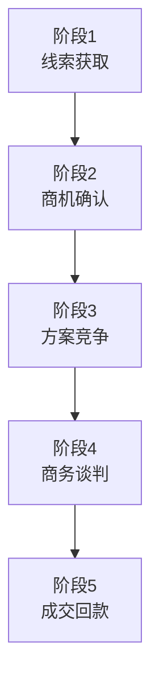
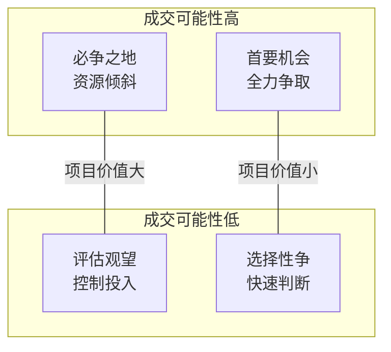

+++
title = "06.To B销售全流程详解"
description = "企业级销售从线索到回款的完整流程、关键节点与最佳实践"
date = 2025-01-16
[taxonomies]
tags = ["sales", "business", "b2b", "enterprise", "sales-process"]
+++

# To B销售全流程详解

## 一、To B销售的特点

### 1.1 To B vs To C 销售

| 维度 | To B | To C |
|------|------|------|
| 决策周期 | 长（月-年） | 短（分钟-天） |
| 决策人数 | 多（3-10人） | 少（1-2人） |
| 客单价 | 高（万-亿） | 低（元-万） |
| 决策逻辑 | 理性为主 | 感性+理性 |
| 关系重要性 | 非常重要 | 一般 |
| 售后服务 | 持续服务 | 一次性 |

### 1.2 To B销售的核心挑战

| 挑战 | 具体表现 |
|------|----------|
| **周期长** | 可能跟一年还不签、中途可能黄掉、需要持续投入 |
| **决策复杂** | 多角色参与、利益诉求不同、流程繁琐、可能有政治因素 |
| **竞争激烈** | 总有竞争对手、同质化严重、价格战常见 |
| **需求多变** | 需求可能不明确、需求可能变化、标准化难 |

---

## 二、销售全流程概览

### 2.1 标准销售流程



| 阶段 | 关键动作 |
|------|----------|
| 线索获取 | 市场线索、自主开发、转介绍 |
| 商机确认 | 需求调研、需求确认、预算确认、时间确认 |
| 方案竞争 | 方案设计、方案汇报、POC验证、答疑跟进 |
| 商务谈判 | 报价、商务谈判、合同起草、审批流程 |
| 成交回款 | 合同签署、回款跟进、客户成功 |

### 2.2 各阶段时间分配（参考）

| 阶段 | 占比 | 典型周期 | 关键动作 |
|------|------|----------|----------|
| 线索获取 | 15% | 持续 | 多渠道开发 |
| 商机确认 | 20% | 1-4周 | 深度调研 |
| 方案竞争 | 35% | 2-8周 | 方案+POC |
| 商务谈判 | 20% | 1-4周 | 价格+条款 |
| 成交回款 | 10% | 1-4周 | 签约收款 |

---

## 三、阶段1：线索获取

### 3.1 线索来源

| 类型 | 来源渠道 |
|------|----------|
| **主动获取** | 陌生电话开发、邮件/LinkedIn触达、行业活动networking、老客户转介绍、合作伙伴推荐 |
| **被动获取** | 市场活动线索、官网咨询、内容营销吸引、口碑推荐、招投标信息 |

### 3.2 线索筛选（BANT）

| 维度 | 关键问题 |
|------|----------|
| **B - Budget（预算）** | 客户有没有预算？预算大概多少？ |
| **A - Authority（决策权）** | 接触的人有没有决策权？能影响决策吗？ |
| **N - Need（需求）** | 需求是否真实存在？是否迫切？ |
| **T - Timeline（时间）** | 什么时候要做决定？什么时候上线？ |

### 3.3 线索评分

| 评分维度 | 分值 | 明细 |
|----------|------|------|
| **公司匹配度** | 30分 | 行业匹配10分、规模匹配10分、区域匹配10分 |
| **需求匹配度** | 40分 | 产品匹配15分、需求紧迫度15分、预算充足度10分 |
| **决策条件** | 30分 | 决策者接触15分、时间明确10分、竞争情况5分 |

**评分结果应用**：总分>70分重点跟进；50-70分持续培育；<50分暂时放入池子

---

## 四、阶段2：商机确认

### 4.1 商机确认目标

必须搞清楚的问题：
- 客户要解决什么问题？（需求）
- 为什么现在要做？（动机/痛点）
- 决策流程是什么？（流程）
- 谁说了算？（决策人）
- 有多少预算？（预算）
- 什么时候要用？（时间）
- 还在看哪些厂商？（竞争）
- 这事能成吗？（可行性）

### 4.2 需求调研

**首次拜访准备**：

| 阶段 | 关键动作 |
|------|----------|
| **拜访前** | 研究客户背景、了解行业趋势、准备公司介绍、准备问题清单、协调售前/产品参与 |
| **拜访中** | 建立良好开场、引导客户讲需求、多听少说、识别关键痛点、确认下一步、不要过早报价 |
| **拜访后** | 发送拜访纪要、更新CRM、内部同步信息、规划后续动作 |

**需求确认方法**：

**5W1H需求确认法**：

| 维度 | 问题 | 内容 |
|------|------|------|
| **What - 需要什么？** | 具体需求 | 具体功能需求、解决什么问题、期望效果 |
| **Why - 为什么需要？** | 驱动因素 | 业务驱动力、痛点是什么、不做会怎样 |
| **Who - 谁会使用/决策？** | 相关角色 | 使用者是谁、决策者是谁、影响者是谁、采购流程 |
| **When - 什么时间？** | 时间节点 | 什么时候开始、什么时候上线、关键时间节点 |
| **Where - 在哪里使用？** | 使用场景 | 使用场景、部署位置、规模范围 |
| **How - 如何实现/采购？** | 实现方式 | 技术要求、采购流程、预算情况 |

### 4.3 商机评估

**商机判断矩阵**：



---

## 五、阶段3：方案竞争

### 5.1 竞争策略制定

**竞争态势分析**：

**我们 vs 竞对**：

| 维度 | 内容 |
|------|------|
| **优势** | 技术领先点、案例优势、价格优势、服务优势、关系优势 |
| **劣势** | 功能缺失、品牌知名度、行业经验、本地化服务、价格劣势 |
| **策略选择** | 放大优势领域、规避或补齐劣势、改变竞争维度、设置竞争壁垒 |

**设置竞争壁垒**：

| 壁垒类型 | 策略 |
|----------|------|
| **技术壁垒** | 引导技术要求向我们倾斜、强调独特技术能力、POC验证关键能力 |
| **商务壁垒** | 打包更多价值、灵活的商务条款、长期服务承诺 |
| **关系壁垒** | 建立多层次关系、高层对接、持续客户服务 |

### 5.2 方案呈现

**方案沟通次数**：

**典型的方案沟通过程**：

| 次数 | 主题 | 内容 |
|------|------|------|
| 第1次 | 初步方案沟通 | 需求回顾、方案框架、初步报价区间、收集反馈 |
| 第2次 | 详细方案汇报 | 完整技术方案、实施计划、案例分享、解答问题 |
| 第3次 | POC/演示 | 针对性演示、POC验证、技术细节确认 |
| 第4次 | 总结汇报（可选） | POC结果、最终方案、推动决策 |

### 5.3 关键决策人攻略

**决策链全覆盖**：

**角色识别**：

| 角色类型 | 特征 | 关注点 | 策略 |
|----------|------|--------|------|
| **经济型买家（EB）** | 最终批准预算的人、通常是VP/CXO级别 | 投资回报、战略价值、风险 | 高层拜访、价值汇报 |
| **技术型买家（TB）** | 评估技术可行性的人、通常是IT负责人/架构师 | 技术能力、集成难度、运维成本 | 技术交流、POC验证 |
| **用户型买家（UB）** | 实际使用产品的人、通常是业务人员 | 易用性、效率提升、培训支持 | 演示体验、解决痛点 |
| **教练（Coach）** | 帮助你的内部人、可能是任何角色 | 提供信息、引荐、指导 | 建立信任、互利合作 |

---

## 六、阶段4：商务谈判

### 6.1 报价策略

**报价原则**：

| 维度 | 要点 |
|------|------|
| **报价时机** | 确认需求后再报价、确认预算范围后报价、了解竞争态势后报价、不要过早暴露底线 |
| **报价策略** | 初次报价留有空间、报价要有理有据、区分商务价值包、准备谈判让步空间 |

**报价构成**：

| 维度 | 内容 |
|------|------|
| **总价构成** | 产品/License费用、实施服务费用、培训费用、年度维保费用、其他费用（定制、集成等） |
| **报价呈现** | 一次性投入 vs 年度投入、分期方案、不同配置选项、清晰的价值对应 |

### 6.2 谈判技巧

**谈判准备**：

| 维度 | 问题 |
|------|------|
| **知己** | 我们的底线是什么？哪些可以让步？让步的交换条件？决策权限在谁？ |
| **知彼** | 客户的预算是多少？客户的决策流程？竞对的报价？客户最在意什么？ |

**谈判策略**：

| 策略类型 | 具体做法 |
|----------|----------|
| **让步原则** | 每次让步都要有交换、让步幅度递减、不要轻易第一个让步、让对方感到不容易、保留最后的筹码 |
| **应对还价** | 理解还价原因、不急于接受、询问预算限制、寻找替代方案、考虑非价格让步 |
| **非价格让步选项** | 延长付款周期、增加服务内容、提供培训/支持、延长免费维保、未来续约优惠、试用期/POC支持 |

### 6.3 合同谈判

**合同关注点**：

| 条款类型 | 关注点 |
|----------|--------|
| **商务条款** | 合同金额、付款方式、付款条件、发票要求、违约责任 |
| **法务条款** | 责任限制、知识产权、保密条款、争议解决、终止条款 |
| **交付条款** | 交付范围、交付时间、验收标准、质保期、服务SLA |

---

## 七、阶段5：成交回款

### 7.1 合同签署

**签约推进**：

| 阶段 | 要点 |
|------|------|
| **签约前确认** | 合同条款无异议、双方授权人确认、审批流程完成、准备签约材料 |
| **签约方式** | 现场签署、邮寄签署、电子签署、视频见证 |
| **签约后** | 合同归档、启动实施、开具发票、跟进回款 |

### 7.2 回款管理

**回款跟进**：

**回款节点**：合同签署后X日、项目验收后X日、年度维保到期前X日、其他约定时间

**回款障碍及应对**：

| 障碍 | 应对策略 |
|------|----------|
| 客户流程慢 | 提前沟通、协助推进 |
| 验收未完成 | 加快交付、灵活处理 |
| 客户资金紧张 | 了解情况、分期安排 |
| 对服务不满 | 解决问题、重建信任 |
| 联系人变更 | 重新建立关系 |

### 7.3 项目交接

**从销售到交付**：

| 维度 | 内容 |
|------|------|
| **交接内容** | 项目背景和目标、客户组织和关系、需求规格和方案、合同范围和边界、客户期望管理、已知风险提示 |
| **交接方式** | 正式交接会议、书面交接文档、关键客户引荐、实施期持续支持 |

---

## 八、销售工具与方法

### 8.1 销售漏斗管理

**漏斗阶段定义**：

| 阶段 | 定义 | 概率 |
|------|------|------|
| 线索 | 有联系信息 | 5% |
| 初步沟通 | 完成首次有效沟通 | 10% |
| 需求确认 | 明确需求、预算、时间 | 20% |
| 方案阶段 | 提交方案、演示完成 | 40% |
| POC阶段 | POC进行中或完成 | 60% |
| 商务谈判 | 报价、商务条款谈判中 | 75% |
| 口头承诺 | 客户口头同意，待走流程 | 90% |
| 签约 | 合同签署 | 100% |

**加权Pipeline计算**：

| 商机 | 金额 | 概率 | 加权金额 |
|------|------|------|----------|
| 商机1 | 100万 | 40% | 40万 |
| 商机2 | 50万 | 60% | 30万 |
| 商机3 | 200万 | 20% | 40万 |
| **加权Pipeline** | - | - | **110万** |

### 8.2 销售预测

**预测方法**：

| 方法 | 说明 |
|------|------|
| **概率加权** | 各商机金额 × 阶段概率 |
| **承诺预测** | 销售根据判断给出承诺数字 |
| **历史转化率** | 各阶段商机 × 历史转化率 |

**预测准确性改进**：定期校准概率、要求销售解释变化、区分承诺和目标、考虑季节性因素

### 8.3 CRM使用

**CRM关键信息**：

| 信息类型 | 内容 |
|----------|------|
| **客户信息** | 公司基本信息、关键联系人、组织架构、历史交互 |
| **商机信息** | 商机来源、商机阶段、预计金额、预计时间、竞争对手、下一步行动 |
| **活动记录** | 沟通记录、会议纪要、邮件往来、待办事项 |

---

## 九、常见问题与应对

### 9.1 项目推进停滞

**诊断问题**：

| 维度 | 内容 |
|------|------|
| **可能原因** | 需求优先级下降、内部政治因素、预算问题、关键人变更、竞对搅局、我们的问题 |
| **应对策略** | 直接询问客户、找到内部Coach、创造紧迫感、高层出面沟通、调整方案策略、考虑战略放弃 |

### 9.2 竞争落后

**翻盘策略**：

**确认落后程度**：还有机会则调整策略；几乎没戏则评估是否值得投入

**翻盘方法**：改变竞争维度、高层公关、价格杀手锏、制造竞对风险担忧、长期关系投资、接受失败并保持关系

### 9.3 输单分析

**输单复盘**：

**复盘内容**：什么阶段丢的？输给谁了？为什么输？我们做对了什么？我们做错了什么？下次如何避免？

**常见输单原因**：

| 原因 | 占比 |
|------|------|
| 价格 | 30% |
| 功能/技术 | 25% |
| 关系 | 20% |
| 服务/交付能力 | 15% |
| 其他 | 10% |

---

## 十、总结

### 10.1 销售流程核心

| 类型 | 要点 |
|------|------|
| **5个必须** | 必须搞清需求、必须找到决策者、必须确认预算、必须明确时间、必须知道竞争 |
| **5个不要** | 不要急于报价、不要轻信口头承诺、不要忽视竞对、不要只跟一个人、不要放弃跟进 |

### 10.2 销售自检清单

```
每个商机问自己：
□ 我知道客户要解决什么问题吗？
□ 我接触到决策者了吗？
□ 我知道预算和时间吗？
□ 我知道竞争对手是谁吗？
□ 客户为什么选择我们？
□ 这个项目下一步是什么？
□ 什么可能导致项目失败？
□ 我需要什么资源支持？
```

---

## 相关文章

- [上一篇：售前工作方法论](/articles/business/biz-05-售前工作方法论/)
- [下一篇：销售谈判与成单技巧](/articles/business/biz-07-销售谈判与成单技巧/)
