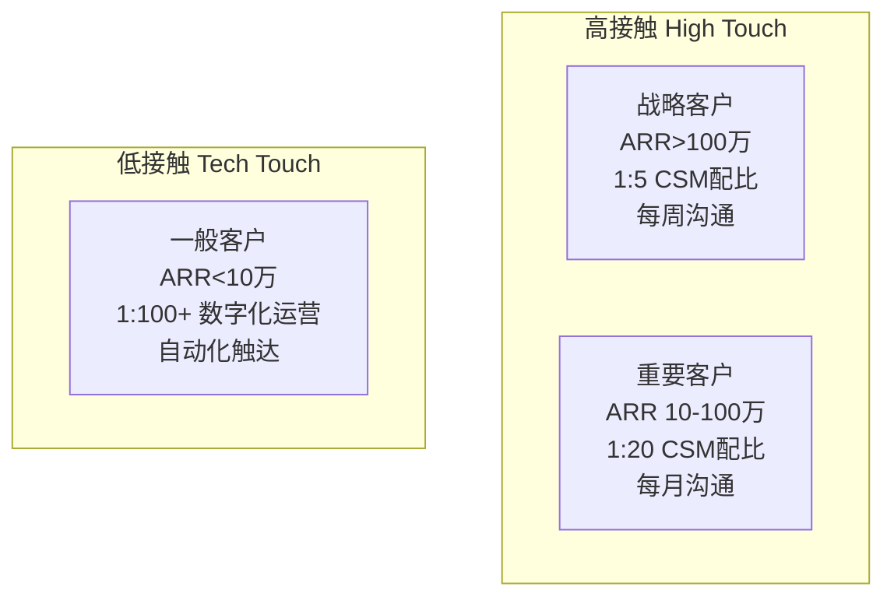

+++
title = "客户成功与续约管理"
description = "从签约到续约：客户成功体系搭建、客户健康度管理、续约增购策略"
date = 2025-01-16
weight = 8000
[taxonomies]
tags = ["sales", "business", "customer-success", "renewal", "retention"]
+++

# 客户成功与续约管理

## 一、客户成功的价值

### 1.1 为什么需要客户成功

**SaaS/订阅模式的经济学**：

```
传统软件模式：
├── 一次性收入为主
├── 签约即完成大部分价值
└── 售后主要是维护

订阅/SaaS模式：
├── 持续收入模式
├── 首年可能不赚钱
├── 客户留存决定盈利
└── LTV（客户终身价值）是核心指标
```

**客户成功的价值**：

```
直接价值：
├── 提高续约率（减少流失）
├── 促进增购（扩大收入）
├── 获取转介绍（低成本获客）
└── 积累案例（品牌背书）

间接价值：
├── 产品反馈（改进产品）
├── 市场洞察（了解需求）
├── 竞争情报（知己知彼）
└── 口碑传播（品牌价值）
```

### 1.2 关键指标

**客户成功核心指标**：

| 指标 | 定义 | 目标参考 |
|------|------|----------|
| 续约率 | 续约客户数/到期客户数 | >90% |
| 金额续约率 | 续约金额/到期金额 | >100%（含增购） |
| NRR（净收入留存） | (续约+增购-流失)/期初收入 | >110% |
| Churn Rate | 流失率 | <10% |
| NPS | 净推荐值 | >50 |
| 客户健康度 | 综合健康评分 | >80分 |

---

## 二、客户成功体系

### 2.1 客户成功组织

**团队定位**：

```
客户成功 vs 客服 vs 销售：

客服（Support）：
├── 被动响应
├── 解决问题
└── 保障满意

客户成功（CS）：
├── 主动服务
├── 创造价值
└── 驱动增长

销售（Sales）：
├── 获取新客
├── 完成签约
└── 交接给CS

         签约
          │
    销售 →│→ 客户成功
          │
         长期价值
```

**组织架构**：

```
客户成功VP
├── 高级CSM团队
│   └── 负责大客户（ARR>100万）
│
├── CSM团队
│   └── 负责中型客户（ARR 10-100万）
│
├── 数字化成功团队
│   └── 负责长尾客户（ARR<10万）
│   └── 通过自动化+社群运营
│
├── 实施/交付团队
│   └── 新客户上线实施
│
└── 续约/增购专员
    └── 专职续约谈判
```

### 2.2 客户分层管理

**客户分层模型**：



**不同层级的服务内容**：

| 层级 | 服务内容 | 沟通频率 |
|------|----------|----------|
| 战略客户 | 专属CSM、QBR、高管对接、定制支持 | 每周 |
| 重要客户 | 命名CSM、定期Review、培训支持 | 每月 |
| 一般客户 | 共享CSM、自助服务、社群支持 | 按需 |
| 长尾客户 | 数字化运营、自动化触达、在线支持 | 自动化 |

---

## 三、客户生命周期管理

### 3.1 客户旅程

```
签约 → 实施 → 上线 → 使用 → 价值实现 → 续约 → 增购
 │      │      │      │        │        │      │
 ↓      ↓      ↓      ↓        ↓        ↓      ↓
交接   部署   培训   支持    评估     谈判   扩展
       配置   验收   优化    案例     签约   深化
```

### 3.2 各阶段关键动作

**阶段1：客户交接（签约后1周）**

```
交接内容：
├── 客户背景和需求
├── 决策链和关系
├── 合同范围和边界
├── 客户期望
├── 已知风险
└── 关键里程碑

交接会议：
├── 销售、售前、CSM参与
├── 客户关键人引荐
├── 明确后续责任
└── 建立沟通群组
```

**阶段2：实施上线（1-3个月）**

```
实施目标：
├── 按时上线
├── 达到验收标准
├── 培训到位
└── 客户满意

关键动作：
├── 制定详细实施计划
├── 定期进度同步
├── 问题快速响应
├── 客户期望管理
├── 组织验收会议
└── 收集初始反馈
```

**阶段3：价值实现（持续）**

```
价值实现检查：
├── 客户目标是否达成？
├── 使用情况如何？
├── 遇到什么问题？
├── 还有什么需求？
└── 满意度如何？

主动服务：
├── 使用数据分析
├── 最佳实践分享
├── 定期培训
├── 产品更新通知
└── 健康度检查
```

**阶段4：续约管理（到期前3-6月）**

```
续约准备：
├── 评估客户健康度
├── 梳理使用价值
├── 识别风险点
├── 制定续约策略
└── 准备续约方案

续约执行：
├── 提前沟通意向
├── 价值回顾汇报
├── 解决遗留问题
├── 谈判续约条款
└── 完成签约
```

---

## 四、客户健康度管理

### 4.1 健康度评估模型

**健康度维度**：

```
客户健康度 = 
    产品使用（40%）
  + 关系互动（25%）
  + 商务状态（20%）
  + 支持满意（15%）
```

**详细评分标准**：

```
产品使用（40分）：
├── 活跃用户占比（10分）
├── 功能使用深度（10分）
├── 登录频率（10分）
└── 核心功能使用（10分）

关系互动（25分）：
├── 沟通频率（10分）
├── 响应积极性（8分）
└── 高层关系（7分）

商务状态（20分）：
├── 付款及时性（10分）
├── 续约意向（5分）
└── 增购潜力（5分）

支持满意（15分）：
├── 工单解决率（5分）
├── 响应满意度（5分）
└── NPS评分（5分）
```

### 4.2 健康度分级

```
健康度等级：

90-100分：非常健康（绿色）
├── 续约风险：极低
├── 增购可能：高
└── 策略：维护+增购

70-89分：健康（黄绿）
├── 续约风险：低
├── 增购可能：中
└── 策略：提升使用

50-69分：亚健康（黄色）
├── 续约风险：中
├── 增购可能：低
└── 策略：主动干预

30-49分：不健康（橙色）
├── 续约风险：高
├── 增购可能：无
└── 策略：紧急挽救

<30分：危险（红色）
├── 续约风险：极高
├── 可能流失
└── 策略：高层介入
```

### 4.3 预警与干预

**风险预警信号**：

```
使用层面：
├── 活跃用户大幅下降
├── 核心功能不再使用
├── 长期未登录
└── 使用量下降

关系层面：
├── 对接人不回复
├── 关键人变动
├── 拒绝沟通
└── 负面反馈

商务层面：
├── 付款延迟
├── 明确不续约
├── 预算削减
└── 组织变动
```

**干预措施**：

| 风险等级 | 干预措施 |
|----------|----------|
| 黄色预警 | CSM主动沟通、了解问题、制定改进计划 |
| 橙色预警 | 经理介入、问题升级、制定挽救方案 |
| 红色预警 | 高层出面、资源倾斜、极限挽救 |

---

## 五、续约策略

### 5.1 续约准备

**续约时间线**：

```
到期前6个月：
├── 健康度评估
├── 识别风险点
├── 制定策略

到期前4个月：
├── 启动续约沟通
├── 价值回顾
├── 了解意向

到期前2个月：
├── 正式续约谈判
├── 条款确认
├── 合同准备

到期前1个月：
├── 合同签署
├── 发票开具

到期：
├── 完成续约
└── 开始新周期
```

### 5.2 续约谈判

**续约价值回顾**：

```
价值汇报框架：
├── 业务目标回顾
│   └── 当初为什么买？
│
├── 价值实现盘点
│   └── 达成了什么效果？
│   └── 用数据说话
│
├── 使用情况分析
│   └── 用了哪些功能？
│   └── 用户活跃情况
│
├── 未来价值展望
│   └── 还能创造什么价值？
│   └── 新功能/新场景
│
└── 续约方案建议
    └── 推荐续约选项
```

**续约定价策略**：

```
涨价策略：
├── 价值大于价格时可涨价
├── 提前沟通涨价预期
├── 涨价幅度要有理有据
├── 可用长期合约锁定
└── 提供增量价值对应涨价

保价策略：
├── 市场竞争激烈时
├── 客户关系不稳定时
├── 有流失风险时
└── 战略客户维护

降价策略（谨慎）：
├── 客户明确有流失风险
├── 使用量确实减少
├── 市场价格下降
└── 换取更长期限
```

### 5.3 流失挽回

**流失原因分析**：

```
常见流失原因：
├── 产品不满足需求（30%）
├── 价格太贵（25%）
├── 服务不满意（15%）
├── 使用率低（15%）
├── 组织变动（10%）
└── 其他（5%）
```

**挽回策略**：

```
针对不同原因的挽回：

产品问题：
├── 了解具体需求差距
├── 承诺产品改进计划
├── 提供替代解决方案
└── 特殊定制支持

价格问题：
├── 重新算ROI
├── 提供灵活方案
├── 适度价格让步
└── 增加服务价值

服务问题：
├── 真诚道歉
├── 立即改进
├── 升级服务等级
└── 高层出面

使用率低：
├── 加强培训
├── 派驻支持
├── 简化使用
└── 激励措施
```

---

## 六、增购策略

### 6.1 增购机会识别

**增购类型**：

```
扩展型增购：
├── 更多用户/账号
├── 更多业务部门
├── 更多地区/分支
└── 更大容量/规模

升级型增购：
├── 更高版本
├── 更多功能模块
├── 更好的服务
└── 更长的合约

交叉型增购：
├── 其他产品线
├── 配套服务
├── 生态产品
└── 合作伙伴产品
```

**增购信号**：

```
业务信号：
├── 公司扩张（招聘、融资、并购）
├── 新业务上线
├── 数字化战略
└── 预算增加

使用信号：
├── 使用量接近上限
├── 新部门开始试用
├── 频繁咨询新功能
└── 提出新需求

关系信号：
├── 满意度高
├── 主动推荐
├── 高层认可
└── 长期合作意愿
```

### 6.2 增购推动

**增购策略**：

```
时机选择：
├── 客户满意度高时
├── 业务增长时
├── 预算周期前
├── 合同到期前
└── 项目成功时

推动方法：
├── 分享成功案例
├── 展示新功能价值
├── 量化增购ROI
├── 提供优惠激励
├── 高层沟通推动
└── 利用Coach影响
```

---

## 七、客户成功运营

### 7.1 QBR（季度业务回顾）

**QBR结构**：

```
QBR议程（60-90分钟）：

1. 回顾上季度（20分钟）
   ├── 目标达成情况
   ├── 关键指标回顾
   └── 价值实现盘点

2. 使用分析（15分钟）
   ├── 使用数据分析
   ├── 最佳实践分享
   └── 改进建议

3. 问题解决（15分钟）
   ├── 遗留问题处理
   ├── 新需求讨论
   └── 反馈收集

4. 下季度规划（20分钟）
   ├── 客户业务计划
   ├── 产品路线图
   └── 合作计划

5. 开放讨论（10分钟）
   └── Q&A、其他话题
```

### 7.2 客户社群运营

**社群类型**：

```
用户社群：
├── 产品使用交流
├── 最佳实践分享
├── 问题互助
└── 新功能反馈

行业社群：
├── 行业交流
├── 标杆分享
├── 专家对话
└── 资源对接

精英社群：
├── 核心客户
├── 高端活动
├── 专属服务
└── 深度合作
```

### 7.3 数字化客户成功

**自动化触达**：

```
生命周期自动化：
├── 签约后欢迎邮件
├── 上线后使用引导
├── 定期健康检查
├── 续约提醒
└── 节日问候

行为触发自动化：
├── 长期未登录提醒
├── 使用量下降预警
├── 新功能推荐
├── 使用技巧分享
└── 满意度调查
```

---

## 八、总结

### 8.1 客户成功核心

```
一个中心：客户价值实现

两个抓手：
├── 健康度管理
└── 生命周期运营

三个目标：
├── 续约率>90%
├── NRR>110%
└── NPS>50

四个关键动作：
├── 交接做好
├── 实施做透
├── 价值做实
└── 续约做早
```

### 8.2 CSM自检清单

```
每个客户问自己：
□ 客户的业务目标是什么？
□ 客户实现价值了吗？
□ 客户健康度如何？
□ 有什么风险信号？
□ 续约策略是什么？
□ 增购机会在哪里？
□ 客户关系如何？
□ 下一步行动是什么？
```

---

## 相关文章

- [上一篇：销售谈判与成单技巧](@/articles/business/biz-07-销售谈判与成单技巧.md)
- [下一篇：渠道销售与伙伴管理](@/articles/business/biz-09-渠道销售与伙伴管理.md)
