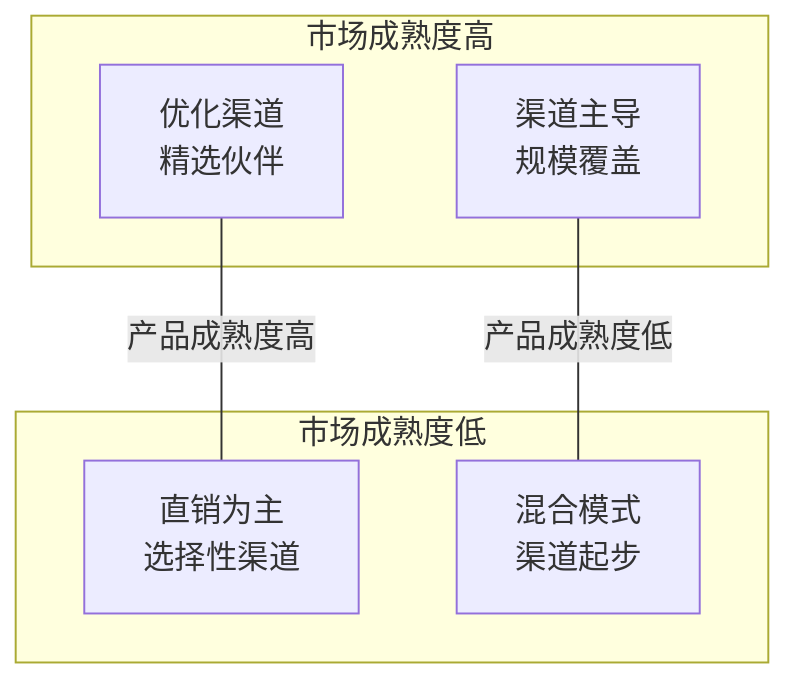
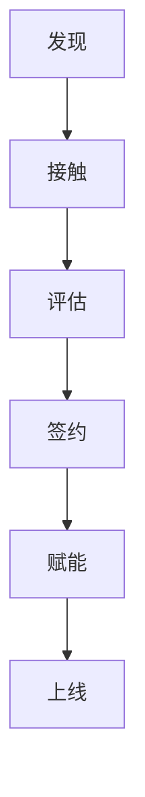

+++
title = "渠道销售与伙伴管理"
description = "渠道体系搭建、合作伙伴管理、渠道冲突处理与渠道激励"
date = 2025-01-16
weight = 9000
[taxonomies]
tags = ["sales", "business", "channel", "partner", "reseller"]
+++

# 渠道销售与伙伴管理

## 一、渠道销售概述

### 1.1 为什么需要渠道

**直销 vs 渠道**：

| 维度 | 直销 | 渠道 |
|------|------|------|
| 控制力 | 强 | 弱 |
| 成本 | 固定成本高 | 变动成本为主 |
| 覆盖范围 | 有限 | 广泛 |
| 客户关系 | 直接 | 间接 |
| 利润 | 高 | 让利给渠道 |
| 扩展速度 | 慢 | 快 |

**渠道的价值**：

| 价值类型 | 具体内容 |
|----------|----------|
| **覆盖价值** | 覆盖直销触达不了的市场、区域市场本地化覆盖、行业垂直深耕、中小客户下沉 |
| **能力价值** | 行业Know-how、实施交付能力、客户关系资源、本地化服务 |
| **成本价值** | 变动成本结构、风险共担、资源杠杆、快速扩张 |

### 1.2 渠道类型

**渠道类型**：

| 类型 | 特点 | 示例 |
|------|------|------|
| **代理商（Reseller）** | 转售产品、赚取差价、门槛较低、数量较多 | - |
| **增值代理商（VAR）** | 产品+服务打包、提供增值服务、有一定能力、价值较高 | - |
| **系统集成商（SI）** | 整体解决方案、项目总包、技术能力强、客户关系深 | 神州数码、软通动力 |
| **ISV（独立软件商）** | 基于平台开发、行业解决方案、产品形态 | 行业软件厂商 |
| **战略合作伙伴** | 深度战略合作、联合解决方案、共同市场推广 | 云厂商、咨询公司 |

---

## 二、渠道体系建设

### 2.1 渠道策略制定

**渠道策略矩阵**：



**渠道策略选择**：

| 策略 | 适用场景 | 优点 | 缺点 |
|------|----------|------|------|
| **独家代理** | 新市场开拓、需要深耕 | 伙伴积极性高 | 依赖单一伙伴风险 |
| **选择性分销** | 成熟市场、需要竞争 | 覆盖广、有竞争 | 可能有冲突 |
| **密集分销** | 标准化产品、SMB市场 | 覆盖最大化 | 管理难、价格乱 |

### 2.2 渠道分级体系

**伙伴分级示例**：

| 级别 | 年销售额 | 认证人数 | 权益 | 责任 |
|------|----------|----------|------|------|
| **钻石伙伴** | >1000万 | >10人 | 最优折扣、专属支持、MDF | 销售指标、市场活动 |
| **金牌伙伴** | 300-1000万 | >5人 | 优惠折扣、优先支持 | 销售指标 |
| **银牌伙伴** | 100-300万 | >2人 | 标准折扣、标准支持 | 销售指标 |
| **注册伙伴** | <100万 | >1人 | 基础折扣 | 完成认证 |

### 2.3 渠道政策设计

**价格政策**：

**折扣体系**：渠道采购价（折扣）、建议零售价（MSRP）、最低销售价（MAP）、项目特价（报备申请）

**示例**（MSRP：100万）：

| 伙伴级别 | 采购价 | 折扣 |
|----------|--------|------|
| 钻石伙伴 | 60万 | 6折 |
| 金牌伙伴 | 65万 | 6.5折 |
| 银牌伙伴 | 70万 | 7折 |
| 注册伙伴 | 75万 | 7.5折 |

**返利政策**：

| 返利类型 | 说明 | 示例 |
|----------|------|------|
| 销售返利 | 按销售额返点 | 销售额的3% |
| 增长返利 | 超额完成奖励 | 超额部分5% |
| 新客返利 | 开发新客户奖励 | 首单额外2% |
| 市场返利 | 配合市场活动奖励 | 季度达标额外奖励 |

---

## 三、伙伴招募与发展

### 3.1 伙伴画像

**理想伙伴特征**：

| 维度 | 具体要求 |
|------|----------|
| **能力维度** | 行业经验和客户资源、销售团队规模和能力、技术/实施能力、服务能力、财务实力 |
| **意愿维度** | 合作意愿强、认可产品价值、愿意投入资源、长期合作视角、管理层支持 |
| **匹配维度** | 产品互补、客户群匹配、区域/行业匹配、文化匹配、战略对齐 |

### 3.2 伙伴招募

**招募渠道**：

| 类型 | 渠道 |
|------|------|
| **主动招募** | 行业会议/展会、定向邀约、销售团队推荐、现有伙伴推荐、猎头服务 |
| **被动招募** | 官网渠道入口、行业口碑、市场活动、内容营销 |

**招募流程**：



**评估要点**：公司背景调查、能力评估、意愿确认、商务条款谈判、风险评估

### 3.3 伙伴赋能

**赋能体系**：

| 类别 | 内容 |
|------|------|
| **产品培训** | 产品功能培训、技术培训、认证考试、持续更新 |
| **销售赋能** | 销售方法论、竞争分析、案例分享、销售工具包、联合拜访 |
| **市场支持** | 市场物料、联合活动、MDF支持、品牌授权、案例包装 |

---

## 四、渠道日常管理

### 4.1 渠道经理职责

**渠道经理角色**：

| 角色 | 职责 |
|------|------|
| **对外（伙伴侧）** | 伙伴关系维护、销售机会推动、问题协调解决、培训赋能、市场活动 |
| **对内（公司侧）** | 渠道业绩达成、伙伴管理、政策执行、资源协调、数据分析 |

### 4.2 项目报备管理

**报备机制**：

**报备流程**：伙伴发现商机 → 提交报备 → 厂商审核 → 报备生效 → 保护期

**报备信息**：客户信息、项目信息、预计金额、预计时间、竞争情况、需要支持

**报备规则**：
- 先报先得
- 保护期限（通常3-6个月）
- 可延期申请
- 超期失效
- 虚假报备处罚

### 4.3 销售协同

**联合销售模式**：

| 模式 | 说明 | 利益分配 |
|------|------|----------|
| **伙伴主导** | 伙伴负责客户关系和销售，厂商提供售前/技术支持 | 伙伴买断或分成 |
| **厂商主导** | 厂商负责销售和技术，伙伴提供客户资源或服务 | 支付推荐费或服务费 |
| **联合销售** | 双方共同参与，各发挥优势 | 按贡献分成 |

---

## 五、渠道冲突管理

### 5.1 冲突类型

| 冲突类型 | 具体表现 |
|----------|----------|
| **渠道与直销冲突** | 客户归属争议、价格竞争、资源竞争 |
| **渠道之间冲突** | 抢客户、价格战、跨区域销售、恶意竞争 |
| **渠道与厂商冲突** | 政策不满、支持不足、利益分配、信任问题 |

### 5.2 冲突预防

**预防机制**：

| 类别 | 措施 |
|------|------|
| **规则清晰** | 明确直销/渠道边界、客户归属规则、报备保护规则、价格管控规则、违规处罚规则 |
| **区域保护** | 地理区域划分、行业归属划分、客户规模划分、独家/非独家明确 |
| **利益对齐** | 合理的利润空间、公平的政策、及时的激励、透明的规则 |

### 5.3 冲突处理

**处理原则**：

| 原则 | 说明 |
|------|------|
| 规则优先 | 按既定规则处理 |
| 客户利益优先 | 以客户体验为先 |
| 公平公正 | 一视同仁 |
| 快速处理 | 不拖延、不扩大 |

**处理流程**：

```
1. 了解情况
   ├── 听取双方说法
   └── 收集证据

2. 依规判断
   ├── 对照规则
   └── 分析责任

3. 协调解决
   ├── 双方沟通
   └── 寻求共识

4. 最终裁决
   ├── 必要时厂商裁决
   └── 执行结果

5. 规则完善
   └── 避免类似冲突
```

---

## 六、渠道绩效管理

### 6.1 绩效指标

**伙伴考核指标**：

| 指标类别 | 具体指标 |
|----------|----------|
| **销售指标** | 销售额、销售增长率、新客户数、续约率 |
| **能力指标** | 认证人数、培训完成率、项目交付质量、客户满意度 |
| **合规指标** | 价格合规、报备合规、品牌使用合规、政策遵守 |

### 6.2 绩效评估

**季度/年度评估**：

| 评估内容 | 结果应用 |
|----------|----------|
| 销售完成率 | 伙伴等级升降 |
| 增长情况 | 返利结算 |
| 能力建设 | 资源倾斜 |
| 合规情况 | 政策调整 |
| 合作态度 | 合作续签 |

### 6.3 激励体系

**激励类型**：

| 类型 | 具体方式 |
|------|----------|
| **物质激励** | 返利返点、项目奖励、市场费用、培训资源、硬件奖励 |
| **精神激励** | 伙伴大会表彰、等级晋升、优先权益、专属活动、媒体曝光 |
| **发展激励** | 新产品优先、联合解决方案、战略合作机会、能力提升支持、业务扩展支持 |

---

## 七、渠道运营活动

### 7.1 伙伴大会

**年度伙伴大会**：

| 维度 | 内容 |
|------|------|
| **大会内容** | 公司战略发布、产品路线图、政策宣贯、优秀伙伴表彰、案例分享、培训赋能、networking |
| **大会价值** | 政策传达、关系维护、标杆树立、士气激励、信息收集 |

### 7.2 联合市场活动

**活动类型**：

| 类型 | 内容 |
|------|------|
| **联合办会** | 行业研讨会、产品发布会、客户沙龙、技术交流 |
| **联合参展** | 行业展会联合参展、统一形象、资源共享 |
| **联合营销** | 联合内容输出、联合案例包装、联合推广传播、线索共享 |

### 7.3 MDF管理

**市场发展基金（MDF）**：

| 项目 | 内容 |
|------|------|
| **MDF用途** | 市场活动、客户拜访、培训认证、营销物料、展会参与 |
| **申请流程** | 伙伴提交计划 → 渠道经理审核 → 执行活动 → 提交报告 → 费用结算 |
| **注意事项** | 提前申请、专款专用、效果评估、按规报销 |

---

## 八、总结

### 8.1 渠道管理核心

| 维度 | 要点 |
|------|------|
| **三个基础** | 清晰的政策规则、合理的利益分配、有效的赋能体系 |
| **三个关键** | 选对伙伴、赋能到位、激励有效 |
| **三个平衡** | 直销与渠道平衡、控制与灵活平衡、短期与长期平衡 |

### 8.2 渠道经理自检

```
每个伙伴问自己：
□ 伙伴的销售完成情况如何？
□ 伙伴的能力建设如何？
□ 伙伴遇到什么困难？
□ 有什么支持可以提供？
□ 伙伴关系健康吗？
□ 有什么风险需要关注？
□ 下一步行动是什么？
```

---

## 相关文章

- [上一篇：客户成功与续约管理](@/articles/business/biz-08-客户成功与续约管理.md)
- [下一篇：商业分析与决策](@/articles/business/biz-10-商业分析与决策.md)
