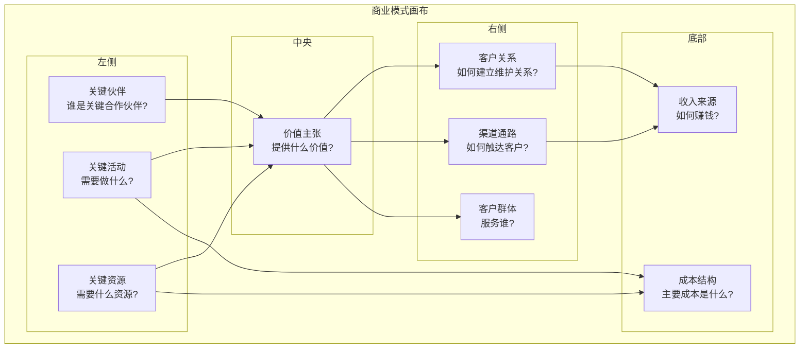
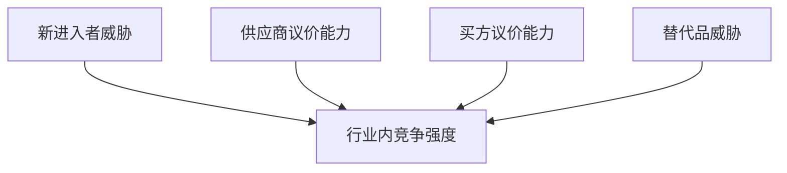

+++
title = "10.商业分析与决策"
description = "商业模式分析、市场分析、竞争分析与商业决策框架"
date = 2025-01-16
[taxonomies]
tags = ["business", "analysis", "strategy", "decision-making", "market"]
+++

# 商业分析与决策

## 一、商业模式分析

### 1.1 商业模式画布

**九大构成要素**：



### 1.2 常见商业模式

**To B软件商业模式**：

```
模式1：License销售
├── 一次性授权费
├── 年度维保费
├── 传统软件模式
└── 如：Oracle、SAP

模式2：SaaS订阅
├── 按年/月订阅
├── 持续收入
├── 云交付
└── 如：Salesforce、Slack

模式3：平台生态
├── 平台+应用商店
├── 开发者生态
├── 分成模式
└── 如：Salesforce、钉钉

模式4：项目制
├── 按项目收费
├── 定制开发
├── 实施服务
└── 如：SI公司

模式5：混合模式
├── 产品+服务
├── 订阅+增值
├── 多收入来源
└── 大多数公司
```

### 1.3 商业模式评估

**评估维度**：

| 维度 | 评估要点 |
|------|----------|
| 可扩展性 | 边际成本是否递减？能否规模化？ |
| 可持续性 | 收入是否可持续？护城河是什么？ |
| 盈利性 | 毛利率？客户获取成本？LTV/CAC？ |
| 现金流 | 回款周期？现金流健康度？ |
| 防御性 | 竞争壁垒？客户粘性？ |

---

## 二、市场分析

### 2.1 市场规模估算

**TAM/SAM/SOM模型**：

```
TAM（Total Addressable Market）
└── 总可及市场：假设100%市占率的最大市场

SAM（Serviceable Addressable Market）
└── 可服务市场：能够触达的目标市场

SOM（Serviceable Obtainable Market）
└── 可获得市场：短期内可争取的市场份额
```

**估算方法**：

```
自上而下：
├── 总市场规模
├── × 相关行业占比
├── × 目标客户占比
├── × 产品覆盖率
└── = 可及市场

自下而上：
├── 目标客户数量
├── × 渗透率
├── × 客单价
└── = 市场规模
```

### 2.2 市场趋势分析

**PEST分析**：

```
P（Political）政治因素：
├── 政策法规
├── 政府支持
├── 行业监管
└── 国际关系

E（Economic）经济因素：
├── 经济周期
├── 行业增速
├── 企业预算
└── 技术投资

S（Social）社会因素：
├── 人口变化
├── 消费习惯
├── 技术接受度
└── 工作方式

T（Technology）技术因素：
├── 技术趋势
├── 技术成熟度
├── 替代技术
└── 创新速度
```

### 2.3 行业分析

**波特五力模型**：



**行业吸引力评估**：

| 因素 | 高吸引力 | 低吸引力 |
|------|----------|----------|
| 市场增速 | 快速增长 | 停滞/下降 |
| 竞争强度 | 分散、差异化 | 集中、同质化 |
| 进入壁垒 | 高（保护现有者） | 低（威胁大） |
| 买方议价 | 弱 | 强 |
| 利润水平 | 高毛利 | 低毛利 |

---

## 三、竞争分析

### 3.1 竞争对手识别

**竞对分类**：

```
直接竞对：
├── 产品形态相似
├── 目标客户相同
├── 直接争夺市场
└── 如：Salesforce vs Dynamics

间接竞对：
├── 解决相同问题
├── 不同产品形态
├── 可相互替代
└── 如：CRM vs 自建系统

潜在竞对：
├── 相邻领域玩家
├── 可能进入市场
├── 需要关注
└── 如：云厂商做SaaS
```

### 3.2 竞对分析框架

**竞对分析维度**：

```
产品分析：
├── 功能对比
├── 技术架构
├── 产品路线图
├── 用户体验
└── 价格策略

市场分析：
├── 市场份额
├── 目标客户
├── 行业覆盖
├── 区域覆盖
└── 增长速度

营销分析：
├── 品牌定位
├── 营销策略
├── 渠道策略
├── 获客方式
└── 客户案例

组织分析：
├── 公司规模
├── 融资情况
├── 管理团队
├── 组织架构
└── 战略动向
```

### 3.3 竞争定位

**定位策略**：

```
差异化定位：
├── 找到独特优势
├── 放大差异化
├── 占领心智
└── 如：最安全、最易用

聚焦定位：
├── 聚焦细分市场
├── 深度服务
├── 专业形象
└── 如：聚焦金融行业

挑战者定位：
├── 挑战领导者
├── 差异化进攻
├── 价格策略
└── 如：对标Salesforce

跟随者定位：
├── 跟随领导者
├── 差异化补充
├── 成本优势
└── 风险较低
```

---

## 四、客户分析

### 4.1 客户细分

**细分维度**：

```
企业特征：
├── 行业
├── 规模（员工、收入）
├── 地域
├── 发展阶段
└── 技术成熟度

购买特征：
├── 预算规模
├── 决策流程
├── 采购周期
├── 对价格敏感度
└── 品牌偏好

需求特征：
├── 核心需求
├── 痛点程度
├── 期望价值
└── 功能要求
```

### 4.2 客户价值分析

**RFM模型**：

```
R（Recency）：最近一次购买时间
├── 越近越好

F（Frequency）：购买频率
├── 越频繁越好

M（Monetary）：消费金额
├── 越高越好

客户分类：
├── 高R高F高M：重要价值客户
├── 高R高F低M：重要发展客户
├── 低R高F高M：重要挽留客户
├── 低R低F高M：重要保持客户
└── 低R低F低M：一般客户
```

**客户生命周期价值（LTV）**：

```
LTV计算：
LTV = ARPA × 客户生命周期 × 毛利率

示例：
├── ARPA（年均收入）：10万
├── 平均客户生命周期：5年
├── 毛利率：70%
└── LTV = 10万 × 5 × 70% = 35万

LTV/CAC应该>3：
├── CAC（获客成本）应<11.7万
└── 回收期应<12-18个月
```

---

## 五、财务分析基础

### 5.1 核心财务指标

**收入指标**：

```
ARR（年度经常性收入）：
└── 订阅收入的年化值

MRR（月度经常性收入）：
└── 订阅收入的月度值

NRR（净收入留存率）：
└── (期初ARR + 增购 - 流失) / 期初ARR
└── 优秀SaaS应>110%

GRR（毛收入留存率）：
└── (期初ARR - 流失) / 期初ARR
└── 优秀SaaS应>90%
```

**效率指标**：

```
CAC（客户获取成本）：
└── 销售市场费用 / 新增客户数

CAC回收期：
└── CAC / (ARPA × 毛利率)
└── 健康值：<12-18个月

LTV/CAC：
└── 客户终身价值 / 获客成本
└── 健康值：>3

Magic Number：
└── 新增ARR / 上季度销售市场费用
└── >1表示获客效率好
```

### 5.2 盈利分析

**利润层次**：

```
收入
 - 产品成本
─────────────
= 毛利（Gross Profit）
 - 销售费用
 - 研发费用
 - 管理费用
─────────────
= 营业利润（Operating Profit）
 - 财务费用
 - 税费
─────────────
= 净利润（Net Profit）
```

**SaaS公司关键比率**：

| 指标 | 优秀水平 |
|------|----------|
| 毛利率 | >70% |
| 销售效率（S&M%收入） | <50% |
| 研发投入（R&D%收入） | 15-25% |
| 管理费用（G&A%收入） | <15% |

---

## 六、决策框架

### 6.1 决策流程

**结构化决策流程**：

```
1. 定义问题
   ├── 问题是什么？
   ├── 为什么重要？
   └── 决策目标？

2. 收集信息
   ├── 需要什么信息？
   ├── 信息来源？
   └── 信息可靠性？

3. 制定方案
   ├── 可能的选项？
   ├── 创新方案？
   └── 限制条件？

4. 评估方案
   ├── 利弊分析
   ├── 风险评估
   └── 成本收益

5. 做出决策
   ├── 选择最优方案
   ├── 明确行动计划
   └── 分配责任

6. 执行复盘
   ├── 执行跟踪
   ├── 效果评估
   └── 经验总结
```

### 6.2 决策工具

**SWOT分析**：

| | 有利 | 不利 |
|------|------|------|
| **内部** | Strengths 优势 | Weaknesses 劣势 |
| **外部** | Opportunities 机会 | Threats 威胁 |

战略选择：
- SO策略：利用优势抓住机会
- WO策略：克服劣势抓住机会
- ST策略：利用优势应对威胁
- WT策略：减少劣势避免威胁

**决策矩阵**：

方案评估矩阵：

| 评估维度 | 权重 | 方案A | 方案B | 方案C |
|----------|------|-------|-------|-------|
| 收入潜力 | 30% | 8 | 6 | 7 |
| 实施难度 | 25% | 6 | 8 | 7 |
| 风险水平 | 20% | 7 | 9 | 6 |
| 资源需求 | 15% | 5 | 7 | 8 |
| 战略匹配 | 10% | 9 | 6 | 7 |
| **加权得分** | | **6.85** | **7.15** | **6.95** |

结论：选择方案B

### 6.3 风险决策

**风险评估矩阵**：

| | 影响程度低 | 影响程度高 |
|------|------|------|
| **发生概率高** | 需重点监控 | 必须处理 |
| **发生概率低** | 可接受风险 | 需关注风险 |

**风险应对策略**：

```
规避：避免风险发生
├── 放弃高风险项目
└── 改变策略方向

转移：将风险转移
├── 保险
├── 外包
└── 合同条款

缓解：降低风险影响
├── 分散投资
├── 备选方案
└── 能力建设

接受：承担风险
├── 评估可承受
├── 准备应急
└── 持续监控
```

---

## 七、战略规划

### 7.1 战略层次

```
公司战略：
├── 愿景使命
├── 业务组合
├── 资源配置
└── 发展方向

业务战略：
├── 竞争策略
├── 市场定位
├── 差异化
└── 增长路径

职能战略：
├── 产品战略
├── 销售战略
├── 市场战略
└── 人才战略
```

### 7.2 战略规划流程

**年度战略规划**：

```
7-8月：环境分析
├── 市场分析
├── 竞争分析
├── 内部评估
└── SWOT总结

9-10月：战略制定
├── 战略方向
├── 目标设定
├── 策略选择
└── 资源规划

11-12月：计划落地
├── 年度计划
├── 预算编制
├── 组织调整
└── KPI设定

次年：执行复盘
├── 季度Review
├── 中期调整
└── 年度总结
```

### 7.3 OKR目标管理

**OKR框架**：

```
Objective（目标）：
├── 定性描述
├── 鼓舞人心
├── 有挑战性
└── 可评估

Key Results（关键结果）：
├── 定量指标
├── 可衡量
├── 有时限
└── 3-5个为宜

示例：
O：成为中国领先的CRM厂商
├── KR1：ARR达到3亿
├── KR2：新签客户500家
├── KR3：NRR达到120%
└── KR4：NPS达到60
```

---

## 八、总结

### 8.1 商业分析核心

```
理解市场：
├── 市场规模和趋势
├── 竞争格局
├── 客户需求
└── 行业动态

理解业务：
├── 商业模式
├── 核心能力
├── 竞争优势
└── 财务健康

做好决策：
├── 结构化分析
├── 数据驱动
├── 风险评估
└── 执行跟踪
```

### 8.2 分析清单

```
定期问自己：
□ 市场发生了什么变化？
□ 竞对有什么新动作？
□ 客户需求有什么变化？
□ 我们的优势还在吗？
□ 财务指标健康吗？
□ 战略需要调整吗？
□ 执行情况如何？
□ 有什么风险需要关注？
```

---

## 相关文章

- [上一篇：渠道销售与伙伴管理](/articles/business/biz-09-渠道销售与伙伴管理/)
- [下一篇：政府与央国企销售](/articles/business/biz-11-政府与央国企销售/)
