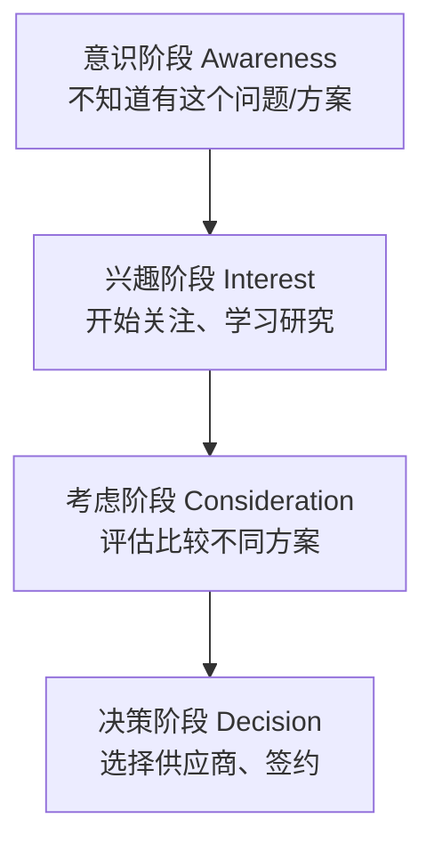

+++
title = "15. 数字营销与内容营销"
description = "B2B数字营销策略、内容营销、SEO/SEM、社交媒体与营销自动化"
date = 2025-01-16
weight = 15000
[taxonomies]
tags = ["marketing", "business", "digital", "content", "seo", "automation"]
+++

# 数字营销与内容营销

## 一、B2B数字营销概述

### 1.1 B2B vs B2C营销差异

| 维度 | B2B | B2C |
|------|-----|-----|
| 决策周期 | 长（月-年） | 短（分钟-天） |
| 决策人 | 多人 | 个人/家庭 |
| 决策因素 | 理性为主 | 感性+理性 |
| 客单价 | 高 | 低 |
| 客户数量 | 少 | 多 |
| 内容深度 | 深度专业 | 轻松易懂 |
| 渠道 | 专业渠道 | 大众渠道 |

### 1.2 B2B营销漏斗



内容匹配：
- 意识阶段：行业洞察、趋势报告
- 兴趣阶段：解决方案介绍、白皮书
- 考虑阶段：产品对比、案例研究、ROI分析
- 决策阶段：Demo、试用、报价

### 1.3 数字营销渠道

```
付费渠道（Paid）：
├── SEM（百度/Google Ads）
├── 信息流广告
├── LinkedIn/微信广告
├── 行业媒体投放
└── KOL合作

自有渠道（Owned）：
├── 官网
├── 公众号/企业号
├── 博客/知识库
├── 邮件列表
└── 社群

赚取渠道（Earned）：
├── 媒体报道
├── 口碑推荐
├── 社交分享
├── 搜索排名（SEO）
└── 第三方评测
```

---

## 二、内容营销

### 2.1 内容策略

**内容规划框架**：

```
目标受众：
├── 谁是目标读者？
├── 他们关心什么？
├── 在哪里获取信息？
└── 决策journey在哪个阶段？

内容主题：
├── 行业趋势洞察
├── 问题解决方案
├── 最佳实践分享
├── 客户成功故事
└── 产品能力展示

内容形式：
├── 博客文章
├── 白皮书/电子书
├── 视频/直播
├── 播客
├── 信息图
├── 案例研究
├── 工具/模板
└── Webinar
```

### 2.2 内容创作

**内容创作框架**：

```
标题：
├── 吸引眼球
├── 包含关键词
├── 明确价值
└── 示例："2024年CRM选型指南：10个评估要点"

开头：
├── 引起共鸣/痛点
├── 提出问题
├── 预告内容价值
└── 3秒抓住注意力

正文：
├── 结构清晰（H2/H3）
├── 数据支撑
├── 案例说明
├── 图表辅助
└── 可扫读（列表、加粗）

结尾：
├── 总结要点
├── Call to Action
├── 引导下一步
└── 联系方式/表单
```

### 2.3 内容类型详解

**各类型内容特点**：

```
博客文章：
├── 频率：每周1-3篇
├── 长度：1000-2000字
├── 目的：SEO、教育、品牌
└── 适合：意识/兴趣阶段

白皮书：
├── 频率：每季度1-2份
├── 长度：10-30页
├── 目的：深度教育、获取线索
└── 适合：兴趣/考虑阶段

案例研究：
├── 频率：每月1-2个
├── 长度：2-4页
├── 目的：证明价值、建立信任
└── 适合：考虑/决策阶段

视频：
├── 类型：产品演示、教程、访谈
├── 长度：2-10分钟
├── 目的：直观展示、engagement
└── 适合：全阶段

Webinar：
├── 频率：每月1-2次
├── 时长：30-60分钟
├── 目的：深度分享、互动获客
└── 适合：兴趣/考虑阶段
```

---

## 三、SEO与SEM

### 3.1 SEO基础

**SEO三要素**：

```
技术SEO：
├── 网站速度
├── 移动端适配
├── URL结构
├── 站点地图
├── 结构化数据
└── HTTPS

内容SEO：
├── 关键词研究
├── 内容质量
├── 标题/Meta优化
├── 内链结构
├── 内容更新
└── 多媒体内容

外链SEO：
├── 外链质量
├── 外链数量
├── 锚文本
├── 品牌提及
└── 社交信号
```

### 3.2 关键词策略

**关键词研究**：

```
关键词分类：
├── 品牌词：公司名、产品名
├── 行业词：CRM系统、销售管理软件
├── 长尾词：中小企业CRM选型指南
└── 问题词：如何提高销售效率

关键词选择：
├── 搜索量：有足够搜索
├── 相关性：与业务相关
├── 难度：可以竞争
└── 意图：匹配用户意图

工具：
├── 百度指数
├── Google Keyword Planner
├── Ahrefs/SEMrush
└── 站长工具
```

### 3.3 SEM广告

**搜索广告策略**：

```
账户结构：
├── 账户
│   ├── 推广计划（按产品/地区）
│   │   ├── 推广单元（按关键词主题）
│   │   │   ├── 关键词
│   │   │   └── 创意
│   │   └── ...
│   └── ...
└── ...

关键词出价：
├── 品牌词：必须占领
├── 竞品词：谨慎使用
├── 行业词：竞争激烈
├── 长尾词：性价比高
└── 否定词：排除无效

广告创意：
├── 标题包含关键词
├── 突出价值主张
├── Call to Action
├── 与落地页一致
└── A/B测试优化
```

---

## 四、社交媒体营销

### 4.1 B2B社交平台

**平台选择**：

```
LinkedIn（领英）：
├── B2B最佳平台
├── 专业人脉
├── 内容分发
├── 精准广告
└── 国际市场

微信生态：
├── 公众号：内容发布
├── 视频号：短视频
├── 企业微信：客户管理
├── 小程序：服务工具
└── 社群：深度运营

知乎：
├── 专业问答
├── 长内容分发
├── 建立专家形象
└── SEO价值

抖音/B站：
├── 视频内容
├── 年轻用户
├── 品牌曝光
└── 教育内容
```

### 4.2 社交内容策略

**内容运营**：

```
内容比例（4:1:1法则）：
├── 40%：行业洞察、教育内容
├── 40%：互动内容、用户生成
└── 20%：产品推广

发布频率：
├── 公众号：每周2-3篇
├── LinkedIn：每天1-2条
├── 知乎：每周2-3个回答
└── 视频号：每周1-2条

互动策略：
├── 及时回复评论
├── 参与行业讨论
├── 与KOL互动
├── 用户内容转发
└── 社群运营
```

---

## 五、营销自动化

### 5.1 营销自动化概念

**什么是营销自动化**：

```
营销自动化 = 
  用技术手段自动执行营销任务

主要功能：
├── 线索管理（Lead Management）
├── 邮件营销（Email Marketing）
├── 线索培育（Lead Nurturing）
├── 线索评分（Lead Scoring）
├── 营销分析（Analytics）
└── 多渠道触达（Multi-channel）

常用工具：
├── 国际：HubSpot、Marketo、Pardot
├── 国内：致趣百川、Convertlab、易企秀
└── 邮件：Mailchimp、SendGrid
```

### 5.2 线索培育

**Nurturing流程**：

```
触发条件 → 自动化动作 → 等待 → 判断 → 下一步

示例：白皮书下载培育流程

Day 0: 下载白皮书
    └── 发送感谢邮件 + 相关内容推荐

Day 3: 
    └── 发送案例研究

Day 7:
    └── 发送产品介绍视频

Day 14:
    ├── 打开邮件？
    │   └── 是 → 发送Demo邀请
    └── 否 → 发送不同主题内容

Day 21:
    ├── 完成Demo？
    │   └── 是 → 转销售跟进
    └── 否 → 继续培育
```

### 5.3 线索评分

**Lead Scoring模型**：

```
评分维度：

人口属性（Demographics）：
├── 职位级别：VP/Director +20分
├── 公司规模：>500人 +15分
├── 行业匹配：目标行业 +10分
└── 地区：目标城市 +5分

行为属性（Behaviors）：
├── 访问网站：+5分/次
├── 下载白皮书：+20分
├── 观看Demo：+30分
├── 申请试用：+50分
├── 参加Webinar：+25分
└── 打开邮件：+3分/次

分数阈值：
├── <50分：继续培育
├── 50-80分：MQL，市场跟进
├── >80分：SQL，转销售
```

---

## 六、营销效果衡量

### 6.1 核心指标

**营销漏斗指标**：

```
顶部漏斗（Awareness）：
├── 网站访问量
├── 内容阅读量
├── 社交媒体reach
├── 品牌搜索量
└── 新访客占比

中部漏斗（Engagement）：
├── 内容下载量
├── 邮件打开率/点击率
├── Webinar注册/出席
├── 表单提交量
└── 页面停留时间

底部漏斗（Conversion）：
├── MQL数量
├── SQL数量
├── Demo完成数
├── 商机创建数
└── 成交数/金额
```

### 6.2 ROI分析

**营销ROI计算**：

```
营销ROI = (营销产生收入 - 营销成本) / 营销成本 × 100%

示例：
├── 营销年度预算：500万
├── 营销产生的新签收入：2000万
├── ROI = (2000-500)/500 = 300%

CAC（客户获取成本）：
├── CAC = 营销+销售费用 / 新增客户数
├── 目标：LTV/CAC > 3

CPL（单线索成本）：
├── CPL = 营销费用 / 线索数量
└── 按渠道分析，优化投入
```

### 6.3 归因分析

**归因模型**：

```
首次触点归因（First Touch）：
└── 100%归功于第一次接触渠道

末次触点归因（Last Touch）：
└── 100%归功于最后一次接触渠道

线性归因（Linear）：
└── 所有触点平均分配

时间衰减归因（Time Decay）：
└── 越接近转化的触点权重越高

位置归因（Position Based）：
└── 首末各40%，中间20%

数据驱动归因（Data-Driven）：
└── 根据实际数据机器学习
```

---

## 七、实战案例

### 7.1 集客营销实战

**Content → Lead → Customer流程**：

```
第一步：内容创作
├── 发布《2024年CRM选型白皮书》
├── 配套博客、信息图
└── 社交媒体推广

第二步：流量获取
├── SEO优化
├── SEM投放
├── 社交分发
└── KOL合作

第三步：线索获取
├── 落地页表单
├── 内容门控
├── 弹窗/浮窗
└── 在线咨询

第四步：线索培育
├── 自动化邮件
├── 内容推送
├── 社交触达
└── 线索评分

第五步：销售转化
├── MQL转SQL
├── 销售跟进
├── Demo/试用
└── 成交
```

---

## 八、总结

### 8.1 数字营销核心

```
三个基础：
├── 内容：有价值的内容资产
├── 渠道：多渠道分发触达
└── 数据：效果衡量优化

三个阶段：
├── 吸引：获取目标客户关注
├── 转化：将访客转化为线索
└── 成交：将线索转化为客户

三个关键：
├── 内容质量
├── 用户体验
└── 持续优化
```

### 8.2 营销自检

```
每月问自己：
□ 网站流量趋势如何？
□ 内容表现如何？
□ 线索数量和质量？
□ 各渠道ROI如何？
□ 转化率有提升吗？
□ 营销与销售协同好吗？
□ 下月重点是什么？
□ 需要什么资源支持？
```

---

## 相关文章

- [上一篇：销售预测与漏斗管理](@/articles/business/biz-14-销售预测与漏斗管理.md)
- [下一篇：品牌建设与公关传播](@/articles/business/biz-16-品牌建设与公关传播.md)
