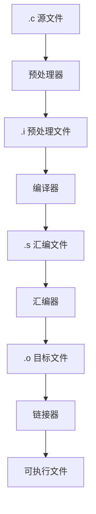

+++
title = "C Language Overview and Setup"
date = 2026-01-30
weight = 1000
description = "C语言历史、特点、应用领域、编译流程、开发环境搭建"
[taxonomies]
tags = ["C", "入门", "编译"]
+++

## C语言简介

### 历史背景

**C语言诞生于1972年**，由Dennis Ritchie在贝尔实验室开发，最初用于重写Unix操作系统。

```
时间线:
1969 - Ken Thompson 开发 B 语言
1972 - Dennis Ritchie 开发 C 语言
1978 - K&R C (《The C Programming Language》出版)
1989 - ANSI C (C89/C90)
1999 - C99 (新增 bool, inline, 变长数组等)
2011 - C11 (新增多线程, 泛型宏等)
2018 - C17 (bug修复版本)
2024 - C23 (最新标准)
```

### C语言特点

| 特点 | 说明 |
|------|------|
| 高效 | 接近硬件，编译后执行速度快 |
| 可移植 | 标准化程度高，跨平台编译 |
| 底层控制 | 可直接操作内存和硬件 |
| 简洁 | 关键字少（32个），语法紧凑 |
| 灵活 | 指针机制强大，表达能力强 |

### 应用领域

- **操作系统**: Linux, Windows内核, macOS
- **嵌入式系统**: 单片机, IoT设备, 汽车电子
- **编译器/解释器**: GCC, Python解释器, Lua
- **数据库**: MySQL, PostgreSQL, SQLite
- **网络**: Nginx, Redis, curl

---

## 编译流程

### 从源码到可执行文件



### 各阶段详解

**1. 预处理 (Preprocessing)**
```bash
gcc -E main.c -o main.i
```
- 展开 `#include` 头文件
- 替换 `#define` 宏定义
- 处理条件编译 `#ifdef`
- 删除注释

**2. 编译 (Compilation)**
```bash
gcc -S main.i -o main.s
```
- 语法分析、语义检查
- 生成汇编代码

**3. 汇编 (Assembly)**
```bash
gcc -c main.s -o main.o
```
- 将汇编转为机器码
- 生成目标文件 (.o)

**4. 链接 (Linking)**
```bash
gcc main.o -o main
```
- 合并目标文件
- 解析符号引用
- 链接库函数

---

## 开发环境搭建

### Linux

```bash
# Ubuntu/Debian
sudo apt update
sudo apt install build-essential gdb

# CentOS/RHEL
sudo yum groupinstall "Development Tools"
sudo yum install gdb

# 验证安装
gcc --version
gdb --version
```

### macOS

```bash
# 安装 Xcode Command Line Tools
xcode-select --install

# 或使用 Homebrew
brew install gcc gdb
```

### Windows

**选项1: MinGW-w64**
1. 下载 MinGW-w64 安装包
2. 添加 `bin` 目录到 PATH
3. 验证: `gcc --version`

**选项2: WSL (推荐)**
```bash
# 安装 WSL2 后
sudo apt update
sudo apt install build-essential gdb
```

---

## 第一个C程序

### Hello World

```c
#include <stdio.h>

int main(void) {
    printf("Hello, World!\n");
    return 0;
}
```

### 代码解析

| 部分 | 说明 |
|------|------|
| `#include <stdio.h>` | 引入标准输入输出库 |
| `int main(void)` | 程序入口点，返回int类型 |
| `printf()` | 标准输出函数 |
| `return 0` | 返回0表示正常退出 |

### 编译运行

```bash
# 编译
gcc -o hello hello.c

# 运行
./hello
```

### 常用编译选项

```bash
gcc -Wall -Wextra -Werror -std=c11 -O2 -o prog main.c

# -Wall        开启常见警告
# -Wextra      开启额外警告
# -Werror      警告视为错误
# -std=c11     使用C11标准
# -O2          二级优化
# -g           包含调试信息
# -o           指定输出文件名
```

---

## 编辑器与IDE

### 推荐工具

| 工具 | 特点 | 适用场景 |
|------|------|----------|
| VS Code + C/C++ 扩展 | 轻量、插件丰富 | 日常开发 |
| CLion | 功能强大、智能补全 | 大型项目 |
| Vim/Neovim + coc.nvim | 高效、可定制 | 服务器环境 |
| Emacs | 可扩展性强 | 深度定制 |

### VS Code 配置

`.vscode/tasks.json`:
```json
{
    "version": "2.0.0",
    "tasks": [{
        "label": "build",
        "type": "shell",
        "command": "gcc",
        "args": ["-g", "-Wall", "-o", "${fileBasenameNoExtension}", "${file}"],
        "group": {"kind": "build", "isDefault": true}
    }]
}
```

---

## 相关链接

- [02.数据类型与变量](@/articles/c/c-02-数据类型与变量.md)
- [C++ 对比: C和C++内存管理对比](@/articles/cpp/cpp-01-C和Cpp内存管理对比.md)
- [术语表: C/C++概念](@/articles/00-glossary/glossary-05-cpp-concepts.md)

---

## 相关文章

- [下一篇：Data Types and Variables](@/articles/c/c-02-数据类型与变量.md)
