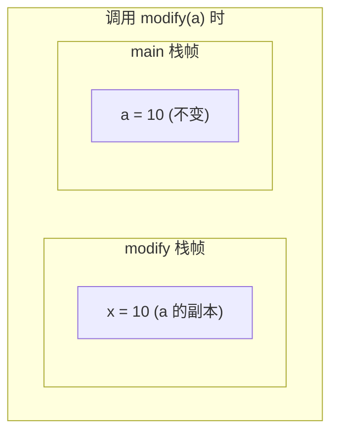
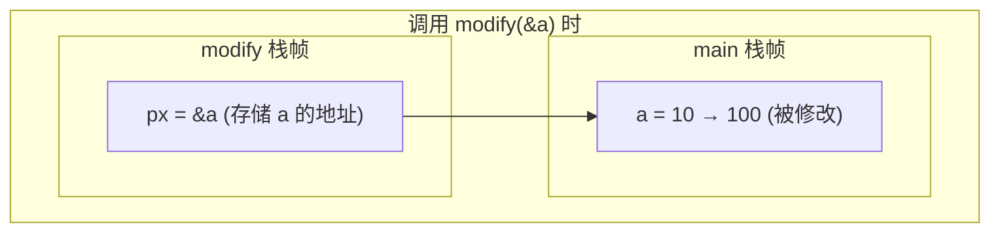

+++
title = "05. Functions and Parameters"
date = 2026-01-30
description = "C语言函数定义、参数传递机制、递归、函数指针基础"
[taxonomies]
tags = ["C", "函数", "递归"]
+++

## 函数基础

### 函数定义

```c
// 返回类型 函数名(参数列表) { 函数体 }
int add(int a, int b) {
    return a + b;
}

// 无返回值
void print_hello(void) {
    printf("Hello\n");
}

// 无参数 (使用 void 显式声明)
int get_random(void) {
    return rand();
}
```

### 函数声明 (原型)

```c
// 在使用前声明
int add(int a, int b);  // 原型

int main(void) {
    int sum = add(1, 2);  // 调用
    return 0;
}

int add(int a, int b) {  // 定义
    return a + b;
}
```

**为什么需要原型?**
- 编译器检查参数类型和数量
- 允许函数定义在调用之后
- 头文件通常只包含原型

---

## 参数传递

### 值传递 (Pass by Value)

```c
void modify(int x) {
    x = 100;  // 修改的是副本
}

int main(void) {
    int a = 10;
    modify(a);
    printf("%d\n", a);  // 仍然是 10
    return 0;
}
```

**内存布局**:



### 指针传递 (模拟引用)

```c
void modify(int *px) {
    *px = 100;  // 修改指针指向的值
}

int main(void) {
    int a = 10;
    modify(&a);
    printf("%d\n", a);  // 变成 100
    return 0;
}
```

**内存布局**:



### 数组传递

```c
// 数组作为参数会退化为指针
void print_array(int arr[], int n) {
    // arr 实际是 int*
    printf("sizeof(arr) = %zu\n", sizeof(arr));  // 指针大小，不是数组大小!
    
    for (int i = 0; i < n; i++) {
        printf("%d ", arr[i]);
    }
}

// 等价写法
void print_array(int *arr, int n);
```

**面试重点**: 数组作为参数传递时退化为指针！

### 结构体传递

```c
struct Point {
    double x, y;
};

// 值传递 (拷贝整个结构体)
void move_by_value(struct Point p, double dx, double dy) {
    p.x += dx;
    p.y += dy;  // 不影响原结构体
}

// 指针传递 (推荐，避免拷贝开销)
void move_by_pointer(struct Point *p, double dx, double dy) {
    p->x += dx;
    p->y += dy;  // 修改原结构体
}
```

---

## 返回值

### 返回基本类型

```c
int add(int a, int b) {
    return a + b;
}
```

### 返回指针

```c
// 危险: 返回局部变量地址
int *bad_function(void) {
    int local = 42;
    return &local;  // 错误! local 离开作用域后失效
}

// 正确: 返回堆内存
int *good_function(int n) {
    int *arr = malloc(n * sizeof(int));
    return arr;  // 调用者负责 free
}

// 正确: 返回静态变量地址
const char *get_message(void) {
    static char msg[] = "Hello";
    return msg;  // 静态变量生命周期到程序结束
}
```

### 返回结构体

```c
struct Point create_point(double x, double y) {
    struct Point p = {x, y};
    return p;  // 返回副本 (小结构体OK，大结构体有开销)
}
```

---

## 可变参数

### stdarg 用法

```c
#include <stdarg.h>

// 计算多个整数的和
int sum(int count, ...) {
    va_list args;
    va_start(args, count);  // 初始化，count 是最后一个固定参数
    
    int total = 0;
    for (int i = 0; i < count; i++) {
        total += va_arg(args, int);  // 获取下一个参数
    }
    
    va_end(args);  // 清理
    return total;
}

// 使用
int s = sum(4, 1, 2, 3, 4);  // 10
```

### 自定义 printf

```c
void my_printf(const char *fmt, ...) {
    va_list args;
    va_start(args, fmt);
    vprintf(fmt, args);  // 使用 vprintf
    va_end(args);
}
```

---

## 递归

### 基本递归

```c
// 阶乘
int factorial(int n) {
    if (n <= 1) return 1;  // 基准情况
    return n * factorial(n - 1);  // 递归情况
}

// 斐波那契 (效率低，仅作示例)
int fib(int n) {
    if (n <= 1) return n;
    return fib(n - 1) + fib(n - 2);
}
```

### 尾递归

```c
// 尾递归: 递归调用是函数最后一个操作
int factorial_tail(int n, int acc) {
    if (n <= 1) return acc;
    return factorial_tail(n - 1, n * acc);  // 尾调用
}

int factorial(int n) {
    return factorial_tail(n, 1);
}
```

**注意**: C 标准不保证尾递归优化，但现代编译器 (gcc -O2) 通常会优化。

### 递归 vs 迭代

```c
// 递归版本
int sum_recursive(int n) {
    if (n <= 0) return 0;
    return n + sum_recursive(n - 1);
}

// 迭代版本 (更高效，无栈开销)
int sum_iterative(int n) {
    int sum = 0;
    for (int i = 1; i <= n; i++) {
        sum += i;
    }
    return sum;
}

// 公式版本 (O(1))
int sum_formula(int n) {
    return n * (n + 1) / 2;
}
```

---

## 内联函数

### inline 关键字 (C99)

```c
// 建议编译器内联展开
inline int max(int a, int b) {
    return a > b ? a : b;
}

// 调用时可能直接展开代码
int m = max(x, y);
// 变成: int m = x > y ? x : y;
```

**注意**:
- `inline` 只是建议，编译器可能忽略
- 头文件中的 inline 函数需要 `static inline`
- 过大的函数不会被内联

---

## 函数指针 (简介)

### 基本语法

```c
// 声明函数指针
int (*fp)(int, int);  // fp 是指向 "接受两个int，返回int" 函数的指针

// 赋值
int add(int a, int b) { return a + b; }
fp = add;  // 或 fp = &add;

// 调用
int result = fp(1, 2);  // 或 (*fp)(1, 2);
```

### 回调函数

```c
// qsort 需要比较函数
int compare_int(const void *a, const void *b) {
    return *(int*)a - *(int*)b;
}

int arr[] = {5, 2, 8, 1, 9};
qsort(arr, 5, sizeof(int), compare_int);
```

**详见**: [07.函数指针与回调](@/articles/c/c-07-函数指针与回调.md)

---

## 常见陷阱

### 陷阱1: 忘记返回值

```c
int add(int a, int b) {
    int sum = a + b;
    // 忘记 return sum; 未定义行为!
}
```

### 陷阱2: 修改常量参数

```c
void process(const int *arr, int n) {
    arr[0] = 0;  // 编译错误! arr 指向 const
}
```

### 陷阱3: 返回局部变量地址

```c
char *get_name(void) {
    char name[50] = "John";
    return name;  // 危险! 返回栈上地址
}
```

---

## 面试题

### 题目1: 实现 swap

```c
// 正确实现
void swap(int *a, int *b) {
    int temp = *a;
    *a = *b;
    *b = temp;
}

// 使用异或 (面试常问)
void swap_xor(int *a, int *b) {
    if (a != b) {  // 必须检查!
        *a ^= *b;
        *b ^= *a;
        *a ^= *b;
    }
}
```

### 题目2: 实现 strcpy

```c
char *my_strcpy(char *dest, const char *src) {
    char *ret = dest;
    while ((*dest++ = *src++) != '\0');
    return ret;
}
```

### 题目3: 实现递归反转字符串

```c
void reverse_recursive(char *s, int left, int right) {
    if (left >= right) return;
    
    char temp = s[left];
    s[left] = s[right];
    s[right] = temp;
    
    reverse_recursive(s, left + 1, right - 1);
}

void reverse(char *s) {
    reverse_recursive(s, 0, strlen(s) - 1);
}
```

---

## 相关链接

- [04.控制流程](@/articles/c/c-04-控制流程.md)
- [06.指针基础与内存模型](@/articles/c/c-06-指针基础与内存模型.md)
- [07.函数指针与回调](@/articles/c/c-07-函数指针与回调.md)

---

## 相关文章

- [上一篇：Control Flow](/articles/c/c-04-控制流程/)
- [下一篇：Pointers and Memory Model](/articles/c/c-06-指针基础与内存模型/)
