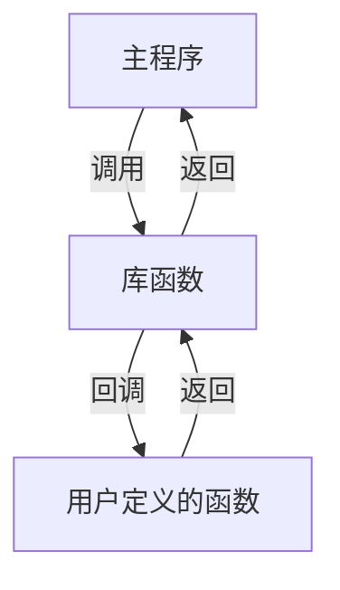

+++
title = "07. Function Pointers and Callbacks"
date = 2026-01-30
description = "函数指针语法、回调机制、函数指针数组、泛型编程基础"
[taxonomies]
tags = ["C", "函数指针", "回调"]
+++

## 函数指针基础

### 函数的地址

函数名本身就是函数的地址:

```c
#include <stdio.h>

int add(int a, int b) {
    return a + b;
}

int main(void) {
    printf("函数地址: %p\n", (void*)add);
    printf("函数地址: %p\n", (void*)&add);  // 等价
    return 0;
}
```

### 函数指针声明

```c
// 语法: 返回类型 (*指针名)(参数类型列表)

int (*fp)(int, int);  // 指向 "接受两个int，返回int" 的函数

// 注意括号! 没有括号含义完全不同:
int *fp(int, int);    // 这是一个返回 int* 的函数声明!
```

### 声明解读

```
int (*fp)(int, int)
 │    │     │
 │    │     └── 参数列表: 两个 int
 │    └── fp 是一个指针
 └── 指向的函数返回 int
```

### 使用 typedef 简化

```c
// 定义函数指针类型
typedef int (*BinaryOp)(int, int);

// 使用类型名声明变量
BinaryOp fp = add;

// 作为函数参数
void apply(BinaryOp op, int a, int b) {
    printf("Result: %d\n", op(a, b));
}
```

---

## 函数指针操作

### 赋值与调用

```c
int add(int a, int b) { return a + b; }
int sub(int a, int b) { return a - b; }

int main(void) {
    int (*fp)(int, int);
    
    // 赋值
    fp = add;      // 方式1: 直接赋值
    fp = &add;     // 方式2: 取地址 (等价)
    
    // 调用
    int r1 = fp(3, 2);     // 方式1: 直接调用
    int r2 = (*fp)(3, 2);  // 方式2: 解引用调用 (等价)
    
    // 切换函数
    fp = sub;
    printf("%d\n", fp(5, 3));  // 2
    
    return 0;
}
```

### 空函数指针

```c
int (*fp)(int, int) = NULL;

// 调用前必须检查
if (fp != NULL) {
    fp(1, 2);
}
```

---

## 回调函数

### 回调机制



### 示例: 通用排序

```c
#include <stdlib.h>

// 比较函数类型
typedef int (*Comparator)(const void*, const void*);

// 升序比较
int compare_asc(const void *a, const void *b) {
    return *(int*)a - *(int*)b;
}

// 降序比较
int compare_desc(const void *a, const void *b) {
    return *(int*)b - *(int*)a;
}

int main(void) {
    int arr[] = {5, 2, 8, 1, 9};
    int n = sizeof(arr) / sizeof(arr[0]);
    
    // 升序排序
    qsort(arr, n, sizeof(int), compare_asc);
    
    // 降序排序
    qsort(arr, n, sizeof(int), compare_desc);
    
    return 0;
}
```

### 示例: 事件处理

```c
typedef void (*EventHandler)(int event_type, void *data);

// 注册回调
static EventHandler g_handler = NULL;

void register_handler(EventHandler handler) {
    g_handler = handler;
}

// 触发事件
void trigger_event(int type, void *data) {
    if (g_handler != NULL) {
        g_handler(type, data);
    }
}

// 用户定义的处理函数
void my_handler(int type, void *data) {
    printf("Event %d received\n", type);
}

int main(void) {
    register_handler(my_handler);
    trigger_event(42, NULL);
    return 0;
}
```

---

## 函数指针数组

### 基本用法

```c
int add(int a, int b) { return a + b; }
int sub(int a, int b) { return a - b; }
int mul(int a, int b) { return a * b; }
int div_(int a, int b) { return b != 0 ? a / b : 0; }

int main(void) {
    // 函数指针数组
    int (*ops[])(int, int) = {add, sub, mul, div_};
    
    // 通过索引调用
    printf("add: %d\n", ops[0](10, 3));  // 13
    printf("sub: %d\n", ops[1](10, 3));  // 7
    printf("mul: %d\n", ops[2](10, 3));  // 30
    printf("div: %d\n", ops[3](10, 3));  // 3
    
    return 0;
}
```

### 替代 switch-case

```c
// 传统方式
int calculate_switch(int op, int a, int b) {
    switch (op) {
        case 0: return a + b;
        case 1: return a - b;
        case 2: return a * b;
        case 3: return b != 0 ? a / b : 0;
        default: return 0;
    }
}

// 函数指针数组方式 (更灵活，可扩展)
typedef int (*Operation)(int, int);
Operation ops[] = {add, sub, mul, div_};
int n_ops = sizeof(ops) / sizeof(ops[0]);

int calculate(int op, int a, int b) {
    if (op >= 0 && op < n_ops) {
        return ops[op](a, b);
    }
    return 0;
}
```

### 状态机实现

```c
typedef enum { STATE_IDLE, STATE_RUNNING, STATE_STOPPED, STATE_COUNT } State;

typedef void (*StateHandler)(void);

void idle_handler(void)    { printf("Idle\n"); }
void running_handler(void) { printf("Running\n"); }
void stopped_handler(void) { printf("Stopped\n"); }

StateHandler handlers[STATE_COUNT] = {
    idle_handler,
    running_handler,
    stopped_handler
};

void handle_state(State s) {
    if (s >= 0 && s < STATE_COUNT) {
        handlers[s]();
    }
}
```

---

## 返回函数指针

### 基本语法

```c
// 返回函数指针的函数
int (*get_operation(char op))(int, int) {
    switch (op) {
        case '+': return add;
        case '-': return sub;
        case '*': return mul;
        case '/': return div_;
        default:  return NULL;
    }
}

// 使用 typedef 更清晰
typedef int (*BinaryOp)(int, int);

BinaryOp get_operation(char op) {
    switch (op) {
        case '+': return add;
        case '-': return sub;
        default:  return NULL;
    }
}
```

### 工厂模式

```c
typedef struct Parser Parser;
typedef Parser* (*ParserFactory)(void);

Parser* create_json_parser(void) { ... }
Parser* create_xml_parser(void)  { ... }

ParserFactory get_parser_factory(const char *format) {
    if (strcmp(format, "json") == 0) return create_json_parser;
    if (strcmp(format, "xml") == 0)  return create_xml_parser;
    return NULL;
}
```

---

## 泛型编程

### 通用遍历

```c
typedef void (*ItemProcessor)(void *item);

void for_each(void *arr, int n, int item_size, ItemProcessor proc) {
    char *p = (char*)arr;
    for (int i = 0; i < n; i++) {
        proc(p + i * item_size);
    }
}

// 打印 int
void print_int(void *item) {
    printf("%d ", *(int*)item);
}

// 打印 double
void print_double(void *item) {
    printf("%.2f ", *(double*)item);
}

int main(void) {
    int ints[] = {1, 2, 3, 4, 5};
    for_each(ints, 5, sizeof(int), print_int);
    printf("\n");
    
    double doubles[] = {1.1, 2.2, 3.3};
    for_each(doubles, 3, sizeof(double), print_double);
    printf("\n");
    
    return 0;
}
```

### 通用查找

```c
typedef int (*Comparator)(const void*, const void*);

void* linear_search(void *arr, int n, int item_size, 
                    const void *target, Comparator cmp) {
    char *p = (char*)arr;
    for (int i = 0; i < n; i++) {
        if (cmp(p + i * item_size, target) == 0) {
            return p + i * item_size;
        }
    }
    return NULL;
}
```

---

## 常见陷阱

### 陷阱1: 函数指针签名不匹配

```c
void handler(int x) { ... }
void (*fp)(void) = handler;  // 警告! 签名不匹配
fp();  // 未定义行为
```

### 陷阱2: 忘记检查 NULL

```c
int (*fp)(int, int) = NULL;
fp(1, 2);  // 段错误!

// 正确
if (fp) {
    fp(1, 2);
}
```

### 陷阱3: 函数指针与 const

```c
// 这些是不同的类型!
int (*fp)(const char*);        // 接受 const char*
int (*const fp)(char*);        // 常量指针，不能重新赋值
const int (*fp)(char*);        // 无意义的 const
```

---

## 面试题

### 题目1: 实现通用 map 函数

```c
typedef void (*Mapper)(void *item);

void map(void *arr, int n, int item_size, Mapper fn) {
    char *p = (char*)arr;
    for (int i = 0; i < n; i++) {
        fn(p + i * item_size);
    }
}

// 将 int 翻倍
void double_int(void *item) {
    *(int*)item *= 2;
}

// 使用
int arr[] = {1, 2, 3, 4, 5};
map(arr, 5, sizeof(int), double_int);
// arr 变成 {2, 4, 6, 8, 10}
```

### 题目2: 实现简单的命令分发器

```c
typedef void (*Command)(void);

struct CommandEntry {
    const char *name;
    Command handler;
};

struct CommandEntry commands[] = {
    {"help", cmd_help},
    {"list", cmd_list},
    {"quit", cmd_quit},
};

void dispatch(const char *cmd) {
    int n = sizeof(commands) / sizeof(commands[0]);
    for (int i = 0; i < n; i++) {
        if (strcmp(commands[i].name, cmd) == 0) {
            commands[i].handler();
            return;
        }
    }
    printf("Unknown command: %s\n", cmd);
}
```

### 题目3: 解释以下声明

```c
// 声明1
int (*arr[10])(int, int);
// 答: arr 是一个数组，包含10个函数指针，每个指针指向接受两个int返回int的函数

// 声明2
int (*(*fp)(int, int))(int);
// 答: fp 是一个函数指针，指向接受两个int的函数，该函数返回一个函数指针，
//     返回的函数指针指向接受一个int返回int的函数
```

---

## 相关链接

- [05.函数与参数传递](@/articles/c/c-05-函数与参数传递.md)
- [08.结构体与联合体](@/articles/c/c-08-结构体与联合体.md)
- [C++: Lambda与函数对象](@/articles/cpp/cpp-26-Lambda与函数对象详解.md)

---

## 相关文章

- [上一篇：Pointers and Memory Model](/articles/c/c-06-指针基础与内存模型/)
- [下一篇：Structs and Unions](/articles/c/c-08-结构体与联合体/)
