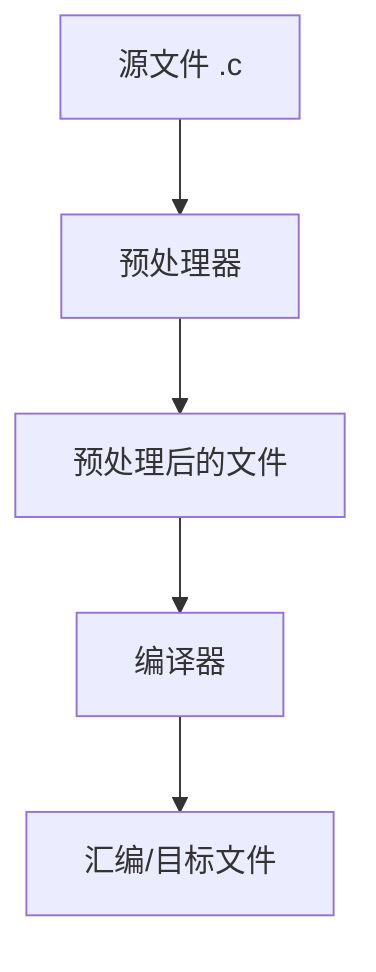

+++
title = "Preprocessor and Macros"
date = 2026-01-30
weight = 10000
description = "预处理指令、宏定义、条件编译、头文件保护"
[taxonomies]
tags = ["C", "预处理", "宏"]
+++

## 预处理器概述

### 预处理流程



```bash
# 查看预处理结果
gcc -E main.c -o main.i
```

### 预处理指令

| 指令 | 说明 |
|------|------|
| `#include` | 包含头文件 |
| `#define` | 定义宏 |
| `#undef` | 取消宏定义 |
| `#if, #elif, #else, #endif` | 条件编译 |
| `#ifdef, #ifndef` | 检查宏是否定义 |
| `#pragma` | 编译器指令 |
| `#error` | 生成编译错误 |
| `#warning` | 生成编译警告 (非标准) |
| `#line` | 修改行号和文件名 |

---

## #include

### 两种形式

```c
#include <stdio.h>    // 系统头文件，搜索系统目录
#include "myheader.h" // 用户头文件，先搜索当前目录
```

### 搜索路径

```bash
# 添加搜索路径
gcc -I/path/to/headers main.c

# 查看默认搜索路径
gcc -v -E -x c /dev/null
```

### 头文件保护

```c
// 方式1: ifndef 保护 (传统)
#ifndef MYHEADER_H
#define MYHEADER_H

// 头文件内容

#endif

// 方式2: #pragma once (现代，非标准但广泛支持)
#pragma once

// 头文件内容
```

---

## #define 宏

### 对象式宏 (常量)

```c
#define PI 3.14159
#define MAX_SIZE 1024
#define VERSION "1.0.0"

// 使用
double area = PI * r * r;
int buffer[MAX_SIZE];
```

### 函数式宏

```c
#define SQUARE(x) ((x) * (x))
#define MAX(a, b) ((a) > (b) ? (a) : (b))
#define SWAP(a, b) do { typeof(a) t = a; a = b; b = t; } while(0)

// 使用
int s = SQUARE(5);     // ((5) * (5)) = 25
int m = MAX(3, 7);     // ((3) > (7) ? (3) : (7)) = 7
```

### 宏的陷阱

**陷阱1: 括号问题**
```c
#define BAD_SQUARE(x) x * x
int a = BAD_SQUARE(1 + 2);  // 1 + 2 * 1 + 2 = 5 (错!)

#define GOOD_SQUARE(x) ((x) * (x))
int b = GOOD_SQUARE(1 + 2); // ((1 + 2) * (1 + 2)) = 9
```

**陷阱2: 副作用**
```c
#define SQUARE(x) ((x) * (x))
int i = 3;
int s = SQUARE(i++);  // ((i++) * (i++)) 未定义行为!
```

**陷阱3: 多语句宏**
```c
// 错误
#define LOG_AND_RETURN(x) printf("value: %d\n", x); return x
if (condition)
    LOG_AND_RETURN(42);  // 只有 printf 在 if 里!

// 正确: 使用 do-while(0)
#define LOG_AND_RETURN(x) do { printf("value: %d\n", x); return x; } while(0)
```

### 特殊运算符

```c
// # 字符串化
#define STRINGIFY(x) #x
printf("%s\n", STRINGIFY(hello));  // 输出 "hello"

// ## 连接
#define CONCAT(a, b) a##b
int xy = CONCAT(x, y);  // 变成 int xy = xy;

// 实用例子
#define DECLARE_PAIR(type) \
    typedef struct { type first, second; } type##Pair
DECLARE_PAIR(int);    // 生成 intPair
DECLARE_PAIR(double); // 生成 doublePair
```

### 可变参数宏 (C99)

```c
#define DEBUG_LOG(fmt, ...) \
    printf("[DEBUG] " fmt "\n", ##__VA_ARGS__)

DEBUG_LOG("Value: %d", 42);    // [DEBUG] Value: 42
DEBUG_LOG("Hello");             // [DEBUG] Hello
```

---

## 条件编译

### #if / #elif / #else / #endif

```c
#define VERSION 2

#if VERSION == 1
    // 版本1的代码
#elif VERSION == 2
    // 版本2的代码
#else
    // 其他版本
#endif
```

### #ifdef / #ifndef

```c
// 检查宏是否定义
#ifdef DEBUG
    printf("Debug mode\n");
#endif

#ifndef NDEBUG
    assert(x > 0);
#endif
```

### defined 运算符

```c
#if defined(LINUX) && defined(X86_64)
    // Linux 64位代码
#endif

// 等价于
#ifdef LINUX
    #ifdef X86_64
        // ...
    #endif
#endif
```

### 平台检测

```c
#if defined(_WIN32)
    #include <windows.h>
    #define PLATFORM "Windows"
#elif defined(__linux__)
    #include <unistd.h>
    #define PLATFORM "Linux"
#elif defined(__APPLE__)
    #include <TargetConditionals.h>
    #define PLATFORM "macOS"
#else
    #define PLATFORM "Unknown"
#endif
```

### 编译时断言

```c
// C11 static_assert
#include <assert.h>
static_assert(sizeof(int) == 4, "int must be 4 bytes");

// C89/C99 技巧
#define STATIC_ASSERT(cond, msg) \
    typedef char static_assertion_##msg[(cond) ? 1 : -1]

STATIC_ASSERT(sizeof(void*) == 8, ptr_must_be_64bit);
```

---

## 预定义宏

### 标准预定义宏

```c
printf("File: %s\n", __FILE__);      // 当前文件名
printf("Line: %d\n", __LINE__);      // 当前行号
printf("Function: %s\n", __func__);  // 当前函数名 (C99)
printf("Date: %s\n", __DATE__);      // 编译日期
printf("Time: %s\n", __TIME__);      // 编译时间

// 标准版本检测
#if __STDC_VERSION__ >= 201112L
    // C11 或更新
#elif __STDC_VERSION__ >= 199901L
    // C99
#endif
```

### 编译器特定宏

```c
// GCC
#ifdef __GNUC__
    #define GCC_VERSION (__GNUC__ * 10000 + __GNUC_MINOR__ * 100 + __GNUC_PATCHLEVEL__)
#endif

// Clang
#ifdef __clang__
    // Clang 编译器
#endif

// MSVC
#ifdef _MSC_VER
    // Microsoft Visual C++
#endif
```

---

## #pragma

### 常用 pragma

```c
// 禁用特定警告 (GCC)
#pragma GCC diagnostic push
#pragma GCC diagnostic ignored "-Wunused-variable"
int unused;
#pragma GCC diagnostic pop

// 结构体对齐
#pragma pack(push, 1)
struct Packed { char a; int b; };  // 5 bytes
#pragma pack(pop)

// 优化控制
#pragma GCC optimize("O3")

// 一次包含保护
#pragma once
```

### _Pragma 运算符 (C99)

```c
// 可用于宏中
#define IGNORE_WARNING(name) _Pragma(#name)

IGNORE_WARNING(GCC diagnostic ignored "-Wunused-variable")
```

---

## 实用宏技巧

### 调试宏

```c
#ifdef DEBUG
    #define DBG(fmt, ...) \
        fprintf(stderr, "[%s:%d] " fmt "\n", __FILE__, __LINE__, ##__VA_ARGS__)
#else
    #define DBG(fmt, ...) ((void)0)
#endif

DBG("value = %d", x);
```

### 错误检查宏

```c
#define CHECK_NULL(ptr) do { \
    if ((ptr) == NULL) { \
        fprintf(stderr, "NULL pointer at %s:%d\n", __FILE__, __LINE__); \
        return -1; \
    } \
} while(0)

#define CHECK_ZERO(ret) do { \
    if ((ret) != 0) { \
        fprintf(stderr, "Error %d at %s:%d\n", ret, __FILE__, __LINE__); \
        return ret; \
    } \
} while(0)
```

### 数组大小宏

```c
#define ARRAY_SIZE(arr) (sizeof(arr) / sizeof((arr)[0]))

int arr[] = {1, 2, 3, 4, 5};
size_t n = ARRAY_SIZE(arr);  // 5
```

### 成员偏移量

```c
#define OFFSETOF(type, member) ((size_t)&(((type*)0)->member))

struct S { int a; char b; int c; };
size_t offset = OFFSETOF(struct S, c);  // 8 (假设 int 是 4 字节)
```

### 位操作宏

```c
#define BIT(n)          (1U << (n))
#define SET_BIT(x, n)   ((x) |= BIT(n))
#define CLEAR_BIT(x, n) ((x) &= ~BIT(n))
#define TOGGLE_BIT(x, n)((x) ^= BIT(n))
#define CHECK_BIT(x, n) (((x) >> (n)) & 1)
```

---

## 面试题

### 题目1: 解释以下宏

```c
#define CONTAINER_OF(ptr, type, member) \
    ((type *)((char *)(ptr) - offsetof(type, member)))
```

**答案**: 从结构体成员指针获取结构体指针。计算成员相对于结构体起始的偏移量，然后从成员地址减去偏移量。

### 题目2: 为什么用 do-while(0)?

```c
#define MACRO(x) do { stmt1; stmt2; } while(0)
```

**答案**: 
1. 允许在 if 语句中安全使用
2. 需要分号结尾，符合语法习惯
3. 不会在 else 前产生语法错误

### 题目3: 写一个类型安全的 MAX 宏

```c
// C11 泛型选择
#define MAX(a, b) _Generic((a) + (b), \
    int: max_int, \
    double: max_double \
)((a), (b))

// GCC/Clang 扩展 (typeof)
#define MAX(a, b) ({ \
    typeof(a) _a = (a); \
    typeof(b) _b = (b); \
    _a > _b ? _a : _b; \
})
```

---

## 相关链接

- [09.动态内存管理](@/articles/c/c-09-动态内存管理.md)
- [11.C标准库详解](@/articles/c/c-11-C标准库详解.md)
- [C++: 模板与泛型编程](@/articles/cpp/cpp-03-模板与泛型编程.md)

---

## 相关文章

- [上一篇：Dynamic Memory Management](@/articles/c/c-09-动态内存管理.md)
- [下一篇：C Standard Library](@/articles/c/c-11-C标准库详解.md)
