+++
title = "14. IO多路复用详解：原理、实现与对比"
date = 2026-01-31
description = "深入剖析select、poll、epoll、io_uring的底层原理与内核实现，揭示高性能IO的设计思想"
[taxonomies]
tags = ["C", "Linux", "IO多路复用", "epoll", "io_uring", "系统编程"]
+++

# IO 多路复用详解：原理、实现与对比

IO 多路复用是高并发服务器的核心技术。本文深入剖析 select、poll、epoll 和 io_uring 的底层原理，揭示它们的设计思想和性能差异。

---

## 一、IO 模型概述

### 1.1 阻塞与非阻塞

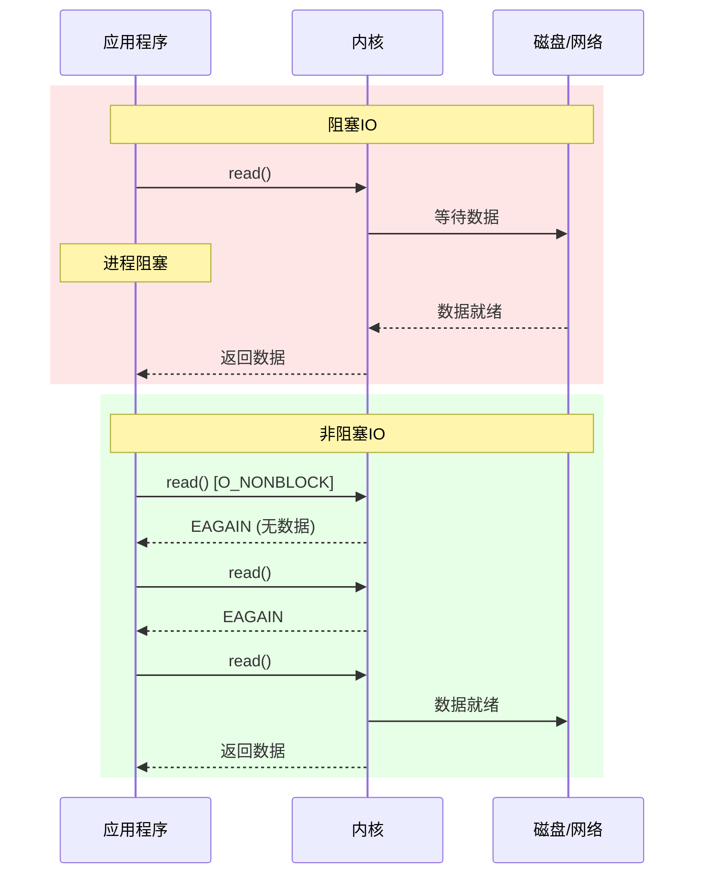

### 1.2 IO 多路复用的价值

**问题**：一个线程如何同时等待多个 fd？

**传统方案**：每个连接一个线程 → 线程开销大，扩展性差

**IO 多路复用**：一个线程监控多个 fd，有事件时才处理

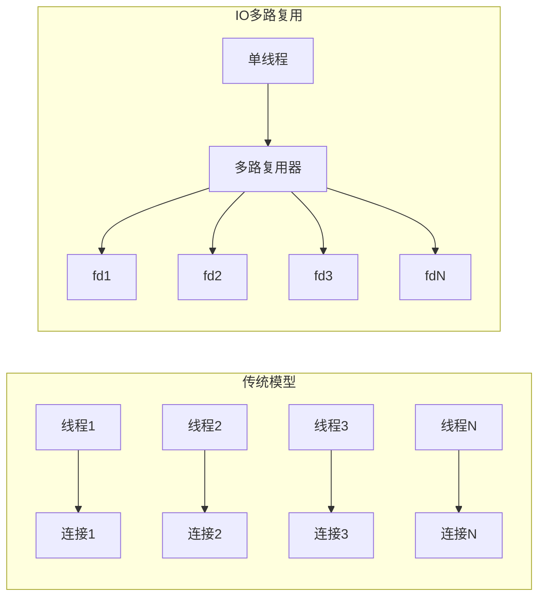

---

## 二、select

### 2.1 工作原理

```c
int select(int nfds, fd_set *readfds, fd_set *writefds, 
           fd_set *exceptfds, struct timeval *timeout);
```

**fd_set 结构**：

```
fd_set 本质是一个位图 (bitmap)，每一位代表一个 fd

┌─────────────────────────────────────────────────────────────────┐
│  fd_set (1024 bits = 128 bytes on most systems)                 │
├───┬───┬───┬───┬───┬───┬───┬───┬───┬───┬─────────────────────────┤
│ 0 │ 1 │ 2 │ 3 │ 4 │ 5 │ 6 │ 7 │...│1023│                        │
├───┼───┼───┼───┼───┼───┼───┼───┼───┼────┤                        │
│ 1 │ 0 │ 0 │ 1 │ 0 │ 1 │ 0 │ 0 │...│ 0  │ 监控 fd 0, 3, 5        │
└───┴───┴───┴───┴───┴───┴───┴───┴───┴────┴────────────────────────┘
```

### 2.2 内核实现流程

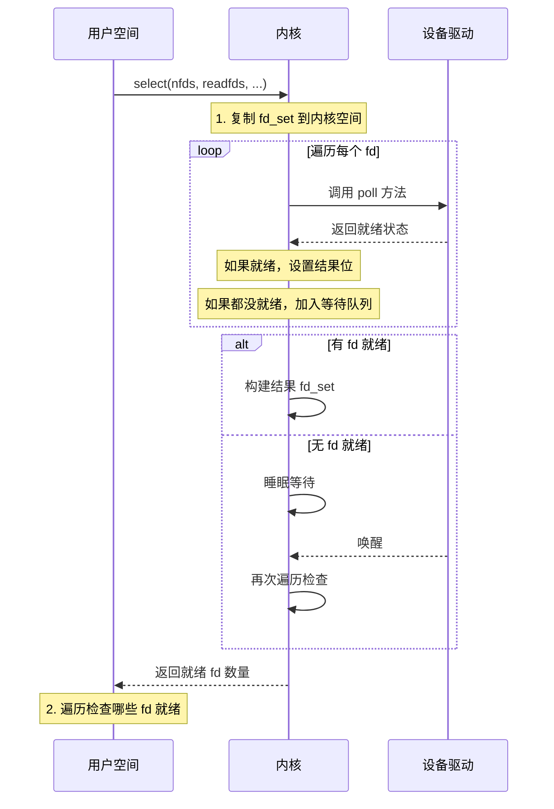

### 2.3 select 的问题

| 问题 | 说明 |
|------|------|
| **fd 数量限制** | 通常最多 1024 个 (FD_SETSIZE) |
| **每次调用复制** | fd_set 要在用户态和内核态之间复制 |
| **线性扫描** | 内核每次遍历所有 fd 检查状态 |
| **返回后再扫描** | 用户态也要遍历找出就绪的 fd |
| **无状态** | 每次调用都要重新设置 fd_set |

**时间复杂度**：O(n) 每次调用，n 是监控的 fd 数量

---

## 三、poll

### 3.1 改进点

poll 使用链表代替位图，解决了 fd 数量限制：

```c
struct pollfd {
    int fd;         // 文件描述符
    short events;   // 请求的事件
    short revents;  // 返回的事件
};

int poll(struct pollfd *fds, nfds_t nfds, int timeout);
```

### 3.2 poll vs select

| 方面 | select | poll |
|------|--------|------|
| fd 限制 | 1024 (FD_SETSIZE) | 无限制 (受系统资源限制) |
| 数据结构 | 位图 | 结构体数组 |
| 事件分离 | 三个 fd_set | events/revents 分离 |
| 内核遍历 | O(n) | O(n) |
| 状态保持 | 无 | 部分 (events 不变) |

**问题依然存在**：
- 每次调用仍需复制整个 pollfd 数组
- 内核仍需线性遍历所有 fd
- 时间复杂度仍是 O(n)

---

## 四、epoll

### 4.1 设计思想

epoll 的核心改进：**状态驻留内核 + 事件驱动**

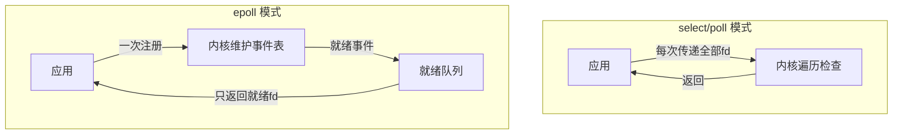

### 4.2 API 设计

```c
// 创建 epoll 实例
int epoll_create(int size);
int epoll_create1(int flags);

// 注册/修改/删除事件
int epoll_ctl(int epfd, int op, int fd, struct epoll_event *event);
// op: EPOLL_CTL_ADD, EPOLL_CTL_MOD, EPOLL_CTL_DEL

// 等待事件
int epoll_wait(int epfd, struct epoll_event *events, 
               int maxevents, int timeout);
```

### 4.3 内核数据结构

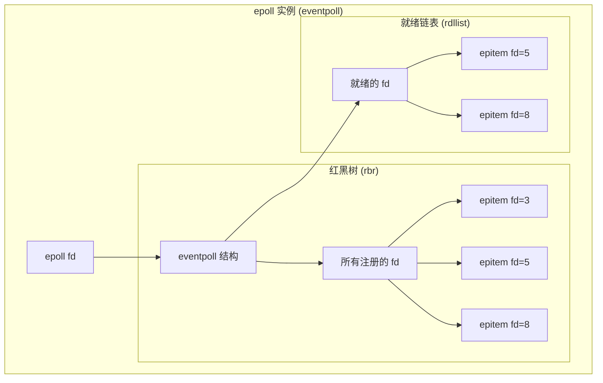

**核心结构体**：

```c
struct eventpoll {
    spinlock_t lock;              // 保护访问
    struct mutex mtx;             // 序列化 epoll_ctl
    wait_queue_head_t wq;         // epoll_wait 等待队列
    wait_queue_head_t poll_wait;  // file->poll() 等待队列
    struct list_head rdllist;     // 就绪链表
    struct rb_root_cached rbr;    // 红黑树根
    struct epitem *ovflist;       // 溢出链表
    struct wakeup_source *ws;     // 唤醒源
    struct user_struct *user;     // 用户信息
};

struct epitem {
    struct rb_node rbn;           // 红黑树节点
    struct list_head rdllink;     // 就绪链表节点
    struct epitem *next;          // 溢出链表
    struct epoll_filefd ffd;      // 关联的 fd 和 file
    int nwait;                    // 等待队列数
    struct list_head pwqlist;     // poll 等待队列
    struct eventpoll *ep;         // 所属 eventpoll
    struct list_head fllink;      // file 链表
    struct epoll_event event;     // 用户事件
};
```

### 4.4 epoll 工作流程详解

#### epoll_create

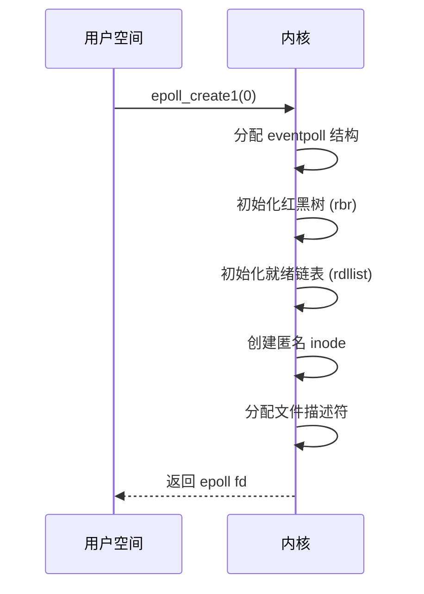

#### epoll_ctl (添加 fd)

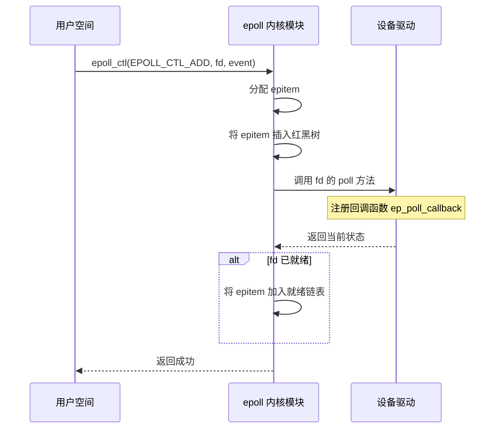

#### 事件触发流程

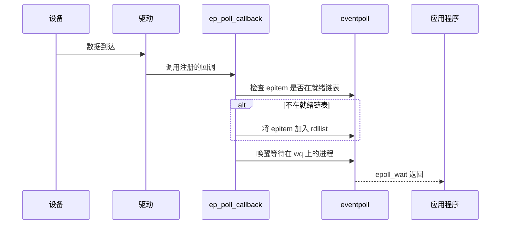

#### epoll_wait

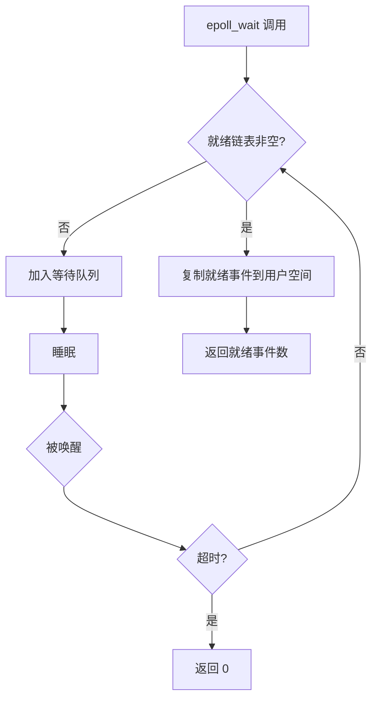

### 4.5 水平触发 vs 边缘触发

| 模式 | 行为 | 使用要点 |
|------|------|----------|
| **LT (水平触发)** | 只要缓冲区有数据，每次 epoll_wait 都会通知 | 简单可靠，但可能频繁唤醒 |
| **ET (边缘触发)** | 只在状态变化时通知一次 | 必须一次读完，配合非阻塞 IO |

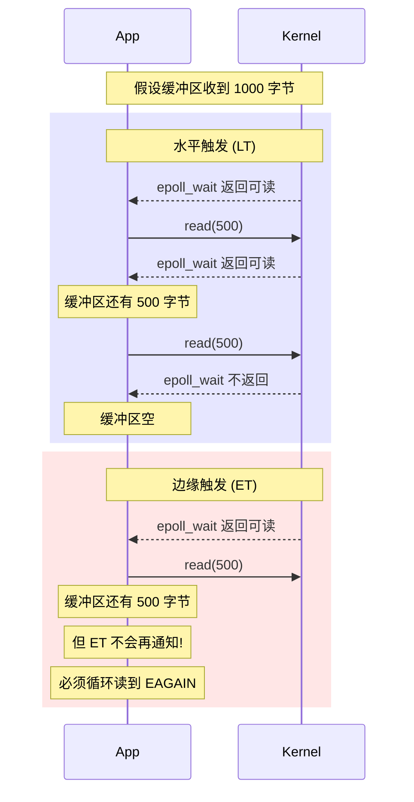

**ET 模式正确用法**：

```c
// 设置非阻塞
fcntl(fd, F_SETFL, O_NONBLOCK);

// 注册为 ET 模式
event.events = EPOLLIN | EPOLLET;
epoll_ctl(epfd, EPOLL_CTL_ADD, fd, &event);

// 读取时必须读到 EAGAIN
while (1) {
    ssize_t n = read(fd, buf, sizeof(buf));
    if (n < 0) {
        if (errno == EAGAIN || errno == EWOULDBLOCK)
            break;  // 真的没数据了
        // 处理错误
    }
    if (n == 0) {
        // 连接关闭
        break;
    }
    // 处理数据
}
```

### 4.6 epoll 性能分析

| 操作 | 时间复杂度 | 说明 |
|------|-----------|------|
| epoll_create | O(1) | 一次性操作 |
| epoll_ctl | O(log n) | 红黑树插入/删除 |
| epoll_wait | O(1)~O(m) | m 是就绪 fd 数，不是总 fd 数 |

**与 select/poll 对比**：

| 场景 | select/poll | epoll |
|------|-------------|-------|
| 10 个 fd，1 个就绪 | 遍历 10 个 | 返回 1 个 |
| 10000 个 fd，10 个就绪 | 遍历 10000 个 | 返回 10 个 |
| 添加/删除 fd | O(1) 用户态 | O(log n) 内核态 |

---

## 五、io_uring

### 5.1 为什么需要 io_uring

epoll 的局限性：
1. **系统调用开销**：每次 epoll_wait 和实际 IO 都是独立的系统调用
2. **不支持文件 IO**：文件 IO 在 Linux 上总是"就绪"的，epoll 对它无效
3. **每次 IO 一次系统调用**：read/write 无法批量处理

**io_uring 目标**：真正的异步 IO + 零系统调用开销

### 5.2 io_uring 架构

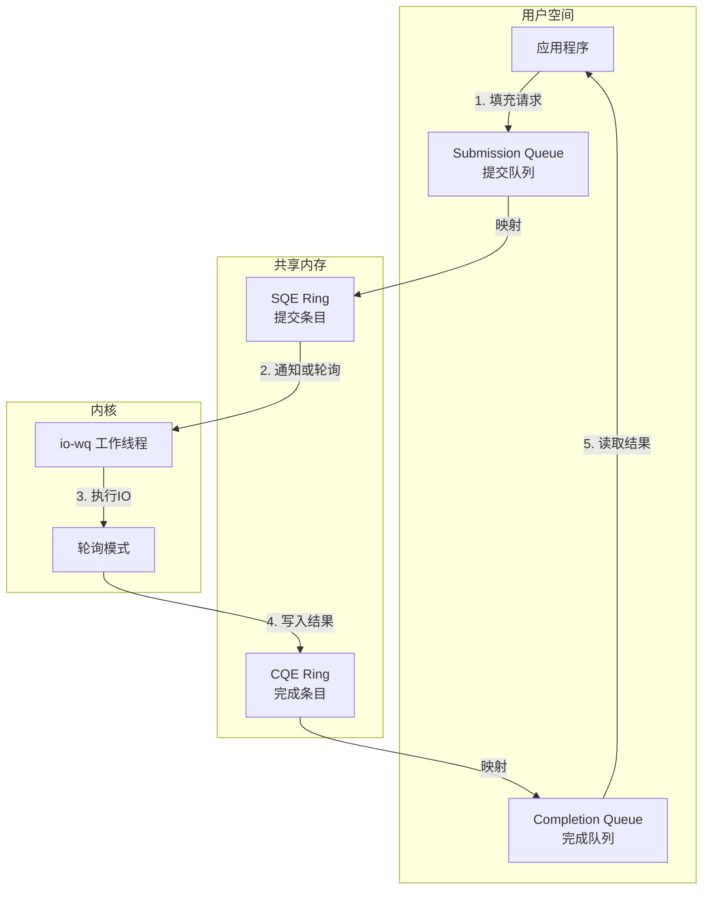

### 5.3 核心数据结构

```
                    用户空间                内核空间
                    ┌─────────┐
    SQ head ───────>│ SQE 0   │<───── 用户写入
                    ├─────────┤
    SQ tail ───────>│ SQE 1   │
                    ├─────────┤
                    │ ...     │
                    └─────────┘
                         │
                         │ 内核消费
                         ▼
                    ┌─────────┐
                    │ 执行 IO │
                    └─────────┘
                         │
                         │ 内核写入
                         ▼
                    ┌─────────┐
    CQ head ───────>│ CQE 0   │<───── 用户读取
                    ├─────────┤
    CQ tail ───────>│ CQE 1   │
                    ├─────────┤
                    │ ...     │
                    └─────────┘
```

**SQE (Submission Queue Entry)**：

```c
struct io_uring_sqe {
    __u8  opcode;       // 操作类型
    __u8  flags;        // 标志
    __u16 ioprio;       // IO 优先级
    __s32 fd;           // 文件描述符
    __u64 off;          // 偏移
    __u64 addr;         // 缓冲区地址
    __u32 len;          // 长度
    union { ... };      // 操作特定参数
    __u64 user_data;    // 用户数据 (返回时原样返回)
};
```

**CQE (Completion Queue Entry)**：

```c
struct io_uring_cqe {
    __u64 user_data;    // 对应 SQE 的 user_data
    __s32 res;          // 结果 (类似系统调用返回值)
    __u32 flags;        // 标志
};
```

### 5.4 工作模式

```mermaid
graph TD
    subgraph "默认模式"
        A1[用户提交 SQE] --> B1[io_uring_enter 系统调用]
        B1 --> C1[内核处理]
        C1 --> D1[写入 CQE]
    end
    
    subgraph "SQPOLL 模式"
        A2[用户提交 SQE] --> B2[内核轮询线程自动消费]
        B2 --> C2[内核处理]
        C2 --> D2[写入 CQE]
        Note over B2: 无系统调用!
    end
    
    subgraph "IOPOLL 模式"
        A3[内核轮询设备完成状态] --> B3[适用于 NVMe 等高速设备]
    end
```

### 5.5 io_uring 优势

| 特性 | 传统 IO | io_uring |
|------|---------|----------|
| 系统调用 | 每次 IO 一次 | 可批量，或零调用 |
| 数据复制 | 多次 | 最小化 |
| 文件 IO | 阻塞或 AIO (复杂) | 原生异步 |
| 网络 IO | epoll + read/write | 统一接口 |
| 批量操作 | 不支持 | 原生支持 |

### 5.6 基本使用示例

```c
#include <liburing.h>

int main() {
    struct io_uring ring;
    struct io_uring_sqe *sqe;
    struct io_uring_cqe *cqe;
    
    // 初始化
    io_uring_queue_init(32, &ring, 0);
    
    // 获取 SQE
    sqe = io_uring_get_sqe(&ring);
    
    // 准备读请求
    io_uring_prep_read(sqe, fd, buf, len, offset);
    sqe->user_data = 123;  // 标识这个请求
    
    // 提交
    io_uring_submit(&ring);
    
    // 等待完成
    io_uring_wait_cqe(&ring, &cqe);
    
    // 处理结果
    if (cqe->res < 0) {
        // 错误
    } else {
        // cqe->res 是读取的字节数
        // cqe->user_data == 123
    }
    
    // 标记 CQE 已处理
    io_uring_cqe_seen(&ring, cqe);
    
    io_uring_queue_exit(&ring);
    return 0;
}
```

---

## 六、各方案综合对比

### 6.1 性能对比

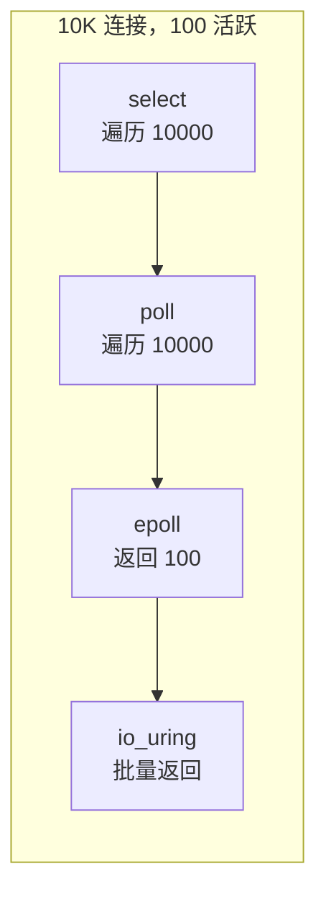

### 6.2 特性对比表

| 特性 | select | poll | epoll | io_uring |
|------|--------|------|-------|----------|
| **可移植性** | POSIX | POSIX | Linux | Linux 5.1+ |
| **最大 fd** | 1024 | 无限制 | 无限制 | 无限制 |
| **fd 复制** | 每次 | 每次 | 一次注册 | 一次设置 |
| **事件检查** | O(n) | O(n) | O(1) | O(1) |
| **文件 IO** | 不适用 | 不适用 | 不适用 | 支持 |
| **批量操作** | 否 | 否 | 否 | 是 |
| **零拷贝** | 否 | 否 | 否 | 可选 |
| **系统调用** | 每次 | 每次 | 每次 | 可选零调用 |
| **触发模式** | LT | LT | LT/ET | 多种 |
| **使用复杂度** | 低 | 低 | 中 | 高 |

### 6.3 选型建议

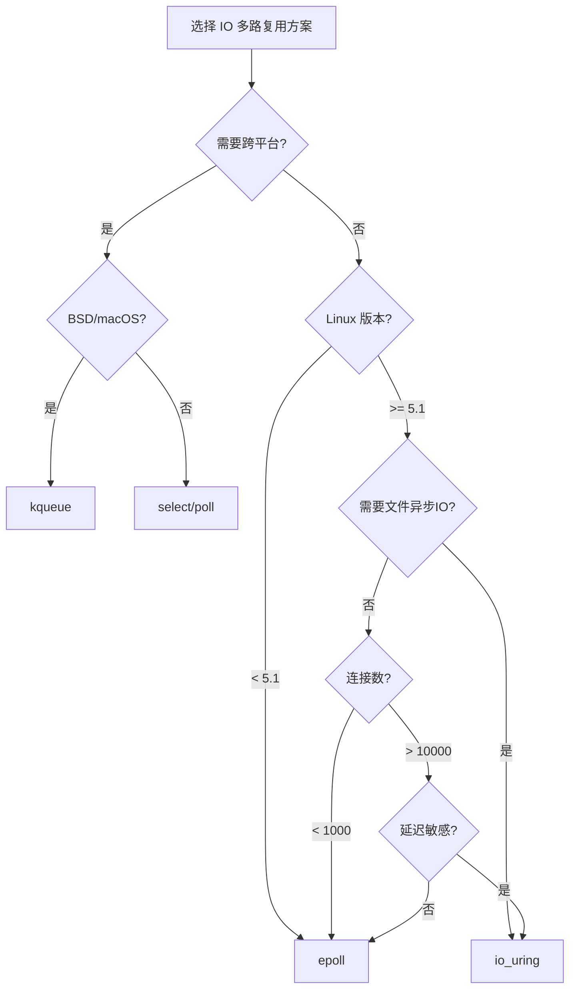

**总结建议**：

| 场景 | 推荐方案 |
|------|----------|
| 跨平台小规模应用 | poll |
| Linux 高并发网络服务 | epoll |
| 极低延迟、高吞吐 | io_uring + SQPOLL |
| 文件异步 IO | io_uring |
| BSD/macOS | kqueue |
| Windows | IOCP |

---

## 七、其他方案简介

### 7.1 kqueue (BSD/macOS)

kqueue 是 BSD 系统的 epoll 等价物，功能更丰富：

```c
int kq = kqueue();

struct kevent change;
EV_SET(&change, sockfd, EVFILT_READ, EV_ADD, 0, 0, NULL);
kevent(kq, &change, 1, NULL, 0, NULL);

struct kevent events[10];
int n = kevent(kq, NULL, 0, events, 10, NULL);
```

**特点**：
- 支持多种事件类型：socket、文件、进程、信号、定时器
- 支持边缘触发
- macOS、FreeBSD、NetBSD、OpenBSD 支持

### 7.2 IOCP (Windows)

Windows 的完成端口模型，真正的 proactor 模式：

- 提交 IO 操作后立即返回
- 操作完成后获得通知
- 天然支持线程池

### 7.3 libuv / libevent

跨平台事件库，封装了各平台的最优实现：

| 平台 | 后端 |
|------|------|
| Linux | epoll |
| macOS | kqueue |
| Windows | IOCP |
| Solaris | /dev/poll |

---

## 八、内核面试要点

### 8.1 常见问题

**Q: epoll 为什么比 select 快？**

A: 三个关键改进：
1. **状态驻留内核**：fd 集合保存在内核，无需每次复制
2. **事件驱动**：只返回就绪的 fd，不遍历全部
3. **回调机制**：设备就绪时主动通知，而非轮询检查

**Q: epoll 的红黑树和就绪链表各有什么作用？**

A: 
- **红黑树**：存储所有注册的 fd，用于 O(log n) 的增删查改
- **就绪链表**：存储已就绪的 fd，epoll_wait 直接返回这个链表

**Q: ET 模式为什么要配合非阻塞 IO？**

A: 
1. ET 模式只在状态变化时通知一次
2. 如果不一次读完，剩余数据不会再触发通知
3. 用非阻塞 IO 可以循环读到 EAGAIN，确保读完

**Q: io_uring 如何实现零系统调用？**

A: 
1. 通过 SQPOLL 模式，内核线程持续轮询 SQ
2. 用户只需写入 SQE 到共享内存
3. 内核线程发现后自动处理
4. 结果写入 CQE，用户直接读取

**Q: 什么时候应该用 io_uring 而不是 epoll？**

A: 
1. 需要文件异步 IO（epoll 对常规文件无效）
2. 需要批量提交减少系统调用
3. 对延迟极度敏感，需要 SQPOLL 零调用模式
4. 需要更高级功能如链式操作、固定缓冲区

---

## 相关文章

- [上一篇：String Storage Data Structures](/articles/c/c-13-保存英文句子的数据结构/)
- [下一篇：Memory Alignment and Struct Packing](/articles/c/c-15-Memory-Alignment/)
