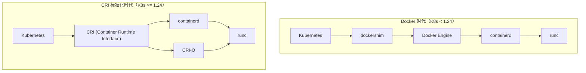
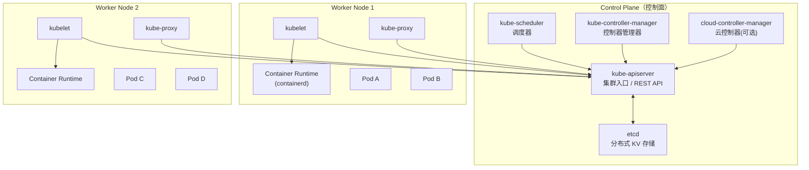
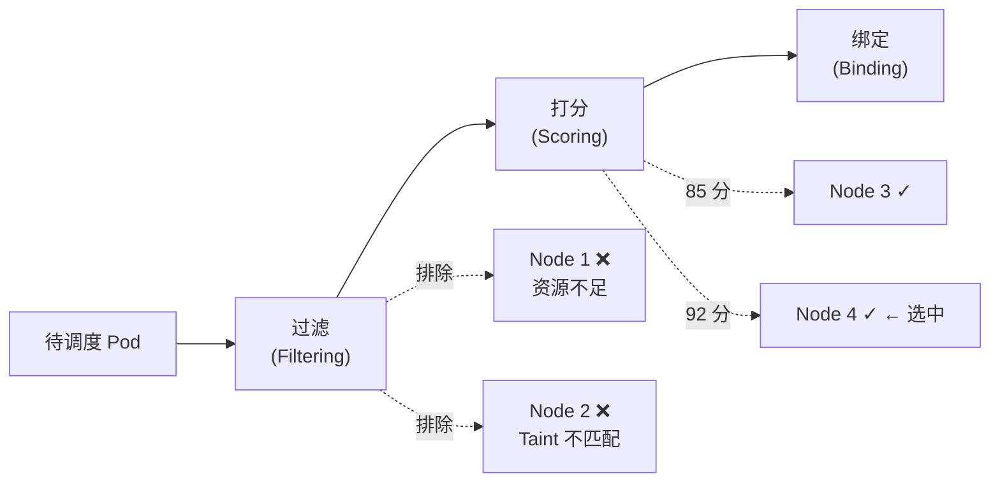
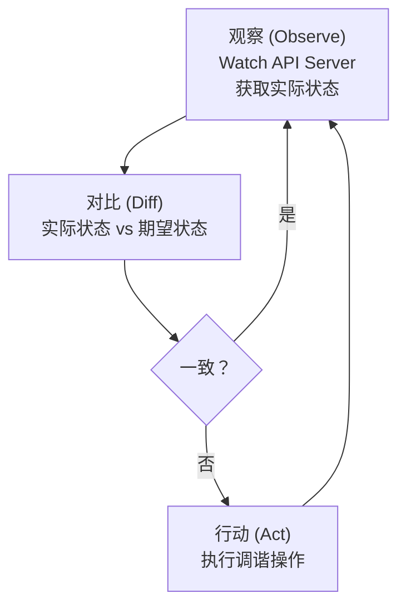
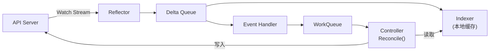
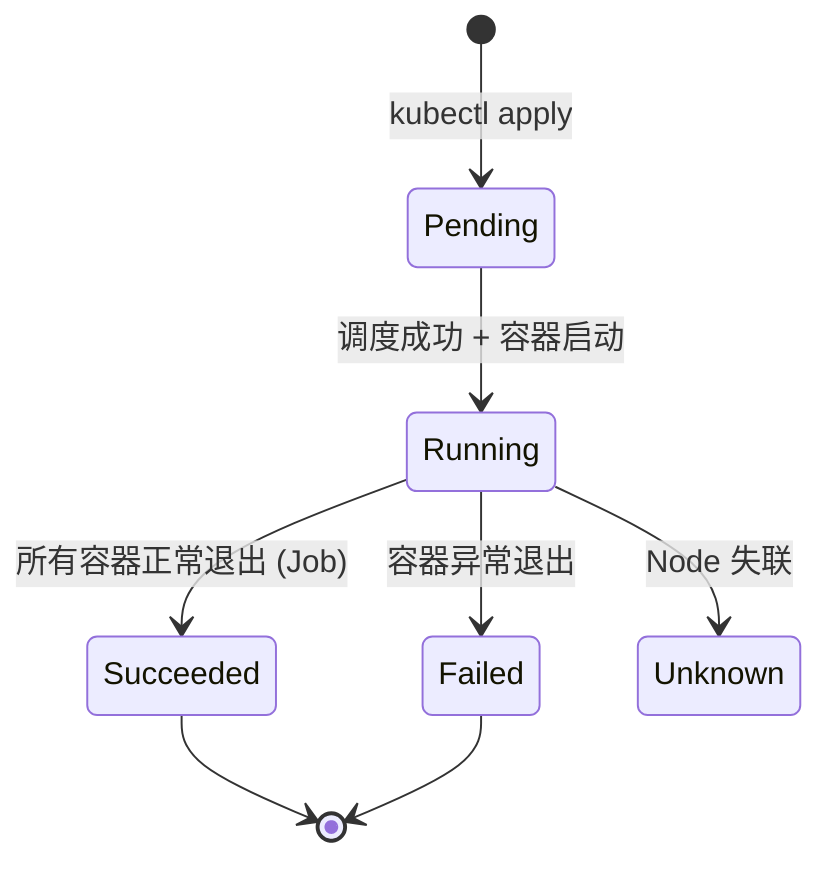

+++
title = "Kubernetes架构与核心概念"
description = "K8s集群架构、Control Plane与Worker Node组件、API对象模型、声明式设计原理与核心工作流"
date = 2025-01-16
weight = 3000
[taxonomies]
tags = ["kubernetes", "container", "docker", "architecture", "devops"]
[extra]
toc = true
+++

# Kubernetes 架构与核心概念

---

## 一、Kubernetes 概述

### 1.1 什么是 Kubernetes

Kubernetes（K8s）是 Google 开源的容器编排平台，用于自动化部署、扩展和管理容器化应用。源自 Google 内部系统 Borg/Omega 的设计理念，2014 年开源，现由 CNCF 维护。

**核心价值**：

| 能力 | 说明 |
|------|------|
| **自动化部署和回滚** | 声明期望状态，K8s 自动达成并维持 |
| **服务发现和负载均衡** | 内置 Service 和 DNS |
| **存储编排** | 自动挂载本地/网络/云存储 |
| **自动装箱（Bin Packing）** | 根据资源需求调度 Pod 到最合适的节点 |
| **自我修复** | 容器崩溃自动重启，节点故障自动迁移 |
| **密钥和配置管理** | Secret / ConfigMap 解耦应用与配置 |
| **水平扩缩容** | HPA 根据负载自动调整副本数 |

### 1.2 K8s 与 Docker 的关系



| 概念 | 说明 |
|------|------|
| **Docker** | 容器镜像构建工具（`docker build`），镜像格式是 OCI 标准 |
| **containerd** | 容器运行时（从 Docker 拆分），K8s 默认运行时 |
| **CRI-O** | 专为 K8s 设计的轻量运行时 |
| **runc** | OCI 标准的底层容器进程创建工具 |
| **CRI** | K8s 定义的容器运行时接口，任何实现 CRI 的运行时均可对接 |

> K8s 1.24+ 移除了 dockershim，但 Docker 构建的镜像仍然兼容（OCI 标准）。

---

## 二、集群架构

### 2.1 整体架构



### 2.2 Control Plane 组件

#### kube-apiserver

- 集群的**唯一入口**，所有操作都通过 API Server
- 提供 RESTful API（kubectl、控制器、kubelet 都与它通信）
- 负责**认证（AuthN）→ 授权（AuthZ）→ 准入控制（Admission）→ 持久化到 etcd**
- 支持水平扩展（多实例 + 负载均衡）

```bash
# 所有资源操作都是 API 调用
kubectl get pods
# 等价于
curl -k https://<api-server>:6443/api/v1/namespaces/default/pods \
  -H "Authorization: Bearer <token>"
```

##### API Server 内部机制深入

**完整请求处理链**

每个 API 请求经过以下 Handler Chain（顺序严格）：

```
HTTP Request
  → Authentication（认证：x509/Token/OIDC/Webhook → 确定 user/group/SA）
  → Audit Logging（审计日志记录）
  → Impersonation（身份伪装，如 kubectl --as=）
  → Authorization（授权：RBAC/ABAC/Webhook/Node → 允许/拒绝）
  → Mutating Admission Webhooks（变更准入：注入 sidecar、设默认值等）
  → Schema Validation（对象结构校验）
  → Validating Admission Webhooks（验证准入：策略检查、合规校验）
  → etcd Write（持久化）
  → Response
```

> **注意**：Mutating 在 Validating 之前执行，因此 Mutating Webhook 注入的内容也会被 Validating Webhook 校验。两类 Webhook 内部都支持 `failurePolicy: Ignore|Fail`。

**API Priority and Fairness (APF)**

自 K8s 1.20+ GA，APF 替代了 `--max-requests-inflight` / `--max-mutating-requests-inflight` 的粗粒度限流：

| 概念 | 说明 |
|------|------|
| **FlowSchema** | 将请求按 user/group/verb/resource 等维度分类到不同 Flow |
| **PriorityLevelConfiguration** | 为每个优先级定义并发配额（`assuredConcurrencyShares`）和排队参数（`queues`、`queueLengthLimit`、`handSize`） |
| **Fair Queuing** | 使用 Shuffle Sharding + Fair Queuing 防止单个 Flow 饿死其他 Flow |

```yaml
# 系统内置的优先级（从高到低）：
# system → leader-election → workload-high → workload-low → global-default → exempt(不限流)
# 自定义示例：将 CI/CD ServiceAccount 的请求限制在独立队列
apiVersion: flowcontrol.apiserver.k8s.io/v1
kind: FlowSchema
metadata:
  name: ci-cd-flow
spec:
  priorityLevelConfiguration:
    name: workload-low
  matchingPrecedence: 1000
  rules:
    - subjects:
        - kind: ServiceAccount
          serviceAccount:
            name: ci-cd-sa
            namespace: ci-cd
      resourceRules:
        - verbs: ["*"]
          apiGroups: ["*"]
          resources: ["*"]
```

**Watch Cache**

API Server 在 etcd 之上维护一层内存缓存，避免所有 LIST/WATCH 请求直接打到 etcd：

- **LIST 请求**：优先从 Watch Cache 读取（`resourceVersion != "0"` 时），避免 etcd 全量扫描
- **WATCH 请求**：从 Cache 的 **Ring Buffer**（`cyclic buffer`）发送事件，而非逐个 watch etcd
- Watch Cache 通过 `--watch-cache-sizes` 配置每类资源的缓存事件数量（默认 100）
- 当 Watch Cache 容量不足时，watch 客户端会收到 `410 Gone`，需要重新 LIST + WATCH（即 relist）

**Aggregation Layer（聚合层）**

API Server 支持通过 `APIService` 资源扩展 API：

```yaml
apiVersion: apiregistration.k8s.io/v1
kind: APIService
metadata:
  name: v1beta1.metrics.k8s.io
spec:
  service:
    name: metrics-server
    namespace: kube-system
  group: metrics.k8s.io
  version: v1beta1
  groupPriorityMinimum: 100
  versionPriority: 100
```

- `metrics-server` 通过 APIService 注册，`kubectl top` 请求被 API Server 代理到 metrics-server Pod
- Custom Metrics（Prometheus Adapter）、CRD + Aggregated API Server 都走此路径
- 与 CRD 的区别：Aggregation 可以有完全自定义的存储后端和业务逻辑，CRD 只能用 etcd

#### etcd

- 分布式一致性 KV 存储（基于 Raft 协议）
- 存储集群的**全部状态**（Pod、Service、ConfigMap、Secret 等）
- 是集群的**唯一持久化层**——etcd 数据丢失 = 集群丢失
- 生产环境至少 **3 节点**部署（奇数，满足 Raft 多数派）

**关键特性**：
- **Watch 机制**：组件可以 watch 资源变化，实现事件驱动
- **MVCC**：多版本并发控制，支持历史版本查询
- **事务**：支持原子操作

##### etcd 内部机制深入

**Raft 共识协议**

etcd 基于 Raft 实现强一致性。Raft 将共识拆解为三个子问题：

| 子问题 | 机制 | 细节 |
|--------|------|------|
| **Leader Election** | Term（任期）+ 投票 | Follower 在 election-timeout 内未收到心跳 → 自增 Term → 转 Candidate → 向所有节点 RequestVote；获得 N/2+1 票即当选 Leader |
| **Log Replication** | AppendEntries RPC | Leader 将 client 写入封装为 Log Entry → AppendEntries 发送给所有 Follower → 超过半数（Quorum = N/2+1）确认即 committed → apply 到状态机 |
| **Safety** | Term 单调递增 + Log 匹配 | 任一 Term 最多一个 Leader；Follower 拒绝 Term 更低的请求；Committed entry 不会被覆盖 |

```
写入流程：Client → Leader → AppendEntries(Followers) → Quorum ACK → Commit → Apply → Response
                                                                  ↓
                                                        Follower 异步 Apply
```

**存储引擎**

etcd 底层使用 **BoltDB**（现为 bbolt fork）作为持久化存储：

- BoltDB 是基于 **B+ Tree** 的嵌入式 KV 数据库，单文件、支持事务
- etcd 使用 **revision**（全局逻辑时钟）作为 BoltDB 的 key，每次写入操作都会使 revision 单调递增
- 存储格式：BoltDB key = `revision`（main + sub），value = `KeyValue protobuf`（包含 key、value、create_revision、mod_revision、version 等）

**MVCC 多版本并发控制**

etcd 的 MVCC 由两部分组成：

```
内存层：keyIndex（B-Tree）
  key "foo" → generations: [{created: rev5, modified: [rev5, rev8, rev12]}]
  
持久层：BoltDB backend
  rev5 → {key: "foo", value: "bar1", create_revision: 5, mod_revision: 5, version: 1}
  rev8 → {key: "foo", value: "bar2", create_revision: 5, mod_revision: 8, version: 2}
```

- **keyIndex**：内存中的 B-Tree 索引，映射 `key → []revision`，支持快速定位某个 key 的所有历史版本
- **backend store**：BoltDB 中以 `revision → KeyValue` 存储实际数据
- **Compaction（压缩）**：删除指定 revision 之前的历史版本，释放空间。`--auto-compaction-retention` 可配置保留时长（如 5m 或 1h）

**Watch 实现**

```
WatchableStore
  ├── synced watchers    → 已追赶到当前 revision 的 watcher（高效路径）
  └── unsynced watchers  → 需要从历史 revision 追赶的 watcher
  
事件流：etcd 写入 → 生成 Event → 遍历 synced watchers → 匹配 key range → 推送到 watcher 的 event channel
Unsynced watcher 通过 BoltDB 范围扫描补齐历史事件后，晋升为 synced watcher
```

**关键参数**

| 参数 | 默认值 | 说明 |
|------|--------|------|
| `--heartbeat-interval` | 100ms | Leader 心跳间隔，通常设为 RTT 的 0.5-1.5 倍 |
| `--election-timeout` | 1000ms | 选举超时，必须 >= 10 × heartbeat-interval |
| `--snapshot-count` | 100000 | 每 N 次写入触发一次快照，快照后可截断 WAL |
| `--quota-backend-bytes` | 2GB（上限 8GB） | DB 文件大小配额，超限触发 NOSPACE alarm |
| `--auto-compaction-retention` | 0（禁用） | 自动压缩保留时长 |

**运维要点**

| 问题 | 原因与处理 |
|------|-----------|
| **NOSPACE alarm** | DB 超过 quota → 集群进入只读 → `etcdctl alarm disarm` + `etcdctl defrag` + 调大 quota 或清理 key |
| **Defrag** | Compaction 只逻辑删除，物理空间不释放 → `etcdctl defrag` 重写 DB 文件回收空间（会短暂阻塞读写，逐节点执行） |
| **备份恢复** | `etcdctl snapshot save backup.db` → `etcdctl snapshot restore backup.db --data-dir=/new/data`（恢复时生成新 cluster ID） |

**K8s 如何使用 etcd**

- 存储路径格式：`/registry/<resource>/<namespace>/<name>`（如 `/registry/pods/default/my-pod`）
- Cluster-scoped 资源：`/registry/<resource>/<name>`（如 `/registry/nodes/node-1`）
- 编码格式：默认 **protobuf**（高效紧凑），可通过 `--storage-media-type` 切换为 JSON
- API Server 在 etcd 之上维护 **Watch Cache** 层，大部分 LIST/WATCH 请求直接由缓存响应，大幅降低 etcd 负载

#### kube-scheduler

- 负责决定**新 Pod 运行在哪个 Node 上**
- 调度过程分两步：
  1. **过滤（Filtering）**：排除不满足条件的 Node（资源不足、Taint 不匹配、亲和性不满足等）
  2. **打分（Scoring）**：对剩余 Node 评分，选最优



**常用调度策略**：

| 策略 | 说明 |
|------|------|
| `nodeSelector` | 最简单的节点选择——按标签匹配 |
| `nodeAffinity` | 更灵活的节点亲和性（required / preferred） |
| `podAffinity / podAntiAffinity` | Pod 间亲和/反亲和 |
| `taints / tolerations` | 节点排斥 + Pod 容忍 |
| `topologySpreadConstraints` | 跨拓扑域均匀分布 |

##### Scheduling Framework 深入

K8s 1.19+ 将调度器重构为 **Scheduling Framework**，所有调度逻辑以插件形式实现。完整扩展点如下：

```
                            ┌─ Scheduling Cycle（串行，per Pod）─────────────────────────┐
                            │                                                           │
PreEnqueue → QueueSort → PreFilter → Filter → PostFilter → PreScore → Score → NormalizeScore → Reserve
                                        │         │                                         │
                                        │    (preemption)                                   │
                                        │                                                   │
                            └───────────┘         ┌─ Binding Cycle（并行）──────────────────┘
                                                  │
                                              Permit → PreBind → Bind → PostBind
```

| 扩展点 | 时机 | 典型插件/用途 |
|--------|------|-------------|
| **PreEnqueue** | Pod 进入调度队列前 | 门控准入（SchedulingGates） |
| **QueueSort** | 决定调度队列排序 | PrioritySort（按 Pod Priority 排序） |
| **PreFilter** | Filter 前的预处理 | 计算 Pod 资源需求汇总，检查是否可调度 |
| **Filter** | 过滤不满足条件的节点 | NodeResourcesFit、NodeAffinity、TaintToleration、PodTopologySpread |
| **PostFilter** | 所有节点被过滤时触发 | **抢占（Preemption）**——驱逐低优先级 Pod 腾出空间 |
| **PreScore** | Score 前预处理 | 收集拓扑信息 |
| **Score** | 对候选节点打分 | NodeResourcesFit、ImageLocality、InterPodAffinity、PodTopologySpread |
| **NormalizeScore** | 归一化分数到 [0,100] | 各 Score 插件自行归一化 |
| **Reserve** | 乐观占位 | VolumeBinding 预留 PV |
| **Permit** | 最终放行/等待/拒绝 | 用于 Gang Scheduling（等待批量 Pod 就绪） |
| **PreBind** | 绑定前准备 | VolumeBinding 完成实际 PV-PVC 绑定 |
| **Bind** | 将 Pod 绑定到 Node | DefaultBinder（写入 Binding 对象到 API Server） |
| **PostBind** | 绑定后清理 | 资源清理、指标上报 |

**关键 Score 插件**

| 插件 | 策略 | 说明 |
|------|------|------|
| **NodeResourcesFit** | `LeastAllocated`（默认） | 倾向资源空闲节点，利于负载均衡 |
| | `MostAllocated` | 倾向资源已用节点，利于集群整合（bin packing） |
| | `RequestedToCapacityRatio` | 自定义分段函数，精确控制资源利用率目标 |
| **ImageLocality** | — | 节点已有镜像则加分，减少拉取时间 |
| **PodTopologySpread** | — | 跨 zone/node 的均匀分布打分 |

**调度队列结构**

```
ActiveQ (heap)          ← 就绪可调度的 Pod，按 QueueSort 排序
    ↑ backoff 到期           ↓ 调度失败
BackoffQ (heap)         ← 调度失败后退避的 Pod（指数退避 1s → 10s，上限可配）
    ↑ 条件变化               ↓ 长期不可调度
UnschedulableQ (map)    ← 不可调度的 Pod（等待集群状态变化后 move 回 ActiveQ/BackoffQ）
```

- 集群事件（Node 加入、Pod 删除、PV 可用等）会触发 UnschedulableQ 中相关 Pod 移入 BackoffQ
- `unschedulableQ` 兜底：每 30s 将所有 Pod 刷回 ActiveQ（防止事件遗漏）

**抢占机制**

当 Filter 阶段所有 Node 都不满足时，进入 PostFilter 执行抢占：

1. 遍历所有 Node，模拟驱逐比当前 Pod Priority 更低的 Pod
2. 选择「牺牲 Pod 数最少 + 最高牺牲 Priority 最低」的 Node 作为 Nominated Node
3. 设置 `pod.status.nominatedNodeName`，低优先级 Pod 被设为 Terminating
4. 当前 Pod **不会立即绑定**，而是回到 ActiveQ 等待下一轮调度（因为低优先级 Pod 有 graceful period）
5. 注意：PDB（PodDisruptionBudget）会影响抢占——违反 PDB 的 victim 会被跳过

#### kube-controller-manager

运行所有内置**控制器（Controller）**的管理器。每个控制器是一个独立的控制循环，负责将集群**实际状态**调谐到**期望状态**。

| 控制器 | 职责 |
|--------|------|
| **Deployment Controller** | 管理 ReplicaSet，实现滚动更新 |
| **ReplicaSet Controller** | 确保 Pod 副本数符合期望 |
| **StatefulSet Controller** | 管理有状态 Pod 的有序部署和扩缩 |
| **DaemonSet Controller** | 确保每个 Node 运行一个 Pod |
| **Job / CronJob Controller** | 管理一次性和定时任务 |
| **Node Controller** | 监控 Node 健康状态 |
| **Endpoint Controller** | 管理 Service → Pod 的映射 |
| **Namespace Controller** | 处理 Namespace 的清理 |
| **ServiceAccount Controller** | 为 Namespace 创建默认 SA |

##### Controller Manager 深入

**Leader Election**

Controller Manager 通过 Lease 对象（`kube-system/kube-controller-manager`）实现单 Leader 运行：

| 参数 | 默认值 | 说明 |
|------|--------|------|
| `--leader-elect` | true | 是否启用选举 |
| `--leader-elect-lease-duration` | 15s | Lease 持续时间，其他候选者在此时间内不会尝试抢占 |
| `--leader-elect-renew-deadline` | 10s | Leader 必须在此时间内续约，否则丢失 Leader 身份 |
| `--leader-elect-retry-period` | 2s | 非 Leader 候选者重试间隔 |

> Lease 对象记录 `holderIdentity`（当前 Leader Pod 名）、`leaseDurationSeconds`、`renewTime`。其他实例持续尝试 acquire，只在 Lease 过期后才能成为新 Leader。

**WorkQueue 三层结构**

所有内置 Controller 使用 `client-go` 提供的三层工作队列：

```
FIFO Queue（基础队列）
  ↓ 继承
DelayingQueue（延迟队列）
  ↓ 继承
RateLimitingQueue（限速队列）
  ├── ItemExponentialFailure: baseDelay=5ms, maxDelay=1000s（失败次数指数退避）
  └── BucketRateLimiter: rate=10qps, burst=100（令牌桶全局限速）
```

- `AddRateLimited(key)` → 根据失败次数计算延迟 → 延迟后入队 → Worker goroutine 取出处理
- 处理成功调 `Forget(key)` 重置退避；失败调 `AddRateLimited(key)` 指数增长等待时间
- 去重：同一 key 在队列中只存在一次（processing set + dirty set），避免重复调谐

**Node Controller 参数与驱逐**

| 参数 | 默认值 | 说明 |
|------|--------|------|
| `--node-monitor-period` | 5s | 检查 Node 状态的间隔 |
| `--node-monitor-grace-period` | 40s | Node 停止上报心跳后标记 Unknown 的等待时间 |
| `--pod-eviction-timeout` | 5m（已废弃，由 Taint-based eviction 替代） | 节点 NotReady 后驱逐 Pod 的等待时间 |

Taint-based eviction（默认启用）流程：
1. Node Controller 发现心跳超时 → 添加 `node.kubernetes.io/not-ready` 或 `node.kubernetes.io/unreachable` Taint（effect=NoExecute）
2. Pod 上若无对应 Toleration → 立即驱逐；有 Toleration + `tolerationSeconds=300` → 300s 后驱逐
3. 驱逐速率限制：`--node-eviction-rate=0.1`（即每 10s 驱逐一个节点的 Pod），防止大面积网络分区时雪崩

**Garbage Collection（GC）**

K8s 通过 `ownerReferences` 实现级联删除：

| 删除策略 | 行为 |
|---------|------|
| **Background**（默认） | 先删除 owner → GC Controller 异步删除 dependents |
| **Foreground** | owner 进入 `deletionTimestamp` + `finalizer:foregroundDeletion` 状态 → 先删除所有 dependents → 最后删除 owner |
| **Orphan** | 删除 owner 但保留 dependents（移除 ownerReferences） |

```yaml
# ownerReferences 示例：ReplicaSet 拥有的 Pod
metadata:
  ownerReferences:
    - apiVersion: apps/v1
      kind: ReplicaSet
      name: my-app-5d8c9f7b4
      uid: xxxx-xxxx
      controller: true        # 标识为控制器 owner
      blockOwnerDeletion: true # Foreground 删除时阻塞 owner 删除
```

### 2.3 Worker Node 组件

#### kubelet

- 运行在每个 Node 上的**代理**
- 职责：
  - 从 API Server 获取分配到本节点的 Pod Spec
  - 调用 Container Runtime（通过 CRI）创建/管理容器
  - 执行**探针**（Liveness / Readiness / Startup）
  - 上报 Node 和 Pod 状态到 API Server
  - 管理 Volume 挂载

##### kubelet 内部机制深入

**PLEG（Pod Lifecycle Event Generator）**

PLEG 是 kubelet 中最关键的子系统之一，负责将容器运行时状态变化转换为 Pod 生命周期事件：

```
每 relist-period(1s) 执行一次：
  CRI.ListPodSandbox() + CRI.ListContainers()
    → 与上一次状态对比
    → 生成事件：ContainerStarted / ContainerDied / ContainerRemoved / ContainerChanged
    → 写入 eventChannel → kubelet syncLoop 消费
```

| 参数/阈值 | 值 | 说明 |
|-----------|-----|------|
| `relist-period` | 1s | PLEG 轮询间隔 |
| PLEG healthy 阈值 | 3min | relist 超过 3 分钟未完成 → `PLEG is not healthy` → Node 状态变为 **NotReady** |
| 常见原因 | — | 容器运行时卡死、大量容器导致 CRI 调用慢、磁盘 I/O 瓶颈 |

> K8s 1.26+ 引入 **Evented PLEG**（Alpha），基于 CRI 事件流替代轮询，减少延迟和资源消耗。

**Eviction Manager（驱逐管理器）**

kubelet 监控节点资源，当触发驱逐阈值时按 QoS 顺序驱逐 Pod：

| 驱逐类型 | 行为 |
|---------|------|
| **Hard Eviction** | 达到阈值立即驱逐，无宽限期 |
| **Soft Eviction** | 达到阈值后等待 `eviction-soft-grace-period`，持续超限才驱逐 |

| 驱逐信号 | 默认 Hard 阈值 | 说明 |
|----------|---------------|------|
| `memory.available` | 100Mi | 节点可用内存 |
| `nodefs.available` | 10% | 节点根文件系统可用空间 |
| `nodefs.inodesFree` | 5% | 根文件系统 inode |
| `imagefs.available` | 15% | 镜像存储可用空间 |
| `pid.available` | — | 可用 PID 数 |

**驱逐顺序**：
1. 超过 requests 使用量最多的 Pod
2. QoS 优先级：BestEffort → Burstable → Guaranteed
3. 同 QoS 内按资源使用量超出 requests 的比例排序

**Device Plugin（设备插件）**

kubelet 通过 Device Plugin 框架支持 GPU、FPGA、SR-IOV 等硬件设备：

```
设备注册流程：
  Device Plugin（gRPC Server）→ kubelet Registration API（/var/lib/kubelet/device-plugins/）
    → ListAndWatch() 上报设备列表
    → kubelet 将设备资源注册为 Node Extended Resources（如 nvidia.com/gpu: 4）
    → Pod spec 中通过 resources.limits 请求设备
    → 调度时 kubelet 调用 Allocate() → 返回设备路径/环境变量/挂载点
```

#### kube-proxy

- 实现 **Service** 的网络代理和负载均衡
- 三种模式：

| 模式 | 实现 | 性能 | 推荐 |
|------|------|------|------|
| **iptables**（默认） | iptables 规则 | 中等（规则多时性能下降） | 小中规模 |
| **IPVS** | Linux IPVS 内核模块 | 高（O(1) 查找） | 大规模（>1000 Service） |
| **nftables**（1.29+） | nftables 规则 | 高 | 新版本推荐 |

##### kube-proxy 内部机制深入

**iptables 链结构**

```
PREROUTING / OUTPUT
  → KUBE-SERVICES                         # 入口链：匹配 ClusterIP:Port
      → KUBE-SVC-XXXX (per Service)       # Service 链：随机负载均衡
          → --probability 0.333 → KUBE-SEP-AAA (Endpoint 1)  # DNAT 到 Pod IP:Port
          → --probability 0.500 → KUBE-SEP-BBB (Endpoint 2)  # 条件概率实现均匀分布
          → KUBE-SEP-CCC (Endpoint 3)
      → KUBE-NODEPORTS                    # NodePort 类型 Service
  → KUBE-MARK-MASQ                        # 标记需要 SNAT 的包（0x4000）

POSTROUTING
  → KUBE-POSTROUTING                      # 对标记包执行 MASQUERADE（SNAT）
```

- 每新增一个 Service/Endpoint，iptables 规则都会全量更新（O(N) 刷新）
- 大规模集群中（>5000 Service），iptables 规则刷新延迟可达秒级

**conntrack 问题**

kube-proxy 依赖 Linux `nf_conntrack`（连接跟踪）模块：

| 问题 | 表现 | 解决 |
|------|------|------|
| **conntrack table full** | `nf_conntrack: table full, dropping packet` → 随机丢包 | 调大 `nf_conntrack_max`（如 131072 → 1048576），调小 `nf_conntrack_tcp_timeout_established`（默认 432000s=5天） |
| **conntrack race** | UDP Service 短连接场景下 conntrack entry 残留 → DNAT 到已删除 Pod → 间歇性超时 | 使用 TCP 或配置更短的 UDP timeout |

**IPVS 模式细节**

```
kube-ipvs0（dummy interface）
  ├── 绑定所有 ClusterIP 到该虚拟接口（避免内核 ARP 响应冲突）
  └── IPVS 规则：VirtualServer(ClusterIP:Port) → RealServer(PodIP:Port)

ipset 使用：
  KUBE-CLUSTER-IP    → 所有 ClusterIP 集合（用于 iptables MASQUERADE 匹配）
  KUBE-LOOP-BACK     → 需要 MASQ 的本地流量
  KUBE-NODE-PORT-TCP → NodePort TCP 端口集合
```

- IPVS 支持多种调度算法：rr（轮询）、wrr（加权轮询）、lc（最少连接）、sh（源地址哈希）
- 性能优势：IPVS 基于 hash table O(1) 查找，规则增删为增量更新（不像 iptables 全量刷新）

**externalTrafficPolicy: Local**

| 策略 | 行为 | 优劣 |
|------|------|------|
| `Cluster`（默认） | 流量可能跨 Node 转发（多一跳 SNAT） | 负载均匀，但源 IP 丢失 |
| `Local` | 仅转发到本 Node 的 Pod，不做 SNAT | 保留源 IP，但负载不均（无本地 Pod 则丢弃） |

`Local` 模式下 kube-proxy 创建 `healthCheckNodePort`，外部 LB 通过健康检查感知哪些 Node 有 endpoint，避免流量发送到无 Pod 的 Node。

#### Container Runtime

通过 CRI 接口与 kubelet 通信，负责：
- 拉取镜像
- 创建/启动/停止/删除容器
- 管理容器日志

---

## 三、API 对象模型

### 3.1 资源与对象

K8s 中一切皆**资源（Resource）**，每个资源的实例是一个**对象（Object）**。

每个 API 对象包含：

```yaml
apiVersion: apps/v1          # API 组/版本
kind: Deployment              # 资源类型
metadata:                     # 元数据
  name: my-app
  namespace: production
  labels:
    app: my-app
    version: v1
  annotations:
    description: "My application deployment"
spec:                         # 期望状态（用户声明）
  replicas: 3
  ...
status:                       # 实际状态（系统维护）
  availableReplicas: 3
  ...
```

### 3.2 核心 API 资源

| 类别 | 资源 | 说明 |
|------|------|------|
| **工作负载** | Pod | 最小调度单元 |
| | Deployment | 无状态应用管理（滚动更新） |
| | StatefulSet | 有状态应用（稳定网络标识+存储） |
| | DaemonSet | 每 Node 一个 Pod |
| | Job / CronJob | 一次性/定时任务 |
| **服务发现** | Service | 稳定的网络端点 + 负载均衡 |
| | Ingress | HTTP/HTTPS 路由 |
| | EndpointSlice | Service 后端 Pod 列表 |
| **配置** | ConfigMap | 非敏感配置 |
| | Secret | 敏感信息 |
| **存储** | PersistentVolume (PV) | 存储资源 |
| | PersistentVolumeClaim (PVC) | 存储申请 |
| | StorageClass | 动态存储类 |
| **集群** | Namespace | 资源隔离 |
| | Node | 集群节点 |
| | ServiceAccount | 服务身份 |
| | ResourceQuota | 资源配额 |
| | LimitRange | 默认资源限制 |

### 3.3 Label 与 Selector

Label 是 K8s 中**松耦合关联**的核心机制：

```yaml
# 给 Pod 打标签
metadata:
  labels:
    app: web
    env: production
    tier: frontend

# Service 通过 selector 关联 Pod
spec:
  selector:
    app: web
    tier: frontend

# Deployment 通过 selector 管理 ReplicaSet
spec:
  selector:
    matchLabels:
      app: web
    matchExpressions:
      - key: env
        operator: In
        values: ["production", "staging"]
```

### 3.4 API 对象高级概念

**GVK 与 GVR**：
- **GVK (Group-Version-Kind)**：唯一标识一种 K8s 资源类型。例如 `apps/v1/Deployment`（Group=apps, Version=v1, Kind=Deployment）。核心资源的 Group 为空（如 `v1/Pod`）。
- **GVR (Group-Version-Resource)**：GVK 的 REST 路径形式。Kind `Deployment` → Resource `deployments`（小写复数）。API 路径：`/apis/{group}/{version}/namespaces/{ns}/{resource}`
- API 版本语义：`v1alpha1`（实验性，可能随时删除）→ `v1beta1`（功能完整，API 可能微调）→ `v1`（稳定，向后兼容保证）

**关键 Metadata 字段**：
- **metadata.uid**：全局唯一标识符（UUID），跨 name 唯一。即使同名资源删除重建，uid 也不同。用于 ownerReferences 关联。
- **metadata.resourceVersion**：etcd revision 的字符串表示。用于乐观并发控制（Optimistic Concurrency）——更新时带上 resourceVersion，如果 etcd 中已变更则返回 409 Conflict。Watch 也以 resourceVersion 为起点。
- **metadata.generation**：仅 spec 变更时递增（status 变更不递增）。Controller 用 `observedGeneration` 表示「我已处理到第几代 spec」。

**Server-Side Apply (SSA)**：
- K8s 1.22+ GA。每个字段都有 **field manager** 标记所有权。
- 多个 controller/用户可以拥有不同字段——解决了 `kubectl apply` 的 last-applied annotation 方案的冲突问题。
- `--server-side` flag 或 PATCH with `application/apply-patch+yaml` content type。

### 3.5 Namespace

Namespace 提供**逻辑隔离**：

| 默认 Namespace | 用途 |
|---------------|------|
| `default` | 未指定 Namespace 的资源 |
| `kube-system` | K8s 系统组件 |
| `kube-public` | 公共资源（所有人可读） |
| `kube-node-lease` | 节点心跳 |

> Namespace **不是**安全边界——需要配合 RBAC + NetworkPolicy 才能真正隔离。

---

## 四、声明式设计与控制循环

### 4.1 命令式 vs 声明式

| 模式 | 方式 | 示例 |
|------|------|------|
| **命令式** | 告诉系统「做什么」 | `kubectl scale deployment my-app --replicas=3` |
| **声明式** | 告诉系统「期望状态」 | `kubectl apply -f deployment.yaml`（spec.replicas=3） |

声明式的核心优势：
- **幂等**：多次 apply 同一配置结果一致
- **自修复**：实际状态偏离期望时，控制器自动调谐
- **GitOps 友好**：配置文件就是真理源

### 4.2 控制循环（Reconciliation Loop）

每个控制器持续运行以下循环：



**示例：Deployment Controller**

```
期望状态：replicas = 3
实际状态：当前 Pod 数 = 2

→ 控制器发现差异 → 创建 1 个新 Pod
→ 再次检查 → 3 = 3 → 一致 → 继续观察
```

### 4.3 Informer 机制

控制器不会轮询 API Server，而是通过 **Informer** 机制实现高效的事件驱动：



- **Reflector**：Watch API Server 的变更事件
- **Indexer**：本地缓存，减少 API Server 压力
- **WorkQueue**：去重、限速的工作队列
- **Controller**：从队列取出事件，执行 Reconcile 逻辑

### 4.4 Informer 机制深入

K8s controller 不直接 Watch API Server，而是通过 **client-go Informer** 间接监听：

```
Informer 工作流：
ListAndWatch → Reflector (Watch API) → DeltaFIFO Queue → Indexer (本地缓存/Store)
                                                      ↓
                                              Event Handler → WorkQueue → Reconcile
```

- **Reflector**：建立 Watch 长连接，接收 ADD/UPDATE/DELETE 事件，推入 DeltaFIFO。
- **DeltaFIFO**：按 key 去重的 FIFO 队列。同一对象的多次变更会合并为最新 Delta。
- **Indexer（本地缓存）**：`cache.Store` 接口，支持按 namespace/label 等多维索引。Controller 读数据优先从 Indexer 读（不走 API Server），减轻 API Server 负载。
- **Resync**：Informer 定期（默认 30s~60s）触发所有对象的 UPDATE 事件（即使对象未变），确保 controller 有机会修复「漏掉」的 reconcile。

### 4.5 Finalizers（终结器）

- **定义**：`metadata.finalizers` 字段中的字符串列表。对象被删除时，如果 finalizers 非空，API Server **不会真正删除**，而是设置 `metadata.deletionTimestamp` 并保留对象。
- **流程**：Controller 检测到 `deletionTimestamp` → 执行清理逻辑（如删除外部资源、释放 IP）→ 移除自己的 finalizer → 当所有 finalizer 被移除后，API Server 真正删除对象。
- **典型用途**：PV 的 `kubernetes.io/pv-protection`（防止有绑定 PVC 的 PV 被删除）、Namespace 的 namespace controller。
- **危险场景**：Finalizer 对应的 controller 不存在或故障 → 对象永远无法被删除（stuck in Terminating）。修复方法：手动 patch 移除 finalizer。

### 4.6 Controller 速率控制

- **WorkQueue RateLimiter**：默认使用 `BucketRateLimiter`（令牌桶 10 qps / 100 burst）+ `ItemExponentialFailureRateLimiter`（指数退避 5ms → 1000s，最大 16 次失败后 1000s）。
- **作用**：防止 controller 在错误循环中高频重试压垮 API Server。
- **自定义**：可调整 base delay、max delay、QPS 和 burst。

---

## 五、Pod 核心概念

### 5.1 什么是 Pod

Pod 是 K8s 的**最小调度和部署单元**。一个 Pod 可以包含一个或多个紧密关联的容器。

**Pod 内的容器共享**：
- 网络命名空间（同一 IP、端口、localhost）
- 存储卷（Volume）
- IPC 命名空间

```yaml
apiVersion: v1
kind: Pod
metadata:
  name: my-pod
  labels:
    app: web
spec:
  containers:
    - name: app
      image: nginx:1.25
      ports:
        - containerPort: 80
      resources:
        requests:
          cpu: "100m"        # 0.1 核
          memory: "128Mi"
        limits:
          cpu: "500m"
          memory: "256Mi"
      livenessProbe:
        httpGet:
          path: /healthz
          port: 80
        initialDelaySeconds: 10
        periodSeconds: 5
      readinessProbe:
        httpGet:
          path: /ready
          port: 80
        initialDelaySeconds: 5
        periodSeconds: 3
    - name: sidecar
      image: fluentd:latest
      volumeMounts:
        - name: logs
          mountPath: /var/log/app
  volumes:
    - name: logs
      emptyDir: {}
```

### 5.2 资源管理

| 概念 | 说明 | 不设会怎样 |
|------|------|-----------|
| **requests** | Pod 调度时的**保证资源** | 调度器无法判断节点是否有足够资源 |
| **limits** | 运行时的**最大资源** | 容器可能吃光节点资源 |
| **QoS Class** | 由 requests/limits 决定的服务质量等级 | 节点资源不足时被驱逐的优先级 |

**QoS 等级**：

| QoS Class | 条件 | 被驱逐优先级 |
|-----------|------|------------|
| **Guaranteed** | 所有容器都设了 requests = limits | 最低（最后被驱逐） |
| **Burstable** | 至少一个容器设了 requests | 中 |
| **BestEffort** | 没设 requests 和 limits | 最高（第一个被驱逐） |

##### Pod 内部机制深入

**pause 容器（Infra Container）**

每个 Pod 都有一个隐藏的 `pause` 容器（又称 sandbox/infra container）：

```
Pod
  ├── pause container（第一个启动）
  │     ├── 创建并持有 Network Namespace
  │     ├── 创建并持有 IPC Namespace
  │     └── PID 1 进程，reap zombie processes
  ├── init-container-1 （加入 pause 的 NS）
  ├── init-container-2
  ├── app-container-1  （加入 pause 的 NS）
  └── app-container-2
```

- pause 容器是 Pod 网络和 IPC 命名空间的 **owner**，其他容器通过 `--net=container:pause` 加入
- 即使 app 容器崩溃重启，Network NS 依然存在（IP 不变），因为 pause 容器始终运行
- pause 进程极简（汇编级），只做 `pause()` 系统调用 + 收割僵尸进程

**Init Containers**

Init Container 在所有 app 容器之前**按顺序逐个执行**：

```yaml
spec:
  initContainers:
    - name: wait-for-db
      image: busybox
      command: ['sh', '-c', 'until nc -z mysql 3306; do sleep 2; done']
    - name: init-schema
      image: my-app:migrate
      command: ['./migrate', 'up']
  containers:
    - name: app
      image: my-app:latest
```

- 每个 Init Container 必须成功退出（exit 0）后下一个才启动
- 任何 Init Container 失败 → Pod 重启（遵循 `restartPolicy`）
- 用途：等待依赖服务就绪、初始化数据/配置、下载文件等

**Sidecar Containers（K8s 1.28+ Beta）**

原生 Sidecar 是设置 `restartPolicy: Always` 的 Init Container：

```yaml
spec:
  initContainers:
    - name: istio-proxy
      image: istio/proxyv2
      restartPolicy: Always    # 标记为 Sidecar：随 Pod 生命周期持续运行
  containers:
    - name: app
      image: my-app:latest
```

- 在所有普通 Init Container 之后启动，但在 app 容器之前启动
- 随 Pod 生命周期持续运行（不像普通 Init Container 跑完就退出）
- Pod 终止时，Sidecar 在所有 app 容器停止后才收到 SIGTERM
- 解决了传统 Sidecar（作为 app 容器）的启停顺序问题

**cgroup 资源映射**

Pod 的 `resources.requests` 和 `resources.limits` 映射到 Linux cgroup 参数：

| K8s 配置 | cgroup v1 参数 | cgroup v2 参数 | 说明 |
|----------|---------------|---------------|------|
| `requests.cpu: 100m` | `cpu.shares = 102` | `cpu.weight = 4` | CPU 权重（相对值），1 core = 1024 shares |
| `limits.cpu: 500m` | `cpu.cfs_quota_us = 50000`（period=100000） | `cpu.max = 50000 100000` | CFS 带宽限制：每 100ms 允许用 50ms |
| `requests.memory: 128Mi` | 仅用于调度 + QoS 计算 | 仅用于调度 + QoS 计算 | 内存 requests 不直接映射到 cgroup |
| `limits.memory: 256Mi` | `memory.limit_in_bytes = 268435456` | `memory.max = 268435456` | 超限触发 OOM Kill |

**OOM Score Adj**

kubelet 根据 QoS 等级设置 `oom_score_adj`，影响内核 OOM Killer 的杀进程优先级：

| QoS Class | oom_score_adj | 说明 |
|-----------|--------------|------|
| **Guaranteed** | -997 | 几乎不会被 OOM Kill |
| **BestEffort** | 1000 | 最先被 OOM Kill |
| **Burstable** | 2 ~ 999 | 根据 memory request 占 Node 总内存的比例计算：`min(max(2, 1000 - 1000*memReq/nodeMem), 999)` |

**CPU Throttling 问题**

当设置 `limits.cpu` 时，CFS（Completely Fair Scheduler）会在每个 period（100ms）内限制 CPU 时间：

```
limits.cpu: 100m → quota = 10ms / period 100ms
  → 即使节点 CPU 空闲，容器在 10ms 用完配额后会被 throttled 直到下一个 period
  → 表现：请求延迟毛刺（P99 抖动）、应用感觉"时快时慢"
```

- **诊断**：检查 `/sys/fs/cgroup/cpu/cpu.stat` 中 `nr_throttled` 和 `throttled_time`
- **缓解**：适当放宽 `limits.cpu`，或对延迟敏感服务只设 requests 不设 limits（但需配合 LimitRange 防止滥用）
- 生产建议：`limits.cpu` 设为 requests 的 2-5 倍，或使用 `static CPU manager policy`（Guaranteed QoS Pod 绑定独占 CPU）

### 5.3 Pod 生命周期



---

## 六、面试高频问答

**Q1：K8s 有哪些核心组件？各自职责是什么？**

A：Control Plane 四大组件：API Server（集群入口，所有组件与之通信），etcd（存储集群状态），Scheduler（决定 Pod 调度到哪个 Node），Controller Manager（运行控制循环，维持期望状态）。Worker Node 组件：kubelet（节点代理，管理 Pod 生命周期），kube-proxy（实现 Service 网络代理），Container Runtime（运行容器）。

**Q2：etcd 在 K8s 中的作用？为什么用 etcd？**

A：etcd 是 K8s 唯一的持久化存储，保存全部集群状态。选择 etcd 是因为：1) 强一致性（Raft 协议）；2) Watch 机制支持事件驱动；3) MVCC 支持乐观并发；4) 高可靠（多节点 Quorum）。所有组件只通过 API Server 间接读写 etcd，不直接访问。

**Q3：声明式和命令式的区别？为什么 K8s 用声明式？**

A：命令式告诉系统「做什么」（创建/删除/修改），声明式告诉系统「期望什么状态」，系统自动达成并维持。声明式优势：1) 幂等性——多次 apply 结果一致；2) 自愈——实际状态偏离时自动调谐；3) GitOps 友好——配置即代码。

**Q4：Pod 是什么？为什么不直接调度容器？**

A：Pod 是一组紧密关联的容器的组合，共享网络和存储。抽象 Pod 而非直接调度容器是因为：1) 有些应用需要 Sidecar 模式（如日志收集、服务网格代理）；2) Pod 内容器共享 localhost，通信零开销；3) Pod 是调度的原子单元，确保关联容器在同一节点。

**Q5：kube-proxy 的 iptables 和 IPVS 模式有什么区别？**

A：iptables 模式用 iptables 规则实现 Service 到 Pod 的转发，每个 Service 对应一组规则链。规则匹配是顺序扫描，Service 数量多时（>1000）性能下降明显。IPVS 模式使用内核 IPVS 模块，基于哈希表 O(1) 查找，支持更多负载均衡算法（RR、WRR、LC、SH 等），大规模集群推荐。

**Q6：从 kubectl apply 到 Pod Running，完整链路是什么？**

A：完整链路如下：

```
1. kubectl apply -f pod.yaml
   → kubectl 将 YAML 转为 JSON → 发送 POST/PUT 请求到 API Server

2. API Server 处理
   → Authentication → Authorization → Mutating Admission → Validation → Validating Admission
   → 写入 etcd（Pod 状态 = Pending，nodeName 为空）

3. Scheduler Watch 到新 Pod（nodeName 为空）
   → PreFilter → Filter（排除不合适节点） → Score（给候选节点打分） → 选出最优 Node
   → 创建 Binding 对象 → API Server 更新 Pod.spec.nodeName → 写入 etcd

4. 目标 Node 上的 kubelet Watch 到分配给自己的 Pod
   → 调用 CRI RunPodSandbox()：创建 pause 容器 + Network NS
   → 调用 CNI ADD：为 Pod 配置网络（分配 IP、设置路由/veth）
   → 按顺序启动 Init Containers（每个成功后启动下一个）
   → 启动 Sidecar Containers（如有）
   → 并行启动所有 app Containers：CRI CreateContainer() + StartContainer()
   → 执行 postStart Hook

5. 探针检查
   → startupProbe 通过后（如配置）→ livenessProbe + readinessProbe 开始
   → readinessProbe 通过 → kubelet 更新 Pod Condition: Ready=True
   → Endpoint Controller watch 到 Ready Pod → 更新 EndpointSlice → Service 开始转发流量

6. Pod 状态变为 Running
   → kubelet 上报 Pod status → API Server → etcd
```

> 面试加分点：提到 Watch Cache 层（Scheduler/kubelet 实际 watch 的是 API Server 缓存而非直接 etcd）、CNI 调用时机、readinessProbe 与 Service 流量的关系。

**Q7：如何排查 Pod 一直处于 Pending 状态？**

A：系统化排查步骤：

```
1. kubectl describe pod <name> → 查看 Events 部分

2. 根据 Events 判断原因：
   ┌─ "Insufficient cpu/memory"
   │    → 集群资源不足 → kubectl top nodes 检查 → 扩容节点或清理资源
   │
   ├─ "0/N nodes are available: N node(s) had taint..."
   │    → Taint 不匹配 → 检查 Pod tolerations 或调整 Node taints
   │
   ├─ "0/N nodes are available: N node(s) didn't match Pod's node affinity/selector"
   │    → nodeSelector / nodeAffinity 无匹配节点 → 检查标签或调整亲和性
   │
   ├─ "0/N nodes are available: N Insufficient pods"
   │    → Node 的 maxPods 达到上限 → 检查 kubelet --max-pods 配置
   │
   ├─ "pod has unbound immediate PersistentVolumeClaims"
   │    → PVC 未绑定 → 检查 PV/StorageClass 是否可用、provisioner 是否正常
   │
   ├─ "FailedScheduling: no preemption victims found"
   │    → 即使抢占也无法满足 → 检查 PriorityClass 和资源需求
   │
   └─ 无 Events / Events 正常但仍 Pending
        → 检查 Scheduler 是否运行正常（kube-system 中 scheduler Pod 状态）
        → 检查是否有 SchedulingGates 阻止调度
        → kubectl get pod -o yaml 查看 status.conditions

3. 进阶排查：
   → kubectl get events --sort-by='.lastTimestamp' 查看集群级事件
   → 检查 ResourceQuota 是否达到 Namespace 配额上限
   → 检查是否有 Webhook 拦截导致 Pod 创建实际未完成
```

---

## 相关文章

- [下一篇：Kubernetes工作负载管理](@/articles/cloud-native/k8s-02-工作负载管理.md)
