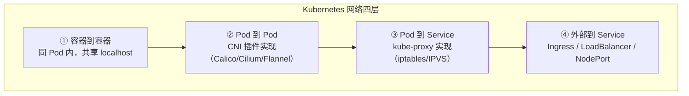
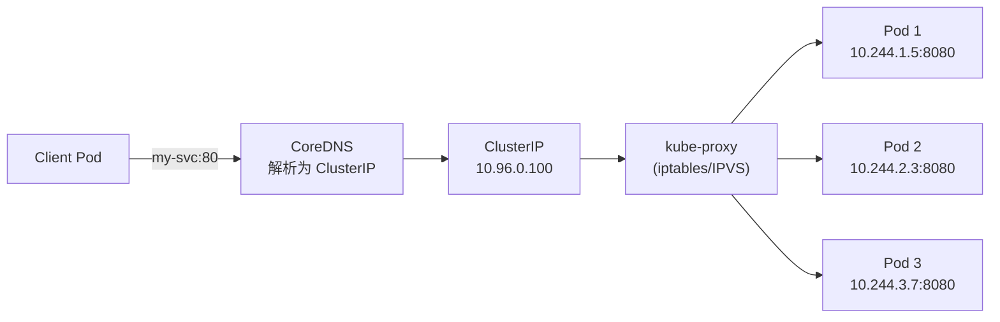

+++
title = "Kubernetes服务发现与网络"
description = "Service类型详解、DNS服务发现、Ingress路由、NetworkPolicy安全隔离与CNI插件深入对比"
date = 2025-01-16
weight = 5000
[taxonomies]
tags = ["kubernetes", "container", "networking", "service", "ingress"]
[extra]
toc = true
+++

# Kubernetes 服务发现与网络

---

## 一、Kubernetes 网络模型

### 1.1 网络基本要求

Kubernetes 网络模型有四条硬性约束（CNI 插件必须实现）：

| 约束 | 说明 |
|------|------|
| **Pod 到 Pod** | 任意两个 Pod 之间可以直接通信，**无需 NAT** |
| **Node 到 Pod** | Node 上的进程可以与该 Node 上所有 Pod 通信 |
| **Pod 看到的 IP** | Pod 看到的自己 IP 与其他 Pod 看到它的 IP 一致 |
| **独立 IP** | 每个 Pod 有独立的 IP 地址 |

### 1.2 网络层次



### 1.3 CNI 插件深入对比

| 插件 | 数据面 | 网络模式 | NetworkPolicy | 加密 | 性能 | 特色 |
|------|--------|---------|-------------|------|------|------|
| **Calico** | iptables / eBPF | BGP / IPIP / VXLAN | 完整支持 | WireGuard | 高 | 最广泛使用；支持 BGP |
| **Cilium** | eBPF | VXLAN / Geneve / 直连 | 完整 + L7 策略 | WireGuard / IPsec | 极高 | 可观测性强；Hubble UI |
| **Flannel** | VXLAN / host-gw | Overlay | **不支持** | 无 | 中等 | 最简单；适合入门 |
| **Weave** | VXLAN | Overlay | 支持 | 内置加密 | 中等 | 自动发现；适合小集群 |
| **Antrea** | OVS | Geneve / VXLAN / STT | 完整支持 | IPsec | 高 | VMware 主导 |

**选型建议**：
- **生产环境首选**：Calico（成熟稳定）或 Cilium（eBPF 高性能 + 可观测性）
- **学习/测试**：Flannel（简单）
- **VMware 环境**：Antrea

### 1.4 CNI 插件内部工作原理

#### Calico 架构

Calico 采用**纯 L3 路由**设计，每个 Node 运行 BGP Speaker，将本节点 Pod CIDR 路由通告到集群其他节点：

```
┌──────────────────────────────────────────────────────────┐
│                      Calico 架构                          │
│                                                          │
│  ┌──────────┐    ┌──────────┐    ┌───────────────────┐   │
│  │  Felix    │    │   BIRD   │    │      Typha        │   │
│  │iptables/ │    │   BGP    │    │   fan-out proxy   │   │
│  │eBPF rules│    │  daemon  │    │  (大集群必需)      │   │
│  └──────────┘    └──────────┘    └───────────────────┘   │
│                                                          │
│  数据面模式：                                             │
│  • iptables（默认）：标准 Linux netfilter                  │
│  • eBPF：绕过 kube-proxy，直接在 tc hook 做 DNAT          │
└──────────────────────────────────────────────────────────┘
```

**核心组件**：

| 组件 | 功能 |
|------|------|
| **Felix** | 每个 Node 上的 agent，根据 Policy 编程 iptables/eBPF 规则和路由表 |
| **BIRD** | BGP daemon，向其他 Node 通告本节点 Pod CIDR 路由（如 `10.244.1.0/24 via node-1`） |
| **Typha** | Datastore fan-out proxy，大集群（100+ 节点）中必需——减少 API Server 连接数，Felix 连接 Typha 而非直连 etcd/API |
| **confd** | 监听 datastore 变化，动态生成 BIRD 配置文件 |

**网络模式选择**：

| 模式 | 原理 | 适用场景 | 性能 |
|------|------|---------|------|
| **BGP 直连** | 纯 L3 路由，无封装 | 同子网、支持 BGP 的网络 | **最高** |
| **IPIP** | IP-in-IP 封装（协议号 4） | 跨子网，不支持 BGP | 较高（20 字节 overhead） |
| **VXLAN** | UDP 封装 | 跨子网，不支持 BGP 且防火墙阻断协议 4 | 中等（50 字节 overhead） |
| **CrossSubnet** | 同子网 BGP 直连 + 跨子网 IPIP/VXLAN | 混合环境 | 自适应最优 |

**Calico eBPF 数据面**（3.13+）：

- **绕过 kube-proxy**：BPF 程序在 tc hook 直接完成 Service → Pod 的 DNAT，无需 iptables KUBE-SERVICES 链
- **无 conntrack 依赖**：自己维护连接状态，避免 Linux conntrack 表溢出
- **源 IP 保留**：NodePort 场景下可保留客户端真实 IP
- **DSR（Direct Server Return）**：回程流量直接返回客户端，不经过入口节点

#### Cilium 架构

Cilium 是 **eBPF-first** 设计，所有数据面逻辑都通过 BPF 程序实现：

```
┌────────────────────────────────────────────────────────┐
│                  Cilium 数据路径                         │
│                                                        │
│  Pod A ──→ [tc ingress BPF] ──→ 内核路由 ──→           │
│            │                                           │
│            ├─ Service DNAT (替代 kube-proxy)            │
│            ├─ NetworkPolicy 执行                       │
│            ├─ L7 策略检查 (HTTP/gRPC/Kafka)            │
│            └─ 加密 (WireGuard/IPsec)                   │
│                                                        │
│  XDP hook (NIC driver 层) ──→ 最早期包过滤              │
│  tc hook (traffic control 层) ──→ Service DNAT + 策略   │
└────────────────────────────────────────────────────────┘
```

**Cilium 关键特性**：

| 特性 | 说明 |
|------|------|
| **Identity-based 安全** | 每个 Endpoint 分配数字 Identity（不依赖 IP），策略基于 Identity 执行——Pod IP 变化不影响策略 |
| **kube-proxy 替换** | BPF map 存储 `Service ClusterIP:Port → []Endpoint` 映射，tc/XDP hook 直接 DNAT |
| **Hubble** | 内置网络可观测性平台：流量拓扑、丢包追踪、L7 请求日志、DNS 查询记录 |
| **Host Routing** | 不走 Overlay，利用内核路由表直接转发（性能等同裸机） |
| **CiliumNetworkPolicy** | K8s NetworkPolicy 超集：支持 L7 HTTP 路径/方法、gRPC service、Kafka topic、DNS FQDN 过滤 |
| **带宽管理** | 基于 eBPF 的 EDT（Earliest Departure Time）限速，比 tc-tbf 更精确 |

```yaml
# CiliumNetworkPolicy 示例：L7 HTTP 过滤
apiVersion: cilium.io/v2
kind: CiliumNetworkPolicy
metadata:
  name: l7-rule
spec:
  endpointSelector:
    matchLabels:
      app: backend
  ingress:
    - fromEndpoints:
        - matchLabels:
            app: frontend
      toPorts:
        - ports:
            - port: "8080"
              protocol: TCP
          rules:
            http:
              - method: GET
                path: "/api/v1/.*"
              - method: POST
                path: "/api/v1/orders"
```

#### CNI 插件调用流程

Pod 创建时的完整 CNI 调用链：

```
kubelet
  └─→ CRI (containerd/CRI-O)
        └─→ RunPodSandbox()
              └─→ 创建 network namespace
                    └─→ CNI ADD 调用
                          │
                          ├─ 1. 读取 /etc/cni/net.d/*.conflist
                          ├─ 2. 按链式调用插件：
                          │    ├─ 主插件 (calico/cilium/flannel)
                          │    │   ├─ 创建 veth pair
                          │    │   ├─ 一端放入 Pod netns，一端留在 host
                          │    │   ├─ 从 IPAM 分配 IP
                          │    │   ├─ 配置路由规则
                          │    │   └─ 返回 IP 和网关信息
                          │    ├─ portmap 插件 → hostPort 映射
                          │    ├─ bandwidth 插件 → 限速 (ingress/egress)
                          │    └─ tuning 插件 → sysctl 调优
                          └─ 3. 返回结果给 kubelet
```

**CNI 规范四个命令**：

| 命令 | 触发时机 | 功能 |
|------|---------|------|
| `ADD` | Pod 创建 | 创建网络接口、分配 IP、配置路由 |
| `DEL` | Pod 删除 | 清理网络接口、释放 IP |
| `CHECK` | 健康检查 | 验证网络配置是否正确（K8s 1.17+ / CNI 0.4.0） |
| `VERSION` | — | 返回插件支持的 CNI 版本 |

**CNI 链式配置示例**：

```json
{
  "cniVersion": "1.0.0",
  "name": "k8s-pod-network",
  "plugins": [
    {
      "type": "calico",
      "ipam": { "type": "calico-ipam" },
      "policy": { "type": "k8s" }
    },
    {
      "type": "portmap",
      "capabilities": { "portMappings": true }
    },
    {
      "type": "bandwidth",
      "capabilities": { "bandwidth": true }
    }
  ]
}
```

---

## 二、Service 详解

### 2.1 Service 的作用

Pod IP 是**不稳定的**——Pod 重建后 IP 会变。Service 提供：
- **稳定的虚拟 IP（ClusterIP）** 作为访问入口
- **DNS 名称**解析到该 IP
- **负载均衡**到后端 Pod

### 2.2 Service 类型

| 类型 | ClusterIP | NodePort | LoadBalancer | ExternalName |
|------|-----------|----------|-------------|-------------|
| **访问范围** | 集群内部 | 集群外（Node IP:Port） | 集群外（云 LB） | DNS 别名 |
| **IP 分配** | 虚拟 IP | ClusterIP + Node Port | ClusterIP + NodePort + 外部 IP | 无 |
| **端口范围** | 任意 | 30000~32767 | 任意 | — |
| **适用场景** | 内部服务间调用 | 开发测试、bare metal | 云环境生产 | 集群外服务 |

```yaml
# ClusterIP Service（默认）
apiVersion: v1
kind: Service
metadata:
  name: my-service
  namespace: production
spec:
  type: ClusterIP
  selector:
    app: my-app            # 匹配 Pod 的 Label
  ports:
    - name: http
      port: 80             # Service 端口
      targetPort: 8080     # Pod 容器端口
      protocol: TCP
    - name: grpc
      port: 9090
      targetPort: 9090

---
# NodePort Service
apiVersion: v1
kind: Service
metadata:
  name: my-service-nodeport
spec:
  type: NodePort
  selector:
    app: my-app
  ports:
    - port: 80
      targetPort: 8080
      nodePort: 31080      # 不指定则随机分配

---
# Headless Service（无 ClusterIP，用于 StatefulSet）
apiVersion: v1
kind: Service
metadata:
  name: my-stateful-service
spec:
  clusterIP: None          # Headless
  selector:
    app: my-db
  ports:
    - port: 5432
```

### 2.3 Service 流量路径



### 2.4 Session Affinity

默认 Service 是**无状态轮询**。如果需要同一客户端始终路由到同一 Pod：

```yaml
spec:
  sessionAffinity: ClientIP
  sessionAffinityConfig:
    clientIP:
      timeoutSeconds: 3600    # Session 保持时间
```

### 2.5 EndpointSlice

K8s 1.21+ 用 EndpointSlice 替代 Endpoints 管理 Service 后端：

| 对比 | Endpoints | EndpointSlice |
|------|-----------|--------------|
| **大小** | 一个对象包含所有 Pod | 分片（默认每片 100 个 Pod） |
| **更新** | Pod 变化时全量更新 | 只更新变化的分片 |
| **性能** | Service 后端多时性能差 | 大规模集群更高效 |

### 2.6 Service 流量路径深入

#### ClusterIP 完整数据包路径

```
Pod A (src: 10.244.1.5) 访问 Service (ClusterIP 10.96.0.100:80)

10.244.1.5 ──→ veth pair ──→ Host netns ──→ iptables/IPVS
                                              │
                                              ├─ DNAT: dst 10.96.0.100:80 → 10.244.2.3:8080
                                              │
                                              └──→ 路由查找 ──→ CNI 网络 ──→ 目标 Node
                                                                              │
                                                                              └──→ Pod B (10.244.2.3:8080)

回程：Pod B 回复 src=10.244.2.3 dst=10.244.1.5
      经过 conntrack 反向 SNAT/un-DNAT → Pod A 看到 src=10.96.0.100
```

#### kube-proxy iptables 模式链路详解

kube-proxy 为每个 Service 生成一组 iptables 规则，数据包遍历以下链：

```bash
# 1. PREROUTING/OUTPUT → KUBE-SERVICES（入口）
iptables -t nat -A PREROUTING -j KUBE-SERVICES
iptables -t nat -A OUTPUT -j KUBE-SERVICES

# 2. KUBE-SERVICES → 匹配 ClusterIP:Port → 跳转 KUBE-SVC-XXXX
-A KUBE-SERVICES -d 10.96.0.100/32 --dport 80 -j KUBE-SVC-HASH1234

# 3. KUBE-SVC-XXXX → 概率分流到 KUBE-SEP-XXXX（3 个后端为例）
-A KUBE-SVC-HASH1234 -m statistic --mode random --probability 0.33333 -j KUBE-SEP-AAA
-A KUBE-SVC-HASH1234 -m statistic --mode random --probability 0.50000 -j KUBE-SEP-BBB
-A KUBE-SVC-HASH1234 -j KUBE-SEP-CCC
# 注意概率计算：1/3, 1/2（剩余中的1/2=1/3），1/1 → 均匀分布

# 4. KUBE-SEP-XXXX → DNAT 到具体 Pod IP
-A KUBE-SEP-AAA -p tcp -j DNAT --to-destination 10.244.1.5:8080
-A KUBE-SEP-BBB -p tcp -j DNAT --to-destination 10.244.2.3:8080
-A KUBE-SEP-CCC -p tcp -j DNAT --to-destination 10.244.3.7:8080
```

**iptables 模式的性能问题**：规则数量 = O(Services × Endpoints)。当 Service 数量达到 5000+ 时，iptables 规则可达数万条，每个包需要**线性遍历**匹配，延迟显著增加。此时应切换到 **IPVS 模式**（哈希查找，O(1) 复杂度）。

#### IPVS 模式

```bash
# kube-proxy --proxy-mode=ipvs 时使用 IPVS 内核模块
# 查看 IPVS 规则
ipvsadm -Ln

# 输出示例：
TCP  10.96.0.100:80 rr
  -> 10.244.1.5:8080    Masq  1  0  0
  -> 10.244.2.3:8080    Masq  1  0  0
  -> 10.244.3.7:8080    Masq  1  0  0

# 支持多种负载均衡算法：
# rr (轮询), lc (最少连接), dh (目标哈希),
# sh (源哈希), sed (最短延迟), nq (不排队)
```

#### Session Affinity 底层实现

iptables 模式下，Session Affinity 使用 `recent` 模块实现：

```bash
# KUBE-SEP 链中增加 recent 标记和检查：
-A KUBE-SEP-AAA -p tcp -m recent --name KUBE-SEP-AAA \
    --rcheck --seconds 10800 --reap -j DNAT --to-destination 10.244.1.5:8080
-A KUBE-SEP-AAA -p tcp -m recent --name KUBE-SEP-AAA \
    --set -j DNAT --to-destination 10.244.1.5:8080

# --rcheck: 检查源 IP 是否在 recent 列表中
# --seconds 10800: 3 小时超时（对应 sessionAffinityConfig.clientIP.timeoutSeconds）
# --reap: 自动清理过期条目
# 仅支持 ClientIP，不支持 Cookie-based（需 Ingress Controller 实现）
```

#### EndpointSlice 深入

Endpoints 对象在大规模集群中的性能问题：

```
场景：一个 Service 有 2000 个后端 Pod

使用 Endpoints（旧）：
  - 单个 Endpoints 对象包含 2000 个地址
  - 任何一个 Pod 状态变化 → 整个 Endpoints 对象更新
  - 所有 watch 该 Service 的 kube-proxy 节点收到完整 2000 条记录
  - 1000 个节点 × 2000 条 = 200 万条数据传输

使用 EndpointSlice（新）：
  - 2000 个地址分成 20 个 EndpointSlice（每片 100 个）
  - 一个 Pod 状态变化 → 只更新包含该 Pod 的那 1 个 Slice
  - 1000 个节点 × 100 条 = 10 万条数据传输（减少 95%）
```

#### Topology Aware Hints

拓扑感知路由（K8s 1.27+ Stable）优先将流量路由到**同可用区**的后端，减少跨区流量费用：

```yaml
apiVersion: v1
kind: Service
metadata:
  name: my-service
  annotations:
    service.kubernetes.io/topology-mode: Auto  # 启用拓扑感知
spec:
  selector:
    app: my-app
  ports:
    - port: 80
```

**工作原理**：
- EndpointSlice Controller 根据各 Zone 的 Node 可分配 CPU 核心数计算**容量比例**
- 为每个 Endpoint 设置 `hints.forZones` 字段，指示该 Endpoint 应服务哪个 Zone 的流量
- kube-proxy 读取 hints，仅将本 Zone 流量 DNAT 到标记为本 Zone 的 Endpoints
- **安全回退**：当某 Zone 后端不足或不均衡时，自动回退到全局负载均衡

---

## 三、DNS 服务发现

### 3.1 CoreDNS

CoreDNS 是 K8s 集群内置的 DNS 服务，为每个 Service 和 Pod 自动创建 DNS 记录。

**DNS 记录格式**：

| 资源 | DNS 名称 | 解析结果 |
|------|---------|---------|
| **Service** | `<svc>.<ns>.svc.cluster.local` | ClusterIP |
| **Headless Service** | `<svc>.<ns>.svc.cluster.local` | 所有 Pod IP（A 记录） |
| **StatefulSet Pod** | `<pod-name>.<svc>.<ns>.svc.cluster.local` | 具体 Pod IP |
| **Pod** | `<pod-ip-dashed>.<ns>.pod.cluster.local` | Pod IP |

```bash
# 在 Pod 内测试 DNS
nslookup my-service.production.svc.cluster.local

# 简写（同 Namespace 内）
nslookup my-service

# 查看 Pod 的 DNS 配置
cat /etc/resolv.conf
# nameserver 10.96.0.10        (CoreDNS ClusterIP)
# search production.svc.cluster.local svc.cluster.local cluster.local
# ndots:5
```

### 3.2 ndots 配置与性能

`ndots:5` 是 K8s 默认配置，含义：如果域名中的 `.` 少于 5 个，先按 search domain 补全后查询。

```
# 解析 "api.example.com"（2 个点 < 5）
# 依次查询：
1. api.example.com.production.svc.cluster.local  ← 失败
2. api.example.com.svc.cluster.local              ← 失败
3. api.example.com.cluster.local                  ← 失败
4. api.example.com.                               ← 成功

# 一次外部域名解析产生了 4 次 DNS 查询！
```

**优化方案**：
- 外部域名加 `.` 后缀：`api.example.com.`
- Pod 的 `dnsConfig.options` 设置 `ndots:2`
- 使用 NodeLocal DNSCache

### 3.3 ExternalDNS

自动将 K8s Service/Ingress 的 DNS 记录同步到外部 DNS 提供商（Route 53、CloudFlare 等）：

```yaml
# Ingress 注解
metadata:
  annotations:
    external-dns.alpha.kubernetes.io/hostname: app.example.com
    external-dns.alpha.kubernetes.io/ttl: "300"
```

### 3.4 DNS 调优深入

#### ndots 问题深度剖析

默认 `ndots:5` 的实际影响远比看上去严重——每一次外部域名解析都会产生**多次无效查询**：

```
查询 "api.github.com"（2 个点 < ndots:5）
glibc resolver 依次尝试：

  ① api.github.com.default.svc.cluster.local    → NXDOMAIN（浪费）
  ② api.github.com.svc.cluster.local             → NXDOMAIN（浪费）
  ③ api.github.com.cluster.local                  → NXDOMAIN（浪费）
  ④ api.github.com.                               → 成功！

总计：4 次 DNS 查询（3 次浪费），每次查询都同时发送 A + AAAA = 8 个 UDP 包！
高并发服务每秒可能产生数千次无效 DNS 查询 → CoreDNS 过载。
```

**优化方案对比**：

| 方案 | 实现 | 效果 | 适用场景 |
|------|------|------|---------|
| FQDN 末尾加 `.` | 代码/配置中写 `api.github.com.` | 直接查询，无 search 补全 | 可控的外部调用 |
| 降低 ndots | `dnsConfig.options: [{name: ndots, value: "2"}]` | `a.b.c` 直接查询，`svc-name` 仍走补全 | 大部分 Pod |
| CoreDNS autopath | CoreDNS 配置启用 autopath 插件 | 服务端优化，无需改 Pod | 全集群 |
| NodeLocal DNSCache | 部署 DaemonSet 级 DNS 缓存 | 缓存 + 消除 conntrack 问题 | 生产必备 |

#### CoreDNS autopath 插件

autopath 让 CoreDNS **在服务端**完成 search domain 迭代，将客户端的多次查询优化为一次：

```
# Corefile 配置
.:53 {
    kubernetes cluster.local in-addr.arpa ip6.arpa {
        pods insecure
        fallthrough in-addr.arpa ip6.arpa
    }
    autopath @kubernetes    # 启用 autopath
    forward . /etc/resolv.conf
    cache 30
}

# 效果：
# 客户端查询 api.github.com.default.svc.cluster.local
# CoreDNS 识别到这是 autopath 场景 → 直接返回 api.github.com 的真实 IP
# 通过 CNAME 链：api.github.com.default.svc.cluster.local → api.github.com
# 客户端只需 1 次查询（而非 4 次）
```

#### CoreDNS cache 调优

```
# Corefile cache 配置
.:53 {
    cache {
        success 9984 30    # 缓存成功结果 30 秒，最多 9984 条
        denial 9984 5      # 缓存 NXDOMAIN 5 秒
        prefetch 10 60s    # 当缓存条目在 60s 内被查询 10+ 次，到期前自动预取
    }
}

# prefetch 关键作用：
# 热门域名在 TTL 到期前就自动刷新，客户端永远命中缓存
# 大幅减少上游 DNS 查询和延迟毛刺
```

#### NodeLocal DNSCache

NodeLocal DNSCache 在每个 Node 上以 DaemonSet 运行本地 DNS 缓存，是生产环境**必备组件**：

```
┌──────────────────────────────────────────────────────┐
│  Node                                                │
│                                                      │
│  Pod ──→ 169.254.20.10:53 ──→ [NodeLocal DNSCache]   │
│          (link-local IP)        │                    │
│                                 ├─ 缓存命中 → 直接返回 │
│                                 └─ 缓存未命中 → CoreDNS │
│                                                      │
│  关键：Pod → NodeLocal 走 TCP/UDP 直连（无 SNAT/DNAT） │
│  消除了 conntrack 表项 → 解决 DNS 5s 超时 bug          │
└──────────────────────────────────────────────────────┘
```

**DNS 5 秒超时 bug 根因**：
1. Linux conntrack 对 UDP 有竞态条件（race condition）
2. Pod 同时发送 A 和 AAAA 查询（两个 UDP 包），都需要 SNAT + DNAT 到 CoreDNS ClusterIP
3. 两个包可能竞争同一个 conntrack 表项 → 其中一个包被丢弃
4. 被丢弃的包等待 5 秒超时后重试 → 用户感知到 DNS 解析 5 秒延迟
5. **NodeLocal DNSCache 解决方案**：Pod 直连本地 169.254.20.10（无需 SNAT/DNAT） → 不经过 conntrack → 彻底消除竞态

---

## 四、Ingress 与 Gateway API

### 4.1 Ingress

Ingress 定义 **HTTP/HTTPS 路由规则**，将外部流量路由到集群内 Service：

```yaml
apiVersion: networking.k8s.io/v1
kind: Ingress
metadata:
  name: my-ingress
  annotations:
    nginx.ingress.kubernetes.io/rewrite-target: /
    cert-manager.io/cluster-issuer: letsencrypt-prod
spec:
  ingressClassName: nginx
  tls:
    - hosts:
        - app.example.com
      secretName: app-tls
  rules:
    - host: app.example.com
      http:
        paths:
          - path: /api
            pathType: Prefix
            backend:
              service:
                name: api-service
                port:
                  number: 80
          - path: /
            pathType: Prefix
            backend:
              service:
                name: frontend-service
                port:
                  number: 80
```

### 4.2 Ingress Controller 对比

| Controller | 基于 | 特点 | 适用场景 |
|-----------|------|------|---------|
| **NGINX Ingress** | NGINX | 最广泛使用；功能丰富 | 通用 |
| **Traefik** | Go 原生 | 自动发现；Let's Encrypt 集成 | 中小规模 |
| **HAProxy** | HAProxy | 高性能；TCP/UDP 支持 | 高性能需求 |
| **Istio Gateway** | Envoy | 完整流量管理 | 服务网格 |
| **AWS ALB** | AWS ALB | 原生 AWS 集成 | AWS 环境 |

### 4.3 Gateway API（新一代）

Gateway API 是 Ingress 的**下一代替代**（K8s 1.26+ GA）：

| 对比 | Ingress | Gateway API |
|------|---------|------------|
| **协议** | 仅 HTTP/HTTPS | HTTP、TCP、UDP、TLS、gRPC |
| **角色分离** | 单一 Ingress 资源 | GatewayClass → Gateway → HTTPRoute（分层管理） |
| **流量分割** | 需要注解 | 原生支持（权重路由） |
| **Header 匹配** | 需要注解 | 原生支持 |
| **跨 Namespace** | 困难 | 原生支持 ReferenceGrant |

```yaml
# Gateway API 示例
apiVersion: gateway.networking.k8s.io/v1
kind: Gateway
metadata:
  name: my-gateway
spec:
  gatewayClassName: istio
  listeners:
    - name: http
      port: 80
      protocol: HTTP

---
apiVersion: gateway.networking.k8s.io/v1
kind: HTTPRoute
metadata:
  name: my-route
spec:
  parentRefs:
    - name: my-gateway
  hostnames:
    - "app.example.com"
  rules:
    - matches:
        - path:
            type: PathPrefix
            value: /api
      backendRefs:
        - name: api-service
          port: 80
          weight: 90             # 90% 流量
        - name: api-service-v2
          port: 80
          weight: 10             # 10% 金丝雀
```

### 4.4 Gateway API 深入

#### 三层模型架构

Gateway API 的核心设计是**角色分离**——基础设施团队、集群运维、应用开发各管一层：

```
┌─────────────────────────────────────────────────────┐
│  GatewayClass（基础设施提供商定义）                    │
│  "我提供什么类型的网关"                               │
│  ↓                                                   │
│  Gateway（集群运维配置）                               │
│  "监听哪些端口/协议/TLS 证书"                         │
│  ↓                                                   │
│  HTTPRoute / TCPRoute / GRPCRoute（应用开发配置）      │
│  "流量如何路由到我的 Service"                          │
└─────────────────────────────────────────────────────┘
```

```yaml
# 1. GatewayClass - 由基础设施提供商提供
apiVersion: gateway.networking.k8s.io/v1
kind: GatewayClass
metadata:
  name: istio
spec:
  controllerName: istio.io/gateway-controller
  description: "Istio Gateway Controller"

---
# 2. Gateway - 集群运维管理
apiVersion: gateway.networking.k8s.io/v1
kind: Gateway
metadata:
  name: production-gateway
  namespace: infra
spec:
  gatewayClassName: istio
  listeners:
    - name: https
      port: 443
      protocol: HTTPS
      tls:
        mode: Terminate
        certificateRefs:
          - name: wildcard-tls
            kind: Secret
      allowedRoutes:
        namespaces:
          from: Selector
          selector:
            matchLabels:
              gateway-access: "true"    # 只允许带此标签的 ns 绑定路由
    - name: http
      port: 80
      protocol: HTTP

---
# 3. HTTPRoute - 应用团队配置
apiVersion: gateway.networking.k8s.io/v1
kind: HTTPRoute
metadata:
  name: app-routes
  namespace: production
spec:
  parentRefs:
    - name: production-gateway
      namespace: infra
  hostnames:
    - "app.example.com"
  rules:
    # 精确路径匹配 + Header 匹配
    - matches:
        - path:
            type: Exact
            value: /api/v2/health
          headers:
            - name: x-api-version
              value: "v2"
      backendRefs:
        - name: api-v2
          port: 8080
    # 路径前缀 + 查询参数匹配
    - matches:
        - path:
            type: PathPrefix
            value: /api
          queryParams:
            - name: debug
              value: "true"
      backendRefs:
        - name: api-debug
          port: 8080
    # 金丝雀发布：流量分割
    - matches:
        - path:
            type: PathPrefix
            value: /api
      backendRefs:
        - name: api-stable
          port: 8080
          weight: 90
        - name: api-canary
          port: 8080
          weight: 10
```

#### HTTPRoute 匹配类型

| 匹配类型 | 字段 | 可用值 |
|---------|------|-------|
| **PathMatch** | `path.type` | `Exact`、`PathPrefix`、`RegularExpression` |
| **HeaderMatch** | `headers[].type` | `Exact`、`RegularExpression` |
| **QueryParamMatch** | `queryParams[].type` | `Exact`、`RegularExpression` |
| **MethodMatch** | `method` | `GET`、`POST`、`PUT`、`DELETE` 等 |

#### HTTPRoute Filters

Filters 在路由匹配后对请求/响应进行修改：

```yaml
rules:
  - matches:
      - path:
          type: PathPrefix
          value: /old-api
    filters:
      # 请求重定向
      - type: RequestRedirect
        requestRedirect:
          scheme: https
          hostname: new-api.example.com
          port: 443
          statusCode: 301
  - matches:
      - path:
          type: PathPrefix
          value: /api
    filters:
      # 请求 Header 修改
      - type: RequestHeaderModifier
        requestHeaderModifier:
          add:
            - name: X-Request-Source
              value: gateway
          set:
            - name: Host
              value: internal-api.svc.cluster.local
          remove:
            - X-Internal-Debug
      # URL 路径重写
      - type: URLRewrite
        urlRewrite:
          path:
            type: ReplacePrefixMatch
            replacePrefixMatch: /v2/api
    backendRefs:
      - name: api-service
        port: 8080
```

#### ReferenceGrant：跨 Namespace 安全引用

HTTPRoute 默认只能引用同 Namespace 的 Service。跨 Namespace 需要目标 Namespace 显式授权：

```yaml
# 在目标 Namespace (backend-ns) 中创建 ReferenceGrant
apiVersion: gateway.networking.k8s.io/v1beta1
kind: ReferenceGrant
metadata:
  name: allow-frontend-route
  namespace: backend-ns          # 被引用的 Service 所在 Namespace
spec:
  from:
    - group: gateway.networking.k8s.io
      kind: HTTPRoute
      namespace: frontend-ns     # 允许来自 frontend-ns 的 HTTPRoute 引用
  to:
    - group: ""
      kind: Service              # 允许引用 Service 资源
```

**设计意义**：ReferenceGrant 实现了**最小权限原则**——即使攻击者在 frontend-ns 有完全控制权，也无法路由到未授权的后端 Namespace。

---

## 五、NetworkPolicy

### 5.1 网络策略概述

NetworkPolicy 是 K8s 原生的**网络安全隔离**机制，定义 Pod 间的网络访问规则。

**默认行为**：
- 无 NetworkPolicy：Pod 间**全通**
- 有 NetworkPolicy 选中 Pod 后：未明确允许的流量被**拒绝**

### 5.2 策略示例

```yaml
# 场景：frontend → backend → database 三层架构

# 1. 默认拒绝所有
apiVersion: networking.k8s.io/v1
kind: NetworkPolicy
metadata:
  name: default-deny
  namespace: production
spec:
  podSelector: {}        # 选中所有 Pod
  policyTypes:
    - Ingress
    - Egress

---
# 2. 允许 frontend → backend
apiVersion: networking.k8s.io/v1
kind: NetworkPolicy
metadata:
  name: allow-frontend-to-backend
  namespace: production
spec:
  podSelector:
    matchLabels:
      app: backend
  policyTypes:
    - Ingress
  ingress:
    - from:
        - podSelector:
            matchLabels:
              app: frontend
      ports:
        - protocol: TCP
          port: 8080

---
# 3. 允许 backend → database
apiVersion: networking.k8s.io/v1
kind: NetworkPolicy
metadata:
  name: allow-backend-to-database
  namespace: production
spec:
  podSelector:
    matchLabels:
      app: database
  policyTypes:
    - Ingress
  ingress:
    - from:
        - podSelector:
            matchLabels:
              app: backend
      ports:
        - protocol: TCP
          port: 5432

---
# 4. 允许所有 Pod 访问 DNS
apiVersion: networking.k8s.io/v1
kind: NetworkPolicy
metadata:
  name: allow-dns
  namespace: production
spec:
  podSelector: {}
  policyTypes:
    - Egress
  egress:
    - to:
        - namespaceSelector: {}
          podSelector:
            matchLabels:
              k8s-app: kube-dns
      ports:
        - protocol: UDP
          port: 53
        - protocol: TCP
          port: 53
```

### 5.3 NetworkPolicy 限制

| 限制 | 说明 |
|------|------|
| **依赖 CNI** | Flannel 不支持；需 Calico / Cilium 等 |
| **仅 L3/L4** | 不能基于 HTTP 路径/Host 过滤（需 Cilium L7 策略或服务网格） |
| **无日志** | 不记录被拒绝的连接（需 CNI 提供） |
| **不控制 Node 流量** | 只控制 Pod 间流量 |

### 5.4 NetworkPolicy 高级特性

#### AND 与 OR 语义（最常见的混淆点）

NetworkPolicy 的匹配逻辑有**严格的 AND/OR 语义**，理解错误会导致安全漏洞：

```yaml
# 示例：理解 AND vs OR
spec:
  podSelector:
    matchLabels:
      app: backend
  ingress:
    # 多个 ingress rule 之间是 OR 关系
    - from:                           # rule 1
        # 同一个 from 内多个条目是 OR 关系
        - podSelector:                # 条目 A：同 ns 中 label=frontend 的 Pod
            matchLabels:
              app: frontend
        - namespaceSelector:          # 条目 B：任何 ns 中的任何 Pod
            matchLabels:
              env: staging
        # 结果：A OR B（来自 frontend Pod，或来自 staging ns 的任何 Pod）
      ports:
        - port: 8080
    - from:                           # rule 2（与 rule 1 是 OR）
        # 单个条目中同时指定 podSelector + namespaceSelector 是 AND
        - podSelector:
            matchLabels:
              app: monitoring
          namespaceSelector:          # 注意：缩进与 podSelector 同级 = AND
            matchLabels:
              team: ops
        # 结果：必须同时满足 pod label=monitoring AND ns label=ops
      ports:
        - port: 9090
```

**关键规则总结**：

| 位置 | 语义 | 说明 |
|------|------|------|
| 多个 `ingress[]` rules | **OR** | 任一 rule 匹配即允许 |
| 同一 rule 内多个 `from[]` 条目 | **OR** | 任一条目匹配即允许 |
| 同一条目内 `podSelector` + `namespaceSelector` | **AND** | 必须同时满足 |
| 同一条目内 `podSelector` + `ipBlock` | 不允许 | 只能选其一 |

#### ipBlock CIDR 与 except

```yaml
# 允许来自 10.0.0.0/8 但排除 10.0.1.0/24 的流量
ingress:
  - from:
      - ipBlock:
          cidr: 10.0.0.0/8
          except:
            - 10.0.1.0/24       # 排除特定子网
            - 10.0.2.0/24       # 可以排除多个
    ports:
      - protocol: TCP
        port: 443
```

> **注意**：`ipBlock` 匹配的是**数据包的源/目标 IP**。在集群内 Pod 间通信中，源 IP 通常是 Pod IP；但经过 SNAT 的流量（如 NodePort）源 IP 是 Node IP。

#### Egress NetworkPolicy

控制 Pod 的**出站流量**——生产环境中防止数据外泄的关键手段：

```yaml
apiVersion: networking.k8s.io/v1
kind: NetworkPolicy
metadata:
  name: restrict-egress
  namespace: production
spec:
  podSelector:
    matchLabels:
      app: payment-service
  policyTypes:
    - Egress
  egress:
    # 只允许访问数据库
    - to:
        - podSelector:
            matchLabels:
              app: database
      ports:
        - protocol: TCP
          port: 5432
    # 允许 DNS 查询（否则无法解析任何域名）
    - to:
        - namespaceSelector: {}
          podSelector:
            matchLabels:
              k8s-app: kube-dns
      ports:
        - protocol: UDP
          port: 53
        - protocol: TCP
          port: 53
    # 允许访问外部支付网关（通过 IP）
    - to:
        - ipBlock:
            cidr: 203.0.113.0/24    # 支付网关 IP 段
      ports:
        - protocol: TCP
          port: 443
```

#### CNI 插件对 NetworkPolicy 的支持

> **重要**：NetworkPolicy 是 K8s API 资源，但**执行依赖 CNI 插件**。创建 NetworkPolicy 对象不代表生效！

| CNI 插件 | NetworkPolicy 支持 | 备注 |
|---------|-------------------|------|
| **Calico** | 完整支持 | 默认使用 iptables 实现，eBPF 模式下用 BPF 实现 |
| **Cilium** | 完整支持 + L7 扩展 | CiliumNetworkPolicy 支持 HTTP/gRPC/Kafka/DNS 过滤 |
| **Flannel** | **不支持** | 创建 NetworkPolicy 不会有任何效果，流量仍然全通 |
| **Weave** | 支持 | 使用 iptables 实现 |
| **Antrea** | 完整支持 | 使用 OVS OpenFlow 规则实现 |

**生产环境必须使用 Calico 或 Cilium** — 使用 Flannel 的集群中 NetworkPolicy 形同虚设。

#### AdminNetworkPolicy（K8s 1.27+ Alpha）

标准 NetworkPolicy 是 **Namespace 级别**的，租户可以创建自己的策略。AdminNetworkPolicy（ANP）是**集群级别**的，由管理员定义，**优先于**租户策略且不可被覆盖：

```yaml
# AdminNetworkPolicy - 集群管理员强制策略
apiVersion: policy.networking.k8s.io/v1alpha1
kind: AdminNetworkPolicy
metadata:
  name: cluster-deny-to-metadata
spec:
  priority: 10                       # 数字越小优先级越高
  subject:
    namespaces:
      matchExpressions:
        - key: kubernetes.io/metadata.name
          operator: NotIn
          values: ["kube-system"]     # 除 kube-system 外的所有 ns
  egress:
    - name: deny-metadata-service
      action: Deny                    # Deny / Allow / Pass
      to:
        - networks:
            - 169.254.169.254/32      # 阻止访问云元数据服务
      ports:
        - portNumber:
            port: 80
            protocol: TCP

---
# BaselineAdminNetworkPolicy - 最低优先级兜底策略
apiVersion: policy.networking.k8s.io/v1alpha1
kind: BaselineAdminNetworkPolicy
metadata:
  name: default-deny-all
spec:
  subject:
    namespaces: {}                    # 所有 ns
  ingress:
    - name: default-deny
      action: Deny                    # 兜底拒绝所有入站
  egress:
    - name: default-deny
      action: Deny                    # 兜底拒绝所有出站
```

**ANP 优先级模型**：

```
流量到达 → AdminNetworkPolicy (按 priority 排序)
             │
             ├─ Deny → 直接拒绝
             ├─ Allow → 直接允许
             └─ Pass → 继续往下
                   │
                   └→ Namespace NetworkPolicy（租户策略）
                         │
                         ├─ 匹配 → 按策略处理
                         └─ 不匹配 → 继续往下
                               │
                               └→ BaselineAdminNetworkPolicy
                                     │
                                     ├─ Deny → 拒绝
                                     └─ Allow → 允许
```

---

## 六、面试高频问答

**Q1：K8s 中 Pod 间通信的原理？**

A：同 Node 的 Pod 通过 veth pair 连到同一个虚拟网桥（或 eBPF），直接 L2 转发。跨 Node 的 Pod 通过 CNI 插件实现：Overlay 模式（VXLAN/Geneve 封装后走物理网络）或路由模式（BGP 分发 Pod 子网路由，直接 L3 转发）。

**Q2：Service 的 ClusterIP 是怎么工作的？**

A：ClusterIP 是一个虚拟 IP，不绑定到任何网卡。kube-proxy 在每个 Node 上安装 iptables/IPVS 规则，当 Pod 访问 ClusterIP:Port 时，iptables 做 DNAT 将目的地址改为后端 Pod IP:TargetPort，实现负载均衡。

**Q3：Headless Service 的用途？**

A：设置 `clusterIP: None`，DNS 解析直接返回所有后端 Pod 的 IP（而非虚拟 IP）。主要用途：1) StatefulSet——每个 Pod 有稳定的 DNS 名（`pod-0.svc.ns`）；2) 客户端需要知道所有后端 Pod IP（如数据库集群发现）；3) 自定义负载均衡。

**Q4：Ingress 和 Service 的 LoadBalancer 有什么区别？**

A：LoadBalancer Service 每个 Service 创建一个**独立的云负载均衡器**（L4），成本高。Ingress 多个 Service 共享一个 Ingress Controller（L7），基于 Host 和 Path 路由，只需一个负载均衡器，更经济，且支持 TLS 终止、路径重写等 L7 功能。

**Q5：ndots:5 的问题和优化？**

A：K8s 默认 ndots:5 导致外部域名解析时先按 search domain 补全，一个域名可能产生 4~5 次无效 DNS 查询。优化：1) 外部域名用 FQDN 加 `.` 后缀；2) 设置 `dnsConfig.options: [{name: ndots, value: "2"}]`；3) 部署 NodeLocal DNSCache 缓存，减少 CoreDNS 压力。

**Q6（Staff）：K8s 中 DNS 5 秒超时的根因和解决方案？**

A：这是生产环境高频问题。**根因**：Linux 内核 conntrack 模块对 UDP 存在竞态条件（race condition）。Pod 解析域名时，glibc 同时发送 A（IPv4）和 AAAA（IPv6）两个 UDP 查询包，这两个包需要 SNAT/DNAT 到 CoreDNS ClusterIP。当两个 UDP 包几乎同时进入 conntrack 表时，可能竞争同一个 conntrack 表项——其中一个包的 conntrack 条目被覆盖或混淆，导致回包无法正确匹配，该包被内核丢弃。被丢弃的查询等待 5 秒超时后重试，用户感知为 DNS 解析 5 秒延迟。

**解决方案**（推荐程度由高到低）：
1. **部署 NodeLocal DNSCache（推荐）**：Pod DNS 指向本地 169.254.20.10，走 TCP 或本地 UDP 直连——不经过 SNAT/DNAT → 不经过 conntrack → 彻底消除竞态
2. **强制 DNS 使用 TCP**：Pod 的 `resolv.conf` 设置 `options use-vc`，TCP 有序列号机制不会竞态，但性能略低
3. **内核补丁**：Linux 5.0+ 修复了部分 conntrack 竞态（`NF_CT_NOTRACK`），但不是所有场景都能完全解决
4. **禁用 IPv6 DNS**：设置 `options single-request-reopen` 让 A 和 AAAA 查询使用不同的 socket → 不同源端口 → 不竞争 conntrack 条目

**Q7（Staff）：Cilium eBPF 是如何替代 kube-proxy 的？**

A：传统 kube-proxy 通过 iptables/IPVS 规则实现 Service → Pod 的 DNAT。Cilium 用 eBPF 完全替代这一机制：

1. **数据存储**：Cilium agent 监听 K8s API 获取 Service/Endpoint 信息，写入 **BPF map**（内核态哈希表），存储 `{ClusterIP, Port} → [{PodIP, Port, Weight}]` 的映射关系
2. **数据面 hook 点**：BPF 程序挂载在 **tc ingress hook**（流量进入 Pod veth 时触发）和 **XDP hook**（NIC 驱动层，最早期包处理）
3. **DNAT 过程**：当 Pod 发出目的为 ClusterIP:Port 的包 → tc BPF 程序拦截 → 查询 BPF map → 选择后端 Pod → 直接修改包头 dst IP/Port（原地 DNAT）→ 转发到后端 Pod
4. **无 iptables 规则**：完全不需要 KUBE-SERVICES/KUBE-SVC-*/KUBE-SEP-* 等 iptables 链，iptables 规则数量从数万条降为**零**
5. **性能优势**：BPF map 查找是 O(1) 哈希操作（对比 iptables 的 O(n) 线性遍历），且无需 conntrack 表项——连接跟踪由 BPF 程序自行维护
6. **额外能力**：支持 Maglev 一致性哈希负载均衡、DSR（Direct Server Return）、Socket-level LB（在 connect() 系统调用时直接连接后端 Pod，完全跳过包级 DNAT）

启用方式：`helm install cilium --set kubeProxyReplacement=true --set k8sServiceHost=<API_SERVER_IP> --set k8sServicePort=6443`

---

## 相关文章

- [上一篇：Kubernetes工作负载管理](@/articles/cloud-native/k8s-02-工作负载管理.md)
- [下一篇：Kubernetes存储管理](@/articles/cloud-native/k8s-04-存储管理.md)
