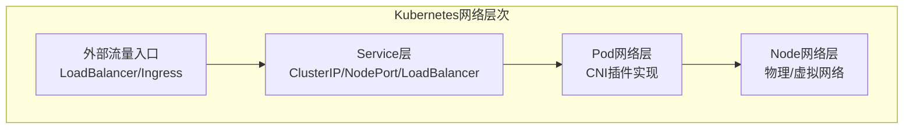

+++
title = "03.Kubernetes服务发现与网络"
description = "Service、Ingress、NetworkPolicy详解与网络架构"
date = 2025-01-16
[taxonomies]
tags = ["kubernetes", "container", "networking", "service", "ingress"]
+++

# Kubernetes服务发现与网络

## 一、Kubernetes网络模型

### 1.1 网络基本要求

Kubernetes网络模型的基本要求：

```
1. 每个Pod有独立的IP地址
2. 同一Node上的Pod可以直接通信
3. 不同Node上的Pod可以直接通信（无NAT）
4. Pod看到的自己IP与其他Pod看到的一致
```

### 1.2 网络层次



### 1.3 CNI插件

**常见CNI插件对比**：

| 插件 | 模式 | 特点 | 适用场景 |
|------|------|------|----------|
| Calico | BGP/IPIP/VXLAN | 高性能、支持NetworkPolicy | 生产环境首选 |
| Flannel | VXLAN/host-gw | 简单、易部署 | 小规模集群 |
| Cilium | eBPF | 高性能、可观测性强 | 高性能需求 |
| Weave | VXLAN | 简单、自动发现 | 开发测试 |

---

## 相关文章

- [上一篇：Kubernetes工作负载管理](/articles/cloud-native/k8s-02-工作负载管理/)
- [下一篇：Kubernetes存储管理](/articles/cloud-native/k8s-04-存储管理/)
