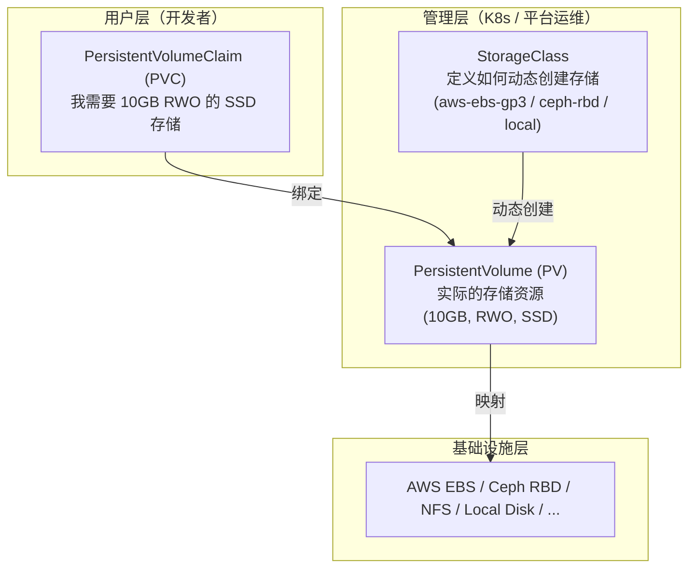
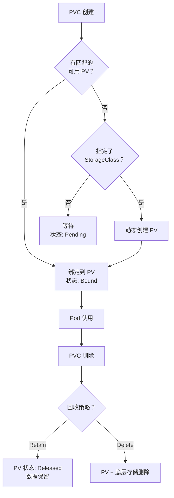
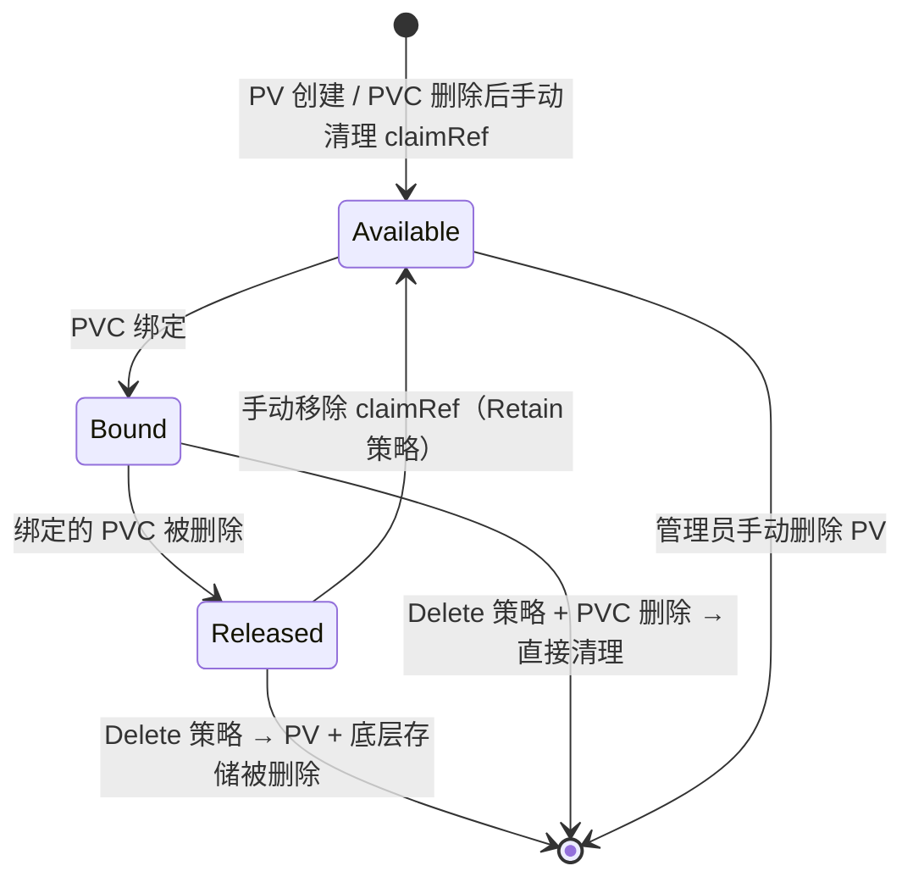
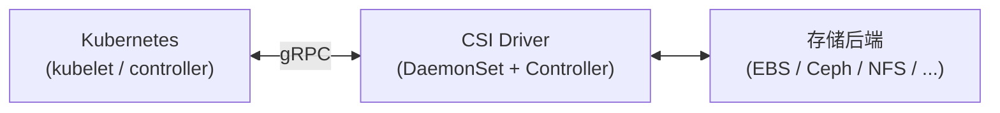
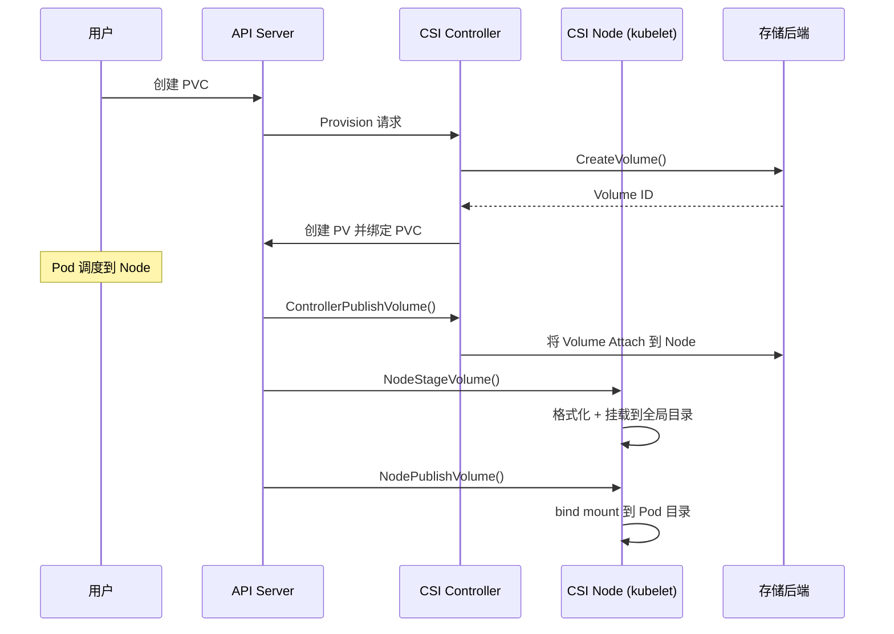
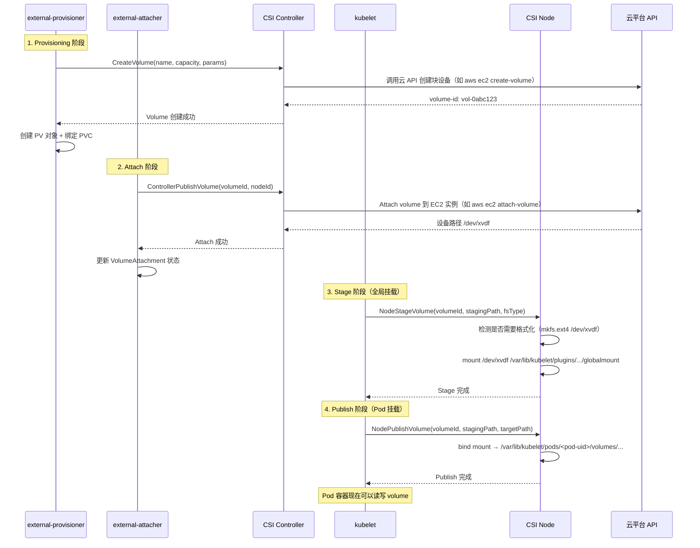
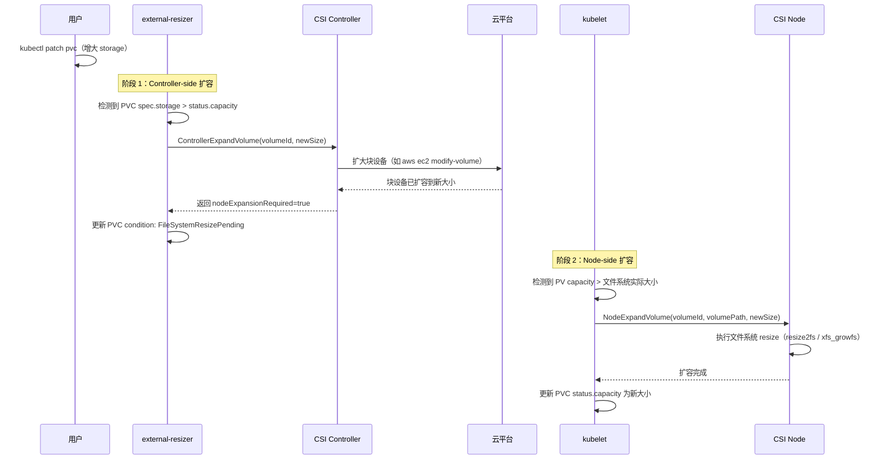

+++
title = "Kubernetes存储管理"
description = "Volume类型、PV/PVC生命周期、StorageClass动态供给、CSI驱动与存储最佳实践"
date = 2025-01-16
weight = 6000
[taxonomies]
tags = ["kubernetes", "container", "storage", "pv", "pvc", "csi"]
[extra]
toc = true
+++

# Kubernetes 存储管理

---

## 一、存储概述

### 1.1 为什么需要存储抽象

容器的文件系统是**临时的**——容器重启后数据丢失。K8s 通过**三层存储抽象**解耦应用与底层存储：



**核心价值**：
- **解耦**：开发者只关心「需要多大存储」，不关心底层实现
- **可移植**：同一 PVC 在不同集群绑定到不同存储后端
- **自动化**：StorageClass + CSI 实现存储的自动供给和回收

### 1.2 Volume 类型总览

| 类别 | 类型 | 生命周期 | 说明 |
|------|------|---------|------|
| **临时** | `emptyDir` | 与 Pod 相同 | Pod 内容器共享的临时目录 |
| **临时** | `configMap` | 与 Pod 相同 | 将 ConfigMap 挂载为文件 |
| **临时** | `secret` | 与 Pod 相同 | 将 Secret 挂载为文件 |
| **临时** | `downwardAPI` | 与 Pod 相同 | 将 Pod/Container 元数据暴露为文件 |
| **临时** | `projected` | 与 Pod 相同 | 以上多种的组合投射 |
| **持久** | `persistentVolumeClaim` | 独立于 Pod | 持久卷声明 |
| **节点级** | `hostPath` | 节点级 | 挂载 Node 上的路径（**谨慎使用**） |
| **网络** | `nfs` | 独立 | NFS 挂载 |
| **云存储** | `csi` | 独立 | CSI 驱动（EBS/GCE PD/Ceph 等） |

### 1.3 云存储性能参考

| 存储类型 | 代表产品 | IOPS (max) | 吞吐量 (max) | 延迟 | 适用场景 |
|---------|---------|-----------|-------------|------|---------|
| **通用 SSD** | AWS gp3 / GCP pd-balanced | 16,000 | 1,000 MB/s | ~1ms | 通用工作负载 |
| **高性能 SSD** | AWS io2 / GCP pd-ssd | 256,000 | 4,000 MB/s | <1ms | 数据库、OLTP |
| **吞吐优化 HDD** | AWS st1 / GCP pd-standard | 500 | 500 MB/s | ~5ms | 日志、大数据 |
| **本地 NVMe SSD** | AWS i3/i4 实例存储 | 3,300,000 | 16,000 MB/s | <0.1ms | 缓存、临时数据 |
| **网络文件系统** | AWS EFS / GCP Filestore | - | 10,000+ MB/s | ~1-5ms | 共享存储 (RWX) |

**关键认知**：
- **IOPS 和吞吐量的关系**：`吞吐量 = IOPS × IO 大小`。4K 随机读 16,000 IOPS = 62.5 MB/s；256K 顺序读 16,000 IOPS = 4,000 MB/s。
- **Burst vs Baseline**：gp3 baseline 3,000 IOPS，可配置到 16,000。io2 可配置到 256,000 但按 IOPS 计费。
- **Zone 绑定**：EBS/PD 等块存储**绑定到单个 AZ**，跨 AZ 不可用。这就是为什么 `WaitForFirstConsumer` 至关重要。
- **网络文件系统**：EFS/Filestore 支持跨 AZ，但延迟高于块存储，适合日志收集、配置共享等不敏感场景。

---

## 二、临时存储

### 2.1 emptyDir

Pod 创建时在 Node 上分配一个空目录，Pod 删除时数据丢失。

```yaml
apiVersion: v1
kind: Pod
metadata:
  name: shared-data
spec:
  containers:
    - name: writer
      image: busybox
      command: ["sh", "-c", "while true; do date >> /data/log.txt; sleep 5; done"]
      volumeMounts:
        - name: shared
          mountPath: /data
    - name: reader
      image: busybox
      command: ["sh", "-c", "tail -f /data/log.txt"]
      volumeMounts:
        - name: shared
          mountPath: /data
  volumes:
    - name: shared
      emptyDir:
        sizeLimit: 1Gi         # 限制大小（超过则 Pod 被驱逐）
        # medium: Memory       # 使用内存（tmpfs），速度快但占用 RAM
```

**常见用途**：
- 同 Pod 内容器共享文件（如 Sidecar 日志收集）
- 缓存/临时文件
- 排序/计算的临时空间

### 2.2 ConfigMap 与 Secret 挂载

```yaml
volumes:
  # ConfigMap 挂载为文件
  - name: config
    configMap:
      name: app-config
      items:                    # 可选：只挂载部分 key
        - key: config.yaml
          path: config.yaml     # 挂载后的文件名
      defaultMode: 0644         # 文件权限

  # Secret 挂载为文件
  - name: certs
    secret:
      secretName: tls-certs
      defaultMode: 0400         # Secret 建议更严格的权限

  # Projected（组合多种来源）
  - name: all-in-one
    projected:
      sources:
        - configMap:
            name: app-config
        - secret:
            name: app-secret
        - serviceAccountToken:
            path: token
            expirationSeconds: 3600
```

> **注意**：ConfigMap / Secret 挂载的文件在源资源更新后会**自动更新**（但有延迟，默认 60~90 秒）。如果用 `subPath` 挂载则**不会**自动更新。

---

## 三、PV、PVC 与 StorageClass

### 3.1 PersistentVolume (PV)

PV 是集群中一块**已经存在的存储资源**（静态供给）或由 StorageClass **动态创建**的存储资源。

```yaml
# 静态创建 PV（手动）
apiVersion: v1
kind: PersistentVolume
metadata:
  name: pv-nfs-001
spec:
  capacity:
    storage: 100Gi
  accessModes:
    - ReadWriteMany           # 多节点读写
  persistentVolumeReclaimPolicy: Retain
  storageClassName: nfs
  mountOptions:
    - hard
    - nfsvers=4.1
  nfs:
    server: 10.0.0.100
    path: /exports/data
```

### 3.2 PersistentVolumeClaim (PVC)

PVC 是用户对存储的**申请**：

```yaml
apiVersion: v1
kind: PersistentVolumeClaim
metadata:
  name: my-data
  namespace: production
spec:
  accessModes:
    - ReadWriteOnce
  storageClassName: fast-ssd     # 匹配 StorageClass
  resources:
    requests:
      storage: 50Gi
```

**Pod 使用 PVC**：

```yaml
spec:
  containers:
    - name: app
      volumeMounts:
        - name: data
          mountPath: /var/data
  volumes:
    - name: data
      persistentVolumeClaim:
        claimName: my-data
```

### 3.3 访问模式

| 模式 | 缩写 | 说明 | 典型存储 |
|------|------|------|---------|
| **ReadWriteOnce** | RWO | 单节点读写 | EBS、GCE PD、Local |
| **ReadOnlyMany** | ROX | 多节点只读 | NFS、CephFS |
| **ReadWriteMany** | RWX | 多节点读写 | NFS、CephFS、GlusterFS |
| **ReadWriteOncePod** | RWOP | 单 Pod 读写（1.27+ GA） | CSI 驱动支持 |

> **注意**：`ReadWriteOnce` 是「单节点」而非「单 Pod」——同一节点上多个 Pod 可以同时挂载。需要真正单 Pod 独占时用 `RWOP`。

### 3.4 回收策略

| 策略 | PVC 删除后 PV 行为 | 适用场景 |
|------|-------------------|---------|
| **Retain** | PV 保留，数据保留，需手动清理 | 生产环境（数据安全第一） |
| **Delete** | PV 和底层存储一起删除 | 临时数据 / 动态供给 |
| **Recycle** | 清空数据后回收（**已废弃**） | — |

### 3.5 PV/PVC 绑定流程



**PV/PVC 匹配条件**：
- `accessModes` 匹配
- `storageClassName` 匹配
- PV 容量 ≥ PVC 请求
- Label Selector（如果 PVC 配置了）

### 3.6 StorageClass

StorageClass 定义了**如何动态创建 PV**：

```yaml
apiVersion: storage.k8s.io/v1
kind: StorageClass
metadata:
  name: fast-ssd
  annotations:
    storageclass.kubernetes.io/is-default-class: "true"   # 默认 SC
provisioner: ebs.csi.aws.com                              # CSI 驱动
parameters:
  type: gp3                     # EBS 类型
  iops: "3000"                  # IOPS
  throughput: "125"             # 吞吐 (MiB/s)
  encrypted: "true"             # 加密
  fsType: ext4                  # 文件系统
reclaimPolicy: Delete           # 回收策略
allowVolumeExpansion: true      # 允许在线扩容
volumeBindingMode: WaitForFirstConsumer  # 延迟绑定
mountOptions:
  - debug
```

**`volumeBindingMode` 详解**：

| 模式 | 行为 | 适用场景 |
|------|------|---------|
| **Immediate** | PVC 创建后立即创建 PV 并绑定 | 不关心节点位置（NFS、远程存储） |
| **WaitForFirstConsumer** | 等到 Pod 调度到节点后再创建 PV | **推荐**——避免 PV 创建在错误的 AZ |

### 3.7 动态供给完整示例

```yaml
# 1. StorageClass（平台运维创建一次）
apiVersion: storage.k8s.io/v1
kind: StorageClass
metadata:
  name: ceph-rbd
provisioner: rbd.csi.ceph.com
parameters:
  clusterID: my-ceph-cluster
  pool: kubernetes
  imageFeatures: "layering"
reclaimPolicy: Delete
allowVolumeExpansion: true
volumeBindingMode: Immediate

---
# 2. PVC（开发者创建）
apiVersion: v1
kind: PersistentVolumeClaim
metadata:
  name: db-data
spec:
  accessModes: ["ReadWriteOnce"]
  storageClassName: ceph-rbd
  resources:
    requests:
      storage: 100Gi

---
# 3. Pod（使用 PVC）
apiVersion: apps/v1
kind: StatefulSet
metadata:
  name: postgresql
spec:
  serviceName: postgresql
  replicas: 1
  selector:
    matchLabels:
      app: postgresql
  template:
    metadata:
      labels:
        app: postgresql
    spec:
      containers:
        - name: postgres
          image: postgres:16
          volumeMounts:
            - name: data
              mountPath: /var/lib/postgresql/data
  volumeClaimTemplates:           # StatefulSet 专用：每个 Pod 自动创建 PVC
    - metadata:
        name: data
      spec:
        accessModes: ["ReadWriteOnce"]
        storageClassName: ceph-rbd
        resources:
          requests:
            storage: 100Gi
```

### 3.8 PV 状态机

理解 PV/PVC 的生命周期状态是排查存储问题的关键。

#### PV 生命周期状态



| 状态 | 含义 | 触发条件 |
|------|------|---------|
| **Available** | 空闲，可被 PVC 绑定 | 新建 PV / 手动清理 Released PV 的 `claimRef` |
| **Bound** | 已绑定到某个 PVC | PVC 匹配成功 |
| **Released** | 绑定的 PVC 已删除，但 PV 尚未回收 | PVC 删除且 `reclaimPolicy: Retain` |
| **Failed** | 自动回收失败 | 后端存储清理异常 |

> **关键**：Released 状态的 PV **不会**被自动绑定到新的 PVC。必须手动干预——要么移除 `spec.claimRef` 使其回到 Available，要么备份数据后删除重建 PV。

#### PVC 生命周期状态

| 状态 | 含义 | 常见原因 |
|------|------|---------|
| **Pending** | 等待绑定 | 无匹配 PV / `WaitForFirstConsumer` 等待 Pod 调度 / StorageClass 无法动态创建 |
| **Bound** | 已绑定到 PV | 正常工作状态 |
| **Lost** | 绑定的 PV 丢失 | PV 被意外删除 |

PVC 绑定后支持**在线扩容**（前提是 StorageClass 设置了 `allowVolumeExpansion: true`），但**不支持缩容**。

#### WaitForFirstConsumer 深入

`StorageClass.volumeBindingMode: WaitForFirstConsumer` 是云环境中最重要的存储配置之一：

```
PVC 创建 → PVC 状态 Pending（不立即创建 PV）
    → Pod 创建并被调度到 Node-X（zone-a）
    → Scheduler 通知 provisioner：在 zone-a 创建 Volume
    → PV 创建在 zone-a → 绑定 PVC → Pod 启动
```

**为什么至关重要**：
- **云块存储（EBS / GCE PD / Azure Disk）是 AZ 级资源**——EBS 卷只能挂载到同一 AZ 的 EC2 实例
- 若使用 `Immediate` 模式，PV 可能创建在 zone-a，但 Pod 被调度到 zone-b → Pod 将**永远**卡在 Pending 状态，报错 `node(s) had volume node affinity conflict`
- `WaitForFirstConsumer` 让调度器先确定 Pod 运行位置，再在同一 AZ 中创建存储

```yaml
# ❌ 错误：Immediate 模式下可能 PV 和 Pod 在不同 AZ
apiVersion: storage.k8s.io/v1
kind: StorageClass
metadata:
  name: ebs-immediate
provisioner: ebs.csi.aws.com
volumeBindingMode: Immediate            # PV 立即创建，可能在错误的 AZ

---
# ✅ 正确：WaitForFirstConsumer 确保 PV 和 Pod 同 AZ
apiVersion: storage.k8s.io/v1
kind: StorageClass
metadata:
  name: ebs-delayed
provisioner: ebs.csi.aws.com
volumeBindingMode: WaitForFirstConsumer  # 等 Pod 调度后再创建 PV
```

> **例外**：对于不受 AZ 限制的存储（NFS / CephFS / EFS 等网络文件系统），可以安全使用 `Immediate` 模式。

#### Access Modes 深入

| 模式 | 全称 | 语义 | 支持的存储类型 | GA 版本 |
|------|------|------|--------------|--------|
| **RWO** | ReadWriteOnce | **单节点**读写（同节点多 Pod 可共享） | EBS, GCE PD, Azure Disk, Ceph RBD, Local PV | 1.0+ |
| **ROX** | ReadOnlyMany | 多节点只读 | NFS, CephFS, GlusterFS, 部分 CSI | 1.0+ |
| **RWX** | ReadWriteMany | 多节点读写 | NFS, EFS, CephFS, GlusterFS | 1.0+ |
| **RWOP** | ReadWriteOncePod | **单 Pod** 读写（真正独占） | 支持 RWOP 的 CSI 驱动 | 1.29+ (GA) |

**RWO vs RWOP 的关键区别**：
- `RWO`：限制到**单节点**——同一 Node 上多个 Pod 可以同时挂载同一个 PV（这常常被忽视）
- `RWOP`：限制到**单 Pod**——使用 fencing 机制保证全集群仅有一个 Pod 能挂载。适用于需要严格独占的场景（如数据库 WAL 文件、分布式锁文件）

**块存储 vs 文件存储的 Access Mode 约束**：
- **块存储**（EBS / GCE PD / Azure Disk / Ceph RBD）：底层是块设备，只能 attach 到单个节点 → **仅支持 RWO**
- **文件存储**（NFS / EFS / CephFS）：基于网络文件协议 → **支持 RWX**
- 若需要多 Pod 共享写入块存储数据，必须在应用层解决（如数据库集群的 shared-nothing 架构）

---

## 四、CSI（Container Storage Interface）

### 4.1 什么是 CSI

CSI 是 K8s 与存储系统之间的**标准接口**，允许存储厂商以插件形式提供存储能力，无需修改 K8s 核心代码。



### 4.2 CSI 组件

| 组件 | 运行位置 | 职责 |
|------|---------|------|
| **CSI Controller** | Deployment（通常 1 副本） | 创建/删除/快照 Volume |
| **CSI Node** | DaemonSet（每个 Node） | 挂载/卸载 Volume 到 Node |
| **Sidecar Containers** | 与 Controller/Node 一起 | external-provisioner、external-attacher、external-snapshotter 等 |

### 4.3 Volume 操作生命周期



### 4.4 常见 CSI 驱动

| CSI 驱动 | 存储类型 | 访问模式 | 特点 |
|---------|---------|---------|------|
| **ebs.csi.aws.com** | AWS EBS | RWO | 块存储；AZ 绑定 |
| **efs.csi.aws.com** | AWS EFS | RWX | 文件存储；跨 AZ |
| **pd.csi.storage.gke.io** | GCE PD | RWO / ROX | Google Cloud |
| **rbd.csi.ceph.com** | Ceph RBD | RWO | 块存储；高性能 |
| **cephfs.csi.ceph.com** | CephFS | RWX | 文件存储 |
| **nfs.csi.k8s.io** | NFS | RWX | 简单；适合遗留环境 |
| **disk.csi.azure.com** | Azure Disk | RWO | Azure 块存储 |

### 4.5 CSI 接口深入

CSI 规范定义了 **3 个 gRPC 服务**，CSI 驱动必须实现对应接口：

#### 三大 gRPC 服务

```
┌─────────────────────────────────────────────────────────────┐
│                    Identity Service                         │
│  （所有 CSI 插件必须实现）                                     │
│  ├── GetPluginInfo()          — 返回插件名称/版本             │
│  ├── GetPluginCapabilities()  — 声明插件能力                  │
│  └── Probe()                  — 健康检查                      │
├─────────────────────────────────────────────────────────────┤
│                   Controller Service                        │
│  （CSI Controller Pod 实现，集中式管理）                       │
│  ├── CreateVolume()           — 创建底层存储卷                │
│  ├── DeleteVolume()           — 删除底层存储卷                │
│  ├── ControllerPublishVolume()  — Attach 卷到指定 Node       │
│  ├── ControllerUnpublishVolume()— Detach 卷                  │
│  ├── ValidateVolumeCapabilities()— 验证卷能力                │
│  ├── ListVolumes()            — 列出所有卷                    │
│  ├── CreateSnapshot()         — 创建快照                      │
│  ├── DeleteSnapshot()         — 删除快照                      │
│  └── ControllerExpandVolume() — 控制器侧扩容（扩大块设备）     │
├─────────────────────────────────────────────────────────────┤
│                      Node Service                           │
│  （CSI Node DaemonSet 实现，每个节点）                         │
│  ├── NodeStageVolume()        — 格式化 + 挂载到 staging 路径  │
│  ├── NodeUnstageVolume()      — 卸载 staging                 │
│  ├── NodePublishVolume()      — bind mount 到 Pod 目录       │
│  ├── NodeUnpublishVolume()    — 卸载 Pod 挂载                │
│  ├── NodeGetCapabilities()    — 声明 Node 能力               │
│  ├── NodeGetInfo()            — 返回 Node 拓扑信息           │
│  └── NodeExpandVolume()       — 节点侧扩容（文件系统 resize）  │
└─────────────────────────────────────────────────────────────┘
```

#### Volume 完整挂载流程

一个 PVC 从创建到被 Pod 使用，经历以下 CSI 调用链：



**卸载是反向过程**：`NodeUnpublishVolume` → `NodeUnstageVolume` → `ControllerUnpublishVolume`（Detach）→ `DeleteVolume`（如果 PVC 删除且策略为 Delete）。

#### CSI Sidecar 容器

CSI 驱动不直接 watch K8s API——而是依赖一组**标准 Sidecar 容器**来桥接 K8s 与 CSI gRPC 调用：

| Sidecar 容器 | Watch 对象 | 调用的 CSI 接口 | 运行位置 |
|-------------|-----------|----------------|---------|
| **external-provisioner** | PVC（Pending） | `CreateVolume` / `DeleteVolume` | Controller Pod |
| **external-attacher** | VolumeAttachment | `ControllerPublishVolume` / `ControllerUnpublishVolume` | Controller Pod |
| **external-snapshotter** | VolumeSnapshot | `CreateSnapshot` / `DeleteSnapshot` | Controller Pod |
| **external-resizer** | PVC（capacity 变化） | `ControllerExpandVolume` | Controller Pod |
| **node-driver-registrar** | — | 向 kubelet 注册 CSI 驱动 | Node DaemonSet |
| **livenessprobe** | — | CSI `Probe()` 健康检查 | 两者都有 |

```
CSI Controller Pod 结构：
┌──────────────────────────────────────────────────┐
│  Pod: csi-controller-0                           │
│  ┌────────────────────┐ ┌──────────────────────┐ │
│  │ external-provisioner│ │ external-attacher    │ │
│  │ (watch PVC)        │ │ (watch VolumeAttach) │ │
│  └────────┬───────────┘ └────────┬─────────────┘ │
│           │ gRPC                 │ gRPC           │
│  ┌────────▼──────────────────────▼─────────────┐ │
│  │         CSI Driver Container                │ │
│  │         (实现 Controller + Identity Service) │ │
│  └─────────────────────────────────────────────┘ │
└──────────────────────────────────────────────────┘
```

#### CSI Migration

K8s 正在将**内置（in-tree）存储驱动**迁移到 CSI：

| In-tree 驱动 | CSI 驱动 | 迁移状态 |
|-------------|---------|---------|
| `kubernetes.io/aws-ebs` | `ebs.csi.aws.com` | GA（1.28+ 默认启用） |
| `kubernetes.io/gce-pd` | `pd.csi.storage.gke.io` | GA |
| `kubernetes.io/azure-disk` | `disk.csi.azure.com` | GA |
| `kubernetes.io/cinder` | `cinder.csi.openstack.org` | GA |

**迁移机制**：K8s 内部有一个 **Translation Layer**，将旧的 in-tree PV spec 透明转换为 CSI PV spec。已有的使用 in-tree 驱动的 PV/PVC **无需修改**——API Server 在处理时自动翻译。

```yaml
# 旧 in-tree 格式（仍然可用，会被自动翻译）
spec:
  awsElasticBlockStore:
    volumeID: vol-0abc123
    fsType: ext4

# 等价的 CSI 格式（翻译后实际使用）
spec:
  csi:
    driver: ebs.csi.aws.com
    volumeHandle: vol-0abc123
    fsType: ext4
```

> **建议**：新集群应直接使用 CSI 驱动。In-tree 驱动在未来版本中将被完全移除。

---

## 五、Volume 扩容与快照

### 5.1 在线扩容

```yaml
# StorageClass 必须设置
allowVolumeExpansion: true
```

```bash
# 修改 PVC 大小
kubectl patch pvc my-data -p '{"spec":{"resources":{"requests":{"storage":"200Gi"}}}}'

# 查看扩容状态
kubectl get pvc my-data -o jsonpath='{.status.conditions}'
```

> **注意**：大多数 CSI 驱动支持**在线扩容**（Pod 不需要重启）。但**不支持缩容**。

### 5.2 Volume 快照

```yaml
# VolumeSnapshotClass
apiVersion: snapshot.storage.k8s.io/v1
kind: VolumeSnapshotClass
metadata:
  name: csi-snapclass
driver: rbd.csi.ceph.com
deletionPolicy: Delete

---
# 创建快照
apiVersion: snapshot.storage.k8s.io/v1
kind: VolumeSnapshot
metadata:
  name: my-data-snapshot
spec:
  volumeSnapshotClassName: csi-snapclass
  source:
    persistentVolumeClaimName: my-data

---
# 从快照恢复
apiVersion: v1
kind: PersistentVolumeClaim
metadata:
  name: my-data-restored
spec:
  accessModes: ["ReadWriteOnce"]
  storageClassName: ceph-rbd
  resources:
    requests:
      storage: 100Gi
  dataSource:
    name: my-data-snapshot
    kind: VolumeSnapshot
    apiGroup: snapshot.storage.k8s.io
```

### 5.3 扩容机制深入

PVC 扩容是一个**两阶段过程**，涉及 Controller 端和 Node 端的协作：

#### 两阶段扩容流程



**阶段 1（Controller-side）**：`external-resizer` 监听 PVC 变化 → 检测到 `spec.resources.requests.storage` 增大 → 调用 `ControllerExpandVolume` → 云平台扩大底层块设备（如 EBS `modify-volume`）。

**阶段 2（Node-side）**：kubelet 检测到 PV 容量与文件系统实际大小不匹配 → 调用 `NodeExpandVolume` → CSI Node 插件执行文件系统扩容：
- **ext4**：`resize2fs /dev/xvdf`
- **xfs**：`xfs_growfs /mount/point`

#### Online vs Offline 扩容

| 扩容类型 | 行为 | 支持情况 |
|---------|------|---------|
| **Online 扩容** | Pod 不重启，文件系统在线 resize | 大多数现代 CSI 驱动（EBS CSI, GCE PD CSI）|
| **Offline 扩容** | 需要 Pod 删除（detach/reattach）后才能执行 Node-side resize | 部分旧驱动 / 特殊存储后端 |

CSI 驱动通过 `ControllerExpandVolume` 的返回值 `nodeExpansionRequired` 告知 K8s 是否需要 Node-side 扩容：
- `nodeExpansionRequired: true`（常见）：Controller 扩大块设备后，Node 端还需 resize 文件系统
- `nodeExpansionRequired: false`（少见）：Controller 端已完成全部扩容（如某些网络文件系统）

#### 扩容的限制

- **不支持缩容**：K8s **没有**原生的 PV 缩容机制。`ControllerExpandVolume` 和 `NodeExpandVolume` 仅支持增大。尝试减小 PVC 的 `spec.resources.requests.storage` 会被 API Server 拒绝（admission validation）
- **StorageClass 必须允许**：`allowVolumeExpansion: true` 是前提条件
- **扩容卡住的排查**：如果 PVC 状态长期显示 `FileSystemResizePending`，说明 Controller-side 已完成但 Node-side 未执行——检查 Pod 是否在运行、kubelet 日志、CSI Node 插件是否正常

---

## 六、hostPath 与 Local PV

### 6.1 hostPath（谨慎使用）

```yaml
volumes:
  - name: host-data
    hostPath:
      path: /data/app
      type: DirectoryOrCreate
```

| Type | 行为 |
|------|------|
| `""` | 不检查 |
| `DirectoryOrCreate` | 目录不存在则创建 |
| `Directory` | 目录必须存在 |
| `FileOrCreate` | 文件不存在则创建 |
| `File` | 文件必须存在 |

**风险**：Pod 被调度到不同 Node 后数据丢失；安全风险（可访问 Node 文件系统）。仅用于 DaemonSet 或特殊场景。

### 6.2 Local PV

比 hostPath 更安全的本地存储方案：

```yaml
apiVersion: v1
kind: PersistentVolume
metadata:
  name: local-pv-node1
spec:
  capacity:
    storage: 500Gi
  accessModes: ["ReadWriteOnce"]
  persistentVolumeReclaimPolicy: Retain
  storageClassName: local-storage
  local:
    path: /mnt/disks/ssd1
  nodeAffinity:
    required:
      nodeSelectorTerms:
        - matchExpressions:
            - key: kubernetes.io/hostname
              operator: In
              values: ["node-1"]
---
apiVersion: storage.k8s.io/v1
kind: StorageClass
metadata:
  name: local-storage
provisioner: kubernetes.io/no-provisioner   # 不自动创建
volumeBindingMode: WaitForFirstConsumer      # 关键：延迟绑定
```

**Local PV vs hostPath**：
- Local PV 有 `nodeAffinity`，保证 Pod 调度到数据所在 Node
- Local PV 是正式的 PV/PVC 流程，受 K8s 存储管理
- Local PV 不会意外访问 Node 上的任意路径

### 6.3 hostPath vs Local PV 深入对比

#### hostPath 的安全风险

`hostPath` 允许 Pod 挂载宿主机上的**任意路径**，这带来严重的安全隐患：

| 风险 | 说明 | 攻击示例 |
|------|------|---------|
| **容器逃逸** | 挂载 `/` 或 `/etc` 后，容器内进程可修改宿主机文件 | 挂载 `/etc/crontab` 写入反弹 shell |
| **敏感信息泄露** | 访问 Node 上的密钥文件、kubelet 凭证 | 挂载 `/var/lib/kubelet/pki/` 获取 TLS 证书 |
| **资源耗尽** | 无容量限制，可写满 Node 磁盘 | 恶意 Pod 写入大量数据导致 Node NotReady |
| **跨 Pod 数据泄露** | 多个 Pod 挂载同一 hostPath 时互相可见 | 读取其他应用的日志或临时文件 |

**防护措施**：
- **Pod Security Standards (PSS)**：`Restricted` 级别**完全禁止** hostPath；`Baseline` 级别也应限制
- **OPA/Kyverno 策略**：仅允许白名单路径（如 `/var/log` 用于日志收集 DaemonSet）
- **只读挂载**：必须使用时加 `readOnly: true`

```yaml
# Kyverno 策略：仅允许特定 hostPath
apiVersion: kyverno.io/v1
kind: ClusterPolicy
metadata:
  name: restrict-hostpath
spec:
  validationFailureAction: Enforce
  rules:
    - name: restrict-hostpath-volumes
      match:
        any:
          - resources:
              kinds: ["Pod"]
      validate:
        message: "hostPath volumes are restricted to /var/log only"
        pattern:
          spec:
            volumes:
              - hostPath:
                  path: "/var/log*"
```

#### Local PV 相比 hostPath 的优势

| 特性 | hostPath | Local PV |
|------|---------|---------|
| **调度感知** | 无——Pod 可能调度到没有数据的 Node | `nodeAffinity` 保证 Pod 调度到数据所在 Node |
| **生命周期管理** | 无——Pod 删除后路径和数据状态不可控 | 通过 PV/PVC 生命周期管理 |
| **容量跟踪** | 无 | PV 声明 capacity，可配合 ResourceQuota |
| **安全控制** | 可挂载任意路径 | 仅暴露预配置的特定路径 |
| **回收策略** | 无 | 支持 Retain / Delete |

#### Local PV 的局限性

- **不支持动态供给**：必须预先在 Node 上准备好磁盘/目录，手动创建 PV 对象
- **无数据复制**：数据仅在单个 Node 的本地磁盘上，Node 故障 = 数据丢失
- **Node 维护困难**：需要先迁移 Pod、处理数据后才能维护 Node
- **容量固定**：不支持在线扩容（本地磁盘无法远程扩大）

#### sig-storage-local-static-provisioner

社区提供的 `local-static-provisioner` 简化了 Local PV 的管理：

```
工作原理：
1. 管理员在 Node 上挂载磁盘到预配置目录（如 /mnt/disks/）
2. Provisioner DaemonSet 监控这些目录
3. 自动为每个挂载点创建对应的 PV 对象
4. 磁盘移除时自动清理 PV

Node 文件系统:
/mnt/disks/
├── ssd-0/          → 自动创建 PV: local-pv-ssd-0
├── ssd-1/          → 自动创建 PV: local-pv-ssd-1
└── hdd-0/          → 自动创建 PV: local-pv-hdd-0
```

```yaml
# local-static-provisioner ConfigMap 配置
apiVersion: v1
kind: ConfigMap
metadata:
  name: local-provisioner-config
data:
  storageClassMap: |
    local-ssd:
      hostDir: /mnt/disks/ssd
      mountDir: /mnt/disks/ssd
      blockCleanerCommand:
        - "/scripts/quick_reset.sh"
      volumeMode: Filesystem
    local-hdd:
      hostDir: /mnt/disks/hdd
      mountDir: /mnt/disks/hdd
```

#### Generic Ephemeral Volumes（1.23+ GA）

传统 `emptyDir` 没有容量保证，且不走 CSI 生命周期。**Generic Ephemeral Volumes** 是 CSI-backed 的临时卷，结合了 emptyDir 的"随 Pod 删除"语义和 PVC 的完整功能：

```yaml
apiVersion: v1
kind: Pod
metadata:
  name: data-processor
spec:
  containers:
    - name: processor
      image: data-processor:latest
      volumeMounts:
        - name: scratch
          mountPath: /scratch
  volumes:
    - name: scratch
      ephemeral:                          # Generic Ephemeral Volume
        volumeClaimTemplate:
          metadata:
            labels:
              type: scratch-volume
          spec:
            accessModes: ["ReadWriteOnce"]
            storageClassName: fast-ssd
            resources:
              requests:
                storage: 100Gi           # 有明确的容量保证
```

**与 emptyDir 对比**：
- 有**容量保证**（StorageClass 和 CSI 驱动提供真实的磁盘隔离）
- 支持**快照**（数据处理中间结果可快照）
- 受 **ResourceQuota** 管控
- Pod 删除时自动删除对应 PVC 和 PV

#### fsGroupChangePolicy

当 Pod 的 `securityContext.fsGroup` 设置后，kubelet 需要对挂载卷的文件设置 group ownership。对于大型卷（百万级文件），默认行为会**严重拖慢 Pod 启动**：

| 策略 | 行为 | 性能影响 |
|------|------|---------|
| **Always**（默认） | 每次 Pod 挂载时，递归 `chown` + `chmod` 整个卷的所有文件和目录 | 极慢——百万文件的卷可能需要几十分钟 |
| **OnRootMismatch** | 仅当卷根目录的 ownership 与 `fsGroup` 不匹配时才递归修改 | 快——首次挂载后后续 Pod 启动几乎无延迟 |

```yaml
apiVersion: v1
kind: Pod
metadata:
  name: fast-mount
spec:
  securityContext:
    fsGroup: 1000
    fsGroupChangePolicy: OnRootMismatch   # 生产环境必须设置！
  containers:
    - name: app
      image: myapp
      volumeMounts:
        - name: data
          mountPath: /data
```

> **生产规则**：任何挂载大容量 PV 的 Pod（尤其是数据库、ML 训练数据集），**必须**设置 `fsGroupChangePolicy: OnRootMismatch`。否则每次 Pod 重建（滚动更新/故障恢复）都会因为递归 chown 导致启动超时。

---

## 七、最佳实践

### 7.1 存储选型

| 场景 | 推荐方案 | 原因 |
|------|---------|------|
| 无状态应用 | 不使用 PV | 数据放外部服务（S3/数据库） |
| 数据库（MySQL/PG） | RWO 块存储（EBS/Ceph RBD） | 高 IOPS、低延迟 |
| 共享文件（多 Pod 读写） | RWX 文件存储（NFS/CephFS/EFS） | 多节点同时挂载 |
| 日志/缓存 | emptyDir 或 ephemeral volume | 不需要持久化 |
| 高性能（低延迟） | Local PV + NVMe | 数据库、缓存（需容忍节点故障） |
| 备份/归档 | 对象存储（S3/MinIO） | 低成本、高可用 |

### 7.2 安全建议

- **生产使用 `Retain` 回收策略**：防止 PVC 误删导致数据丢失
- **启用存储加密**：CSI 驱动的 `encrypted` 参数
- **限制 hostPath**：PSS Restricted 级别禁止 hostPath
- **设置 ResourceQuota**：限制 Namespace 的存储使用量

```yaml
apiVersion: v1
kind: ResourceQuota
metadata:
  name: storage-quota
  namespace: production
spec:
  hard:
    persistentvolumeclaims: "20"          # 最多 20 个 PVC
    requests.storage: "1Ti"               # 最多申请 1 TiB 存储
    fast-ssd.storageclass.storage.k8s.io/requests.storage: "500Gi"
```

### 7.3 常见陷阱

| 陷阱 | 后果 | 解决方案 |
|------|------|---------|
| PV 在错误的 AZ | Pod 无法挂载 | 使用 `WaitForFirstConsumer` |
| 未设 `storageClassName` | 使用默认 SC 或无法绑定 | 明确指定 SC |
| subPath 挂载 | ConfigMap 更新后不自动刷新 | 避免 subPath 或用 sidecar reload |
| RWO 多 Pod 挂载 | 同 Node 可以，跨 Node 失败 | 用 RWX 或改架构 |
| PVC 删除但 PV 是 Retain | PV 变为 Released 无法再被绑定 | 手动清理后重新绑定 |

### 7.4 回收策略（Reclaim Policy）生产警告

回收策略是**数据安全**的最后一道防线，选择错误可能导致**不可逆的数据丢失**：

| 策略 | PVC 删除后行为 | 适用场景 | 风险等级 |
|------|--------------|---------|---------|
| **Retain** | PV 保留、底层数据保留、PV 状态变为 Released | 生产数据库、用户数据、任何不可再生数据 | 低（需手动清理） |
| **Delete** | PV 和底层存储**同时删除** | CI/CD 临时环境、可重建数据、缓存 | **高（不可恢复）** |

**生产规则**：
- 生产环境**必须**使用 `Retain`——即使误删 PVC，底层数据（如 EBS 卷）仍然保留
- `Delete` **仅**用于明确可丢弃的数据（临时测试环境、可从 S3 重建的缓存）
- 许多 CSI 驱动的 StorageClass **默认** `reclaimPolicy: Delete`——必须在创建 SC 时显式覆盖

```yaml
# ✅ 生产环境 StorageClass：必须 Retain
apiVersion: storage.k8s.io/v1
kind: StorageClass
metadata:
  name: prod-ebs-gp3
provisioner: ebs.csi.aws.com
reclaimPolicy: Retain                    # 关键：防止数据意外删除
allowVolumeExpansion: true
volumeBindingMode: WaitForFirstConsumer
parameters:
  type: gp3
  encrypted: "true"
```

> **补救**：如果已有 PV 使用了 `Delete` 策略，可以在不影响数据的情况下修改为 `Retain`：
> ```bash
> kubectl patch pv <pv-name> -p '{"spec":{"persistentVolumeReclaimPolicy":"Retain"}}'
> ```

---

## 八、面试高频问答

**Q1：PV 和 PVC 的关系？**

A：PV 是集群级的存储资源，PVC 是用户的存储申请。关系类似 Node 和 Pod——PV 是资源供给，PVC 是资源消费。PVC 通过 accessModes、storageClassName 和容量匹配 PV。绑定后 PV 和 PVC 是一对一关系。

**Q2：`WaitForFirstConsumer` 解决了什么问题？**

A：默认的 `Immediate` 模式在 PVC 创建时立即创建 PV，可能创建在与 Pod 不同的 AZ，导致 Pod 无法挂载。`WaitForFirstConsumer` 延迟到 Pod 调度后再创建 PV，确保 PV 和 Pod 在同一拓扑域。

**Q3：StatefulSet 的存储有什么特殊之处？**

A：StatefulSet 使用 `volumeClaimTemplates`，为每个 Pod 自动创建独立的 PVC（如 data-mysql-0、data-mysql-1）。这些 PVC 不随 Pod 删除而删除，缩容后再扩容时会重新绑定到原来的 PVC，保证数据不丢失和稳定身份。

**Q4：如何实现存储在线扩容？**

A：1) StorageClass 设置 `allowVolumeExpansion: true`；2) 修改 PVC 的 `spec.resources.requests.storage`；3) CSI 驱动执行底层扩容；4) kubelet 执行文件系统 resize。大多数 CSI 驱动支持在线扩容（Pod 不需要重启），但不支持缩容。

**Q5：PV 卡在 Released 状态，如何重新使用？**（Staff 级）

A：PV 处于 Released 状态是因为之前绑定的 PVC 被删除，但 `reclaimPolicy: Retain` 保留了 PV。此时 PV 的 `spec.claimRef` 仍指向旧 PVC，阻止新 PVC 绑定。有两种处理方式：

**方式一：复用现有 PV（保留数据）**
```bash
# 1. 确认 PV 状态和旧的 claimRef
kubectl get pv <pv-name> -o yaml | grep -A5 claimRef

# 2. 移除 claimRef，使 PV 回到 Available 状态
kubectl patch pv <pv-name> --type json -p '[{"op":"remove","path":"/spec/claimRef"}]'

# 3. 验证 PV 状态变为 Available
kubectl get pv <pv-name>
# NAME        CAPACITY   ACCESS MODES   RECLAIM POLICY   STATUS      ...
# <pv-name>   100Gi      RWO            Retain           Available   ...

# 4. 创建新 PVC（匹配 storageClassName + accessModes + capacity）即可自动绑定
```

**方式二：备份数据后重建**
```bash
# 1. 备份底层存储数据（如创建 EBS Snapshot）
aws ec2 create-snapshot --volume-id vol-0abc123 --description "backup before reclaim"

# 2. 删除旧 PV
kubectl delete pv <pv-name>

# 3. 从快照创建新 volume + 新 PV，或使用 VolumeSnapshot 恢复
```

> **注意**：移除 `claimRef` 后，PV 可能被集群中**任意匹配的 PVC** 绑定。如需绑定到特定 PVC，可在 PVC 中使用 `spec.volumeName` 指定 PV 名称。

**Q6：Pod 卡在 ContainerCreating，volume mount 报错——如何排查？**（Staff 级）

A：这是生产环境最常见的存储问题之一，需要**逐层排查**整个 volume 挂载链路：

```
排查路径（从上到下）：
┌─────────────────────────────────────────────────────────┐
│ 1. Pod Events           → 确定错误类型                    │
│ 2. PVC/PV Status        → 确认绑定状态                    │
│ 3. VolumeAttachment     → 确认 Attach 状态               │
│ 4. CSI Controller Logs  → Attach/Provision 错误          │
│ 5. Node kubelet Logs    → Stage/Publish 错误             │
│ 6. CSI Node Plugin Logs → 底层 mount 错误                │
│ 7. Cloud Provider API   → 配额/权限/AZ 问题              │
└─────────────────────────────────────────────────────────┘
```

**排查步骤**：

```bash
# Step 1: 查看 Pod Events — 通常能看到具体错误信息
kubectl describe pod <pod-name> -n <namespace>
# 常见错误：
# - "AttachVolume.Attach failed" → Attach 阶段失败
# - "MountVolume.MountDevice failed" → Stage 阶段失败
# - "MountVolume.SetUp failed" → Publish 阶段失败
# - "node(s) had volume node affinity conflict" → PV 和 Pod 在不同 AZ

# Step 2: 检查 PVC 和 PV 状态
kubectl get pvc <pvc-name> -n <namespace>
kubectl get pv <pv-name> -o yaml

# Step 3: 检查 VolumeAttachment 对象
kubectl get volumeattachment | grep <pv-name>
kubectl describe volumeattachment <va-name>
# attached: false + 错误信息 → Attach 层面问题

# Step 4: CSI Controller 日志（Attach/Detach/Provision 问题）
kubectl logs -n kube-system deploy/ebs-csi-controller -c csi-provisioner
kubectl logs -n kube-system deploy/ebs-csi-controller -c csi-attacher

# Step 5: Node kubelet 日志（Stage/Publish 问题）
journalctl -u kubelet --since "10 minutes ago" | grep -i "volume\|mount\|csi"

# Step 6: CSI Node 插件日志
kubectl logs -n kube-system ds/ebs-csi-node -c ebs-plugin --tail=100

# Step 7: 检查云平台 API（IAM 权限、配额）
aws ec2 describe-volumes --volume-ids vol-0abc123
aws ec2 describe-instances --instance-ids i-0abc123 --query 'Reservations[].Instances[].BlockDeviceMappings'
```

**常见根因**：
| 错误 | 根因 | 解决方案 |
|------|------|---------|
| volume node affinity conflict | PV 在 zone-a，Pod 调度到 zone-b | 使用 `WaitForFirstConsumer` |
| AttachVolume timeout | volume 仍 attached 到旧 Node（force detach 未完成） | 检查旧 Node 状态，必要时 `kubectl delete volumeattachment` |
| Permission denied on mount | Node 的 IAM Role 缺少 `ec2:AttachVolume` 权限 | 修复 IAM Policy |
| filesystem corrupted | 非正常卸载后文件系统损坏 | 手动 `fsck`，或从快照恢复 |
| max volume limit reached | Node 已达到 volume attach 上限（如 EC2 最多 ~25 EBS） | 分散 Pod 到其他 Node，或使用 Nitro 实例（支持更多 attach） |

---

## 相关文章

- [上一篇：Kubernetes服务发现与网络](@/articles/cloud-native/k8s-03-服务发现与网络.md)
- [下一篇：Kubernetes配置与密钥管理](@/articles/cloud-native/k8s-05-配置与密钥管理.md)
