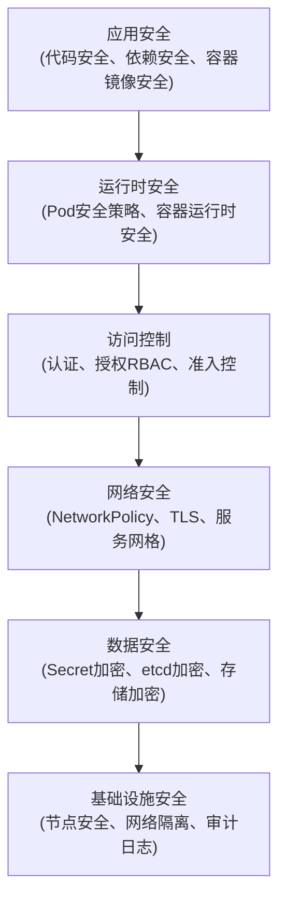
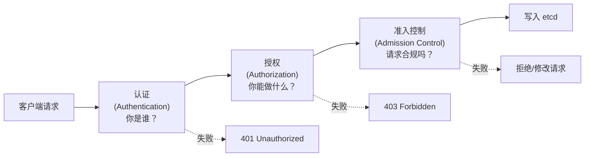
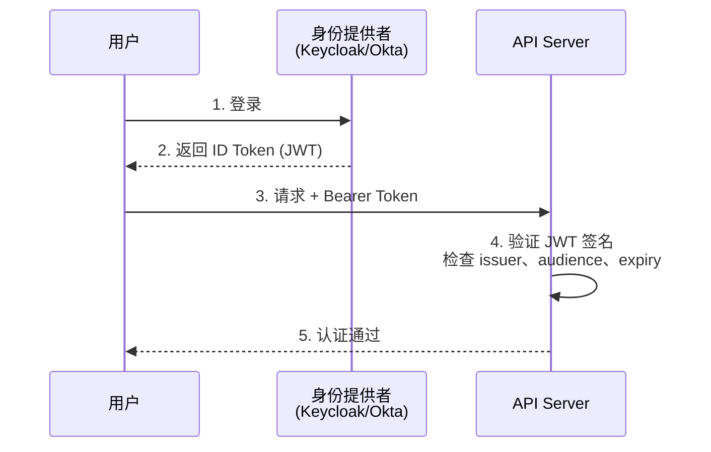
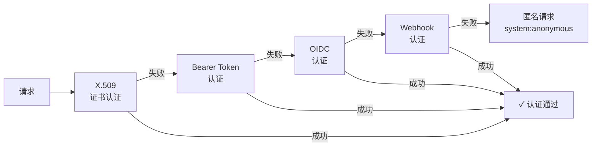
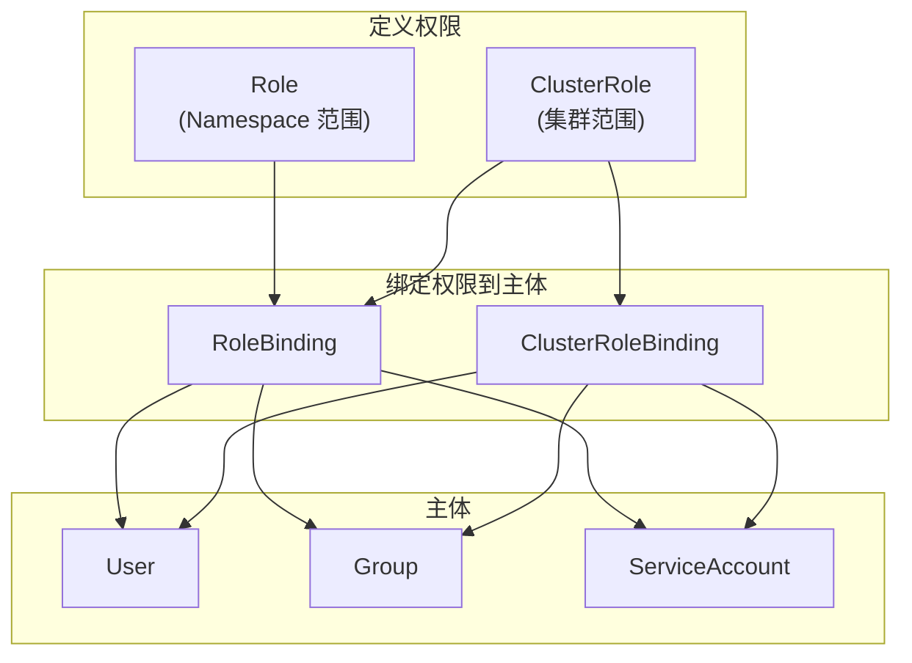
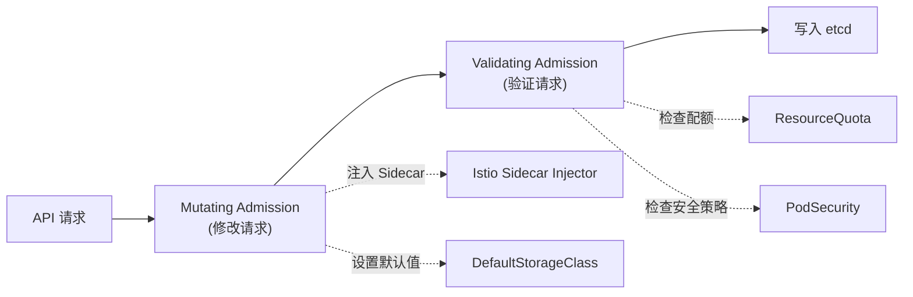
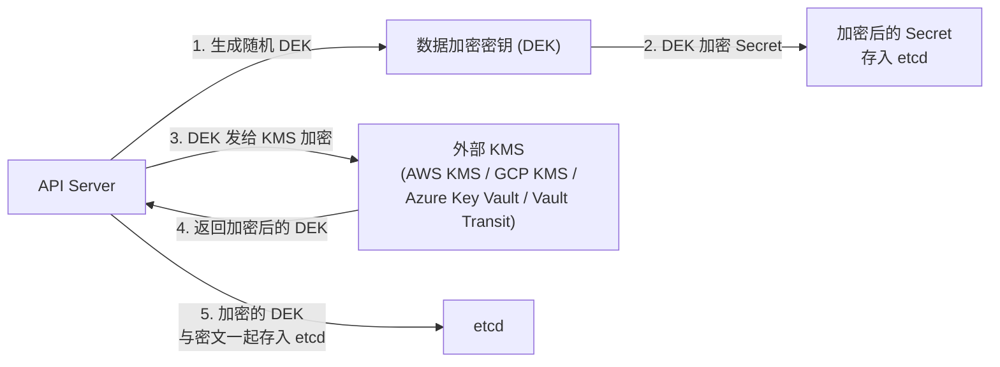
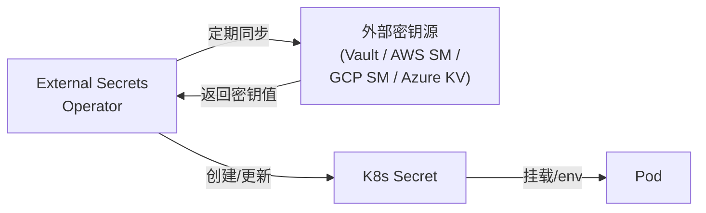
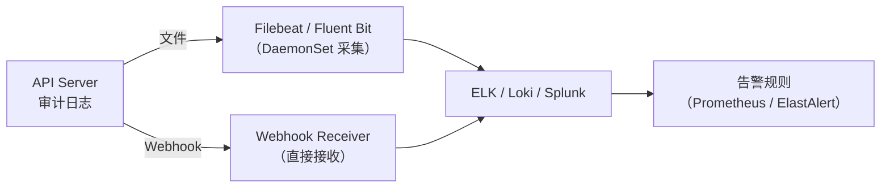

+++
title = "06.Kubernetes安全与RBAC"
description = "RBAC权限管理、Pod安全策略、网络安全、Secret加密、审计日志与安全最佳实践"
date = 2025-01-16
[taxonomies]
tags = ["kubernetes", "container", "security", "rbac", "devops"]
[extra]
toc = true
+++

# Kubernetes 安全与 RBAC

---

## 一、K8s 安全模型

### 1.1 安全层次

Kubernetes 安全是一个纵深防御体系，从上到下分为多个层次：



**核心原则**：
- **最小权限 (Least Privilege)**：只给需要的权限
- **纵深防御 (Defense in Depth)**：多层安全机制叠加
- **零信任 (Zero Trust)**：不信任任何内部流量

### 1.2 API 请求流程

每个到达 API Server 的请求都经过三道门：



---

## 二、认证（Authentication）

### 2.1 认证方式

K8s 支持多种认证方式，可以同时启用多个：

| 认证方式 | 机制 | 适用场景 |
|---------|------|---------|
| **X.509 客户端证书** | 客户端证书中的 CN 作为用户名，O 作为组 | kubectl、组件间通信 |
| **Bearer Token** | 静态 Token 文件 | 简单场景（不推荐生产） |
| **ServiceAccount Token** | 每个 SA 自动生成的 JWT | Pod 内访问 API |
| **OIDC (OpenID Connect)** | 外部身份提供者（如 Keycloak、Okta） | 企业统一身份管理 |
| **Webhook Token** | 自定义认证服务 | 需要自定义认证逻辑 |

### 2.2 ServiceAccount 详解

每个 Namespace 自动创建 `default` ServiceAccount，Pod 默认挂载其 Token。

```yaml
# 创建自定义 ServiceAccount
apiVersion: v1
kind: ServiceAccount
metadata:
  name: my-app-sa
  namespace: production
automountServiceAccountToken: false   # 安全最佳实践：不自动挂载

---
# Pod 使用指定 SA
apiVersion: v1
kind: Pod
metadata:
  name: my-app
spec:
  serviceAccountName: my-app-sa
  automountServiceAccountToken: true   # 仅在需要时启用
  containers:
    - name: app
      image: my-app:latest
```

**Token 投射（Projected Volume）**：K8s 1.20+ 默认使用 Projected Token，具有以下优势：
- **有限生命周期**：默认 1 小时自动轮换
- **受众绑定**：Token 绑定到特定 audience
- **对象绑定**：Token 绑定到特定 Pod

```yaml
# 手动配置 Projected Token
volumes:
  - name: sa-token
    projected:
      sources:
        - serviceAccountToken:
            path: token
            expirationSeconds: 3600
            audience: api-server
```

### 2.3 OIDC 集成



API Server 启动参数：

```bash
kube-apiserver \
  --oidc-issuer-url=https://keycloak.example.com/realms/k8s \
  --oidc-client-id=kubernetes \
  --oidc-username-claim=email \
  --oidc-groups-claim=groups \
  --oidc-ca-file=/etc/kubernetes/pki/oidc-ca.pem
```

### 2.4 认证机制深入

#### 多认证器 OR 逻辑

K8s API Server 可以同时启用多个认证器（X.509、OIDC、Webhook、ServiceAccount Token 等），它们之间是**逻辑 OR**关系：请求按顺序经过每个认证器，只要**任意一个**认证器认证通过，请求即被视为已认证，后续认证器不再被调用。



**关键设计意义**：这意味着如果一个认证器配置错误（例如总是返回成功），它会**绕过所有其他认证器**。因此在启用多认证器时，需要确保每个认证器都有严格的验证逻辑。

#### 匿名请求（Anonymous Requests）

当所有认证器都未匹配请求时（即没有携带任何凭证，或凭证不被任何认证器识别），请求将以 **`system:anonymous`** 用户、**`system:unauthenticated`** 组的身份继续进入授权阶段。

```bash
# 默认启用匿名认证，可以通过以下参数禁用
kube-apiserver --anonymous-auth=false

# 检查匿名用户权限
kubectl auth can-i --list --as=system:anonymous
```

> **安全建议**：生产环境应通过 RBAC 确保 `system:anonymous` 和 `system:unauthenticated` 组没有任何敏感权限。部分集群默认允许匿名访问 `/healthz`、`/readyz` 等端点，应审计这些绑定。

#### ServiceAccount Token JWT 结构

K8s 1.20+ 使用的 Projected ServiceAccount Token 是标准 JWT（JSON Web Token），其 Payload 包含以下关键字段：

```json
{
  "aud": ["https://kubernetes.default.svc.cluster.local"],
  "exp": 1700000000,
  "iat": 1699996400,
  "iss": "https://kubernetes.default.svc.cluster.local",
  "kubernetes.io": {
    "namespace": "production",
    "pod": {
      "name": "my-app-7b8f9d6c4-x2k9m",
      "uid": "a1b2c3d4-e5f6-7890-abcd-ef1234567890"
    },
    "serviceaccount": {
      "name": "my-app-sa",
      "uid": "f0e1d2c3-b4a5-6789-0abc-def123456789"
    }
  },
  "nbf": 1699996400,
  "sub": "system:serviceaccount:production:my-app-sa"
}
```

| JWT 字段 | 含义 | 安全作用 |
|---------|------|---------|
| `iss` (issuer) | 签发者，即 API Server URL | 防止跨集群 Token 滥用 |
| `sub` (subject) | 格式为 `system:serviceaccount:<namespace>:<name>` | 唯一标识 SA 身份 |
| `aud` (audience) | Token 的目标受众 | 防止 Token 被发送到非预期的服务 |
| `exp` / `iat` / `nbf` | 过期/签发/生效时间 | Projected Token 默认 1h 过期并自动轮换 |
| `kubernetes.io.pod` | 绑定的 Pod 信息 | Pod 删除后 Token 立即失效 |

> **安全影响**：旧版 Secret-based SA Token 没有 `exp`（永不过期）且不绑定 Pod，泄露后危害极大。应确保所有工作负载使用 Projected Token（K8s 1.22+ 默认行为）。

#### X.509 证书认证安全问题

X.509 客户端证书中，**CN (Common Name)** 映射为 K8s 用户名，**O (Organization)** 映射为 K8s 组：

```bash
# 生成证书时指定用户和组
openssl req -new -key jane.key -out jane.csr \
  -subj "/CN=jane@example.com/O=dev-team/O=qa-team"
# 结果：用户名 = jane@example.com, 组 = [dev-team, qa-team]
```

**K8s X.509 认证的关键安全缺陷——无原生 CRL/OCSP 支持**：

K8s API Server **不支持**证书吊销列表（CRL）或在线证书状态协议（OCSP）。一旦为用户签发了客户端证书，在证书过期之前**无法主动吊销**。这意味着：

1. **人员离职风险**：员工离开后其证书仍然有效，无法撤销
2. **证书泄露无法止血**：私钥泄露后唯一的应对措施是轮换整个 CA
3. **CA 轮换代价极高**：需要重新签发所有组件证书（kubelet、controller-manager、scheduler 等）

**缓解措施**：

| 策略 | 描述 |
|------|------|
| 缩短证书有效期 | 签发 24h-7d 短期证书，配合自动轮换 |
| 使用 OIDC 替代证书 | 用户认证走 OIDC，支持即时吊销 Token |
| Webhook Token Review | 自定义认证后端，可实现吊销逻辑 |
| 证书签发审计 | 严格监控 `CertificateSigningRequest` 资源 |

---

## 三、授权（Authorization）— RBAC 详解

### 3.1 RBAC 核心概念

RBAC (Role-Based Access Control) 是 K8s 默认的授权方式，核心是四个对象：



**核心关系**：
- **Role**：定义「能做什么」—— 一组 API 资源和动作的组合
- **RoleBinding**：定义「谁能做什么」—— 将 Role 绑定到 User/Group/SA
- **Role** 是 Namespace 级的，**ClusterRole** 是集群级的
- **RoleBinding** 可以引用 ClusterRole（在 Namespace 范围内授权）

### 3.2 Role 与 ClusterRole

```yaml
# Namespace 级 Role：允许读取 Pod
apiVersion: rbac.authorization.k8s.io/v1
kind: Role
metadata:
  namespace: production
  name: pod-reader
rules:
  - apiGroups: [""]           # 核心 API 组
    resources: ["pods"]
    verbs: ["get", "watch", "list"]
  - apiGroups: [""]
    resources: ["pods/log"]   # 子资源
    verbs: ["get"]

---
# 集群级 ClusterRole：允许管理所有 Namespace 的 Deployment
apiVersion: rbac.authorization.k8s.io/v1
kind: ClusterRole
metadata:
  name: deployment-manager
rules:
  - apiGroups: ["apps"]
    resources: ["deployments"]
    verbs: ["get", "list", "watch", "create", "update", "patch", "delete"]
  - apiGroups: ["apps"]
    resources: ["deployments/scale"]
    verbs: ["update", "patch"]
  - apiGroups: ["apps"]
    resources: ["deployments/status"]
    verbs: ["get"]
```

**常用 verbs**：

| Verb | 对应 HTTP 方法 | 说明 |
|------|--------------|------|
| `get` | GET (单个) | 获取单个资源 |
| `list` | GET (列表) | 列出资源 |
| `watch` | GET (watch) | 监听资源变更 |
| `create` | POST | 创建资源 |
| `update` | PUT | 全量更新 |
| `patch` | PATCH | 部分更新 |
| `delete` | DELETE | 删除单个 |
| `deletecollection` | DELETE (集合) | 批量删除 |

### 3.3 RoleBinding 与 ClusterRoleBinding

```yaml
# RoleBinding：将 pod-reader Role 绑定到用户和 SA
apiVersion: rbac.authorization.k8s.io/v1
kind: RoleBinding
metadata:
  name: read-pods
  namespace: production
subjects:
  - kind: User
    name: jane@example.com
    apiGroup: rbac.authorization.k8s.io
  - kind: ServiceAccount
    name: monitoring-sa
    namespace: monitoring        # SA 的 Namespace
  - kind: Group
    name: dev-team
    apiGroup: rbac.authorization.k8s.io
roleRef:
  kind: Role
  name: pod-reader
  apiGroup: rbac.authorization.k8s.io

---
# ClusterRoleBinding：全集群范围
apiVersion: rbac.authorization.k8s.io/v1
kind: ClusterRoleBinding
metadata:
  name: cluster-admin-binding
subjects:
  - kind: Group
    name: platform-admins
    apiGroup: rbac.authorization.k8s.io
roleRef:
  kind: ClusterRole
  name: cluster-admin            # 内置的超级管理员角色
  apiGroup: rbac.authorization.k8s.io
```

### 3.4 内置 ClusterRole

K8s 预置了一些常用 ClusterRole：

| ClusterRole | 权限范围 | 典型用途 |
|-------------|---------|---------|
| `cluster-admin` | 所有资源的所有操作 | 平台管理员（慎用） |
| `admin` | Namespace 内几乎所有权限（不含 ResourceQuota） | Namespace 管理员 |
| `edit` | 读写大部分资源（不含 Role/RoleBinding） | 开发者 |
| `view` | 只读（不含 Secret） | 只读访问 |

### 3.5 RBAC 调试

```bash
# 检查某用户是否有权限
kubectl auth can-i create deployments --namespace production --as jane@example.com
# yes / no

# 列出用户的所有权限
kubectl auth can-i --list --namespace production --as jane@example.com

# 查看 RoleBinding
kubectl get rolebindings -n production -o wide

# 查看 ClusterRoleBinding
kubectl get clusterrolebindings -o wide | grep platform
```

### 3.6 RBAC 高级特性

#### Aggregated ClusterRole（聚合 ClusterRole）

K8s 内置的 `admin`、`edit`、`view` ClusterRole 使用 `aggregationRule`，通过 Label Selector 自动聚合匹配的 ClusterRole 规则。当你安装 CRD 并创建带有对应 Label 的 ClusterRole 时，权限会**自动合并**到内置角色中，无需手动修改。

```yaml
# 内置 admin ClusterRole 的聚合规则（简化）
apiVersion: rbac.authorization.k8s.io/v1
kind: ClusterRole
metadata:
  name: admin
aggregationRule:
  clusterRoleSelectors:
    - matchLabels:
        rbac.authorization.k8s.io/aggregate-to-admin: "true"
rules: []   # 规则由聚合自动填充，此处留空

---
# 为自定义 CRD 创建可聚合的 ClusterRole
# 安装后，admin 角色自动获得 crontabs 的管理权限
apiVersion: rbac.authorization.k8s.io/v1
kind: ClusterRole
metadata:
  name: crontab-admin
  labels:
    rbac.authorization.k8s.io/aggregate-to-admin: "true"   # 聚合到 admin
    rbac.authorization.k8s.io/aggregate-to-edit: "true"     # 同时聚合到 edit
rules:
  - apiGroups: ["stable.example.com"]
    resources: ["crontabs"]
    verbs: ["get", "list", "watch", "create", "update", "patch", "delete"]

---
# 只读权限聚合到 view
apiVersion: rbac.authorization.k8s.io/v1
kind: ClusterRole
metadata:
  name: crontab-viewer
  labels:
    rbac.authorization.k8s.io/aggregate-to-view: "true"
rules:
  - apiGroups: ["stable.example.com"]
    resources: ["crontabs"]
    verbs: ["get", "list", "watch"]
```

> **设计原则**：所有 CRD 都应该提供带聚合 Label 的 ClusterRole，这样集群管理员无需为每个新 CRD 手动更新权限绑定。

#### resourceNames：限制到具体资源实例

除了限制资源类型和操作，还可以通过 `resourceNames` 精确到**特定实例**：

```yaml
apiVersion: rbac.authorization.k8s.io/v1
kind: Role
metadata:
  namespace: production
  name: configmap-updater
rules:
  # 只能更新名为 "app-config" 的 ConfigMap，不能操作其他 ConfigMap
  - apiGroups: [""]
    resources: ["configmaps"]
    resourceNames: ["app-config"]
    verbs: ["get", "update", "patch"]
```

> **注意**：`resourceNames` 不能与 `create` 或 `list` 动词组合使用——创建时资源名还不存在，列表操作针对的是集合而非单个实例。

#### escalate 和 bind 动词：防止权限提升攻击

K8s RBAC 内置了**权限提升保护**机制。默认情况下，用户**不能创建**超过自身权限的 Role/ClusterRole，也**不能创建**引用自己没有权限的 Role 的 RoleBinding。两个特殊动词控制此行为：

| 动词 | 作用对象 | 含义 |
|------|---------|------|
| `escalate` | `roles` / `clusterroles` | 允许用户创建/修改包含**超出自身权限**的规则的 Role |
| `bind` | `roles` / `clusterroles` | 允许用户创建引用**自己未持有权限**的 Role 的 RoleBinding |

```yaml
# 危险！此角色允许持有者提升自身权限到任意水平
apiVersion: rbac.authorization.k8s.io/v1
kind: ClusterRole
metadata:
  name: role-escalator    # 仅限平台管理员使用
rules:
  - apiGroups: ["rbac.authorization.k8s.io"]
    resources: ["clusterroles"]
    verbs: ["get", "list", "watch", "create", "update", "patch", "escalate"]
  - apiGroups: ["rbac.authorization.k8s.io"]
    resources: ["clusterrolebindings"]
    verbs: ["get", "list", "watch", "create", "update", "patch", "bind"]
```

**攻击场景**：如果用户拥有 `escalate` 权限，可以创建一个 `cluster-admin` 级别的 ClusterRole 并绑定到自己。**绝对不要**将 `escalate` 和 `bind` 动词授予普通用户。

#### 非资源 URL 授权（Non-resource URLs）

K8s API 中不是所有端点都是 RESTful 资源，一些特殊 URL 需要单独授权：

```yaml
apiVersion: rbac.authorization.k8s.io/v1
kind: ClusterRole
metadata:
  name: monitoring-endpoints
rules:
  # 允许访问健康检查和指标端点
  - nonResourceURLs:
      - "/healthz"
      - "/healthz/*"
      - "/readyz"
      - "/readyz/*"
      - "/livez"
      - "/livez/*"
    verbs: ["get"]
  # 允许 Prometheus 抓取 metrics
  - nonResourceURLs:
      - "/metrics"
      - "/metrics/*"
    verbs: ["get"]
  # API 发现端点
  - nonResourceURLs:
      - "/api"
      - "/api/*"
      - "/apis"
      - "/apis/*"
      - "/version"
      - "/openapi/v2"
    verbs: ["get"]
```

> **注意**：`nonResourceURLs` 只能出现在 **ClusterRole**（非 Role）中，且只支持 `get` 动词。内置的 `system:discovery` ClusterRole 已包含 API 发现端点权限。

#### Node Authorization（节点授权）

K8s 提供专用的 **Node 授权模式**（`--authorization-mode=Node,RBAC`），配合 **NodeRestriction** 准入控制器，确保 kubelet 只能操作**分配给自身节点**的资源：

| 限制项 | 说明 |
|--------|------|
| Node 对象 | kubelet 只能修改自身 Node 的状态和标签 |
| Pod | 只能读取调度到自身节点的 Pod |
| Secret / ConfigMap | 只能读取自身节点上 Pod 引用的 Secret/ConfigMap |
| PV / PVC | 只能访问自身节点上 Pod 使用的持久卷 |
| 标签限制 | NodeRestriction 禁止 kubelet 修改 `node-restriction.kubernetes.io/` 前缀的标签 |

```bash
# API Server 同时启用 Node 和 RBAC 授权
kube-apiserver --authorization-mode=Node,RBAC
```

> **安全意义**：如果不启用 NodeRestriction，一个被攻破的 kubelet 可以读取**整个集群**的 Secret，而不只是本节点上 Pod 的 Secret。这是防止节点横向移动的关键措施。

---

## 四、准入控制（Admission Control）

### 4.1 准入控制器流程



### 4.2 内置准入控制器

| 控制器 | 类型 | 作用 |
|--------|------|------|
| `NamespaceLifecycle` | 验证 | 阻止在终止中的 Namespace 创建资源 |
| `ResourceQuota` | 验证 | 检查资源配额 |
| `LimitRanger` | 变更 | 为 Pod 设置默认资源限制 |
| `ServiceAccount` | 变更 | 为 Pod 注入 SA Token |
| `PodSecurity` | 验证 | 强制执行 Pod 安全标准 |
| `MutatingAdmissionWebhook` | 变更 | 自定义变更逻辑 |
| `ValidatingAdmissionWebhook` | 验证 | 自定义验证逻辑 |

### 4.3 Pod Security Standards（PSS）

K8s 1.25+ 替代已废弃的 PodSecurityPolicy (PSP)：

| 级别 | 描述 | 限制 |
|------|------|------|
| **Privileged** | 无限制 | 允许所有操作 |
| **Baseline** | 基本安全 | 禁止特权容器、hostPath、hostNetwork 等 |
| **Restricted** | 严格限制 | 必须 non-root、只读根文件系统、drop ALL capabilities |

```yaml
# 在 Namespace 级别启用 PSS
apiVersion: v1
kind: Namespace
metadata:
  name: production
  labels:
    # enforce：违反策略则拒绝
    pod-security.kubernetes.io/enforce: restricted
    pod-security.kubernetes.io/enforce-version: latest
    # warn：违反时警告但不拒绝
    pod-security.kubernetes.io/warn: restricted
    # audit：违反时记录审计日志
    pod-security.kubernetes.io/audit: restricted
```

### 4.4 PSS 详细字段检查清单

了解每个安全级别具体校验哪些字段，是正确配置工作负载的关键：

| 安全字段 | Privileged | Baseline 禁止 | Restricted 额外要求 |
|---------|-----------|--------------|-------------------|
| `privileged: true` | ✅ 允许 | ❌ 禁止 | ❌ 禁止 |
| `hostPID: true` | ✅ 允许 | ❌ 禁止 | ❌ 禁止 |
| `hostIPC: true` | ✅ 允许 | ❌ 禁止 | ❌ 禁止 |
| `hostNetwork: true` | ✅ 允许 | ❌ 禁止 | ❌ 禁止 |
| `hostPath` volumes | ✅ 允许 | ❌ 禁止 | ❌ 禁止 |
| `hostPort` | ✅ 允许 | ❌ 禁止 (或限已知范围) | ❌ 禁止 |
| `allowPrivilegeEscalation` | ✅ 允许 | ✅ 允许 | ❌ 必须设为 `false` |
| `runAsNonRoot` | ✅ 允许 | ✅ 允许 | ❌ 必须设为 `true` |
| `runAsUser: 0` | ✅ 允许 | ✅ 允许 | ❌ 禁止 UID 0 |
| `seccompProfile` | ✅ 允许 any | ✅ 允许 any | ❌ 必须设为 `RuntimeDefault` 或 `Localhost` |
| `capabilities.add` | ✅ 允许 any | ❌ 仅允许少数（如 `NET_BIND_SERVICE`） | ❌ 仅允许 `NET_BIND_SERVICE`，且必须 `drop: ["ALL"]` |
| `seLinuxOptions` type | ✅ 允许 any | ❌ 仅允许已知安全类型 | ❌ 仅允许已知安全类型 |
| `/proc` mount type | ✅ 允许 any | ❌ 必须为默认值 | ❌ 必须为默认值 |
| `sysctls` | ✅ 允许 any | ❌ 仅允许安全的 sysctl | ❌ 仅允许安全的 sysctl |

> **实践要点**：从 Baseline 迁移到 Restricted 时，最常见的阻断项是 `runAsNonRoot`、`seccompProfile` 和 `capabilities.drop: ["ALL"]`。建议先用 `warn` 模式观察再切换到 `enforce`。

### 4.5 OPA Gatekeeper

[OPA Gatekeeper](https://open-policy-agent.github.io/gatekeeper/) 是基于 Open Policy Agent 的 K8s 策略引擎，通过 CRD 定义可复用的策略模板和约束：

```yaml
# 1. 定义策略模板 ConstraintTemplate
apiVersion: templates.gatekeeper.sh/v1
kind: ConstraintTemplate
metadata:
  name: k8srequiredlabels
spec:
  crd:
    spec:
      names:
        kind: K8sRequiredLabels
      validation:
        openAPIV3Schema:
          type: object
          properties:
            labels:
              type: array
              items:
                type: string
  targets:
    - target: admission.k8s.gatekeeper.sh
      rego: |
        package k8srequiredlabels

        violation[{"msg": msg}] {
          provided := {label | input.review.object.metadata.labels[label]}
          required := {label | label := input.parameters.labels[_]}
          missing := required - provided
          count(missing) > 0
          msg := sprintf("资源缺少必需标签: %v", [missing])
        }

---
# 2. 创建约束实例，要求所有 Namespace 必须有 owner 和 env 标签
apiVersion: constraints.gatekeeper.sh/v1beta1
kind: K8sRequiredLabels
metadata:
  name: ns-must-have-labels
spec:
  enforcementAction: deny    # deny | dryrun | warn
  match:
    kinds:
      - apiGroups: [""]
        kinds: ["Namespace"]
  parameters:
    labels:
      - "owner"
      - "env"
```

**Gatekeeper vs PSS**：PSS 只能控制 Pod 安全相关的固定字段，而 Gatekeeper 可以编写**任意策略**（标签规范、镜像来源、资源限制、命名约定等）。

### 4.6 ValidatingAdmissionPolicy（K8s 1.26+ CEL 表达式）

K8s 1.26 引入、1.30 GA 的 **ValidatingAdmissionPolicy** 允许直接使用 CEL (Common Expression Language) 编写验证规则，**无需部署 Webhook 服务**：

```yaml
# 定义策略：禁止使用 latest 标签的镜像
apiVersion: admissionregistration.k8s.io/v1
kind: ValidatingAdmissionPolicy
metadata:
  name: deny-latest-image-tag
spec:
  failurePolicy: Fail
  matchConstraints:
    resourceRules:
      - apiGroups: [""]
        apiVersions: ["v1"]
        operations: ["CREATE", "UPDATE"]
        resources: ["pods"]
  validations:
    - expression: >
        object.spec.containers.all(c,
          !c.image.endsWith(':latest') && c.image.contains(':'))
      message: "容器镜像不允许使用 :latest 标签，且必须指定明确的版本标签"
    - expression: >
        object.spec.initContainers.all(c,
          !c.image.endsWith(':latest') && c.image.contains(':'))
      message: "Init 容器镜像不允许使用 :latest 标签"

---
# 绑定策略到目标 Namespace
apiVersion: admissionregistration.k8s.io/v1
kind: ValidatingAdmissionPolicyBinding
metadata:
  name: deny-latest-image-tag-binding
spec:
  policyName: deny-latest-image-tag
  validationActions: [Deny]
  matchResources:
    namespaceSelector:
      matchLabels:
        env: production
```

> **优势**：相比 Webhook，ValidatingAdmissionPolicy **无外部依赖、无网络延迟、无可用性风险**，是简单验证场景的首选。

### 4.7 自定义 Admission Webhook 开发要点

对于 ValidatingAdmissionPolicy 无法覆盖的复杂场景（如需要外部数据查询、复杂变更逻辑），仍需开发自定义 Webhook：

**TLS 证书管理**：Webhook 必须使用 HTTPS，证书管理是最常见的运维痛点：

```yaml
# 推荐使用 cert-manager 自动管理 Webhook 证书
apiVersion: cert-manager.io/v1
kind: Certificate
metadata:
  name: my-webhook-cert
  namespace: webhook-system
spec:
  secretName: my-webhook-tls
  dnsNames:
    - my-webhook.webhook-system.svc
    - my-webhook.webhook-system.svc.cluster.local
  issuerRef:
    name: selfsigned-issuer
    kind: ClusterIssuer
  duration: 8760h     # 1 年
  renewBefore: 720h   # 提前 30 天续期
```

**failurePolicy 生产影响**：

| 策略 | 行为 | 风险 |
|------|------|------|
| `Fail`（默认） | Webhook 不可达时**拒绝所有请求** | Webhook 故障 → 集群控制面瘫痪，无法创建/更新任何资源 |
| `Ignore` | Webhook 不可达时**跳过验证** | Webhook 故障 → 所有策略验证被绕过，安全策略失效 |

> **生产建议**：关键安全策略使用 `Fail`，但必须确保 Webhook 高可用（多副本 + PDB）；非关键策略可使用 `Ignore` + 监控告警。

**Mutating Webhook 的 reinvocationPolicy**：

```yaml
apiVersion: admissionregistration.k8s.io/v1
kind: MutatingWebhookConfiguration
metadata:
  name: my-sidecar-injector
webhooks:
  - name: inject.sidecar.io
    reinvocationPolicy: IfNeeded   # 如果其他 Webhook 修改了对象，重新调用本 Webhook
    # reinvocationPolicy: Never    # 默认值，只调用一次
    failurePolicy: Fail
    sideEffects: None
    admissionReviewVersions: ["v1"]
    # ...
```

当有多个 Mutating Webhook 时，它们的执行顺序可能影响最终结果。`reinvocationPolicy: IfNeeded` 确保在其他 Webhook 修改了对象后，本 Webhook 有机会重新执行以保持一致性。

---

## 五、网络安全

### 5.1 NetworkPolicy

NetworkPolicy 是 K8s 原生的网络隔离机制，定义 Pod 间的网络访问规则：

```yaml
# 只允许 frontend 访问 backend，backend 只能访问 database
apiVersion: networking.k8s.io/v1
kind: NetworkPolicy
metadata:
  name: backend-policy
  namespace: production
spec:
  podSelector:
    matchLabels:
      app: backend
  policyTypes:
    - Ingress
    - Egress
  ingress:
    # 只允许来自 frontend 的流量
    - from:
        - podSelector:
            matchLabels:
              app: frontend
      ports:
        - protocol: TCP
          port: 8080
  egress:
    # 只允许访问 database
    - to:
        - podSelector:
            matchLabels:
              app: database
      ports:
        - protocol: TCP
          port: 5432
    # 允许 DNS 查询
    - to:
        - namespaceSelector: {}
          podSelector:
            matchLabels:
              k8s-app: kube-dns
      ports:
        - protocol: UDP
          port: 53
```

**默认行为**：
- **无 NetworkPolicy**：Pod 可以与任何 Pod 通信（全开放）
- **有 NetworkPolicy 但无 ingress 规则**：拒绝所有入站流量
- **有 NetworkPolicy 但无 egress 规则**：拒绝所有出站流量

### 5.2 默认拒绝策略

```yaml
# 默认拒绝所有入站和出站流量
apiVersion: networking.k8s.io/v1
kind: NetworkPolicy
metadata:
  name: default-deny-all
  namespace: production
spec:
  podSelector: {}     # 匹配所有 Pod
  policyTypes:
    - Ingress
    - Egress
```

> **注意**：NetworkPolicy 需要 CNI 插件支持（Calico、Cilium 支持，Flannel 不支持）。

### 5.3 NetworkPolicy 规则语义详解

#### policyTypes 默认行为

- 只写 `policyTypes: ["Ingress"]` + `ingress: []`（空数组）→ 拒绝所有入站
- 只写 `policyTypes: ["Ingress"]` 但不写 `ingress` 字段 → 拒绝所有入站
- 写 `policyTypes: ["Ingress"]` + `ingress` 含规则 → 只允许匹配规则的入站
- 不声明 `policyTypes` → 根据有无 `ingress`/`egress` 字段自动推断

#### AND vs OR 语义

- 多个 `ingress` 规则之间是 **OR** 关系（任一规则匹配即放行）
- 单个 `ingress` 规则内的多个 `from` 条目是 **OR** 关系
- 单个 `from` 条目内的 `podSelector` + `namespaceSelector` 是 **AND** 关系

```yaml
# 示例：单个 from 条目内 podSelector + namespaceSelector 为 AND
# 含义：仅允许来自 namespace=monitoring 且 app=prometheus 的 Pod
ingress:
  - from:
      - namespaceSelector:
          matchLabels:
            name: monitoring
        podSelector:
          matchLabels:
            app: prometheus
    ports:
      - protocol: TCP
        port: 9090

---
# 对比：两个独立的 from 条目为 OR
# 含义：允许来自 namespace=monitoring 的任意 Pod，或来自任意 namespace 的 app=prometheus 的 Pod
ingress:
  - from:
      - namespaceSelector:
          matchLabels:
            name: monitoring
  - from:
      - podSelector:
          matchLabels:
            app: prometheus
    ports:
      - protocol: TCP
        port: 9090
```

#### endPort 端口范围（K8s 1.25+ GA）

```yaml
ports:
  - protocol: TCP
    port: 5000
    endPort: 5999  # 允许 5000-5999 端口范围
```

#### CNI 支持矩阵

| CNI | NetworkPolicy 支持 | 补充说明 |
|-----|-------------------|---------|
| Calico | 完整支持 | 额外支持 GlobalNetworkPolicy |
| Cilium | 完整支持 | 额外支持 L7 (HTTP/gRPC) 过滤 |
| Flannel | **不支持** | 需额外部署 Calico NetworkPolicy-only 模式 |
| Weave | 支持 | - |
| Antrea | 完整支持 | 额外支持 ClusterNetworkPolicy |

---

## 六、Secret 管理与数据安全

### 6.1 Secret 类型

| 类型 | 用途 |
|------|------|
| `Opaque` | 通用 Secret（默认） |
| `kubernetes.io/tls` | TLS 证书 |
| `kubernetes.io/dockerconfigjson` | 镜像拉取凭证 |
| `kubernetes.io/service-account-token` | SA Token |
| `kubernetes.io/basic-auth` | 基本认证 |

### 6.2 Secret 安全问题

**默认情况下 Secret 并不安全**：
- 存储在 etcd 中，默认**未加密**（只是 base64 编码）
- 挂载到 Pod 后以**明文**存在于节点文件系统
- 有权限的用户可以直接 `kubectl get secret -o yaml` 查看

### 6.3 加强 Secret 安全

```yaml
# 1. 启用 etcd 静态加密
# /etc/kubernetes/encryption-config.yaml
apiVersion: apiserver.config.k8s.io/v1
kind: EncryptionConfiguration
resources:
  - resources:
      - secrets
    providers:
      - aescbc:
          keys:
            - name: key1
              secret: <base64-encoded-32-byte-key>
      - identity: {}    # 回退到不加密（用于迁移）
```

```bash
# API Server 启动参数
kube-apiserver --encryption-provider-config=/etc/kubernetes/encryption-config.yaml
```

**推荐方案**：

| 方案 | 描述 | 适用场景 |
|------|------|---------|
| **etcd 加密** | K8s 原生 | 所有场景（最低要求） |
| **External Secrets Operator** | 从外部密钥管理服务同步 | 企业级 |
| **HashiCorp Vault** | 专业密钥管理 | 复杂权限控制 |
| **Sealed Secrets** | 加密后可安全提交到 Git | GitOps 工作流 |
| **SOPS + age/GPG** | 文件级加密 | GitOps |

### 6.4 KMS Provider（信封加密）

`aescbc` 静态加密的最大问题是**加密密钥明文存储在 API Server 节点的配置文件中**。KMS Provider 使用**信封加密（Envelope Encryption）**解决此问题：



- **DEK (Data Encryption Key)**：随机生成，用于加密实际数据，每个 Secret 可以有不同的 DEK
- **KEK (Key Encryption Key)**：由外部 KMS 管理，用于加密 DEK，永远不离开 KMS

```yaml
# KMS v2 加密配置（K8s 1.27+ GA）
apiVersion: apiserver.config.k8s.io/v1
kind: EncryptionConfiguration
resources:
  - resources:
      - secrets
      - configmaps    # 也可以加密 ConfigMap
    providers:
      - kms:
          apiVersion: v2
          name: my-kms-provider
          endpoint: unix:///var/run/kms-plugin/socket.sock
          timeout: 3s
      - identity: {}  # 回退：读取未加密的旧数据
```

**KMS vs aescbc 对比**：

| 特性 | aescbc | KMS Provider |
|------|--------|-------------|
| 密钥存储位置 | API Server 节点本地文件 | 外部 KMS（HSM 保护） |
| 密钥轮换 | 需要修改配置并重启 API Server | KMS 端透明轮换，无需重启 |
| 密钥泄露影响 | 所有 Secret 可解密 | 仅 DEK 在内存中短暂存在 |
| 审计能力 | 无 | KMS 提供完整的密钥使用审计日志 |
| 合规性 | 难以满足 SOC2/PCI-DSS | 满足大部分合规要求 |

### 6.5 Secrets Store CSI Driver

[Secrets Store CSI Driver](https://secrets-store-csi-driver.sigs.k8s.io/) 允许将外部密钥管理服务中的密钥**直接以 Volume 形式挂载到 Pod**，完全绕过 K8s Secret 对象：

```yaml
# 1. 定义 SecretProviderClass（以 Vault 为例）
apiVersion: secrets-store.csi.x-k8s.io/v1
kind: SecretProviderClass
metadata:
  name: vault-db-creds
  namespace: production
spec:
  provider: vault
  parameters:
    vaultAddress: "https://vault.example.com:8200"
    roleName: "my-app-role"
    objects: |
      - objectName: "db-password"
        secretPath: "secret/data/production/db"
        secretKey: "password"
      - objectName: "db-username"
        secretPath: "secret/data/production/db"
        secretKey: "username"
  # 可选：同步为 K8s Secret（供 env 引用）
  secretObjects:
    - secretName: db-creds-synced
      type: Opaque
      data:
        - objectName: db-password
          key: password

---
# 2. Pod 挂载 CSI Volume
apiVersion: v1
kind: Pod
metadata:
  name: my-app
spec:
  serviceAccountName: my-app-sa
  containers:
    - name: app
      image: my-app:latest
      volumeMounts:
        - name: secrets
          mountPath: "/mnt/secrets"
          readOnly: true
  volumes:
    - name: secrets
      csi:
        driver: secrets-store.csi.k8s.io
        readOnly: true
        volumeAttributes:
          secretProviderClass: vault-db-creds
```

**优势**：密钥从未以 K8s Secret 形式存储在 etcd 中，减少了攻击面。支持自动轮换（`rotationPollInterval`）。

### 6.6 External Secrets Operator (ESO)

[External Secrets Operator](https://external-secrets.io/) 采用不同的思路——它**将外部密钥同步为标准 K8s Secret**，对应用完全透明：



```yaml
# 1. 配置密钥源连接（ClusterSecretStore：集群级别）
apiVersion: external-secrets.io/v1beta1
kind: ClusterSecretStore
metadata:
  name: aws-secrets-manager
spec:
  provider:
    aws:
      service: SecretsManager
      region: us-east-1
      auth:
        jwt:
          serviceAccountRef:
            name: eso-sa
            namespace: external-secrets

---
# 2. 声明要同步的外部密钥
apiVersion: external-secrets.io/v1beta1
kind: ExternalSecret
metadata:
  name: db-credentials
  namespace: production
spec:
  refreshInterval: 1h             # 同步间隔
  secretStoreRef:
    name: aws-secrets-manager
    kind: ClusterSecretStore
  target:
    name: db-credentials          # 生成的 K8s Secret 名称
    creationPolicy: Owner         # ExternalSecret 删除时同步删除 Secret
  data:
    - secretKey: username         # K8s Secret 中的 key
      remoteRef:
        key: production/db-creds  # AWS Secrets Manager 中的名称
        property: username        # JSON 中的字段
    - secretKey: password
      remoteRef:
        key: production/db-creds
        property: password
```

**ESO vs CSI Driver 选型**：

| 维度 | Secrets Store CSI Driver | External Secrets Operator |
|------|------------------------|--------------------------|
| 密钥存储 | 不经过 etcd | 同步为 K8s Secret 存入 etcd |
| 应用改造 | 需要改为文件读取 | 零改造，兼容所有现有 Secret 消费方式 |
| 适用场景 | 安全要求极高、新应用 | 存量应用迁移、GitOps 工作流 |
| 生态支持 | Vault、AWS、GCP、Azure | 更广泛（20+ Provider） |

---

## 七、审计日志

### 7.1 审计策略

```yaml
# /etc/kubernetes/audit-policy.yaml
apiVersion: audit.k8s.io/v1
kind: Policy
rules:
  # 不记录：对健康检查的请求
  - level: None
    users: ["system:kube-probe"]
  
  # Metadata 级：记录所有 Secret 的访问（但不记录内容）
  - level: Metadata
    resources:
      - group: ""
        resources: ["secrets"]
  
  # Request 级：记录权限相关变更的请求体
  - level: Request
    resources:
      - group: "rbac.authorization.k8s.io"
    verbs: ["create", "update", "patch", "delete"]
  
  # RequestResponse 级：记录关键操作的请求和响应
  - level: RequestResponse
    resources:
      - group: ""
        resources: ["pods"]
    verbs: ["create", "delete"]
  
  # 默认：Metadata 级
  - level: Metadata
```

### 7.2 审计级别

| 级别 | 记录内容 | 存储量 |
|------|---------|--------|
| `None` | 不记录 | — |
| `Metadata` | 请求元数据（谁/何时/对什么资源/什么操作） | 小 |
| `Request` | 元数据 + 请求体 | 中 |
| `RequestResponse` | 元数据 + 请求体 + 响应体 | 大 |

### 7.3 审计事件阶段（Audit Event Stages）

每个 API 请求在其生命周期中会经过多个阶段，审计策略可以精确控制在哪个阶段记录：

| 阶段 | 触发时机 | 典型用途 |
|------|---------|---------|
| `RequestReceived` | 请求到达 API Server，尚未处理 | 记录所有入站请求（即使后续被拒绝） |
| `ResponseStarted` | 响应头已发送，响应体尚未完成（仅 watch 等长连接） | 监控长时间运行的请求 |
| `ResponseComplete` | 响应体已完整发送 | **最常用**，包含完整的请求结果 |
| `Panic` | API Server 内部 panic | 检测 API Server 异常 |

> 审计策略中的 `omitStages` 字段可以在规则级别排除特定阶段，减少日志量。例如排除 `RequestReceived` 可以避免每个请求产生两条日志。

### 7.4 审计后端配置

审计日志支持两种后端输出方式：**日志文件**和 **Webhook**：

```bash
kube-apiserver \
  # === 日志文件后端 ===
  --audit-policy-file=/etc/kubernetes/audit-policy.yaml \
  --audit-log-path=/var/log/kubernetes/audit.log \
  --audit-log-maxage=30 \              # 保留最近 30 天的日志文件
  --audit-log-maxbackup=10 \           # 最多保留 10 个备份文件
  --audit-log-maxsize=100 \            # 单个日志文件最大 100MB
  --audit-log-format=json \            # json 格式便于解析（默认 json）
  \
  # === Webhook 后端（可与日志文件同时启用） ===
  --audit-webhook-config-file=/etc/kubernetes/audit-webhook-kubeconfig.yaml \
  --audit-webhook-batch-max-size=100 \  # 每批最多 100 个事件
  --audit-webhook-batch-max-wait=5s     # 最长等待 5 秒发送一批
```

Webhook 配置文件使用 kubeconfig 格式：

```yaml
# /etc/kubernetes/audit-webhook-kubeconfig.yaml
apiVersion: v1
kind: Config
clusters:
  - name: audit-webhook
    cluster:
      server: https://audit-collector.monitoring.svc:443/audit
      certificate-authority: /etc/kubernetes/pki/webhook-ca.pem
users:
  - name: api-server
    user:
      client-certificate: /etc/kubernetes/pki/apiserver-webhook-client.pem
      client-key: /etc/kubernetes/pki/apiserver-webhook-client-key.pem
contexts:
  - context:
      cluster: audit-webhook
      user: api-server
    name: default
current-context: default
```

### 7.5 审计日志实战分析

审计日志是安全事件调查和合规审计的关键数据源。生产环境推荐将审计日志发送到集中式日志平台：

**采集架构**：



**关键告警规则**（应重点监控以下事件）：

```yaml
# 伪代码：基于审计日志的安全告警规则
告警规则:
  - name: "Secret 异常访问"
    条件: |
      verb in ["get", "list", "watch"]
      AND resource = "secrets"
      AND user NOT IN [已知的合法服务账户列表]
    严重级别: High

  - name: "RBAC 权限变更"
    条件: |
      resource in ["roles", "clusterroles", "rolebindings", "clusterrolebindings"]
      AND verb in ["create", "update", "patch", "delete"]
    严重级别: Medium

  - name: "匿名用户活动"
    条件: |
      user.username = "system:anonymous"
      AND responseStatus.code != 401
    严重级别: Critical

  - name: "exec 进入容器"
    条件: |
      resource = "pods"
      AND subresource = "exec"
    严重级别: High

  - name: "CertificateSigningRequest 创建"
    条件: |
      resource = "certificatesigningrequests"
      AND verb = "create"
    严重级别: Medium
```

> **实践建议**：审计日志量大，务必合理设置审计策略级别。对 `kube-system` Namespace 中的高频 watch 操作使用 `None` 级别，对 Secret 和 RBAC 操作使用 `Metadata` 或 `Request` 级别。

---

## 八、安全最佳实践清单

### 8.1 RBAC

- [ ] 遵循最小权限原则，避免使用 `cluster-admin`
- [ ] 使用 Group 而非直接绑定 User
- [ ] 定期审查 ClusterRoleBinding
- [ ] 禁止 `default` ServiceAccount 的自动挂载
- [ ] 为每个应用创建专用 ServiceAccount

### 8.2 Pod 安全

- [ ] 启用 Pod Security Standards (restricted)
- [ ] 容器以 non-root 运行 (`runAsNonRoot: true`)
- [ ] 只读根文件系统 (`readOnlyRootFilesystem: true`)
- [ ] Drop 所有 capabilities (`drop: ["ALL"]`)
- [ ] 设置资源限制 (limits/requests)
- [ ] 使用 distroless 或 scratch 基础镜像

```yaml
# 安全的 Pod 配置示例
spec:
  securityContext:
    runAsNonRoot: true
    runAsUser: 1000
    fsGroup: 1000
    seccompProfile:
      type: RuntimeDefault
  containers:
    - name: app
      securityContext:
        allowPrivilegeEscalation: false
        readOnlyRootFilesystem: true
        capabilities:
          drop: ["ALL"]
      resources:
        limits:
          cpu: "500m"
          memory: "256Mi"
        requests:
          cpu: "100m"
          memory: "128Mi"
```

### 8.3 网络

- [ ] 为每个 Namespace 配置默认 deny-all NetworkPolicy
- [ ] 按需开放 Pod 间通信
- [ ] 使用 mTLS（Istio / Linkerd）加密服务间通信
- [ ] 限制 Ingress 来源 IP

### 8.4 供应链安全

- [ ] 使用私有镜像仓库
- [ ] 签名和验证镜像（Cosign / Notary）
- [ ] 扫描镜像漏洞（Trivy / Grype）
- [ ] 禁止使用 `latest` 标签

---

## 九、面试高频问答

**Q1：RBAC 中 Role 和 ClusterRole 的区别？**

A：Role 是 Namespace 级别的，只能授权访问同一 Namespace 内的资源；ClusterRole 是集群级别的，可以授权跨 Namespace 的资源和集群范围的资源（如 Node、PV）。RoleBinding 可以引用 ClusterRole，但权限范围被限制在 RoleBinding 所在的 Namespace。

**Q2：如何排查「403 Forbidden」？**

A：1) `kubectl auth can-i <verb> <resource> --as <user>` 确认权限；2) 检查 RoleBinding/ClusterRoleBinding 是否正确绑定；3) 确认用户身份（`kubectl auth whoami`）；4) 查看审计日志中的拒绝记录；5) 确认 apiGroups 是否正确。

**Q3：Secret 真的安全吗？**

A：默认不安全——etcd 中只是 base64 编码（不是加密），需要启用 etcd 静态加密。更安全的方案是使用 External Secrets Operator 对接 HashiCorp Vault 等外部密钥管理服务。同时需要通过 RBAC 限制 Secret 的读取权限。

**Q4：PodSecurityPolicy (PSP) 和 Pod Security Standards (PSS) 的区别？**

A：PSP 在 K8s 1.25 被移除，被 PSS 替代。PSS 通过 Namespace Label 配置，支持三个级别（Privileged/Baseline/Restricted）和三种执行模式（enforce/warn/audit），比 PSP 更简单易用。如果需要更细粒度的控制，可以使用 OPA Gatekeeper 或 Kyverno。

**Q5：如何防止 RBAC 权限提升（Privilege Escalation）？**

A：K8s RBAC 内置了权限提升保护机制，核心是两个特殊动词——`escalate` 和 `bind`。

1. **默认保护**：用户创建/修改 Role 时，K8s 会检查该用户是否已经拥有 Role 中声明的所有权限。如果用户试图创建一个包含自身没有的权限的 Role，请求会被拒绝（403）。
2. **`escalate` 动词**：对 `roles` 或 `clusterroles` 资源拥有 `escalate` 权限的用户，可以突破上述限制，创建包含任意权限的 Role。这是一个**等价于 cluster-admin 的危险权限**。
3. **`bind` 动词**：对 `roles` 或 `clusterroles` 拥有 `bind` 权限的用户，可以创建引用任意 Role 的 RoleBinding，即使自己不持有该 Role 的权限。
4. **防御措施**：(a) 永远不要将 `escalate` 和 `bind` 授予普通用户；(b) 定期审计包含这两个动词的 Role/ClusterRole：`kubectl get clusterroles -o json | jq '.items[] | select(.rules[]?.verbs[]? == "escalate" or .rules[]?.verbs[]? == "bind") | .metadata.name'`；(c) 使用 OPA Gatekeeper 或 Kyverno 策略禁止创建包含这些动词的 Role。

**Q6：Admission Webhook 宕机后会发生什么？**

A：取决于 Webhook 配置中的 `failurePolicy` 字段，这是生产环境中需要重点关注的设计决策：

1. **`failurePolicy: Fail`（默认）**：当 Webhook 不可达时（网络故障、Pod 被驱逐、Service 无 Endpoint），所有匹配的 API 请求都会被拒绝。如果 Webhook 匹配范围较广（如所有 Pod 的 CREATE/UPDATE），这将导致**集群控制面瘫痪**——无法创建新 Pod、无法扩容、Deployment 滚动更新卡死。甚至 Webhook 自身的 Pod 也无法重新调度（死锁场景）。
2. **`failurePolicy: Ignore`**：当 Webhook 不可达时，跳过该 Webhook 的验证/变更，请求正常通过。风险是**所有安全策略验证被绕过**，攻击者可能利用这个窗口部署不合规的工作负载。
3. **最佳实践**：(a) 关键安全策略使用 `Fail`，但必须确保 Webhook 高可用（≥2 副本 + PodDisruptionBudget + 反亲和性）；(b) 使用 `objectSelector` 或 `namespaceSelector` 排除 `kube-system` 等系统 Namespace，避免死锁；(c) 配置 `timeoutSeconds`（建议 3-5s），避免 API 请求被长时间阻塞；(d) 优先考虑 ValidatingAdmissionPolicy（CEL）替代简单的 Webhook，消除外部依赖风险。

---

## 相关文章

- [上一篇：Kubernetes配置与密钥管理](/articles/cloud-native/k8s-05-配置与密钥管理/)
- [下一篇：Kubernetes运维与故障排查](/articles/cloud-native/k8s-07-运维与故障排查/)
