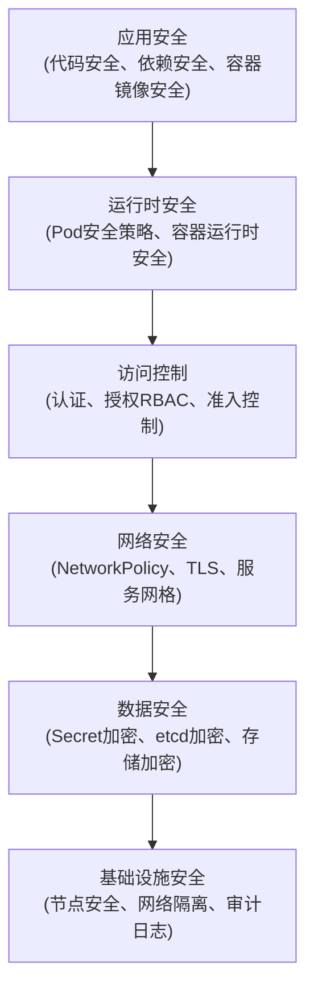
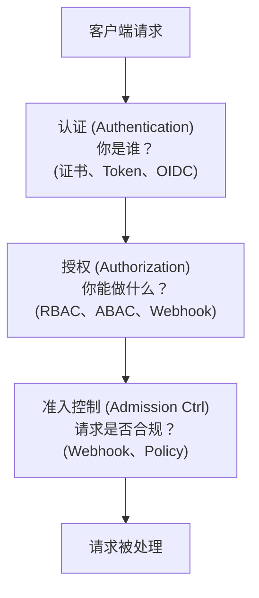

+++
title = "06.Kubernetes安全与RBAC"
description = "RBAC权限管理、Pod安全策略、网络安全与安全最佳实践"
date = 2025-01-16
[taxonomies]
tags = ["kubernetes", "container", "security", "rbac", "devops"]
+++

# Kubernetes安全与RBAC

## 一、K8s安全模型

### 1.1 安全层次

### 1.2 API请求流程

---

## 相关文章

- [上一篇：Kubernetes配置与密钥管理](/articles/cloud-native/k8s-05-配置与密钥管理/)
- [下一篇：Kubernetes运维与故障排查](/articles/cloud-native/k8s-07-运维与故障排查/)
