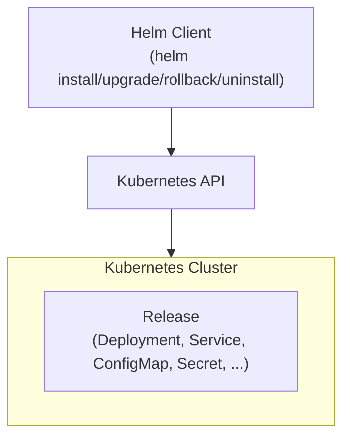

+++
title = "08.Helm包管理详解"
description = "Helm架构、Chart开发、模板语法与生产环境最佳实践"
date = 2025-01-16
[taxonomies]
tags = ["kubernetes", "container", "helm", "devops", "package"]
+++

# Helm包管理详解

## 一、Helm概述

### 1.1 什么是Helm

Helm是Kubernetes的包管理工具，类似于apt/yum之于Linux。

**核心概念**：

```
Chart：Helm包，包含K8s资源定义
Repository：Chart仓库
Release：Chart的一次部署实例
Values：Chart的配置参数
```

### 1.2 Helm架构



---

## 相关文章

- [上一篇：Kubernetes运维与故障排查](/articles/cloud-native/k8s-07-运维与故障排查/)
- [下一篇：Kubernetes架构与关键组件详解](/articles/cloud-native/k8s-09-架构与关键组件详解/)
