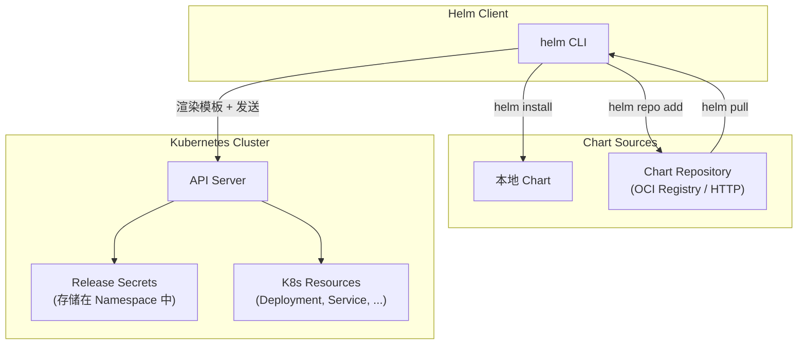

+++
title = "08.Helm包管理详解"
description = "Helm架构、Chart开发、模板语法、依赖管理、生命周期钩子与生产环境最佳实践"
date = 2025-01-16
[taxonomies]
tags = ["kubernetes", "container", "helm", "devops", "package"]
[extra]
toc = true
+++

# Helm 包管理详解

---

## 一、Helm 概述

### 1.1 什么是 Helm

Helm 是 Kubernetes 的**包管理工具**，类似于 apt/yum 之于 Linux、npm 之于 Node.js。它解决了 K8s 原生 YAML 管理的核心痛点：

| 痛点 | Helm 的解决方案 |
|------|---------------|
| 数十个 YAML 文件难以管理 | 打包成一个 **Chart** |
| 不同环境配置不同 | 通过 **Values** 参数化 |
| 部署/回滚/升级操作复杂 | `helm install/upgrade/rollback` 一键操作 |
| 无版本管理 | Chart 版本化，Release 支持历史记录 |
| 重复造轮子 | Chart **仓库**共享复用 |

### 1.2 核心概念

| 概念 | 说明 | 类比 |
|------|------|------|
| **Chart** | Helm 包，包含 K8s 资源模板和默认配置 | 软件安装包（.deb / .rpm） |
| **Repository** | Chart 仓库 | apt source / yum repo |
| **Release** | Chart 的一次部署实例 | 已安装的软件 |
| **Values** | Chart 的配置参数 | 安装时的配置选项 |
| **Template** | Go 模板语法的 K8s YAML | 配置模板 |

### 1.3 Helm 架构（v3）



**与 Helm v2 的区别**：
- v2 有服务端组件 **Tiller**（安全风险大），v3 已移除
- v3 Release 信息存储在 Namespace 的 Secret 中（而非 ConfigMap）
- v3 支持 **OCI Registry** 作为 Chart 仓库

### 1.4 Three-Way Merge（三方合并）

Helm v3 在执行 `helm upgrade` 时使用**三方战略合并（Three-Way Strategic Merge Patch）**，这是与 v2 最重要的行为差异之一。

**合并的三方：**

| 数据源 | 含义 |
|--------|------|
| **Old Rendered Manifest** | 上一个 Revision 的渲染模板（存储在 Release Secret 中） |
| **Live State** | 集群中资源的当前实际状态（通过 API Server 获取） |
| **New Rendered Manifest** | 本次 upgrade 渲染出的新模板 |

**工作流程**：

```
Old Manifest ──┐
               ├──→ Three-Way Merge ──→ 发送 Patch 到 API Server
Live State ────┤
               │
New Manifest ──┘
```

**核心意义**：如果有人通过 `kubectl edit` 手动修改了 Helm 管理的资源（比如临时增加了 `replicas` 或添加了 annotation），**helm upgrade 会保留这些手动修改**——只要新模板没有显式覆盖同一字段。这是因为 Live State 参与了合并计算。

**对比 Helm v2（Two-Way Merge）**：

```
# Helm v2: 只比较 Old Manifest vs New Manifest
# 结果：手动 kubectl edit 的修改在 upgrade 时会被丢弃

# Helm v3: 比较 Old Manifest ↔ Live State ↔ New Manifest
# 结果：手动修改被保留（除非新模板显式覆盖了同一字段）
```

**Release Secret 存储格式**：

每次 `install`/`upgrade`/`rollback` 都会在 Namespace 中创建一个 Secret，命名规则为：

```
sh.helm.release.v1.<release-name>.v<revision>
```

例如：`sh.helm.release.v1.my-app.v3` 表示 `my-app` 的第 3 个 Revision。

Secret 的 `data.release` 字段内容经过 **gzip 压缩 → base64 编码**，解码后是 JSON 格式，包含：
- Chart 元数据（Chart.yaml）
- 用户传入的 Values
- **完整的渲染后模板**（这就是三方合并中 Old Manifest 的来源）
- Release 状态信息

```bash
# 查看 Release Secret
kubectl get secret -n production -l owner=helm,name=my-app

# 解码查看内容（调试用）
kubectl get secret sh.helm.release.v1.my-app.v3 -n production \
  -o jsonpath='{.data.release}' | base64 -d | base64 -d | gzip -d | jq .
```

> ⚠️ **etcd 大小限制**：每个 Secret 受 etcd 的 **1MB 大小限制**。当 Chart 非常大（模板多、渲染后内容庞大）或 Revision 历史过多时，可能触发此限制。使用 `--history-max` 控制保留的历史 Revision 数量：
>
> ```bash
> helm upgrade --install my-app ./my-chart --history-max 10
> ```
>
> 生产环境建议设置 `--history-max 10~20`，避免 Secret 数量无限增长。

---

## 二、Chart 结构

### 2.1 目录结构

```
my-chart/
├── Chart.yaml              # Chart 元信息（名称、版本、依赖）
├── Chart.lock              # 依赖锁定文件
├── values.yaml             # 默认配置值
├── values.schema.json      # Values 的 JSON Schema 验证
├── .helmignore             # 打包时忽略的文件
├── templates/              # K8s 资源模板
│   ├── _helpers.tpl        # 模板助手函数
│   ├── deployment.yaml     # Deployment 模板
│   ├── service.yaml        # Service 模板
│   ├── ingress.yaml        # Ingress 模板
│   ├── configmap.yaml      # ConfigMap 模板
│   ├── secret.yaml         # Secret 模板
│   ├── hpa.yaml            # HPA 模板
│   ├── serviceaccount.yaml # ServiceAccount 模板
│   ├── NOTES.txt           # 安装后显示的信息
│   └── tests/              # 测试 Pod 模板
│       └── test-connection.yaml
├── charts/                 # 子 Chart / 依赖
└── crds/                   # CRD 定义（安装时自动创建）
```

### 2.2 Chart.yaml

```yaml
apiVersion: v2                   # Helm v3 使用 v2
name: my-web-app
description: A Helm chart for my web application
type: application                # application 或 library
version: 1.2.3                   # Chart 版本（语义化版本）
appVersion: "2.0.0"              # 应用版本
kubeVersion: ">=1.25.0"          # 要求的 K8s 版本

maintainers:
  - name: Platform Team
    email: platform@example.com

dependencies:
  - name: postgresql
    version: "~13.2"             # 语义化版本范围
    repository: "https://charts.bitnami.com/bitnami"
    condition: postgresql.enabled  # 条件安装
  - name: redis
    version: "~18.0"
    repository: "oci://registry-1.docker.io/bitnamicharts"
    condition: redis.enabled
```

---

## 三、模板语法

### 3.1 基本语法

Helm 使用 Go 模板引擎，核心语法：

```yaml
# templates/deployment.yaml
apiVersion: apps/v1
kind: Deployment
metadata:
  name: {{ include "my-chart.fullname" . }}
  labels:
    {{- include "my-chart.labels" . | nindent 4 }}
spec:
  replicas: {{ .Values.replicaCount }}
  selector:
    matchLabels:
      {{- include "my-chart.selectorLabels" . | nindent 6 }}
  template:
    metadata:
      annotations:
        # 当 ConfigMap 变化时触发 Pod 滚动更新
        checksum/config: {{ include (print $.Template.BasePath "/configmap.yaml") . | sha256sum }}
      labels:
        {{- include "my-chart.selectorLabels" . | nindent 8 }}
    spec:
      serviceAccountName: {{ include "my-chart.serviceAccountName" . }}
      {{- with .Values.imagePullSecrets }}
      imagePullSecrets:
        {{- toYaml . | nindent 8 }}
      {{- end }}
      containers:
        - name: {{ .Chart.Name }}
          image: "{{ .Values.image.repository }}:{{ .Values.image.tag | default .Chart.AppVersion }}"
          imagePullPolicy: {{ .Values.image.pullPolicy }}
          ports:
            - name: http
              containerPort: {{ .Values.service.port }}
              protocol: TCP
          {{- if .Values.livenessProbe.enabled }}
          livenessProbe:
            httpGet:
              path: {{ .Values.livenessProbe.path }}
              port: http
            initialDelaySeconds: {{ .Values.livenessProbe.initialDelaySeconds }}
            periodSeconds: {{ .Values.livenessProbe.periodSeconds }}
          {{- end }}
          resources:
            {{- toYaml .Values.resources | nindent 12 }}
          env:
            {{- range $key, $value := .Values.env }}
            - name: {{ $key }}
              value: {{ $value | quote }}
            {{- end }}
```

### 3.2 内置对象

| 对象 | 说明 | 示例 |
|------|------|------|
| `.Values` | 来自 values.yaml 和 `--set` | `.Values.image.tag` |
| `.Chart` | Chart.yaml 内容 | `.Chart.Name`, `.Chart.Version` |
| `.Release` | Release 信息 | `.Release.Name`, `.Release.Namespace` |
| `.Template` | 当前模板信息 | `.Template.BasePath` |
| `.Capabilities` | K8s 集群能力 | `.Capabilities.KubeVersion` |
| `.Files` | Chart 中的非模板文件 | `.Files.Get "config.ini"` |

### 3.3 Helper 模板 (_helpers.tpl)

```yaml
# templates/_helpers.tpl

# Chart 全名（带 Release 名）
{{- define "my-chart.fullname" -}}
{{- if .Values.fullnameOverride }}
{{- .Values.fullnameOverride | trunc 63 | trimSuffix "-" }}
{{- else }}
{{- $name := default .Chart.Name .Values.nameOverride }}
{{- if contains $name .Release.Name }}
{{- .Release.Name | trunc 63 | trimSuffix "-" }}
{{- else }}
{{- printf "%s-%s" .Release.Name $name | trunc 63 | trimSuffix "-" }}
{{- end }}
{{- end }}
{{- end }}

# 通用标签
{{- define "my-chart.labels" -}}
helm.sh/chart: {{ include "my-chart.chart" . }}
{{ include "my-chart.selectorLabels" . }}
app.kubernetes.io/version: {{ .Chart.AppVersion | quote }}
app.kubernetes.io/managed-by: {{ .Release.Service }}
{{- end }}

# Selector 标签（不能改变）
{{- define "my-chart.selectorLabels" -}}
app.kubernetes.io/name: {{ include "my-chart.name" . }}
app.kubernetes.io/instance: {{ .Release.Name }}
{{- end }}
```

### 3.4 常用模板函数

| 函数 | 说明 | 示例 |
|------|------|------|
| `default` | 设置默认值 | `{{ .Values.tag \| default "latest" }}` |
| `quote` | 加引号 | `{{ .Values.name \| quote }}` |
| `toYaml` | 转为 YAML | `{{ toYaml .Values.resources \| nindent 12 }}` |
| `nindent` | 换行并缩进 | 常与 `toYaml` 配合 |
| `include` | 引入命名模板 | `{{ include "chart.fullname" . }}` |
| `tpl` | 将字符串当模板渲染 | `{{ tpl .Values.annotation . }}` |
| `required` | 必填校验 | `{{ required "image.tag is required" .Values.image.tag }}` |
| `lookup` | 运行时查询集群资源 | `{{ lookup "v1" "Secret" "ns" "name" }}` |
| `sha256sum` | 计算 SHA256 | 触发滚动更新 |

### 3.5 模板常见陷阱

#### 3.5.1 `range` 作用域问题

在 `{{range}}` 循环中，`.` 指向**当前迭代元素**而非全局根对象。需要用 `$` 访问全局作用域：

```yaml
# ❌ 错误：.Release.Name 在 range 内不可访问（. 已被重绑定）
{{- range .Values.containers }}
- name: {{ .name }}
  image: {{ .image }}
  labels:
    release: {{ .Release.Name }}    # 报错！. 是当前 container 对象
{{- end }}

# ✅ 正确：使用 $ 引用全局根对象
{{- range .Values.containers }}
- name: {{ .name }}
  image: {{ .image }}
  labels:
    release: {{ $.Release.Name }}   # $ 始终指向根作用域
    chart: {{ $.Chart.Name }}
{{- end }}
```

同样的问题也出现在 `{{with}}` 块中——`with` 会改变 `.` 的指向。

#### 3.5.2 `lookup` 函数的限制

`lookup` 可以在模板渲染时查询集群中已有的资源：

```yaml
# 查询集群中是否存在某个 Secret
{{- $secret := lookup "v1" "Secret" .Release.Namespace "my-existing-secret" }}
{{- if $secret }}
# Secret 已存在，引用它
{{- else }}
# Secret 不存在，创建新的
{{- end }}
```

**重要限制**：`helm template` 命令**不会执行 `lookup`**（因为没有集群连接），`lookup` 永远返回空对象。只有 `helm install` 和 `helm upgrade` 才会真正执行 `lookup` 查询。因此，**所有使用 `lookup` 的逻辑必须有 fallback 处理**。

#### 3.5.3 空白控制

```yaml
# {{- 去除左侧空白（包括换行符），-}} 去除右侧空白
# 没有空白控制：
metadata:
  labels:
    {{ include "my-chart.labels" . }}    # 前面会有多余缩进

# 有空白控制：
metadata:
  labels:
    {{- include "my-chart.labels" . | nindent 4 }}  # 精确控制缩进

# nindent vs indent 的区别：
# nindent N = 先输出一个换行符，再缩进 N 个空格
# indent N  = 只缩进 N 个空格，不换行
# 大多数情况使用 nindent，因为它与 {{- 配合最干净
```

#### 3.5.4 常用 Sprig 扩展函数

Helm 内置了 [Sprig](http://masterminds.github.io/sprig/) 函数库，除了 3.4 中列出的，以下也很常用：

| 函数 | 说明 | 示例 |
|------|------|------|
| `ternary` | 三元表达式 | `{{ ternary "yes" "no" .Values.enabled }}` |
| `coalesce` | 返回第一个非空值 | `{{ coalesce .Values.tag .Chart.AppVersion "latest" }}` |
| `empty` | 判断是否为空 | `{{ if not (empty .Values.annotations) }}` |
| `has` | 判断列表是否包含元素 | `{{ if has "admin" .Values.roles }}` |
| `dict` | 创建字典 | `{{ $d := dict "key1" "val1" "key2" "val2" }}` |
| `set` | 向字典添加键值 | `{{ $_ := set $d "key3" "val3" }}` |
| `merge` | 合并多个字典 | `{{ merge $target $defaults }}` |
| `deepCopy` | 深拷贝对象 | `{{ $copy := deepCopy .Values.resources }}` |
| `regexMatch` | 正则匹配 | `{{ if regexMatch "^v[0-9]+" .Values.tag }}` |
| `htpasswd` | 生成 bcrypt 密码 | `{{ htpasswd "user" "pass" }}` |
| `fromYaml` | YAML 字符串解析为对象 | `{{ $obj := .Files.Get "conf.yaml" \| fromYaml }}` |
| `fromJson` / `toJson` | JSON 互转 | `{{ .Values.config \| toJson }}` |

#### 3.5.5 `fail` 函数：自定义校验错误

`fail` 可以在模板渲染阶段主动终止并输出错误信息，比 `required` 更灵活：

```yaml
{{- if and .Values.ingress.enabled (empty .Values.ingress.hosts) }}
  {{ fail "ingress.enabled=true 时必须指定至少一个 ingress.hosts" }}
{{- end }}

{{- if gt (int .Values.replicaCount) 20 }}
  {{ fail (printf "replicaCount=%d 超过允许的最大值 20" (int .Values.replicaCount)) }}
{{- end }}

# required 适合简单的非空校验，fail 适合复杂的条件组合校验
```

---

## 四、Values 管理

### 4.1 values.yaml 示例

```yaml
# values.yaml — 默认配置
replicaCount: 2

image:
  repository: my-registry.io/my-app
  pullPolicy: IfNotPresent
  tag: ""                       # 默认使用 Chart.AppVersion

imagePullSecrets:
  - name: regcred

service:
  type: ClusterIP
  port: 8080

ingress:
  enabled: true
  className: nginx
  annotations:
    cert-manager.io/cluster-issuer: letsencrypt-prod
  hosts:
    - host: app.example.com
      paths:
        - path: /
          pathType: Prefix
  tls:
    - secretName: app-tls
      hosts:
        - app.example.com

resources:
  limits:
    cpu: 500m
    memory: 256Mi
  requests:
    cpu: 100m
    memory: 128Mi

autoscaling:
  enabled: true
  minReplicas: 2
  maxReplicas: 10
  targetCPUUtilizationPercentage: 80

postgresql:
  enabled: true
  auth:
    database: myapp
    username: myapp

redis:
  enabled: false

env:
  LOG_LEVEL: "info"
  APP_ENV: "production"

livenessProbe:
  enabled: true
  path: /healthz
  initialDelaySeconds: 10
  periodSeconds: 10

readinessProbe:
  enabled: true
  path: /ready
  initialDelaySeconds: 5
  periodSeconds: 5
```

### 4.2 Values 覆盖优先级

```bash
# 优先级从低到高：
# 1. Chart 默认 values.yaml
# 2. 父 Chart 的 values.yaml
# 3. -f / --values 文件（多个文件时后面覆盖前面）
# 4. --set 参数（最高优先级）

helm install my-release ./my-chart \
  -f values-production.yaml \            # 环境配置
  -f values-secrets.yaml \               # 密钥配置
  --set image.tag=v2.1.0 \              # 镜像版本
  --set replicaCount=5                   # 副本数
```

### 4.3 Values Schema 验证

```json
{
  "$schema": "https://json-schema.org/draft-07/schema#",
  "type": "object",
  "required": ["image", "service"],
  "properties": {
    "replicaCount": {
      "type": "integer",
      "minimum": 1,
      "maximum": 100
    },
    "image": {
      "type": "object",
      "required": ["repository"],
      "properties": {
        "repository": { "type": "string" },
        "tag": { "type": "string" },
        "pullPolicy": {
          "type": "string",
          "enum": ["Always", "IfNotPresent", "Never"]
        }
      }
    },
    "service": {
      "type": "object",
      "properties": {
        "type": {
          "type": "string",
          "enum": ["ClusterIP", "NodePort", "LoadBalancer"]
        },
        "port": {
          "type": "integer",
          "minimum": 1,
          "maximum": 65535
        }
      }
    }
  }
}
```

---

## 五、Release 生命周期

### 5.1 核心命令

```bash
# 安装
helm install my-release ./my-chart -n production --create-namespace

# 升级（修改配置或 Chart 版本）
helm upgrade my-release ./my-chart -n production -f values-prod.yaml

# 安装或升级（幂等操作，CI/CD 常用）
helm upgrade --install my-release ./my-chart -n production

# 回滚到上一个版本
helm rollback my-release -n production

# 回滚到指定版本
helm rollback my-release 3 -n production

# 查看 Release 历史
helm history my-release -n production

# 卸载
helm uninstall my-release -n production

# 模板渲染（不实际部署，用于调试）
helm template my-release ./my-chart -f values-prod.yaml

# 检查 Chart 语法和最佳实践
helm lint ./my-chart

# Dry run（发送到 API Server 但不实际创建）
helm install my-release ./my-chart --dry-run --debug
```

### 5.2 Release 历史与回滚

```bash
$ helm history my-release -n production
REVISION  STATUS      CHART         APP VERSION  DESCRIPTION
1         superseded  my-chart-1.0  1.0.0        Install complete
2         superseded  my-chart-1.1  1.1.0        Upgrade complete
3         deployed    my-chart-1.2  1.2.0        Upgrade complete

$ helm rollback my-release 2 -n production
Rollback was a success! Happy Helming!

$ helm history my-release -n production
REVISION  STATUS      CHART         APP VERSION  DESCRIPTION
1         superseded  my-chart-1.0  1.0.0        Install complete
2         superseded  my-chart-1.1  1.1.0        Upgrade complete
3         superseded  my-chart-1.2  1.2.0        Upgrade complete
4         deployed    my-chart-1.1  1.1.0        Rollback to 2
```

### 5.3 Hooks（生命周期钩子）

Hooks 允许在 Release 生命周期的特定阶段执行操作：

| Hook | 触发时机 | 典型用途 |
|------|---------|---------|
| `pre-install` | 安装前 | 创建数据库 |
| `post-install` | 安装后 | 发通知 / 运行数据迁移 |
| `pre-upgrade` | 升级前 | 数据库备份 |
| `post-upgrade` | 升级后 | 数据库迁移 |
| `pre-rollback` | 回滚前 | 数据备份 |
| `post-rollback` | 回滚后 | 清理 |
| `pre-delete` | 卸载前 | 数据导出 |
| `post-delete` | 卸载后 | 清理外部资源 |
| `test` | `helm test` 时 | 集成测试 |

```yaml
# templates/pre-upgrade-backup.yaml
apiVersion: batch/v1
kind: Job
metadata:
  name: {{ include "my-chart.fullname" . }}-db-backup
  annotations:
    "helm.sh/hook": pre-upgrade
    "helm.sh/hook-weight": "-5"          # 执行顺序（小的先执行）
    "helm.sh/hook-delete-policy": before-hook-creation,hook-succeeded
spec:
  template:
    spec:
      restartPolicy: Never
      containers:
        - name: backup
          image: postgres:15
          command: ["pg_dump", "-h", "$(DB_HOST)", "-U", "$(DB_USER)", "-d", "$(DB_NAME)"]
          env:
            - name: DB_HOST
              value: {{ .Values.postgresql.host }}
            - name: PGPASSWORD
              valueFrom:
                secretKeyRef:
                  name: {{ include "my-chart.fullname" . }}-db
                  key: password
```

### 5.4 Hooks 深入机制

#### Hook 资源不受 Release 管理

**关键认知**：Hook 创建的资源（如 Job、Pod）**不属于 Release 管理范围**。这意味着：
- `helm uninstall` **不会删除** Hook 资源
- `helm list` 中看到的 Release 资源列表不包含 Hook
- 如果不设置 `hook-delete-policy`，Hook Job/Pod 会一直残留在集群中

#### `hook-delete-policy` 详解

| 策略值 | 行为 | 适用场景 |
|--------|------|---------|
| `before-hook-creation` | 创建新 Hook 前，删除上一次同名 Hook 资源 | **推荐默认策略**。确保每次 upgrade 都是干净的 Hook |
| `hook-succeeded` | Hook 成功完成后立即删除 | 不需要查看 Hook 日志时使用 |
| `hook-failed` | Hook 失败后删除 | 很少单独使用，失败后通常需要查看日志排查 |

```yaml
annotations:
  "helm.sh/hook": pre-upgrade
  # 组合使用：先删旧的，成功后也删新的
  "helm.sh/hook-delete-policy": before-hook-creation,hook-succeeded
```

> 💡 **生产建议**：始终设置 `before-hook-creation`。如果还需要自动清理成功的 Hook，加上 `hook-succeeded`。失败的 Hook 建议保留以便排查问题。

#### Hook 失败的影响

- **`pre-install` / `pre-upgrade` Hook 失败** → 整个 Release 标记为 `failed`，**后续资源不会被部署**
- 但已经通过 API Server 创建的资源**不会被自动回滚**（Helm 不做反向删除）
- `post-install` / `post-upgrade` Hook 失败 → Release 同样标记为 `failed`，但此时主资源已经部署完成

```bash
# Hook 失败后查看 Release 状态
helm list -n production
# STATUS 显示 failed

# 查看失败的 Hook Job 日志
kubectl logs job/my-app-db-migration -n production

# 修复后重新升级
helm upgrade my-app ./my-chart -n production
```

#### 多 Hook 的执行顺序

当存在多个 Hook 时，执行顺序由以下规则决定：

1. **`hook-weight`**：从小到大排序执行（默认为 `0`）
2. **相同 weight**：按资源 Kind 名称字母序排序
3. **相同 Kind**：按资源名称字母序排序

```yaml
# 执行顺序：weight=-10 → weight=-5 → weight=0 → weight=5
# 示例：先创建 Secret，再执行 Migration Job
---
metadata:
  annotations:
    "helm.sh/hook": pre-upgrade
    "helm.sh/hook-weight": "-10"   # 先执行
# ...创建 DB 密码 Secret...
---
metadata:
  annotations:
    "helm.sh/hook": pre-upgrade
    "helm.sh/hook-weight": "0"     # 后执行
# ...执行 DB Migration Job（依赖上面的 Secret）...
```

#### Hook 超时控制

Hook 的超时由 `helm install/upgrade` 的 `--timeout` 参数统一控制（默认 5 分钟）：

```bash
# 设置 10 分钟超时（包含 Hook 执行时间和资源就绪等待时间）
helm upgrade --install my-app ./my-chart --timeout 10m --wait
```

如果 Hook Job 在超时时间内未完成，Helm 会将 Release 标记为 `failed`。

---

## 六、依赖管理

### 6.1 管理依赖

```bash
# 下载依赖到 charts/ 目录
helm dependency update ./my-chart

# 查看依赖
helm dependency list ./my-chart

# 重建依赖
helm dependency build ./my-chart
```

### 6.2 子 Chart 配置

在父 Chart 的 `values.yaml` 中，通过子 Chart 名称作为 key 配置子 Chart：

```yaml
# 父 Chart 的 values.yaml
postgresql:
  enabled: true              # 条件安装
  auth:
    postgresPassword: "secret"
    database: "myapp"
  primary:
    persistence:
      size: 50Gi
  metrics:
    enabled: true

redis:
  enabled: false
```

### 6.3 Library Chart

Library Chart 不直接生成 K8s 资源，提供可复用的模板函数：

```yaml
# Chart.yaml
apiVersion: v2
name: my-lib
type: library    # 类型为 library
version: 1.0.0
```

```yaml
# 在应用 Chart 中使用
dependencies:
  - name: my-lib
    version: "1.0.0"
    repository: "oci://my-registry.io/charts"
```

### 6.4 依赖高级特性

#### `alias`：同一 Chart 多次引用

当需要同一个 Chart 作为依赖多次但配置不同时，使用 `alias`：

```yaml
# Chart.yaml
dependencies:
  - name: redis
    version: "~18.0"
    repository: "https://charts.bitnami.com/bitnami"
    alias: redis-cache            # 别名 1：用作缓存
    condition: redis-cache.enabled
  - name: redis
    version: "~18.0"
    repository: "https://charts.bitnami.com/bitnami"
    alias: redis-session          # 别名 2：用作 Session 存储
    condition: redis-session.enabled
```

```yaml
# values.yaml — 通过别名分别配置
redis-cache:
  enabled: true
  architecture: standalone
  master:
    persistence:
      size: 8Gi

redis-session:
  enabled: true
  architecture: replication
  replica:
    replicaCount: 3
  master:
    persistence:
      size: 2Gi
```

#### `import-values`：子 Chart 导出值给父 Chart

子 Chart 可以通过 `exports` 暴露默认值给父 Chart 导入：

```yaml
# 子 Chart (postgresql) 的 values.yaml
exports:
  dbConfig:
    host: postgresql
    port: 5432

# 父 Chart 的 Chart.yaml
dependencies:
  - name: postgresql
    version: "~13.2"
    repository: "https://charts.bitnami.com/bitnami"
    import-values:
      - dbConfig    # 将子 Chart 的 exports.dbConfig 导入到父 Chart 的顶层 Values
```

#### `tags` vs `condition`

两者都控制依赖的启用/禁用，但粒度不同：

```yaml
# Chart.yaml
dependencies:
  - name: redis
    version: "~18.0"
    repository: "https://charts.bitnami.com/bitnami"
    condition: redis.enabled        # 精确控制：单个依赖
    tags:
      - cache                       # 分组控制：按标签批量启用/禁用
  - name: memcached
    version: "~6.0"
    repository: "https://charts.bitnami.com/bitnami"
    condition: memcached.enabled
    tags:
      - cache                       # 同一 tag 组
```

```yaml
# values.yaml
tags:
  cache: true         # 启用所有 tag=cache 的依赖

redis:
  enabled: true       # condition 优先级高于 tags
memcached:
  enabled: false      # 即使 tag cache=true，condition=false 仍会禁用
```

> **优先级**：`condition` > `tags`。当 `condition` 有值时，`tags` 被忽略。

#### `global` Values：跨 Chart 传值

`values.yaml` 中 `global` 键下的值会自动传播到**所有子 Chart**：

```yaml
# 父 Chart 的 values.yaml
global:
  imageRegistry: my-registry.io    # 所有子 Chart 都能访问
  imagePullSecrets:
    - name: regcred
  storageClass: gp3

# 子 Chart 模板中访问：
# {{ .Values.global.imageRegistry }}
```

这是跨多个子 Chart 统一配置（如镜像仓库、Pull Secret、存储类）的标准方式。

#### `helm dependency update` vs `helm dependency build`

| 命令 | 行为 |
|------|------|
| `helm dependency update` | 根据 `Chart.yaml` 重新解析依赖，**下载最新匹配版本**并更新 `Chart.lock` |
| `helm dependency build` | 根据已有的 `Chart.lock` 下载依赖，**不更新 lock 文件** |

```bash
# 开发时：更新依赖到最新兼容版本
helm dependency update ./my-chart

# CI/CD 中：严格按 lock 文件构建（可复现构建）
helm dependency build ./my-chart
```

> **最佳实践**：开发时用 `update`，CI/CD 管线用 `build`（确保构建可复现），并将 `Chart.lock` 提交到 Git。

---

## 七、Chart 仓库

### 7.1 OCI Registry（推荐）

Helm 3.8+ 正式支持 OCI (Open Container Initiative) Registry 存储 Chart：

```bash
# 登录 Registry
helm registry login my-registry.io

# 推送 Chart
helm package ./my-chart
helm push my-chart-1.2.3.tgz oci://my-registry.io/charts

# 安装
helm install my-release oci://my-registry.io/charts/my-chart --version 1.2.3

# 拉取
helm pull oci://my-registry.io/charts/my-chart --version 1.2.3
```

### 7.2 传统 HTTP Repository

```bash
# 添加仓库
helm repo add bitnami https://charts.bitnami.com/bitnami
helm repo update

# 搜索 Chart
helm search repo bitnami/postgresql --versions

# 安装
helm install my-pg bitnami/postgresql --version 13.2.24 -f pg-values.yaml
```

### 7.4 OCI Registry 高级特性

#### OCI Registry 推拉流程

```bash
# 登录
helm registry login registry.example.com --username user --password-stdin

# 推送（Chart 打包后推送为 OCI artifact）
helm push mychart-1.0.0.tgz oci://registry.example.com/charts

# 拉取
helm pull oci://registry.example.com/charts/mychart --version 1.0.0

# 直接安装
helm install myrelease oci://registry.example.com/charts/mychart --version 1.0.0
```

#### Chart 签名与 Provenance

- `helm package --sign --key <keyname> --keyring <keyring>` 生成 `.prov` provenance 文件
- `helm verify mychart-1.0.0.tgz` 验证签名
- Provenance 文件包含：Chart 元数据 hash、签名者信息、构建时间
- 生产环境应在 CI/CD 中自动签名，部署时验证

#### OCI vs HTTP 仓库对比

| 维度 | HTTP Chart Repository | OCI Registry |
|------|----------------------|-------------|
| 协议 | HTTP GET `index.yaml` | OCI Distribution Spec |
| 认证 | Basic Auth / Token | Docker login compatible |
| 存储 | 需独立 Chart Server（ChartMuseum） | 复用已有容器 Registry（Harbor、ECR、GCR、ACR） |
| 版本管理 | `index.yaml` 文件列举所有版本 | Tag-based，与容器镜像一致 |
| 签名 | `.prov` 文件 | OCI Signatures (cosign/notation) |
| 推荐 | 遗留系统 | **新项目推荐** |

#### Private Registry 配置

- `helm registry login` 凭据存储在 `~/.config/helm/registry/config.json`（与 Docker config 格式兼容）
- 可通过 `HELM_REGISTRY_CONFIG` 环境变量自定义路径
- CI/CD 中使用 service account token 或 cloud IAM 认证（如 `aws ecr get-login-password`）

---

## 八、生产最佳实践

### 8.1 Chart 开发

- **参数化所有可变项**：镜像、端口、资源限制、副本数、探针路径等
- **使用 `values.schema.json`**：在安装时自动校验参数，尽早发现错误
- **定义 `_helpers.tpl`**：统一命名和标签逻辑，避免模板中硬编码
- **使用 `required` 函数**：对必填参数做校验
- **添加 `NOTES.txt`**：安装后提示用户如何访问服务

### 8.2 版本管理

```bash
# Chart 版本 vs App 版本
# - Chart version (version): Chart 模板/结构变化时递增
# - App version (appVersion): 应用程序版本变化时递增
# 两者独立管理

# 版本策略
# 1.0.0 → 1.0.1  # 修复 Chart bug / 调整默认值
# 1.0.0 → 1.1.0  # 添加新模板 / 新功能
# 1.0.0 → 2.0.0  # 不兼容的 Values 结构变更
```

### 8.3 CI/CD 集成

```yaml
# GitLab CI 示例
deploy:
  stage: deploy
  image: alpine/helm:3.14
  script:
    - helm repo add bitnami https://charts.bitnami.com/bitnami
    - helm dependency build ./deploy/my-chart
    - |
      helm upgrade --install my-app ./deploy/my-chart \
        --namespace production \
        --create-namespace \
        --wait \
        --timeout 5m \
        --set image.tag=${CI_COMMIT_SHA:0:8} \
        --set image.repository=${CI_REGISTRY_IMAGE} \
        -f ./deploy/values-production.yaml
    - helm test my-app --namespace production
  only:
    - main
```

### 8.4 安全建议

| 实践 | 说明 |
|------|------|
| **不要在 values.yaml 中存储 Secret** | 使用 External Secrets / SOPS 加密 |
| **签名 Chart** | `helm package --sign` 签名，`helm verify` 验证 |
| **Pin 依赖版本** | 使用 `Chart.lock`，避免意外升级 |
| **限制 Helm 权限** | 为 CI/CD 创建专用 SA，仅授权所需 Namespace |
| **审查第三方 Chart** | 安装前 `helm template` 查看渲染结果 |

### 8.5 常见陷阱

| 陷阱 | 后果 | 解决方案 |
|------|------|---------|
| `--set` 覆盖列表类型 | 整个列表被替换而非合并 | 使用 `-f` 文件覆盖 |
| 模板渲染多余空行 | YAML 格式错误 | 使用 `{{-` 和 `-}}` 控制空白 |
| Hook 资源未清理 | 残留 Job/Pod | 设置 `hook-delete-policy` |
| CRD 升级不生效 | Helm 不升级 crds/ 中的 CRD | 手动 `kubectl apply` CRD |
| Release 名冲突 | 跨 Namespace 名称不冲突，同 Namespace 冲突 | 使用 `fullnameOverride` 或唯一 Release 名 |

---

## 九、高级功能与插件

### 9.1 Post Renderer：Helm + Kustomize 混合工作流

`--post-renderer` 允许在 Helm 渲染模板后、提交到 API Server 前，对 YAML 做额外修改。最常见的用途是集成 **Kustomize**：

```bash
# 创建 post-render 脚本
cat > kustomize-post-renderer.sh << 'SCRIPT'
#!/bin/bash
# Helm 渲染结果通过 stdin 传入，处理后输出到 stdout
cat <&0 > all.yaml
kustomize build . && rm all.yaml
SCRIPT
chmod +x kustomize-post-renderer.sh

# 创建 kustomization.yaml
cat > kustomization.yaml << 'KUSTOM'
apiVersion: kustomize.config.k8s.io/v1beta1
kind: Kustomization
resources:
  - all.yaml
patches:
  - patch: |
      - op: add
        path: /metadata/annotations/company.io~1managed-by
        value: platform-team
    target:
      kind: Deployment
KUSTOM

# 使用 post-renderer 部署
helm upgrade --install my-app ./my-chart \
  --post-renderer ./kustomize-post-renderer.sh
```

**典型场景**：企业平台团队需要为所有 Helm Chart 注入统一的 sidecar、annotation、label 等，而不修改 Chart 本身。

### 9.2 helm-diff 插件：升级前预览变更

`helm-diff` 是生产环境**必备插件**，在执行 `helm upgrade` 前预览实际会发生的变更：

```bash
# 安装插件
helm plugin install https://github.com/databus23/helm-diff

# 预览升级会带来的变更（对比当前 Release 和新渲染结果）
helm diff upgrade my-app ./my-chart -f values-prod.yaml

# 输出示例：
# my-app, Deployment (apps/v1) has changed:
#   spec.template.spec.containers[0].image:
# -   my-registry.io/my-app:v1.0.0
# +   my-registry.io/my-app:v2.0.0
#   spec.replicas:
# -   2
# +   5

# 确认无误后再真正升级
helm upgrade my-app ./my-chart -f values-prod.yaml
```

> **CI/CD 集成**：在 Pipeline 中先 `helm diff upgrade`，输出变更到 MR/PR 评论中供团队 Review，审批后再执行真正的 `helm upgrade`。

### 9.3 helm-secrets 插件：加密 Values 文件

使用 [SOPS](https://github.com/getsops/sops) 对 Values 文件中的敏感数据加密，**密文直接提交到 Git**：

```bash
# 安装插件
helm plugin install https://github.com/jkroepke/helm-secrets

# 加密 values 文件（支持 AWS KMS / GCP KMS / Azure Key Vault / age / PGP）
sops -e values-secrets.yaml > values-secrets.enc.yaml

# 使用加密文件部署（helm-secrets 自动解密）
helm secrets upgrade --install my-app ./my-chart \
  -f values-prod.yaml \
  -f values-secrets.enc.yaml
```

### 9.4 Chart Testing (ct)：CI 中的 Chart 质量保障

[chart-testing](https://github.com/helm/chart-testing) (`ct`) 是 Helm 官方推荐的 CI 测试工具：

```bash
# 安装 ct
# brew install chart-testing  # macOS
# 或使用官方 Docker 镜像 quay.io/helmpack/chart-testing

# lint：检查 Chart 语法和最佳实践
ct lint --charts ./charts/my-chart

# install：在临时 Namespace 中安装并运行 helm test
ct install --charts ./charts/my-chart

# lint-and-install：完整流程（CI 中常用）
ct lint-and-install --charts ./charts/my-chart
```

```yaml
# GitHub Actions 集成示例
- name: Run chart-testing (lint and install)
  uses: helm/chart-testing-action@v2
  with:
    command: lint-and-install
```

### 9.5 Subchart 与 Global Values 交互

在复杂的 Umbrella Chart（伞形 Chart）架构中，多个子 Chart 需要共享配置：

```yaml
# 父 Chart values.yaml
global:
  imageRegistry: my-registry.io
  imageTag: v2.0.0
  domain: app.example.com

# 子 Chart A 的模板中：
image: "{{ .Values.global.imageRegistry }}/service-a:{{ .Values.global.imageTag }}"

# 子 Chart B 的模板中：
image: "{{ .Values.global.imageRegistry }}/service-b:{{ .Values.global.imageTag }}"
```

**子 Chart 覆盖规则**：父 Chart 中以子 Chart 名为 key 的配置优先级高于子 Chart 自身的 `values.yaml`，但 `global` 值在所有层级中共享且可被子 Chart 访问。

---

## 十、面试高频问答

**Q1：Helm v2 和 v3 的主要区别？**

A：最大区别是 v3 移除了 Tiller（服务端组件）。v2 中 Tiller 使用 cluster-admin 权限，安全风险大。v3 直接使用 kubeconfig 的权限，Release 信息存储在 Namespace 的 Secret 中，支持 OCI Registry。

**Q2：`helm upgrade --install` 和 `helm install` 有什么区别？**

A：`helm install` 仅在 Release 不存在时安装，已存在则报错。`helm upgrade --install` 是幂等操作——不存在则安装，已存在则升级。CI/CD 中通常用后者。

**Q3：如何在 ConfigMap 变化时触发 Pod 重启？**

A：在 Pod 模板的 annotation 中加入 ConfigMap 内容的 checksum：`checksum/config: {{ include (print $.Template.BasePath "/configmap.yaml") . | sha256sum }}`。ConfigMap 内容变化时 checksum 变化，触发 Deployment 滚动更新。

**Q4：Helm 如何处理 CRD？**

A：crds/ 目录中的 CRD 仅在 `helm install` 时创建，`helm upgrade` **不会更新**，`helm uninstall` **不会删除**。如果需要更新 CRD，应手动 `kubectl apply` 或使用 Operator。这是有意设计，避免 CRD 升级意外影响集群中所有使用该 CRD 的资源。

**Q5：有人手动 `kubectl edit` 修改了 Helm 管理的资源，`helm upgrade` 会怎么处理？**

A：Helm v3 使用**三方合并（Three-Way Merge）**。升级时会比较三个版本：上一次 Release 存储的渲染模板（Old Manifest）、集群中的实际状态（Live State）、本次渲染的新模板（New Manifest）。如果手动修改的字段在新模板中没有显式设置，**手动修改会被保留**。只有当新模板显式覆盖了同一字段时，手动修改才会被覆盖。这是 v3 相对于 v2 的重大改进——v2 使用两方合并（只比较 Old vs New），会**丢弃**所有手动修改。

**Q6：`helm rollback` 是真正的回滚还是创建新 Revision？**

A：`helm rollback` **不是**真正意义上的「恢复到过去的状态」，而是**创建一个新的 Revision**，其内容来源于指定的旧 Revision 存储的渲染模板。例如当前是 Revision 3，执行 `helm rollback my-app 2` 后，会创建 Revision 4，其内容与 Revision 2 的渲染模板相同。这个设计保证了 Release 历史的**单调递增和可追溯性**——永远不会丢失历史记录。回滚本身也会触发 `pre-rollback` 和 `post-rollback` Hooks。

---

## 相关文章

- [上一篇：Kubernetes运维与故障排查](/articles/cloud-native/k8s-07-运维与故障排查/)
- [下一篇：Kubernetes架构与关键组件详解](/articles/cloud-native/k8s-09-架构与关键组件详解/)
