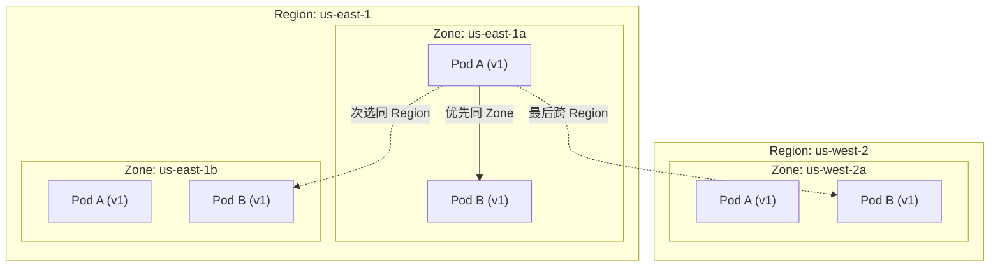
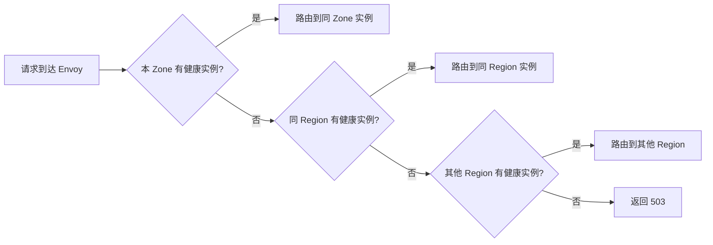
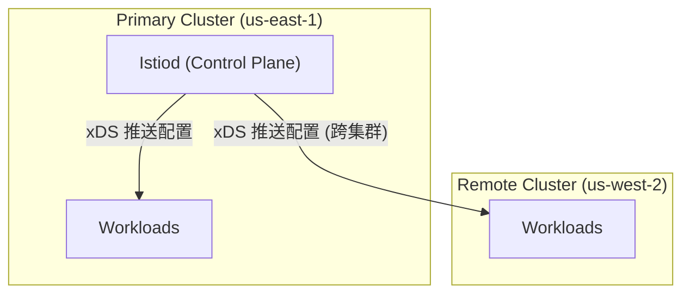
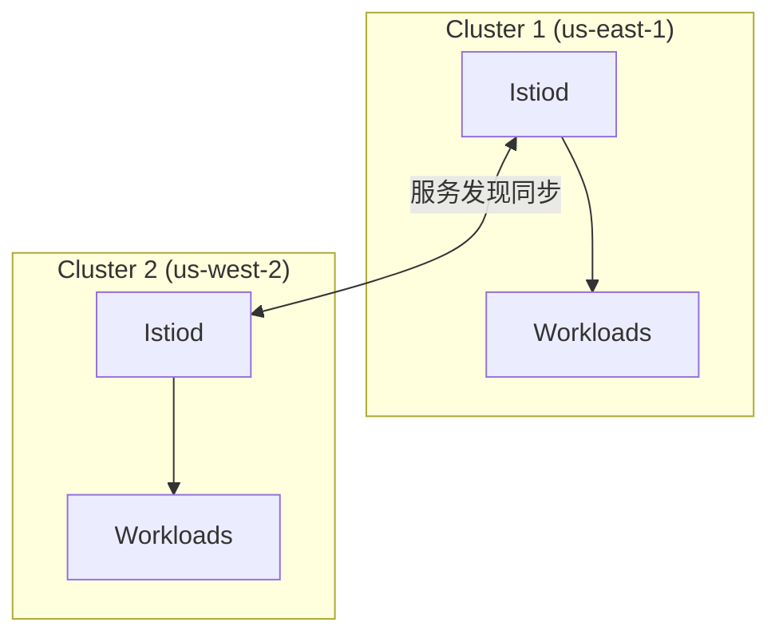
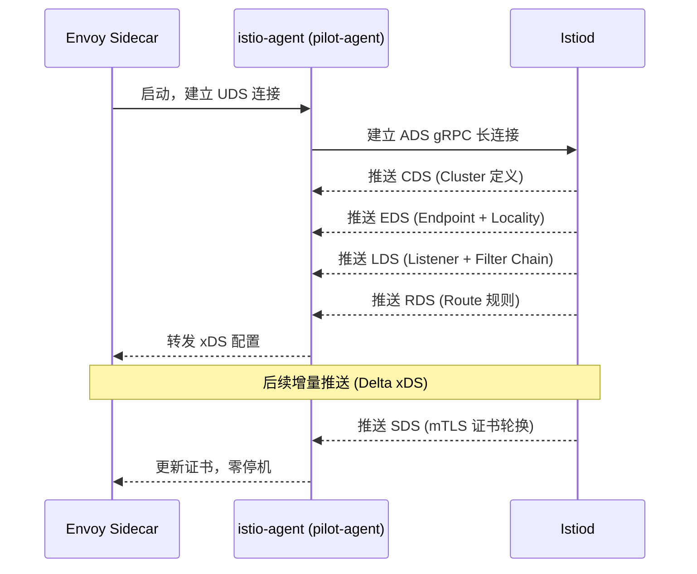
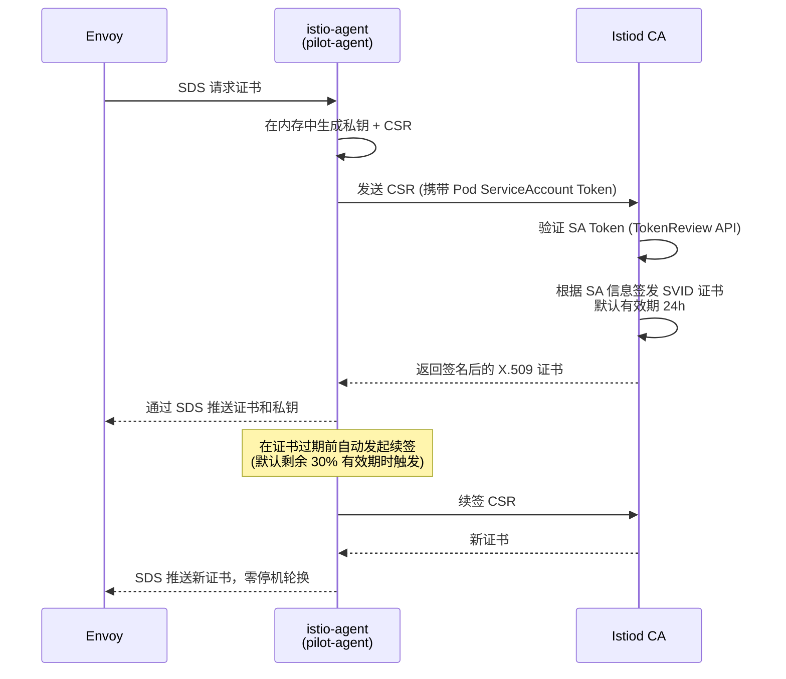
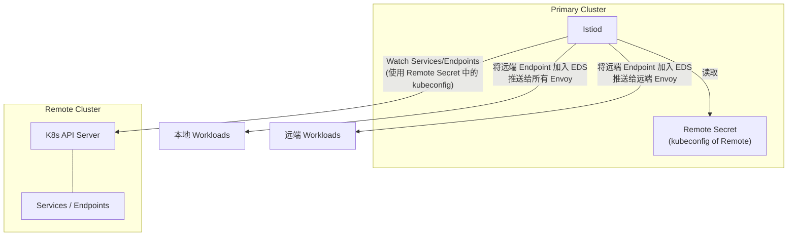
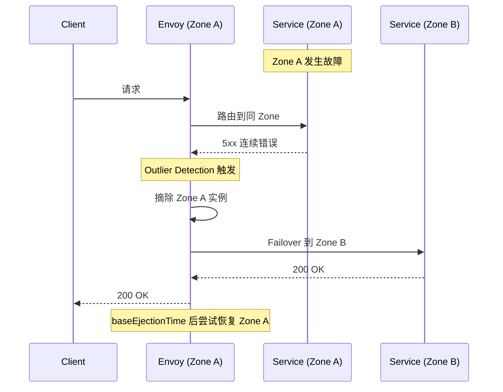

+++
title = "18.Istio多区域部署与存储复制"
description = "Istio 多区域部署架构、Locality-Based Routing、跨区域故障转移、存储复制策略与面试级深度解析"
date = 2025-01-16
[taxonomies]
tags = ["kubernetes", "istio", "service-mesh", "multi-zone", "storage", "devops"]
[extra]
toc = true
+++

# Istio 多区域部署与存储复制

---

## 一、Istio 多区域部署概述

### 1.1 为什么需要多区域部署

在生产环境中，服务通常分布在多个可用区（AZ）甚至多个区域（Region），原因包括：

- **高可用性**：单个 AZ 故障时，流量自动切换到健康的 AZ
- **低延迟**：将服务实例就近部署，用户请求到最近的 AZ
- **合规要求**：某些数据必须留在特定区域（如 GDPR）
- **容灾能力**：Region 级别的灾难恢复

### 1.2 Istio 的区域感知能力

Istio 通过读取 Kubernetes 节点上的标准拓扑标签来感知区域信息：

| 标签 | 含义 | 示例 |
|------|------|------|
| `topology.kubernetes.io/region` | 区域 | `us-east-1` |
| `topology.kubernetes.io/zone` | 可用区 | `us-east-1a` |
| `topology.istio.io/subzone` | 子区域（Istio 扩展） | `rack-1` |

Envoy Sidecar 启动时会从节点标签获取自身的位置信息，后续路由决策基于此信息。

### 1.3 部署拓扑模型



---

## 二、Locality-Based Routing（基于区域的路由）

### 2.1 工作原理

Locality-Based Routing 是 Istio 的核心流量管理能力，让服务间调用**优先选择同区域的实例**，只有当本地实例不健康或不可用时才溢出到其他区域。

**路由优先级**（默认行为）：
1. **同 Zone**：最高优先级，延迟最低
2. **同 Region 不同 Zone**：次优先级
3. **跨 Region**：最低优先级，仅作为兜底

### 2.2 DestinationRule 配置

```yaml
apiVersion: networking.istio.io/v1
kind: DestinationRule
metadata:
  name: my-service-dr
spec:
  host: my-service.default.svc.cluster.local
  trafficPolicy:
    connectionPool:
      tcp:
        maxConnections: 100
      http:
        h2UpgradePolicy: DEFAULT
        http1MaxPendingRequests: 100
        http2MaxRequests: 1000
    outlierDetection:
      # 异常检测：触发 failover 的条件
      consecutive5xxErrors: 5        # 连续 5 个 5xx 就摘除
      interval: 10s                   # 检测间隔
      baseEjectionTime: 30s          # 摘除最短时间
      maxEjectionPercent: 50         # 最多摘除 50% 实例
    loadBalancer:
      localityLbSetting:
        enabled: true
        # 显式分配流量比例
        distribute:
          - from: "us-east-1/us-east-1a/*"
            to:
              "us-east-1/us-east-1a/*": 80    # 80% 同 Zone
              "us-east-1/us-east-1b/*": 15    # 15% 同 Region
              "us-west-2/us-west-2a/*": 5     # 5% 跨 Region
        # 或者使用 failover 模式（二选一）
        # failover:
        #   - from: us-east-1
        #     to: us-west-2
```

### 2.3 Failover 模式 vs Distribute 模式

| 模式 | 行为 | 适用场景 |
|------|------|---------|
| **Failover** | 本地不可用时，按配置顺序切到指定 Region | 主备架构；需要明确的灾备 Region |
| **Distribute** | 按百分比分配流量到不同区域 | 多活架构；需要精确控制流量比例 |

**Failover 配置示例**：

```yaml
loadBalancer:
  localityLbSetting:
    enabled: true
    failover:
      - from: us-east-1      # 当 us-east-1 的实例不够时
        to: us-west-2         # 溢出到 us-west-2
      - from: us-west-2
        to: us-east-1
```

### 2.4 Outlier Detection 与自动摘除

Locality routing 的**前提条件**是配置 `outlierDetection`。没有异常检测，Istio 不知道何时触发区域级 failover。



**异常检测关键参数**：

| 参数 | 说明 | 推荐值 |
|------|------|--------|
| `consecutive5xxErrors` | 连续错误次数触发摘除 | 3~5 |
| `interval` | 检测窗口 | 10s~30s |
| `baseEjectionTime` | 最短摘除时间（每次翻倍） | 30s |
| `maxEjectionPercent` | 最多摘除多少比例的实例 | 30~50% |
| `splitExternalLocalOriginErrors` | 区分本地/远程错误 | true |

### 2.5 Locality Routing 补充说明

1. **outlierDetection 是 Locality LB 的前提条件**：
   - Locality-based routing 需要 Envoy 知道哪些 endpoint 是"健康"的。`outlierDetection` 是检测不健康 endpoint 的机制。
   - 如果没有配置 outlierDetection，Envoy 不会弹出任何 endpoint → 所有 endpoint 始终被视为 healthy → Locality overflow 永远不会触发。
   - 因此，**必须同时配置 outlierDetection 才能让 failover/distribute 生效**。

2. **failover 与 distribute 的关系**：
   - 二者是**互斥**的。同一个 DestinationRule 中只能配置其中一个。
   - `failover`：简单的区域级故障转移，只指定 "from region A → to region B" 的优先级
   - `distribute`：精确的百分比控制，如 "us-east-1/zone-a 的流量 70% 留本区、20% 去 zone-b、10% 去 us-west-2"
   - 选择建议：简单的 DR 场景用 failover，需要精细流量分配用 distribute

3. **Locality 标签来源**：
   - Envoy sidecar 的 locality 信息来自 **EDS (Endpoint Discovery Service)** 响应中每个 endpoint 的 `locality` 字段
   - Istiod 根据 K8s 节点标签 `topology.kubernetes.io/region` 和 `topology.kubernetes.io/zone` 填充 EDS 的 locality 信息
   - 因此，**节点必须正确设置拓扑标签**，否则 Locality routing 不生效

---

## 三、多集群 Istio 部署模式

### 3.1 Single Control Plane（单控制面）



- **优点**：配置统一、管理简单
- **缺点**：控制面单点；跨 Region xDS 延迟高
- **适用**：同 Region 多 AZ

### 3.2 Multi Control Plane（多控制面）



- **优点**：每个集群独立控制面，高可用
- **缺点**：配置需要同步
- **适用**：跨 Region 部署

### 3.3 网络模型

| 模型 | 描述 | 要求 |
|------|------|------|
| **Flat Network** | 所有集群 Pod 网络互通 | VPN / VPC Peering |
| **Multi-Network** | 集群间网络隔离，通过 East-West Gateway 通信 | Istio Gateway |

**Multi-Network 架构**：

```yaml
# East-West Gateway 配置
apiVersion: install.istio.io/v1alpha1
kind: IstioOperator
spec:
  profile: empty
  components:
    ingressGateways:
      - name: istio-eastwestgateway
        label:
          istio: eastwestgateway
          topology.istio.io/network: network-1
        enabled: true
        k8s:
          env:
            - name: ISTIO_META_REQUESTED_NETWORK_VIEW
              value: network-1
          service:
            ports:
              - name: tls
                port: 15443
                targetPort: 15443
```

---

## Istio 控制面与 Envoy 数据面

### xDS 协议详解

Istiod（控制面）通过 **xDS（x Discovery Service）协议族** 将服务网格的配置下发给每个 Envoy Sidecar（数据面）。xDS 是 Envoy 的动态配置 API，定义了一组 gRPC/REST 接口，使 Envoy 能在运行时接收配置变更而无需重启。

| xDS API | Full Name | 功能说明 |
|---------|-----------|---------|
| **LDS** | Listener Discovery Service | 配置 Envoy 监听端口及 Filter Chain（每个 K8s Service 端口对应一个 Listener） |
| **RDS** | Route Discovery Service | 配置路由规则——Istio `VirtualService` 会被翻译为 RDS 配置 |
| **CDS** | Cluster Discovery Service | 配置上游集群——Istio `DestinationRule` 会被翻译为 CDS 配置 |
| **EDS** | Endpoint Discovery Service | 配置上游端点列表，包含每个端点的 **locality 信息**（region/zone/subzone），是 Locality Load Balancing 的基础 |
| **SDS** | Secret Discovery Service | 配置 TLS 证书与密钥——mTLS 证书轮换通过 SDS 实现，无需重启 Envoy |
| **ADS** | Aggregated Discovery Service | 将以上所有 xDS 聚合到**单条 gRPC 长连接**中顺序推送，保证配置原子更新 |

**ADS 的关键作用**：在没有 ADS 时，CDS/EDS/LDS/RDS 各自独立推送，可能出现 Envoy 已收到新的 Route（指向新 Cluster）但 Cluster 尚未下发的窗口，导致 503。ADS 保证推送顺序为 **CDS → EDS → LDS → RDS**，彻底消除配置不一致窗口。



> **Istio 资源到 xDS 的映射关系**：`VirtualService` → RDS、`DestinationRule` → CDS + EDS locality 权重、`Gateway` → LDS、`ServiceEntry` → CDS + EDS、`PeerAuthentication` → LDS filter chain（mTLS 模式）、`AuthorizationPolicy` → LDS RBAC filter。

### mTLS 全链路

Istio 的零信任安全模型基于 **mTLS（mutual TLS）**，网格内所有服务间通信默认加密且双向认证。

#### PeerAuthentication 策略

`PeerAuthentication` 控制工作负载接收流量时的 mTLS 模式：

| 模式 | 行为 | 适用场景 |
|------|------|---------|
| **STRICT** | 仅接受 mTLS 连接，拒绝明文 | 安全要求高的生产环境 |
| **PERMISSIVE** | 同时接受 mTLS 和明文（默认） | 网格迁移过渡期 |
| **DISABLE** | 关闭 mTLS | 调试、与外部非网格服务互通 |

```yaml
# 全网格强制 STRICT mTLS
apiVersion: security.istio.io/v1
kind: PeerAuthentication
metadata:
  name: default
  namespace: istio-system    # 根命名空间 = 全网格生效
spec:
  mtls:
    mode: STRICT
---
# 单个工作负载级别覆盖：特定端口 PERMISSIVE
apiVersion: security.istio.io/v1
kind: PeerAuthentication
metadata:
  name: my-service-pa
  namespace: production
spec:
  selector:
    matchLabels:
      app: my-service
  mtls:
    mode: STRICT
  portLevelMtls:
    8080:
      mode: PERMISSIVE    # 该端口兼容非网格客户端
```

#### 证书签发流程

Istio 的 mTLS 证书**自动签发与轮换**流程：



**关键要点**：
- **私钥不出 Pod**：私钥由 `istio-agent` 在 Pod 内生成，永远不会通过网络传输
- **SPIFFE 身份**：每个工作负载的证书包含 SPIFFE ID 作为 SAN（Subject Alternative Name），格式为：
  ```
  spiffe://<trust-domain>/ns/<namespace>/sa/<service-account>
  ```
  例如：`spiffe://cluster.local/ns/production/sa/payment-service`
- **Trust Domain**：默认为 `cluster.local`。**跨集群 mTLS 要求所有集群共享同一 Root CA**（Plug-in CA），否则证书互不信任
- **Plug-in CA 配置**：生产环境应将企业 Root CA 注入 Istiod，而非使用自签名 CA

```yaml
# 挂载外部 Root CA 到 Istiod（Plug-in CA）
# 创建 secret：cacerts，包含 ca-cert.pem / ca-key.pem / root-cert.pem / cert-chain.pem
kubectl create secret generic cacerts -n istio-system \
  --from-file=ca-cert.pem \
  --from-file=ca-key.pem \
  --from-file=root-cert.pem \
  --from-file=cert-chain.pem
```

### Envoy Locality Load Balancing 算法深入

Envoy 的 Locality-Aware Load Balancing 不是简单的"同 Zone 优先"，其底层算法涉及 **优先级（Priority）、健康度评估（Health Score）和溢出（Spillover）**。

#### Priority Level 分配

Envoy 将所有上游端点按 locality 划分为不同优先级（Priority Level）：

| Priority | 含义 | 示例（请求发自 us-east-1a） |
|----------|------|--------------------------|
| P0 | 同 Region + 同 Zone | `us-east-1/us-east-1a` |
| P1 | 同 Region + 不同 Zone | `us-east-1/us-east-1b` |
| P2 | 不同 Region | `us-west-2/us-west-2a` |

#### 健康度与溢出算法

Envoy 使用 **overprovisioning factor**（默认 140）来计算每个优先级的 normalized health score：

```
normalized_health = min(100, health_percentage × 100 / overprovisioning_factor)
```

**完整计算示例**：

假设 P0（同 Zone）有 10 个端点，其中 3 个被 Outlier Detection 摘除（7 个健康，健康率 70%）：

```
normalized_health(P0) = min(100, 70 × 100 / 140) = min(100, 50) = 50
```

P0 只能承载 50% 的流量，剩余 50% **溢出到 P1**。如果 P1 的 normalized health = 100（全部健康），则 P1 承接溢出的全部 50%。

| P0 健康率 | overprovisioning=140 时的 normalized health | 溢出到 P1 的流量比例 |
|-----------|---------------------------------------------|---------------------|
| 100% | 71% → min(100, 71)=71% | 29% |
| 90% | 64% | 36% |
| 70% | 50% | 50% |
| 50% | 36% | 64% |
| 30% | 21% | 79% |

> **overprovisioning factor 的含义**：默认值 140 意味着即使健康端点只有 72%（100/140=71.4%），Envoy 仍认为该优先级可以承担 100% 流量。这避免了小规模故障就触发跨 Zone 溢出。

#### Panic Threshold（恐慌阈值）

当某个优先级中健康端点比例低于 **panic threshold**（默认 50%）时，Envoy 进入 **Panic 模式**：忽略健康状态，将流量发往该优先级的**所有端点**（包括被摘除的不健康端点）。

这是一个保护机制——宁可发给可能不健康的端点，也不能因为大面积摘除导致无端点可用。

```yaml
# 调整 panic threshold（通过 EnvoyFilter）
apiVersion: networking.istio.io/v1alpha3
kind: EnvoyFilter
metadata:
  name: adjust-panic-threshold
spec:
  configPatches:
    - applyTo: CLUSTER
      match:
        cluster:
          service: my-service.default.svc.cluster.local
      patch:
        operation: MERGE
        value:
          common_lb_config:
            healthy_panic_threshold:
              value: 30    # 降低到 30%
```

#### Circuit Breaker vs Outlier Detection

这两者经常混淆，但作用层面完全不同：

| 维度 | Circuit Breaker（熔断器） | Outlier Detection（异常检测） |
|------|--------------------------|------------------------------|
| 配置位置 | `connectionPool` | `outlierDetection` |
| 作用对象 | **调用方** Envoy | **被调用方**端点 |
| 触发条件 | 并发连接/请求数超限 | 端点连续返回错误 |
| 行为 | 快速失败（返回 503），阻止过载 | 摘除不健康端点，流量转移到其他端点 |
| 类比 | 电路保险丝——防止过载烧毁 | 医院分诊——把"生病"的端点隔离 |

```yaml
# 同时配置 Circuit Breaker + Outlier Detection 的完整示例
trafficPolicy:
  connectionPool:
    tcp:
      maxConnections: 100          # TCP 最大连接数
    http:
      http1MaxPendingRequests: 50  # HTTP/1.1 最大排队请求
      http2MaxRequests: 200        # HTTP/2 最大并发请求
      maxRequestsPerConnection: 10 # 单连接最大请求数
  outlierDetection:
    consecutive5xxErrors: 5
    interval: 10s
    baseEjectionTime: 30s
    maxEjectionPercent: 40
```

### 多集群服务发现

在多集群 Istio 部署中，Istiod 需要发现**远端集群**的 Service 和 Endpoint 信息。这通过 **Remote Secret** 机制实现。

#### Remote Secret 工作原理



**操作步骤**：

```bash
# 在 Remote Cluster 上生成 Remote Secret
istioctl create-remote-secret \
  --name=remote-cluster \
  --server=https://remote-api-server:6443 \
  > remote-secret.yaml

# 将 Remote Secret 部署到 Primary Cluster
kubectl apply -f remote-secret.yaml -n istio-system
```

Istiod 检测到 `istio/multiCluster=true` 标签的 Secret 后，使用其中的 kubeconfig 连接到远端 K8s API Server，**Watch** 远端集群的 Service/Endpoint 资源。远端端点被加入 EDS 并带上对应的 **locality 信息**（来自远端节点的 topology 标签），从而参与 Locality Load Balancing。

#### Trust Domain Federation

跨集群 mTLS 要求两个集群的 Envoy 能**相互验证对方证书**。实现方式：

1. **共享 Root CA（推荐）**：所有集群使用同一个 Plug-in CA（`cacerts` secret），签发的证书天然互信
2. **Trust Domain Federation**：不同集群使用不同 Root CA，通过交换 trust bundle 实现互信（需要 Istio 1.18+ 的 `ENABLE_EXTERNAL_CA` 特性）

```yaml
# meshConfig 中配置 trust domain 和 trust domain aliases
apiVersion: install.istio.io/v1alpha1
kind: IstioOperator
spec:
  meshConfig:
    trustDomain: cluster-1.example.com
    trustDomainAliases:
      - cluster-2.example.com    # 信任来自 cluster-2 的证书
```

### 调试方法

当 Locality Load Balancing 或跨集群服务发现出现问题时，以下命令是排查利器：

```bash
# 1. 查看某个 Pod 的 Envoy 看到的端点及其 locality 和优先级
istioctl proxy-config endpoints <pod-name> \
  --cluster "outbound|80||my-service.default.svc.cluster.local" \
  -o json | jq '.[] | {address: .hostStatuses[].address.socketAddress, 
                        locality: .hostStatuses[].locality, 
                        priority: .hostStatuses[].priority}'

# 2. 查看 Cluster 配置（验证 outlierDetection / circuitBreaker 是否生效）
istioctl proxy-config cluster <pod-name> \
  -o json | jq '.[] | select(.name | contains("my-service"))'

# 3. 查看 Listener 和 Route 配置
istioctl proxy-config listener <pod-name> --port 80
istioctl proxy-config route <pod-name> --name 80

# 4. 配置校验：检测潜在的配置冲突和错误
istioctl analyze -n production

# 5. 查看 xDS 同步状态：确认 Envoy 是否已接收最新配置
istioctl proxy-status

# 输出示例：
# NAME            CDS    LDS    EDS    RDS    ECDS   ISTIOD
# pod-a.default   SYNCED SYNCED SYNCED SYNCED        istiod-xxx
# pod-b.default   STALE  SYNCED SYNCED SYNCED        istiod-xxx  ← CDS 未同步，需排查
```

> **排查思路**：`proxy-status` 看同步状态 → `proxy-config endpoints` 看端点 locality → `proxy-config cluster` 看 outlier/circuit breaker 配置 → `analyze` 看配置冲突 → Envoy access log 看实际路由决策。

---

## 四、存储复制（Storage Replication）

### 4.1 为什么需要存储复制

多区域部署中，有状态服务面临的核心挑战：
- **数据一致性**：跨 AZ 的 Pod 如何共享存储？
- **故障转移**：主 AZ 故障后，备 AZ 的 Pod 如何访问数据？
- **延迟**：跨 Region 的存储同步延迟如何控制？

### 4.2 存储复制策略

| 策略 | 机制 | RPO | 延迟影响 | 适用场景 |
|------|------|-----|---------|---------|
| **同步复制** | 写操作同时写入多个副本，全部确认后返回 | 0 | 高（受跨 AZ RTT 影响） | 金融、强一致性场景 |
| **异步复制** | 写操作先写本地，后台异步复制 | 秒~分钟 | 低 | 大多数 Web 应用 |
| **半同步** | 至少一个远程副本确认即返回 | 接近 0 | 中等 | 平衡一致性和性能 |

### 4.3 Kubernetes 存储复制方案

#### CSI 级别复制

```yaml
# Rook-Ceph 跨 Zone 复制
apiVersion: ceph.rook.io/v1
kind: CephBlockPool
metadata:
  name: replicated-pool
  namespace: rook-ceph
spec:
  replicated:
    size: 3                      # 3 副本
    requireSafeReplicaSize: true
  failureDomain: zone            # 副本分布在不同 Zone
---
apiVersion: storage.k8s.io/v1
kind: StorageClass
metadata:
  name: rook-ceph-block-replicated
provisioner: rook-ceph.rbd.csi.ceph.com
parameters:
  pool: replicated-pool
  clusterID: rook-ceph
reclaimPolicy: Retain
volumeBindingMode: WaitForFirstConsumer
```

#### 应用层复制

| 方案 | 技术 | 特点 |
|------|------|------|
| **数据库主从** | MySQL Group Replication / PostgreSQL Streaming | 数据库自带复制；成熟可靠 |
| **分布式存储** | Ceph / Longhorn / OpenEBS | CSI 集成；对应用透明 |
| **对象存储** | MinIO Multi-Site / S3 CRR | 适合非结构化数据 |
| **消息队列** | Kafka MirrorMaker / Pulsar Geo-Replication | 事件驱动架构 |

### 4.4 StatefulSet 跨区域部署

```yaml
apiVersion: apps/v1
kind: StatefulSet
metadata:
  name: mysql
spec:
  replicas: 3
  selector:
    matchLabels:
      app: mysql
  template:
    metadata:
      labels:
        app: mysql
    spec:
      # 确保 Pod 分布在不同 Zone
      topologySpreadConstraints:
        - maxSkew: 1
          topologyKey: topology.kubernetes.io/zone
          whenUnsatisfiable: DoNotSchedule
          labelSelector:
            matchLabels:
              app: mysql
      affinity:
        podAntiAffinity:
          requiredDuringSchedulingIgnoredDuringExecution:
            - labelSelector:
                matchExpressions:
                  - key: app
                    operator: In
                    values: ["mysql"]
              topologyKey: kubernetes.io/hostname
  volumeClaimTemplates:
    - metadata:
        name: data
      spec:
        accessModes: ["ReadWriteOnce"]
        storageClassName: rook-ceph-block-replicated
        resources:
          requests:
            storage: 100Gi
```

> **注意**：Rook-Ceph CephBlockPool 中的 `failureDomain: zone` 需要 Ceph 的 CRUSH Map 中正确配置 zone bucket。这与 K8s 的 `topology.kubernetes.io/zone` 标签是两个独立系统——Rook operator 会自动将 K8s 节点拓扑标签映射到 CRUSH Map 的 host/zone/region 层级，但需要确认 Rook 版本支持此自动映射（v1.8+）。

---

## 五、故障转移与灾难恢复

### 5.1 故障场景与应对

| 故障级别 | 影响范围 | Istio 行为 | 存储行为 |
|---------|---------|-----------|---------|
| **Pod 故障** | 单个实例 | Outlier Detection 自动摘除 | 无影响（其他副本仍在） |
| **Node 故障** | 单节点 | 同上 + K8s 重调度 | PV 需要 detach/attach |
| **Zone 故障** | 整个 AZ | Locality Failover 到其他 Zone | 存储需要跨 Zone 副本 |
| **Region 故障** | 整个区域 | Failover 到其他 Region | 需要跨 Region 复制 |

### 5.2 RTO 和 RPO 设计

| 指标 | 含义 | 设计考量 |
|------|------|---------|
| **RTO** (Recovery Time Objective) | 服务恢复时间 | Istio failover 秒级；存储切换分钟级 |
| **RPO** (Recovery Point Objective) | 可容忍的数据丢失 | 同步复制 = 0；异步取决于复制延迟 |

### 5.3 实际故障转移流程



---

## 六、生产最佳实践

### 6.1 流量管理

- **渐进式 failover**：先配置 `distribute` 将少量流量打到备 Zone，验证链路健康
- **金丝雀验证**：跨 Region failover 前，先用金丝雀流量验证目标 Region 的服务健康
- **超时与重试**：跨 Region 调用 RTT 更高，适当调大超时

```yaml
apiVersion: networking.istio.io/v1
kind: VirtualService
metadata:
  name: my-service-vs
spec:
  hosts:
    - my-service
  http:
    - timeout: 5s
      retries:
        attempts: 3
        perTryTimeout: 2s
        retryOn: "5xx,reset,connect-failure"
      route:
        - destination:
            host: my-service
```

### 6.2 监控与告警

关键指标：

| 指标 | 说明 | 告警阈值参考 |
|------|------|------------|
| `istio_requests_total{response_code="5xx"}` | 跨区域 5xx 错误率 | > 1% |
| `envoy_cluster_upstream_cx_connect_fail` | 上游连接失败 | 突增 |
| `envoy_cluster_outlier_detection_ejections_active` | 当前被摘除的实例数 | > 30% |
| `istio_request_duration_milliseconds` | 请求延迟分布 | P99 突增 |

### 6.3 存储复制

- **跨 AZ 副本**：生产环境至少 3 副本，分布在不同 AZ
- **定期验证**：定期演练 AZ 级故障切换，验证数据一致性
- **备份策略**：复制不替代备份，需要独立的备份机制

### 6.4 常见陷阱

| 陷阱 | 后果 | 解决方案 |
|------|------|---------|
| 未配置 outlierDetection | Locality routing 不生效 | 必须配置异常检测 |
| maxEjectionPercent 太高 | 大量实例被摘除导致雪崩 | 设为 30~50% |
| 跨 Region 同步复制 | 写延迟暴增 | 评估是否可用异步复制 |
| Zone 标签未设置 | Istio 无法感知拓扑 | 确保节点有正确的 topology 标签 |
| 只测了正常流量 | 故障时行为未验证 | 定期做 Chaos Engineering |

---

## 七、面试高频问答

**Q1：Istio 如何实现区域级故障转移？**

A：通过 DestinationRule 的 `localityLbSetting` 配合 `outlierDetection`。Envoy 读取节点的 topology 标签感知自身位置，优先路由到同 Zone。当异常检测发现同 Zone 实例连续错误达到阈值时，自动将实例摘除，流量溢出到 failover 配置中的下一级区域。

**Q2：`distribute` 和 `failover` 有什么区别？怎么选？**

A：`distribute` 按比例将流量分配到多个区域，适合多活架构。`failover` 正常情况下流量不出本区域，只在本地不可用时才切换，适合主备架构。如果需要跨 Region 灾备，用 `failover`；如果需要多 Region 同时服务，用 `distribute`。

**Q3：多集群 Istio 网络不通怎么办？**

A：使用 Multi-Network 模式，部署 East-West Gateway。集群间流量通过 Gateway 的 15443 端口建立 mTLS 隧道，不要求 Pod 网络直通。配置时需要为每个集群设置 `ISTIO_META_REQUESTED_NETWORK_VIEW`。

**Q4：StatefulSet 跨 Zone 部署的存储怎么处理？**

A：方案一：使用支持跨 Zone 复制的分布式存储（如 Ceph），设置 `failureDomain: zone`，数据自动跨 Zone 复制。方案二：使用数据库自身的主从复制（如 MySQL Group Replication），配合 `topologySpreadConstraints` 确保 Pod 分散在不同 Zone。关键是 PV 的 `volumeBindingMode: WaitForFirstConsumer`，避免 PV 绑定到错误的 Zone。

**Q5：请详细描述 Istiod 通过 xDS 协议向 Envoy 推送配置的机制。为什么需要 ADS？**

A：Istiod 将网格配置（VirtualService、DestinationRule 等 CRD）翻译成 Envoy 原生的 xDS 配置，通过 gRPC 长连接推送给每个 Envoy Sidecar。xDS 包括 LDS（Listener）、RDS（Route）、CDS（Cluster）、EDS（Endpoint）和 SDS（Secret/证书）五大核心 API。

关键问题在于推送顺序：如果 RDS 先于 CDS 到达，Envoy 收到指向新 Cluster 的路由规则，但该 Cluster 尚未创建，请求会被 503 拒绝。**ADS（Aggregated Discovery Service）** 将所有 xDS 聚合到单条 gRPC 流中，严格按 **CDS → EDS → LDS → RDS** 顺序推送，保证配置原子生效，消除中间不一致状态。

实际排查时，`istioctl proxy-status` 可以查看每个 Envoy 的 xDS 同步状态（SYNCED/STALE/NOT SENT），快速定位配置推送问题。`istioctl proxy-config` 系列命令可以 dump 出 Envoy 实际生效的 LDS/RDS/CDS/EDS 配置，与预期进行对比。

**Q6：Istio 中 mTLS 证书的签发和轮换流程是怎样的？跨集群如何建立信任？**

A：证书签发流程分四步：(1) Envoy 启动时通过 SDS API 向同 Pod 的 `istio-agent` 请求证书；(2) `istio-agent` 在本地生成私钥和 CSR（**私钥永不出 Pod**）；(3) `istio-agent` 携带 Pod 的 ServiceAccount Token 将 CSR 发送给 Istiod 内置 CA；(4) Istiod 通过 K8s TokenReview API 验证 SA Token 合法性后，签发包含 SPIFFE ID（`spiffe://cluster.local/ns/<ns>/sa/<sa>`）的 X.509 证书，默认有效期 24 小时。

**自动轮换**：`istio-agent` 在证书剩余约 30% 有效期时自动发起续签，通过 SDS 推送新证书给 Envoy，实现零停机轮换。

**跨集群信任**：默认每个集群的 Istiod 自签名 Root CA 不同，证书互不信任。解决方案是使用 **Plug-in CA**：将企业 Root CA 的证书和私钥以 `cacerts` Secret 的形式注入所有集群的 `istio-system` 命名空间，使所有集群共享同一 Root CA。这样不同集群签发的 SVID 证书可以互相验证，跨集群 mTLS 自然打通。Trust Domain 默认是 `cluster.local`，也可自定义为 `cluster-1.example.com`，并通过 `trustDomainAliases` 配置互信。

---

## 相关文章

- [上一篇：Kubernetes污点Taints详解与最佳实践](/articles/cloud-native/k8s-17-污点Taints详解/)
- [下一篇：K8S域名访问问题排查](/articles/cloud-native/k8s-19-域名访问问题排查/)
