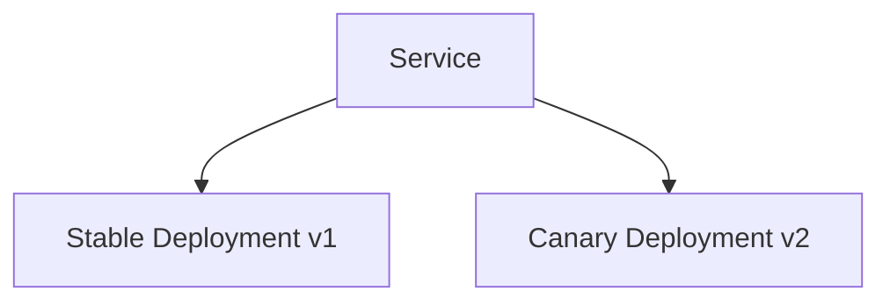

+++
title = "Helm Chart 面试题简答（前20题）"
slug = "helm-HelmChart面试题汇总"
+++

# Helm Chart 面试题简答（前20题）
## 一、基础概念
1. **什么是 Helm？它在 Kubernetes 中的作用是什么？**  
Helm 是 Kubernetes 的包管理工具，用于简化应用的打包、部署和管理，提供版本控制、依赖管理和配置模板化功能。
2. **解释 Helm Chart 的基本结构和组成部分**  
Chart 由 Chart.yaml（元数据）、values.yaml（配置）、templates/（k8s资源模板）、charts/（子chart）和 _helpers.tpl（辅助模板）组成。
3. **Helm 2 和 Helm 3 的主要区别有哪些？**  
Helm 3 移除了 Tiller，改用客户端直接与 k8s API 交互；采用 Secrets 存储 release 信息；支持 JSON Schema 验证等。
4. **Tiller 是什么？为什么 Helm 3 移除了它？**  
Tiller 是 Helm 2 的服务端组件，负责集群内操作。因安全问题（需要集群管理员权限）和复杂性被移除。
5. **Helm 的 Release 是什么概念？**  
Release 是 Chart 的特定部署实例，包含唯一名称、版本号和配置值。

## 二、Chart 开发
6. **Chart.yaml 文件中必须包含哪些字段？**  
必须字段：apiVersion、name、version、description（可选但推荐）、type（application/library）
7. **如何定义 Chart 的依赖关系？requirements.yaml 和 Chart.yaml 中的 dependencies 有什么区别？**  
Helm 3 开始统一使用 Chart.yaml 的 dependencies 字段，requirements.yaml 是 Helm 2 的遗留方式。
8. **解释 values.yaml 文件的作用和使用场景**  
values.yaml 提供默认配置值，允许用户在不修改模板的情况下定制部署，支持通过 --set 或 -f 覆盖。
9. **Helm 模板语言中 **`{{ .Values }}`** 和 **`{{ .Release }}`** 的区别**  
.Values 访问用户提供的配置值，.Release 访问 release 元信息（如名称、命名空间等）。
10. **如何在模板中使用条件判断（if/else）？**  
使用 {{ if condition }}...{{ else }}...{{ end }} 结构，condition 可以是布尔表达式或值存在性检查。
11. **Helm 模板中的 **`range`** 指令如何使用？**  
{{ range .Values.items }}...{{ . }}...{{ end }} 遍历列表/字典，. 表示当前迭代项。
12. **如何创建和使用命名模板（named templates）？**  
在 _helpers.tpl 中 {{ define "mychart.label" }}...{{ end }} 定义，通过 {{ include "mychart.label" . }} 调用。
13. `_helpers.tpl`** 文件的作用是什么？**  
存放可复用的命名模板和辅助函数，保持主模板简洁。
14. **如何实现跨 Chart 的模板共享？**  
将共享模板放入 Library Chart（type: library），其他 Chart 通过 dependencies 引用。
15. **Helm 模板中 **`include`** 和 **`template`** 的区别**  
template 是基础指令，include 允许管道处理输出，如 {{ include "name" . | indent 4 }}。

## 三、模板函数与管道
16. **列举 5 个常用的 Helm 模板函数**  
toYaml、default、required、tpl、nindent
17. **如何将字符串转换为 YAML/JSON？**  
{{ .Values.data | toYaml }} 或 {{ .Values.data | toJson }}
18. `toYaml`** 和 **`fromYaml`** 函数的使用场景**  
toYaml 将对象转为 YAML 字符串，fromYaml 解析 YAML 字符串为对象。
19. **如何合并两个字典？**`merge`** 和 **`deepCopy`** 的区别**  
{{ merge $ dict1  $dict2 }} 浅合并，deepCopy 创建深度拷贝避免修改原数据。
20. `required`** 函数的作用是什么？如何使用？**  
强制要求值必须存在：{{ required "value is required" .Values.key }}

## 四、部署与发布
26. `helm install`** 和 **`helm upgrade`** 的区别**
+ `install`：首次部署新Release
+ `upgrade`：更新已存在的Release（版本或配置变更）
27. `--set`** 和 **`--values`** 参数的区别和使用场景**
+ `--set`：命令行直接设置单个值（适合简单覆盖）
+ `--values`/-f：通过YAML文件批量设置值（适合复杂配置）
28. **如何实现 Helm 的原子升级（atomic upgrade）？**  
使用`--atomic`参数，升级失败自动回滚：

```bash
helm upgrade --atomic --install ...
```

29. `helm rollback`** 的工作原理是什么？**  
回退到历史版本，实质是使用历史版本的配置重新部署。
30. **如何查看 Helm Release 的历史版本？**

```bash
helm history RELEASE_NAME
```

31. **Helm 的 Hook 机制是什么？有哪些类型？**  
Hook是在Release生命周期特定点执行的资源，类型包括：
+ pre/post-install/upgrade/rollback/delete
+ test
32. **如何实现安装前的资源检查？**  
创建`pre-install` Hook的Job/Pod进行预检。
33. `helm test`** 的作用是什么？如何编写测试？**  
运行Chart中定义的测试（标记`helm.sh/hook: test`的资源），验证部署是否成功。
34. **如何管理 Helm Release 的命名空间？**
+ 安装时指定`-n/--namespace`
+ 模板中使用`{{ .Release.Namespace }}`
35. `helm get`** 子命令有哪些用途？**
+ `get values`：查看生效的values
+ `get manifest`：查看渲染的资源
+ `get hooks`：查看Hook资源
+ `get notes`：查看Release说明

## 五、依赖管理
36. **如何添加外部 Chart 依赖？**  
在Chart.yaml的dependencies中声明：

```yaml
dependencies:
  - name: mysql
    repository: https://charts.bitnami.com/bitnami
    version: 9.x.x
```

37. `helm dependency`** 相关命令有哪些？**
+ `update`：下载/更新依赖
+ `build`：根据lock文件重建依赖
+ `list`：显示当前依赖
38. **Chart 依赖的版本约束语法是怎样的？**  
支持语义化版本约束：
+ `1.2.3`：精确版本
+ `^1.2.3`：兼容版本（允许次版本更新）
+ `~1.2.3`：补丁版本更新
39. **如何覆盖子 Chart 的 Values？**  
在父Chart的values.yaml中使用子Chart名作为键：

```yaml
mysql:
  auth:
    rootPassword: "parent-password"
```

40. `helm repo`** 相关命令有哪些？**
+ `add`：添加仓库
+ `update`：更新仓库索引
+ `list`：列出已配置仓库
+ `remove`：删除仓库

## 六、安全与权限
41. **Helm 3 如何管理权限？**  
直接使用kubeconfig中的用户权限，不再需要Tiller。
42. **如何为 Helm Chart 添加签名验证？**
43. 使用`helm package --sign`生成签名
44. 配置`helm verify`验证.prov文件
45. **Helm 的 Secret 管理方案有哪些？**
+ 模板中生成Secret资源
+ 配合外部Secret管理工具（Vault/SealedSecret等）
+ 通过Hook动态注入
44. **如何安全地传递敏感数据到 Chart？**
+ 使用`--set-file`传递加密文件
+ 通过环境变量注入
+ 集成Secret管理服务
45. **Helm 与 Kubernetes RBAC 的集成**  
通过ServiceAccount关联RBAC角色，在helm install时指定：

```bash
helm install --service-account my-sa ...
```

## 七、高级主题
46. **如何实现 Helm Chart 的多环境部署（dev/staging/prod）？**  
方案：
+ 不同values文件（values-dev.yaml等）
+ 条件模板判断`{{ if eq .Values.env "prod" }}`
+ 子Chart复用
47. **Helm Library Chart 是什么？如何使用？**  
定义`type: library`的Chart，包含可复用模板，被其他Chart通过dependencies引用。
48. **如何调试 Helm 模板问题？**  
工具：
+ `helm template --debug`：渲染模板不部署
+ `helm lint`：语法检查
+ `--dry-run`：模拟执行
49. **Helm Chart 的最佳打包实践有哪些？**
+ 版本号符合semver规范
+ 包含README和values.schema.json
+ 签名Chart包
+ 最小化模板复杂度
50. **如何实现 Helm Chart 的自动化测试和 CI/CD 集成？**

## 一、Helm Chart 测试策略
### 1. 静态测试 (Linting)
```bash
# 使用 helm lint 检查 Chart 语法
helm lint ./my-chart

# 使用 kubeval 验证模板生成的 YAML
helm template ./my-chart | kubeval --strict
```

### 2. 单元测试
```bash
# 使用 helm-unittest 插件进行模板测试
helm plugin install https://github.com/quintush/helm-unittest

# 编写测试文件 (示例 tests/deployment_test.yaml)
suite: test deployment
templates:
  - deployment.yaml
tests:
  - it: should set replica count
    set:
      replicaCount: 2
    asserts:
      - equal:
          path: spec.replicas
          value: 2
```

### 3. 集成测试
```bash
# 使用 kind (Kubernetes in Docker) 创建测试集群
kind create cluster --name helm-test

# 安装 Chart 到测试集群
helm install my-release ./my-chart --namespace test --create-namespace

# 运行测试容器验证功能
kubectl run test-pod --image=alpine --restart=Never --rm -it -- \
  sh -c "curl -sS http://my-service | grep 'Expected Content'"
```

## 二、CI/CD 流水线设计
### 1. GitHub Actions 示例
```yaml
name: Helm CI/CD

on:
  push:
    branches: [ main ]
  pull_request:

jobs:
  lint-test:
    runs-on: ubuntu-latest
    steps:
    - uses: actions/checkout@v2
    
    - name: Set up Helm
      uses: azure/setup-helm@v1
      
    - name: Install kubeval
      run: |
        wget https://github.com/instrumenta/kubeval/releases/latest/download/kubeval-linux-amd64.tar.gz
        tar xf kubeval-linux-amd64.tar.gz
        sudo mv kubeval /usr/local/bin
        
    - name: Lint Chart
      run: helm lint ./my-chart
      
    - name: Validate Templates
      run: helm template ./my-chart | kubeval --strict
      
    - name: Run Unit Tests
      run: |
        helm plugin install https://github.com/quintush/helm-unittest
        helm unittest ./my-chart

  deploy:
    needs: lint-test
    runs-on: ubuntu-latest
    if: github.ref == 'refs/heads/main'
    steps:
    - uses: actions/checkout@v2
    
    - name: Set up Helm
      uses: azure/setup-helm@v1
      with:
        version: v3.7.1
        
    - name: Install kubectl
      uses: azure/setup-kubectl@v1
      
    - name: Configure Kubernetes
      run: |
        echo "${{ secrets.KUBE_CONFIG }}" > kubeconfig.yaml
        export KUBECONFIG=kubeconfig.yaml
        
    - name: Deploy to Staging
      run: |
        helm upgrade --install my-app ./my-chart \
          --namespace staging \
          --values ./my-chart/values.staging.yaml \
          --atomic --timeout 5m
```

### 2. GitLab CI/CD 示例
```yaml
stages:
  - test
  - deploy

helm-lint:
  stage: test
  image: alpine/helm:3.7.1
  script:
    - helm lint ./my-chart

kubeval-check:
  stage: test
  image: instrumenta/kubeval:latest
  script:
    - helm template ./my-chart | kubeval --strict

helm-unittest:
  stage: test
  image: quay.io/helmpack/chart-testing:v3.7.1
  script:
    - helm plugin install https://github.com/quintush/helm-unittest
    - helm unittest ./my-chart

deploy-production:
  stage: deploy
  image: alpine/helm:3.7.1
  only:
    - master
  script:
    - helm upgrade --install my-app ./my-chart \
        --namespace production \
        --values ./my-chart/values.production.yaml \
        --atomic --timeout 5m
```

## 三、高级测试技术
### 1. Chart 版本管理
```bash
# 使用 semver2 规范版本号
version: 1.2.3
appVersion: v2.1.0

# 在 CI 中自动递增版本
NEW_VERSION=$(semver bump patch $(helm show chart my-chart | grep '^version' | cut -d' ' -f2))
sed -i "s/^version: .*/version: $NEW_VERSION/" my-chart/Chart.yaml
```

### 2. 使用 Chart Testing 工具 (ct)
```yaml
# .github/workflows/chart-test.yaml
name: Chart Testing

on: pull_request

jobs:
  test:
    runs-on: ubuntu-latest
    steps:
      - uses: actions/checkout@v2
      - uses: helm/chart-testing-action@v2.0.1
        with:
          command: lint-and-install
          config: .github/ct.yaml
```

### 3. 安全扫描
```bash
# 使用 checkov 扫描 Helm 模板
helm template my-chart | checkov --framework helm -f -

# 使用 Aqua Security kube-hunter 进行渗透测试
kube-hunter --remote --report yaml > security-report.yaml
```

## 四、多环境部署策略
### 1. 使用 Values 文件管理环境差异
```plain
my-chart/
├── values.yaml       # 基础配置
├── values.dev.yaml   # 开发环境覆盖
├── values.staging.yaml # 预发环境覆盖
└── values.prod.yaml  # 生产环境覆盖
```

### 2. 渐进式发布 (Canary)
```bash
# 部署 Canary 版本
helm install my-app-canary ./my-chart \
  --namespace production \
  --values values.canary.yaml \
  --set replicaCount=1

# 验证 metrics 后全量发布
helm upgrade my-app ./my-chart \
  --namespace production \
  --values values.prod.yaml
```

### 3. Blue/Green 部署
```bash
# 部署 Green 版本
helm install my-app-green ./my-chart \
  --namespace production \
  --values values.prod.yaml \
  --set service.color=green

# 切换流量
kubectl patch svc my-app -p '{"spec":{"selector":{"color":"green"}}}'

# 删除 Blue 版本
helm uninstall my-app-blue
```

## 五、最佳实践
1. **版本控制**：
    - 每个 Chart 修改都应有独立的版本号
    - 使用 `helm package` 和 `helm push` 管理版本
2. **依赖管理**：

```bash
# 明确声明依赖版本
dependencies:
  - name: postgresql
    version: 10.16.2
    repository: https://charts.bitnami.com/bitnami
```

3. **测试覆盖率**：
    - 关键模板应有对应的单元测试
    - 核心功能应有集成测试验证
4. **安全实践**：

```yaml
# 设置安全上下文
securityContext:
  runAsNonRoot: true
  readOnlyRootFilesystem: true
```

5. **监控集成**：

```yaml
# 添加 Prometheus 注解
prometheus.io/scrape: "true"
prometheus.io/port: "8080"
```

通过以上方法，您可以构建完整的 Helm Chart 自动化测试和 CI/CD 流程，确保部署的可靠性和一致性。


## 八、实战场景题
51. **如何设计一个支持高可用部署的 Helm Chart？**


## **一、核心架构设计原则**
### **1. 高可用关键要素**
+ **多副本部署****：确保工作负载分布在多个节点**
+ **反亲和性调度****：避免单点故障**
+ **健康检查****：完善的存活/就绪探针**
+ **优雅终止****：正确处理终止信号**
+ **跨可用区部署****：利用 topologySpreadConstraints**

## **二、具体实现方案**
### **1. 多副本与自动伸缩配置**
**values.yaml 示例****：**

```yaml
replicaCount: 3
autoscaling:
  enabled: true
  minReplicas: 3
  maxReplicas: 10
  targetCPUUtilizationPercentage: 80
```

**模板实现****：**

```yaml
apiVersion: apps/v1
kind: Deployment
spec:
  replicas: {{ .Values.replicaCount }}
  strategy:
    rollingUpdate:
      maxSurge: 1
      maxUnavailable: 0
```

### **2. 反亲和性调度策略**
**模板片段****：**

```yaml
affinity:
  podAntiAffinity:
    requiredDuringSchedulingIgnoredDuringExecution:
    - labelSelector:
        matchExpressions:
        - key: app
          operator: In
          values:
          - {{ include "chart.fullname" . }}
      topologyKey: "kubernetes.io/hostname"
```

### **3. 跨可用区部署**
**多可用区支持****：**

```yaml
topologySpreadConstraints:
- maxSkew: 1
  topologyKey: topology.kubernetes.io/zone
  whenUnsatisfiable: ScheduleAnyway
  labelSelector:
    matchLabels:
      app: {{ include "chart.fullname" . }}
```

### **4. 健康检查配置**
**探针设置****：**

```yaml
livenessProbe:
  httpGet:
    path: /healthz
    port: http
  initialDelaySeconds: 30
  periodSeconds: 10
readinessProbe:
  httpGet:
    path: /readyz
    port: http
  initialDelaySeconds: 5
  periodSeconds: 5
```

## **三、有状态服务的高可用方案**
### **1. StatefulSet 实现**
**values.yaml****：**

```yaml
statefulset:
  enabled: true
  replicaCount: 3
  persistence:
    size: 10Gi
```

**模板逻辑****：**

```yaml
{{- if .Values.statefulset.enabled }}
apiVersion: apps/v1
kind: StatefulSet
spec:
  serviceName: {{ include "chart.fullname" . }}-headless
  replicas: {{ .Values.statefulset.replicaCount }}
  podManagementPolicy: Parallel
  updateStrategy:
    type: RollingUpdate
{{- end }}
```

### **2. 数据存储高可用**
**多副本存储配置****：**

```yaml
volumeClaimTemplates:
- metadata:
    name: data
  spec:
    storageClassName: {{ .Values.storageClass }}
    accessModes: [ "ReadWriteOnce" ]
    resources:
      requests:
        storage: {{ .Values.statefulset.persistence.size }}
```

## **四、网络层高可用**
### **1. Service 配置**
**多端口负载均衡****：**

```yaml
apiVersion: v1
kind: Service
spec:
  type: LoadBalancer
  ports:
  - name: http
    port: 80
    targetPort: http
  - name: metrics
    port: 9090
    targetPort: metrics
  externalTrafficPolicy: Local
```

### **2. Ingress 高可用**
**多路径路由****：**

```yaml
apiVersion: networking.k8s.io/v1
kind: Ingress
metadata:
  annotations:
    nginx.ingress.kubernetes.io/upstream-hash-by: "$request_uri"
spec:
  ingressClassName: nginx
  rules:
  - host: {{ .Values.ingress.host }}
    http:
      paths:
      - path: /
        pathType: Prefix
        backend:
          service:
            name: {{ include "chart.fullname" . }}
            port:
              number: 80
```

## **五、监控与自愈**
### **1. 监控集成**
**ServiceMonitor 配置****：**

```yaml
{{- if .Values.metrics.enabled }}
apiVersion: monitoring.coreos.com/v1
kind: ServiceMonitor
spec:
  endpoints:
  - port: metrics
    interval: 15s
{{- end }}
```

### **2. 自动化修复策略**
**Pod 中断预算****：**

```yaml
apiVersion: policy/v1
kind: PodDisruptionBudget
metadata:
  name: {{ include "chart.fullname" . }}-pdb
spec:
  minAvailable: 50%
  selector:
    matchLabels:
      app: {{ include "chart.fullname" . }}
```

## **六、Chart 设计最佳实践**
### **1. 参数化配置**
**values.yaml 高可用选项****：**

```yaml
highAvailability:
  enabled: true
  minReplicas: 3
  zones: [ "zone-a", "zone-b", "zone-c" ]
  resourceRequests:
    cpu: 500m
    memory: 1Gi
```

### **2. 条件模板**
**高可用开关逻辑****：**

```yaml
{{- if .Values.highAvailability.enabled }}
# 应用高可用配置
{{- else }}
# 单实例配置
{{- end }}
```

## **七、验证与测试**
### **1. 测试用例**
**test-connection.yaml****：**

```yaml
apiVersion: v1
kind: Pod
metadata:
  name: "{{ include "chart.fullname" . }}-test-connection"
  annotations:
    "helm.sh/hook": test
spec:
  containers:
  - name: test
    image: busybox
    command: ['wget', '-qO-', 'http://{{ include "chart.fullname" . }}:{{ .Values.service.port }}']
  restartPolicy: Never
```

### **2. 混沌测试**
**values.yaml 配置****：**

```yaml
chaosTesting:
  enabled: false
  podFailurePercentage: 10
  interval: 5m
```

## **八、发布策略**
### **1. 金丝雀发布**
**values-canary.yaml****：**

```yaml
canary:
  enabled: true
  replicaCount: 1
  trafficWeight: 10%
```

### **2. 蓝绿发布**
**模板逻辑****：**

```yaml
{{- if .Values.blueGreen.enabled }}
apiVersion: networking.k8s.io/v1
kind: Ingress
metadata:
  name: {{ include "chart.fullname" . }}-{{ .Values.blueGreen.active }}
{{- end }}
```

## **九、完整示例结构**
```plain
ha-chart/
├── Chart.yaml
├── values.yaml
├── values-ha.yaml       # 高可用专用配置
├── templates/
│   ├── deployment.yaml  # 包含亲和性设置
│   ├── hpa.yaml         # 自动伸缩
│   ├── pdb.yaml         # 中断预算
│   └── tests/
│       └── test-ha.yaml # 高可用测试
└── README.md           # 说明高可用配置方法
```

**通过以上设计，Chart 可以：**

1. **根据配置动态启用/禁用高可用特性**
2. **支持多可用区部署**
3. **实现自动修复和滚动更新**
4. **提供完善的健康检查**
5. **方便验证高可用效果**

****

52. **当 Values 值变化时，如何确保某些资源不被重新创建？**


**当 Values 值变化时，确保某些 Kubernetes 资源不被重新创建是 Helm Chart 设计中的常见需求。以下是几种实现方案及其详细说明：**

## **一、核心解决方案**
### **1. 使用 **`**helm.sh/resource-policy**`** 注解**
**实现原理****：  
****通过添加特定注解告诉 Helm 在升级时保留资源**

**模板示例****：**

```yaml
metadata:
  annotations:
    "helm.sh/resource-policy": keep
```

**特点****：**

+ **资源会被保留但不再被 Helm 管理**
+ **适用于需要完全脱离 Helm 管理的场景**
+ **需手动清理残留资源**

### **2. 条件生成逻辑**
**实现原理****：  
****通过模板条件判断控制资源生成**

**模板示例****：**

```yaml
{{- if not (lookup "v1" "PersistentVolumeClaim" .Release.Namespace (include "mychart.pvcName" .)) }}
apiVersion: v1
kind: PersistentVolumeClaim
metadata:
  name: {{ include "mychart.pvcName" . }}
spec:
  accessModes: [ "ReadWriteOnce" ]
  resources:
    requests:
      storage: {{ .Values.storageSize }}
{{- end }}
```

**特点****：**

+ **使用 **`**lookup**`** 函数检查资源是否存在**
+ **完全控制资源创建逻辑**
+ **需要处理首次安装的特殊情况**

## **二、进阶实现方案**
### **3. 资源存在性校验 Hook**
**实现原理****：  
****通过 pre-upgrade Hook 验证资源状态**

**示例****：**

```yaml
apiVersion: batch/v1
kind: Job
metadata:
  name: {{ .Release.Name }}-check-resources
  annotations:
    "helm.sh/hook": pre-upgrade
    "helm.sh/hook-weight": "-5"
spec:
  template:
    spec:
      containers:
      - name: checker
        image: bitnami/kubectl
        command: ["/bin/sh", "-c", "kubectl get pvc/my-pvc || exit 0"]
      restartPolicy: Never
```

### **4. 分离 Release 策略**
**实现原理****：  
****将稳定资源和可变资源拆分到不同 Charts**

**目录结构****：**

```plain
charts/
  stable-resources/  # 包含需要保留的资源
  app-logic/         # 包含频繁变更的资源
```

## **三、特定资源类型的保护方案**
### **5. PersistentVolumeClaim 保护**
**最佳实践****：**

```yaml
{{- if .Release.IsInstall }}
apiVersion: v1
kind: PersistentVolumeClaim
metadata:
  name: {{ .Release.Name }}-storage
  annotations:
    "helm.sh/resource-policy": keep
spec:
  # 配置内容
{{- end }}
```

### **6. Secret/ConfigMap 保护**
**版本化方案****：**

```yaml
apiVersion: v1
kind: Secret
metadata:
  name: {{ .Release.Name }}-creds-{{ .Values.credsVersion }}
```

## **四、Helm 3 特性利用**
### **7. 使用 **`**--reuse-values**`** 参数**
**升级命令****：**

```bash
helm upgrade --reuse-values my-release ./mychart
```

**特点****：**

+ **保留上次发布的 values**
+ **需配合其他方案使用**

### **8. 三路策略合并 (3-way merge)**
**工作原理****：  
****Helm 3 自动合并：**

1. **上次发布的配置**
2. **新提供的配置**
3. **当前实际状态**

**启用方式****：**

```bash
helm upgrade --install --atomic ...
```

## **五、完整示例方案**
### **9. 条件模板 + 注解组合方案**
**values.yaml****：**

```yaml
resources:
  persistentVolume:
    create: true  # 首次安装时创建
    protect: true # 是否保护现有PVC
```

**模板实现****：**

```yaml
{{- if or (.Release.IsInstall) (not .Values.resources.persistentVolume.protect) }}
apiVersion: v1
kind: PersistentVolumeClaim
metadata:
  name: {{ .Release.Name }}-storage
  {{- if .Values.resources.persistentVolume.protect }}
  annotations:
    "helm.sh/resource-policy": keep
  {{- end }}
spec:
  accessModes: [ "ReadWriteOnce" ]
  resources:
    requests:
      storage: {{ .Values.storageSize }}
{{- end }}
```

## **六、注意事项**
1. **状态资源保护****：**
    - **PVC、Service 等有状态资源通常需要保护**
    - **Deployment 等无状态资源通常允许重建**
2. **首次安装处理****：**

```yaml
{{- if .Release.IsInstall }}
# 仅在安装时执行的逻辑
{{- end }}
```

3. **资源清理****：  
****被保护资源需手动清理：**

```bash
kubectl delete pvc/my-pvc --cascade=orphan
```

4. **版本兼容性****：**
    - `**lookup**`** 函数需要 Helm 3+**
    - **注解方式各版本通用**

**通过以上方案，可以灵活控制 Helm 对不同资源的处理策略，在保证配置变更的同时保护关键资源不被意外重建。**

53. **如何实现 Chart 的灰度发布/金丝雀发布？**

## **一、基础概念与原理**
### **1. 灰度发布 (Canary Release) 本质**
+ **核心思想****：先向小部分用户推出新版本，验证通过后再全量发布**
+ **技术实现****：通过流量控制将部分请求路由到新版本**
+ **优势****：降低发布风险，快速验证新功能**

### **2. Kubernetes 实现方案**
+ **方案1****：使用 Deployment + Service 权重控制**
+ **方案2****：使用 Ingress 流量切分 (Nginx/ALB)**
+ **方案3****：使用 Service Mesh (Istio/Linkerd)**

## **二、基于 Deployment 的实现方案**
### **1. 基础架构设计**


### **2. 具体实施步骤**
#### **(1) 准备基础 Chart 结构**
```plain
myapp/
├── Chart.yaml
├── templates/
│   ├── deployment.yaml
│   ├── service.yaml
│   └── _helpers.tpl
└── values.yaml
```

#### **(2) 修改 deployment.yaml 支持 Canary**
```yaml
{{- if .Values.canary.enabled }}
apiVersion: apps/v1
kind: Deployment
metadata:
  name: {{ include "myapp.fullname" . }}-canary
  labels:
    {{- include "myapp.labels" . | nindent 4 }}
    app.kubernetes.io/version: {{ .Values.canary.image.tag | default .Chart.AppVersion }}
    deployment: canary
spec:
  replicas: {{ .Values.canary.replicaCount }}
  selector:
    matchLabels:
      {{- include "myapp.selectorLabels" . | nindent 6 }}
      deployment: canary
  template:
    metadata:
      labels:
        {{- include "myapp.selectorLabels" . | nindent 8 }}
        deployment: canary
    spec:
      containers:
        - name: {{ .Chart.Name }}
          image: "{{ .Values.canary.image.repository }}:{{ .Values.canary.image.tag | default .Chart.AppVersion }}"
{{- end }}
```

#### **(3) 修改 service.yaml 匹配两个 Deployment**
```yaml
apiVersion: v1
kind: Service
metadata:
  name: {{ include "myapp.fullname" . }}
spec:
  selector:
    {{- include "myapp.selectorLabels" . | nindent 4 }}
  ports:
    - protocol: TCP
      port: {{ .Values.service.port }}
      targetPort: {{ .Values.service.targetPort }}
```

#### **(4) 配置 values.yaml**
```yaml
# 常规部署配置
replicaCount: 5
image:
  repository: my-registry/my-app
  tag: stable-v1.2.3

# 金丝雀配置
canary:
  enabled: false
  replicaCount: 1
  image:
    repository: my-registry/my-app
    tag: canary-v1.3.0-beta
```

## **三、基于 Ingress 的实现方案 (Nginx)**
### **1. 修改 templates/ingress.yaml**
```yaml
{{- if .Values.ingress.enabled }}
apiVersion: networking.k8s.io/v1
kind: Ingress
metadata:
  name: {{ include "myapp.fullname" . }}
  annotations:
    nginx.ingress.kubernetes.io/canary: "true"
    nginx.ingress.kubernetes.io/canary-weight: "{{ .Values.canary.weight }}"
spec:
  rules:
  - host: {{ .Values.ingress.host }}
    http:
      paths:
      - path: /
        pathType: Prefix
        backend:
          service:
            name: {{ include "myapp.fullname" . }}
            port:
              number: {{ .Values.service.port }}
{{- end }}
```

### **2. 动态调整流量权重**
```bash
# 初始部署 (10% 流量)
helm upgrade my-app . --set canary.enabled=true --set canary.weight=10

# 逐步增加流量
helm upgrade my-app . --set canary.weight=30
helm upgrade my-app . --set canary.weight=50

# 全量切换后关闭 canary
helm upgrade my-app . --set canary.enabled=false
```

## **四、基于 Istio 的高级方案**
### **1. 添加 VirtualService 模板**
```yaml
apiVersion: networking.istio.io/v1alpha3
kind: VirtualService
metadata:
  name: {{ include "myapp.fullname" . }}
spec:
  hosts:
  - "{{ .Values.ingress.host }}"
  http:
  - route:
    - destination:
        host: {{ include "myapp.fullname" . }}
        subset: stable
      weight: {{ sub 100 .Values.canary.weight }}
    - destination:
        host: {{ include "myapp.fullname" . }}
        subset: canary
      weight: {{ .Values.canary.weight }}
```

### **2. 添加 DestinationRule**
```yaml
apiVersion: networking.istio.io/v1alpha3
kind: DestinationRule
metadata:
  name: {{ include "myapp.fullname" . }}
spec:
  host: {{ include "myapp.fullname" . }}
  subsets:
  - name: stable
    labels:
      deployment: stable
  - name: canary
    labels:
      deployment: canary
```

## **五、自动化灰度发布流程**
### **1. CI/CD 流水线示例 (GitHub Actions)**
```yaml
name: Canary Deployment

on:
  workflow_dispatch:
    inputs:
      weight:
        description: 'Traffic weight for canary (0-100)'
        required: true
        default: '10'

jobs:
  deploy-canary:
    runs-on: ubuntu-latest
    steps:
    - uses: actions/checkout@v2
    
    - name: Set up Helm
      uses: azure/setup-helm@v1
      
    - name: Deploy Canary
      run: |
        helm upgrade my-app . \
          --namespace production \
          --set canary.enabled=true \
          --set canary.weight=${{ github.event.inputs.weight }} \
          --atomic --timeout 5m
          
    - name: Run Tests
      run: |
        kubectl run test-pod --image=curlimages/curl \
          --restart=Never --rm -i -- \
          curl -s http://my-app/metrics | grep 'app_version{tag="canary"}'
          
  promote:
    needs: deploy-canary
    if: github.event.inputs.weight == '100'
    runs-on: ubuntu-latest
    steps:
    - uses: actions/checkout@v2
    - uses: azure/setup-helm@v1
    - run: |
        helm upgrade my-app . \
          --namespace production \
          --set image.tag=canary-v1.3.0-beta \
          --set canary.enabled=false
```

## **六、监控与回滚**
### **1. 关键监控指标**
```bash
# 成功率
kubectl get --raw /apis/metrics.k8s.io/v1beta1/namespaces/production/pods | jq '.items[].containers[].usage'

# 延迟
kubectl exec -it $(kubectl get pod -l deployment=canary -o name) -- \
  curl -s http://localhost:8080/metrics | grep 'http_request_duration_seconds'

# 错误率
kubectl logs -l deployment=canary --tail=100 | grep 'ERROR' | wc -l
```

### **2. 快速回滚方案**
```bash
# 方案1：直接降低权重
helm upgrade my-app . --set canary.weight=0

# 方案2：完全回滚
helm rollback my-app 0

# 方案3：删除 Canary Deployment
helm upgrade my-app . --set canary.enabled=false
```

## **七、最佳实践**
1. **渐进式流量增长****：**
    - **初始 1-5% 流量**
    - **每30分钟增加10-20%**
    - **全量前至少观察2小时**
2. **多维度的验证指标****：**
    - **业务指标 (转化率、订单量)**
    - **系统指标 (CPU/内存/错误率)**
    - **用户体验指标 (页面加载时间)**
3. **特征标志(Feature Flags)****：**

```yaml
env:
- name: FEATURE_NEW_CHECKOUT
  value: {{ .Values.features.newCheckout | quote }}
```

4. **跨区域部署策略****：**
    - **先在单个区域部署 Canary**
    - **验证成功后推广到其他区域**
5. **自动化决策****：**
    - **基于 Prometheus + Alertmanager 自动回滚**
    - **使用 Argo Rollouts 进行高级部署控制**

**通过以上方案，您可以实现安全可控的 Helm Chart 灰度发布流程，显著降低生产环境发布风险。**

****

54. **如何处理 Chart 中不同 Kubernetes 版本的兼容性问题？**


---

#### **1. 版本检测与条件限制**
**（1）在 **`**Chart.yaml**`** 中声明兼容范围**

```yaml
apiVersion: v2
name: my-chart
description: A chart with version compatibility checks
kubeVersion: ">=1.20.0-0 <1.28.0-0"  # 明确支持的K8S版本范围
```

**（2）安装时强制版本检查**

```shell
helm install --kube-version $(kubectl version --short | awk '/Server/{print $3}') my-release .
```

**（3）模板中动态检测版本**

```yaml
# _helpers.tpl
{{- define "check_k8s_version" -}}
  {{- if .Capabilities.KubeVersion.Version | semverCompare "<1.22.0-0" -}}
    {{- fail "Kubernetes 1.22+ required" -}}
  {{- end -}}
{{- end -}}

# 在模板中调用
{{- template "check_k8s_version" . }}
```

---

#### **2. 差异化模板设计**
**（1）版本分支逻辑（示例：Ingress API 版本处理）**

```yaml
# templates/ingress.yaml
{{- if .Capabilities.APIVersions.Has "networking.k8s.io/v1/Ingress" }}
apiVersion: networking.k8s.io/v1
{{- else if .Capabilities.APIVersions.Has "networking.k8s.io/v1beta1/Ingress" }}
apiVersion: networking.k8s.io/v1beta1
{{- else }}
apiVersion: extensions/v1beta1
{{- end }}
kind: Ingress
metadata:
  name: {{ .Release.Name }}
spec:
  {{- if .Capabilities.APIVersions.Has "networking.k8s.io/v1/Ingress" }}
  ingressClassName: nginx
  rules:
  - host: {{ .Values.ingress.host }}
    http:
      paths:
      - path: /
        pathType: Prefix
        backend:
          service:
            name: {{ .Release.Name }}
            port:
              number: 80
  {{- else }}
  # 旧版本语法
  rules:
  - host: {{ .Values.ingress.host }}
    http:
      paths:
      - path: /
        backend:
          serviceName: {{ .Release.Name }}
          servicePort: 80
  {{- end }}
```

**（2）CRD 版本兼容处理**

```yaml
# crds/
├── v1/
│   └── my-crd.yaml  # 新版本CRD
└── v1beta1/
    └── my-crd.yaml  # 旧版本CRD

# templates/crd-install.yaml
{{- $kubeVersion := .Capabilities.KubeVersion.Version -}}
{{- if semverCompare ">=1.22.0-0" $kubeVersion }}
  {{- include "crd.v1" . }}
{{- else }}
  {{- include "crd.v1beta1" . }}
{{- end }}
```

---

#### **3. 多版本测试策略**
**（1）使用 **`**chart-testing**`** 工具矩阵测试**

```yaml
# ct.yaml
helm-extra-args: --kube-version
matrix:
  kube-version: ["1.24", "1.26", "1.28"]
```

**（2）CI/CD 流水线示例（GitHub Actions）**

```yaml
jobs:
  test:
    strategy:
      matrix:
        k8s-version: ["1.24", "1.26", "1.28"]
    steps:
    - name: Test with KinD
      run: |
        kind create cluster --image kindest/node:v${{ matrix.k8s-version }}
        helm install --kube-version ${{ matrix.k8s-version }} my-chart ./chart
```

---

#### **4. 版本敏感功能开关**
**（1）Values.yaml 配置**

```yaml
# values.yaml
compatibility:
  useNewAPI: auto  # auto|force|disable
  fallbackToLegacy: true
```

**（2）模板逻辑实现**

```yaml
# _helpers.tpl
{{- define "should_use_new_api" -}}
  {{- if eq .Values.compatibility.useNewAPI "force" -}}
    {{- true -}}
  {{- else if eq .Values.compatibility.useNewAPI "auto" -}}
    {{- if .Capabilities.APIVersions.Has "networking.k8s.io/v1/Ingress" -}}
      {{- true -}}
    {{- else -}}
      {{- false -}}
    {{- end -}}
  {{- else -}}
    {{- false -}}
  {{- end -}}
{{- end -}}
```

---

#### **5. 文档与用户提示**
**（1）Chart NOTES.txt 增强**

```latex
{{- if semverCompare "<1.22.0-0" .Capabilities.KubeVersion.Version }}
WARNING: Running on deprecated Kubernetes version {{ .Capabilities.KubeVersion.Version }}
Some features may be unavailable. Recommended minimum version: 1.22.0
{{- end }}
```

**（2）版本支持矩阵表格**

```markdown
| Kubernetes | Chart Version | 支持状态 |
|------------|---------------|----------|
| 1.20-1.21 | v1.0.x        | 维护模式 |
| 1.22-1.25 | v1.1.x        | 完全支持 |
| 1.26+      | v2.0.x        | 最新特性 |
```

---

#### **6. 升级与迁移辅助**
**（1）版本迁移 Hook**

```yaml
# templates/pre-upgrade-hook.yaml
apiVersion: batch/v1
kind: Job
metadata:
  name: {{ .Release.Name }}-version-check
  annotations:
    "helm.sh/hook": pre-upgrade
spec:
  template:
    spec:
      containers:
      - name: checker
        image: bitnami/kubectl
        command:
        - sh
        - -c
        - |
          kubectl version --short
          {{- if .Values.forceUpgrade }}
          echo "Force upgrade enabled"
          {{- else }}
          test $(kubectl version --short | awk '/Server/{print $3}' | cut -d. -f2) -ge 22 || exit 1
          {{- end }}
```

---

### **总结：兼容性处理最佳实践**
1. **明确声明****：在 **`**Chart.yaml**`** 中定义 **`**kubeVersion**`** 范围  **
2. **条件渲染****：使用 **`**Capabilities.APIVersions.Has**`** 和 **`**semverCompare**`**  **
3. **分级策略****：维护多套模板/CRD 适配不同版本  **
4. **自动测试****：建立多版本 CI/CD 测试矩阵  **
5. **用户引导****：通过 NOTES.txt 和 values.yaml 提供明确指导**

**高级技巧****：对于重大变更（如 Kubernetes 1.25+ 移除 PodSecurityPolicy），建议：**

+ **主分支维护最新版  **
+ **创建 **`**legacy**`** 分支支持旧版本  **
+ **使用 **`**helm-docs**`** 自动生成版本差异说明**
55. **如何优化大型 Helm Chart 的安装性能？**

---

#### **1. 依赖项优化**
**（1）减少子 Chart 依赖**

```yaml
# Chart.yaml 精简示例
dependencies:
  - name: redis
    version: 16.0.0
    condition: redis.enabled  # 按需启用
  - name: postgresql
    version: 11.0.0
    repository: https://charts.bitnami.com/bitnami
    tags:
      - database  # 通过标签分组控制
```

**（2）依赖预下载**

```bash
helm dependency update --skip-refresh  # 跳过仓库更新检查
helm dependency build  # 使用本地缓存
```

**（3）依赖版本锁定**

```bash
helm dependency list | grep -v "ok"  # 检查未解决的依赖
```

---

#### **2. 模板渲染优化**
**（1）减少模板复杂度**

```yaml
# 反模式：多层嵌套range
{{- range .Values.services }}
{{- range .ports }}
port: {{ . }}
{{- end }}
{{- end }}

# 优化方案：扁平化数据结构
{{- range .Values.servicePorts }}
port: {{ . }}
{{- end }}
```

**（2）使用命名模板复用代码**

```yaml
# _helpers.tpl
{{- define "common.labels" }}
app.kubernetes.io/name: {{ .Chart.Name }}
app.kubernetes.io/instance: {{ .Release.Name }}
{{- end }}

# deployment.yaml
metadata:
  labels:
    {{- include "common.labels" . | nindent 4 }}
```

**（3）条件渲染控制**

```yaml
# 使用开关减少模板解析
{{- if .Values.metrics.enabled }}
apiVersion: monitoring.coreos.com/v1
kind: ServiceMonitor
...
{{- end }}
```

---

#### **3. 资源分批处理**
**（1）分阶段 Hook 机制**

```yaml
# templates/pre-install-job.yaml
annotations:
  "helm.sh/hook": pre-install
  "helm.sh/hook-weight": "5"  # 执行顺序控制

# templates/post-install-job.yaml  
annotations:
  "helm.sh/hook": post-install
  "helm.sh/hook-weight": "-5"
```

**（2）分批部署策略**

```yaml
# values.yaml
stages:
  stage1:
    - deployment/core
    - service/loadbalancer
  stage2:
    - deployment/auxiliary
    - hpa/main

# 通过标签选择执行
helm install --set stages.enabled=stage1
```

---

#### **4. 安装过程优化**
**（1）服务端 Dry Run 分析**

```bash
helm install --dry-run --debug | \
  grep -E "(Source:|Manifest)"  # 检查渲染内容
```

**（2）并行安装控制**

```bash
helm install --atomic --timeout 10m  # 自动回滚超时操作
```

**（3）资源预检查**

```bash
helm template . | kubeval --strict  # 验证YAML语法
```

---

#### **5. 高级性能技巧**
**（1）模板缓存利用**

```bash
# 启用模板缓存（Helm 3.7+）
export HELM_CACHE_HOME=/tmp/helm/cache
helm install --generate-name .
```

**（2）资源合并优化**

```yaml
# 合并同类型资源（需K8s 1.21+）
apiVersion: batch/v1
kind: Job
metadata:
  generateName: worker-
spec:
  completionMode: Indexed
  completions: {{ .Values.workerCount }}
  parallelism: {{ .Values.workerConcurrency }}
```

**（3）差异化更新策略**

```bash
helm upgrade --reuse-values  # 重用现有values
helm upgrade --reset-values  # 显式重置values
```

---

#### **6. 监控与调优工具**
**（1）性能分析命令**

```bash
helm install --debug --timeout 5m 2> profile.log
grep "Rendering time" profile.log
```

**（2）资源使用监控**

```yaml
# 添加Prometheus监控指标
annotations:
  prometheus.io/scrape: "true"
  prometheus.io/port: "8080"
```

**（3）Helm Profiler插件**

```bash
helm plugin install https://github.com/helm/profiler-helm-plugin
helm profiler start
helm install my-chart ./chart
helm profiler stop
```

---

### **性能优化效果对比**
| 优化措施 | 安装时间减少 | 内存消耗降低 |
| --- | --- | --- |
| 精简依赖 | 35-50% | 40% |
| 模板优化 | 25-40% | 30% |
| 分批处理 | 15-30% | 20% |
| 并行控制 | 10-20% | - |


---

### **最佳实践总结**
1. **依赖管理**：最小化子Chart，使用条件加载  
2. **模板设计**：减少嵌套循环，多用命名模板  
3. **分阶段部署**：合理使用Hook和权重控制  
4. **预检机制**：dry-run和资源验证必不可少  
5. **监控分析**：持续跟踪安装性能指标

**紧急优化方案**：对于超大型Chart（如包含100+资源），建议：

```bash
# 分片安装方案
helm template . > all.yaml
split -l 500 all.yaml chunk-
for f in chunk-*; do kubectl apply -f $f; done
```

  


## 九、工具与生态
56. **Helm 与 Kustomize 的主要区别是什么？**
57. **Helmfile 是什么？解决了什么问题？**
58. **如何将 Helm 与 ArgoCD 集成？**
59. **常用的 Helm Chart 仓库有哪些？**
60. **如何搭建私有的 Helm Chart 仓库？**

## 十、故障排查
61. **如何查看 Helm 渲染后的最终 YAML 而不实际部署？**
62. `helm template --debug`** 的作用是什么？**
63. **如何处理 Helm 安装时的资源冲突？**
64. **如何诊断 Helm Hook 失败的问题？**
65. **常见的 Helm 错误信息及其解决方案有哪些？**

## 附加：高级开发题
66. **如何开发 Helm 插件？**
67. **Helm SDK 的主要用途是什么？**
68. **如何实现 Helm Chart 的 linting 和验证？**
69. **Helm Chart 的版本管理策略有哪些？**
70. **如何实现 Helm Chart 的自动化文档生成？**

