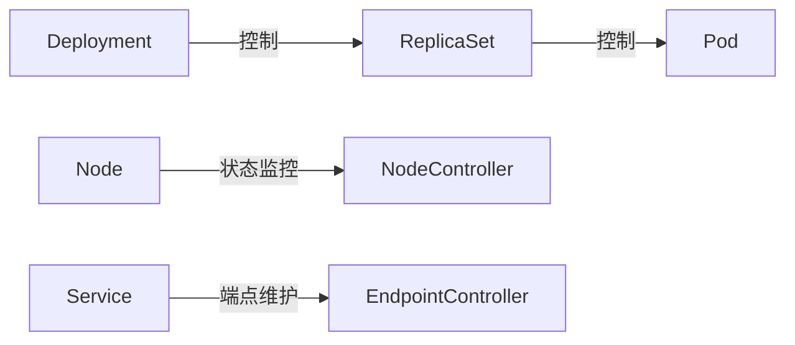
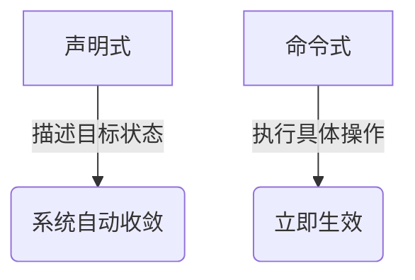
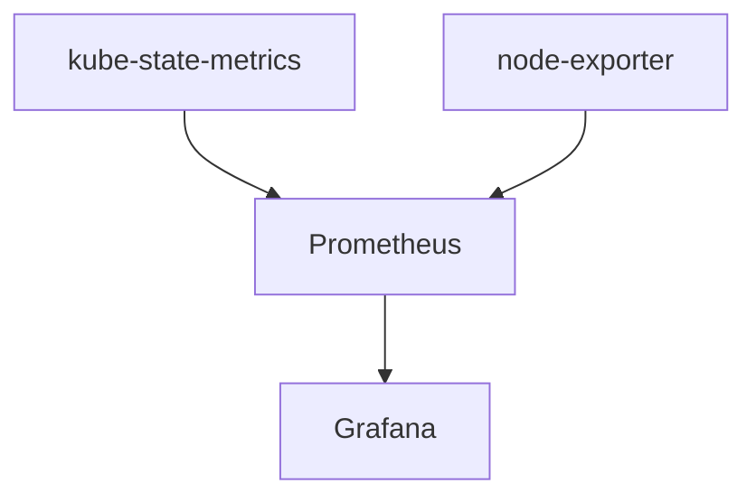
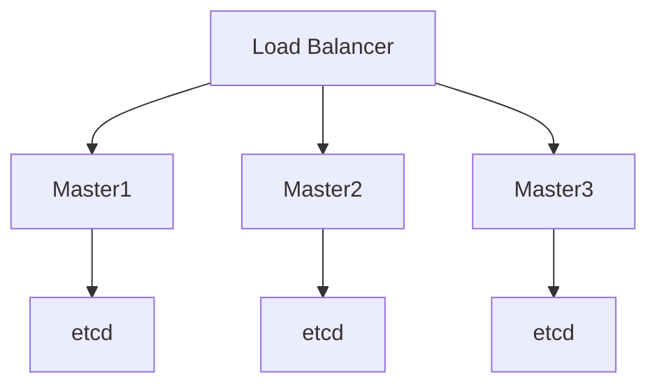

+++
title = "11.K8S高级知识面试题汇总"
slug = "k8s-K8S的高级知识面试题汇总"
+++

# 定期快照备份

以下是针对 Kubernetes 高级面试题的逐题详解，按原始顺序依次回答：

### 一、集群架构与核心组件
#### 1. Kubernetes Master组件及作用详解
**API Server**：

+ 作为集群唯一入口，提供RESTful API
+ 典型配置参数：

```yaml
kube-apiserver:
  --etcd-servers=https://etcd-cluster:2379
  --service-cluster-ip-range=10.96.0.0/12
  --authorization-mode=Node,RBAC
```

+ 请求处理流程：认证→鉴权→准入控制→持久化到etcd

**Scheduler**：

+ 调度分两个阶段：
    1. 过滤阶段（Predicates）：检查节点资源、端口冲突等
    2. 打分阶段（Priorities）：计算节点得分（如资源空闲率）
+ 可扩展点：通过--scheduler-name指定自定义调度器

**Controller Manager**：

+ 核心控制器协同示例：



#### 2. Etcd高可用保障方案
**部署架构**：

+ 最少3节点（推荐5节点）跨AZ部署
+ 使用etcd-operator简化管理

**关键配置**：

```shell
etcd \
  --listen-peer-urls=https://0.0.0.0:2380 \
  --listen-client-urls=https://0.0.0.0:2379 \
  --auto-compaction-retention=24h \  # 压缩历史版本
  --snapshot-count=10000 \          # 触发快照的提交次数
  --quota-backend-bytes=8GB         # 存储空间限制
```

**备份恢复**：

```shell
# 定期快照备份
ETCDCTL_API=3 etcdctl snapshot save snapshot.db

# 灾难恢复
ETCDCTL_API=3 etcdctl snapshot restore snapshot.db \
  --data-dir=/var/lib/etcd-new
```

#### 3. Kubelet与Kube-proxy功能对比
**Kubelet**：

+ 工作流程：
    1. 通过PodSpec创建容器
    2. 挂载Volume（CSI）
    3. 执行健康检查（Liveness/Readiness）
    4. 向API Server报告状态

**Kube-proxy**：

+ 流量转发模式对比：

| 模式 | 原理 | 性能 | 支持DNAT |
| --- | --- | --- | --- |
| iptables | 链式规则匹配 | 中 | 是 |
| IPVS | 内核哈希表 | 高 | 否 |
| userspace | 用户态socket转发 | 低 | 是 |


#### 4. Controller Manager核心控制器协作
**典型工作流**（以Deployment为例）：

1. Deployment Controller检测到新的Deployment对象
2. 创建对应的ReplicaSet并设置replicas数量
3. ReplicaSet Controller创建Pod副本
4. Scheduler为Pending状态的Pod选择节点
5. Node Controller监控节点状态，异常时触发重新调度

**控制器列表**：

+ 工作负载类：Deployment/StatefulSet/DaemonSet
+ 服务类：Endpoint/Slice/ServiceAccount
+ 基础设施类：Node/Namespace/PersistentVolume

#### 5. 声明式API vs 命令式API
**本质区别**：



**声明式优势**：

+ 状态回放：kubectl apply -f可重复执行
+ 变更追踪：结合git实现版本控制
+ 自动修复：系统持续向声明状态收敛

**命令式适用场景**：

```shell
# 调试场景
kubectl exec -it pod-name -- /bin/sh
kubectl port-forward svc/nginx 8080:80
```


### **二、网络（CNI、Service、Ingress）**
#### **6. Pod 网络模型与跨节点通信**
**Pod 网络模型核心要求**：  

+ 每个 Pod 拥有唯一 IP（IP-per-Pod）。  
+ Pod 可直接跨节点通信（无需 NAT）。

**实现方式**：  

+ **CNI 插件**（Container Network Interface）：  
    - **Calico**（BGP 模式）：节点作为 BGP Peer，直接交换路由信息。  
    - **Flannel**（VXLAN 模式）：封装 Pod 流量为 UDP 包跨节点传输。  
    - **Cilium**（eBPF 模式）：基于内核 eBPF 实现高性能网络策略。

**跨节点通信流程**：  

1. Pod A（Node 1）发送数据包到 Pod B（Node 2）。  
2. **Calico（BGP）**：Node 1 直接通过 BGP 路由表转发到 Node 2。  
3. **Flannel（VXLAN）**：  
    - 封装 Pod 数据包为 VXLAN 帧。  
    - 通过 UDP 发送到目标节点后解封装。

---

#### **7. Service 类型对比（ClusterIP、NodePort、LoadBalancer、ExternalName）**
| **类型** | **作用** | **适用场景** | **示例** |
| --- | --- | --- | --- |
| **ClusterIP** | 内部集群访问（默认） | 微服务间通信 | `kubectl expose deploy/nginx --port=80` |
| **NodePort** | 通过节点端口暴露服务（30000-32767） | 开发测试环境 | `kubectl expose deploy/nginx --type=NodePort --port=80` |
| **LoadBalancer** | 云厂商负载均衡器（如 AWS ELB） | 生产环境公网访问 | `kubectl expose deploy/nginx --type=LoadBalancer` |
| **ExternalName** | DNS CNAME 映射到外部服务 | 集成外部服务（如数据库） | ```yaml spec: type: ExternalName externalName: mydb.example.com ``` |


---

#### **8. Ingress 与 Ingress Controller**
**Ingress**：  

+ **定义路由规则**（基于 Host/Path 的 HTTP/HTTPS 路由）。  
+ **示例**：  

```yaml
apiVersion: networking.k8s.io/v1
kind: Ingress
metadata:
  name: my-ingress
spec:
  rules:
  - host: foo.example.com
    http:
      paths:
      - path: /bar
        pathType: Prefix
        backend:
          service:
            name: my-service
            port:
              number: 80
```

**Ingress Controller**：  

+ **实现流量代理**（如 Nginx、Traefik、Istio IngressGateway）。  
+ **部署方式**：  

```shell
# Nginx Ingress Controller
kubectl apply -f https://raw.githubusercontent.com/kubernetes/ingress-nginx/main/deploy/static/provider/cloud/deploy.yaml
```

---

#### **9. NetworkPolicy 实现（示例）**
**功能**：限制 Pod 间的网络流量（类似防火墙）。  
**示例**（只允许特定 Pod 访问数据库）：  

```yaml
apiVersion: networking.k8s.io/v1
kind: NetworkPolicy
metadata:
  name: db-access
spec:
  podSelector:
    matchLabels:
      app: mysql
  ingress:
  - from:
    - podSelector:
        matchLabels:
          app: web
    ports:
    - protocol: TCP
      port: 3306
```

**支持插件**：Calico、Cilium、kube-router。  

---

#### **10. Calico vs Flannel**
| **特性** | **Calico** | **Flannel** |
| --- | --- | --- |
| **网络模型** | BGP（路由直通） | VXLAN（隧道封装） |
| **性能** | 高（无封装开销） | 中（VXLAN 头部开销） |
| **策略支持** | 支持 NetworkPolicy | 需额外插件 |
| **适用场景** | 生产环境、需要策略控制 | 简单场景、快速部署 |


---

#### **11. Pod 网络不通排查**
**排查步骤**：  

1. **检查 Pod 状态**：  

```shell
kubectl get pod -o wide  # 确认 Pod IP 和节点
kubectl describe pod <pod-name>  # 查看事件
```

2. **检查 Service 和 Endpoints**：  

```shell
kubectl get svc,ep  # 确认 Service 是否关联到正确 Pod
```

3. **节点间连通性测试**：  

```shell
# 在 Node 1 上 ping Node 2 的 Pod IP
ping <pod-ip>
```

4. **CNI 插件日志**：  

```shell
journalctl -u kubelet -f | grep cni
```

---

### **三、存储（PV、PVC、StorageClass）**
#### **12. PV 和 PVC 的作用**
+ **PV（PersistentVolume）**：集群存储资源（如 NFS 卷、云磁盘）。  
+ **PVC（PersistentVolumeClaim）**：用户存储请求，绑定 PV。

**示例**：  

```yaml
# PV 定义（NFS 示例）
apiVersion: v1
kind: PersistentVolume
metadata:
  name: nfs-pv
spec:
  capacity:
    storage: 10Gi
  accessModes:
    - ReadWriteMany
  nfs:
    server: nfs-server.example.com
    path: /exports/data

# PVC 定义
apiVersion: v1
kind: PersistentVolumeClaim
metadata:
  name: my-pvc
spec:
  accessModes:
    - ReadWriteMany
  resources:
    requests:
      storage: 10Gi
```

---

#### **13. StorageClass 动态分配**
**作用**：按需自动创建 PV（如云厂商的磁盘）。  
**示例（AWS EBS）**：  

```yaml
apiVersion: storage.k8s.io/v1
kind: StorageClass
metadata:
  name: ebs-sc
provisioner: ebs.csi.aws.com
parameters:
  type: gp3
  encrypted: "true"
```

**使用方式**：  

```yaml
# PVC 引用 StorageClass
apiVersion: v1
kind: PersistentVolumeClaim
metadata:
  name: dynamic-pvc
spec:
  storageClassName: ebs-sc
  accessModes:
    - ReadWriteOnce
  resources:
    requests:
      storage: 100Gi
```

---

#### **14. Local PV vs NFS PV**
| **特性** | **Local PV** | **NFS PV** |
| --- | --- | --- |
| **性能** | 高（本地磁盘） | 中（网络延迟） |
| **可用性** | 低（单节点故障数据丢失） | 高（共享存储） |
| **适用场景** | 数据库（如 MySQL、Redis） | 多 Pod 共享数据（如静态文件） |


---

15. 如何实现 Pod 数据的持久化存储？

**核心方法**：通过 **PersistentVolume (PV) + PersistentVolumeClaim (PVC)** 实现。  

#### **步骤详解**：
    1. **创建存储后端**（如 NFS、云存储）：  

```shell
# NFS 示例（需提前部署NFS服务器）
mkdir /nfsdata && chmod 777 /nfsdata
echo "/nfsdata *(rw,sync,no_root_squash)" >> /etc/exports
systemctl restart nfs-server
```

    2. **定义 PersistentVolume (PV)**：  

```yaml
apiVersion: v1
kind: PersistentVolume
metadata:
  name: nfs-pv
spec:
  capacity:
    storage: 10Gi
  accessModes:
    - ReadWriteMany  # 多节点读写
  persistentVolumeReclaimPolicy: Retain  # 保留数据
  nfs:
    server: nfs-server-ip
    path: /nfsdata
```

    3. **创建 PersistentVolumeClaim (PVC)**：  

```yaml
apiVersion: v1
kind: PersistentVolumeClaim
metadata:
  name: my-pvc
spec:
  accessModes:
    - ReadWriteMany
  resources:
    requests:
      storage: 5Gi  # 可小于PV容量
  storageClassName: ""  # 显式指定为空，避免动态分配
```

    4. **Pod 挂载 PVC**：  

```yaml
apiVersion: v1
kind: Pod
metadata:
  name: nginx-pod
spec:
  containers:
  - name: nginx
    image: nginx
    volumeMounts:
    - name: data
      mountPath: /usr/share/nginx/html
  volumes:
  - name: data
    persistentVolumeClaim:
      claimName: my-pvc  # 引用PVC
```

#### **验证数据持久化**：
```shell
kubectl exec -it nginx-pod -- bash
echo "Hello Kubernetes" > /usr/share/nginx/html/test.txt
kubectl delete pod nginx-pod
kubectl apply -f pod.yaml  # 重新创建Pod后，文件仍存在
```

---

#### 16. CSI (Container Storage Interface) 的作用及优势
#### **CSI 的核心作用**：
    - **标准化存储插件接口**：解耦K8S与存储提供商，无需修改K8S核心代码即可支持新存储类型。  
    - **支持高级功能**：卷快照、扩容、拓扑感知等。

#### **CSI 组件架构**：
| 组件 | 作用 |
| --- | --- |
| **CSI Driver** | 存储厂商提供的插件（如AWS EBS CSI Driver） |
| **External Provisioner** | 监听PVC并调用CSI创建PV |
| **External Attacher** | 将PV挂载到节点 |
| **Node Driver Registrar** | 向kubelet注册CSI Driver |


#### **CSI 相比 FlexVolume 的优势**：
| **特性** | **CSI** | **FlexVolume** |
| --- | --- | --- |
| **部署方式** | 独立Pod（更安全） | 需宿主机安装二进制 |
| **功能支持** | 支持快照、扩容等 | 功能有限 |
| **兼容性** | 标准化接口 | 各厂商实现差异大 |
| **维护性** | 社区活跃 | 已逐步淘汰 |


#### **CSI 使用示例（AWS EBS）**：
    1. **安装CSI Driver**：  

```shell
kubectl apply -k "github.com/kubernetes-sigs/aws-ebs-csi-driver/deploy/kubernetes/overlays/stable/?ref=master"
```

    2. **创建StorageClass**：  

```yaml
apiVersion: storage.k8s.io/v1
kind: StorageClass
metadata:
  name: ebs-sc
provisioner: ebs.csi.aws.com
volumeBindingMode: WaitForFirstConsumer  # 延迟绑定
parameters:
  type: gp3
  encrypted: "true"
```

    3. **动态创建PVC**：  

```yaml
apiVersion: v1
kind: PersistentVolumeClaim
metadata:
  name: ebs-pvc
spec:
  accessModes:
    - ReadWriteOnce
  storageClassName: ebs-sc
  resources:
    requests:
      storage: 100Gi
```

#### **关键操作对比**：
| **操作** | **CSI 命令** | **FlexVolume 命令** |
| --- | --- | --- |
| 查看驱动 | `kubectl get csidrivers` | `ls /usr/libexec/kubernetes/kubelet-plugins/volume/exec/` |
| 卷扩容 | `kubectl edit pvc <name>` | 需手动操作存储系统 |


---

### **总结**
    - **持久化存储**：PV/PVC 是基础，CSI 是生产级解决方案。  
    - **CSI 优势**：标准化、功能丰富、易于维护，是K8S存储的未来方向。  
    - **适用场景**：  
        * 云环境：直接使用云厂商的CSI Driver（如AWS EBS、Azure Disk）  
        * 本地存储：推荐使用Local PV或开源CSI Driver（如Rook Ceph）

### **四、调度与资源管理**
#### **17. Kubernetes调度器工作原理**
**调度流程：**

1. **过滤阶段（Filtering）**：

```go
// 示例Predicate策略
func GeneralPredicates(pod *v1.Pod, nodeInfo *schedulernodeinfo.NodeInfo) bool {
    return nodeInfo.Allocatable.MilliCPU >= pod.RequestedResources.MilliCPU
}
```

    - 检查节点资源（CPU/Memory）
    - 验证节点Selector/Affinity匹配
    - 检查端口冲突
2. **打分阶段（Scoring）**：

```go
// 典型Priority函数
func BalancedResourceAllocation(pod *v1.Pod, nodeInfo *schedulernodeinfo.NodeInfo) int64 {
    cpuFraction := nodeInfo.RequestedResources.MilliCPU / nodeInfo.Allocatable.MilliCPU
    memFraction := nodeInfo.RequestedResources.Memory / nodeInfo.Allocatable.Memory
    return int64((1 - math.Abs(cpuFraction-memFraction)) * float64(scheduler.MaxPriority))
}
```

    - 资源平衡策略（如SelectorSpreadPriority）
    - 亲和性权重计算

**扩展调度：**

+ 自定义调度器：通过--scheduler-name指定
+ 调度框架（Scheduling Framework）：支持插件化扩展

#### **18. 高级调度控制**
**NodeSelector：**

```yaml
spec:
  nodeSelector:
    accelerator: gpu
```

**NodeAffinity：**

```yaml
affinity:
  nodeAffinity:
    requiredDuringSchedulingIgnoredDuringExecution:
      nodeSelectorTerms:
      - matchExpressions:
        - key: topology.kubernetes.io/zone
          operator: In
          values: [zoneA]
```

**PodAffinity：**

```yaml
affinity:
  podAffinity:
    requiredDuringSchedulingIgnoredDuringExecution:
    - labelSelector:
        matchExpressions:
        - key: app
          operator: In
          values: [cache]
      topologyKey: kubernetes.io/hostname
```

#### **19. Resource Quota与LimitRange**
**ResourceQuota示例：**

```yaml
apiVersion: v1
kind: ResourceQuota
metadata:
  name: mem-cpu-quota
spec:
  hard:
    requests.cpu: "10"
    requests.memory: 20Gi
    limits.cpu: "20"
    limits.memory: 40Gi
```

**LimitRange示例：**

```yaml
apiVersion: v1
kind: LimitRange
metadata:
  name: mem-limit-range
spec:
  limits:
  - default:
      memory: 512Mi
    defaultRequest:
      memory: 256Mi
    type: Container
```

#### **20. 资源优化策略**
**垂直优化：**

+ 使用VPA（Vertical Pod Autoscaler）

```shell
kubectl apply -f https://github.com/kubernetes/autoscaler/raw/master/vertical-pod-autoscaler/deploy/vpa-v1.yaml
```

**水平优化：**

+ 装箱优化（Bin Packing）
+ 使用Descheduler重新平衡

```shell
kubectl apply -f https://github.com/kubernetes-sigs/descheduler/raw/master/kubernetes/base/rbac.yaml
```

#### **21. QoS类别**
| 类型 | 配置要求 | 驱逐优先级 |
| --- | --- | --- |
| Guaranteed | 所有容器设置limits=requests | 最后 |
| Burstable | 至少一个容器设置requests | 中等 |
| BestEffort | 未设置任何资源限制 | 最先 |


#### **22. 优先级与抢占**
**PriorityClass定义：**

```yaml
apiVersion: scheduling.k8s.io/v1
kind: PriorityClass
metadata:
  name: high-priority
value: 1000000
preemptionPolicy: Never
```

**Pod使用优先级：**

```yaml
spec:
  priorityClassName: high-priority
```

### **五、安全**
#### **23. RBAC配置**
**角色定义：**

```yaml
apiVersion: rbac.authorization.k8s.io/v1
kind: Role
metadata:
  namespace: default
  name: pod-reader
rules:
- apiGroups: [""]
  resources: ["pods"]
  verbs: ["get", "watch", "list"]
```

**角色绑定：**

```yaml
apiVersion: rbac.authorization.k8s.io/v1
kind: RoleBinding
metadata:
  name: read-pods
  namespace: default
subjects:
- kind: User
  name: jane
  apiGroup: rbac.authorization.k8s.io
roleRef:
  kind: Role
  name: pod-reader
  apiGroup: rbac.authorization.k8s.io
```

#### **24. ServiceAccount控制**
**限制Pod权限：**

```yaml
apiVersion: v1
kind: ServiceAccount
metadata:
  name: restricted-sa
automountServiceAccountToken: false
```

**Pod使用SA：**

```yaml
spec:
  serviceAccountName: restricted-sa
  containers:
  - name: my-container
    image: nginx
```

#### **25. PodSecurityPolicy**
**示例策略：**

```yaml
apiVersion: policy/v1beta1
kind: PodSecurityPolicy
metadata:
  name: restricted
spec:
  privileged: false
  allowPrivilegeEscalation: false
  requiredDropCapabilities:
    - ALL
  volumes:
    - 'configMap'
    - 'emptyDir'
  hostNetwork: false
  hostIPC: false
  hostPID: false
```

#### **26. TLS证书配置**
**API Server证书：**

```shell
openssl req -x509 -newkey rsa:2048 \
  -keyout apiserver.key -out apiserver.crt \
  -days 365 -nodes -subj "/CN=kube-apiserver"
```

**kubeconfig配置：**

```yaml
clusters:
- cluster:
    certificate-authority-data: LS0t...
    server: https://api-server:6443
```

#### **27. Etcd安全加固**
**启动参数：**

```shell
etcd --cert-file=/etc/etcd/server.crt \
     --key-file=/etc/etcd/server.key \
     --peer-cert-file=/etc/etcd/peer.crt \
     --peer-key-file=/etc/etcd/peer.key \
     --trusted-ca-file=/etc/etcd/ca.crt
```

#### **28. mTLS实现**
**Istio配置示例：**

```yaml
apiVersion: security.istio.io/v1beta1
kind: PeerAuthentication
metadata:
  name: default
spec:
  mtls:
    mode: STRICT
```

### **六、监控与日志**
#### **29. 集群监控方案**
**核心监控指标：**

+ 节点资源：CPU/Memory/Disk
+ Pod状态：Ready/RestartCount
+ 控制平面：API Server延迟

**工具组合：**



#### **30. Prometheus Operator**
**架构组成：**

+ Prometheus CRD：定义监控实例
+ ServiceMonitor：自动发现监控目标
+ Alertmanager：告警管理

**安装命令：**

```shell
kubectl apply -f https://github.com/prometheus-operator/prometheus-operator/raw/master/bundle.yaml
```

#### **31. 日志收集方案对比**
| 方案 | 组成 | 特点 |
| --- | --- | --- |
| EFK | Elasticsearch+Fluentd+Kibana | 成熟稳定 |
| Loki | Loki+Promtail+Grafana | 轻量级，标签索引 |


#### **32. HPA配置**
**基于CPU的HPA：**

```yaml
apiVersion: autoscaling/v2beta2
kind: HorizontalPodAutoscaler
metadata:
  name: php-apache
spec:
  scaleTargetRef:
    apiVersion: apps/v1
    kind: Deployment
    name: php-apache
  minReplicas: 1
  maxReplicas: 10
  metrics:
  - type: Resource
    resource:
      name: cpu
      target:
        type: Utilization
        averageUtilization: 50
```

#### **33. 自定义指标**
**步骤：**

1. 部署Custom Metrics Adapter
2. 暴露应用指标
3. 创建HPA规则

```yaml
metrics:
- type: Pods
  pods:
    metric:
      name: http_requests
    target:
      type: AverageValue
      averageValue: 500m
```


### **七、高可用与灾备**
#### **34. Kubernetes Master高可用(HA)实现方案**
**架构设计：**

1. **多Master节点部署**
    - 至少3个Master节点（满足etcd的Quorum机制）
    - 使用硬件负载均衡器或软件LB（如Nginx、HAProxy）分发API Server流量
2. **关键组件冗余：**



3. **具体配置：**
    - **API Server**：所有实例无状态，通过LB暴露6443端口
    - **Scheduler/Controller Manager**：启用leader选举

```shell
kube-scheduler --leader-elect=true --leader-elect-lease-duration=15s
kube-controller-manager --leader-elect=true
```

    - **etcd集群**：

```shell
etcd --name=etcd1 \
     --initial-advertise-peer-urls=https://10.0.0.1:2380 \
     --listen-peer-urls=https://0.0.0.0:2380 \
     --advertise-client-urls=https://10.0.0.1:2379 \
     --listen-client-urls=https://0.0.0.0:2379 \
     --initial-cluster=etcd1=https://10.0.0.1:2380,etcd2=https://10.0.0.2:2380,etcd3=https://10.0.0.3:2380
```

#### **35. Etcd数据备份与恢复**
**备份方案：**

1. **定期快照**：

```shell
ETCDCTL_API=3 etcdctl snapshot save /backup/etcd-snapshot-$(date +%Y%m%d).db \
  --endpoints=https://127.0.0.1:2379 \
  --cacert=/etc/etcd/ssl/ca.pem \
  --cert=/etc/etcd/ssl/etcd.pem \
  --key=/etc/etcd/ssl/etcd-key.pem
```

2. **自动化脚本**：

```bash
#!/bin/bash
DATE=$(date +%Y%m%d)
etcdctl snapshot save /backup/etcd-snapshot-${DATE}.db
aws s3 cp /backup/etcd-snapshot-${DATE}.db s3://my-etcd-backup/
```

**灾难恢复步骤：**

1. 停止所有etcd服务
2. 恢复快照：

```shell
ETCDCTL_API=3 etcdctl snapshot restore /backup/etcd-snapshot.db \
  --data-dir=/var/lib/etcd-new
```

3. 修改etcd配置指向新数据目录
4. 重启etcd集群

#### **36. 跨可用区(Multi-AZ)部署方案**
**实现方式：**

1. **节点分布策略**：

```yaml
# Pod反亲和性配置
topologySpreadConstraints:
- maxSkew: 1
  topologyKey: topology.kubernetes.io/zone
  whenUnsatisfiable: DoNotSchedule
```

2. **存储配置**：
    - 使用云厂商的跨AZ存储（如AWS EBS gp3、Azure ZRS）
    - 示例StorageClass：

```yaml
kind: StorageClass
apiVersion: storage.k8s.io/v1
metadata:
  name: cross-az-ebs
provisioner: ebs.csi.aws.com
volumeBindingMode: WaitForFirstConsumer
parameters:
  type: gp3
  encrypted: "true"
allowedTopologies:
- matchLabelExpressions:
  - key: topology.kubernetes.io/zone
    values: ["us-west-2a", "us-west-2b"]
```

#### **37. 滚动升级(Rolling Update)实现**
**操作流程：**

1. **Deployment升级策略**：

```yaml
spec:
  strategy:
    type: RollingUpdate
    rollingUpdate:
      maxSurge: 25%        # 可额外创建的Pod数
      maxUnavailable: 25%  # 升级期间允许不可用的Pod数
```

2. **触发升级**：

```shell
kubectl set image deployment/nginx nginx=nginx:1.23
```

3. **监控升级过程**：

```shell
kubectl rollout status deployment/nginx
kubectl get pods -w
```

4. **回滚机制**：

```shell
kubectl rollout undo deployment/nginx
kubectl rollout history deployment/nginx
```

#### **38. 蓝绿部署(Blue-Green Deployment)**
**实现步骤：**

1. **部署新版本(Green)**：

```shell
kubectl apply -f green-deployment.yaml
kubectl apply -f green-service.yaml
```

2. **测试验证**：

```shell
kubectl port-forward svc/green-service 8080:80
curl http://localhost:8080
```

3. **流量切换**：

```shell
kubectl patch svc main-service -p '{"spec":{"selector":{"app":"nginx","version":"green"}}}'
```

4. **清理旧版本**：

```shell
kubectl delete -f blue-deployment.yaml
```

---

### **八、Operator与自定义资源(CRD)**
#### **39. Operator核心作用与示例**
**核心价值**：

+ **自动化复杂应用管理**：封装领域知识，实现Day-2运维自动化
+ **典型Operator案例**：
    - Prometheus Operator：管理监控栈
    - etcd Operator：自动化etcd集群运维
    - MySQL Operator：处理数据库备份/扩缩容

**工作流程**：


#### **40. 自定义Operator开发**
**开发步骤（使用Operator SDK）：**

1. 初始化项目：

```shell
operator-sdk init --domain=example.com --repo=github.com/example/memcached-operator
operator-sdk create api --group=cache --version=v1alpha1 --kind=Memcached
```

2. 定义CRD（`api/v1alpha1/memcached_types.go`）：

```go
type MemcachedSpec struct {
    Size int32 `json:"size"`
    Version string `json:"version"`
}
```

3. 实现Reconciler逻辑：

```go
func (r *MemcachedReconciler) Reconcile(ctx context.Context, req ctrl.Request) (ctrl.Result, error) {
    memcached := &cachev1alpha1.Memcached{}
    if err := r.Get(ctx, req.NamespacedName, memcached); err != nil {
        return ctrl.Result{}, client.IgnoreNotFound(err)
    }
    
    // 创建Deployment
    deploy := &appsv1.Deployment{ObjectMeta: metav1.ObjectMeta{Name: memcached.Name}}
    _, err := ctrl.CreateOrUpdate(ctx, r.Client, deploy, func() error {
        deploy.Spec = *memcached.Spec.ToDeploymentSpec()
        return nil
    })
    
    return ctrl.Result{}, err
}
```

#### **41. CRD定义详解**
**示例CRD定义：**

```yaml
apiVersion: apiextensions.k8s.io/v1
kind: CustomResourceDefinition
metadata:
  name: memcacheds.cache.example.com
spec:
  group: cache.example.com
  versions:
    - name: v1alpha1
      served: true
      storage: true
      schema:
        openAPIV3Schema:
          type: object
          properties:
            spec:
              type: object
              properties:
                size:
                  type: integer
                version:
                  type: string
  scope: Namespaced
  names:
    plural: memcacheds
    singular: memcached
    kind: Memcached
    shortNames:
    - mc
```

#### **42. Operator开发工具对比**
| **工具** | **语言支持** | **特点** |
| --- | --- | --- |
| Operator SDK | Go/Ansible/Helm | 官方维护，集成Kubebuilder |
| Kubebuilder | Go | 更轻量级，适合纯Go开发 |
| KUDO (Kubernetes Universal Declarative Operator) | YAML | 声明式Operator开发 |


---

### **九、性能优化与故障排查**
#### **43. Pod启动失败排查**
**诊断流程：**

1. 查看Pod事件：

```shell
kubectl describe pod <pod-name>
```

2. 检查常见错误：
    - ImagePullBackOff：镜像拉取失败
    - CrashLoopBackOff：容器持续崩溃
    - Pending：资源不足或调度失败
3. 查看容器日志：

```shell
kubectl logs <pod-name> -c <container-name> --previous
```

#### **44. API Server性能优化**
**关键配置：**

```shell
kube-apiserver \
  --enable-aggregator-routing=true \  # 启用API聚合
  --watch-cache=true \               # 启用watch缓存
  --watch-cache-sizes=1000 \         # 调整缓存大小
  --max-requests-inflight=2000 \     # 并发请求限制
  --max-mutating-requests-inflight=500
```

#### **45. Kubelet资源占用优化**
**关键参数：**

```shell
kubelet \
  --serialize-image-pulls=false \  # 并行拉取镜像
  --image-pull-progress-deadline=2m \
  --eviction-hard=memory.available<500Mi \
  --kube-api-burst=50 \           # API调用突发限制
  --kube-api-qps=30
```

#### **46. etcd性能优化**
**关键调优参数：**

```shell
etcd \
  --snapshot-count=10000 \        # 触发快照的提交次数
  --heartbeat-interval=100ms \    # 心跳间隔
  --election-timeout=500ms \      # 选举超时
  --quota-backend-bytes=8GB \     # 存储空间限制
  --max-request-bytes=157286400   # 最大请求大小(150MB)
```

#### **47. API请求延迟优化**
**优化策略：**

1. 客户端优化：

```go
// 使用Client-go的缓存机制
informer := cache.NewSharedIndexInformer(...)
```

2. 服务端优化：
    - 启用API优先级和公平性（APF）

```yaml
apiVersion: flowcontrol.apiserver.k8s.io/v1beta1
kind: PriorityLevelConfiguration
metadata:
  name: leader-election
spec:
  type: Limited
  limited:
    assuredConcurrencyShares: 10
```

---

### **十、云原生生态**
#### **48. Service Mesh（Istio）核心机制**
**数据平面架构：**


**关键功能：**

+ 流量管理（VirtualService/DestinationRule）
+ 安全（mTLS/AuthorizationPolicy）
+ 可观测性（Prometheus/Kiali）

#### **49. Knative核心组件**
**三大核心：**

1. **Serving**：自动扩缩容到零

```yaml
apiVersion: serving.knative.dev/v1
kind: Service
spec:
  template:
    spec:
      containers:
        - image: gcr.io/knative-samples/helloworld-go
```

2. **Eventing**：事件驱动架构
3. **Client**：kn CLI工具

#### **50. GitOps工具对比**
| **工具** | **特点** | **工作流** |
| --- | --- | --- |
| ArgoCD | 声明式同步，支持多集群 | 使用Git作为唯一事实源 |
| Flux | 渐进式交付，集成Kustomize | 持续 reconciliation |


**ArgoCD部署示例：**

```shell
kubectl create namespace argocd
kubectl apply -n argocd -f https://raw.githubusercontent.com/argoproj/argo-cd/stable/manifests/install.yaml
```
