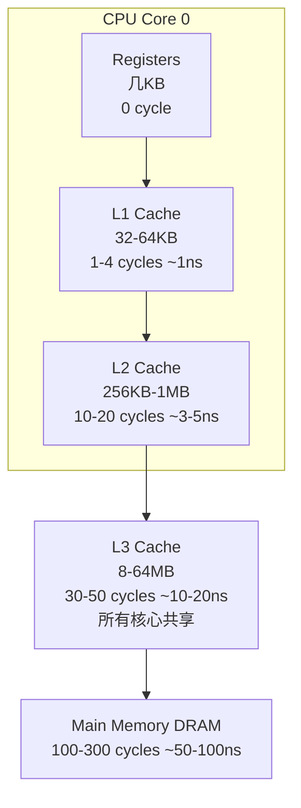

+++
title = "10. Memory Model and Cache Optimization (HFT)"
date = 2026-01-21
description = "深入剖析C++11内存模型、CPU缓存层次结构、Cache Line、False Sharing、Memory Ordering等核心概念，HFT低延迟系统必备知识"
[taxonomies]
tags = ["C++", "内存模型", "缓存优化", "HFT", "低延迟", "并发"]
+++

## 概述

在HFT（高频交易）系统中，内存访问模式直接决定系统延迟。理解CPU缓存层次、Cache Line、Memory Ordering等概念，是编写低延迟代码的基础。本文深入剖析C++内存模型与缓存优化策略。

---

## 一、CPU缓存层次结构

### 1.1 现代CPU缓存架构



### 1.2 访问延迟对比

| 存储层级 | 典型大小 | 访问延迟 | 相对速度 |
|----------|----------|----------|----------|
| L1 Cache | 32-64 KB | ~1 ns | 1x |
| L2 Cache | 256 KB-1 MB | ~4 ns | 4x slower |
| L3 Cache | 8-64 MB | ~15 ns | 15x slower |
| Main Memory | 16-256 GB | ~60 ns | 60x slower |
| NVMe SSD | 1-8 TB | ~20 µs | 20000x slower |

**HFT关键洞察**：L1 cache miss到主存的访问延迟约60ns，这相当于HFT系统单次交易处理时间的很大一部分。

### 1.3 Cache Line（缓存行）

Cache是按**Cache Line**为单位进行读写的，而非按字节。

```cpp
// 现代CPU的Cache Line通常是64字节
// C++17提供了std::hardware_destructive_interference_size
// 注意：某些编译器可能不支持或返回不同的值
#ifdef __cpp_lib_hardware_interference_size
    constexpr size_t CACHE_LINE_SIZE = std::hardware_destructive_interference_size;
#else
    constexpr size_t CACHE_LINE_SIZE = 64;  // 常见默认值
#endif

// 当访问任意字节时，整个Cache Line被加载
struct Data {
    int a;  // 4 bytes at offset 0
    int b;  // 4 bytes at offset 4
    // ... 访问a时，整个64字节Cache Line被加载
};
```

**验证Cache Line大小**：

```cpp
#include <new>  // C++17

void printCacheLineSize() {
    // C++17: 硬件破坏性干扰大小（通常等于Cache Line大小）
    std::cout << "Cache Line Size: " 
              << std::hardware_destructive_interference_size 
              << " bytes\n";
    
    // 或者通过系统命令
    // Linux: cat /sys/devices/system/cpu/cpu0/cache/index0/coherency_line_size
}
```

---

## 二、False Sharing（伪共享）

### 2.1 什么是False Sharing

当多个线程访问**不同**的变量，但这些变量位于**同一个Cache Line**时，会发生False Sharing。

```cpp
// 有问题的代码
struct Counters {
    int counter1;  // 线程1使用
    int counter2;  // 线程2使用
    // 两个counter在同一Cache Line中！
};

Counters counters;

void thread1() {
    for (int i = 0; i < 100000000; ++i) {
        counters.counter1++;  // 使整个Cache Line失效
    }
}

void thread2() {
    for (int i = 0; i < 100000000; ++i) {
        counters.counter2++;  // 每次都要重新加载Cache Line
    }
}
```

### 2.2 False Sharing的性能影响

```cpp
#include <atomic>
#include <thread>
#include <chrono>

// 有False Sharing的版本
struct BadCounters {
    std::atomic<int64_t> c1{0};
    std::atomic<int64_t> c2{0};
};

// 无False Sharing的版本
struct GoodCounters {
    alignas(64) std::atomic<int64_t> c1{0};
    alignas(64) std::atomic<int64_t> c2{0};
};

// 或使用C++17的标准方式
struct BetterCounters {
    alignas(std::hardware_destructive_interference_size) 
        std::atomic<int64_t> c1{0};
    alignas(std::hardware_destructive_interference_size) 
        std::atomic<int64_t> c2{0};
};

void benchmark() {
    constexpr int iterations = 100'000'000;
    
    // 测试有False Sharing
    {
        BadCounters counters;
        auto start = std::chrono::high_resolution_clock::now();
        
        std::thread t1([&]() {
            for (int i = 0; i < iterations; ++i) {
                counters.c1.fetch_add(1, std::memory_order_relaxed);
            }
        });
        std::thread t2([&]() {
            for (int i = 0; i < iterations; ++i) {
                counters.c2.fetch_add(1, std::memory_order_relaxed);
            }
        });
        
        t1.join();
        t2.join();
        auto end = std::chrono::high_resolution_clock::now();
        
        std::cout << "With False Sharing: " 
                  << std::chrono::duration_cast<std::chrono::milliseconds>(end - start).count()
                  << " ms\n";
    }
    
    // 测试无False Sharing
    {
        GoodCounters counters;
        auto start = std::chrono::high_resolution_clock::now();
        
        std::thread t1([&]() {
            for (int i = 0; i < iterations; ++i) {
                counters.c1.fetch_add(1, std::memory_order_relaxed);
            }
        });
        std::thread t2([&]() {
            for (int i = 0; i < iterations; ++i) {
                counters.c2.fetch_add(1, std::memory_order_relaxed);
            }
        });
        
        t1.join();
        t2.join();
        auto end = std::chrono::high_resolution_clock::now();
        
        std::cout << "Without False Sharing: " 
                  << std::chrono::duration_cast<std::chrono::milliseconds>(end - start).count()
                  << " ms\n";
    }
}

// 典型输出：
// With False Sharing: 1200 ms
// Without False Sharing: 300 ms  (4x faster!)
```

### 2.3 HFT系统中的Cache Line对齐

```cpp
// HFT订单结构：避免跨Cache Line
struct alignas(64) Order {
    uint64_t order_id;      // 8 bytes
    uint64_t timestamp;     // 8 bytes
    int32_t price;          // 4 bytes
    int32_t quantity;       // 4 bytes
    int32_t side;           // 4 bytes
    int32_t type;           // 4 bytes
    char symbol[8];         // 8 bytes
    // Total: 40 bytes, 使用padding填充到64 bytes
    char padding[24];
};

static_assert(sizeof(Order) == 64, "Order should fit in one cache line");
static_assert(alignof(Order) == 64, "Order should be cache line aligned");

// 无锁队列的元素对齐
template<typename T>
class alignas(64) CacheAlignedSlot {
    std::atomic<T> value;
    char padding[64 - sizeof(std::atomic<T>)];
};
```

---

## 三、C++11内存模型

### 3.1 为什么需要内存模型

编译器和CPU都可能对指令进行重排序：

```cpp
// 原始代码
int a = 0;
bool ready = false;

void writer() {
    a = 42;        // (1)
    ready = true;  // (2)
}

void reader() {
    while (!ready);  // (3)
    assert(a == 42); // (4) 可能失败！
}

// 编译器可能将(1)(2)重排序为(2)(1)
// CPU可能将写入重排序（Store-Store重排序）
// 导致reader看到ready=true但a还是0
```

### 3.2 Memory Order（内存序）

C++11定义了6种内存序：

```cpp
enum memory_order {
    memory_order_relaxed,    // 最弱：只保证原子性
    memory_order_consume,    // 依赖链顺序（基本不用）
    memory_order_acquire,    // 获取语义：之后的读写不能重排到前面
    memory_order_release,    // 释放语义：之前的读写不能重排到后面
    memory_order_acq_rel,    // acquire + release
    memory_order_seq_cst     // 最强：全局顺序一致（默认）
};
```

### 3.3 Relaxed Ordering

```cpp
std::atomic<int> counter{0};

void increment() {
    // relaxed：只保证原子性，不保证顺序
    counter.fetch_add(1, std::memory_order_relaxed);
}

// 适用场景：
// - 简单计数器
// - 不需要同步其他数据的情况
```

### 3.4 Acquire-Release Ordering

```cpp
std::atomic<bool> ready{false};
int data = 0;

void producer() {
    data = 42;  // (1)
    ready.store(true, std::memory_order_release);  // (2)
    // release保证：(1)在(2)之前完成
}

void consumer() {
    while (!ready.load(std::memory_order_acquire));  // (3)
    // acquire保证：(3)之后的读写在(3)之后执行
    assert(data == 42);  // (4) 保证成功！
}

// Acquire-Release形成"同步关系"：
// producer的release与consumer的acquire同步
// producer中release之前的所有写入对consumer的acquire之后可见
```

### 3.5 Sequential Consistency（顺序一致性）

```cpp
std::atomic<bool> x{false}, y{false};
std::atomic<int> z{0};

void thread1() {
    x.store(true, std::memory_order_seq_cst);  // (1)
}

void thread2() {
    y.store(true, std::memory_order_seq_cst);  // (2)
}

void thread3() {
    while (!x.load(std::memory_order_seq_cst));  // (3)
    if (y.load(std::memory_order_seq_cst)) {     // (4)
        z++;
    }
}

void thread4() {
    while (!y.load(std::memory_order_seq_cst));  // (5)
    if (x.load(std::memory_order_seq_cst)) {     // (6)
        z++;
    }
}

// seq_cst保证所有线程看到的操作顺序一致
// 要么(1)在(2)之前，要么(2)在(1)之前
// 至少有一个线程会执行z++
```

### 3.6 内存序选择指南

```
性能（快→慢）：relaxed > acquire/release > seq_cst
安全性（低→高）：relaxed < acquire/release < seq_cst

选择原则：
1. 只需要原子性 → relaxed
2. 需要同步数据 → acquire/release
3. 不确定 → seq_cst（默认）
```

---

## 四、Memory Barrier（内存屏障）

### 4.1 编译器屏障

```cpp
// 阻止编译器重排序
void compiler_barrier_example() {
    int a = 1;
    
    // 编译器屏障：阻止编译器将a的写入移动到屏障之后
    asm volatile("" ::: "memory");
    // 或者使用C++11
    std::atomic_signal_fence(std::memory_order_seq_cst);
    
    int b = 2;
}
```

### 4.2 CPU内存屏障

```cpp
// CPU内存屏障：阻止CPU重排序
void cpu_barrier_example() {
    // x86架构的屏障
    // mfence: 全屏障（阻止所有重排序）
    // lfence: 读屏障（阻止Load-Load重排序）
    // sfence: 写屏障（阻止Store-Store重排序）
    
    asm volatile("mfence" ::: "memory");
    
    // C++11方式
    std::atomic_thread_fence(std::memory_order_seq_cst);
}
```

### 4.3 atomic_thread_fence

```cpp
std::atomic<bool> flag{false};
int data = 0;

void producer() {
    data = 42;
    // 释放屏障：确保data的写入在flag写入之前完成
    std::atomic_thread_fence(std::memory_order_release);
    flag.store(true, std::memory_order_relaxed);
}

void consumer() {
    while (!flag.load(std::memory_order_relaxed));
    // 获取屏障：确保data的读取在flag读取之后
    std::atomic_thread_fence(std::memory_order_acquire);
    assert(data == 42);
}
```

---

## 五、缓存优化策略

### 5.1 数据局部性优化

**时间局部性**：最近访问的数据很可能再次访问

```cpp
// 不好：跳跃访问
void bad_access(int* arr, int n) {
    for (int i = 0; i < n; i += 16) {  // 每次跳16个元素
        arr[i]++;  // 缓存利用率低
    }
}

// 好：顺序访问
void good_access(int* arr, int n) {
    for (int i = 0; i < n; ++i) {
        arr[i]++;  // 充分利用缓存行
    }
}
```

**空间局部性**：访问某地址后，很可能访问相邻地址

```cpp
// 不好：链表遍历（节点可能分散在内存各处）
struct Node {
    int data;
    Node* next;
};

int sum_list(Node* head) {
    int sum = 0;
    for (Node* n = head; n; n = n->next) {
        sum += n->data;  // 每次访问可能cache miss
    }
    return sum;
}

// 好：数组遍历
int sum_array(const std::vector<int>& arr) {
    int sum = 0;
    for (int x : arr) {
        sum += x;  // 顺序访问，预取有效
    }
    return sum;
}
```

### 5.2 Cache Prefetching（预取）

```cpp
#include <xmmintrin.h>  // _mm_prefetch

void process_with_prefetch(int* data, size_t n) {
    constexpr size_t PREFETCH_DISTANCE = 8;  // 提前8个Cache Line
    
    for (size_t i = 0; i < n; ++i) {
        // 预取未来要访问的数据
        if (i + PREFETCH_DISTANCE < n) {
            _mm_prefetch(reinterpret_cast<char*>(&data[i + PREFETCH_DISTANCE * 16]), 
                        _MM_HINT_T0);
        }
        
        // 处理当前数据
        data[i] *= 2;
    }
}

// 预取提示类型：
// _MM_HINT_T0: 预取到所有缓存级别
// _MM_HINT_T1: 预取到L2及以上
// _MM_HINT_T2: 预取到L3及以上
// _MM_HINT_NTA: 非时间性访问，绕过缓存
```

### 5.3 结构体布局优化

```cpp
// 不好：成员顺序导致padding浪费和跨Cache Line
struct BadLayout {
    bool flag1;      // 1 byte
    // 7 bytes padding
    double value;    // 8 bytes
    bool flag2;      // 1 byte
    // 7 bytes padding
    double value2;   // 8 bytes
};  // Total: 32 bytes (16 bytes wasted)

// 好：按大小排列减少padding
struct GoodLayout {
    double value;    // 8 bytes
    double value2;   // 8 bytes
    bool flag1;      // 1 byte
    bool flag2;      // 1 byte
    // 6 bytes padding
};  // Total: 24 bytes (6 bytes wasted)

// HFT最佳：精确控制布局
struct OptimalLayout {
    double value;    // 8 bytes
    double value2;   // 8 bytes
    bool flag1;      // 1 byte
    bool flag2;      // 1 byte
    char reserved[6];// 显式padding
};  // Total: 24 bytes, 明确的内存布局
```

### 5.4 Hot/Cold Splitting

```cpp
// 将频繁访问的数据和不频繁访问的数据分开
struct Order {
    // Hot data：每次处理都访问
    uint64_t order_id;
    int32_t price;
    int32_t quantity;
    
    // Cold data：仅在特定情况访问
    struct ColdData {
        char client_id[32];
        char symbol[16];
        uint64_t timestamp;
        char notes[256];
    };
    ColdData* cold;  // 指向冷数据的指针
};

// 好处：
// 1. Hot data适合Cache Line（16 bytes + 8 bytes pointer = 24 bytes）
// 2. 常规处理时Cold data不占用缓存
// 3. 提高缓存利用率
```

---

## 六、HFT实战案例

### 6.1 无锁队列的缓存优化

```cpp
template<typename T, size_t Capacity>
class alignas(64) SPSCQueue {
    static_assert((Capacity & (Capacity - 1)) == 0, 
                  "Capacity must be power of 2");
    
    // 生产者相关：独占Cache Line
    alignas(64) std::atomic<size_t> write_pos_{0};
    size_t cached_read_pos_{0};
    
    // 消费者相关：独占Cache Line
    alignas(64) std::atomic<size_t> read_pos_{0};
    size_t cached_write_pos_{0};
    
    // 数据区域
    alignas(64) T buffer_[Capacity];
    
public:
    bool push(const T& item) {
        const size_t write = write_pos_.load(std::memory_order_relaxed);
        const size_t next_write = (write + 1) & (Capacity - 1);
        
        // 使用缓存的读位置减少原子操作
        if (next_write == cached_read_pos_) {
            cached_read_pos_ = read_pos_.load(std::memory_order_acquire);
            if (next_write == cached_read_pos_) {
                return false;  // 队列满
            }
        }
        
        buffer_[write] = item;
        write_pos_.store(next_write, std::memory_order_release);
        return true;
    }
    
    bool pop(T& item) {
        const size_t read = read_pos_.load(std::memory_order_relaxed);
        
        // 使用缓存的写位置减少原子操作
        if (read == cached_write_pos_) {
            cached_write_pos_ = write_pos_.load(std::memory_order_acquire);
            if (read == cached_write_pos_) {
                return false;  // 队列空
            }
        }
        
        item = buffer_[read];
        read_pos_.store((read + 1) & (Capacity - 1), 
                        std::memory_order_release);
        return true;
    }
};
```

### 6.2 订单簿的缓存友好设计

```cpp
// 使用连续内存存储价格级别
class CacheFriendlyOrderBook {
    // 每个价格级别的数据
    struct alignas(64) PriceLevel {
        int64_t price;
        int64_t total_quantity;
        int32_t order_count;
        int32_t padding;
        // 适合一个Cache Line
    };
    
    // 使用数组而非map
    std::vector<PriceLevel> bid_levels_;  // 买方价格级别
    std::vector<PriceLevel> ask_levels_;  // 卖方价格级别
    
    // 预分配足够空间
    static constexpr size_t MAX_LEVELS = 256;
    
public:
    CacheFriendlyOrderBook() {
        bid_levels_.reserve(MAX_LEVELS);
        ask_levels_.reserve(MAX_LEVELS);
    }
    
    // 获取最优买价：直接访问，O(1)
    const PriceLevel& getBestBid() const {
        return bid_levels_[0];  // 假设已排序
    }
    
    // 遍历所有买方级别：顺序内存访问
    void forEachBidLevel(std::function<void(const PriceLevel&)> fn) const {
        for (const auto& level : bid_levels_) {
            fn(level);  // 顺序访问，缓存友好
        }
    }
};
```

### 6.3 使用perf检测缓存问题

```bash
# 检测Cache Miss
perf stat -e cache-misses,cache-references,L1-dcache-load-misses ./hft_app

# 检测False Sharing
perf c2c record ./hft_app
perf c2c report

# 典型输出分析
# cache-misses: 越低越好
# L1-dcache-load-misses: 越低越好
# c2c report显示哪些Cache Line有争用
```

---

## 七、常见面试题

### 7.1 什么是Memory Order？

**答**：Memory Order定义了原子操作相对于其他内存操作的可见性和顺序。C++11定义了6种memory_order，从最弱的relaxed（只保证原子性）到最强的seq_cst（全局顺序一致）。选择适当的memory order是在性能和正确性之间取得平衡。

### 7.2 Acquire和Release语义是什么？

**答**：
- **Release语义**（写操作）：保证该操作之前的所有读写不会被重排序到该操作之后。相当于"发布"数据，确保发布前的修改对获取方可见。
- **Acquire语义**（读操作）：保证该操作之后的所有读写不会被重排序到该操作之前。相当于"获取"数据，确保获取后才读取相关数据。

两者配合使用形成同步关系。

### 7.3 如何避免False Sharing？

**答**：
1. 使用`alignas(64)`确保不同线程访问的数据在不同Cache Line
2. 使用C++17的`std::hardware_destructive_interference_size`
3. 添加padding填充结构体
4. 将只读数据和读写数据分开

### 7.4 seq_cst和acquire/release的区别？

**答**：
- **acquire/release**：只保证与同一原子变量的操作之间的顺序，不同原子变量之间可能被重排序
- **seq_cst**：所有seq_cst操作存在一个全局的全序关系，所有线程看到的顺序一致

seq_cst在x86上通常需要额外的mfence指令，开销更大。

---

## 总结

| 优化技术 | 效果 | HFT应用 |
|----------|------|---------|
| Cache Line对齐 | 避免False Sharing | 无锁队列、原子计数器 |
| Hot/Cold分离 | 提高缓存利用率 | 订单结构设计 |
| 顺序访问 | 利用预取 | 订单簿遍历 |
| 适当的Memory Order | 减少屏障开销 | 生产者-消费者模式 |
| 预取指令 | 隐藏内存延迟 | 批量数据处理 |

**HFT核心原则**：
1. 数据结构设计考虑Cache Line
2. 避免False Sharing
3. 使用最弱够用的Memory Order
4. 保持热数据在L1/L2 Cache中

---

## 相关文章

- [上一篇：Copy and Move Semantics](/articles/cpp/cpp-09-深浅拷贝与移动语义详解/)
- [下一篇：Virtual Functions and Polymorphism](/articles/cpp/cpp-11-虚函数与多态底层实现/)
