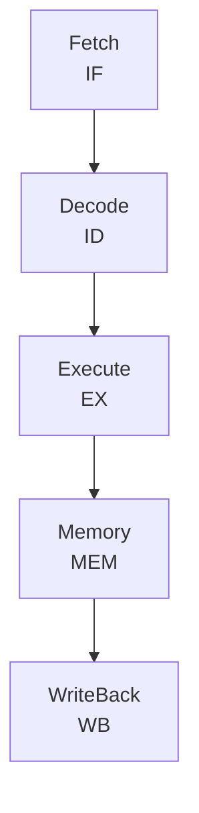

+++
title = "31. CPU Microarchitecture Optimization (HFT)"
date = 2026-01-21
description = "深入剖析CPU微架构对HFT性能的影响，包括流水线、乱序执行、ILP、µop缓存、分支预测等核心概念"
[taxonomies]
tags = ["C++", "CPU", "微架构", "性能优化", "HFT", "低延迟"]
+++

## 概述

理解CPU微架构是编写高性能代码的基础。在HFT系统中，微秒级的优化可能带来显著收益。本文深入剖析现代CPU的核心机制。

---

## 一、CPU流水线

### 1.1 经典五级流水线



| Clock | IF | ID | EX | MEM | WB |
|-------|----|----|----|----|-----|
| 1 | I1 | | | | |
| 2 | I2 | I1 | | | |
| 3 | I3 | I2 | I1 | | |
| 4 | I4 | I3 | I2 | I1 | |
| 5 | I5 | I4 | I3 | I2 | I1 |

**特性**：
- 理想情况：每个时钟周期完成一条指令
- 现代超标量CPU可以达到IPC > 1（多发射）
- 但由于依赖、缓存miss等，实际IPC往往低于理论峰值

### 1.2 现代超标量处理器

```
现代CPU（如Intel Skylake）每周期可以：
- 取指：16字节/周期
- 解码：4-6条指令/周期
- 执行：8个执行端口
- 退休：4-8条指令/周期

典型执行端口分配（Skylake）：
Port 0: ALU, 向量ALU, 分支
Port 1: ALU, 向量ALU, 浮点乘
Port 2: Load, AGU
Port 3: Load, AGU
Port 4: Store Data
Port 5: ALU, 向量Shuffle
Port 6: ALU, 分支
Port 7: Store AGU
```

### 1.3 流水线停顿（Stall）

```cpp
// 数据依赖导致停顿
int a = b + c;   // 1. 计算a
int d = a * 2;   // 2. 依赖a，必须等待1完成

// 解决：打破依赖链
int a = b + c;
int e = f + g;   // 独立计算，可以并行
int d = a * 2;

// 验证：使用perf
// perf stat -e cycles,stalled-cycles-frontend,stalled-cycles-backend ./app
```

---

## 二、乱序执行（Out-of-Order Execution）

### 2.1 基本原理

```
顺序程序：
1. load A      ; 100 cycles if cache miss
2. add B, C    ; 1 cycle
3. mul D, E    ; 4 cycles

顺序执行：100 + 1 + 4 = 105 cycles

乱序执行：
- 指令2和3不依赖指令1
- CPU可以在等待load时执行add和mul
- 总时间：~100 cycles（被load延迟掩盖）
```

### 2.2 重排序缓冲区（ROB）

```
ROB保证程序语义正确：
1. 指令可以乱序执行
2. 但必须顺序退休（Retire）
3. 发生异常时可以回滚

ROB大小影响乱序能力：
- Skylake: 224条目
- Zen 4: 320条目

ROB满时，前端停顿
```

### 2.3 寄存器重命名

```cpp
// 假依赖（False Dependency）
int eax = mem[a];    // 1. 使用eax
int ebx = eax + 1;   // 2. 使用eax
int eax = mem[b];    // 3. 重用eax寄存器（名称依赖）
int ecx = eax * 2;   // 4. 使用新的eax

// 寄存器重命名消除假依赖：
// 1. r100 = mem[a]
// 2. r101 = r100 + 1
// 3. r102 = mem[b]   // 使用不同的物理寄存器
// 4. r103 = r102 * 2
// 指令3可以与1并行执行
```

---

## 三、指令级并行（ILP）

### 3.1 提高ILP

```cpp
// 低ILP：长依赖链
int sum = 0;
for (int i = 0; i < n; ++i) {
    sum += arr[i];  // 每次迭代依赖上一次的sum
}

// 高ILP：循环展开+多累加器
int sum0 = 0, sum1 = 0, sum2 = 0, sum3 = 0;
for (int i = 0; i + 3 < n; i += 4) {
    sum0 += arr[i];
    sum1 += arr[i+1];
    sum2 += arr[i+2];
    sum3 += arr[i+3];
}
int sum = sum0 + sum1 + sum2 + sum3;
// 4条加法指令可以并行执行
```

### 3.2 依赖链分析

```cpp
// 依赖链长度决定最小延迟
// 加法延迟：1周期
// 乘法延迟：3-4周期

// 长依赖链
for (int i = 0; i < n; ++i) {
    x = x * a + b;  // 每次迭代：3-4周期
}
// 总延迟：n * 4周期

// 打破依赖
float x0 = 1.0f, x1 = 1.0f;
for (int i = 0; i < n; i += 2) {
    x0 = x0 * a + b;
    x1 = x1 * a + b;
}
// 两个独立链可以并行：n/2 * 4周期
```

---

## 四、分支预测

### 4.1 分支预测器类型

```
静态预测：
- 向后跳转预测为taken（循环）
- 向前跳转预测为not taken

动态预测：
- 2位饱和计数器
- 全局历史
- 局部历史
- TAGE (Tagged Geometric History)

现代CPU预测准确率 > 95%
错误预测代价：15-20周期
```

### 4.2 分支预测友好代码

```cpp
// 不友好：随机分支
for (int x : data) {
    if (x > threshold) {  // 难以预测
        process(x);
    }
}

// 友好：排序后处理
std::sort(data.begin(), data.end());
for (int x : data) {
    if (x > threshold) {  // 前半部分全false，后半部分全true
        process(x);
    }
}

// 或使用无分支代码
for (int x : data) {
    // 条件移动代替分支
    sum += (x > threshold) ? x : 0;
}
```

### 4.3 测量分支预测

```bash
# 使用perf
perf stat -e branches,branch-misses ./app

# 输出示例
#  1,234,567,890      branches
#     12,345,678      branch-misses      # 1.0% of all branches

# 高于2-3%的miss率值得优化
```

---

## 五、µop缓存

### 5.1 解码瓶颈

```
传统取指-解码：
- 复杂的x86指令需要多个周期解码
- 变长指令增加解码难度

µop缓存：
- 缓存已解码的micro-ops
- 跳过解码阶段
- 提高热代码的吞吐量

Skylake µop缓存：
- 1536条目（约6KB等效）
- 最多8条目/周期
```

### 5.2 代码布局优化

```cpp
// 保持热代码紧凑，适应µop缓存
void __attribute__((hot)) hotPath() {
    // 频繁执行的代码
}

void __attribute__((cold)) coldPath() {
    // 错误处理等冷代码
}

// 使用likely/unlikely
if (__builtin_expect(condition, 1)) {
    // 热路径
} else {
    // 冷路径
}
```

---

## 六、前端与后端瓶颈

### 6.1 识别瓶颈

```bash
# 使用perf的top-down方法
perf stat -e cpu-cycles,instructions,\
idq_uops_not_delivered.core,\
uops_issued.any,\
uops_retired.retire_slots,\
int_misc.recovery_cycles ./app

# Top-Down分析
# Frontend Bound: 取指/解码瓶颈
# Backend Bound: 执行单元/内存瓶颈
#   - Core Bound: 执行单元
#   - Memory Bound: 缓存/内存
# Bad Speculation: 分支预测错误
# Retiring: 有效工作
```

### 6.2 前端瓶颈

```
症状：
- 高stalled-cycles-frontend
- 低IPC但后端空闲

原因：
- 指令缓存miss
- µop缓存miss
- 复杂解码

解决：
- 减小代码大小
- 对齐热循环
- 使用简单指令
```

### 6.3 后端瓶颈

```
症状：
- 高stalled-cycles-backend
- 执行单元饱和或内存等待

原因：
- 数据依赖
- 内存延迟
- 执行单元竞争

解决：
- 打破依赖链
- 改善内存访问模式
- 平衡端口使用
```

---

## 七、perf c2c（Cache-to-Cache）

### 7.1 检测False Sharing

```bash
# 记录
perf c2c record ./app

# 报告
perf c2c report

# 输出关键指标
# Hitm: 从另一个核的缓存获取修改的数据
# 高Hitm表示可能存在false sharing
```

### 7.2 分析输出

```
=====================================
 Total Records          : 1234567
 Locked Load/Store Operations :
   Total  : 12345 ( 1.00%)
 Affected cache lines:
   With both Hit and Miss: 100
=====================================

 Shared Data Cache Line Table
 ------------------------------------------------------------------------------
           Rmt  Lcl   Tot     Hit    Miss    Pct   Record  %  Symbol
 0x7f0000000100:   1500  200  1700    1500   200  0.10%  getData()

 高Remote Hit表示数据在不同核之间频繁共享
```

---

## 八、HFT性能优化策略

### 8.1 整体策略

```cpp
// 1. 最小化延迟路径上的指令数
void fastPath(const Message& msg) {
    // 仅关键操作
    updateBook(msg);
    checkTrigger();
    // 非关键操作移到慢路径
}

// 2. 消除分支
inline int getPrice(Side side, int bid, int ask) {
    // 无分支：使用数组
    int prices[2] = {bid, ask};
    return prices[side];
}

// 3. 预取数据
void processMessages(const std::vector<Message>& msgs) {
    for (size_t i = 0; i < msgs.size(); ++i) {
        // 预取下一个消息
        if (i + 4 < msgs.size()) {
            __builtin_prefetch(&msgs[i + 4]);
        }
        process(msgs[i]);
    }
}
```

### 8.2 微观优化示例

```cpp
// 原始代码
bool isValidOrder(const Order& o) {
    if (o.price <= 0) return false;
    if (o.quantity <= 0) return false;
    if (o.symbol.empty()) return false;
    return true;
}

// 优化：减少分支
bool isValidOrder(const Order& o) {
    return (o.price > 0) & 
           (o.quantity > 0) & 
           (!o.symbol.empty());
    // 位与操作，无分支
}
```

---

## 总结

| 概念 | 影响 | 优化方法 |
|------|------|----------|
| 流水线停顿 | 降低IPC | 打破依赖链 |
| 乱序执行 | 隐藏延迟 | 增加独立操作 |
| 分支预测 | 15-20周期代价 | 无分支编程 |
| µop缓存 | 解码吞吐量 | 紧凑代码 |
| 前端瓶颈 | 指令供给 | 减小代码大小 |
| 后端瓶颈 | 执行/内存 | 内存优化 |

**HFT关键原则**：
1. 测量优先（perf stat/record）
2. 消除热路径分支
3. 打破长依赖链
4. 保持代码紧凑
5. 预取关键数据

---

## 相关文章

- [上一篇：Build Systems and Toolchain](/articles/cpp/cpp-30-C++构建系统与工具链/)
- [下一篇：Memory Hierarchy and Bandwidth (HFT)](/articles/cpp/cpp-32-HFT内存层次与带宽优化/)
