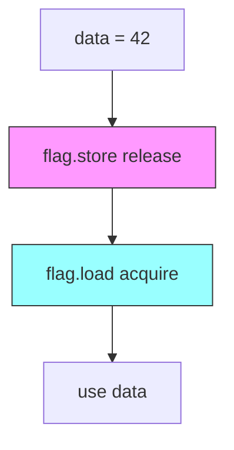

+++
title = "41. C++笔试题-并发编程"
date = 2026-01-31
weight = 41000
description = "C++并发编程笔试题：线程、互斥、原子操作、内存模型、条件变量"
[taxonomies]
tags = ["C++", "笔试", "并发", "多线程", "原子操作"]
+++

# C++ 笔试题 - 并发编程

本文汇集 C++ 并发编程相关的笔试题，覆盖线程管理、互斥量、原子操作、内存模型、条件变量等核心概念。

**难度标注**：★☆☆ 基础 | ★★☆ 中级 | ★★★ 困难

---

## 一、选择题

### 题目 1 ★☆☆

以下哪个不是 C++11 提供的线程同步机制？

A. `std::mutex`  
B. `std::condition_variable`  
C. `std::semaphore`  
D. `std::atomic`

<details>
<summary>查看答案与解析</summary>

**答案：C**

`std::semaphore` 是 C++20 才引入的。

**C++ 并发设施版本**：

| 版本 | 新增设施 |
|------|----------|
| C++11 | thread, mutex, condition_variable, atomic, future |
| C++14 | shared_timed_mutex |
| C++17 | shared_mutex, scoped_lock |
| C++20 | semaphore, latch, barrier, jthread |

</details>

---

### 题目 2 ★★☆

以下代码有什么问题？

```cpp
std::mutex mtx;
int counter = 0;

void increment() {
    mtx.lock();
    counter++;
    if (counter > 100) {
        throw std::runtime_error("too many");
    }
    mtx.unlock();
}
```

A. 编译错误  
B. 死锁  
C. 异常时锁未释放  
D. 没有问题

<details>
<summary>查看答案与解析</summary>

**答案：C**

**问题**：如果抛出异常，`mtx.unlock()` 不会被执行。

**修复**：使用 RAII 风格的锁管理。

```cpp
void increment_fixed() {
    std::lock_guard<std::mutex> lock(mtx);  // RAII
    counter++;
    if (counter > 100) {
        throw std::runtime_error("too many");
    }
    // 自动解锁，即使抛异常
}

// 或 C++17 的 scoped_lock
void increment_cpp17() {
    std::scoped_lock lock(mtx);
    counter++;
    // ...
}
```

</details>

---

### 题目 3 ★★☆

以下代码输出什么？

```cpp
std::atomic<int> x(0), y(0);
int r1, r2;

// Thread 1
void thread1() {
    x.store(1, std::memory_order_relaxed);
    r1 = y.load(std::memory_order_relaxed);
}

// Thread 2
void thread2() {
    y.store(1, std::memory_order_relaxed);
    r2 = x.load(std::memory_order_relaxed);
}

// 可能的 r1, r2 值？
```

A. r1=0, r2=0 不可能  
B. r1=1, r2=1 一定发生  
C. r1=0, r2=0 可能发生  
D. 只有 r1=0, r2=1 或 r1=1, r2=0

<details>
<summary>查看答案与解析</summary>

**答案：C**

**relaxed 内存序**：只保证原子性，不保证顺序。

可能的执行顺序：
```
Thread 1               Thread 2
--------               --------
                       y.store(1)
x.store(1)             
                       r2 = x.load()  // 看到 1
r1 = y.load()          // 看到 1

结果：r1=1, r2=1
```

```
Thread 1               Thread 2
--------               --------
r1 = y.load()          // 看到 0
                       r2 = x.load()  // 看到 0
x.store(1)
                       y.store(1)

结果：r1=0, r2=0  ← 也可能！
```

**所有可能结果**：
- r1=0, r2=0 ✓
- r1=0, r2=1 ✓
- r1=1, r2=0 ✓
- r1=1, r2=1 ✓

</details>

---

### 题目 4 ★★★

以下哪种情况会导致 `std::condition_variable::wait` 虚假唤醒？

A. 其他线程调用 `notify_one`  
B. 系统信号中断  
C. 硬件实现限制  
D. 以上都可能

<details>
<summary>查看答案与解析</summary>

**答案：D**

**虚假唤醒（Spurious Wakeup）**：
- wait 返回但条件未满足
- 可能由信号、硬件、系统实现引起
- C++ 标准允许这种情况

**正确使用方式**：

```cpp
std::mutex mtx;
std::condition_variable cv;
bool ready = false;

// 错误：可能虚假唤醒
void wait_wrong() {
    std::unique_lock<std::mutex> lock(mtx);
    cv.wait(lock);  // 可能虚假唤醒
    process();      // 条件可能未满足！
}

// 正确：使用谓词或循环
void wait_correct_1() {
    std::unique_lock<std::mutex> lock(mtx);
    cv.wait(lock, []{ return ready; });  // 带谓词
    process();
}

void wait_correct_2() {
    std::unique_lock<std::mutex> lock(mtx);
    while (!ready) {  // 循环检查
        cv.wait(lock);
    }
    process();
}
```

</details>

---

### 题目 5 ★★★

以下代码使用 `std::async` 的问题是什么？

```cpp
void fire_and_forget() {
    std::async(std::launch::async, []{ 
        heavy_computation();
    });
}  // 这里会阻塞！
```

A. 编译错误  
B. 内存泄漏  
C. 异步任务变成同步  
D. 没有问题

<details>
<summary>查看答案与解析</summary>

**答案：C**

**问题**：`std::async` 返回的 `future` 析构时会等待任务完成。

```cpp
void fire_and_forget() {
    auto future = std::async(std::launch::async, []{ 
        heavy_computation();  // 1秒
    });
    // future 析构时等待完成
}  // 阻塞 1 秒！
```

**解决方案**：

```cpp
// 方案 1：保存 future
class TaskManager {
    std::vector<std::future<void>> futures;
public:
    void submit(std::function<void()> task) {
        futures.push_back(
            std::async(std::launch::async, task));
    }
    
    ~TaskManager() {
        for (auto& f : futures) {
            f.wait();
        }
    }
};

// 方案 2：使用分离线程
void fire_and_forget_v2() {
    std::thread([]{ heavy_computation(); }).detach();
}

// 方案 3：C++20 jthread
void fire_and_forget_v3() {
    std::jthread([](std::stop_token st){ 
        heavy_computation();
    });
}
```

</details>

---

## 二、填空题

### 题目 6 ★☆☆

C++11 提供的锁管理类有：______ 用于独占锁，______ 用于可移动的锁，______ 用于读写锁的共享访问。

<details>
<summary>查看答案</summary>

**答案**：`lock_guard`、`unique_lock`、`shared_lock`（C++14）

```cpp
// lock_guard：简单 RAII，不可移动
{
    std::lock_guard<std::mutex> lock(mtx);
    // 临界区
}

// unique_lock：可移动，可手动解锁
{
    std::unique_lock<std::mutex> lock(mtx);
    // 可以 lock.unlock() 和 lock.lock()
    // 可以移动给其他函数
}

// shared_lock：共享锁（读锁）
{
    std::shared_lock<std::shared_mutex> lock(mtx);
    // 多个读者可同时持有
}

// C++17 scoped_lock：多锁无死锁
{
    std::scoped_lock lock(mtx1, mtx2, mtx3);
    // 自动按顺序锁定，避免死锁
}
```

</details>

---

### 题目 7 ★★☆

C++ 内存序从弱到强依次是：______ 、______ 、______ 、______ 、acq_rel、______ 。

<details>
<summary>查看答案</summary>

**答案**：relaxed、consume、acquire、release、seq_cst

| 内存序 | 保证 |
|--------|------|
| relaxed | 仅原子性 |
| consume | 数据依赖顺序（不推荐） |
| acquire | 后续读写不前移 |
| release | 之前读写不后移 |
| acq_rel | acquire + release |
| seq_cst | 全局顺序一致 |

```cpp
// relaxed：计数器
counter.fetch_add(1, std::memory_order_relaxed);

// release-acquire：发布-订阅
// 生产者
data = 42;
ready.store(true, std::memory_order_release);

// 消费者
while (!ready.load(std::memory_order_acquire));
assert(data == 42);  // 保证看到 42

// seq_cst：默认，最安全
flag.store(true);  // 默认 seq_cst
```

</details>

---

### 题目 8 ★★★

`std::atomic<T>` 的 ______ 操作可能失败并返回 false，而 ______ 操作总是成功。两者都用于实现 ______ 算法。

<details>
<summary>查看答案</summary>

**答案**：compare_exchange_weak、compare_exchange_strong、无锁（lock-free）

```cpp
std::atomic<int> value(0);

// weak 版本：可能虚假失败
int expected = 0;
while (!value.compare_exchange_weak(expected, 1)) {
    expected = 0;  // 重置期望值
}

// strong 版本：不会虚假失败
expected = 0;
if (value.compare_exchange_strong(expected, 1)) {
    // 成功
} else {
    // 真正失败，expected 被更新为当前值
}
```

**选择建议**：
- 循环中使用 weak（性能可能更好）
- 单次使用 strong（更简单）

</details>

---

## 三、简答题

### 题目 9 ★★☆

解释 C++ 原子操作的 happens-before 关系。

<details>
<summary>参考答案</summary>

**Happens-Before 定义**：
- 如果 A happens-before B，则 A 的效果对 B 可见
- 是内存模型的核心概念

**建立 Happens-Before 的方式**：

```cpp
// 1. 同一线程的顺序
a = 1;    // A
b = 2;    // B: A happens-before B

// 2. Release-Acquire 配对
// Thread 1
data = 42;
flag.store(true, std::memory_order_release);  // A

// Thread 2
while (!flag.load(std::memory_order_acquire));  // B
use(data);  // A happens-before B

// 3. 线程创建和 join
std::thread t([]{ work(); });  // A
t.join();                       // B: A happens-before B

// 4. mutex lock/unlock
mtx.lock();     // 之前的 unlock happens-before 这里
critical();
mtx.unlock();   // happens-before 之后的 lock
```

**图示**：



</details>

---

### 题目 10 ★★★

比较 `std::mutex` 和 `std::atomic` 的使用场景。

<details>
<summary>参考答案</summary>

**对比表**：

| 特性 | std::mutex | std::atomic |
|------|------------|-------------|
| 保护范围 | 任意复杂操作 | 单个变量 |
| 阻塞方式 | 可能睡眠 | 忙等待（CAS） |
| 开销 | 较大 | 较小 |
| 组合操作 | 可以 | 困难 |
| 优先级反转 | 可能 | 不会 |

**使用场景**：

```cpp
// atomic 适用：简单计数
std::atomic<int> counter(0);
void increment() {
    counter.fetch_add(1, std::memory_order_relaxed);
}

// atomic 适用：标志位
std::atomic<bool> stop_flag(false);
void worker() {
    while (!stop_flag.load(std::memory_order_acquire)) {
        do_work();
    }
}

// mutex 适用：复杂数据结构
std::mutex mtx;
std::map<std::string, int> data;

void update(const std::string& key, int value) {
    std::lock_guard<std::mutex> lock(mtx);
    data[key] = value;  // 复杂操作
}

// mutex 适用：多变量原子更新
void transfer(Account& from, Account& to, int amount) {
    std::scoped_lock lock(from.mtx, to.mtx);
    from.balance -= amount;
    to.balance += amount;
}
```

**性能考虑**：
```cpp
// 低竞争：atomic 更快
// 高竞争：mutex 可能更好（避免 CAS 重试）
// 临界区长：mutex 必须
```

</details>

---

## 四、编程题

### 题目 11 ★★☆

实现一个线程安全的计数器类。

<details>
<summary>参考答案</summary>

```cpp
#include <atomic>
#include <mutex>
#include <iostream>
#include <thread>
#include <vector>

// 版本 1：使用 mutex
class CounterMutex {
    mutable std::mutex mtx;
    int count = 0;
    
public:
    void increment() {
        std::lock_guard<std::mutex> lock(mtx);
        ++count;
    }
    
    void decrement() {
        std::lock_guard<std::mutex> lock(mtx);
        --count;
    }
    
    int get() const {
        std::lock_guard<std::mutex> lock(mtx);
        return count;
    }
};

// 版本 2：使用 atomic（推荐）
class CounterAtomic {
    std::atomic<int> count{0};
    
public:
    void increment() {
        count.fetch_add(1, std::memory_order_relaxed);
    }
    
    void decrement() {
        count.fetch_sub(1, std::memory_order_relaxed);
    }
    
    int get() const {
        return count.load(std::memory_order_relaxed);
    }
    
    // 条件增加
    bool increment_if_less_than(int max) {
        int current = count.load(std::memory_order_relaxed);
        while (current < max) {
            if (count.compare_exchange_weak(
                    current, current + 1,
                    std::memory_order_relaxed)) {
                return true;
            }
        }
        return false;
    }
};

// 版本 3：统计型计数器（per-thread + 合并）
class CounterSharded {
    struct alignas(64) Shard {
        std::atomic<int64_t> count{0};
    };
    
    static constexpr int NUM_SHARDS = 16;
    Shard shards[NUM_SHARDS];
    
    Shard& get_shard() {
        thread_local size_t tid = std::hash<std::thread::id>{}(
            std::this_thread::get_id());
        return shards[tid % NUM_SHARDS];
    }
    
public:
    void increment() {
        get_shard().count.fetch_add(1, std::memory_order_relaxed);
    }
    
    int64_t get() const {
        int64_t total = 0;
        for (int i = 0; i < NUM_SHARDS; i++) {
            total += shards[i].count.load(std::memory_order_relaxed);
        }
        return total;
    }
};

// 测试
int main() {
    CounterAtomic counter;
    std::vector<std::thread> threads;
    
    for (int i = 0; i < 10; i++) {
        threads.emplace_back([&counter] {
            for (int j = 0; j < 100000; j++) {
                counter.increment();
            }
        });
    }
    
    for (auto& t : threads) {
        t.join();
    }
    
    std::cout << "Count: " << counter.get() << std::endl;
    // 输出：Count: 1000000
    
    return 0;
}
```

</details>

---

### 题目 12 ★★★

实现一个线程安全的单例模式（Double-Checked Locking）。

<details>
<summary>参考答案</summary>

```cpp
#include <mutex>
#include <atomic>
#include <memory>

// 方法 1：C++11 局部静态变量（推荐）
class Singleton1 {
public:
    static Singleton1& getInstance() {
        static Singleton1 instance;  // C++11 保证线程安全
        return instance;
    }
    
    void doSomething() { /* ... */ }
    
private:
    Singleton1() = default;
    ~Singleton1() = default;
    Singleton1(const Singleton1&) = delete;
    Singleton1& operator=(const Singleton1&) = delete;
};

// 方法 2：Double-Checked Locking（学习用）
class Singleton2 {
    static std::atomic<Singleton2*> instance;
    static std::mutex mtx;
    
public:
    static Singleton2* getInstance() {
        Singleton2* tmp = instance.load(std::memory_order_acquire);
        if (tmp == nullptr) {
            std::lock_guard<std::mutex> lock(mtx);
            tmp = instance.load(std::memory_order_relaxed);
            if (tmp == nullptr) {
                tmp = new Singleton2();
                instance.store(tmp, std::memory_order_release);
            }
        }
        return tmp;
    }
    
private:
    Singleton2() = default;
};

std::atomic<Singleton2*> Singleton2::instance{nullptr};
std::mutex Singleton2::mtx;

// 方法 3：call_once
class Singleton3 {
    static std::unique_ptr<Singleton3> instance;
    static std::once_flag flag;
    
public:
    static Singleton3& getInstance() {
        std::call_once(flag, [] {
            instance.reset(new Singleton3());
        });
        return *instance;
    }
    
private:
    Singleton3() = default;
};

std::unique_ptr<Singleton3> Singleton3::instance;
std::once_flag Singleton3::flag;

// 使用
int main() {
    auto& s1 = Singleton1::getInstance();
    s1.doSomething();
    
    return 0;
}
```

</details>

---

### 题目 13 ★★★

实现一个生产者-消费者队列。

<details>
<summary>参考答案</summary>

```cpp
#include <queue>
#include <mutex>
#include <condition_variable>
#include <optional>
#include <atomic>

template<typename T>
class BlockingQueue {
    std::queue<T> queue;
    mutable std::mutex mtx;
    std::condition_variable not_empty;
    std::condition_variable not_full;
    size_t max_size;
    std::atomic<bool> closed{false};
    
public:
    explicit BlockingQueue(size_t max = 100) : max_size(max) {}
    
    // 阻塞式放入
    bool push(T item) {
        std::unique_lock<std::mutex> lock(mtx);
        not_full.wait(lock, [this] {
            return queue.size() < max_size || closed;
        });
        
        if (closed) return false;
        
        queue.push(std::move(item));
        not_empty.notify_one();
        return true;
    }
    
    // 非阻塞尝试放入
    bool try_push(T item) {
        std::unique_lock<std::mutex> lock(mtx);
        if (queue.size() >= max_size || closed) {
            return false;
        }
        
        queue.push(std::move(item));
        not_empty.notify_one();
        return true;
    }
    
    // 阻塞式取出
    std::optional<T> pop() {
        std::unique_lock<std::mutex> lock(mtx);
        not_empty.wait(lock, [this] {
            return !queue.empty() || closed;
        });
        
        if (queue.empty()) return std::nullopt;
        
        T item = std::move(queue.front());
        queue.pop();
        not_full.notify_one();
        return item;
    }
    
    // 非阻塞尝试取出
    std::optional<T> try_pop() {
        std::unique_lock<std::mutex> lock(mtx);
        if (queue.empty()) {
            return std::nullopt;
        }
        
        T item = std::move(queue.front());
        queue.pop();
        not_full.notify_one();
        return item;
    }
    
    // 关闭队列
    void close() {
        {
            std::lock_guard<std::mutex> lock(mtx);
            closed = true;
        }
        not_empty.notify_all();
        not_full.notify_all();
    }
    
    bool is_closed() const {
        return closed.load();
    }
    
    size_t size() const {
        std::lock_guard<std::mutex> lock(mtx);
        return queue.size();
    }
};

// 使用示例
#include <thread>
#include <iostream>

int main() {
    BlockingQueue<int> queue(10);
    
    // 生产者
    std::thread producer([&queue] {
        for (int i = 0; i < 100; i++) {
            queue.push(i);
            std::cout << "Produced: " << i << std::endl;
        }
        queue.close();
    });
    
    // 消费者
    std::thread consumer([&queue] {
        while (auto item = queue.pop()) {
            std::cout << "Consumed: " << *item << std::endl;
        }
    });
    
    producer.join();
    consumer.join();
    
    return 0;
}
```

</details>

---

## 五、Bug 分析题

### 题目 14 ★★☆

以下代码有什么问题？

```cpp
std::mutex mtx1, mtx2;

void thread1() {
    std::lock_guard<std::mutex> lock1(mtx1);
    std::this_thread::sleep_for(std::chrono::milliseconds(1));
    std::lock_guard<std::mutex> lock2(mtx2);
    // work
}

void thread2() {
    std::lock_guard<std::mutex> lock2(mtx2);
    std::this_thread::sleep_for(std::chrono::milliseconds(1));
    std::lock_guard<std::mutex> lock1(mtx1);
    // work
}
```

<details>
<summary>查看答案与解析</summary>

**问题**：死锁（锁顺序不一致）。

```
Thread 1: lock(mtx1) → wait → try lock(mtx2)
Thread 2: lock(mtx2) → wait → try lock(mtx1)
```

**修复**：

```cpp
// 方案 1：统一锁顺序
void thread1_fixed() {
    std::lock_guard<std::mutex> lock1(mtx1);
    std::lock_guard<std::mutex> lock2(mtx2);
    // work
}

void thread2_fixed() {
    std::lock_guard<std::mutex> lock1(mtx1);  // 先锁 mtx1
    std::lock_guard<std::mutex> lock2(mtx2);
    // work
}

// 方案 2：使用 std::lock（C++11）
void thread1_v2() {
    std::unique_lock<std::mutex> lock1(mtx1, std::defer_lock);
    std::unique_lock<std::mutex> lock2(mtx2, std::defer_lock);
    std::lock(lock1, lock2);  // 无死锁算法
    // work
}

// 方案 3：使用 scoped_lock（C++17，推荐）
void thread1_v3() {
    std::scoped_lock lock(mtx1, mtx2);  // 自动避免死锁
    // work
}
```

</details>

---

### 题目 15 ★★★

以下代码为什么可能出错？

```cpp
std::atomic<bool> ready(false);
int data = 0;

void producer() {
    data = 42;
    ready.store(true, std::memory_order_relaxed);
}

void consumer() {
    while (!ready.load(std::memory_order_relaxed));
    std::cout << data << std::endl;  // 可能不是 42！
}
```

<details>
<summary>查看答案与解析</summary>

**问题**：relaxed 内存序不保证 data 的可见性。

```
可能的执行顺序：
Producer:
  ready.store(true)  // 先于 data 写入对 consumer 可见
  data = 42

Consumer:
  ready.load() == true
  data 读取 → 可能是 0（未看到新值）
```

**修复**：使用 release-acquire。

```cpp
void producer_fixed() {
    data = 42;
    ready.store(true, std::memory_order_release);  // release
}

void consumer_fixed() {
    while (!ready.load(std::memory_order_acquire));  // acquire
    std::cout << data << std::endl;  // 保证是 42
}
```

**原理**：
- release 保证之前的写入不会重排到之后
- acquire 保证之后的读取不会重排到之前
- 形成 happens-before 关系

</details>

---

## 六、高频考点总结

| 考点 | 频率 | 难度 | 关键知识 |
|------|------|------|----------|
| mutex 使用 | ★★★ | ★☆☆ | lock_guard、RAII |
| 死锁避免 | ★★★ | ★★☆ | 锁顺序、scoped_lock |
| atomic 操作 | ★★★ | ★★☆ | CAS、fetch_add |
| 内存序 | ★★☆ | ★★★ | relaxed、acquire-release |
| condition_variable | ★★☆ | ★★☆ | 虚假唤醒 |
| 单例模式 | ★★☆ | ★★☆ | DCL、局部静态 |
| future/promise | ★★☆ | ★★☆ | async 陷阱 |

---

## 相关文章

- [上一篇：C++笔试题-内存与对象模型](@/articles/cpp/cpp-40-C++笔试题-内存与对象模型.md)
- [下一篇：C++笔试题-模板元编程](@/articles/cpp/cpp-42-C++笔试题-模板元编程.md)
