+++
title = "45 - 高性能 RPC 框架设计"
description = "深入解析 RPC 框架架构、序列化、传输层设计与性能优化"
date = 2025-02-07
updated = 2025-02-07
draft = false
[taxonomies]
tags = ["RPC", "C++", "高性能", "分布式", "网络编程", "gRPC", "brpc"]
[extra]
toc = true
comments = true
+++

## 一、RPC 概述

### 1.1 什么是 RPC

RPC（Remote Procedure Call，远程过程调用）是一种进程间通信方式，使得程序可以像调用本地函数一样调用远程服务器上的函数。


### 1.2 RPC 核心组件

| 组件 | 职责 |
|------|------|
| **IDL（接口定义语言）** | 定义服务接口和数据结构 |
| **序列化/反序列化** | 将对象转换为字节流 |
| **传输层** | 网络通信（TCP/UDP/RDMA） |
| **服务发现** | 定位远程服务地址 |
| **负载均衡** | 分发请求到多个实例 |
| **超时重试** | 处理网络异常 |

### 1.3 主流 RPC 框架对比

| 框架 | 开发者 | 语言 | 协议 | 特点 |
|------|--------|------|------|------|
| **gRPC** | Google | 多语言 | HTTP/2 + Protobuf | 跨语言，生态完善 |
| **brpc** | 百度 | C++ | 多协议 | 高性能，bthread |
| **Thrift** | Facebook | 多语言 | 自定义 | 灵活，多传输层 |
| **Dubbo** | 阿里 | Java | 多协议 | Java 生态 |
| **tRPC** | 腾讯 | 多语言 | 多协议 | 云原生 |

---

## 二、IDL 与代码生成

### 2.1 Protocol Buffers

```protobuf
// service.proto
syntax = "proto3";

package example;

// 请求消息
message EchoRequest {
    string message = 1;
    int32 count = 2;
}

// 响应消息
message EchoResponse {
    string result = 1;
    int64 timestamp = 2;
}

// 服务定义
service EchoService {
    // 普通 RPC
    rpc Echo(EchoRequest) returns (EchoResponse);
    
    // 服务端流式
    rpc ServerStream(EchoRequest) returns (stream EchoResponse);
    
    // 客户端流式
    rpc ClientStream(stream EchoRequest) returns (EchoResponse);
    
    // 双向流式
    rpc BidiStream(stream EchoRequest) returns (stream EchoResponse);
}
```

### 2.2 代码生成

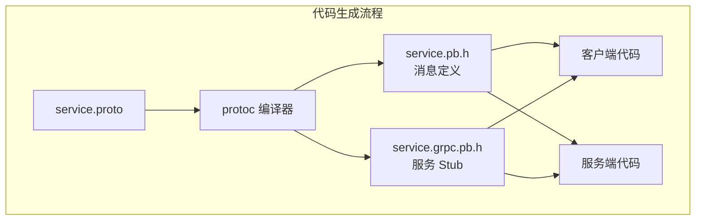

### 2.3 生成的代码结构

```cpp
// 生成的客户端 Stub
class EchoService::Stub {
public:
    grpc::Status Echo(
        grpc::ClientContext* context,
        const EchoRequest& request,
        EchoResponse* response
    );
    
    std::unique_ptr<grpc::ClientReader<EchoResponse>> ServerStream(
        grpc::ClientContext* context,
        const EchoRequest& request
    );
};

// 生成的服务端接口
class EchoService::Service {
public:
    virtual grpc::Status Echo(
        grpc::ServerContext* context,
        const EchoRequest* request,
        EchoResponse* response
    );
};
```

---

## 三、序列化技术

### 3.1 序列化方案对比

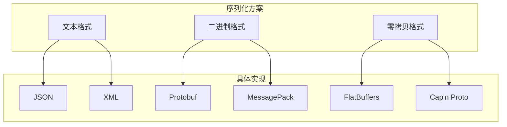

| 方案 | 序列化速度 | 反序列化速度 | 大小 | 可读性 |
|------|------------|--------------|------|--------|
| JSON | 慢 | 慢 | 大 | 高 |
| Protobuf | 快 | 快 | 小 | 低 |
| FlatBuffers | 极快 | 零拷贝 | 中 | 低 |
| MessagePack | 快 | 快 | 小 | 低 |

### 3.2 Protobuf 编码原理

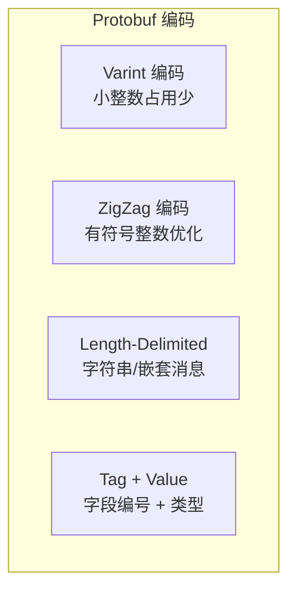

**Varint 编码示例**：

```
数值 1      -> 0x01            (1 字节)
数值 127    -> 0x7F            (1 字节)
数值 128    -> 0x80 0x01       (2 字节)
数值 16383  -> 0xFF 0x7F       (2 字节)
```

### 3.3 零拷贝序列化

FlatBuffers 的零拷贝优势：

```cpp
// FlatBuffers 零拷贝访问
const uint8_t* buffer = receive_data();

// 无需反序列化，直接访问
auto message = GetMessage(buffer);
auto name = message->name();  // 直接指向 buffer 中的数据
auto value = message->value();
```

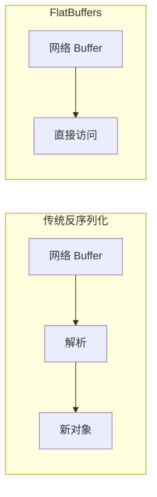

---

## 四、传输层设计

### 4.1 连接模型

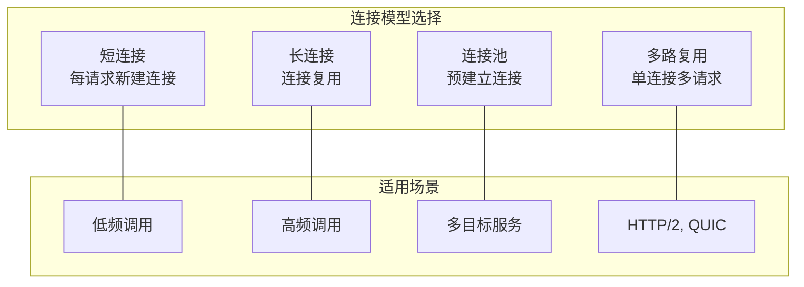

### 4.2 IO 模型

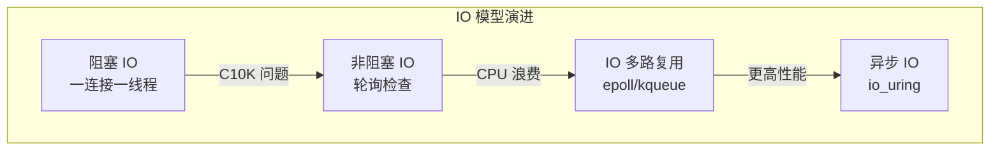

### 4.3 Reactor 模式

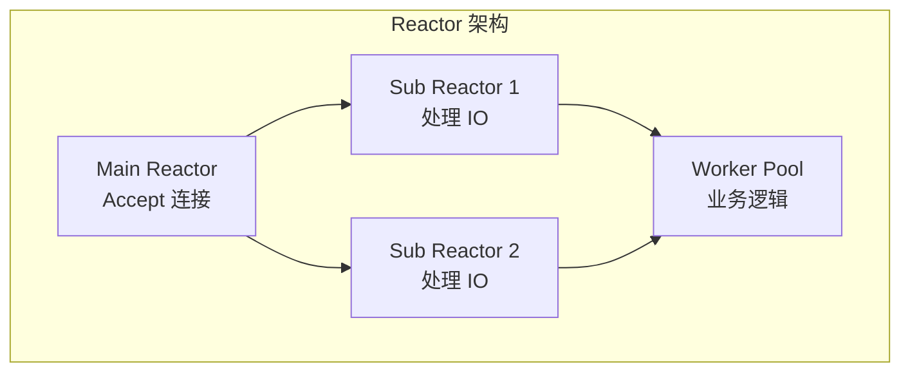

**实现代码框架**：

```cpp
class Reactor {
public:
    void run() {
        while (running_) {
            // 等待事件
            int n = epoll_wait(epfd_, events_, MAX_EVENTS, timeout_);
            
            for (int i = 0; i < n; i++) {
                auto* channel = static_cast<Channel*>(events_[i].data.ptr);
                
                if (events_[i].events & EPOLLIN) {
                    channel->handle_read();
                }
                if (events_[i].events & EPOLLOUT) {
                    channel->handle_write();
                }
            }
            
            // 处理定时器
            process_timers();
        }
    }
    
private:
    int epfd_;
    epoll_event events_[MAX_EVENTS];
    bool running_ = true;
};
```

### 4.4 线程模型对比

| 模型 | 描述 | 优缺点 |
|------|------|--------|
| **单线程** | 所有操作在一个线程 | 简单，无锁，但无法利用多核 |
| **线程池** | 请求分发到线程池 | 灵活，但有锁开销 |
| **每连接一线程** | 传统模型 | 简单，但连接多时资源消耗大 |
| **Reactor + 线程池** | IO 与计算分离 | 高性能，复杂 |
| **协程（bthread）** | 用户态调度 | 高并发，低开销 |

---

## 五、brpc 深度解析

### 5.1 brpc 架构

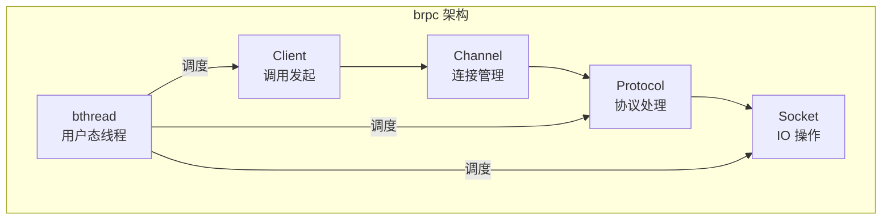

### 5.2 bthread 用户态线程

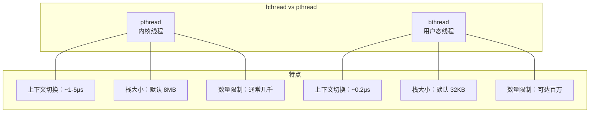

**bthread 调度原理**：

```cpp
// bthread 创建和调度
bthread_t tid;
bthread_start_background(&tid, nullptr, my_function, arg);

// 同步原语
bthread_mutex_t mutex;
bthread_mutex_lock(&mutex);
// 临界区
bthread_mutex_unlock(&mutex);

// 条件变量
bthread_cond_t cond;
bthread_cond_wait(&cond, &mutex);
bthread_cond_signal(&cond);
```

### 5.3 多协议支持

brpc 支持多种协议，自动识别：

| 协议 | 场景 |
|------|------|
| baidu_std | 百度内部标准 |
| http/h2 | 外部服务 |
| redis | 缓存访问 |
| memcache | 缓存访问 |
| thrift | 跨框架 |
| streaming | 流式通信 |

### 5.4 brpc 使用示例

**服务端**：

```cpp
#include <brpc/server.h>
#include "echo.pb.h"

class EchoServiceImpl : public EchoService {
public:
    void Echo(google::protobuf::RpcController* cntl_base,
              const EchoRequest* request,
              EchoResponse* response,
              google::protobuf::Closure* done) override {
        brpc::ClosureGuard done_guard(done);
        brpc::Controller* cntl = static_cast<brpc::Controller*>(cntl_base);
        
        // 业务逻辑
        response->set_message("Echo: " + request->message());
        
        // 可选：记录日志
        LOG(INFO) << "Received: " << request->message()
                  << " from " << cntl->remote_side();
    }
};

int main() {
    brpc::Server server;
    EchoServiceImpl service;
    
    if (server.AddService(&service, brpc::SERVER_DOESNT_OWN_SERVICE) != 0) {
        LOG(ERROR) << "Failed to add service";
        return -1;
    }
    
    brpc::ServerOptions options;
    options.num_threads = 8;
    
    if (server.Start(8000, &options) != 0) {
        LOG(ERROR) << "Failed to start server";
        return -1;
    }
    
    server.RunUntilAskedToQuit();
    return 0;
}
```

**客户端**：

```cpp
#include <brpc/channel.h>
#include "echo.pb.h"

int main() {
    brpc::Channel channel;
    brpc::ChannelOptions options;
    options.protocol = "baidu_std";
    options.timeout_ms = 100;
    options.max_retry = 3;
    
    if (channel.Init("127.0.0.1:8000", &options) != 0) {
        LOG(ERROR) << "Failed to init channel";
        return -1;
    }
    
    EchoService_Stub stub(&channel);
    
    EchoRequest request;
    EchoResponse response;
    brpc::Controller cntl;
    
    request.set_message("Hello");
    stub.Echo(&cntl, &request, &response, nullptr);
    
    if (cntl.Failed()) {
        LOG(ERROR) << "RPC failed: " << cntl.ErrorText();
    } else {
        LOG(INFO) << "Response: " << response.message();
    }
    
    return 0;
}
```

---

## 六、gRPC 深度解析

### 6.1 gRPC 架构

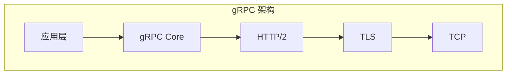

### 6.2 HTTP/2 多路复用

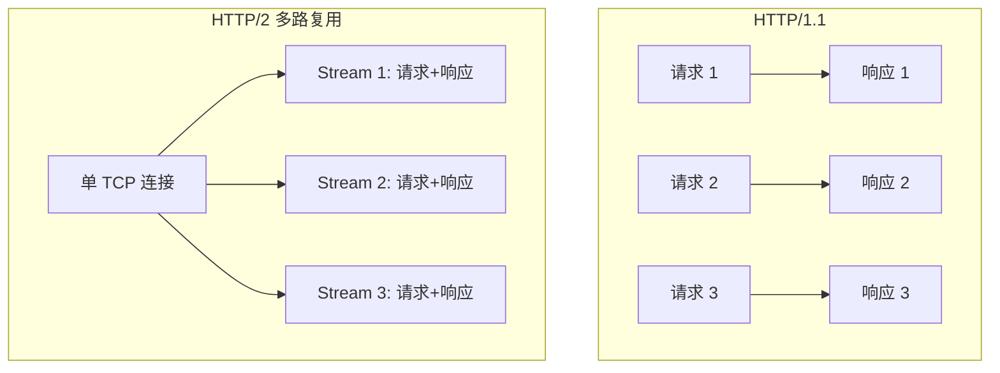

### 6.3 gRPC 异步模式

```cpp
class AsyncEchoClient {
public:
    void Echo(const std::string& message) {
        auto* call = new AsyncCall;
        call->request.set_message(message);
        
        call->response_reader = stub_->PrepareAsyncEcho(
            &call->context, call->request, &cq_
        );
        
        call->response_reader->StartCall();
        call->response_reader->Finish(
            &call->response, &call->status, (void*)call
        );
    }
    
    void AsyncCompleteRpc() {
        void* tag;
        bool ok = false;
        
        while (cq_.Next(&tag, &ok)) {
            auto* call = static_cast<AsyncCall*>(tag);
            
            if (call->status.ok()) {
                std::cout << "Response: " << call->response.message() << std::endl;
            }
            
            delete call;
        }
    }
    
private:
    struct AsyncCall {
        EchoRequest request;
        EchoResponse response;
        grpc::ClientContext context;
        grpc::Status status;
        std::unique_ptr<grpc::ClientAsyncResponseReader<EchoResponse>> response_reader;
    };
    
    std::unique_ptr<EchoService::Stub> stub_;
    grpc::CompletionQueue cq_;
};
```

---

## 七、性能优化

### 7.1 连接池设计

```cpp
class ConnectionPool {
public:
    ConnectionPool(const std::string& addr, size_t pool_size)
        : addr_(addr), pool_size_(pool_size) {
        for (size_t i = 0; i < pool_size_; i++) {
            connections_.push_back(create_connection());
        }
    }
    
    std::shared_ptr<Connection> acquire() {
        std::unique_lock<std::mutex> lock(mutex_);
        
        cv_.wait(lock, [this] { return !available_.empty(); });
        
        auto conn = available_.front();
        available_.pop();
        in_use_.insert(conn);
        
        return conn;
    }
    
    void release(std::shared_ptr<Connection> conn) {
        std::lock_guard<std::mutex> lock(mutex_);
        
        in_use_.erase(conn);
        available_.push(conn);
        cv_.notify_one();
    }
    
private:
    std::shared_ptr<Connection> create_connection();
    
    std::string addr_;
    size_t pool_size_;
    std::vector<std::shared_ptr<Connection>> connections_;
    std::queue<std::shared_ptr<Connection>> available_;
    std::set<std::shared_ptr<Connection>> in_use_;
    std::mutex mutex_;
    std::condition_variable cv_;
};
```

### 7.2 批量请求

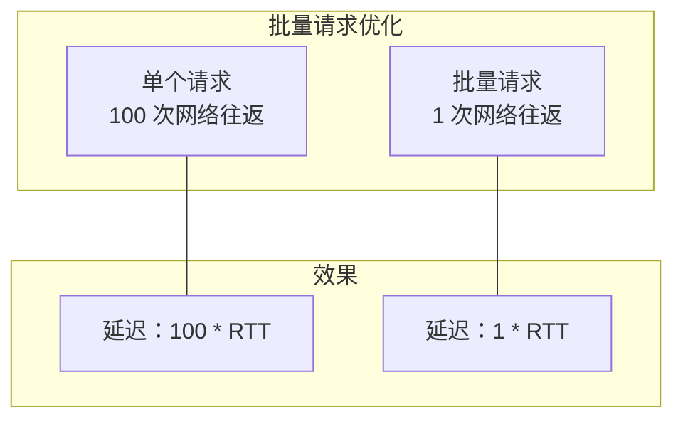

```cpp
class BatchClient {
public:
    void add_request(const Request& req) {
        std::lock_guard<std::mutex> lock(mutex_);
        pending_requests_.push_back(req);
        
        if (pending_requests_.size() >= batch_size_ ||
            now() - last_flush_ > max_delay_) {
            flush();
        }
    }
    
    void flush() {
        if (pending_requests_.empty()) return;
        
        BatchRequest batch;
        for (const auto& req : pending_requests_) {
            *batch.add_requests() = req;
        }
        
        // 批量发送
        stub_->BatchProcess(&cntl, &batch, &response, nullptr);
        
        pending_requests_.clear();
        last_flush_ = now();
    }
    
private:
    std::vector<Request> pending_requests_;
    size_t batch_size_ = 100;
    Duration max_delay_ = 10ms;
    TimePoint last_flush_;
    std::mutex mutex_;
};
```

### 7.3 零拷贝传输

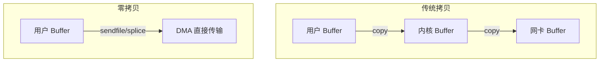

```cpp
// 使用 sendfile 零拷贝
ssize_t sendfile_zero_copy(int out_fd, int in_fd, off_t* offset, size_t count) {
    return sendfile(out_fd, in_fd, offset, count);
}

// 使用 MSG_ZEROCOPY
ssize_t send_zero_copy(int fd, const void* buf, size_t len) {
    return send(fd, buf, len, MSG_ZEROCOPY);
}
```

### 7.4 内存优化

```cpp
// 对象池减少内存分配
template<typename T>
class ObjectPool {
public:
    T* acquire() {
        std::lock_guard<std::mutex> lock(mutex_);
        if (free_list_.empty()) {
            return new T();
        }
        T* obj = free_list_.back();
        free_list_.pop_back();
        return obj;
    }
    
    void release(T* obj) {
        std::lock_guard<std::mutex> lock(mutex_);
        free_list_.push_back(obj);
    }
    
private:
    std::vector<T*> free_list_;
    std::mutex mutex_;
};

// 使用
ObjectPool<Request> request_pool;
Request* req = request_pool.acquire();
// 使用 req...
request_pool.release(req);
```

---

## 八、负载均衡

### 8.1 负载均衡策略

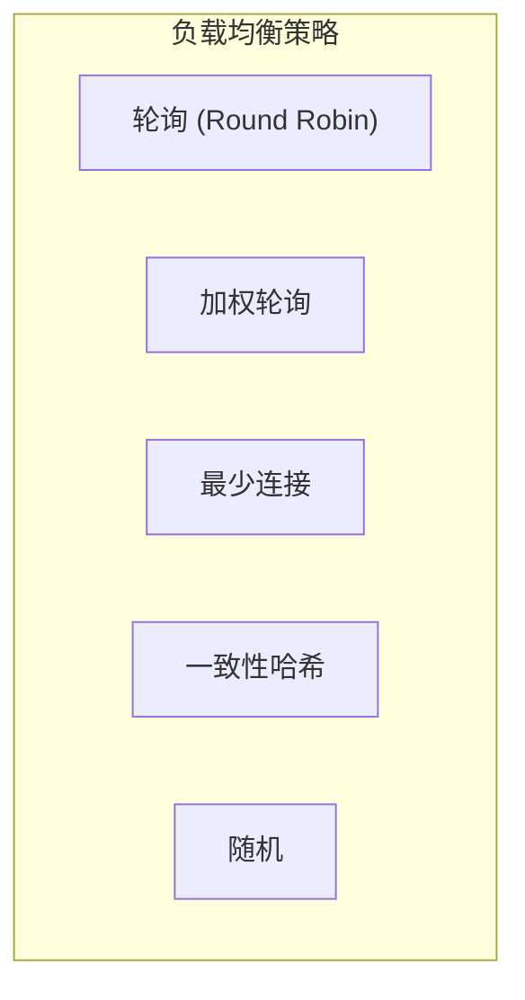

### 8.2 实现示例

```cpp
class LoadBalancer {
public:
    virtual std::shared_ptr<Endpoint> select(
        const std::vector<std::shared_ptr<Endpoint>>& endpoints,
        const Request& request
    ) = 0;
};

// 轮询
class RoundRobinLB : public LoadBalancer {
    std::atomic<size_t> counter_{0};
    
public:
    std::shared_ptr<Endpoint> select(
        const std::vector<std::shared_ptr<Endpoint>>& endpoints,
        const Request& request
    ) override {
        size_t idx = counter_.fetch_add(1) % endpoints.size();
        return endpoints[idx];
    }
};

// 一致性哈希
class ConsistentHashLB : public LoadBalancer {
    std::map<size_t, std::shared_ptr<Endpoint>> ring_;
    size_t virtual_nodes_ = 150;
    
public:
    void add_endpoint(std::shared_ptr<Endpoint> ep) {
        for (size_t i = 0; i < virtual_nodes_; i++) {
            size_t hash = std::hash<std::string>{}(
                ep->address() + "_" + std::to_string(i)
            );
            ring_[hash] = ep;
        }
    }
    
    std::shared_ptr<Endpoint> select(
        const std::vector<std::shared_ptr<Endpoint>>& endpoints,
        const Request& request
    ) override {
        size_t key_hash = std::hash<std::string>{}(request.key());
        auto it = ring_.lower_bound(key_hash);
        if (it == ring_.end()) {
            it = ring_.begin();
        }
        return it->second;
    }
};
```

---

## 九、可观测性

### 9.1 指标采集

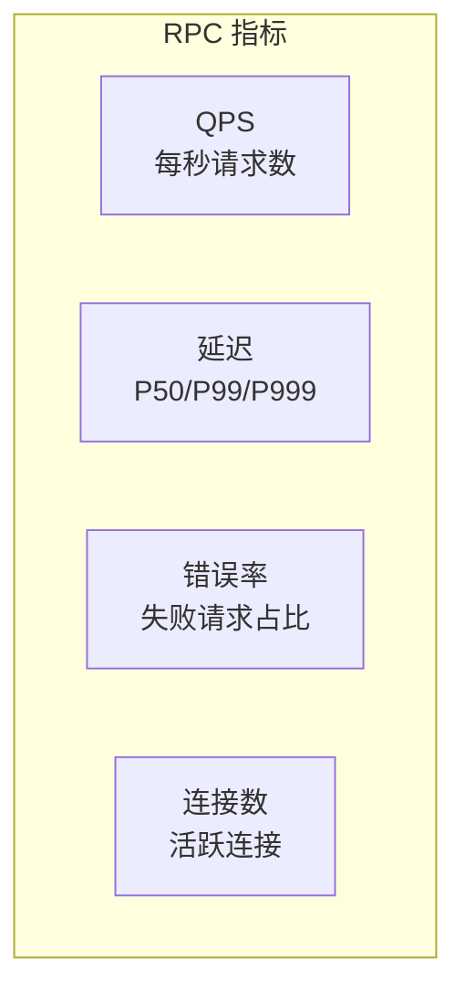

```cpp
class RpcMetrics {
public:
    void record_request(
        const std::string& method,
        Duration latency,
        bool success
    ) {
        auto& method_stats = stats_[method];
        method_stats.total_count++;
        method_stats.latency_sum += latency;
        
        if (!success) {
            method_stats.error_count++;
        }
        
        // 更新直方图
        method_stats.latency_histogram.add(latency.count());
    }
    
    double get_p99_latency(const std::string& method) {
        return stats_[method].latency_histogram.percentile(99);
    }
    
private:
    struct MethodStats {
        std::atomic<uint64_t> total_count{0};
        std::atomic<uint64_t> error_count{0};
        std::atomic<uint64_t> latency_sum{0};
        Histogram latency_histogram;
    };
    
    std::unordered_map<std::string, MethodStats> stats_;
};
```

### 9.2 链路追踪

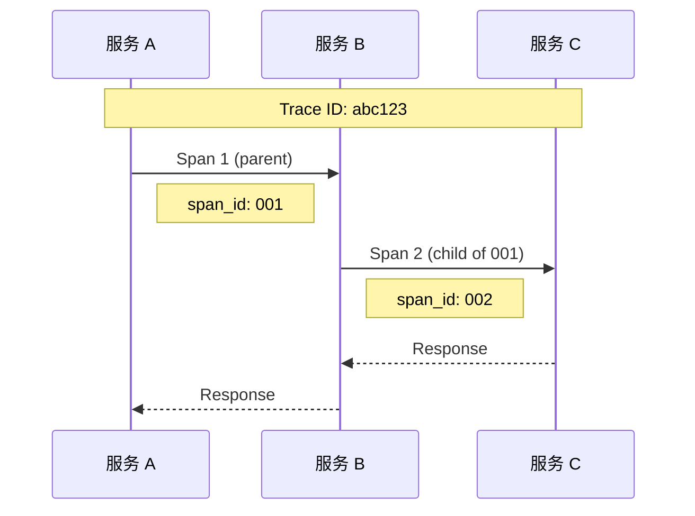

```cpp
class TraceContext {
public:
    std::string trace_id;
    std::string span_id;
    std::string parent_span_id;
    
    static TraceContext extract(const RpcMeta& meta) {
        TraceContext ctx;
        ctx.trace_id = meta.get("trace-id");
        ctx.span_id = generate_span_id();
        ctx.parent_span_id = meta.get("span-id");
        return ctx;
    }
    
    void inject(RpcMeta* meta) {
        meta->set("trace-id", trace_id);
        meta->set("span-id", span_id);
    }
};
```

---

## 十、最佳实践

### 10.1 设计建议

| 场景 | 建议 |
|------|------|
| 内部服务 | brpc/gRPC，Protobuf |
| 外部 API | gRPC-Web 或 REST |
| 低延迟 | brpc + bthread |
| 跨语言 | gRPC |
| 大量小请求 | 批量化 |

### 10.2 常见问题

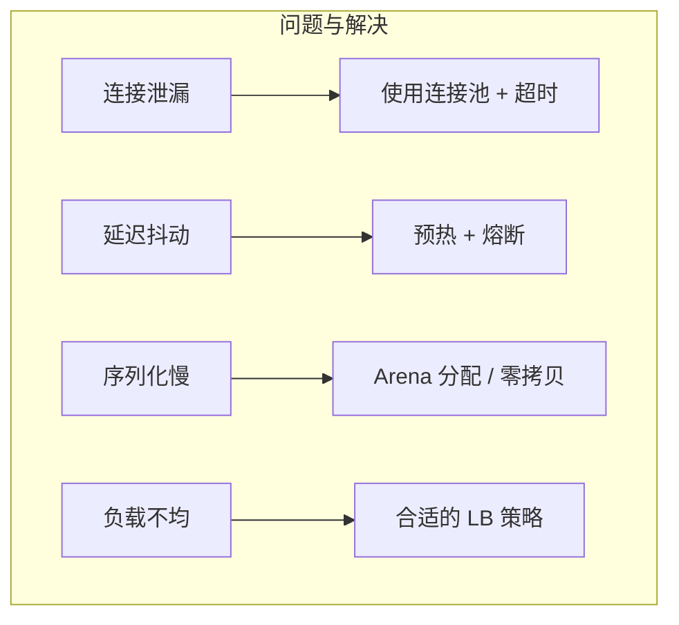

---

## 相关文章

- [17 - Lock-Free 数据结构详解](/articles/cpp/cpp-17-HFT-Lock-Free数据结构详解/)
- [15 - 自定义内存分配器设计](/articles/cpp/cpp-15-HFT自定义内存分配器设计/)
- [05 - 性能优化技术](/articles/cpp/cpp-05-性能优化技术/)
- [net-13 - 高性能网络架构](/articles/networking/net-13-高性能网络架构/)
