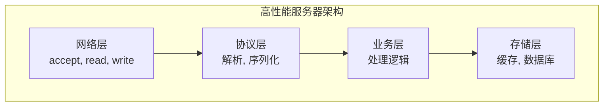
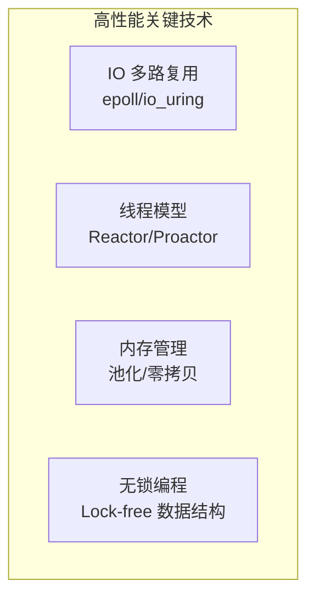
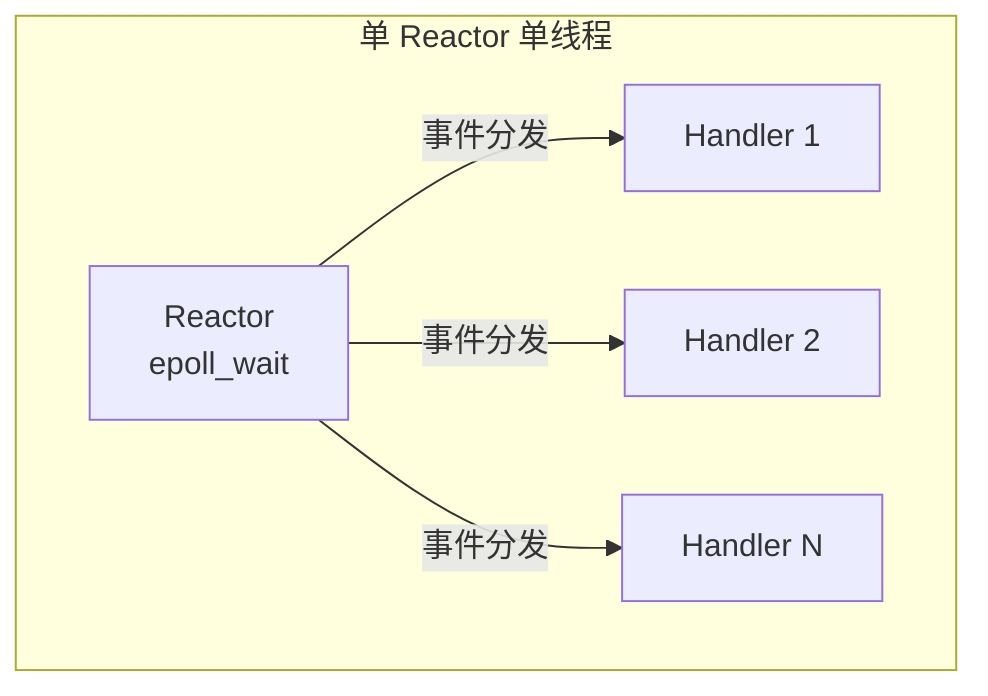
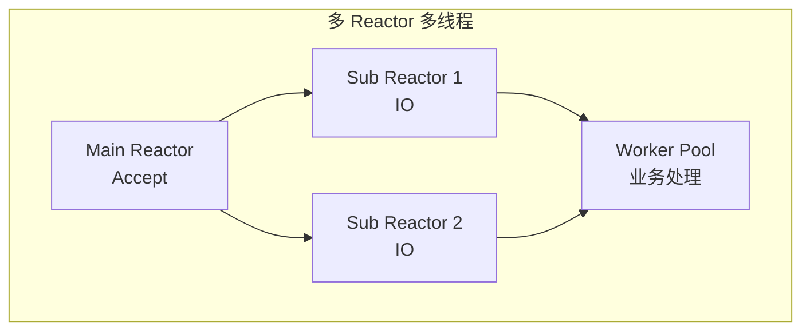
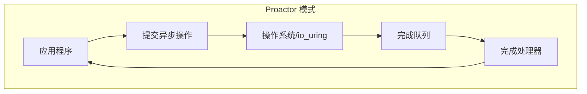
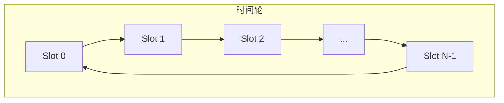

+++
title = "46. C++ 高性能服务器编程"
description = "从架构设计到实现细节，构建百万级并发的 C++ 网络服务器"
date = 2025-02-07
weight = 46000
updated = 2025-02-07
draft = false
[taxonomies]
tags = ["C++", "服务器", "高性能", "网络编程", "Reactor", "io_uring"]
[extra]
toc = true
comments = true
+++

## 一、高性能服务器架构

### 1.1 架构概览



### 1.2 性能指标

| 指标 | 含义 | 目标值 |
|------|------|--------|
| **QPS** | 每秒请求数 | 100K+ |
| **延迟** | 请求响应时间 | P99 < 10ms |
| **连接数** | 并发连接 | 100K+ |
| **吞吐** | 数据传输速率 | 10+ Gbps |

### 1.3 关键技术



---

## 二、IO 模型

### 2.1 IO 模型对比

| 模型 | 特点 | 适用场景 |
|------|------|----------|
| **阻塞 IO** | 简单，效率低 | 低并发 |
| **非阻塞 IO** | 轮询，CPU 浪费 | 特殊场景 |
| **IO 多路复用** | 高效，主流 | 高并发 |
| **异步 IO** | 最高效 | io_uring |

### 2.2 epoll 使用

```cpp
#include <sys/epoll.h>

class EpollPoller {
public:
    EpollPoller() {
        epfd_ = epoll_create1(EPOLL_CLOEXEC);
    }
    
    void add(int fd, uint32_t events, void* data) {
        epoll_event ev;
        ev.events = events;
        ev.data.ptr = data;
        epoll_ctl(epfd_, EPOLL_CTL_ADD, fd, &ev);
    }
    
    void modify(int fd, uint32_t events, void* data) {
        epoll_event ev;
        ev.events = events;
        ev.data.ptr = data;
        epoll_ctl(epfd_, EPOLL_CTL_MOD, fd, &ev);
    }
    
    void remove(int fd) {
        epoll_ctl(epfd_, EPOLL_CTL_DEL, fd, nullptr);
    }
    
    int wait(epoll_event* events, int maxEvents, int timeout) {
        return epoll_wait(epfd_, events, maxEvents, timeout);
    }
    
private:
    int epfd_;
};
```

### 2.3 io_uring

```cpp
#include <liburing.h>

class IoUring {
public:
    IoUring(unsigned entries = 256) {
        io_uring_queue_init(entries, &ring_, 0);
    }
    
    ~IoUring() {
        io_uring_queue_exit(&ring_);
    }
    
    // 提交读操作
    void submit_read(int fd, void* buf, size_t len, uint64_t user_data) {
        io_uring_sqe* sqe = io_uring_get_sqe(&ring_);
        io_uring_prep_read(sqe, fd, buf, len, 0);
        io_uring_sqe_set_data64(sqe, user_data);
    }
    
    // 提交写操作
    void submit_write(int fd, const void* buf, size_t len, uint64_t user_data) {
        io_uring_sqe* sqe = io_uring_get_sqe(&ring_);
        io_uring_prep_write(sqe, fd, buf, len, 0);
        io_uring_sqe_set_data64(sqe, user_data);
    }
    
    // 提交 accept
    void submit_accept(int fd, sockaddr* addr, socklen_t* len, uint64_t user_data) {
        io_uring_sqe* sqe = io_uring_get_sqe(&ring_);
        io_uring_prep_accept(sqe, fd, addr, len, 0);
        io_uring_sqe_set_data64(sqe, user_data);
    }
    
    // 提交所有操作
    int submit() {
        return io_uring_submit(&ring_);
    }
    
    // 等待完成
    int wait_cqe(io_uring_cqe** cqe) {
        return io_uring_wait_cqe(&ring_, cqe);
    }
    
    void cqe_seen(io_uring_cqe* cqe) {
        io_uring_cqe_seen(&ring_, cqe);
    }
    
private:
    io_uring ring_;
};
```

---

## 三、线程模型

### 3.1 Reactor 模式





### 3.2 Reactor 实现

```cpp
class EventLoop {
public:
    void loop() {
        while (!quit_) {
            epoll_event events[MAX_EVENTS];
            int n = poller_.wait(events, MAX_EVENTS, -1);
            
            for (int i = 0; i < n; i++) {
                auto* channel = static_cast<Channel*>(events[i].data.ptr);
                channel->handle_events(events[i].events);
            }
            
            // 处理待执行任务
            do_pending_functors();
        }
    }
    
    // 在事件循环中执行任务
    void run_in_loop(std::function<void()> func) {
        if (is_in_loop_thread()) {
            func();
        } else {
            queue_in_loop(std::move(func));
        }
    }
    
    void queue_in_loop(std::function<void()> func) {
        {
            std::lock_guard<std::mutex> lock(mutex_);
            pending_functors_.push_back(std::move(func));
        }
        wakeup();  // 唤醒事件循环
    }
    
private:
    void do_pending_functors() {
        std::vector<std::function<void()>> functors;
        {
            std::lock_guard<std::mutex> lock(mutex_);
            functors.swap(pending_functors_);
        }
        for (auto& func : functors) {
            func();
        }
    }
    
    EpollPoller poller_;
    bool quit_ = false;
    std::vector<std::function<void()>> pending_functors_;
    std::mutex mutex_;
};
```

### 3.3 Proactor 模式



---

## 四、连接管理

### 4.1 连接类设计

```cpp
class TcpConnection : public std::enable_shared_from_this<TcpConnection> {
public:
    enum State { kConnecting, kConnected, kDisconnecting, kDisconnected };
    
    TcpConnection(EventLoop* loop, int fd)
        : loop_(loop), fd_(fd), state_(kConnecting) {
        channel_ = std::make_unique<Channel>(loop, fd);
        channel_->set_read_callback([this] { handle_read(); });
        channel_->set_write_callback([this] { handle_write(); });
        channel_->set_close_callback([this] { handle_close(); });
    }
    
    void send(const std::string& data) {
        if (state_ == kConnected) {
            if (loop_->is_in_loop_thread()) {
                send_in_loop(data);
            } else {
                loop_->run_in_loop([this, data] { send_in_loop(data); });
            }
        }
    }
    
    void shutdown() {
        if (state_ == kConnected) {
            state_ = kDisconnecting;
            loop_->run_in_loop([this] { shutdown_in_loop(); });
        }
    }
    
private:
    void handle_read() {
        char buf[65536];
        ssize_t n = ::read(fd_, buf, sizeof(buf));
        
        if (n > 0) {
            input_buffer_.append(buf, n);
            if (message_callback_) {
                message_callback_(shared_from_this(), &input_buffer_);
            }
        } else if (n == 0) {
            handle_close();
        } else {
            handle_error();
        }
    }
    
    void handle_write() {
        if (channel_->is_writing()) {
            ssize_t n = ::write(fd_, output_buffer_.data(), output_buffer_.size());
            if (n > 0) {
                output_buffer_.erase(0, n);
                if (output_buffer_.empty()) {
                    channel_->disable_writing();
                    if (state_ == kDisconnecting) {
                        shutdown_in_loop();
                    }
                }
            }
        }
    }
    
    void send_in_loop(const std::string& data) {
        if (output_buffer_.empty()) {
            ssize_t n = ::write(fd_, data.data(), data.size());
            if (n < 0) {
                // 错误处理
            } else if (n < data.size()) {
                output_buffer_.append(data.data() + n, data.size() - n);
                channel_->enable_writing();
            }
        } else {
            output_buffer_.append(data);
        }
    }
    
    EventLoop* loop_;
    int fd_;
    State state_;
    std::unique_ptr<Channel> channel_;
    std::string input_buffer_;
    std::string output_buffer_;
    MessageCallback message_callback_;
};
```

### 4.2 连接池

```cpp
class ConnectionPool {
public:
    using ConnectionPtr = std::shared_ptr<TcpConnection>;
    
    ConnectionPtr acquire() {
        std::unique_lock<std::mutex> lock(mutex_);
        
        while (available_.empty() && current_size_ >= max_size_) {
            cv_.wait(lock);
        }
        
        if (!available_.empty()) {
            auto conn = available_.front();
            available_.pop();
            return conn;
        }
        
        // 创建新连接
        auto conn = create_connection();
        current_size_++;
        return conn;
    }
    
    void release(ConnectionPtr conn) {
        std::lock_guard<std::mutex> lock(mutex_);
        available_.push(conn);
        cv_.notify_one();
    }
    
private:
    std::queue<ConnectionPtr> available_;
    std::mutex mutex_;
    std::condition_variable cv_;
    size_t max_size_;
    size_t current_size_ = 0;
};
```

---

## 五、内存管理

### 5.1 对象池

```cpp
template<typename T>
class ObjectPool {
public:
    ObjectPool(size_t initial_size = 1024) {
        expand(initial_size);
    }
    
    T* acquire() {
        std::lock_guard<std::mutex> lock(mutex_);
        if (free_list_.empty()) {
            expand(capacity_);
        }
        T* obj = free_list_.back();
        free_list_.pop_back();
        return obj;
    }
    
    void release(T* obj) {
        obj->~T();  // 调用析构
        new (obj) T();  // 重新构造
        
        std::lock_guard<std::mutex> lock(mutex_);
        free_list_.push_back(obj);
    }
    
private:
    void expand(size_t count) {
        auto* block = static_cast<T*>(::operator new(count * sizeof(T)));
        blocks_.push_back(block);
        
        for (size_t i = 0; i < count; i++) {
            new (&block[i]) T();
            free_list_.push_back(&block[i]);
        }
        capacity_ += count;
    }
    
    std::vector<T*> blocks_;
    std::vector<T*> free_list_;
    std::mutex mutex_;
    size_t capacity_ = 0;
};
```

### 5.2 环形缓冲区

```cpp
class RingBuffer {
public:
    RingBuffer(size_t capacity)
        : buffer_(capacity), capacity_(capacity) {}
    
    size_t write(const char* data, size_t len) {
        size_t writable = capacity_ - size_;
        len = std::min(len, writable);
        
        size_t first_part = std::min(len, capacity_ - write_pos_);
        memcpy(&buffer_[write_pos_], data, first_part);
        
        if (len > first_part) {
            memcpy(&buffer_[0], data + first_part, len - first_part);
        }
        
        write_pos_ = (write_pos_ + len) % capacity_;
        size_ += len;
        return len;
    }
    
    size_t read(char* data, size_t len) {
        len = std::min(len, size_);
        
        size_t first_part = std::min(len, capacity_ - read_pos_);
        memcpy(data, &buffer_[read_pos_], first_part);
        
        if (len > first_part) {
            memcpy(data + first_part, &buffer_[0], len - first_part);
        }
        
        read_pos_ = (read_pos_ + len) % capacity_;
        size_ -= len;
        return len;
    }
    
    size_t size() const { return size_; }
    size_t capacity() const { return capacity_; }
    
private:
    std::vector<char> buffer_;
    size_t capacity_;
    size_t read_pos_ = 0;
    size_t write_pos_ = 0;
    size_t size_ = 0;
};
```

### 5.3 零拷贝发送

```cpp
// 使用 sendfile 零拷贝发送文件
ssize_t send_file(int out_fd, int in_fd, size_t count) {
    off_t offset = 0;
    return sendfile(out_fd, in_fd, &offset, count);
}

// 使用 writev 聚集写
ssize_t write_buffers(int fd, const std::vector<std::string>& buffers) {
    std::vector<iovec> iov(buffers.size());
    for (size_t i = 0; i < buffers.size(); i++) {
        iov[i].iov_base = const_cast<char*>(buffers[i].data());
        iov[i].iov_len = buffers[i].size();
    }
    return writev(fd, iov.data(), iov.size());
}
```

---

## 六、协议解析

### 6.1 长度前缀协议

```cpp
class LengthPrefixCodec {
public:
    // 编码
    static std::string encode(const std::string& message) {
        uint32_t len = htonl(message.size());
        std::string result(sizeof(len) + message.size(), '\0');
        memcpy(&result[0], &len, sizeof(len));
        memcpy(&result[sizeof(len)], message.data(), message.size());
        return result;
    }
    
    // 解码
    static bool decode(Buffer* buffer, std::string* message) {
        if (buffer->size() < sizeof(uint32_t)) {
            return false;  // 不够长度头
        }
        
        uint32_t len;
        memcpy(&len, buffer->data(), sizeof(len));
        len = ntohl(len);
        
        if (buffer->size() < sizeof(len) + len) {
            return false;  // 不够消息体
        }
        
        message->assign(buffer->data() + sizeof(len), len);
        buffer->consume(sizeof(len) + len);
        return true;
    }
};
```

### 6.2 HTTP 解析

```cpp
class HttpParser {
public:
    enum State {
        kRequestLine,
        kHeaders,
        kBody,
        kComplete
    };
    
    bool parse(Buffer* buffer) {
        while (buffer->size() > 0 && state_ != kComplete) {
            switch (state_) {
            case kRequestLine:
                if (!parse_request_line(buffer)) return false;
                state_ = kHeaders;
                break;
                
            case kHeaders:
                if (!parse_headers(buffer)) return false;
                if (content_length_ > 0) {
                    state_ = kBody;
                } else {
                    state_ = kComplete;
                }
                break;
                
            case kBody:
                if (!parse_body(buffer)) return false;
                state_ = kComplete;
                break;
                
            default:
                break;
            }
        }
        return state_ == kComplete;
    }
    
private:
    bool parse_request_line(Buffer* buffer) {
        auto* end = std::find(buffer->data(), 
                               buffer->data() + buffer->size(), '\n');
        if (end == buffer->data() + buffer->size()) {
            return false;
        }
        
        // 解析 "GET /path HTTP/1.1\r\n"
        std::string line(buffer->data(), end - 1);  // 去掉 \r
        buffer->consume(end - buffer->data() + 1);
        
        // 解析 method, path, version
        // ...
        
        return true;
    }
    
    bool parse_headers(Buffer* buffer);
    bool parse_body(Buffer* buffer);
    
    State state_ = kRequestLine;
    size_t content_length_ = 0;
    std::string method_;
    std::string path_;
    std::map<std::string, std::string> headers_;
    std::string body_;
};
```

---

## 七、定时器

### 7.1 时间轮



```cpp
class TimerWheel {
public:
    TimerWheel(size_t slots = 60, uint64_t slot_interval_ms = 1000)
        : slots_(slots), slot_interval_(slot_interval_ms), buckets_(slots) {}
    
    uint64_t add_timer(uint64_t delay_ms, std::function<void()> callback) {
        uint64_t expire = now_ms() + delay_ms;
        size_t slot = (current_slot_ + delay_ms / slot_interval_) % slots_;
        
        uint64_t id = next_id_++;
        buckets_[slot].emplace(id, Timer{expire, std::move(callback)});
        
        return id;
    }
    
    void cancel_timer(uint64_t id) {
        // 标记为取消（惰性删除）
        cancelled_.insert(id);
    }
    
    void tick() {
        auto& bucket = buckets_[current_slot_];
        uint64_t now = now_ms();
        
        for (auto it = bucket.begin(); it != bucket.end(); ) {
            if (cancelled_.count(it->first)) {
                cancelled_.erase(it->first);
                it = bucket.erase(it);
            } else if (it->second.expire <= now) {
                it->second.callback();
                it = bucket.erase(it);
            } else {
                ++it;
            }
        }
        
        current_slot_ = (current_slot_ + 1) % slots_;
    }
    
private:
    struct Timer {
        uint64_t expire;
        std::function<void()> callback;
    };
    
    size_t slots_;
    uint64_t slot_interval_;
    size_t current_slot_ = 0;
    uint64_t next_id_ = 0;
    std::vector<std::map<uint64_t, Timer>> buckets_;
    std::set<uint64_t> cancelled_;
};
```

### 7.2 timerfd 集成

```cpp
class TimerQueue {
public:
    TimerQueue(EventLoop* loop) : loop_(loop) {
        timerfd_ = timerfd_create(CLOCK_MONOTONIC, TFD_NONBLOCK | TFD_CLOEXEC);
        channel_ = std::make_unique<Channel>(loop, timerfd_);
        channel_->set_read_callback([this] { handle_read(); });
        channel_->enable_reading();
    }
    
    void add_timer(uint64_t delay_ms, std::function<void()> callback) {
        auto expire = std::chrono::steady_clock::now() + 
                      std::chrono::milliseconds(delay_ms);
        
        {
            std::lock_guard<std::mutex> lock(mutex_);
            timers_.emplace(expire, std::move(callback));
        }
        
        reset_timerfd();
    }
    
private:
    void handle_read() {
        uint64_t howmany;
        ::read(timerfd_, &howmany, sizeof(howmany));
        
        auto now = std::chrono::steady_clock::now();
        std::vector<std::function<void()>> expired;
        
        {
            std::lock_guard<std::mutex> lock(mutex_);
            auto end = timers_.upper_bound(now);
            for (auto it = timers_.begin(); it != end; ++it) {
                expired.push_back(std::move(it->second));
            }
            timers_.erase(timers_.begin(), end);
        }
        
        for (auto& cb : expired) {
            cb();
        }
        
        reset_timerfd();
    }
    
    void reset_timerfd() {
        std::lock_guard<std::mutex> lock(mutex_);
        if (timers_.empty()) return;
        
        auto earliest = timers_.begin()->first;
        auto now = std::chrono::steady_clock::now();
        auto duration = std::chrono::duration_cast<std::chrono::nanoseconds>(
            earliest - now);
        
        itimerspec its = {};
        its.it_value.tv_sec = duration.count() / 1000000000;
        its.it_value.tv_nsec = duration.count() % 1000000000;
        
        timerfd_settime(timerfd_, 0, &its, nullptr);
    }
    
    int timerfd_;
    EventLoop* loop_;
    std::unique_ptr<Channel> channel_;
    std::multimap<std::chrono::steady_clock::time_point, 
                  std::function<void()>> timers_;
    std::mutex mutex_;
};
```

---

## 八、性能优化

### 8.1 CPU 亲和性

```cpp
void set_cpu_affinity(int cpu_id) {
    cpu_set_t cpuset;
    CPU_ZERO(&cpuset);
    CPU_SET(cpu_id, &cpuset);
    
    pthread_setaffinity_np(pthread_self(), sizeof(cpuset), &cpuset);
}
```

### 8.2 NUMA 优化

```cpp
#include <numa.h>

void* numa_alloc_on_node(size_t size, int node) {
    return numa_alloc_onnode(size, node);
}
```

### 8.3 SO_REUSEPORT

```cpp
// 多进程/线程共享端口
int enable_reuseport(int fd) {
    int optval = 1;
    return setsockopt(fd, SOL_SOCKET, SO_REUSEPORT, 
                      &optval, sizeof(optval));
}
```

### 8.4 TCP 优化

```cpp
void optimize_socket(int fd) {
    // 禁用 Nagle 算法
    int flag = 1;
    setsockopt(fd, IPPROTO_TCP, TCP_NODELAY, &flag, sizeof(flag));
    
    // 启用 TCP Cork（批量发送）
    setsockopt(fd, IPPROTO_TCP, TCP_CORK, &flag, sizeof(flag));
    
    // 调整缓冲区大小
    int bufsize = 256 * 1024;
    setsockopt(fd, SOL_SOCKET, SO_RCVBUF, &bufsize, sizeof(bufsize));
    setsockopt(fd, SOL_SOCKET, SO_SNDBUF, &bufsize, sizeof(bufsize));
    
    // 启用 TCP 快速打开
    int qlen = 5;
    setsockopt(fd, IPPROTO_TCP, TCP_FASTOPEN, &qlen, sizeof(qlen));
}
```

---

## 九、监控与调试

### 9.1 指标收集

```cpp
class Metrics {
public:
    void record_request(double latency_ms, bool success) {
        request_count_.fetch_add(1, std::memory_order_relaxed);
        
        if (success) {
            success_count_.fetch_add(1, std::memory_order_relaxed);
        }
        
        // 更新延迟直方图
        latency_histogram_.add(latency_ms);
    }
    
    double get_qps() const {
        return request_count_.load() / elapsed_seconds();
    }
    
    double get_p99_latency() const {
        return latency_histogram_.percentile(99);
    }
    
private:
    std::atomic<uint64_t> request_count_{0};
    std::atomic<uint64_t> success_count_{0};
    Histogram latency_histogram_;
};
```

### 9.2 Prometheus 集成

```cpp
// 暴露 /metrics 端点
void serve_metrics(const HttpRequest& req, HttpResponse* resp) {
    std::ostringstream oss;
    
    oss << "# HELP requests_total Total requests\n";
    oss << "# TYPE requests_total counter\n";
    oss << "requests_total " << metrics.request_count() << "\n";
    
    oss << "# HELP request_duration_seconds Request duration\n";
    oss << "# TYPE request_duration_seconds histogram\n";
    for (auto& bucket : metrics.latency_buckets()) {
        oss << "request_duration_seconds_bucket{le=\"" 
            << bucket.first << "\"} " << bucket.second << "\n";
    }
    
    resp->set_body(oss.str());
    resp->set_content_type("text/plain");
}
```

---

## 十、完整示例

### 10.1 Echo Server

```cpp
class EchoServer {
public:
    EchoServer(int port, int num_threads = 4)
        : port_(port), num_threads_(num_threads) {
        
        // 创建主 Reactor
        main_loop_ = std::make_unique<EventLoop>();
        
        // 创建工作线程
        for (int i = 0; i < num_threads; i++) {
            auto loop = std::make_unique<EventLoop>();
            loops_.push_back(loop.get());
            threads_.emplace_back([l = std::move(loop)] { l->loop(); });
        }
    }
    
    void start() {
        // 创建监听 socket
        listen_fd_ = socket(AF_INET, SOCK_STREAM | SOCK_NONBLOCK, 0);
        
        int optval = 1;
        setsockopt(listen_fd_, SOL_SOCKET, SO_REUSEADDR, &optval, sizeof(optval));
        setsockopt(listen_fd_, SOL_SOCKET, SO_REUSEPORT, &optval, sizeof(optval));
        
        sockaddr_in addr = {};
        addr.sin_family = AF_INET;
        addr.sin_port = htons(port_);
        addr.sin_addr.s_addr = INADDR_ANY;
        
        bind(listen_fd_, (sockaddr*)&addr, sizeof(addr));
        listen(listen_fd_, SOMAXCONN);
        
        // 设置 accept 回调
        accept_channel_ = std::make_unique<Channel>(main_loop_.get(), listen_fd_);
        accept_channel_->set_read_callback([this] { handle_accept(); });
        accept_channel_->enable_reading();
        
        // 启动主循环
        main_loop_->loop();
    }
    
private:
    void handle_accept() {
        sockaddr_in client_addr;
        socklen_t len = sizeof(client_addr);
        
        int client_fd = accept4(listen_fd_, (sockaddr*)&client_addr, 
                                 &len, SOCK_NONBLOCK);
        
        if (client_fd >= 0) {
            // 选择工作线程
            EventLoop* loop = loops_[next_loop_++ % num_threads_];
            
            // 创建连接
            auto conn = std::make_shared<TcpConnection>(loop, client_fd);
            conn->set_message_callback([](auto conn, Buffer* buf) {
                // Echo: 原样返回
                conn->send(buf->retrieve_all_as_string());
            });
            
            connections_[client_fd] = conn;
        }
    }
    
    int port_;
    int num_threads_;
    int listen_fd_;
    
    std::unique_ptr<EventLoop> main_loop_;
    std::unique_ptr<Channel> accept_channel_;
    
    std::vector<EventLoop*> loops_;
    std::vector<std::thread> threads_;
    
    std::map<int, std::shared_ptr<TcpConnection>> connections_;
    size_t next_loop_ = 0;
};

int main() {
    EchoServer server(8080, 4);
    server.start();
    return 0;
}
```

---

## 相关文章

- [45 - 高性能 RPC 框架设计](@/articles/cpp/cpp-45-高性能RPC框架设计.md)
- [17 - Lock-Free 数据结构详解](@/articles/cpp/cpp-17-HFT-Lock-Free数据结构详解.md)
- [15 - 自定义内存分配器设计](@/articles/cpp/cpp-15-HFT自定义内存分配器设计.md)
- [net-13 - 高性能网络架构](@/articles/networking/net-13-高性能网络架构.md)
