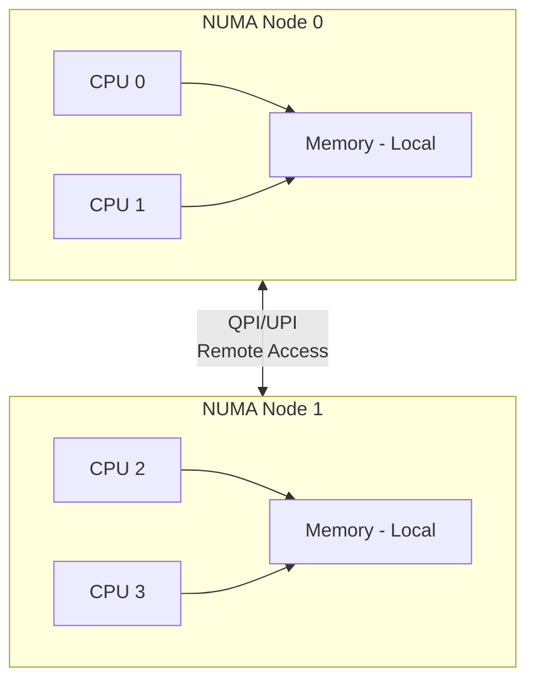

+++
title = "06.Linux系统性能调优深度指南"
date = 2026-01-12
description = "CPU Affinity、NUMA、HugePages、IRQ、内核参数的深度剖析与最佳实践"
[taxonomies]
tags = ["linux", "performance", "tuning", "kernel"]
+++

# Linux系统性能调优深度指南

本文深入剖析 Linux 系统性能调优的核心技术，涵盖 CPU 亲和性、NUMA 架构、大页内存、中断调优及内核参数优化。

---

## 一、CPU 亲和性（CPU Affinity）深度解析

### 1.1 为什么需要 CPU 亲和性

**问题背景**：
- 默认调度器会在 CPU 间迁移进程
- 每次迁移导致 L1/L2 缓存失效
- 缓存失效造成数百个时钟周期延迟

**缓存层级与延迟**：

| 缓存层级 | 典型大小 | 访问延迟 |
|---------|---------|---------|
| L1 Cache | 32-64KB | ~1ns (4 cycles) |
| L2 Cache | 256KB-1MB | ~3-4ns (12 cycles) |
| L3 Cache | 8-64MB | ~10-20ns (40 cycles) |
| 主内存 | GB 级 | ~60-100ns (200+ cycles) |

### 1.2 CPU 亲和性机制

**系统调用**：
```c
#include <sched.h>

// 获取亲和性
int sched_getaffinity(pid_t pid, size_t cpusetsize, cpu_set_t *mask);

// 设置亲和性
int sched_setaffinity(pid_t pid, size_t cpusetsize, const cpu_set_t *mask);
```

**CPU 掩码操作**：
```c
cpu_set_t mask;
CPU_ZERO(&mask);           // 清空
CPU_SET(0, &mask);         // 添加 CPU 0
CPU_SET(1, &mask);         // 添加 CPU 1
CPU_CLR(1, &mask);         // 移除 CPU 1
CPU_ISSET(0, &mask);       // 检查 CPU 0

// 应用到当前进程
sched_setaffinity(0, sizeof(mask), &mask);
```

### 1.3 命令行工具

**taskset**：
```bash
# 查看进程亲和性
taskset -p <pid>
# 输出: pid 1234's current affinity mask: f (CPU 0-3)

# 启动时绑定
taskset -c 0-3 ./my_app        # 绑定到 CPU 0-3
taskset 0x0f ./my_app          # 使用掩码

# 修改运行中进程
taskset -p -c 4-7 <pid>
```

**numactl**（同时控制 NUMA）：
```bash
numactl --physcpubind=0-3 ./my_app
numactl --cpunodebind=0 ./my_app   # 绑定到 NUMA 节点 0 的所有 CPU
```

### 1.4 cgroups v2 控制

```bash
# 创建 cgroup
mkdir /sys/fs/cgroup/my_app

# 设置 CPU 亲和性
echo "0-3" > /sys/fs/cgroup/my_app/cpuset.cpus
echo "0" > /sys/fs/cgroup/my_app/cpuset.mems  # NUMA 节点

# 添加进程
echo <pid> > /sys/fs/cgroup/my_app/cgroup.procs
```

### 1.5 isolcpus 内核参数

**隔离 CPU 核心**：
```bash
# /etc/default/grub
GRUB_CMDLINE_LINUX="isolcpus=4-7 nohz_full=4-7 rcu_nocbs=4-7"

# 更新并重启
update-grub && reboot
```

**参数解释**：
- `isolcpus=4-7`：从调度器中隔离 CPU 4-7
- `nohz_full=4-7`：禁用隔离 CPU 上的定时器中断
- `rcu_nocbs=4-7`：RCU 回调卸载到其他 CPU

**验证**：
```bash
cat /sys/devices/system/cpu/isolated
# 输出: 4-7

# 隔离的 CPU 只能通过 taskset 显式使用
taskset -c 4 ./latency_critical_app
```

### 1.6 线程亲和性编程

```c
#define _GNU_SOURCE
#include <pthread.h>
#include <sched.h>

void *thread_func(void *arg) {
    int cpu_id = *(int *)arg;
    
    cpu_set_t cpuset;
    CPU_ZERO(&cpuset);
    CPU_SET(cpu_id, &cpuset);
    
    pthread_t self = pthread_self();
    int ret = pthread_setaffinity_np(self, sizeof(cpuset), &cpuset);
    if (ret != 0) {
        perror("pthread_setaffinity_np");
    }
    
    // 验证
    CPU_ZERO(&cpuset);
    pthread_getaffinity_np(self, sizeof(cpuset), &cpuset);
    for (int i = 0; i < CPU_SETSIZE; i++) {
        if (CPU_ISSET(i, &cpuset)) {
            printf("Thread running on CPU %d\n", i);
        }
    }
    
    // 工作代码...
    return NULL;
}
```

### 1.7 最佳实践

```
1. 物理核心 vs 超线程
   - 延迟敏感：只使用物理核心
   - 吞吐量：可使用超线程
   
2. 核心分配策略
   - 关键进程：独占物理核心
   - 系统服务：集中到少数核心
   - 中断处理：单独核心

3. 验证效果
   - perf stat -e context-switches ./my_app
   - 监控 /proc/<pid>/status 的 voluntary_ctxt_switches
```

---

## 二、NUMA 架构深度剖析

### 2.1 NUMA 架构原理

**UMA vs NUMA**：

**UMA (Uniform Memory Access)**：所有 CPU 共享统一内存总线，访问延迟一致。

**NUMA (Non-Uniform Memory Access)**：



**访问延迟对比**：

| 访问类型 | 延迟 | 带宽 |
|---------|------|------|
| 本地内存 | ~80ns | 100% |
| 远程内存 (1 跳) | ~140ns | ~70% |
| 远程内存 (2 跳) | ~200ns | ~50% |

### 2.2 查看 NUMA 拓扑

```bash
# 硬件拓扑
numactl --hardware
# 输出示例:
# available: 2 nodes (0-1)
# node 0 cpus: 0 1 2 3 8 9 10 11
# node 0 size: 32768 MB
# node 0 free: 28000 MB
# node 1 cpus: 4 5 6 7 12 13 14 15
# node 1 size: 32768 MB
# node 1 free: 30000 MB
# node distances:
# node   0   1
#   0:  10  21
#   1:  21  10

# CPU 到 NUMA 节点映射
lscpu | grep -i numa
cat /sys/devices/system/node/node*/cpulist

# 可视化拓扑
lstopo --of png > topology.png
```

### 2.3 NUMA 内存策略

**系统调用**：
```c
#include <numaif.h>

// 内存策略
#define MPOL_DEFAULT    0  // 使用默认策略
#define MPOL_PREFERRED  1  // 优先特定节点
#define MPOL_BIND       2  // 绑定到特定节点
#define MPOL_INTERLEAVE 3  // 交织分配
#define MPOL_LOCAL      4  // 本地分配

// 设置进程内存策略
int set_mempolicy(int mode, const unsigned long *nodemask, unsigned long maxnode);

// 获取内存策略
int get_mempolicy(int *mode, unsigned long *nodemask, unsigned long maxnode,
                  void *addr, unsigned long flags);

// 迁移内存页
long migrate_pages(pid_t pid, unsigned long maxnode,
                   const unsigned long *old_nodes, const unsigned long *new_nodes);
```

**numactl 命令**：
```bash
# 绑定到节点 0
numactl --cpunodebind=0 --membind=0 ./my_app

# 优先使用节点 0
numactl --preferred=0 ./my_app

# 交织分配（适合大型共享数据结构）
numactl --interleave=all ./my_app

# 本地分配
numactl --localalloc ./my_app
```

### 2.4 NUMA 统计与监控

```bash
# 进程 NUMA 统计
numastat -p <pid>
# 输出:
#                   Node 0    Node 1
# numa_hit          1234567   890123
# numa_miss         1234      5678
# numa_foreign      5678      1234
# local_node        1234567   890123
# other_node        1234      5678

# 系统级统计
numastat
numastat -m  # 显示内存详情

# 内存迁移统计
cat /proc/vmstat | grep numa
```

**关键指标解释**：
- `numa_hit`：本地分配成功次数
- `numa_miss`：本地分配失败，分配到其他节点
- `numa_foreign`：其他节点分配到本节点
- `local_node`：本地分配次数
- `other_node`：远程分配次数

### 2.5 NUMA 相关内核参数

```bash
# /etc/sysctl.conf

# 禁用自动 NUMA 平衡（HFT 场景推荐）
kernel.numa_balancing = 0

# Zone reclaim 模式
# 0 = 禁用（推荐低延迟场景）
# 1 = 启用 zone reclaim
vm.zone_reclaim_mode = 0

# 控制脏页刷新的 NUMA 策略
vm.numa_zonelist_order = Node
```

**numa_balancing 详解**：
```
启用时：
- 内核自动检测远程访问
- 迁移内存页到访问它的 CPU 附近
- 迁移任务到内存附近

问题：
- 迁移过程有开销
- 延迟抖动
- 难以预测的行为

HFT 建议：禁用，手动控制
```

### 2.6 编程最佳实践

```c
#include <numa.h>

int main() {
    // 检查 NUMA 支持
    if (numa_available() < 0) {
        fprintf(stderr, "NUMA not available\n");
        exit(1);
    }
    
    // 获取节点数
    int num_nodes = numa_num_configured_nodes();
    printf("NUMA nodes: %d\n", num_nodes);
    
    // 绑定到节点 0
    struct bitmask *nodes = numa_allocate_nodemask();
    numa_bitmask_setbit(nodes, 0);
    numa_bind(nodes);
    
    // 在节点 0 分配内存
    size_t size = 1024 * 1024 * 1024;  // 1GB
    void *ptr = numa_alloc_onnode(size, 0);
    
    // 交织分配（适合多线程共享）
    void *interleaved = numa_alloc_interleaved(size);
    
    // 查询内存所在节点
    int node;
    get_mempolicy(&node, NULL, 0, ptr, MPOL_F_NODE | MPOL_F_ADDR);
    printf("Memory on node: %d\n", node);
    
    // 清理
    numa_free(ptr, size);
    numa_free(interleaved, size);
    numa_free_nodemask(nodes);
    
    return 0;
}
```

---

## 三、HugePages 深度解析

### 3.1 虚拟内存与 TLB

**页表层级**：
```
虚拟地址 (48-bit)
├── PGD (Page Global Directory) - 9 bits
│   └── PUD (Page Upper Directory) - 9 bits
│       └── PMD (Page Middle Directory) - 9 bits
│           └── PTE (Page Table Entry) - 9 bits
│               └── Offset - 12 bits (4KB page)
```

**TLB (Translation Lookaside Buffer)**：
- CPU 缓存虚拟地址到物理地址的映射
- TLB Miss 需要查询页表，代价高昂
- 典型 TLB 大小：L1 DTLB 64-128 条目

**TLB Miss 代价**：
```
4-level page walk: ~100 cycles
如果页表不在缓存: 数百 cycles
```

### 3.2 HugePages 原理

**页大小对比**：

| 页类型 | 大小 | 覆盖内存 (1000 条 TLB) |
|-------|------|----------------------|
| 标准页 | 4KB | 4MB |
| 大页 | 2MB | 2GB |
| 1GB 大页 | 1GB | 1TB |

**为什么 HugePages 更快**：
1. 减少 TLB 条目需求
2. 减少 page walk 层级（2MB 只需 3 级）
3. 减少页表内存占用

### 3.3 HugePages 配置

**静态 HugePages（2MB）**：
```bash
# 查看当前配置
cat /proc/meminfo | grep -i huge
# HugePages_Total:     128
# HugePages_Free:      128
# HugePages_Rsvd:        0
# HugePages_Surp:        0
# Hugepagesize:       2048 kB

# 临时配置
echo 1024 > /proc/sys/vm/nr_hugepages

# 永久配置
# /etc/sysctl.conf
vm.nr_hugepages = 1024

# NUMA 感知配置
echo 512 > /sys/devices/system/node/node0/hugepages/hugepages-2048kB/nr_hugepages
echo 512 > /sys/devices/system/node/node1/hugepages/hugepages-2048kB/nr_hugepages
```

**1GB HugePages**：
```bash
# 需要启动参数（启动后无法增加）
# /etc/default/grub
GRUB_CMDLINE_LINUX="default_hugepagesz=1G hugepagesz=1G hugepages=16"

# 更新并重启
update-grub && reboot

# 验证
cat /proc/meminfo | grep -i huge
```

### 3.4 hugetlbfs 挂载

```bash
# 创建挂载点
mkdir -p /mnt/hugepages

# 挂载
mount -t hugetlbfs nodev /mnt/hugepages

# 永久挂载
# /etc/fstab
nodev /mnt/hugepages hugetlbfs defaults 0 0

# 指定页大小
mount -t hugetlbfs -o pagesize=1G nodev /mnt/hugepages-1g
```

### 3.5 应用层使用

**mmap 方式**：
```c
#include <sys/mman.h>

#define HUGE_PAGE_SIZE (2 * 1024 * 1024)  // 2MB

void *alloc_hugepage(size_t size) {
    // 对齐到大页边界
    size_t aligned_size = (size + HUGE_PAGE_SIZE - 1) & ~(HUGE_PAGE_SIZE - 1);
    
    void *ptr = mmap(NULL, aligned_size,
                     PROT_READ | PROT_WRITE,
                     MAP_PRIVATE | MAP_ANONYMOUS | MAP_HUGETLB,
                     -1, 0);
    
    if (ptr == MAP_FAILED) {
        perror("mmap hugepage");
        return NULL;
    }
    
    // 预填充，确保物理内存分配
    memset(ptr, 0, aligned_size);
    
    return ptr;
}

// 1GB 页
void *alloc_1g_hugepage(size_t size) {
    void *ptr = mmap(NULL, size,
                     PROT_READ | PROT_WRITE,
                     MAP_PRIVATE | MAP_ANONYMOUS | MAP_HUGETLB | MAP_HUGE_1GB,
                     -1, 0);
    return ptr;
}
```

**hugetlbfs 文件方式**：
```c
int fd = open("/mnt/hugepages/myfile", O_CREAT | O_RDWR, 0600);
void *ptr = mmap(NULL, size, PROT_READ | PROT_WRITE, MAP_SHARED, fd, 0);
```

### 3.6 Transparent HugePages (THP)

```bash
# 查看状态
cat /sys/kernel/mm/transparent_hugepage/enabled
# [always] madvise never

# 配置选项
echo always > /sys/kernel/mm/transparent_hugepage/enabled  # 总是使用
echo madvise > /sys/kernel/mm/transparent_hugepage/enabled # 按需使用
echo never > /sys/kernel/mm/transparent_hugepage/enabled   # 禁用

# HFT 建议：禁用 THP
# 原因：碎片整理可能导致延迟抖动
echo never > /sys/kernel/mm/transparent_hugepage/enabled
echo never > /sys/kernel/mm/transparent_hugepage/defrag
```

**THP vs 静态 HugePages**：

| 特性 | THP | 静态 HugePages |
|-----|-----|---------------|
| 配置 | 自动 | 手动预留 |
| 碎片整理 | 运行时（有抖动） | 启动时 |
| 可预测性 | 低 | 高 |
| 适用场景 | 通用 | 低延迟 |

### 3.7 libhugetlbfs

```c
#include <hugetlbfs.h>

int main() {
    // 获取默认大页大小
    long hpage_size = gethugepagesize();
    printf("Huge page size: %ld\n", hpage_size);
    
    // 分配大页内存
    void *ptr = get_hugepage_region(1024 * 1024 * 1024, GHR_DEFAULT);
    if (ptr == NULL) {
        perror("get_hugepage_region");
        return 1;
    }
    
    // 使用内存...
    
    // 释放
    free_hugepage_region(ptr);
    
    return 0;
}

// 编译: gcc -lhugetlbfs myapp.c
// 运行: HUGETLB_MORECORE=yes LD_PRELOAD=libhugetlbfs.so ./a.out
```

---

## 四、IRQ 亲和性与调优

### 4.1 中断处理机制

```
硬件中断流程:
1. 设备产生中断信号
2. 中断控制器 (APIC) 路由到 CPU
3. CPU 暂停当前任务
4. 执行中断处理程序 (ISR)
5. 恢复被中断的任务

延迟来源:
- 中断响应: ~1-10μs
- 上下文切换: ~1-5μs
- ISR 执行时间: 取决于驱动
```

### 4.2 查看中断分布

```bash
# 查看所有中断
cat /proc/interrupts
#            CPU0       CPU1       CPU2       CPU3
#   0:         22          0          0          0   IO-APIC    2-edge      timer
#   8:          0          0          0          1   IO-APIC    8-edge      rtc0
#  18:          0          0          0          0   IO-APIC   18-fasteoi   i801_smbus
#  40:          0          0          0          0   PCI-MSI  524288-edge      nvme0q0
#  41:       8942          0          0          0   PCI-MSI  524289-edge      nvme0q1
# ...

# 查看特定设备中断
cat /proc/interrupts | grep eth0

# 查看 IRQ 亲和性
cat /proc/irq/<irq_number>/smp_affinity      # 掩码格式
cat /proc/irq/<irq_number>/smp_affinity_list # 列表格式
```

### 4.3 设置 IRQ 亲和性

```bash
# 设置单个 IRQ
echo 2 > /proc/irq/41/smp_affinity     # 绑定到 CPU 1 (掩码 0x2)
echo "0-3" > /proc/irq/41/smp_affinity_list  # 绑定到 CPU 0-3

# 批量设置网卡中断
for irq in $(grep eth0 /proc/interrupts | awk -F: '{print $1}'); do
    echo 2 > /proc/irq/$irq/smp_affinity
done

# 查看网卡队列对应的 IRQ
ls /sys/class/net/eth0/queues/
grep eth0 /proc/interrupts
```

### 4.4 网卡多队列（RSS）

```bash
# 查看网卡队列数
ethtool -l eth0
# Channel parameters for eth0:
# Pre-set maximums:
# RX:     0
# TX:     0
# Other:  1
# Combined:  63
# Current hardware settings:
# RX:     0
# TX:     0
# Other:  1
# Combined:  8

# 设置队列数
ethtool -L eth0 combined 16

# 查看 RSS 配置
ethtool -x eth0
# RX flow hash indirection table for eth0:
#     0:      0     1     2     3     4     5     6     7
#     8:      0     1     2     3     4     5     6     7
# ...

# 设置 RSS 哈希键
ethtool -X eth0 hkey <64-byte-hex-key>

# 设置哈希类型
ethtool -N eth0 rx-flow-hash tcp4 sdfn  # src/dst IP + src/dst port
```

### 4.5 RPS/RFS（软件层面）

**RPS (Receive Packet Steering)**：
```bash
# 启用 RPS，分散到 CPU 0-7
echo "ff" > /sys/class/net/eth0/queues/rx-0/rps_cpus

# 设置 RPS 流表大小
echo 32768 > /sys/class/net/eth0/queues/rx-0/rps_flow_cnt
echo 32768 > /proc/sys/net/core/rps_sock_flow_entries
```

**RFS (Receive Flow Steering)**：
```bash
# 启用 RFS
echo 32768 > /proc/sys/net/core/rps_sock_flow_entries
echo 2048 > /sys/class/net/eth0/queues/rx-0/rps_flow_cnt
```

### 4.6 irqbalance 服务

```bash
# 查看状态
systemctl status irqbalance

# 禁用（HFT 场景）
systemctl stop irqbalance
systemctl disable irqbalance

# 配置文件 /etc/sysconfig/irqbalance
IRQBALANCE_ONESHOT=yes
IRQBALANCE_BANNED_CPUS="0000ff00"  # 禁止使用 CPU 8-15
```

### 4.7 中断合并（Interrupt Coalescing）

```bash
# 查看当前配置
ethtool -c eth0
# Coalesce parameters for eth0:
# rx-usecs: 3
# rx-frames: 0
# tx-usecs: 3
# tx-frames: 0

# 设置中断合并
# 低延迟：减少合并
ethtool -C eth0 rx-usecs 0 tx-usecs 0

# 高吞吐：增加合并
ethtool -C eth0 rx-usecs 100 rx-frames 64
```

**权衡**：
- 中断合并少 → 延迟低，CPU 使用高
- 中断合并多 → 延迟高，CPU 使用低

### 4.8 最佳实践配置脚本

```bash
#!/bin/bash
# irq_tuning.sh - HFT 中断调优脚本

IFACE=eth0
TRADING_CPUS="4-7"    # 交易进程使用的 CPU
IRQ_CPUS="0-3"        # 中断处理使用的 CPU

# 禁用 irqbalance
systemctl stop irqbalance

# 设置网卡中断亲和性
irqs=$(grep $IFACE /proc/interrupts | awk -F: '{print $1}')
cpu=0
for irq in $irqs; do
    # 循环分配到 IRQ_CPUS
    echo $cpu > /proc/irq/$irq/smp_affinity_list
    cpu=$((($cpu + 1) % 4))
done

# 禁用中断合并
ethtool -C $IFACE rx-usecs 0 tx-usecs 0 rx-frames 1 tx-frames 1

# 禁用 adaptive 中断合并
ethtool -C $IFACE adaptive-rx off adaptive-tx off

echo "IRQ tuning completed for $IFACE"
```

---

## 五、内核参数深度调优

### 5.1 调度器参数

```bash
# /etc/sysctl.conf

# 调度粒度（纳秒）
kernel.sched_min_granularity_ns = 10000000   # 最小时间片 10ms
kernel.sched_wakeup_granularity_ns = 15000000 # 唤醒粒度 15ms
kernel.sched_migration_cost_ns = 5000000     # 迁移代价 5ms

# 调度策略
kernel.sched_autogroup_enabled = 0  # 禁用自动分组
kernel.sched_child_runs_first = 0   # 父进程先运行

# 实时调度
kernel.sched_rt_runtime_us = -1     # 允许 RT 进程使用 100% CPU
```

### 5.2 内存参数

```bash
# 交换行为
vm.swappiness = 0                   # 尽量不使用 swap
vm.vfs_cache_pressure = 50          # 缓存回收压力

# 脏页控制
vm.dirty_ratio = 10                 # 触发同步写的脏页比例
vm.dirty_background_ratio = 5       # 后台刷新的脏页比例
vm.dirty_expire_centisecs = 500     # 脏页过期时间 5s
vm.dirty_writeback_centisecs = 100  # 刷新间隔 1s

# 内存过量提交
vm.overcommit_memory = 1            # 允许过量提交
vm.overcommit_ratio = 80            # 过量提交比例

# OOM 行为
vm.panic_on_oom = 0                 # OOM 不触发 panic
vm.oom_kill_allocating_task = 1     # 杀死分配内存的任务

# 透明大页
vm.nr_hugepages = 1024              # 静态大页数量
```

### 5.3 网络参数

```bash
# 缓冲区大小
net.core.rmem_max = 134217728       # 接收缓冲区最大 128MB
net.core.wmem_max = 134217728       # 发送缓冲区最大 128MB
net.core.rmem_default = 16777216    # 默认接收缓冲区 16MB
net.core.wmem_default = 16777216    # 默认发送缓冲区 16MB

# TCP 缓冲区
net.ipv4.tcp_rmem = 4096 87380 134217728  # 最小 默认 最大
net.ipv4.tcp_wmem = 4096 65536 134217728

# 连接队列
net.core.netdev_max_backlog = 250000     # 网卡队列长度
net.core.somaxconn = 65535               # listen 队列长度
net.ipv4.tcp_max_syn_backlog = 65535     # SYN 队列长度

# TCP 优化
net.ipv4.tcp_timestamps = 0         # 禁用时间戳（低延迟）
net.ipv4.tcp_sack = 0               # 禁用 SACK（低延迟）
net.ipv4.tcp_low_latency = 1        # 低延迟模式
net.ipv4.tcp_fastopen = 3           # 启用 TCP Fast Open
net.ipv4.tcp_nodelay = 1            # 禁用 Nagle

# TIME_WAIT 优化
net.ipv4.tcp_tw_reuse = 1           # 重用 TIME_WAIT
net.ipv4.tcp_fin_timeout = 15       # FIN 超时时间
net.ipv4.tcp_max_tw_buckets = 262144

# 拥塞控制
net.ipv4.tcp_congestion_control = bbr  # 使用 BBR
net.core.default_qdisc = fq            # 配合 BBR
```

### 5.4 文件系统参数

```bash
# 文件句柄
fs.file-max = 2097152               # 系统最大文件句柄
fs.nr_open = 2097152                # 单进程最大

# inotify
fs.inotify.max_user_watches = 524288
fs.inotify.max_user_instances = 1024

# AIO
fs.aio-max-nr = 1048576
```

### 5.5 安全与限制

```bash
# /etc/security/limits.conf
* soft nofile 1048576
* hard nofile 1048576
* soft nproc 65535
* hard nproc 65535
* soft memlock unlimited
* hard memlock unlimited

# 核心转储
kernel.core_uses_pid = 1
kernel.core_pattern = /var/crash/core.%e.%p.%t
```

### 5.6 启动参数优化

```bash
# /etc/default/grub
GRUB_CMDLINE_LINUX="
    isolcpus=4-7
    nohz_full=4-7
    rcu_nocbs=4-7
    intel_pstate=disable
    processor.max_cstate=1
    intel_idle.max_cstate=0
    idle=poll
    nosoftlockup
    transparent_hugepage=never
    default_hugepagesz=1G
    hugepagesz=1G
    hugepages=16
    skew_tick=1
    tsc=reliable
    clocksource=tsc
    nmi_watchdog=0
    audit=0
    mce=off
"
```

**参数解释**：
- `intel_pstate=disable`：禁用 Intel P-State 驱动
- `processor.max_cstate=1`：限制 C-State 深度
- `idle=poll`：禁用空闲进入低功耗（极端低延迟）
- `skew_tick=1`：错开定时器中断
- `nmi_watchdog=0`：禁用 NMI watchdog
- `audit=0`：禁用审计
- `mce=off`：禁用 MCE 检查

### 5.7 应用所有参数

```bash
# 应用 sysctl
sysctl -p

# 验证
sysctl -a | grep <param_name>

# 持久化 GRUB
update-grub && reboot
```

---

## 六、综合调优检查清单

```
□ CPU
  □ 关键进程使用 isolcpus 隔离的核心
  □ 禁用超线程或只使用物理核心
  □ 禁用 C-States 和 P-States
  
□ NUMA
  □ 进程和内存绑定到同一节点
  □ 禁用 numa_balancing
  □ zone_reclaim_mode = 0
  
□ 内存
  □ 使用静态 HugePages
  □ 禁用 THP
  □ swappiness = 0
  □ 内存锁定 (mlockall)
  
□ 中断
  □ 禁用 irqbalance
  □ 网卡中断绑定到非关键核心
  □ 禁用中断合并
  
□ 网络
  □ 调大缓冲区
  □ 禁用 timestamps/sack
  □ 启用 tcp_low_latency
  
□ 内核
  □ 启动参数优化
  □ 提高文件句柄限制
  □ 调整调度器参数
```

---

## 参考资料

- [Linux Kernel Documentation](https://www.kernel.org/doc/html/latest/)
- [Red Hat Performance Tuning Guide](https://access.redhat.com/documentation/en-us/red_hat_enterprise_linux/8/html/monitoring_and_managing_system_status_and_performance/)
- [Brendan Gregg's Linux Performance](http://www.brendangregg.com/linuxperf.html)
- [NUMA Best Practices for AMD EPYC](https://developer.amd.com/resources/epyc-resources/)

---

## 相关文章

- [上一篇：Linux系统诊断工具深度指南](/articles/devops/linux-05-系统诊断工具指南/)
- [下一篇：Linux存储技术深度指南](/articles/devops/linux-07-存储技术指南/)
