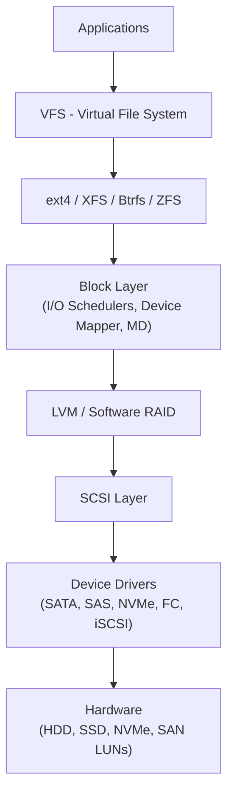
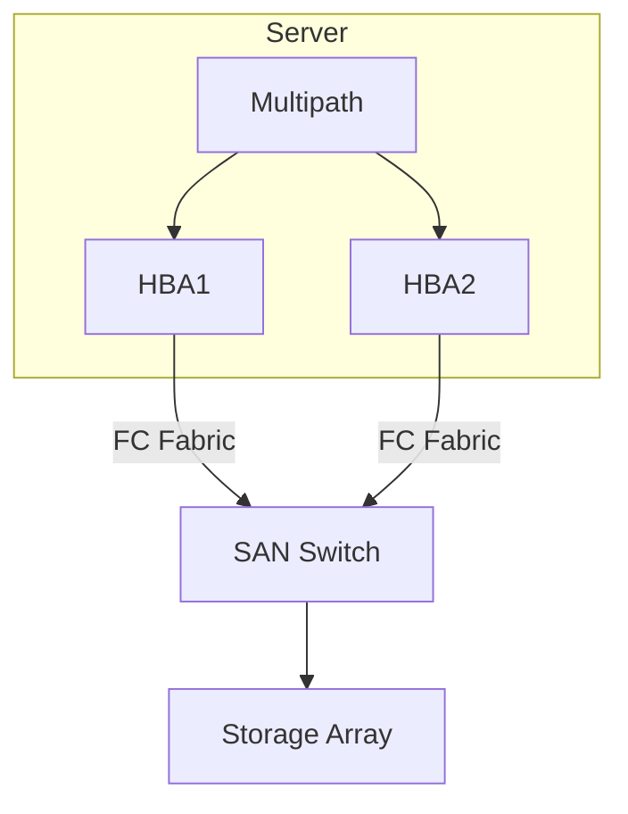
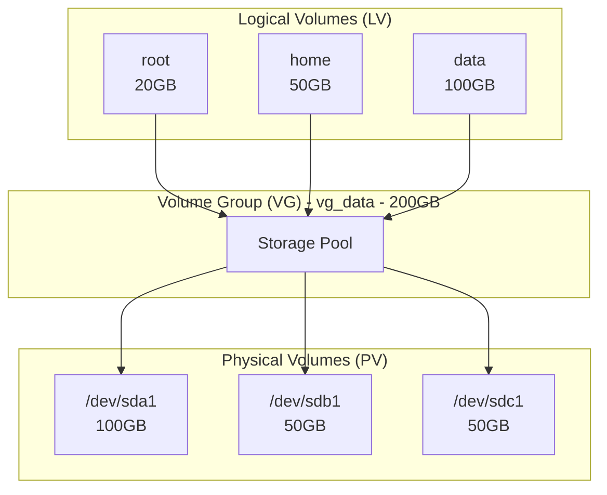

+++
title = "Linux存储技术深度指南"
date = 2026-01-12
weight = 7000
description = "SAN存储、LVM逻辑卷、文件系统调优的深度剖析与最佳实践"
[taxonomies]
tags = ["linux", "storage", "lvm", "san", "filesystem"]
+++

# Linux存储技术深度指南

本文深入剖析 Linux 存储技术栈，涵盖 SAN 存储、LVM 逻辑卷管理及文件系统性能调优。

---

## 一、存储架构概述

### 1.1 存储类型对比

| 类型 | 连接方式 | 协议 | 特点 | 适用场景 |
|-----|---------|------|------|---------|
| DAS | 直连 | SATA/SAS/NVMe | 简单，低延迟 | 单机 |
| NAS | 网络 | NFS/SMB | 文件级共享 | 文件共享 |
| SAN | 专用网络 | FC/iSCSI/FCoE | 块级访问，高性能 | 数据库，虚拟化 |

### 1.2 Linux 存储栈



---

## 二、SAN 存储深度解析

### 2.1 SAN 协议对比

| 协议 | 介质 | 延迟 | 吞吐量 | 成本 |
|-----|------|------|--------|------|
| FC 32G | 光纤 | ~μs | 3.2 GB/s | 高 |
| FC 16G | 光纤 | ~μs | 1.6 GB/s | 高 |
| iSCSI 25G | 以太网 | ~100μs | 3 GB/s | 中 |
| FCoE | 以太网 | ~100μs | 取决于网络 | 中 |
| NVMe-oF | RDMA/FC | ~10μs | 极高 | 高 |

### 2.2 Fibre Channel (FC) 配置

**查看 HBA 信息**：
```bash
# 查看 HBA 卡
lspci | grep -i fibre
ls /sys/class/fc_host/

# 查看 WWN
cat /sys/class/fc_host/host*/port_name
# 0x210000e08b1a2b3c

# 查看状态
cat /sys/class/fc_host/host*/port_state
# Online

# 查看速度
cat /sys/class/fc_host/host*/speed
# 16 Gbit

# 查看详细信息
systool -c fc_host -v
```

**扫描 LUN**：
```bash
# 扫描所有 SCSI 主机
for host in /sys/class/scsi_host/host*; do
    echo "- - -" > $host/scan
done

# 扫描特定主机
echo "- - -" > /sys/class/scsi_host/host0/scan
# 格式: channel target lun (- 表示通配)

# 使用 rescan-scsi-bus
apt install sg3-utils
rescan-scsi-bus.sh

# 查看发现的设备
lsscsi
cat /proc/scsi/scsi
```

### 2.3 iSCSI 配置

**initiator 配置**：
```bash
# 安装
apt install open-iscsi

# 查看/设置 initiator 名称
cat /etc/iscsi/initiatorname.iscsi
# InitiatorName=iqn.2026-01.com.example:server1

# 发现 targets
iscsiadm -m discovery -t st -p <portal_ip>:3260
# 192.168.1.100:3260,1 iqn.2026-01.com.storage:lun1

# 登录
iscsiadm -m node -T iqn.2026-01.com.storage:lun1 -p 192.168.1.100 --login

# 自动登录
iscsiadm -m node -T iqn.2026-01.com.storage:lun1 -p 192.168.1.100 \
    --op update -n node.startup -v automatic

# 查看会话
iscsiadm -m session

# 登出
iscsiadm -m node -T iqn.2026-01.com.storage:lun1 -p 192.168.1.100 --logout
```

**iSCSI 性能优化**：
```bash
# /etc/iscsi/iscsid.conf

# 队列深度
node.session.queue_depth = 128

# 超时设置
node.session.timeo.replacement_timeout = 120
node.conn[0].timeo.noop_out_interval = 5
node.conn[0].timeo.noop_out_timeout = 5

# 数据传输
node.session.iscsi.FirstBurstLength = 262144
node.session.iscsi.MaxBurstLength = 16776192
node.conn[0].iscsi.MaxRecvDataSegmentLength = 262144
```

### 2.4 Multipath I/O (MPIO)

**多路径原理**：


**配置多路径**：
```bash
# 安装
apt install multipath-tools

# 启动服务
systemctl enable multipathd
systemctl start multipathd

# 查看多路径设备
multipath -ll
# mpatha (36001405d27e1e800000900000a20000) dm-0 LIO-ORG,disk1
# size=10G features='0' hwhandler='1 alua' wp=rw
# |-+- policy='service-time 0' prio=50 status=active
# | `- 1:0:0:0 sda 8:0   active ready running
# `-+- policy='service-time 0' prio=10 status=enabled
#   `- 2:0:0:0 sdb 8:16  active ready running

# 刷新
multipathd reconfigure

# 显示路径状态
multipathd show paths
```

**/etc/multipath.conf**：
```bash
defaults {
    user_friendly_names yes
    find_multipaths yes
    path_grouping_policy multibus
    path_selector "round-robin 0"
    failback immediate
    no_path_retry 18
    rr_min_io_rq 1
}

blacklist {
    devnode "^(ram|raw|loop|fd|md|dm-|sr|scd|st)[0-9]*"
    devnode "^sd[a-z]$"  # 排除本地磁盘
}

devices {
    device {
        vendor "NETAPP"
        product "LUN"
        path_grouping_policy group_by_prio
        path_checker tur
        prio alua
        path_selector "round-robin 0"
        failback immediate
    }
}

multipaths {
    multipath {
        wwid 36001405d27e1e800000900000a20000
        alias data_lun1
    }
}
```

**故障模拟与测试**：
```bash
# 禁用路径
echo offline > /sys/block/sda/device/state

# 查看路径状态
multipathd show paths

# 恢复路径
echo running > /sys/block/sda/device/state

# 强制切换路径
dmsetup message mpatha 0 "switch_group 1"
```

### 2.5 SAN 故障排查

```bash
# 检查 FC 连接
cat /sys/class/fc_host/host*/port_state

# 检查 SCSI 错误
dmesg | grep -i scsi

# 检查 multipath 状态
multipath -ll
multipathd show paths

# 检查 iSCSI 会话
iscsiadm -m session -P 3

# I/O 统计
iostat -x 1

# 查看队列深度
cat /sys/block/sda/device/queue_depth

# 调整队列深度
echo 64 > /sys/block/sda/device/queue_depth
```

---

## 三、LVM 深度解析

### 3.1 LVM 架构



### 3.2 LVM 基础操作

**创建 LVM**：
```bash
# 1. 创建物理卷 (PV)
pvcreate /dev/sdb /dev/sdc

# 查看 PV
pvdisplay
pvs

# 2. 创建卷组 (VG)
vgcreate vg_data /dev/sdb /dev/sdc

# 查看 VG
vgdisplay
vgs

# 3. 创建逻辑卷 (LV)
lvcreate -L 50G -n lv_home vg_data
lvcreate -l 100%FREE -n lv_data vg_data  # 使用剩余空间

# 查看 LV
lvdisplay
lvs

# 4. 创建文件系统
mkfs.xfs /dev/vg_data/lv_home
mkfs.ext4 /dev/vg_data/lv_data

# 5. 挂载
mount /dev/vg_data/lv_home /home
```

### 3.3 LVM 扩展操作

**扩展 VG**：
```bash
# 添加新磁盘到 VG
pvcreate /dev/sdd
vgextend vg_data /dev/sdd

# 查看扩展后的空间
vgs
```

**扩展 LV**：
```bash
# 扩展 LV
lvextend -L +20G /dev/vg_data/lv_home
# 或使用百分比
lvextend -l +50%FREE /dev/vg_data/lv_home

# 扩展文件系统
# XFS
xfs_growfs /home

# ext4
resize2fs /dev/vg_data/lv_home

# 一步完成扩展 LV 和文件系统
lvextend -L +20G -r /dev/vg_data/lv_home
```

**缩小 LV（危险操作）**：
```bash
# 1. 卸载
umount /home

# 2. 检查文件系统
e2fsck -f /dev/vg_data/lv_home

# 3. 缩小文件系统
resize2fs /dev/vg_data/lv_home 30G

# 4. 缩小 LV
lvreduce -L 30G /dev/vg_data/lv_home

# 5. 重新挂载
mount /dev/vg_data/lv_home /home

# 注意：XFS 不支持缩小
```

### 3.4 LVM 快照

```bash
# 创建快照
lvcreate -s -L 5G -n lv_home_snap /dev/vg_data/lv_home

# 查看快照
lvs -a

# 挂载快照（只读）
mount -o ro /dev/vg_data/lv_home_snap /mnt/snap

# 恢复快照
umount /home
lvconvert --merge /dev/vg_data/lv_home_snap
# 需要重新激活
lvchange -an /dev/vg_data/lv_home
lvchange -ay /dev/vg_data/lv_home
mount /dev/vg_data/lv_home /home

# 删除快照
lvremove /dev/vg_data/lv_home_snap
```

### 3.5 LVM 镜像（RAID1）

```bash
# 创建镜像 LV
lvcreate -L 10G -m 1 -n lv_mirror vg_data

# 查看镜像状态
lvs -a -o +devices

# 转换现有 LV 为镜像
lvconvert -m 1 /dev/vg_data/lv_data

# 移除镜像
lvconvert -m 0 /dev/vg_data/lv_mirror
```

### 3.6 LVM 条带化（RAID0）

```bash
# 创建条带化 LV
lvcreate -L 100G -i 3 -I 64 -n lv_stripe vg_data
# -i: 条带数（PV 数量）
# -I: 条带大小 (KB)

# 查看条带信息
lvs -o +stripes,stripesize
```

### 3.7 LVM 缓存

```bash
# 使用 SSD 作为 HDD 的缓存
# 1. 创建缓存池
lvcreate -L 20G -n cache_pool vg_data /dev/ssd

# 2. 创建缓存元数据
lvcreate -L 1G -n cache_meta vg_data /dev/ssd

# 3. 合并为缓存池
lvconvert --type cache-pool --cachemode writeback \
    --poolmetadata vg_data/cache_meta vg_data/cache_pool

# 4. 将缓存池附加到数据 LV
lvconvert --type cache --cachepool vg_data/cache_pool vg_data/lv_data

# 查看缓存状态
lvs -a
dmsetup status vg_data-lv_data
```

### 3.8 LVM 高级配置

**/etc/lvm/lvm.conf**：
```bash
# 过滤设备
devices {
    filter = [ "a|/dev/sd.*|", "r|.*|" ]
    # a = accept, r = reject
}

# 性能调优
allocation {
    mirror_logs_require_separate_pvs = 1
    thin_pool_metadata_require_separate_pvs = 1
}

# 激活设置
activation {
    missing_stripe_filler = "error"
    mirror_region_size = 2048  # KB
}
```

### 3.9 LVM 故障恢复

```bash
# 备份 VG 元数据
vgcfgbackup vg_data

# 恢复 VG 元数据
vgcfgrestore -f /etc/lvm/backup/vg_data vg_data

# 修复丢失的 PV
vgreduce --removemissing vg_data

# 强制激活
vgchange -ay --partial vg_data
lvchange -ay --partial /dev/vg_data/lv_data
```

---

## 四、文件系统调优

### 4.1 ext4 调优

**创建时优化**：
```bash
# 大文件优化
mkfs.ext4 -T largefile /dev/sda1

# 小文件优化
mkfs.ext4 -T news /dev/sda1

# 指定块大小
mkfs.ext4 -b 4096 /dev/sda1

# 禁用日志（危险，仅特定场景）
mkfs.ext4 -O ^has_journal /dev/sda1

# 64-bit 支持大于 16TB
mkfs.ext4 -O 64bit /dev/sda1
```

**挂载选项**：
```bash
# /etc/fstab 优化挂载选项
/dev/sda1 /data ext4 defaults,noatime,nodiratime,data=writeback,barrier=0,commit=60 0 2
```

| 选项 | 说明 |
|-----|------|
| noatime | 不更新访问时间 |
| nodiratime | 不更新目录访问时间 |
| data=writeback | 只日志元数据 |
| barrier=0 | 禁用写屏障（需 BBU/UPS） |
| commit=60 | 延长提交间隔 |
| discard | SSD TRIM 支持 |

**调优参数**：
```bash
# 调整预读
blockdev --setra 4096 /dev/sda  # 2MB 预读

# 调整日志模式
tune2fs -o journal_data_writeback /dev/sda1

# 调整保留块
tune2fs -m 1 /dev/sda1  # 1% 保留

# 查看参数
tune2fs -l /dev/sda1
dumpe2fs /dev/sda1
```

### 4.2 XFS 调优

**创建时优化**：
```bash
# 基本创建
mkfs.xfs /dev/sda1

# 指定块大小和 AG 数量
mkfs.xfs -b size=4096 -d agcount=32 /dev/sda1

# SSD 优化
mkfs.xfs -d su=128k,sw=4 /dev/sda1

# 日志优化
mkfs.xfs -l size=128m,lazy-count=1 /dev/sda1
```

**挂载选项**：
```bash
/dev/sda1 /data xfs defaults,noatime,nodiratime,logbufs=8,logbsize=256k,allocsize=64m 0 2
```

| 选项 | 说明 |
|-----|------|
| noatime | 不更新访问时间 |
| logbufs=8 | 日志缓冲区数量 |
| logbsize=256k | 日志缓冲区大小 |
| allocsize=64m | 预分配大小 |
| inode64 | 64-bit inode 号 |
| nobarrier | 禁用写屏障 |

**运行时调优**：
```bash
# 查看文件系统信息
xfs_info /data

# 碎片整理
xfs_fsr /data

# 检查碎片
xfs_db -r /dev/sda1 -c frag

# 增大日志
xfs_growfs -l size=256m /data
```

### 4.3 I/O 调度器

**调度器类型**：

| 调度器 | 特点 | 适用场景 |
|-------|------|---------|
| mq-deadline | 截止时间调度 | 数据库，通用 |
| bfq | 带宽公平调度 | 桌面，多用户 |
| kyber | 低延迟 | NVMe SSD |
| none | 无调度 | NVMe，高性能 SSD |

**配置调度器**：
```bash
# 查看当前调度器
cat /sys/block/sda/queue/scheduler
# [mq-deadline] kyber bfq none

# 临时修改
echo kyber > /sys/block/sda/queue/scheduler

# 永久修改（udev 规则）
# /etc/udev/rules.d/60-scheduler.rules
ACTION=="add|change", KERNEL=="sd*", ATTR{queue/scheduler}="mq-deadline"
ACTION=="add|change", KERNEL=="nvme*", ATTR{queue/scheduler}="none"

# 或使用内核参数
# GRUB: elevator=mq-deadline
```

**调度器参数调优**：
```bash
# deadline 调优
echo 500 > /sys/block/sda/queue/iosched/read_expire
echo 5000 > /sys/block/sda/queue/iosched/write_expire

# 队列深度
echo 128 > /sys/block/sda/queue/nr_requests

# 预读
echo 4096 > /sys/block/sda/queue/read_ahead_kb

# 随机读写阈值
echo 0 > /sys/block/sda/queue/add_random
```

### 4.4 块设备参数

```bash
# 查看块设备信息
blockdev --report /dev/sda

# 设置预读
blockdev --setra 4096 /dev/sda

# 刷新缓冲区
blockdev --flushbufs /dev/sda

# 重新读取分区表
blockdev --rereadpt /dev/sda

# 查看扇区大小
blockdev --getss /dev/sda    # 逻辑扇区
blockdev --getpbsz /dev/sda  # 物理扇区
```

### 4.5 直接 I/O 与异步 I/O

**Direct I/O**：
```c
// 绕过页缓存
int fd = open("/data/file", O_RDWR | O_DIRECT);

// 对齐要求（通常 512 或 4096 字节）
void *buf;
posix_memalign(&buf, 4096, size);
```

**异步 I/O (AIO)**：
```c
#include <libaio.h>

io_context_t ctx;
io_setup(128, &ctx);

struct iocb cb;
io_prep_pread(&cb, fd, buf, size, offset);
io_submit(ctx, 1, &cbp);

struct io_event events[1];
io_getevents(ctx, 1, 1, events, NULL);
```

**io_uring (现代方式)**：
```c
#include <liburing.h>

struct io_uring ring;
io_uring_queue_init(32, &ring, 0);

struct io_uring_sqe *sqe = io_uring_get_sqe(&ring);
io_uring_prep_read(sqe, fd, buf, size, offset);
io_uring_submit(&ring);

struct io_uring_cqe *cqe;
io_uring_wait_cqe(&ring, &cqe);
```

### 4.6 SSD/NVMe 优化

```bash
# 启用 TRIM
# 持续 TRIM
mount -o discard /dev/nvme0n1p1 /data

# 批量 TRIM（推荐）
fstrim /data
# 定时任务
systemctl enable fstrim.timer

# NVMe 参数
# 查看 NVMe 信息
nvme list
nvme id-ctrl /dev/nvme0
nvme smart-log /dev/nvme0

# 调整队列深度
echo 1023 > /sys/block/nvme0n1/queue/nr_requests

# 调整调度器
echo none > /sys/block/nvme0n1/queue/scheduler
```

### 4.7 性能测试

```bash
# fio 测试
# 顺序读
fio --name=seqread --rw=read --bs=1M --size=10G --numjobs=1 \
    --runtime=60 --ioengine=libaio --direct=1 --filename=/dev/sda

# 随机读写
fio --name=randreadwrite --rw=randrw --bs=4k --size=10G --numjobs=8 \
    --runtime=60 --ioengine=libaio --direct=1 --iodepth=64 --filename=/dev/sda

# dd 测试（简单）
dd if=/dev/zero of=/data/testfile bs=1M count=1024 conv=fdatasync

# 延迟测试
ioping -c 100 /data
```

---

## 五、存储性能监控

### 5.1 iostat

```bash
# 基本使用
iostat -x 1

# 输出解读
# Device  r/s    w/s   rkB/s   wkB/s  rrqm/s  wrqm/s  %rrqm  %wrqm r_await w_await aqu-sz rareq-sz wareq-sz  svctm  %util
# sda    10.00  20.00  100.00  200.00   0.00    5.00   0.00  20.00    1.00    2.00   0.05    10.00    10.00   1.00  30.00
```

**关键指标**：
| 指标 | 说明 | 告警阈值 |
|-----|------|---------|
| %util | 设备利用率 | >80% |
| await | 平均等待时间 | HDD >20ms, SSD >5ms |
| aqu-sz | 平均队列长度 | >5 |
| svctm | 平均服务时间 | HDD >10ms, SSD >1ms |

### 5.2 iotop

```bash
# 按进程查看 I/O
iotop -o  # 只显示有 I/O 的进程
iotop -a  # 累积模式
iotop -P  # 按进程而非线程
```

### 5.3 blktrace

```bash
# 收集块层跟踪
blktrace -d /dev/sda -o trace

# 分析
blkparse -i trace -o trace.txt

# 可视化
btt -i trace.blktrace.0

# 实时查看
btrace /dev/sda
```

### 5.4 /proc 和 /sys 信息

```bash
# 磁盘统计
cat /proc/diskstats

# 块设备信息
cat /sys/block/sda/stat

# 队列信息
ls /sys/block/sda/queue/

# I/O 调度器
cat /sys/block/sda/queue/scheduler
```

---

## 六、存储调优检查清单

```
□ 块设备层
  □ 选择合适的 I/O 调度器
  □ 调整队列深度
  □ 设置预读大小
  □ SSD 启用 TRIM

□ LVM 层
  □ 合理规划 VG 和 LV
  □ 条带化提升性能
  □ SSD 缓存加速

□ 文件系统
  □ 选择合适的文件系统
  □ 优化挂载选项
  □ 禁用 atime
  □ 调整日志模式

□ SAN
  □ 配置多路径
  □ 调整队列深度
  □ 设置超时参数

□ 监控
  □ iostat 基线
  □ 延迟监控
  □ 容量预警
```

---

## 参考资料

- [Linux Storage Stack Diagram](https://www.thomas-krenn.com/en/wiki/Linux_Storage_Stack_Diagram)
- [Red Hat Storage Administration Guide](https://access.redhat.com/documentation/en-us/red_hat_enterprise_linux/8/html/managing_storage_devices/)
- [XFS Documentation](https://xfs.wiki.kernel.org/)
- [LVM Administrator's Guide](https://access.redhat.com/documentation/en-us/red_hat_enterprise_linux/8/html/configuring_and_managing_logical_volumes/)

---

## 相关文章

- [上一篇：Linux系统性能调优深度指南](@/articles/devops/linux-06-系统性能调优指南.md)
- [下一篇：Linux网络技术深度指南](@/articles/devops/linux-08-网络技术指南.md)
