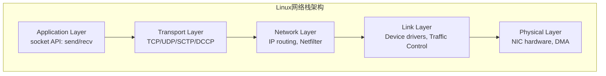
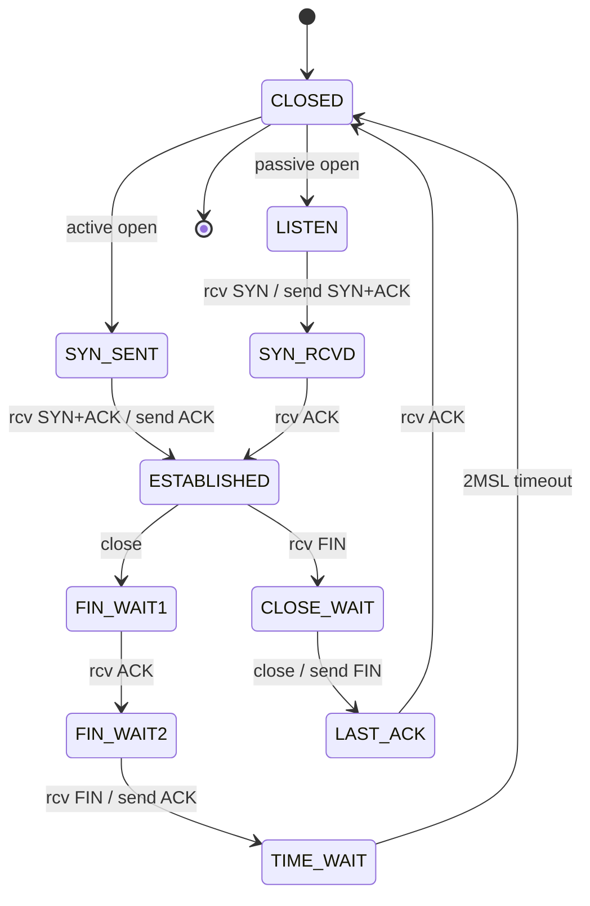
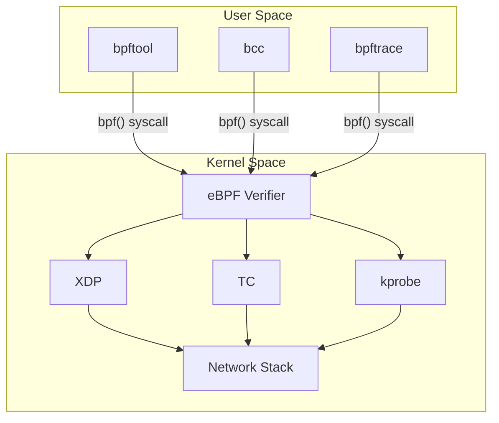

+++
title = "Linux网络技术深度指南"
date = 2026-01-12
weight = 8000
description = "TCP/IP协议栈、DNS、Multicast、tcpdump、eBPF网络编程深度剖析"
[taxonomies]
tags = ["linux", "networking", "tcp", "ebpf"]
+++

# Linux网络技术深度指南

本文深入剖析 Linux 网络技术栈，涵盖 TCP/IP 协议、DNS、组播、抓包分析及 eBPF 网络编程。

---

## 一、TCP/IP 协议栈深度解析

### 1.1 Linux 网络栈架构



### 1.2 TCP 连接状态机



### 1.3 TCP 连接建立详解

**三次握手**：
```
Client                              Server
  │                                    │
  │──────── SYN (seq=x) ──────────────▶│
  │                                    │
  │◀────── SYN+ACK (seq=y, ack=x+1) ───│
  │                                    │
  │──────── ACK (ack=y+1) ─────────────▶│
  │                                    │
  │           ESTABLISHED              │
```

**查看半连接队列**：
```bash
# 半连接队列（SYN_RECV 状态）
ss -n state syn-recv | wc -l

# 查看 SYN 队列溢出
netstat -s | grep -i "listen"
# 或
cat /proc/net/netstat | grep -i "listen"
```

**SYN Flood 防护**：
```bash
# 启用 SYN Cookies
net.ipv4.tcp_syncookies = 1

# 增大半连接队列
net.ipv4.tcp_max_syn_backlog = 65535

# 减少 SYN+ACK 重试
net.ipv4.tcp_synack_retries = 2
```

### 1.4 TCP 滑动窗口与拥塞控制

**窗口机制**：
```
滑动窗口结构：[已发送已确认] [可发送窗口内] [不可发送窗口外]
  │       ◀──── 发送窗口 ────▶        │
  │                                  │
  │              ◀── 接收窗口 ──▶     │
  │            (advertised window)   │
```

**查看窗口大小**：
```bash
# 实时查看
ss -i
# 输出示例:
# tcp   ESTAB  0  0  192.168.1.1:22  192.168.1.2:54321
#   cubic wscale:7,7 rto:204 rtt:0.5/0.1 ato:40 mss:1448 pmtu:1500
#   rcvmss:1448 advmss:1448 cwnd:10 bytes_acked:1234 segs_out:10
#   segs_in:8 send 231.7Mbps lastsnd:16 lastrcv:16 lastack:16
```

**拥塞控制算法**：

| 算法 | 特点 | 适用场景 |
|-----|------|---------|
| Reno | 经典算法，AIMD | 低丢包环境 |
| CUBIC | Linux 默认，三次函数 | 通用 |
| BBR | 基于带宽和 RTT | 长肥网络，有丢包 |
| DCTCP | 数据中心优化 | 低延迟数据中心 |

```bash
# 查看可用算法
sysctl net.ipv4.tcp_available_congestion_control

# 设置算法
sysctl -w net.ipv4.tcp_congestion_control=bbr

# BBR 需要 fq 队列
sysctl -w net.core.default_qdisc=fq
```

### 1.5 TCP 性能参数

```bash
# 缓冲区调优
net.ipv4.tcp_rmem = 4096 131072 16777216  # 最小 默认 最大
net.ipv4.tcp_wmem = 4096 16384 16777216
net.core.rmem_max = 16777216
net.core.wmem_max = 16777216

# 自动调优
net.ipv4.tcp_moderate_rcvbuf = 1

# 快速回收
net.ipv4.tcp_tw_reuse = 1
net.ipv4.tcp_tw_recycle = 0  # 已废弃，不要使用

# 重传超时
net.ipv4.tcp_retries1 = 3
net.ipv4.tcp_retries2 = 15

# 保活
net.ipv4.tcp_keepalive_time = 600
net.ipv4.tcp_keepalive_intvl = 30
net.ipv4.tcp_keepalive_probes = 3
```

### 1.6 低延迟 TCP 优化

```bash
# 禁用 Nagle 算法（应用层设置）
setsockopt(fd, IPPROTO_TCP, TCP_NODELAY, &one, sizeof(one));

# 禁用延迟 ACK
setsockopt(fd, IPPROTO_TCP, TCP_QUICKACK, &one, sizeof(one));

# 内核参数
net.ipv4.tcp_low_latency = 1

# 禁用时间戳（减少每包 12 字节）
net.ipv4.tcp_timestamps = 0

# 禁用 SACK（简化处理）
net.ipv4.tcp_sack = 0
```

### 1.7 TCP Fast Open

```c
// 服务端
int qlen = 5;
setsockopt(fd, SOL_TCP, TCP_FASTOPEN, &qlen, sizeof(qlen));

// 客户端
sendto(fd, data, len, MSG_FASTOPEN, addr, addrlen);
```

```bash
# 内核启用
net.ipv4.tcp_fastopen = 3  # 1=客户端, 2=服务端, 3=两者
```

---

## 二、UDP 与 Multicast 深度解析

### 2.1 UDP 特性

```
特点:
- 无连接
- 不保证可靠性
- 不保证顺序
- 无拥塞控制
- 低延迟，低开销

适用场景:
- 实时通信（语音、视频）
- 游戏
- 市场数据分发
- DNS 查询
```

### 2.2 UDP 缓冲区调优

```bash
# 增大缓冲区
net.core.rmem_max = 134217728    # 128MB
net.core.rmem_default = 16777216 # 16MB

# 应用层设置
int rcvbuf = 16 * 1024 * 1024;  // 16MB
setsockopt(fd, SOL_SOCKET, SO_RCVBUF, &rcvbuf, sizeof(rcvbuf));

# 验证实际大小（内核可能翻倍）
getsockopt(fd, SOL_SOCKET, SO_RCVBUF, &rcvbuf, &len);
```

### 2.3 Multicast 原理

```
单播 (Unicast):     1 对 1
广播 (Broadcast):   1 对 所有
组播 (Multicast):   1 对 组内成员

组播地址范围: 224.0.0.0 - 239.255.255.255
本地组播:     224.0.0.0 - 224.0.0.255 (TTL=1)
全局组播:     224.0.1.0 - 238.255.255.255
私有组播:     239.0.0.0 - 239.255.255.255
```

### 2.4 Multicast 编程

**加入组播组**：
```c
#include <netinet/in.h>
#include <arpa/inet.h>

// 方法1: 使用 ip_mreq
struct ip_mreq mreq;
mreq.imr_multiaddr.s_addr = inet_addr("239.1.1.1");
mreq.imr_interface.s_addr = INADDR_ANY;  // 或指定接口

setsockopt(fd, IPPROTO_IP, IP_ADD_MEMBERSHIP, &mreq, sizeof(mreq));

// 方法2: 使用 ip_mreqn（可指定接口索引）
struct ip_mreqn mreqn;
mreqn.imr_multiaddr.s_addr = inet_addr("239.1.1.1");
mreqn.imr_address.s_addr = INADDR_ANY;
mreqn.imr_ifindex = if_nametoindex("eth0");

setsockopt(fd, IPPROTO_IP, IP_ADD_MEMBERSHIP, &mreqn, sizeof(mreqn));
```

**发送组播**：
```c
// 设置出口接口
struct in_addr local_if;
local_if.s_addr = inet_addr("192.168.1.100");
setsockopt(fd, IPPROTO_IP, IP_MULTICAST_IF, &local_if, sizeof(local_if));

// 设置 TTL
int ttl = 64;
setsockopt(fd, IPPROTO_IP, IP_MULTICAST_TTL, &ttl, sizeof(ttl));

// 设置是否回环
int loop = 0;  // 不接收自己发的包
setsockopt(fd, IPPROTO_IP, IP_MULTICAST_LOOP, &loop, sizeof(loop));

// 发送
sendto(fd, data, len, 0, &mcast_addr, sizeof(mcast_addr));
```

**接收组播**：
```c
// 创建 socket
int fd = socket(AF_INET, SOCK_DGRAM, 0);

// 允许地址重用
int reuse = 1;
setsockopt(fd, SOL_SOCKET, SO_REUSEADDR, &reuse, sizeof(reuse));
setsockopt(fd, SOL_SOCKET, SO_REUSEPORT, &reuse, sizeof(reuse));

// 绑定
struct sockaddr_in addr;
addr.sin_family = AF_INET;
addr.sin_port = htons(5000);
addr.sin_addr.s_addr = INADDR_ANY;  // 或组播地址
bind(fd, (struct sockaddr *)&addr, sizeof(addr));

// 加入组播组
struct ip_mreq mreq;
mreq.imr_multiaddr.s_addr = inet_addr("239.1.1.1");
mreq.imr_interface.s_addr = INADDR_ANY;
setsockopt(fd, IPPROTO_IP, IP_ADD_MEMBERSHIP, &mreq, sizeof(mreq));

// 接收
char buf[65536];
recvfrom(fd, buf, sizeof(buf), 0, NULL, NULL);
```

### 2.5 Multicast 系统配置

```bash
# 查看组播组成员
ip maddr show
netstat -g

# 添加组播路由
ip route add 239.0.0.0/8 dev eth0

# IGMP 版本
echo 2 > /proc/sys/net/ipv4/conf/eth0/force_igmp_version

# 组播相关参数
net.ipv4.igmp_max_memberships = 256
net.ipv4.igmp_max_msf = 256
net.ipv4.conf.all.mc_forwarding = 0
```

### 2.6 Multicast 调试

```bash
# 监听组播流量
tcpdump -i eth0 host 239.1.1.1

# 测试发送
echo "test" | socat - UDP4-DATAGRAM:239.1.1.1:5000

# 测试接收
socat UDP4-RECVFROM:5000,ip-add-membership=239.1.1.1:eth0 -

# IGMP 抓包
tcpdump -i eth0 igmp

# 检查路由
ip route get 239.1.1.1
```

---

## 三、DNS 深度解析

### 3.1 DNS 查询流程

```
客户端 ──▶ 本地 DNS 缓存
              │
              ▼ (缓存未命中)
          递归解析器
              │
              ├──▶ 根域名服务器 (.)
              │         │
              │         ▼ 返回 .com 服务器
              │
              ├──▶ TLD 服务器 (.com)
              │         │
              │         ▼ 返回 example.com 服务器
              │
              └──▶ 权威服务器 (example.com)
                        │
                        ▼ 返回 IP 地址
```

### 3.2 DNS 记录类型

| 类型 | 用途 | 示例 |
|-----|------|------|
| A | IPv4 地址 | example.com → 1.2.3.4 |
| AAAA | IPv6 地址 | example.com → 2001:db8::1 |
| CNAME | 别名 | www → example.com |
| MX | 邮件服务器 | example.com → mail.example.com |
| NS | 名称服务器 | example.com → ns1.example.com |
| TXT | 文本记录 | SPF, DKIM 验证 |
| PTR | 反向解析 | 1.2.3.4 → example.com |
| SRV | 服务定位 | _sip._tcp.example.com |

### 3.3 dig 命令详解

```bash
# 基本查询
dig example.com

# 指定记录类型
dig example.com A
dig example.com AAAA
dig example.com MX
dig example.com ANY

# 指定 DNS 服务器
dig @8.8.8.8 example.com

# 追踪查询过程
dig +trace example.com

# 简洁输出
dig +short example.com

# 反向查询
dig -x 1.2.3.4

# 显示所有信息
dig +all example.com

# TCP 查询
dig +tcp example.com

# 设置超时
dig +time=5 +tries=2 example.com
```

**dig 输出解读**：
```bash
; <<>> DiG 9.16.1 <<>> example.com
;; global options: +cmd
;; Got answer:
;; ->>HEADER<<- opcode: QUERY, status: NOERROR, id: 12345
;; flags: qr rd ra; QUERY: 1, ANSWER: 1, AUTHORITY: 0, ADDITIONAL: 1

;; QUESTION SECTION:
;example.com.                   IN      A

;; ANSWER SECTION:
example.com.            86400   IN      A       93.184.216.34

;; Query time: 20 msec
;; SERVER: 192.168.1.1#53(192.168.1.1)
;; WHEN: Mon Jan 12 10:00:00 UTC 2026
;; MSG SIZE  rcvd: 56
```

### 3.4 本地 DNS 配置

**/etc/resolv.conf**：
```bash
# 名称服务器
nameserver 8.8.8.8
nameserver 8.8.4.4

# 搜索域
search example.com corp.example.com

# 选项
options timeout:2 attempts:3 rotate ndots:5
```

**/etc/hosts**：
```bash
127.0.0.1   localhost
192.168.1.10 myserver myserver.local
```

**nsswitch.conf**：
```bash
# /etc/nsswitch.conf
hosts: files dns myhostname
```

### 3.5 systemd-resolved

```bash
# 状态查看
resolvectl status

# 查询
resolvectl query example.com

# 统计
resolvectl statistics

# 刷新缓存
resolvectl flush-caches

# 配置 /etc/systemd/resolved.conf
[Resolve]
DNS=8.8.8.8 8.8.4.4
FallbackDNS=1.1.1.1
DNSSEC=allow-downgrade
DNSOverTLS=opportunistic
Cache=yes
```

### 3.6 DNS 性能优化

```bash
# 本地缓存（使用 dnsmasq）
apt install dnsmasq

# /etc/dnsmasq.conf
cache-size=10000
no-negcache
all-servers

# 使用本地缓存
# /etc/resolv.conf
nameserver 127.0.0.1

# 预取热门域名
dnsmasq --min-cache-ttl=300
```

### 3.7 DNS 故障排查

```bash
# 检查解析链
dig +trace example.com

# 检查 DNSSEC
dig +dnssec example.com

# 测试 TCP
dig +tcp example.com

# 检查反向解析
dig -x <ip>

# 检查 NS 记录
dig NS example.com

# 性能测试
for i in {1..100}; do dig example.com +short; done | sort | uniq -c
```

---

## 四、tcpdump 深度使用

### 4.1 基本语法

```bash
tcpdump [选项] [过滤表达式]

常用选项:
-i <接口>    指定网卡
-n           不解析主机名
-nn          不解析主机名和端口
-v/-vv/-vvv  详细程度
-c <数量>    抓取数量
-w <文件>    写入文件
-r <文件>    读取文件
-s <长度>    抓取长度（0=完整）
-A           ASCII 显示
-X           十六进制+ASCII
-e           显示链路层头
-q           简洁输出
-t           不显示时间戳
-tttt        显示完整时间
```

### 4.2 过滤表达式

**基本过滤**：
```bash
# 主机过滤
tcpdump host 192.168.1.1
tcpdump src host 192.168.1.1
tcpdump dst host 192.168.1.1

# 网络过滤
tcpdump net 192.168.1.0/24

# 端口过滤
tcpdump port 80
tcpdump src port 80
tcpdump dst port 443
tcpdump portrange 80-443

# 协议过滤
tcpdump tcp
tcpdump udp
tcpdump icmp
tcpdump arp
```

**组合过滤**：
```bash
# AND
tcpdump host 192.168.1.1 and port 80

# OR
tcpdump port 80 or port 443

# NOT
tcpdump not port 22

# 复杂组合
tcpdump 'host 192.168.1.1 and (port 80 or port 443)'
```

### 4.3 高级过滤

**TCP 标志位**：
```bash
# SYN 包
tcpdump 'tcp[tcpflags] & tcp-syn != 0'
tcpdump 'tcp[13] & 2 != 0'

# SYN+ACK 包
tcpdump 'tcp[tcpflags] & (tcp-syn|tcp-ack) == (tcp-syn|tcp-ack)'

# RST 包
tcpdump 'tcp[tcpflags] & tcp-rst != 0'

# FIN 包
tcpdump 'tcp[tcpflags] & tcp-fin != 0'

# PSH 包
tcpdump 'tcp[tcpflags] & tcp-push != 0'
```

**TCP 标志位对照**：
```
位置: tcp[13]
FIN = 0x01 (bit 0)
SYN = 0x02 (bit 1)
RST = 0x04 (bit 2)
PSH = 0x08 (bit 3)
ACK = 0x10 (bit 4)
URG = 0x20 (bit 5)
```

**IP 头部过滤**：
```bash
# 只抓 IPv4
tcpdump 'ip'

# TTL = 1（可能是攻击）
tcpdump 'ip[8] = 1'

# 分片包
tcpdump 'ip[6] & 0x20 != 0'
```

**按内容过滤**：
```bash
# HTTP GET 请求
tcpdump 'tcp port 80 and tcp[((tcp[12:1] & 0xf0) >> 2):4] = 0x47455420'

# HTTP Host 头
tcpdump -A 'tcp port 80' | grep -i 'Host:'
```

### 4.4 抓包保存与分析

```bash
# 保存抓包
tcpdump -i eth0 -w capture.pcap

# 带旋转保存
tcpdump -i eth0 -w capture_%Y%m%d_%H%M%S.pcap -G 3600 -W 24

# 按大小分割
tcpdump -i eth0 -w capture.pcap -C 100  # 每 100MB 分割

# 读取分析
tcpdump -r capture.pcap
tcpdump -r capture.pcap -nn -A 'port 80'

# 统计
tcpdump -r capture.pcap -q | wc -l

# 配合 Wireshark
tcpdump -i eth0 -w - | wireshark -k -i -
```

### 4.5 性能优化

```bash
# 只抓包头
tcpdump -s 96 -i eth0

# 不解析
tcpdump -nn -i eth0

# 使用 ring buffer
tcpdump -i eth0 -B 4096  # 4MB buffer

# 减少输出
tcpdump -q -i eth0
```

### 4.6 常用场景

```bash
# 抓 DNS 查询
tcpdump -i eth0 -nn port 53

# 抓 HTTPS 握手
tcpdump -i eth0 'tcp port 443 and (tcp[tcpflags] & tcp-syn != 0)'

# 抓慢查询（延迟分析）
tcpdump -i eth0 -nn -ttt port 3306

# 抓组播
tcpdump -i eth0 'ip multicast'

# 抓 ARP
tcpdump -i eth0 arp

# 抓 ICMP
tcpdump -i eth0 icmp

# 抓重传
tcpdump -i eth0 'tcp[13] & 4 != 0'  # RST
```

---

## 五、eBPF 网络编程

### 5.1 eBPF 简介

```
eBPF (extended Berkeley Packet Filter):
- 在内核安全运行自定义代码
- 无需修改内核源码或加载模块
- 用于网络、安全、性能分析

网络相关能力:
- XDP: 极速包处理
- TC: 流量控制
- Socket 过滤
- 透明代理
```

### 5.2 eBPF 架构



### 5.3 XDP (eXpress Data Path)

**XDP 处理位置**：
```
网卡 → XDP → TC → Netfilter → Socket
       ↑
   最早处理点，驱动级别
```

**XDP 动作**：
```c
enum xdp_action {
    XDP_ABORTED = 0,  // 错误，丢弃
    XDP_DROP,         // 丢弃
    XDP_PASS,         // 传递给内核栈
    XDP_TX,           // 从同一网卡发回
    XDP_REDIRECT,     // 重定向到其他网卡/CPU
};
```

**简单 XDP 程序**：
```c
// xdp_drop_icmp.c
#include <linux/bpf.h>
#include <linux/if_ether.h>
#include <linux/ip.h>
#include <linux/icmp.h>

SEC("xdp")
int xdp_drop_icmp(struct xdp_md *ctx) {
    void *data = (void *)(long)ctx->data;
    void *data_end = (void *)(long)ctx->data_end;
    
    struct ethhdr *eth = data;
    if ((void *)eth + sizeof(*eth) > data_end)
        return XDP_PASS;
    
    if (eth->h_proto != htons(ETH_P_IP))
        return XDP_PASS;
    
    struct iphdr *ip = data + sizeof(*eth);
    if ((void *)ip + sizeof(*ip) > data_end)
        return XDP_PASS;
    
    if (ip->protocol == IPPROTO_ICMP)
        return XDP_DROP;
    
    return XDP_PASS;
}

char _license[] SEC("license") = "GPL";
```

**加载 XDP 程序**：
```bash
# 编译
clang -O2 -target bpf -c xdp_drop_icmp.c -o xdp_drop_icmp.o

# 加载
ip link set dev eth0 xdpgeneric obj xdp_drop_icmp.o sec xdp

# 查看
ip link show eth0
bpftool prog list
bpftool net show

# 卸载
ip link set dev eth0 xdpgeneric off
```

### 5.4 BCC 网络工具

```bash
# 安装 BCC
apt install bpfcc-tools

# TCP 连接跟踪
tcpconnect   # 跟踪 TCP 连接
tcpaccept    # 跟踪 TCP 接受
tcplife      # TCP 连接生命周期
tcptracer    # 跟踪 TCP 状态变化

# 延迟分析
tcprtt       # TCP RTT
tcpretrans   # TCP 重传

# 数据传输
tcptop       # 按连接统计流量
tcpstates    # TCP 状态变化

# 使用示例
tcplife
# 输出:
# PID    COMM       LADDR           LPORT RADDR           RPORT TX_KB RX_KB MS
# 1234   curl       192.168.1.1     43210 93.184.216.34   80        1     5   15
```

### 5.5 bpftrace 网络分析

```bash
# 跟踪 TCP 发送
bpftrace -e 'kprobe:tcp_sendmsg { printf("pid=%d, size=%d\n", pid, arg2); }'

# 统计每个进程的网络发送
bpftrace -e '
kprobe:tcp_sendmsg { 
    @bytes[comm] = sum(arg2); 
}
interval:s:10 {
    print(@bytes);
    clear(@bytes);
}'

# TCP 重传跟踪
bpftrace -e 'kprobe:tcp_retransmit_skb { 
    printf("Retransmit: pid=%d, comm=%s\n", pid, comm); 
}'

# Socket 创建跟踪
bpftrace -e 'tracepoint:syscalls:sys_enter_socket { 
    printf("%s: socket(domain=%d, type=%d)\n", comm, args->family, args->type); 
}'
```

### 5.6 实用 eBPF 网络场景

**防火墙/DDoS 防护**：
```c
SEC("xdp")
int xdp_firewall(struct xdp_md *ctx) {
    // 解析包...
    
    // 检查黑名单
    __u32 *blocked = bpf_map_lookup_elem(&blacklist, &src_ip);
    if (blocked)
        return XDP_DROP;
    
    // 速率限制
    __u64 *count = bpf_map_lookup_elem(&rate_limit, &src_ip);
    if (count && *count > THRESHOLD)
        return XDP_DROP;
    
    return XDP_PASS;
}
```

**负载均衡**：
```c
SEC("xdp")
int xdp_lb(struct xdp_md *ctx) {
    // 计算哈希选择后端
    __u32 hash = jhash_3words(src_ip, dst_port, src_port, 0);
    __u32 backend_idx = hash % num_backends;
    
    // 修改目标地址
    ip->daddr = backends[backend_idx];
    
    // 重新计算校验和
    // ...
    
    return XDP_TX;
}
```

### 5.7 eBPF 开发资源

```
开发框架:
- libbpf: 官方 C 库
- BCC: Python/C++ 绑定
- bpftrace: 高级跟踪语言
- Cilium: 网络和安全
- eBPF Go: Go 语言绑定

学习资源:
- https://ebpf.io/
- https://www.brendangregg.com/ebpf.html
- https://github.com/iovisor/bcc
```

---

## 六、网络问题排查清单

```bash
# 连通性
ping -c 3 <host>
traceroute <host>
mtr <host>

# DNS
dig <domain>
nslookup <domain>

# 端口
ss -tuln
netstat -tuln
nc -zv <host> <port>

# 路由
ip route
ip route get <dst>

# 抓包
tcpdump -i eth0 -nn host <ip>

# 连接状态
ss -s
netstat -s

# 性能
iperf3 -s / iperf3 -c <server>
```

---

## 参考资料

- [Linux Networking Documentation](https://www.kernel.org/doc/html/latest/networking/)
- [TCP/IP Illustrated](https://www.isi.edu/~hussain/TEACH/Spring2014/notes/Steven00a.pdf)
- [eBPF Documentation](https://ebpf.io/what-is-ebpf/)
- [Brendan Gregg's Networking](http://www.brendangregg.com/blog/index.html)

---

## 相关文章

- [上一篇：Linux存储技术深度指南](@/articles/devops/linux-07-存储技术指南.md)
- [下一篇：Linux安全加固深度指南](@/articles/devops/linux-09-安全加固指南.md)
