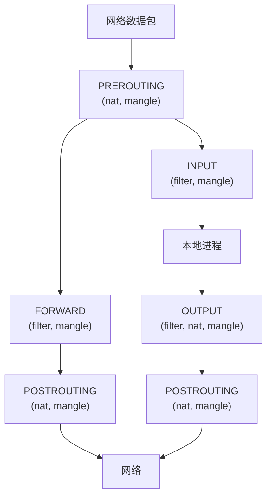
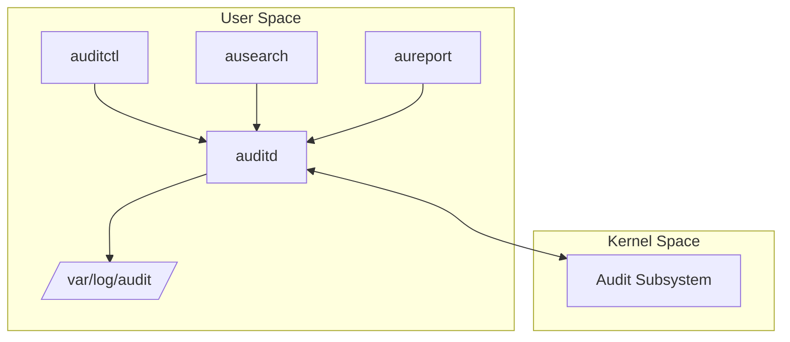

+++
title = "09.Linux安全加固深度指南"
date = 2026-01-12
description = "SSH加固、防火墙、审计系统、SELinux/AppArmor的深度剖析与最佳实践"
[taxonomies]
tags = ["linux", "security", "ssh", "firewall", "selinux"]
+++

# Linux安全加固深度指南

本文深入剖析 Linux 系统安全加固的核心技术，涵盖 SSH 加固、防火墙配置、审计系统及强制访问控制。

---

## 一、SSH 安全加固

### 1.1 SSH 认证机制

```
认证方式优先级：
1. 公钥认证（最安全）
2. 证书认证（企业级）
3. 双因素认证（2FA）
4. 密码认证（最弱，应禁用）
```

### 1.2 sshd_config 核心配置

```bash
# /etc/ssh/sshd_config

# ========== 基础安全 ==========
# 禁用 root 登录
PermitRootLogin no

# 禁用密码认证
PasswordAuthentication no
PermitEmptyPasswords no

# 只允许公钥认证
PubkeyAuthentication yes
AuthorizedKeysFile .ssh/authorized_keys

# 禁用键盘交互认证
KbdInteractiveAuthentication no
ChallengeResponseAuthentication no

# ========== 协议安全 ==========
# 只使用 SSH 协议 2
Protocol 2

# 强加密算法
Ciphers chacha20-poly1305@openssh.com,aes256-gcm@openssh.com,aes128-gcm@openssh.com,aes256-ctr,aes192-ctr,aes128-ctr

# 强 MAC 算法
MACs hmac-sha2-512-etm@openssh.com,hmac-sha2-256-etm@openssh.com,umac-128-etm@openssh.com

# 强密钥交换算法
KexAlgorithms curve25519-sha256,curve25519-sha256@libssh.org,diffie-hellman-group16-sha512,diffie-hellman-group18-sha512

# 主机密钥算法
HostKeyAlgorithms ssh-ed25519,rsa-sha2-512,rsa-sha2-256

# ========== 访问控制 ==========
# 只允许特定用户
AllowUsers admin operator deploy

# 只允许特定组
AllowGroups ssh-users

# 拒绝特定用户
DenyUsers guest test

# ========== 连接限制 ==========
# 最大认证尝试次数
MaxAuthTries 3

# 最大并发连接数
MaxSessions 3

# 登录超时
LoginGraceTime 30

# 空闲超时
ClientAliveInterval 300
ClientAliveCountMax 2

# ========== 其他安全 ==========
# 禁用 X11 转发
X11Forwarding no

# 禁用 TCP 转发（按需开启）
AllowTcpForwarding no
AllowStreamLocalForwarding no

# 禁用 Agent 转发
AllowAgentForwarding no

# 禁用 .rhosts
IgnoreRhosts yes

# 禁用主机认证
HostbasedAuthentication no

# 使用特权分离
UsePrivilegeSeparation sandbox

# 禁用压缩（防止 CRIME 攻击）
Compression no

# 日志级别
LogLevel VERBOSE

# 显示最后登录
PrintLastLog yes

# 显示 MOTD
PrintMotd no

# Banner
Banner /etc/ssh/banner
```

### 1.3 SSH 密钥管理

**生成强密钥**：
```bash
# Ed25519（推荐，最安全）
ssh-keygen -t ed25519 -a 100 -C "user@host" -f ~/.ssh/id_ed25519

# RSA 4096（兼容性好）
ssh-keygen -t rsa -b 4096 -a 100 -C "user@host" -f ~/.ssh/id_rsa

# ECDSA
ssh-keygen -t ecdsa -b 521 -C "user@host"
```

**authorized_keys 限制**：
```bash
# ~/.ssh/authorized_keys
# 限制来源 IP
from="192.168.1.0/24,10.0.0.0/8" ssh-ed25519 AAAA...

# 限制命令
command="/usr/bin/rsync --server" ssh-ed25519 AAAA...

# 禁用端口转发
no-port-forwarding,no-X11-forwarding,no-agent-forwarding ssh-ed25519 AAAA...

# 组合限制
from="192.168.1.100",command="/usr/bin/backup.sh",no-pty ssh-ed25519 AAAA...
```

### 1.4 SSH 证书认证

```bash
# 1. 生成 CA 密钥
ssh-keygen -t ed25519 -f /etc/ssh/ca_user_key -C "User CA"
ssh-keygen -t ed25519 -f /etc/ssh/ca_host_key -C "Host CA"

# 2. 签发用户证书
ssh-keygen -s /etc/ssh/ca_user_key \
    -I "user@example.com" \
    -n admin,operator \
    -V +52w \
    -z 1 \
    ~/.ssh/id_ed25519.pub
# 生成 id_ed25519-cert.pub

# 3. 签发主机证书
ssh-keygen -s /etc/ssh/ca_host_key \
    -I "server.example.com" \
    -h \
    -n server.example.com,192.168.1.100 \
    -V +52w \
    /etc/ssh/ssh_host_ed25519_key.pub

# 4. 服务器配置
# /etc/ssh/sshd_config
TrustedUserCAKeys /etc/ssh/ca_user_key.pub
HostCertificate /etc/ssh/ssh_host_ed25519_key-cert.pub

# 5. 客户端配置
# ~/.ssh/known_hosts
@cert-authority *.example.com ssh-ed25519 AAAA...
```

### 1.5 双因素认证 (2FA)

**Google Authenticator 集成**：
```bash
# 安装
apt install libpam-google-authenticator

# 用户初始化
google-authenticator

# PAM 配置 /etc/pam.d/sshd
auth required pam_google_authenticator.so nullok

# SSH 配置
# /etc/ssh/sshd_config
ChallengeResponseAuthentication yes
AuthenticationMethods publickey,keyboard-interactive

# 重启
systemctl restart sshd
```

### 1.6 Fail2ban 防暴力破解

```bash
# 安装
apt install fail2ban

# 配置 /etc/fail2ban/jail.local
[sshd]
enabled = true
port = ssh
filter = sshd
logpath = /var/log/auth.log
maxretry = 3
bantime = 3600
findtime = 600

[sshd-ddos]
enabled = true
port = ssh
filter = sshd-ddos
logpath = /var/log/auth.log
maxretry = 6
bantime = 86400

# 启动
systemctl enable fail2ban
systemctl start fail2ban

# 查看状态
fail2ban-client status sshd
fail2ban-client set sshd unbanip 192.168.1.100
```

### 1.7 SSH 跳板机配置

```bash
# ~/.ssh/config
Host bastion
    HostName bastion.example.com
    User admin
    IdentityFile ~/.ssh/id_ed25519
    ForwardAgent no

Host internal-*
    ProxyJump bastion
    User deploy
    IdentityFile ~/.ssh/id_ed25519

Host internal-web
    HostName 10.0.1.10

Host internal-db
    HostName 10.0.1.20
```

---

## 二、防火墙配置

### 2.1 iptables 深度解析

**表和链结构**：


**表的优先级**：raw → mangle → nat → filter

### 2.2 iptables 基础规则

```bash
# 查看规则
iptables -L -n -v
iptables -L -n -v --line-numbers
iptables -S  # 以命令格式显示

# 默认策略
iptables -P INPUT DROP
iptables -P FORWARD DROP
iptables -P OUTPUT ACCEPT

# 允许回环
iptables -A INPUT -i lo -j ACCEPT
iptables -A OUTPUT -o lo -j ACCEPT

# 允许已建立的连接
iptables -A INPUT -m state --state ESTABLISHED,RELATED -j ACCEPT

# 允许 SSH
iptables -A INPUT -p tcp --dport 22 -m state --state NEW -j ACCEPT

# 允许 HTTP/HTTPS
iptables -A INPUT -p tcp -m multiport --dports 80,443 -m state --state NEW -j ACCEPT

# 允许 ICMP
iptables -A INPUT -p icmp --icmp-type echo-request -j ACCEPT

# 丢弃无效包
iptables -A INPUT -m state --state INVALID -j DROP

# 日志丢弃的包
iptables -A INPUT -j LOG --log-prefix "iptables-dropped: " --log-level 4
iptables -A INPUT -j DROP
```

### 2.3 高级 iptables 规则

**速率限制**：
```bash
# 限制 SSH 连接速率
iptables -A INPUT -p tcp --dport 22 -m state --state NEW \
    -m recent --set --name SSH
iptables -A INPUT -p tcp --dport 22 -m state --state NEW \
    -m recent --update --seconds 60 --hitcount 4 --name SSH -j DROP

# 使用 hashlimit
iptables -A INPUT -p tcp --dport 80 -m hashlimit \
    --hashlimit-upto 50/sec --hashlimit-burst 100 \
    --hashlimit-mode srcip --hashlimit-name http -j ACCEPT
```

**防 DDoS**：
```bash
# SYN Flood 防护
iptables -A INPUT -p tcp --syn -m limit --limit 1/s --limit-burst 3 -j ACCEPT
iptables -A INPUT -p tcp --syn -j DROP

# ICMP Flood 防护
iptables -A INPUT -p icmp --icmp-type echo-request \
    -m limit --limit 1/s --limit-burst 4 -j ACCEPT

# 防止端口扫描
iptables -A INPUT -p tcp --tcp-flags ALL NONE -j DROP
iptables -A INPUT -p tcp --tcp-flags ALL ALL -j DROP
iptables -A INPUT -p tcp --tcp-flags ALL FIN,PSH,URG -j DROP
iptables -A INPUT -p tcp --tcp-flags ALL SYN,RST,ACK,FIN,URG -j DROP
```

**NAT 配置**：
```bash
# 启用 IP 转发
echo 1 > /proc/sys/net/ipv4/ip_forward

# SNAT（源地址转换）
iptables -t nat -A POSTROUTING -s 192.168.1.0/24 -o eth0 -j MASQUERADE

# DNAT（目标地址转换）
iptables -t nat -A PREROUTING -p tcp --dport 80 -j DNAT --to-destination 192.168.1.10:8080

# 端口转发
iptables -t nat -A PREROUTING -p tcp --dport 2222 -j REDIRECT --to-port 22
```

### 2.4 nftables（现代替代）

```bash
# 安装
apt install nftables

# 基本语法
nft add table inet filter
nft add chain inet filter input { type filter hook input priority 0 \; policy drop \; }
nft add chain inet filter forward { type filter hook forward priority 0 \; policy drop \; }
nft add chain inet filter output { type filter hook output priority 0 \; policy accept \; }

# 添加规则
nft add rule inet filter input ct state established,related accept
nft add rule inet filter input iif lo accept
nft add rule inet filter input tcp dport 22 accept
nft add rule inet filter input tcp dport { 80, 443 } accept
nft add rule inet filter input icmp type echo-request accept

# 查看规则
nft list ruleset

# 保存
nft list ruleset > /etc/nftables.conf
```

**nftables 配置文件**：
```bash
#!/usr/sbin/nft -f
# /etc/nftables.conf

flush ruleset

table inet filter {
    chain input {
        type filter hook input priority 0; policy drop;
        
        # 允许已建立连接
        ct state established,related accept
        
        # 允许回环
        iif lo accept
        
        # 丢弃无效
        ct state invalid drop
        
        # 允许 SSH（带速率限制）
        tcp dport 22 ct state new limit rate 3/minute accept
        
        # 允许 HTTP/HTTPS
        tcp dport { 80, 443 } accept
        
        # 允许 ICMP
        icmp type echo-request accept
        
        # 日志并丢弃
        log prefix "nftables-dropped: " drop
    }
    
    chain forward {
        type filter hook forward priority 0; policy drop;
    }
    
    chain output {
        type filter hook output priority 0; policy accept;
    }
}
```

### 2.5 firewalld

```bash
# 基本操作
firewall-cmd --state
firewall-cmd --list-all
firewall-cmd --get-zones

# 添加服务
firewall-cmd --permanent --add-service=ssh
firewall-cmd --permanent --add-service=http
firewall-cmd --permanent --add-service=https

# 添加端口
firewall-cmd --permanent --add-port=8080/tcp

# 添加富规则
firewall-cmd --permanent --add-rich-rule='rule family="ipv4" source address="192.168.1.0/24" port port="22" protocol="tcp" accept'

# 重载
firewall-cmd --reload
```

### 2.6 ufw（Ubuntu 简化防火墙）

```bash
# 启用
ufw enable

# 默认策略
ufw default deny incoming
ufw default allow outgoing

# 允许服务
ufw allow ssh
ufw allow http
ufw allow https

# 允许特定端口
ufw allow 8080/tcp

# 允许特定来源
ufw allow from 192.168.1.0/24 to any port 22

# 限制速率
ufw limit ssh

# 查看状态
ufw status verbose
```

---

## 三、审计系统

### 3.1 auditd 架构



### 3.2 auditd 配置

```bash
# 安装
apt install auditd audispd-plugins

# 配置文件 /etc/audit/auditd.conf
log_file = /var/log/audit/audit.log
log_format = RAW
log_group = root
priority_boost = 4
flush = INCREMENTAL_ASYNC
freq = 50
num_logs = 10
max_log_file = 50
max_log_file_action = ROTATE
space_left = 75
space_left_action = SYSLOG
admin_space_left = 50
admin_space_left_action = SUSPEND
disk_full_action = SUSPEND
disk_error_action = SUSPEND
```

### 3.3 审计规则

**auditctl 命令**：
```bash
# 查看规则
auditctl -l

# 查看状态
auditctl -s

# 添加规则（临时）
auditctl -w /etc/passwd -p wa -k passwd_changes
auditctl -w /etc/shadow -p wa -k shadow_changes
auditctl -w /etc/sudoers -p wa -k sudoers_changes

# 系统调用审计
auditctl -a always,exit -F arch=b64 -S execve -k exec_commands

# 删除规则
auditctl -d <规则>

# 删除所有规则
auditctl -D
```

**持久化规则 /etc/audit/rules.d/**：
```bash
# 10-base.rules - 基础配置
-D
-b 8192
-f 1
--backlog_wait_time 0

# 20-privilege.rules - 特权操作
-w /etc/sudoers -p wa -k sudoers
-w /etc/sudoers.d/ -p wa -k sudoers
-a always,exit -F arch=b64 -S setuid -S setgid -k privilege_escalation

# 30-access.rules - 关键文件访问
-w /etc/passwd -p wa -k identity
-w /etc/shadow -p wa -k identity
-w /etc/group -p wa -k identity
-w /etc/gshadow -p wa -k identity
-w /etc/security/opasswd -p wa -k identity

# 40-network.rules - 网络配置
-w /etc/hosts -p wa -k network
-w /etc/sysconfig/network -p wa -k network
-a always,exit -F arch=b64 -S sethostname -S setdomainname -k network

# 50-ssh.rules - SSH 相关
-w /etc/ssh/sshd_config -p wa -k sshd
-w /root/.ssh/ -p wa -k root_ssh

# 60-kernel.rules - 内核模块
-w /sbin/insmod -p x -k modules
-w /sbin/modprobe -p x -k modules
-w /sbin/rmmod -p x -k modules
-a always,exit -F arch=b64 -S init_module -S delete_module -k modules

# 70-time.rules - 时间修改
-a always,exit -F arch=b64 -S adjtimex -S settimeofday -k time
-a always,exit -F arch=b64 -S clock_settime -k time
-w /etc/localtime -p wa -k time
```

### 3.4 审计日志分析

**ausearch 搜索**：
```bash
# 按关键字搜索
ausearch -k passwd_changes

# 按时间搜索
ausearch -ts today
ausearch -ts recent
ausearch -ts 01/01/2026 00:00:00 -te 01/02/2026 00:00:00

# 按用户搜索
ausearch -ua root
ausearch -ui 1000

# 按系统调用搜索
ausearch -sc execve

# 按成功/失败搜索
ausearch -sv yes  # 成功
ausearch -sv no   # 失败

# 组合搜索
ausearch -k exec_commands -sv no -ts today

# 解释输出
ausearch -k passwd_changes -i
```

**aureport 报告**：
```bash
# 总览
aureport

# 认证报告
aureport -au

# 登录报告
aureport -l

# 命令执行报告
aureport -x

# 文件访问报告
aureport -f

# 失败事件报告
aureport --failed

# 异常报告
aureport -n

# 按时间
aureport -ts today -te now
```

### 3.5 审计日志样例解读

```
type=SYSCALL msg=audit(1704067200.123:456): arch=c000003e syscall=257 success=yes exit=3 a0=ffffff9c a1=7fff5678 a2=0 a3=0 items=1 ppid=1234 pid=1235 auid=1000 uid=0 gid=0 euid=0 suid=0 fsuid=0 egid=0 sgid=0 fsgid=0 tty=pts0 ses=1 comm="cat" exe="/usr/bin/cat" key="passwd_changes"
type=PATH msg=audit(1704067200.123:456): item=0 name="/etc/passwd" inode=123456 dev=08:01 mode=0100644 ouid=0 ogid=0 rdev=00:00

解读:
- syscall=257: openat 系统调用
- success=yes: 操作成功
- auid=1000: 审计用户 ID（原始登录用户）
- uid=0: 实际用户 ID
- comm="cat": 命令名
- exe="/usr/bin/cat": 可执行文件路径
- key="passwd_changes": 触发的规则关键字
- name="/etc/passwd": 访问的文件
```

### 3.6 实时监控

```bash
# 实时查看审计日志
tail -f /var/log/audit/audit.log | aureport -i --input - -f

# 使用 auditd 插件发送到 syslog
# /etc/audisp/plugins.d/syslog.conf
active = yes
direction = out
path = builtin_syslog
type = builtin
args = LOG_INFO
format = string
```

---

## 四、SELinux 强制访问控制

### 4.1 SELinux 基础概念

```
DAC (Discretionary Access Control):
- 传统 Unix 权限（rwx）
- 用户/组控制
- 可被 root 绕过

MAC (Mandatory Access Control):
- 系统强制执行的策略
- 即使 root 也受限
- 基于标签的访问控制

SELinux 核心概念:
- 主体 (Subject): 进程
- 客体 (Object): 文件、端口、设备等
- 上下文 (Context): 安全标签
- 策略 (Policy): 访问规则
```

### 4.2 SELinux 上下文

```bash
# 上下文格式
user:role:type:level

# 示例
system_u:object_r:httpd_sys_content_t:s0

# 查看文件上下文
ls -Z /var/www/html/
# -rw-r--r--. root root system_u:object_r:httpd_sys_content_t:s0 index.html

# 查看进程上下文
ps auxZ | grep httpd
# system_u:system_r:httpd_t:s0    root  1234  httpd

# 查看当前用户上下文
id -Z
```

### 4.3 SELinux 模式

```bash
# 查看模式
getenforce
# Enforcing / Permissive / Disabled

# 临时切换
setenforce 0  # Permissive
setenforce 1  # Enforcing

# 永久配置 /etc/selinux/config
SELINUX=enforcing
# enforcing: 强制执行
# permissive: 只记录，不阻止
# disabled: 完全禁用

# 查看详细状态
sestatus
```

### 4.4 SELinux 布尔值

```bash
# 列出所有布尔值
getsebool -a

# 查看特定布尔值
getsebool httpd_can_network_connect

# 临时设置
setsebool httpd_can_network_connect on

# 永久设置
setsebool -P httpd_can_network_connect on

# 常用 Web 服务布尔值
setsebool -P httpd_can_network_connect 1      # 允许 httpd 连接网络
setsebool -P httpd_can_network_connect_db 1   # 允许连接数据库
setsebool -P httpd_can_sendmail 1             # 允许发送邮件
setsebool -P httpd_enable_homedirs 1          # 允许访问用户主目录
```

### 4.5 文件上下文管理

```bash
# 查看默认上下文
semanage fcontext -l | grep /var/www

# 添加自定义上下文规则
semanage fcontext -a -t httpd_sys_content_t "/data/www(/.*)?"

# 应用上下文
restorecon -Rv /data/www

# 临时修改（不推荐）
chcon -t httpd_sys_content_t /data/www/index.html

# 恢复默认上下文
restorecon -v /data/www/index.html
```

### 4.6 端口管理

```bash
# 查看端口映射
semanage port -l | grep http

# 添加端口
semanage port -a -t http_port_t -p tcp 8080

# 修改端口
semanage port -m -t http_port_t -p tcp 8080

# 删除端口
semanage port -d -t http_port_t -p tcp 8080
```

### 4.7 故障排查

**AVC 拒绝日志**：
```bash
# 查看 AVC 拒绝
ausearch -m AVC -ts recent

# 查看 /var/log/audit/audit.log
grep "avc:  denied" /var/log/audit/audit.log

# 使用 sealert 分析
sealert -a /var/log/audit/audit.log

# 实时监控
tail -f /var/log/audit/audit.log | grep AVC
```

**audit2allow 生成策略**：
```bash
# 生成人类可读的规则
ausearch -m AVC -ts recent | audit2allow

# 生成可加载的模块
ausearch -m AVC -ts recent | audit2allow -M mypolicy

# 加载模块
semodule -i mypolicy.pp

# 查看已加载模块
semodule -l | grep mypolicy
```

### 4.8 常见问题解决

**问题1：Web 服务无法访问文件**
```bash
# 检查上下文
ls -Z /path/to/file

# 设置正确上下文
semanage fcontext -a -t httpd_sys_content_t "/path/to/files(/.*)?"
restorecon -Rv /path/to/files
```

**问题2：服务无法绑定端口**
```bash
# 检查端口
semanage port -l | grep <port>

# 添加端口
semanage port -a -t http_port_t -p tcp <port>
```

**问题3：服务无法连接网络**
```bash
# 检查布尔值
getsebool -a | grep <service>

# 启用网络连接
setsebool -P <service>_can_network_connect 1
```

---

## 五、AppArmor（Debian/Ubuntu）

### 5.1 AppArmor 基础

```bash
# 查看状态
aa-status
apparmor_status

# 模式
enforce: 强制执行
complain: 只记录
disabled: 禁用
```

### 5.2 配置文件位置

```bash
/etc/apparmor.d/               # 配置文件目录
/etc/apparmor.d/abstractions/  # 共享规则
/etc/apparmor.d/tunables/      # 变量定义
```

### 5.3 Profile 管理

```bash
# 加载 profile
apparmor_parser -r /etc/apparmor.d/usr.sbin.nginx

# 禁用 profile
aa-disable /etc/apparmor.d/usr.sbin.nginx

# 切换到 complain 模式
aa-complain /usr/sbin/nginx

# 切换到 enforce 模式
aa-enforce /usr/sbin/nginx

# 生成新 profile
aa-genprof /usr/sbin/myapp

# 更新 profile（基于日志）
aa-logprof
```

### 5.4 Profile 语法

```bash
# /etc/apparmor.d/usr.sbin.myapp

#include <tunables/global>

/usr/sbin/myapp {
    #include <abstractions/base>
    #include <abstractions/nameservice>

    # 可执行文件
    /usr/sbin/myapp mr,

    # 读取配置
    /etc/myapp/** r,

    # 写入日志
    /var/log/myapp/** rw,

    # 网络访问
    network inet stream,
    network inet dgram,

    # 能力
    capability net_bind_service,
    capability setuid,
    capability setgid,

    # 拒绝危险操作
    deny /etc/shadow r,
    deny /proc/*/mem rw,
}
```

**权限说明**：
| 权限 | 说明 |
|-----|------|
| r | 读取 |
| w | 写入 |
| a | 追加 |
| l | 链接 |
| k | 锁定 |
| m | 内存映射执行 |
| x | 执行 |
| ux | 无限制执行 |
| px | profile 切换执行 |
| cx | 子 profile 执行 |

---

## 六、安全加固检查清单

```
□ SSH
  □ 禁用 root 登录
  □ 禁用密码认证
  □ 使用强密钥 (Ed25519)
  □ 限制允许用户
  □ 配置 fail2ban
  □ 使用非标准端口（可选）

□ 防火墙
  □ 默认拒绝入站
  □ 只开放必要端口
  □ 配置速率限制
  □ 日志记录

□ 审计
  □ 启用 auditd
  □ 监控关键文件
  □ 监控特权操作
  □ 定期审查日志

□ MAC
  □ 启用 SELinux/AppArmor
  □ Enforcing 模式
  □ 正确配置上下文/profile
  □ 监控 AVC 拒绝

□ 其他
  □ 禁用不需要的服务
  □ 及时安装安全补丁
  □ 配置日志远程存储
  □ 定期安全扫描
```

---

## 参考资料

- [OpenSSH Security](https://www.ssh.com/academy/ssh/security)
- [iptables Tutorial](https://www.frozentux.net/iptables-tutorial/iptables-tutorial.html)
- [nftables Wiki](https://wiki.nftables.org/)
- [Red Hat Security Guide](https://access.redhat.com/documentation/en-us/red_hat_enterprise_linux/8/html/security_hardening/)
- [SELinux Project](https://selinuxproject.org/)
- [AppArmor Wiki](https://gitlab.com/apparmor/apparmor/-/wikis/home)

---

## 相关文章

- [上一篇：Linux网络技术深度指南](/articles/devops/linux-08-网络技术指南/)
- [下一篇：Linux自动化运维深度指南](/articles/devops/linux-10-自动化运维指南/)
