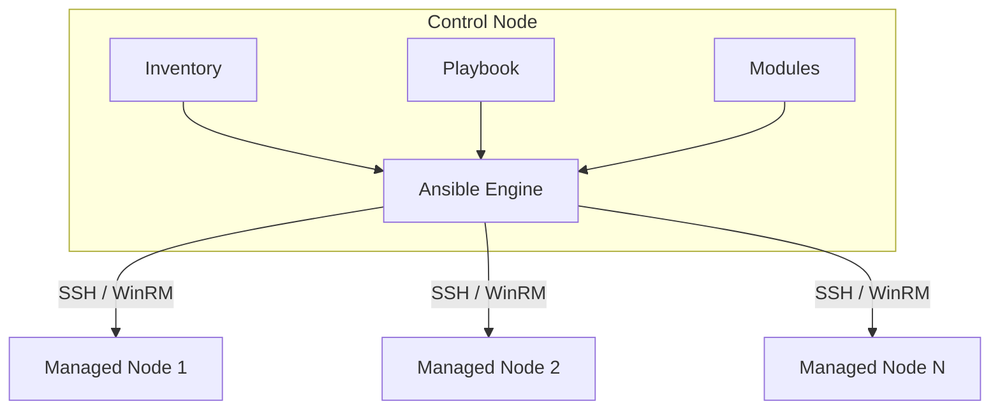
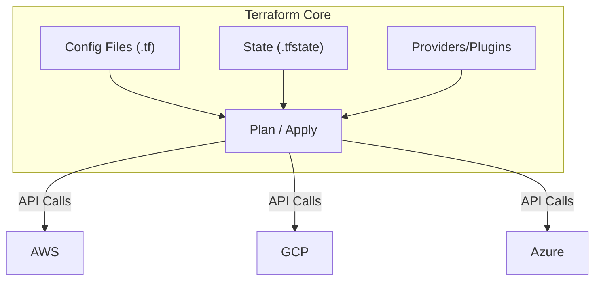

+++
title = "10.Linux自动化运维深度指南"
date = 2026-01-12
description = "Ansible、Terraform、Python自动化的核心概念、架构设计与最佳实践"
[taxonomies]
tags = ["linux", "automation", "ansible", "terraform", "python"]
+++

# Linux自动化运维深度指南

本文聚焦自动化运维的核心理念与实践，涵盖配置管理（Ansible）、基础设施即代码（Terraform）及 Python 自动化开发。

---

## 一、自动化运维核心理念

### 1.1 为什么需要自动化

| 痛点 | 手动运维 | 自动化运维 |
|-----|---------|-----------|
| 一致性 | 人为差异，配置漂移 | 声明式，幂等操作 |
| 效率 | 线性扩展，耗时 | 并行执行，秒级完成 |
| 可追溯 | 口头交接，文档过时 | 代码即文档，版本控制 |
| 可重复 | 依赖经验，难以复现 | 一键重建，灾难恢复 |
| 错误率 | 人为失误频发 | 测试验证，减少风险 |

### 1.2 自动化成熟度模型

```
Level 0: 纯手工
    ↓
Level 1: 脚本化（Shell/Python 脚本）
    ↓
Level 2: 工具化（Ansible/Puppet/Chef）
    ↓
Level 3: 平台化（CI/CD Pipeline）
    ↓
Level 4: 智能化（AIOps、自愈系统）
```

### 1.3 基础设施即代码 (IaC) 原则

| 原则 | 说明 |
|-----|------|
| 声明式 | 描述期望状态，而非执行步骤 |
| 幂等性 | 多次执行结果相同 |
| 版本控制 | 所有配置存入 Git |
| 不可变基础设施 | 替换而非修改 |
| 模块化 | 可复用组件 |
| 自文档化 | 代码本身说明意图 |

---

## 二、Ansible 配置管理

### 2.1 Ansible 架构



**核心特点**：
- **Agentless**：无需在目标节点安装代理
- **Push 模式**：从控制节点推送配置
- **YAML 语法**：简洁易读
- **幂等性**：内置模块保证重复执行安全

### 2.2 核心组件

| 组件 | 作用 | 位置 |
|-----|------|------|
| Inventory | 定义受管节点 | hosts 文件或动态脚本 |
| Playbook | 定义任务编排 | .yml 文件 |
| Role | 可复用任务集合 | roles/ 目录 |
| Module | 执行具体操作的单元 | 内置或自定义 |
| Variable | 参数化配置 | 多个层级 |
| Template | Jinja2 模板 | templates/ 目录 |
| Handler | 条件触发的任务 | handlers/ 目录 |

### 2.3 Inventory 设计

**静态 Inventory 结构**：
```
[webservers]
web1.example.com
web2.example.com

[dbservers]
db1.example.com

[production:children]
webservers
dbservers

[production:vars]
env=prod
```

**动态 Inventory**：
- 从云 API 获取（AWS、GCP、Azure）
- 从 CMDB 获取
- 自定义脚本输出 JSON

**最佳实践**：
- 按环境分组（dev/staging/prod）
- 按角色分组（web/db/cache）
- 使用 `group_vars/` 和 `host_vars/` 管理变量

### 2.4 Playbook 设计原则

| 原则 | 说明 |
|-----|------|
| 单一职责 | 一个 Playbook 完成一个明确任务 |
| 幂等性检查 | 使用 `creates`、`when` 条件 |
| 错误处理 | 使用 `block/rescue/always` |
| 变量优先级 | 理解 22 层变量优先级 |
| 标签使用 | 支持部分执行 |
| 检查模式 | `--check` 干运行 |

**变量优先级（从低到高）**：
1. 命令行 `-e` 参数（最高）
2. Task vars
3. Block vars
4. Role vars
5. Play vars
6. Host vars
7. Group vars
8. Inventory vars
9. Role defaults（最低）

### 2.5 Role 结构

```
roles/
└── webserver/
    ├── defaults/        # 默认变量（优先级最低）
    │   └── main.yml
    ├── vars/            # 角色变量
    │   └── main.yml
    ├── tasks/           # 任务列表
    │   └── main.yml
    ├── handlers/        # 处理程序
    │   └── main.yml
    ├── templates/       # Jinja2 模板
    ├── files/           # 静态文件
    ├── meta/            # 角色依赖
    │   └── main.yml
    └── README.md
```

### 2.6 高级特性

**异步任务**：
- `async`: 任务超时时间
- `poll`: 轮询间隔（0 表示 fire-and-forget）

**委托与本地执行**：
- `delegate_to`: 委托到其他主机
- `local_action`: 在控制节点执行
- `run_once`: 只执行一次

**条件与循环**：
- `when`: 条件执行
- `loop`: 循环（替代 `with_items`）
- `until`: 重试直到成功

**错误控制**：
- `ignore_errors`: 忽略错误
- `failed_when`: 自定义失败条件
- `changed_when`: 自定义变更条件

### 2.7 Ansible 最佳实践

| 类别 | 建议 |
|-----|------|
| 目录结构 | 遵循官方推荐布局 |
| 命名规范 | 使用清晰的任务名称 |
| 版本控制 | 所有 Playbook 入 Git |
| 敏感数据 | 使用 Ansible Vault 加密 |
| 测试 | 使用 Molecule 测试 Role |
| 文档 | 每个 Role 包含 README |
| 复用 | 优先使用 Ansible Galaxy |
| 性能 | 启用 SSH pipelining 和 fact caching |

**性能优化配置** (`ansible.cfg`)：
```ini
[defaults]
forks = 50
pipelining = True
gathering = smart
fact_caching = jsonfile
fact_caching_connection = /tmp/ansible_facts
fact_caching_timeout = 86400

[ssh_connection]
ssh_args = -o ControlMaster=auto -o ControlPersist=60s
```

---

## 三、Terraform 基础设施即代码

### 3.1 Terraform 架构



**工作流程**：
1. **Write**: 编写 `.tf` 配置文件
2. **Init**: 初始化，下载 Provider
3. **Plan**: 预览变更
4. **Apply**: 执行变更
5. **Destroy**: 销毁资源

### 3.2 核心概念

| 概念 | 说明 |
|-----|------|
| Provider | 云平台或服务的接口插件 |
| Resource | 基础设施对象（VM、网络等） |
| Data Source | 查询已存在的资源 |
| Variable | 输入参数 |
| Output | 输出值 |
| Module | 可复用的配置包 |
| State | 资源状态记录 |

### 3.3 State 管理

**State 的作用**：
- 记录资源与真实世界的映射
- 追踪元数据（依赖关系）
- 性能优化（缓存属性值）

**远程 State 后端**：

| 后端 | 特点 |
|-----|------|
| S3 + DynamoDB | AWS 原生，支持锁 |
| GCS | GCP 原生 |
| Azure Blob | Azure 原生 |
| Terraform Cloud | 官方 SaaS，协作功能 |
| Consul | 开源，强一致性 |
| PostgreSQL | 数据库存储 |

**State 最佳实践**：
- 始终使用远程后端
- 启用状态锁定
- 启用加密
- 定期备份
- 不要手动编辑

### 3.4 模块设计

**模块结构**：
```
modules/
└── vpc/
    ├── main.tf        # 主要资源定义
    ├── variables.tf   # 输入变量
    ├── outputs.tf     # 输出值
    ├── versions.tf    # Provider 版本约束
    └── README.md      # 文档
```

**模块设计原则**：
- 单一职责（一个模块一个功能）
- 合理的抽象层次
- 清晰的接口（变量和输出）
- 默认值要合理
- 包含完整文档

### 3.5 工作空间与环境

**Workspace**：
- 同一配置，不同 State
- 适合轻量环境隔离

**目录结构隔离**（推荐）：
```
environments/
├── dev/
│   ├── main.tf
│   └── terraform.tfvars
├── staging/
│   ├── main.tf
│   └── terraform.tfvars
└── prod/
    ├── main.tf
    └── terraform.tfvars
```

### 3.6 Terraform 最佳实践

| 类别 | 建议 |
|-----|------|
| 版本锁定 | 锁定 Terraform 和 Provider 版本 |
| 格式化 | `terraform fmt` 保持一致 |
| 验证 | `terraform validate` 检查语法 |
| Plan 审查 | Apply 前仔细检查 Plan 输出 |
| 小步变更 | 避免一次大规模修改 |
| 敏感数据 | 使用 `sensitive` 标记，不入库 |
| 命名规范 | 资源名包含环境、用途 |
| 标签管理 | 统一的标签策略 |

### 3.7 Terraform vs Ansible

| 维度 | Terraform | Ansible |
|-----|-----------|---------|
| 主要用途 | 基础设施编排 | 配置管理 |
| 模型 | 声明式 | 声明式 + 过程式 |
| 状态 | 有状态 | 无状态 |
| Agent | 无 | 无 |
| 云支持 | 原生强大 | 通过模块支持 |
| OS 配置 | 需配合其他工具 | 原生支持 |
| 最佳搭配 | 创建基础设施 | 配置基础设施 |

**典型工作流**：
```
Terraform 创建 VM → Ansible 配置 VM → 应用部署
```

---

## 四、Python 运维自动化

### 4.1 Python 在运维中的应用

| 场景 | 说明 |
|-----|------|
| 脚本自动化 | 替代复杂 Shell 脚本 |
| API 交互 | 与云平台、监控系统交互 |
| 日志分析 | 解析、聚合、告警 |
| 配置生成 | 模板化配置文件生成 |
| 自定义工具 | CLI 工具、Web 界面 |
| 测试验证 | 基础设施测试 |

### 4.2 常用库

**系统操作**：

| 库 | 用途 |
|---|------|
| os / pathlib | 文件系统操作 |
| subprocess | 执行系统命令 |
| shutil | 高级文件操作 |
| psutil | 系统监控（CPU、内存、磁盘） |
| platform | 系统信息 |

**网络操作**：

| 库 | 用途 |
|---|------|
| socket | 底层网络 |
| paramiko | SSH 客户端 |
| netmiko | 网络设备 SSH |
| requests | HTTP 客户端 |
| aiohttp | 异步 HTTP |
| scapy | 网络包操作 |

**云平台 SDK**：

| 库 | 用途 |
|---|------|
| boto3 | AWS SDK |
| google-cloud-* | GCP SDK |
| azure-mgmt-* | Azure SDK |
| kubernetes | K8s API |
| docker | Docker API |

**运维工具**：

| 库 | 用途 |
|---|------|
| fabric | SSH 批量执行 |
| invoke | 任务运行器 |
| click / typer | CLI 框架 |
| rich | 美化终端输出 |
| pyyaml | YAML 处理 |
| jinja2 | 模板引擎 |

### 4.3 运维脚本设计原则

| 原则 | 说明 |
|-----|------|
| 幂等性 | 多次执行结果一致 |
| 错误处理 | 预期外情况要处理 |
| 日志记录 | 使用 logging 模块 |
| 配置外置 | 参数不硬编码 |
| 安全考虑 | 敏感信息不入代码 |
| 可测试 | 函数小且可测 |
| 文档化 | docstring 和类型注解 |

### 4.4 代码组织

**项目结构**：
```
myops/
├── myops/
│   ├── __init__.py
│   ├── cli.py           # CLI 入口
│   ├── config.py        # 配置管理
│   ├── utils/           # 工具函数
│   ├── modules/         # 功能模块
│   └── templates/       # 模板文件
├── tests/               # 测试
├── pyproject.toml       # 项目配置
├── requirements.txt     # 依赖
└── README.md
```

### 4.5 错误处理模式

**推荐做法**：
- 使用自定义异常类
- 区分可恢复和不可恢复错误
- 记录详细错误信息
- 提供清晰的用户反馈
- 资源清理使用 `finally` 或上下文管理器

### 4.6 并发与性能

| 模式 | 适用场景 |
|-----|---------|
| 多线程 (threading) | I/O 密集型，如网络请求 |
| 多进程 (multiprocessing) | CPU 密集型，如数据处理 |
| 异步 (asyncio) | 大量 I/O 操作 |
| concurrent.futures | 线程/进程池简化接口 |

**选择指南**：
- SSH 批量执行 → 线程池或异步
- 日志分析 → 多进程
- API 批量调用 → 异步

### 4.7 CLI 开发

**推荐框架**：Typer（基于 Click，支持类型注解）

**CLI 设计原则**：
- 遵循 Unix 惯例（`-h`, `-v`, `-q`）
- 支持管道和重定向
- 提供 `--dry-run` 选项
- 返回正确的退出码
- 彩色输出区分信息类型

### 4.8 测试策略

| 测试类型 | 工具 | 用途 |
|---------|------|------|
| 单元测试 | pytest | 函数级测试 |
| 集成测试 | pytest + fixtures | 模块间测试 |
| 基础设施测试 | Testinfra | 验证服务器状态 |
| Ansible 测试 | Molecule | Role 测试 |
| Terraform 测试 | Terratest | 基础设施测试 |

---

## 五、自动化运维架构设计

### 5.1 GitOps 流程

```
开发者 Push → Git Repo → CI Pipeline → 自动化工具 → 基础设施
                ↓
            Code Review
                ↓
              Merge
                ↓
            触发 CD
```

**核心原则**：
- Git 作为唯一真实来源
- 声明式描述期望状态
- 自动化执行变更
- 持续监控和自愈

### 5.2 目录结构设计

```
infrastructure/
├── terraform/
│   ├── modules/
│   └── environments/
│       ├── dev/
│       ├── staging/
│       └── prod/
├── ansible/
│   ├── inventory/
│   ├── playbooks/
│   ├── roles/
│   └── group_vars/
├── scripts/
│   └── python/
├── docs/
└── .github/
    └── workflows/
```

### 5.3 CI/CD 集成

| 阶段 | Terraform | Ansible |
|-----|-----------|---------|
| Lint | `terraform fmt -check` | `ansible-lint` |
| Validate | `terraform validate` | `ansible-playbook --syntax-check` |
| Plan/Check | `terraform plan` | `ansible-playbook --check` |
| Apply | `terraform apply` | `ansible-playbook` |
| Test | Terratest | Testinfra |

### 5.4 安全考虑

| 风险 | 缓解措施 |
|-----|---------|
| 敏感信息泄露 | Vault、AWS Secrets Manager |
| 权限过大 | 最小权限原则，RBAC |
| 未授权变更 | PR 审批，分支保护 |
| 审计追踪 | 所有操作有日志 |
| 状态文件安全 | 加密存储，访问控制 |

---

## 六、工具选型指南

### 6.1 配置管理工具对比

| 工具 | 架构 | 语言 | 学习曲线 | 社区 |
|-----|------|------|---------|------|
| Ansible | Agentless | YAML | 低 | 活跃 |
| Puppet | Agent | DSL | 高 | 成熟 |
| Chef | Agent | Ruby | 高 | 成熟 |
| SaltStack | Agent/Agentless | YAML | 中 | 活跃 |

### 6.2 IaC 工具对比

| 工具 | 状态管理 | 多云 | 语言 |
|-----|---------|------|------|
| Terraform | 有状态 | 强 | HCL |
| Pulumi | 有状态 | 强 | 多种编程语言 |
| CloudFormation | AWS 托管 | 仅 AWS | YAML/JSON |
| CDK | AWS 托管 | 多云 | 编程语言 |

### 6.3 何时使用什么

| 任务 | 推荐工具 |
|-----|---------|
| 创建云资源 | Terraform |
| 配置操作系统 | Ansible |
| 安装软件包 | Ansible |
| 管理容器编排 | Kubernetes + Helm |
| 自定义逻辑 | Python 脚本 |
| 网络设备配置 | Ansible (netmiko) |

---

## 参考资料

- [Ansible Documentation](https://docs.ansible.com/)
- [Terraform Documentation](https://developer.hashicorp.com/terraform/docs)
- [Python for DevOps](https://www.oreilly.com/library/view/python-for-devops/9781492057680/)
- [Infrastructure as Code](https://www.oreilly.com/library/view/infrastructure-as-code/9781098114664/)
- [The Practice of Cloud System Administration](https://www.oreilly.com/library/view/the-practice-of/9780133478549/)

---

## 相关文章

- [上一篇：Linux安全加固深度指南](/articles/devops/linux-09-安全加固指南/)
- [下一篇：Linux高级工程师必备技能详解](/articles/devops/linux-11-高级工程师必备技能/)
