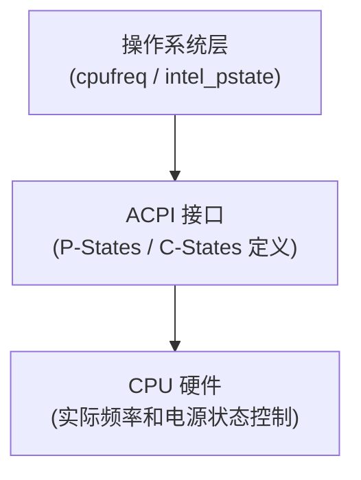

+++
title = "BIOS与硬件级调优指南"
date = 2026-01-12
weight = 12000
description = "C-States、P-States、Turbo Boost等硬件级性能调优的深度剖析"
[taxonomies]
tags = ["linux", "performance", "bios", "hardware", "tuning"]
+++

# BIOS与硬件级调优指南

本文深入剖析 CPU 电源管理、频率控制等硬件级调优技术，帮助在低延迟和高性能场景下获得最佳表现。

---

## 一、CPU 电源管理概述

### 1.1 为什么需要了解硬件级调优

现代 CPU 默认针对**能效比**优化，而非**极致性能**：

| 默认行为 | 性能影响 |
|---------|---------|
| 动态降频 | 唤醒延迟 10-100μs |
| 深度睡眠 | 唤醒延迟可达 ms 级 |
| 频率波动 | 性能不可预测 |
| 核心迁移 | 缓存失效 |

**低延迟场景需求**：
- 高频交易（HFT）：微秒级延迟敏感
- 实时系统：确定性执行时间
- 数据库：稳定的查询响应
- 游戏服务器：帧时间稳定

### 1.2 Intel CPU 电源管理架构



---

## 二、C-States（CPU 空闲状态）

### 2.1 什么是 C-States

C-States 是 CPU 在**空闲时**的省电状态。数字越大，睡眠越深，省电越多，但唤醒延迟也越高。

### 2.2 常见 C-States

| 状态 | 名称 | 唤醒延迟 | 省电效果 | 说明 |
|-----|------|---------|---------|------|
| C0 | Active | 0 | 无 | 正在执行指令 |
| C1 | Halt | ~1μs | 低 | 停止执行，时钟运行 |
| C1E | Enhanced Halt | ~10μs | 中 | C1 + 降低频率和电压 |
| C3 | Sleep | ~50-100μs | 中 | L1/L2 缓存刷新 |
| C6 | Deep Power Down | ~100-200μs | 高 | 核心断电，状态保存 |
| C7 | Deeper Sleep | ~150-300μs | 更高 | LLC 也可刷新 |
| C8/C9/C10 | Package C-States | ms 级 | 最高 | 整个封装睡眠 |

### 2.3 C-States 对延迟的影响

**真实测量示例**（Intel Xeon）：

| 状态 | 唤醒延迟 (μs) | 99th 百分位 (μs) |
|-----|-------------|------------------|
| C0 only | 0 | 1 |
| C1 | 1-2 | 5 |
| C1E | 10-20 | 50 |
| C6 | 100-200 | 300 |

**结论**：对于微秒级延迟敏感的应用，深度 C-State 是不可接受的。

### 2.4 禁用深度 C-States

**BIOS 设置**（推荐）：
1. 进入 BIOS → CPU Configuration / Power Management
2. 设置 `Package C-State Limit` = `C0/C1`
3. 禁用 `C6 Report` 和更深状态

**Linux 内核参数**：
```
processor.max_cstate=1
intel_idle.max_cstate=0
```

**运行时限制**：
```bash
# 查看当前状态
cat /sys/devices/system/cpu/cpu0/cpuidle/state*/name
cat /sys/devices/system/cpu/cpu0/cpuidle/state*/latency

# 禁用特定状态
echo 1 > /sys/devices/system/cpu/cpu0/cpuidle/state2/disable
```

### 2.5 验证 C-States 配置

```bash
# 查看 cpuidle 驱动
cat /sys/devices/system/cpu/cpuidle/current_driver

# 查看各状态使用情况
cat /sys/devices/system/cpu/cpu0/cpuidle/state*/usage
cat /sys/devices/system/cpu/cpu0/cpuidle/state*/time

# 使用 turbostat 监控
turbostat --Summary --show Busy%,Bzy_MHz,CoreTmp,PkgTmp,PkgWatt,C1%,C6%
```

---

## 三、P-States（性能状态）

### 3.1 什么是 P-States

P-States 控制 CPU 在**活动时**的频率和电压。P0 是最高性能，数字越大性能越低。

### 3.2 P-States 与频率

| 状态 | 说明 |
|-----|------|
| P0 | 最高频率（可能含 Turbo） |
| P1 | 最高非 Turbo 频率 |
| P2...Pn | 逐级降低 |
| Pn | 最低运行频率 |

### 3.3 Linux 频率调节

**CPUFreq Governor**：

| Governor | 行为 | 适用场景 |
|----------|------|---------|
| performance | 始终最高频率 | 低延迟、性能测试 |
| powersave | 始终最低频率 | 极致省电 |
| ondemand | 按需调节 | 通用服务器 |
| conservative | 渐进调节 | 温和响应 |
| schedutil | 调度器驱动 | 现代内核默认 |

**设置 Governor**：
```bash
# 查看当前
cat /sys/devices/system/cpu/cpu*/cpufreq/scaling_governor

# 设置（所有核心）
echo performance | tee /sys/devices/system/cpu/cpu*/cpufreq/scaling_governor

# 永久设置：使用 cpupower 或 tuned
cpupower frequency-set -g performance
```

### 3.4 intel_pstate 驱动

现代 Intel CPU 使用 `intel_pstate` 驱动，与传统 `acpi-cpufreq` 不同：

| 特性 | intel_pstate | acpi-cpufreq |
|-----|-------------|--------------|
| 控制方式 | 直接控制 MSR | 通过 ACPI |
| Turbo 控制 | 原生支持 | 有限支持 |
| 精细度 | 更高 | 较粗 |

**intel_pstate 模式**：
- `active`：驱动完全控制
- `passive`：使用传统 Governor
- 禁用：使用内核参数 `intel_pstate=disable`

### 3.5 固定 CPU 频率

**HFT 场景最佳实践**：固定到最高非 Turbo 频率

**方法1：使用 cpupower**
```bash
cpupower frequency-set -f 2.5GHz
```

**方法2：设置范围**
```bash
cpupower frequency-set -d 2.5GHz -u 2.5GHz
```

**方法3：intel_pstate**
```bash
echo 100 > /sys/devices/system/cpu/intel_pstate/min_perf_pct
echo 100 > /sys/devices/system/cpu/intel_pstate/max_perf_pct
```

---

## 四、Turbo Boost

### 4.1 Turbo Boost 原理

Turbo Boost 允许 CPU 在热量和功耗允许的范围内，临时运行在高于标称频率的速度。

**影响因素**：
- 活动核心数量
- 当前功耗
- 当前温度
- 指令类型（AVX 会降 Turbo）

### 4.2 Turbo Boost 的问题

| 问题 | 说明 |
|-----|------|
| 频率波动 | 性能不可预测 |
| 热降频 | 高负载时突然降频 |
| 核心差异 | 不同核心 Turbo 幅度不同 |
| AVX 偏移 | AVX 指令降低 Turbo |

**对于低延迟场景**：Turbo 的不确定性通常弊大于利。

### 4.3 禁用 Turbo Boost

**BIOS 设置**（推荐）：
1. 进入 BIOS → CPU Configuration
2. 设置 `Intel Turbo Boost Technology` = Disabled

**Linux 运行时**：
```bash
# 禁用
echo 1 > /sys/devices/system/cpu/intel_pstate/no_turbo

# 启用
echo 0 > /sys/devices/system/cpu/intel_pstate/no_turbo

# 查看状态
cat /sys/devices/system/cpu/intel_pstate/no_turbo
```

**MSR 直接控制**：
```bash
# 需要 msr-tools
wrmsr -a 0x1a0 0x4000850089  # 禁用 Turbo
```

### 4.4 Turbo Boost 监控

```bash
# 使用 turbostat
turbostat --interval 1

# 关键指标
# Avg_MHz: 实际运行频率
# Busy%: CPU 活动百分比
# Bzy_MHz: 活动时频率
```

---

## 五、其他 BIOS 性能设置

### 5.1 超线程（Hyper-Threading）

| 场景 | 建议 |
|-----|------|
| 吞吐量优先 | 启用 |
| 低延迟优先 | 禁用 |
| 缓存敏感任务 | 禁用 |

**禁用后效果**：
- 每个物理核心独享 L1/L2 缓存
- 减少核心间干扰
- 延迟更稳定

### 5.2 NUMA 相关设置

| 设置 | 低延迟推荐 |
|-----|-----------|
| NUMA | 启用 |
| Sub-NUMA Clustering (SNC) | 按需 |
| NUMA Interleaving | 禁用 |

### 5.3 内存相关设置

| 设置 | 说明 |
|-----|------|
| Memory Frequency | 最高支持频率 |
| Memory Channel Mode | 双通道/四通道 |
| Memory Patrol Scrub | 可能引起延迟抖动 |
| Memory Demand Scrub | 建议禁用于低延迟 |

### 5.4 电源管理设置

| 设置 | 低延迟推荐 |
|-----|-----------|
| Power Profile | Maximum Performance |
| CPU Power Management | OS Controlled 或 Disabled |
| Uncore Frequency | 最高或固定 |
| Energy Efficient Turbo | 禁用 |

### 5.5 其他设置

| 设置 | 低延迟推荐 |
|-----|-----------|
| VT-d (虚拟化) | 按需（不用则禁用） |
| Speed Select | 按需 |
| Hardware Prefetcher | 通常启用（测试验证） |
| Adjacent Cache Line Prefetch | 测试验证 |

---

## 六、Linux 内核启动参数

### 6.1 低延迟推荐参数

```
# CPU 隔离
isolcpus=4-15
nohz_full=4-15
rcu_nocbs=4-15

# C-State 限制
processor.max_cstate=1
intel_idle.max_cstate=0

# P-State 控制
intel_pstate=disable   # 使用 acpi-cpufreq
# 或
intel_pstate=passive   # 使用传统 governor

# 其他优化
idle=poll              # 极端：永不睡眠
nosoftlockup
nmi_watchdog=0
audit=0
mce=off
skew_tick=1
tsc=reliable
clocksource=tsc
```

### 6.2 参数说明

| 参数 | 说明 |
|-----|------|
| isolcpus | 从调度器隔离指定 CPU |
| nohz_full | 隔离 CPU 上禁用定时器中断 |
| rcu_nocbs | RCU 回调卸载 |
| idle=poll | CPU 空闲时忙等而非睡眠 |
| skew_tick | 错开各 CPU 的定时器中断 |

### 6.3 idle=poll 注意事项

**优点**：
- 零唤醒延迟
- 最低中断延迟

**缺点**：
- 100% CPU 使用率显示（即使空闲）
- 功耗极高
- 发热量大
- 可能影响 Turbo

**适用场景**：极端低延迟需求，如 HFT 核心线程。

---

## 七、验证与监控

### 7.1 关键指标

| 指标 | 工具 | 说明 |
|-----|------|------|
| CPU 频率 | turbostat | 实际运行频率 |
| C-State 分布 | turbostat | 各状态时间占比 |
| 延迟抖动 | cyclictest | 中断响应延迟 |
| 温度 | turbostat | 热降频风险 |
| 功耗 | turbostat | 整体功耗 |

### 7.2 turbostat 使用

```bash
# 基本监控
turbostat --Summary --interval 1

# 详细 C-State
turbostat --show Core,CPU,Avg_MHz,Busy%,Bzy_MHz,C1%,C6%,CoreTmp

# 输出到文件
turbostat --out turbo.log --interval 1 &
```

### 7.3 cyclictest 延迟测试

```bash
# 安装
apt install rt-tests

# 基本测试
cyclictest -m -p 99 -h 100 -D 60s

# 详细测试
cyclictest -t 4 -p 99 -i 1000 -D 60s -m -n

# 参数说明
# -t: 线程数
# -p: 优先级
# -i: 测试间隔 (μs)
# -D: 持续时间
# -m: 锁定内存
# -n: 使用 nanosleep
```

**解读结果**：
- Min/Avg/Max 延迟
- 直方图分布
- 最大值代表最坏情况

### 7.4 持续监控

```bash
# 使用 watch
watch -n 1 'cat /sys/devices/system/cpu/cpu0/cpufreq/scaling_cur_freq'

# 使用 perf
perf stat -e power/energy-cores/,power/energy-pkg/ -I 1000
```

---

## 八、调优检查清单

### 8.1 BIOS 设置

```
□ C-States
  □ Package C-State Limit = C0/C1
  □ C6 Report = Disabled
  □ 深度 C-States 禁用

□ P-States
  □ 了解最高非 Turbo 频率
  □ 考虑禁用 SpeedStep

□ Turbo Boost
  □ 决定启用或禁用
  □ 如禁用，在 BIOS 设置

□ 超线程
  □ 评估是否需要
  □ 低延迟场景考虑禁用

□ 电源配置
  □ Power Profile = Maximum Performance
  □ Energy Efficient Turbo = Disabled

□ 内存
  □ 最高支持频率
  □ Patrol Scrub 评估
```

### 8.2 Linux 配置

```
□ 内核参数
  □ C-State 限制
  □ CPU 隔离 (isolcpus)
  □ RCU 卸载

□ CPUFreq
  □ Governor = performance
  □ 频率固定（如需要）

□ 验证
  □ turbostat 确认设置生效
  □ cyclictest 测量延迟
```

### 8.3 权衡考虑

| 优化 | 收益 | 代价 |
|-----|------|------|
| 禁用深度 C-State | 降低唤醒延迟 | 增加功耗 |
| 禁用 Turbo | 频率稳定 | 峰值性能下降 |
| 禁用 HT | 减少干扰 | 吞吐量下降 |
| idle=poll | 零唤醒延迟 | 极高功耗 |
| 固定频率 | 性能可预测 | 无法利用 Turbo |

---

## 九、常见问题

### 9.1 设置不生效

**可能原因**：
- BIOS 设置覆盖了 Linux 设置
- intel_pstate 驱动覆盖 Governor
- 参数拼写错误

**排查方法**：
- 使用 turbostat 验证实际状态
- 检查 dmesg 中的相关信息
- 确认驱动加载情况

### 9.2 频率跳动

**可能原因**：
- Turbo 开启
- 温度限制
- 功耗限制

**解决方法**：
- 禁用 Turbo
- 检查散热
- 调整功耗限制

### 9.3 功耗过高

**平衡方法**：
- 不是所有 CPU 都需要低延迟配置
- 只对关键核心优化
- 非关键服务使用省电配置

---

## 参考资料

- [Intel 64 and IA-32 Architectures SDM](https://www.intel.com/content/www/us/en/developer/articles/technical/intel-sdm.html)
- [Linux Kernel Power Management](https://www.kernel.org/doc/html/latest/admin-guide/pm/)
- [Red Hat Performance Tuning Guide](https://access.redhat.com/documentation/en-us/red_hat_enterprise_linux/8/html/monitoring_and_managing_system_status_and_performance/)
- [Dell PowerEdge BIOS Tuning Guide](https://www.dell.com/support/kbdoc/)
- [HPE Gen10 BIOS Tuning Guide](https://support.hpe.com/)

---

## 相关文章

- [上一篇：Linux高级工程师必备技能详解](@/articles/devops/linux-11-高级工程师必备技能.md)
