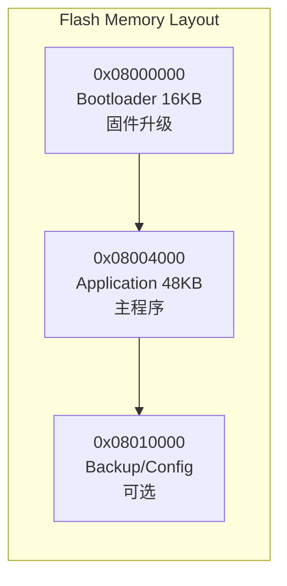

+++
title = "嵌入式高级知识"
date = 2026-01-19
weight = 3000
description = "嵌入式高级主题：低功耗设计、Bootloader开发、安全机制、性能优化、可靠性设计"
[taxonomies]
tags = ["embedded", "bootloader", "low-power", "security", "optimization"]
+++

# 嵌入式高级知识

本文涵盖嵌入式开发的高级主题，是从熟练到专家的进阶知识。

---

## 一、低功耗设计

### 1.1 功耗来源分析

| 功耗类型 | 来源 | 优化方向 |
|---------|------|---------|
| 动态功耗 | CPU运行、外设活动 | 降频、关闭不用外设 |
| 静态功耗 | 漏电流 | 低功耗模式 |
| 外设功耗 | ADC、无线模块等 | 按需开启 |
| 外围电路 | LDO、传感器 | 硬件优化 |

### 1.2 低功耗模式 (STM32)

| 模式 | 唤醒源 | 唤醒时间 | 功耗 |
|-----|--------|---------|------|
| Sleep | 任意中断 | ~1μs | mA级 |
| Stop | EXTI、RTC | ~5μs | μA级 |
| Standby | WKUP引脚、RTC | ~50μs | nA级 |

```c
// 进入Stop模式
void enter_stop_mode(void) {
    // 关闭不需要的外设时钟
    __HAL_RCC_GPIOB_CLK_DISABLE();
    __HAL_RCC_USART1_CLK_DISABLE();
    
    // 配置唤醒源
    HAL_RTCEx_SetWakeUpTimer_IT(&hrtc, 0x1000, RTC_WAKEUPCLOCK_RTCCLK_DIV16);
    
    // 进入Stop模式
    HAL_SuspendTick();
    HAL_PWR_EnterSTOPMode(PWR_LOWPOWERREGULATOR_ON, PWR_STOPENTRY_WFI);
    
    // 唤醒后恢复时钟
    SystemClock_Config();
    HAL_ResumeTick();
}
```

### 1.3 低功耗设计最佳实践

```c
// 1. 动态调频
void adjust_clock_for_task(task_type_t task) {
    switch (task) {
        case TASK_IDLE:
            set_sysclk_mhz(8);    // 低速运行
            break;
        case TASK_COMPUTE:
            set_sysclk_mhz(72);   // 全速运行
            break;
    }
}

// 2. 外设按需开关
void adc_read_with_power_save(void) {
    __HAL_RCC_ADC1_CLK_ENABLE();   // 开启
    HAL_ADC_Start(&hadc1);
    HAL_ADC_PollForConversion(&hadc1, 100);
    uint32_t value = HAL_ADC_GetValue(&hadc1);
    __HAL_RCC_ADC1_CLK_DISABLE();  // 关闭
}

// 3. 避免忙等待
// 错误
while (!data_ready);  // CPU 100%

// 正确
while (!data_ready) {
    __WFE();  // 等待事件，CPU休眠
}
```

### 1.4 功耗测量

| 方法 | 精度 | 设备 |
|-----|------|------|
| 万用表直测 | mA级 | 普通万用表 |
| 电流探头 | μA级 | 示波器+电流探头 |
| 功耗分析仪 | nA级 | Nordic PPK2, Joulescope |
| 软件估算 | 参考 | 基于Datasheet计算 |

---

## 二、Bootloader开发

### 2.1 Bootloader作用



### 2.2 Bootloader基本流程

```c
// bootloader main
int main(void) {
    HAL_Init();
    SystemClock_Config();
    
    // 检查是否需要升级
    if (check_update_flag() || check_update_button()) {
        // 进入升级模式
        uart_init(115200);
        receive_and_flash_firmware();
        clear_update_flag();
    }
    
    // 跳转到应用程序
    if (verify_application()) {
        jump_to_application(APP_ADDRESS);
    } else {
        // 应用程序无效，等待升级
        enter_recovery_mode();
    }
}
```

### 2.3 跳转到应用程序

```c
#define APP_ADDRESS  0x08004000

typedef void (*pFunction)(void);

void jump_to_application(uint32_t app_addr) {
    uint32_t app_stack = *(volatile uint32_t*)app_addr;
    uint32_t app_entry = *(volatile uint32_t*)(app_addr + 4);
    
    // 检查栈指针有效性
    if ((app_stack & 0x2FFE0000) != 0x20000000) {
        return;  // 无效应用
    }
    
    // 关闭所有中断
    __disable_irq();
    
    // 关闭所有外设
    HAL_DeInit();
    
    // 重置时钟
    HAL_RCC_DeInit();
    
    // 设置向量表偏移
    SCB->VTOR = app_addr;
    
    // 设置栈指针并跳转
    __set_MSP(app_stack);
    pFunction app_reset = (pFunction)app_entry;
    app_reset();
}
```

### 2.4 固件升级协议

```c
// 简单的XMODEM协议实现
#define SOH  0x01
#define EOT  0x04
#define ACK  0x06
#define NAK  0x15

typedef struct {
    uint8_t start;
    uint8_t block_num;
    uint8_t block_num_inv;
    uint8_t data[128];
    uint8_t checksum;
} xmodem_packet_t;

int receive_firmware(uint32_t flash_addr) {
    xmodem_packet_t pkt;
    uint8_t expected_block = 1;
    
    uart_send_byte(NAK);  // 请求开始
    
    while (1) {
        if (uart_recv(&pkt, sizeof(pkt), 3000) != 0) {
            uart_send_byte(NAK);
            continue;
        }
        
        if (pkt.start == EOT) {
            uart_send_byte(ACK);
            return 0;  // 传输完成
        }
        
        if (pkt.start == SOH && 
            pkt.block_num == expected_block &&
            verify_checksum(&pkt)) {
            
            flash_write(flash_addr, pkt.data, 128);
            flash_addr += 128;
            expected_block++;
            uart_send_byte(ACK);
        } else {
            uart_send_byte(NAK);
        }
    }
}
```

---

## 三、安全机制

### 3.1 代码保护

| 机制 | 作用 | 配置 |
|-----|------|------|
| 读保护 (RDP) | 防止通过调试器读取Flash | Option Bytes |
| 写保护 (WRP) | 防止意外擦除 | Option Bytes |
| 防克隆 | 芯片唯一ID绑定 | 软件实现 |

```c
// 读取芯片唯一ID
void get_unique_id(uint32_t *id) {
    id[0] = *(uint32_t*)(0x1FFFF7E8);
    id[1] = *(uint32_t*)(0x1FFFF7EC);
    id[2] = *(uint32_t*)(0x1FFFF7F0);
}

// 基于唯一ID的简单防克隆
bool verify_license(void) {
    uint32_t uid[3];
    get_unique_id(uid);
    uint32_t expected = calculate_license_key(uid);
    return (expected == stored_license_key);
}
```

### 3.2 安全启动

```c
// 固件签名验证
#include "mbedtls/sha256.h"
#include "mbedtls/rsa.h"

bool verify_firmware_signature(uint32_t fw_addr, uint32_t fw_size,
                                uint8_t *signature) {
    uint8_t hash[32];
    
    // 计算固件哈希
    mbedtls_sha256((uint8_t*)fw_addr, fw_size, hash, 0);
    
    // RSA验证签名
    mbedtls_rsa_context rsa;
    mbedtls_rsa_init(&rsa, MBEDTLS_RSA_PKCS_V15, 0);
    load_public_key(&rsa);
    
    int ret = mbedtls_rsa_pkcs1_verify(&rsa, NULL, NULL,
                                        MBEDTLS_RSA_PUBLIC,
                                        MBEDTLS_MD_SHA256,
                                        32, hash, signature);
    mbedtls_rsa_free(&rsa);
    
    return (ret == 0);
}
```

### 3.3 加密通信

```c
// AES加密示例
#include "mbedtls/aes.h"

void aes_encrypt_block(uint8_t *input, uint8_t *output, uint8_t *key) {
    mbedtls_aes_context aes;
    mbedtls_aes_init(&aes);
    mbedtls_aes_setkey_enc(&aes, key, 128);
    mbedtls_aes_crypt_ecb(&aes, MBEDTLS_AES_ENCRYPT, input, output);
    mbedtls_aes_free(&aes);
}

// 安全密钥存储
// 不要这样做：
const uint8_t key[] = {0x01, 0x02, ...};  // 明文存储

// 应该：
// 1. 使用芯片的安全存储区
// 2. 使用芯片唯一ID派生密钥
// 3. 使用硬件加密引擎
```

---

## 四、性能优化

### 4.1 代码优化

```c
// 1. 循环展开
// 优化前
for (int i = 0; i < 100; i++) {
    data[i] = process(i);
}

// 优化后
for (int i = 0; i < 100; i += 4) {
    data[i]   = process(i);
    data[i+1] = process(i+1);
    data[i+2] = process(i+2);
    data[i+3] = process(i+3);
}

// 2. 查表替代计算
// 优化前
uint8_t sin_value = (uint8_t)(sin(angle) * 127 + 128);

// 优化后（预计算正弦表）
const uint8_t sin_table[256] = { /* 预计算值 */ };
uint8_t sin_value = sin_table[angle];

// 3. 位操作替代乘除
x = x * 8;   // 慢
x = x << 3;  // 快

y = y / 16;  // 慢
y = y >> 4;  // 快
```

### 4.2 DMA优化

```c
// 使用DMA减少CPU占用
typedef struct {
    uint16_t adc_values[8];
    volatile uint8_t dma_complete;
} adc_dma_t;

static adc_dma_t adc_data;

void adc_start_dma(void) {
    adc_data.dma_complete = 0;
    HAL_ADC_Start_DMA(&hadc1, (uint32_t*)adc_data.adc_values, 8);
}

void HAL_ADC_ConvCpltCallback(ADC_HandleTypeDef *hadc) {
    adc_data.dma_complete = 1;
}

// 零拷贝环形缓冲区
typedef struct {
    uint8_t buffer[1024];
    volatile uint16_t head;
    volatile uint16_t tail;
} ring_buffer_t;

// DMA直接写入环形缓冲区
void uart_rx_dma_init(ring_buffer_t *rb) {
    // 配置DMA循环模式，自动填充buffer
    HAL_UART_Receive_DMA(&huart1, rb->buffer, sizeof(rb->buffer));
}
```

### 4.3 缓存优化 (Cortex-M7)

```c
// 数据缓存管理
#include "core_cm7.h"

// 关键数据放入非缓存区域
__attribute__((section(".noncacheable")))
uint8_t dma_buffer[256];

// 或手动管理缓存
void dma_prepare_tx(uint8_t *buf, uint32_t len) {
    // 写入后刷新缓存，确保DMA读到最新数据
    SCB_CleanDCache_by_Addr((uint32_t*)buf, len);
}

void dma_complete_rx(uint8_t *buf, uint32_t len) {
    // 读取前无效化缓存，确保CPU读到DMA写入的数据
    SCB_InvalidateDCache_by_Addr((uint32_t*)buf, len);
}
```

### 4.4 编译器优化

```makefile
# GCC优化选项
CFLAGS += -O2                    # 优化级别
CFLAGS += -flto                  # 链接时优化
CFLAGS += -ffunction-sections    # 函数分段
CFLAGS += -fdata-sections        # 数据分段
LDFLAGS += -Wl,--gc-sections     # 去除未使用段

# 关键函数优化
__attribute__((optimize("O3")))
void critical_function(void) {
    // 这个函数使用最高优化级别
}

# 禁止优化（调试用）
__attribute__((optimize("O0")))
void debug_function(void) {
    // 这个函数不优化
}
```

---

## 五、可靠性设计

### 5.1 看门狗

```c
// 独立看门狗 (IWDG) - 独立时钟，最可靠
void iwdg_init(uint32_t timeout_ms) {
    IWDG->KR = 0x5555;  // 解锁写保护
    IWDG->PR = 4;       // 分频系数 64
    IWDG->RLR = (timeout_ms * 40) / 64;  // 重装值
    IWDG->KR = 0xCCCC;  // 启动看门狗
}

void iwdg_feed(void) {
    IWDG->KR = 0xAAAA;  // 喂狗
}

// 多任务系统的看门狗设计
typedef struct {
    uint32_t task_alive_flags;
    uint32_t expected_flags;
} wdg_monitor_t;

void task_report_alive(uint8_t task_id) {
    wdg_monitor.task_alive_flags |= (1 << task_id);
}

void wdg_check_and_feed(void) {
    if (wdg_monitor.task_alive_flags == wdg_monitor.expected_flags) {
        iwdg_feed();
        wdg_monitor.task_alive_flags = 0;
    }
    // 否则不喂狗，系统会复位
}
```

### 5.2 CRC校验

```c
// 硬件CRC（STM32内置）
uint32_t calc_crc32_hw(uint8_t *data, uint32_t len) {
    __HAL_RCC_CRC_CLK_ENABLE();
    CRC->CR = CRC_CR_RESET;
    
    uint32_t *ptr = (uint32_t*)data;
    for (uint32_t i = 0; i < len/4; i++) {
        CRC->DR = ptr[i];
    }
    
    return CRC->DR;
}

// 数据完整性检查
typedef struct {
    uint32_t magic;
    config_data_t config;
    uint32_t crc;
} config_block_t;

bool load_config(config_data_t *config) {
    config_block_t *block = (config_block_t*)CONFIG_FLASH_ADDR;
    
    if (block->magic != CONFIG_MAGIC) {
        return false;
    }
    
    uint32_t calc_crc = calc_crc32_hw((uint8_t*)&block->config, 
                                       sizeof(config_data_t));
    if (calc_crc != block->crc) {
        return false;
    }
    
    memcpy(config, &block->config, sizeof(config_data_t));
    return true;
}
```

### 5.3 双备份机制

```c
// 关键数据双备份
typedef struct {
    uint32_t sequence;
    config_data_t data;
    uint32_t crc;
} config_slot_t;

#define SLOT_A_ADDR  0x0800F000
#define SLOT_B_ADDR  0x0800F800

config_slot_t* get_valid_config(void) {
    config_slot_t *slot_a = (config_slot_t*)SLOT_A_ADDR;
    config_slot_t *slot_b = (config_slot_t*)SLOT_B_ADDR;
    
    bool a_valid = verify_crc(slot_a);
    bool b_valid = verify_crc(slot_b);
    
    if (a_valid && b_valid) {
        return (slot_a->sequence > slot_b->sequence) ? slot_a : slot_b;
    } else if (a_valid) {
        return slot_a;
    } else if (b_valid) {
        return slot_b;
    }
    return NULL;  // 都无效，使用默认值
}

void save_config(config_data_t *config) {
    config_slot_t *current = get_valid_config();
    uint32_t new_seq = current ? current->sequence + 1 : 1;
    
    // 写入另一个槽
    config_slot_t *target = (current == (config_slot_t*)SLOT_A_ADDR) 
                            ? (config_slot_t*)SLOT_B_ADDR 
                            : (config_slot_t*)SLOT_A_ADDR;
    
    config_slot_t new_slot = {
        .sequence = new_seq,
        .data = *config,
    };
    new_slot.crc = calc_crc32_hw((uint8_t*)&new_slot.data, sizeof(config_data_t));
    
    flash_write((uint32_t)target, &new_slot, sizeof(config_slot_t));
}
```

### 5.4 错误恢复

```c
// 系统状态监控
typedef enum {
    RESET_REASON_POR,      // 上电复位
    RESET_REASON_WDG,      // 看门狗复位
    RESET_REASON_SOFT,     // 软件复位
    RESET_REASON_FAULT,    // 错误复位
} reset_reason_t;

reset_reason_t get_reset_reason(void) {
    if (RCC->CSR & RCC_CSR_PORRSTF) return RESET_REASON_POR;
    if (RCC->CSR & RCC_CSR_IWDGRSTF) return RESET_REASON_WDG;
    if (RCC->CSR & RCC_CSR_SFTRSTF) return RESET_REASON_SOFT;
    return RESET_REASON_FAULT;
}

// 持久化错误日志（存入备份寄存器或Flash）
void log_fault(uint32_t pc, uint32_t lr, uint32_t fault_type) {
    fault_log_t log = {
        .timestamp = get_rtc_time(),
        .pc = pc,
        .lr = lr,
        .fault_type = fault_type,
        .reset_count = read_reset_count() + 1,
    };
    
    write_to_backup_sram(&log);
}
```

---

## 六、高级调试技术

### 6.1 ITM追踪 (SWO)

```c
// ITM printf（不占用UART）
#include "core_cm4.h"

int _write(int file, char *ptr, int len) {
    for (int i = 0; i < len; i++) {
        ITM_SendChar(*ptr++);
    }
    return len;
}

// OpenOCD配置
// openocd -f interface/stlink.cfg -f target/stm32f4x.cfg \
//         -c "tpiu config internal swo.log uart off 168000000"
```

### 6.2 运行时分析

```c
// 使用DWT进行精确计时
void dwt_init(void) {
    CoreDebug->DEMCR |= CoreDebug_DEMCR_TRCENA_Msk;
    DWT->CYCCNT = 0;
    DWT->CTRL |= DWT_CTRL_CYCCNTENA_Msk;
}

uint32_t dwt_get_cycles(void) {
    return DWT->CYCCNT;
}

// 测量函数执行时间
void profile_function(void) {
    uint32_t start = dwt_get_cycles();
    
    target_function();
    
    uint32_t end = dwt_get_cycles();
    uint32_t cycles = end - start;
    float us = (float)cycles / (SystemCoreClock / 1000000);
    printf("Execution time: %.2f us\n", us);
}
```

### 6.3 内存泄漏检测

```c
// 简单的堆内存追踪
typedef struct {
    void *ptr;
    size_t size;
    const char *file;
    int line;
} alloc_record_t;

#define MAX_ALLOCS 100
static alloc_record_t alloc_table[MAX_ALLOCS];

void* tracked_malloc(size_t size, const char *file, int line) {
    void *ptr = malloc(size);
    if (ptr) {
        for (int i = 0; i < MAX_ALLOCS; i++) {
            if (alloc_table[i].ptr == NULL) {
                alloc_table[i] = (alloc_record_t){ptr, size, file, line};
                break;
            }
        }
    }
    return ptr;
}

void tracked_free(void *ptr) {
    for (int i = 0; i < MAX_ALLOCS; i++) {
        if (alloc_table[i].ptr == ptr) {
            alloc_table[i].ptr = NULL;
            break;
        }
    }
    free(ptr);
}

#define malloc(s) tracked_malloc(s, __FILE__, __LINE__)
#define free(p) tracked_free(p)

void print_leak_report(void) {
    for (int i = 0; i < MAX_ALLOCS; i++) {
        if (alloc_table[i].ptr != NULL) {
            printf("Leak: %p, %d bytes, %s:%d\n",
                   alloc_table[i].ptr,
                   alloc_table[i].size,
                   alloc_table[i].file,
                   alloc_table[i].line);
        }
    }
}
```

---

## 七、生产与测试

### 7.1 生产烧录

```bash
# 批量烧录脚本
#!/bin/bash
FIRMWARE="firmware_v1.2.3.bin"
SERIAL_FILE="serial_numbers.txt"

while read serial; do
    echo "Programming device: $serial"
    
    # 烧录固件
    openocd -f interface/stlink.cfg -f target/stm32f1x.cfg \
            -c "program $FIRMWARE verify reset exit"
    
    # 写入序列号
    openocd -f interface/stlink.cfg -f target/stm32f1x.cfg \
            -c "flash write_image erase serial_$serial.bin 0x0800FC00" \
            -c "reset run" -c "exit"
    
    # 运行自检
    python3 run_selftest.py $serial
    
done < "$SERIAL_FILE"
```

### 7.2 自动化测试

```c
// 自检程序
typedef struct {
    const char *name;
    bool (*test_func)(void);
} selftest_item_t;

bool test_gpio(void) {
    // 环回测试
    gpio_set(TEST_OUT_PIN, 1);
    delay_us(10);
    return gpio_get(TEST_IN_PIN) == 1;
}

bool test_flash(void) {
    uint8_t test_data[] = {0x55, 0xAA, 0x12, 0x34};
    flash_write(TEST_ADDR, test_data, sizeof(test_data));
    return memcmp((void*)TEST_ADDR, test_data, sizeof(test_data)) == 0;
}

const selftest_item_t selftests[] = {
    {"GPIO", test_gpio},
    {"Flash", test_flash},
    {"ADC", test_adc},
    {"UART", test_uart},
    // ...
};

void run_all_selftests(void) {
    for (int i = 0; i < sizeof(selftests)/sizeof(selftests[0]); i++) {
        bool result = selftests[i].test_func();
        printf("[%s] %s: %s\n", 
               result ? "PASS" : "FAIL",
               selftests[i].name,
               result ? "OK" : "FAILED");
    }
}
```

---

## 总结

嵌入式高级知识的核心：

| 领域 | 关键技能 |
|-----|---------|
| 低功耗 | 睡眠模式、动态调频、外设管理 |
| Bootloader | 固件升级、安全启动、双区备份 |
| 安全 | 代码保护、加密通信、防克隆 |
| 优化 | DMA、缓存、编译器优化 |
| 可靠性 | 看门狗、CRC、双备份、错误恢复 |

掌握这些高级知识，你就具备了独立设计量产级嵌入式产品的能力。

---

## 相关文章

- [上一篇：嵌入式必知必会](@/articles/embedded/embedded-02-嵌入式必知必会.md)
- [下一篇：嵌入式开发环境与工具链](@/articles/embedded/embedded-04-开发环境与工具链.md)
