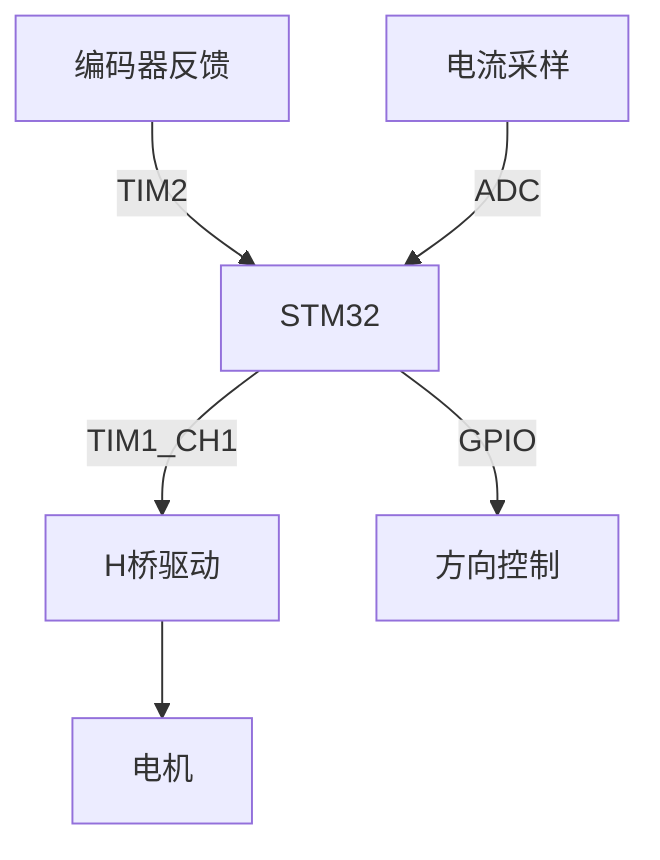
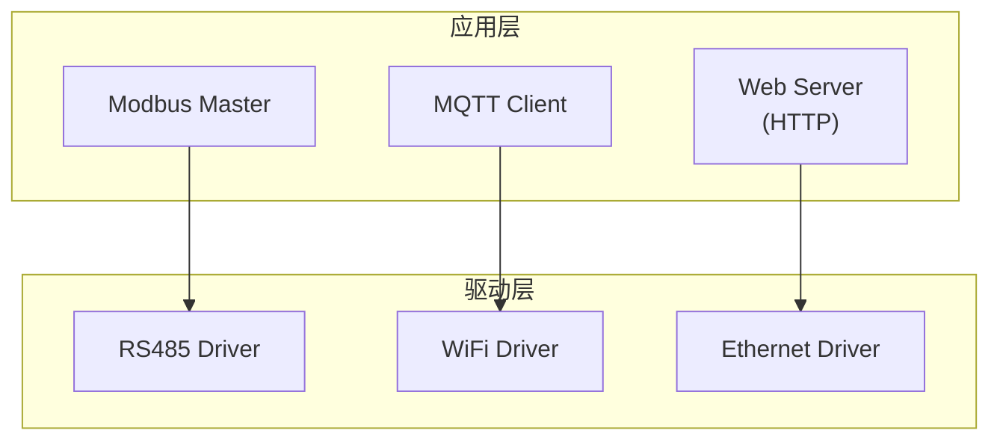

+++
title = "08. 嵌入式项目实战案例"
date = 2026-01-19
weight = 8000
description = "嵌入式实战项目：智能温控器、电机控制、数据采集器、物联网网关完整开发流程"
[taxonomies]
tags = ["embedded", "project", "iot", "motor-control", "sensor"]
+++

# 嵌入式项目实战案例

本文通过完整项目案例，展示嵌入式开发的实战流程。

---

## 一、项目一：智能温控器

### 1.1 需求分析

| 功能 | 描述 |
|-----|------|
| 温度采集 | NTC热敏电阻，精度0.5°C |
| 显示 | OLED显示当前/目标温度 |
| 控制 | 继电器控制加热器 |
| 设置 | 按键设置目标温度 |
| 通信 | 串口上报数据 |

### 1.2 硬件选型

| 模块 | 型号 | 接口 |
|-----|------|------|
| MCU | STM32F103C8T6 | - |
| 温度传感器 | NTC 10K | ADC |
| 显示屏 | SSD1306 OLED | I2C |
| 继电器 | 5V单路 | GPIO |
| 按键 | 3个 | GPIO |

### 1.3 软件架构

```c
// 模块划分
├── drivers/
│   ├── adc.c          // ADC驱动
│   ├── i2c.c          // I2C驱动
│   ├── gpio.c         // GPIO驱动
│   └── uart.c         // 串口驱动
├── modules/
│   ├── temperature.c  // 温度采集与转换
│   ├── display.c      // 显示管理
│   ├── control.c      // PID控制
│   └── button.c       // 按键处理
└── app/
    └── main.c         // 主程序
```

### 1.4 核心代码

```c
// 温度采集与NTC转换
float ntc_read_temperature(void) {
    uint16_t adc = adc_read(ADC_CHANNEL_NTC);
    float voltage = (adc / 4095.0f) * 3.3f;
    float resistance = (voltage * 10000.0f) / (3.3f - voltage);
    
    // Steinhart-Hart公式
    float temp = 1.0f / (1.0f/298.15f + 
                  log(resistance/10000.0f)/3950.0f) - 273.15f;
    return temp;
}

// 简单PID控制
typedef struct {
    float kp, ki, kd;
    float integral;
    float last_error;
} pid_t;

float pid_compute(pid_t *pid, float setpoint, float actual) {
    float error = setpoint - actual;
    pid->integral += error;
    float derivative = error - pid->last_error;
    pid->last_error = error;
    
    float output = pid->kp * error + 
                   pid->ki * pid->integral + 
                   pid->kd * derivative;
    
    // 限幅
    if (output > 100) output = 100;
    if (output < 0) output = 0;
    return output;
}

// 主循环
void main_loop(void) {
    float temp = ntc_read_temperature();
    float output = pid_compute(&pid, target_temp, temp);
    
    // PWM控制加热器（或简单开关）
    if (output > 50) {
        relay_on();
    } else {
        relay_off();
    }
    
    display_update(temp, target_temp);
}
```

---

## 二、项目二：直流电机控制器

### 2.1 功能需求

| 功能 | 描述 |
|-----|------|
| 速度控制 | PWM调速，0-3000 RPM |
| 方向控制 | 正反转 |
| 速度反馈 | 霍尔编码器闭环 |
| 保护 | 过流、过温保护 |

### 2.2 硬件设计



### 2.3 核心代码

```c
// 编码器读取
volatile int32_t encoder_count = 0;

void TIM2_IRQHandler(void) {
    if (TIM2->SR & TIM_SR_UIF) {
        TIM2->SR &= ~TIM_SR_UIF;
        // 编码器溢出处理
    }
}

int32_t encoder_get_speed(void) {
    static int32_t last_count = 0;
    int32_t current = TIM2->CNT;
    int32_t delta = current - last_count;
    last_count = current;
    return delta;  // 脉冲/采样周期
}

// 速度闭环控制
void motor_speed_control(int32_t target_rpm) {
    int32_t actual = encoder_to_rpm(encoder_get_speed());
    int32_t error = target_rpm - actual;
    
    // PI控制器
    static int32_t integral = 0;
    integral += error;
    if (integral > 10000) integral = 10000;
    if (integral < -10000) integral = -10000;
    
    int32_t output = KP * error + KI * integral;
    
    // 输出到PWM
    if (output >= 0) {
        motor_set_direction(FORWARD);
        motor_set_pwm(output);
    } else {
        motor_set_direction(REVERSE);
        motor_set_pwm(-output);
    }
}

// 过流保护
void ADC_IRQHandler(void) {
    uint16_t current = ADC1->DR;
    if (current > CURRENT_LIMIT) {
        motor_emergency_stop();
        set_fault_flag(FAULT_OVERCURRENT);
    }
}
```

---

## 三、项目三：多通道数据采集器

### 3.1 需求

| 参数 | 规格 |
|-----|------|
| 通道数 | 8路模拟输入 |
| 采样率 | 1kHz/通道 |
| 精度 | 12位 |
| 存储 | SD卡 |
| 传输 | USB虚拟串口 |

### 3.2 DMA采集

```c
// DMA配置
uint16_t adc_buffer[8];

void adc_dma_init(void) {
    // 配置ADC扫描模式
    ADC1->CR1 |= ADC_CR1_SCAN;
    ADC1->CR2 |= ADC_CR2_DMA | ADC_CR2_CONT;
    
    // 配置DMA
    DMA1_Channel1->CPAR = (uint32_t)&ADC1->DR;
    DMA1_Channel1->CMAR = (uint32_t)adc_buffer;
    DMA1_Channel1->CNDTR = 8;
    DMA1_Channel1->CCR = DMA_CCR_MINC | DMA_CCR_CIRC | 
                         DMA_CCR_TCIE | DMA_CCR_EN;
    
    ADC1->CR2 |= ADC_CR2_ADON;
}

void DMA1_Channel1_IRQHandler(void) {
    if (DMA1->ISR & DMA_ISR_TCIF1) {
        DMA1->IFCR = DMA_IFCR_CTCIF1;
        process_adc_data(adc_buffer);
    }
}
```

### 3.3 SD卡存储

```c
// FatFS写入
void log_data_to_sd(uint16_t *data, uint8_t channels) {
    static FIL file;
    static uint32_t sample_count = 0;
    
    if (sample_count == 0) {
        char filename[32];
        snprintf(filename, sizeof(filename), 
                 "LOG_%04d.CSV", get_file_index());
        f_open(&file, filename, FA_WRITE | FA_CREATE_ALWAYS);
        f_printf(&file, "Time,CH1,CH2,CH3,CH4,CH5,CH6,CH7,CH8\n");
    }
    
    f_printf(&file, "%lu", sample_count++);
    for (int i = 0; i < channels; i++) {
        f_printf(&file, ",%u", data[i]);
    }
    f_printf(&file, "\n");
    
    if (sample_count % 100 == 0) {
        f_sync(&file);  // 定期同步
    }
}
```

---

## 四、项目四：物联网网关

### 4.1 功能

| 功能 | 描述 |
|-----|------|
| 下行 | RS485采集Modbus设备 |
| 上行 | MQTT上报云平台 |
| 本地 | Web配置界面 |
| 存储 | 离线数据缓存 |

### 4.2 架构设计



### 4.3 任务设计（FreeRTOS）

```c
// 任务定义
void vTaskModbus(void *pv) {
    while (1) {
        for (int i = 0; i < device_count; i++) {
            modbus_read_device(&devices[i]);
            vTaskDelay(pdMS_TO_TICKS(100));
        }
    }
}

void vTaskMQTT(void *pv) {
    mqtt_connect();
    while (1) {
        if (xQueueReceive(xDataQueue, &data, portMAX_DELAY)) {
            mqtt_publish("sensors/data", &data);
        }
    }
}

void vTaskWebServer(void *pv) {
    httpd_start();
    while (1) {
        vTaskDelay(portMAX_DELAY);  // 事件驱动
    }
}

int main(void) {
    xTaskCreate(vTaskModbus, "Modbus", 512, NULL, 2, NULL);
    xTaskCreate(vTaskMQTT, "MQTT", 1024, NULL, 1, NULL);
    xTaskCreate(vTaskWebServer, "HTTP", 1024, NULL, 1, NULL);
    vTaskStartScheduler();
}
```

---

## 五、项目开发流程

### 5.1 标准流程

```
1. 需求分析
   └── 功能、性能、成本、功耗
   
2. 硬件设计
   ├── 芯片选型
   ├── 原理图设计
   └── PCB布局

3. 软件开发
   ├── 驱动开发
   ├── 中间件移植
   └── 应用开发

4. 调试测试
   ├── 单元测试
   ├── 集成测试
   └── 系统测试

5. 量产准备
   ├── 生产工具
   ├── 测试夹具
   └── 文档交付
```

### 5.2 文档清单

| 文档 | 内容 |
|-----|------|
| 需求规格书 | 功能、性能要求 |
| 硬件设计文档 | 原理图、PCB、BOM |
| 软件设计文档 | 架构、接口、流程 |
| 测试报告 | 测试用例、结果 |
| 用户手册 | 使用说明 |

---

## 总结

通过实战项目学习嵌入式开发：

| 项目类型 | 核心技能 |
|---------|---------|
| 温控器 | ADC、PID控制、I2C显示 |
| 电机控制 | PWM、编码器、闭环控制 |
| 数据采集 | DMA、文件系统、USB |
| 物联网网关 | RTOS、网络协议、多任务 |

项目实战是检验和巩固技能的最佳方式。建议从简单项目开始，逐步挑战复杂系统。

---

## 相关文章

- [上一篇：嵌入式调试与故障排查](@/articles/embedded/embedded-07-调试与故障排查.md)
- [下一篇：嵌入式Linux驱动开发](@/articles/embedded/embedded-09-嵌入式Linux驱动开发.md)
