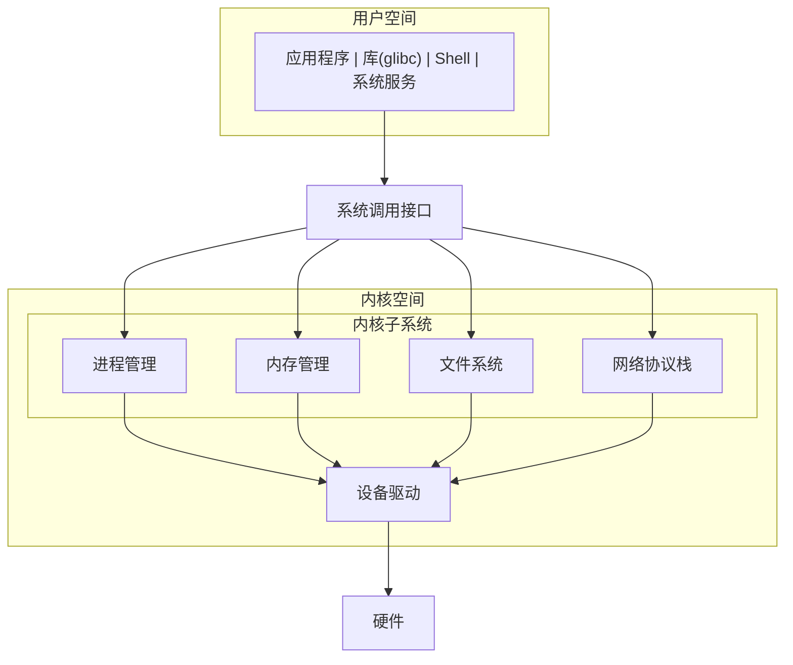

+++
title = "09. 嵌入式Linux驱动开发"
date = 2026-01-19
weight = 9000
description = "嵌入式Linux驱动开发：字符设备、平台驱动、设备树、内核模块、Buildroot/Yocto"
[taxonomies]
tags = ["embedded", "linux", "driver", "kernel", "devicetree", "yocto"]
+++

# 嵌入式Linux驱动开发

本文详解嵌入式Linux驱动开发的核心知识，从内核模块到完整BSP开发。

---

## 一、嵌入式Linux概述

### 1.1 与MCU开发的区别

| 维度 | MCU (裸机/RTOS) | 嵌入式Linux |
|-----|-----------------|-------------|
| 资源 | KB级RAM | MB~GB级RAM |
| 启动 | 毫秒级 | 秒级 |
| 复杂度 | 简单 | 复杂 |
| 生态 | 有限 | 丰富 |
| 实时性 | 硬实时 | 软实时 |
| 适用场景 | 简单控制 | 复杂应用 |

### 1.2 Linux内核架构



### 1.3 常用开发板

| 开发板 | 芯片 | 特点 |
|-------|------|------|
| 树莓派4 | BCM2711 | 入门首选，资料丰富 |
| BeagleBone | AM335x | 工业级，PRU协处理器 |
| i.MX6 | NXP i.MX6 | 工业级，长期供货 |
| 全志/瑞芯微 | 各系列 | 性价比高，国产 |
| STM32MP1 | ST双核 | Cortex-A + Cortex-M |

---

## 二、内核模块开发

### 2.1 最简内核模块

```c
// hello.c
#include <linux/init.h>
#include <linux/module.h>
#include <linux/kernel.h>

static int __init hello_init(void) {
    printk(KERN_INFO "Hello, Kernel!\n");
    return 0;
}

static void __exit hello_exit(void) {
    printk(KERN_INFO "Goodbye, Kernel!\n");
}

module_init(hello_init);
module_exit(hello_exit);

MODULE_LICENSE("GPL");
MODULE_AUTHOR("Your Name");
MODULE_DESCRIPTION("A simple hello module");
```

### 2.2 Makefile

```makefile
obj-m += hello.o

KDIR := /lib/modules/$(shell uname -r)/build

all:
	make -C $(KDIR) M=$(PWD) modules

clean:
	make -C $(KDIR) M=$(PWD) clean

# 交叉编译
# KDIR := /path/to/linux-kernel
# CROSS_COMPILE := arm-linux-gnueabihf-
# ARCH := arm
```

### 2.3 模块操作

```bash
# 编译
make

# 加载模块
sudo insmod hello.ko

# 查看日志
dmesg | tail

# 查看已加载模块
lsmod | grep hello

# 卸载模块
sudo rmmod hello

# 查看模块信息
modinfo hello.ko
```

---

## 三、字符设备驱动

### 3.1 驱动框架

```c
#include <linux/fs.h>
#include <linux/cdev.h>
#include <linux/uaccess.h>

#define DEVICE_NAME "mydev"
#define BUF_SIZE 1024

static dev_t dev_num;
static struct cdev my_cdev;
static struct class *my_class;
static char kernel_buf[BUF_SIZE];

// 打开设备
static int dev_open(struct inode *inode, struct file *file) {
    printk(KERN_INFO "Device opened\n");
    return 0;
}

// 关闭设备
static int dev_release(struct inode *inode, struct file *file) {
    printk(KERN_INFO "Device closed\n");
    return 0;
}

// 读取设备
static ssize_t dev_read(struct file *file, char __user *buf,
                        size_t len, loff_t *offset) {
    int bytes = min(len, (size_t)(BUF_SIZE - *offset));
    if (bytes <= 0) return 0;
    
    if (copy_to_user(buf, kernel_buf + *offset, bytes))
        return -EFAULT;
    
    *offset += bytes;
    return bytes;
}

// 写入设备
static ssize_t dev_write(struct file *file, const char __user *buf,
                         size_t len, loff_t *offset) {
    int bytes = min(len, (size_t)BUF_SIZE);
    
    if (copy_from_user(kernel_buf, buf, bytes))
        return -EFAULT;
    
    return bytes;
}

// 文件操作结构
static struct file_operations fops = {
    .owner = THIS_MODULE,
    .open = dev_open,
    .release = dev_release,
    .read = dev_read,
    .write = dev_write,
};

static int __init mydev_init(void) {
    // 分配设备号
    alloc_chrdev_region(&dev_num, 0, 1, DEVICE_NAME);
    
    // 初始化cdev
    cdev_init(&my_cdev, &fops);
    cdev_add(&my_cdev, dev_num, 1);
    
    // 创建设备类和设备节点
    my_class = class_create(THIS_MODULE, DEVICE_NAME);
    device_create(my_class, NULL, dev_num, NULL, DEVICE_NAME);
    
    printk(KERN_INFO "Device registered: major=%d\n", MAJOR(dev_num));
    return 0;
}

static void __exit mydev_exit(void) {
    device_destroy(my_class, dev_num);
    class_destroy(my_class);
    cdev_del(&my_cdev);
    unregister_chrdev_region(dev_num, 1);
}

module_init(mydev_init);
module_exit(mydev_exit);
MODULE_LICENSE("GPL");
```

### 3.2 用户空间测试

```c
// test_app.c
#include <stdio.h>
#include <fcntl.h>
#include <unistd.h>
#include <string.h>

int main() {
    int fd = open("/dev/mydev", O_RDWR);
    if (fd < 0) {
        perror("open");
        return -1;
    }
    
    // 写入
    char *msg = "Hello from userspace!";
    write(fd, msg, strlen(msg));
    
    // 读取
    char buf[100];
    lseek(fd, 0, SEEK_SET);
    read(fd, buf, sizeof(buf));
    printf("Read: %s\n", buf);
    
    close(fd);
    return 0;
}
```

---

## 四、平台驱动模型

### 4.1 平台驱动框架

```c
#include <linux/platform_device.h>
#include <linux/of.h>
#include <linux/io.h>

struct my_device {
    void __iomem *base;
    int irq;
};

static int my_probe(struct platform_device *pdev) {
    struct my_device *dev;
    struct resource *res;
    
    dev = devm_kzalloc(&pdev->dev, sizeof(*dev), GFP_KERNEL);
    if (!dev) return -ENOMEM;
    
    // 获取内存资源
    res = platform_get_resource(pdev, IORESOURCE_MEM, 0);
    dev->base = devm_ioremap_resource(&pdev->dev, res);
    if (IS_ERR(dev->base)) return PTR_ERR(dev->base);
    
    // 获取中断
    dev->irq = platform_get_irq(pdev, 0);
    if (dev->irq < 0) return dev->irq;
    
    platform_set_drvdata(pdev, dev);
    
    dev_info(&pdev->dev, "Probed successfully\n");
    return 0;
}

static int my_remove(struct platform_device *pdev) {
    dev_info(&pdev->dev, "Removed\n");
    return 0;
}

// 设备树匹配表
static const struct of_device_id my_of_match[] = {
    { .compatible = "vendor,my-device" },
    { }
};
MODULE_DEVICE_TABLE(of, my_of_match);

static struct platform_driver my_driver = {
    .probe = my_probe,
    .remove = my_remove,
    .driver = {
        .name = "my-device",
        .of_match_table = my_of_match,
    },
};

module_platform_driver(my_driver);
MODULE_LICENSE("GPL");
```

---

## 五、设备树

### 5.1 设备树基础

```c
// 设备树片段
/ {
    compatible = "vendor,board";
    
    my_device: my-device@40000000 {
        compatible = "vendor,my-device";
        reg = <0x40000000 0x1000>;      // 基地址和大小
        interrupts = <0 42 4>;           // 中断配置
        clocks = <&clk_periph>;          // 时钟引用
        status = "okay";
        
        // 自定义属性
        my-property = <100>;
        my-string = "hello";
    };
};
```

### 5.2 在驱动中读取设备树

```c
static int my_probe(struct platform_device *pdev) {
    struct device_node *np = pdev->dev.of_node;
    u32 value;
    const char *str;
    
    // 读取整数属性
    if (of_property_read_u32(np, "my-property", &value) == 0) {
        dev_info(&pdev->dev, "my-property = %d\n", value);
    }
    
    // 读取字符串属性
    if (of_property_read_string(np, "my-string", &str) == 0) {
        dev_info(&pdev->dev, "my-string = %s\n", str);
    }
    
    return 0;
}
```

### 5.3 设备树编译

```bash
# 编译dts为dtb
dtc -I dts -O dtb -o my-board.dtb my-board.dts

# 反编译dtb为dts
dtc -I dtb -O dts -o my-board.dts my-board.dtb
```

---

## 六、常见驱动类型

### 6.1 GPIO驱动

```c
#include <linux/gpio/consumer.h>

static struct gpio_desc *led_gpio;

static int my_probe(struct platform_device *pdev) {
    // 从设备树获取GPIO
    led_gpio = devm_gpiod_get(&pdev->dev, "led", GPIOD_OUT_LOW);
    if (IS_ERR(led_gpio)) return PTR_ERR(led_gpio);
    
    // 控制GPIO
    gpiod_set_value(led_gpio, 1);  // 高电平
    
    return 0;
}
```

### 6.2 I2C驱动

```c
#include <linux/i2c.h>

static int my_i2c_probe(struct i2c_client *client,
                        const struct i2c_device_id *id) {
    u8 reg = 0x00;
    u8 value;
    
    // 读取寄存器
    i2c_master_send(client, &reg, 1);
    i2c_master_recv(client, &value, 1);
    
    dev_info(&client->dev, "Register 0x%02x = 0x%02x\n", reg, value);
    return 0;
}

static const struct i2c_device_id my_i2c_id[] = {
    { "my-sensor", 0 },
    { }
};

static struct i2c_driver my_i2c_driver = {
    .driver = {
        .name = "my-sensor",
    },
    .probe = my_i2c_probe,
    .id_table = my_i2c_id,
};

module_i2c_driver(my_i2c_driver);
```

### 6.3 SPI驱动

```c
#include <linux/spi/spi.h>

static int my_spi_probe(struct spi_device *spi) {
    u8 tx_buf[2] = {0x9F, 0x00};  // 读取ID命令
    u8 rx_buf[4];
    
    struct spi_transfer xfer = {
        .tx_buf = tx_buf,
        .rx_buf = rx_buf,
        .len = 4,
    };
    
    struct spi_message msg;
    spi_message_init(&msg);
    spi_message_add_tail(&xfer, &msg);
    spi_sync(spi, &msg);
    
    dev_info(&spi->dev, "Device ID: %02x %02x %02x\n",
             rx_buf[1], rx_buf[2], rx_buf[3]);
    return 0;
}

static struct spi_driver my_spi_driver = {
    .driver = {
        .name = "my-flash",
    },
    .probe = my_spi_probe,
};

module_spi_driver(my_spi_driver);
```

---

## 七、系统构建

### 7.1 Buildroot

```bash
# 下载
git clone https://github.com/buildroot/buildroot.git
cd buildroot

# 配置
make menuconfig
# - Target options: 选择架构
# - Toolchain: 选择工具链
# - System configuration: 设置主机名等
# - Kernel: 配置内核
# - Target packages: 选择软件包

# 编译
make -j$(nproc)

# 输出
# output/images/zImage       - 内核
# output/images/rootfs.tar   - 根文件系统
# output/images/sdcard.img   - SD卡镜像
```

### 7.2 Yocto

```bash
# 初始化环境
source oe-init-build-env

# 配置 conf/local.conf
MACHINE = "raspberrypi4"
DISTRO = "poky"

# 编译最小镜像
bitbake core-image-minimal

# 输出在 tmp/deploy/images/
```

### 7.3 对比

| 特性 | Buildroot | Yocto |
|-----|-----------|-------|
| 学习曲线 | 简单 | 陡峭 |
| 编译速度 | 快 | 慢（首次） |
| 灵活性 | 中等 | 极高 |
| 适用场景 | 小型项目 | 大型/商业项目 |
| 增量编译 | 弱 | 强 |

---

## 八、调试技巧

### 8.1 内核调试

```bash
# 动态调试
echo 'file drivers/my/*.c +p' > /sys/kernel/debug/dynamic_debug/control

# 查看内核日志
dmesg -w

# 查看设备树
ls /proc/device-tree/
cat /proc/device-tree/my-device/compatible

# 查看设备
ls /sys/class/
ls /sys/bus/platform/devices/
```

### 8.2 常见问题

| 问题 | 排查方向 |
|-----|---------|
| 驱动未加载 | 检查compatible匹配 |
| 资源获取失败 | 检查设备树配置 |
| 权限问题 | udev规则/设备节点权限 |
| 崩溃 | dmesg/kernel panic分析 |

---

## 总结

嵌入式Linux驱动开发路线：

```
1. 内核模块基础
   ↓
2. 字符设备驱动
   ↓
3. 平台驱动模型
   ↓
4. 设备树
   ↓
5. 子系统驱动 (I2C/SPI/GPIO...)
   ↓
6. 系统构建 (Buildroot/Yocto)
```

掌握Linux驱动开发，能够胜任更高薪的嵌入式岗位。

---

## 相关文章

- [上一篇：嵌入式项目实战案例](@/articles/embedded/embedded-08-项目实战案例.md)
- [下一篇：无线通信与物联网协议](@/articles/embedded/embedded-10-无线通信与物联网协议.md)
