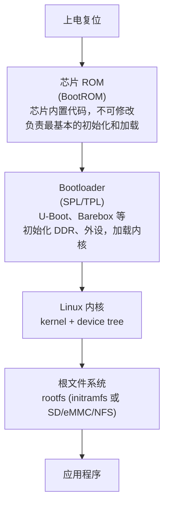
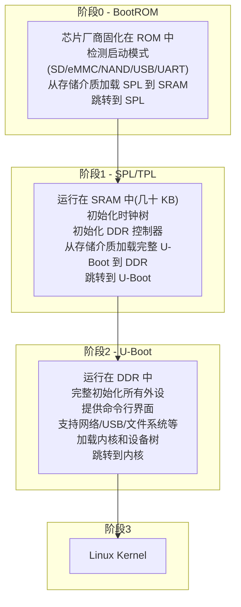
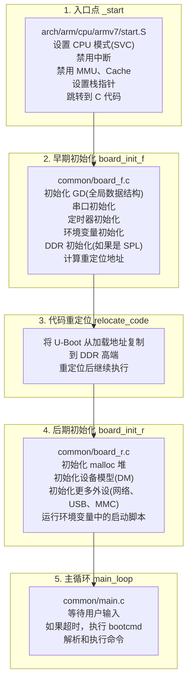
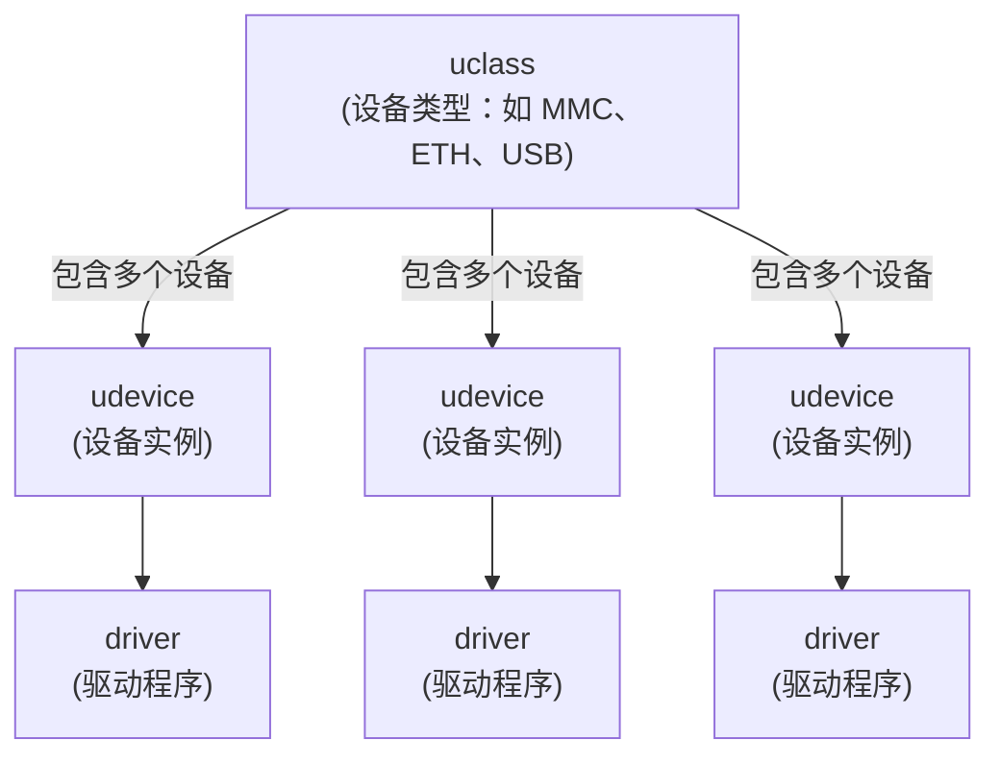
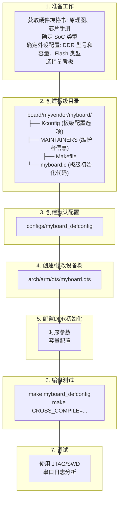
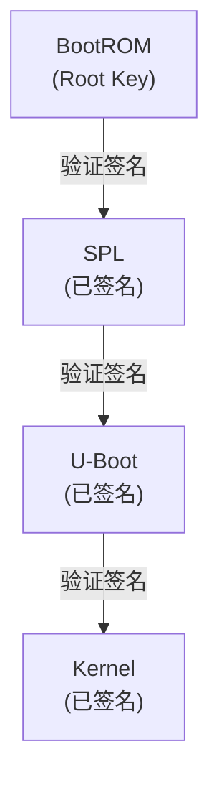
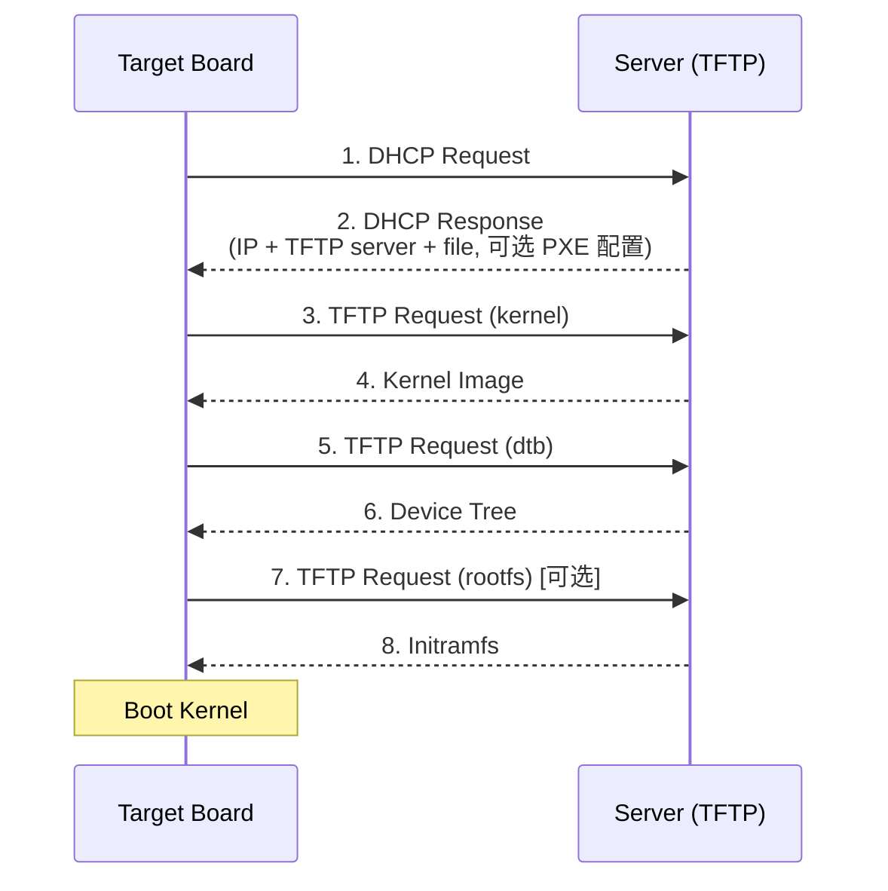
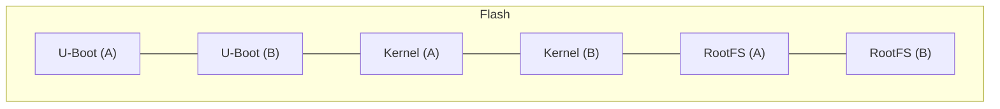

+++
title = "20.U-Boot 与 Bootloader 详解"
date = 2026-01-21
description = "嵌入式 Bootloader 完整指南：U-Boot 原理、配置、移植、调试，从上电到内核启动的全流程"
[taxonomies]
tags = ["embedded", "uboot", "bootloader", "arm", "linux"]
+++

# U-Boot 与 Bootloader 详解

Bootloader 是嵌入式系统启动的第一道关卡，负责初始化硬件并加载操作系统。U-Boot 是最流行的开源 Bootloader。本文深入解析 Bootloader 原理和 U-Boot 开发实践。

---

## 一、Bootloader 基础

### 1.1 什么是 Bootloader

**Bootloader 在系统中的位置：**



**Bootloader 的主要职责：**
- 初始化 CPU（时钟、缓存、MMU）
- 初始化内存控制器（DDR/SDRAM）
- 初始化存储设备（eMMC/SD/NAND/NOR）
- 初始化基本外设（串口用于调试）
- 提供命令行界面
- 加载内核和设备树到内存
- 设置启动参数
- 跳转到内核执行

### 1.2 常见 Bootloader 对比

**常见 Bootloader 对比：**

| Bootloader | 特点 |
|------------|------|
| U-Boot | 最流行的开源 Bootloader，支持 ARM、MIPS、x86、RISC-V 等，功能丰富，社区活跃，大多数 SoC 厂商官方支持 |
| Barebox | U-Boot 的替代品，更现代的架构设计，类似 Linux 的设备模型，代码更简洁 |
| GRUB | PC/服务器常用，支持多操作系统启动，x86/x86_64 为主 |
| UEFI | 现代 PC 标准，替代传统 BIOS，安全启动（Secure Boot） |
| Coreboot | 开源固件，替代专有 BIOS，ChromeOS 使用 |
| 厂商私有 | 某些 SoC 厂商专有 Bootloader，如高通、联发科部分方案 |

### 1.3 多阶段启动

**典型的多阶段启动流程：**

**为什么需要多阶段？**
- 芯片内部 SRAM 很小（几十 KB 到几百 KB）
- 完整 U-Boot 太大（几百 KB 到 1MB+）
- 需要先用小程序初始化 DDR，再加载大程序

**典型流程（以 ARM 为例）：**



**存储布局示例（eMMC）：**

| Boot0 | Boot1 | GPT | Partitions |
|-------|-------|-----|------------|
| SPL/TPL (备份) | SPL/TPL | 分区表 | U-Boot / Kernel/rootfs |

---

## 二、U-Boot 详解

### 2.1 U-Boot 架构

```
U-Boot 代码结构：

u-boot/
├── arch/          ← CPU 架构相关代码
│   ├── arm/
│   │   ├── cpu/           ← CPU 类型（armv7, armv8）
│   │   ├── mach-xxx/      ← SoC 平台代码
│   │   ├── dts/           ← 设备树源文件
│   │   └── lib/           ← 架构相关库
│   ├── x86/
│   └── riscv/
│
├── board/         ← 开发板相关代码
│   └── vendor/
│       └── board_name/
│           ├── board.c    ← 板级初始化
│           ├── Kconfig
│           └── Makefile
│
├── cmd/           ← 命令实现
│   ├── boot.c             ← boot 命令
│   ├── mmc.c              ← mmc 命令
│   └── net.c              ← 网络命令
│
├── common/        ← 通用代码
│   ├── main.c             ← 主循环
│   ├── board_f.c          ← 早期初始化
│   └── board_r.c          ← 后期初始化
│
├── configs/       ← 板级默认配置
│   └── xxx_defconfig
│
├── drivers/       ← 驱动程序
│   ├── mmc/
│   ├── net/
│   ├── serial/
│   └── usb/
│
├── include/       ← 头文件
│   ├── configs/           ← 板级配置头文件
│   └── asm/               ← 架构相关头文件
│
├── lib/           ← 通用库
├── net/           ← 网络协议栈
├── fs/            ← 文件系统
└── tools/         ← 主机工具（mkimage 等）
```

### 2.2 启动流程详解

**U-Boot 启动流程（ARM 为例）：**



**初始化序列（board_f）示例：**

```c
static const init_fnc_t init_sequence_f[] = {
    setup_mon_len,
    initf_malloc,
    log_init,
    initf_bootstage,
    arch_cpu_init,
    initf_dm,
    board_early_init_f,
    timer_init,
    env_init,
    init_baud_rate,
    serial_init,
    console_init_f,
    print_cpuinfo,
    ...
    dram_init,
    ...
    NULL,
};
```

### 2.3 设备模型 (DM)

**U-Boot 设备模型：**



关键数据结构：

struct udevice {
    char name[16];
    struct driver *driver;          /* 关联的驱动 */
    struct udevice *parent;         /* 父设备 */
    void *priv;                     /* 驱动私有数据 */
    struct uclass *uclass;          /* 所属 uclass */
    ofnode node;                    /* 设备树节点 */
    /* ... */
};

struct driver {
    char *name;
    enum uclass_id id;              /* uclass 类型 */
    const struct udevice_id *of_match;  /* 设备树匹配表 */
    int (*bind)(struct udevice *dev);
    int (*probe)(struct udevice *dev);
    int (*remove)(struct udevice *dev);
    void *priv_auto;                /* 自动分配私有数据 */
    void *plat_auto;                /* 自动分配平台数据 */
    /* ... */
};

struct uclass {
    struct list_head dev_head;      /* 设备链表 */
    struct uclass_driver *uc_drv;   /* uclass 驱动 */
};
```

---

## 三、U-Boot 编译与配置

### 3.1 编译流程

```bash
# 获取源码
$ git clone https://source.denx.de/u-boot/u-boot.git
$ cd u-boot

# 查看支持的板子
$ ls configs/
$ ls configs/ | grep -i your_board

# 配置（以 Raspberry Pi 4 为例）
$ make rpi_4_defconfig

# 或者自定义配置
$ make menuconfig

# 编译
$ make CROSS_COMPILE=aarch64-linux-gnu- -j$(nproc)

# 生成的文件
$ ls u-boot*
u-boot            # ELF 格式
u-boot.bin        # 纯二进制
u-boot.img        # U-Boot 镜像格式
u-boot.dtb        # 设备树
u-boot.map        # 符号表

# SPL 模式还会生成
$ ls spl/
spl/u-boot-spl
spl/u-boot-spl.bin
```

### 3.2 Kconfig 配置

```kconfig
# 主要配置选项

# 架构选择
CONFIG_ARM=y
CONFIG_ARCH_SUNXI=y         # 全志 SoC
CONFIG_MACH_SUN50I_H5=y     # 具体芯片

# 启动配置
CONFIG_BOOTDELAY=3          # 启动延迟秒数
CONFIG_BOOTCOMMAND="..."    # 默认启动命令

# SPL 配置
CONFIG_SPL=y
CONFIG_SPL_MMC=y
CONFIG_SPL_SERIAL=y

# 驱动配置
CONFIG_MMC=y
CONFIG_DM_MMC=y
CONFIG_SUNXI_MMC=y

CONFIG_DM_ETH=y
CONFIG_SUN8I_EMAC=y

# 文件系统
CONFIG_FS_FAT=y
CONFIG_FS_EXT4=y

# 环境变量存储
CONFIG_ENV_IS_IN_MMC=y
CONFIG_ENV_OFFSET=0x88000
CONFIG_ENV_SIZE=0x8000
```

### 3.3 设备树配置

```dts
/* 示例：板级设备树 */
/dts-v1/;
#include "sun50i-h5.dtsi"

/ {
    model = "My Custom Board";
    compatible = "myvendor,myboard", "allwinner,sun50i-h5";
    
    aliases {
        serial0 = &uart0;
        mmc0 = &mmc0;
        ethernet0 = &emac;
    };
    
    chosen {
        stdout-path = "serial0:115200n8";
    };
    
    memory@40000000 {
        device_type = "memory";
        reg = <0x40000000 0x40000000>;  /* 1GB DDR */
    };
};

/* UART 调试串口 */
&uart0 {
    pinctrl-names = "default";
    pinctrl-0 = <&uart0_pa_pins>;
    status = "okay";
};

/* SD 卡 */
&mmc0 {
    pinctrl-names = "default";
    pinctrl-0 = <&mmc0_pins>;
    vmmc-supply = <&reg_vcc3v3>;
    bus-width = <4>;
    cd-gpios = <&pio 5 6 GPIO_ACTIVE_LOW>;
    status = "okay";
};

/* 以太网 */
&emac {
    pinctrl-names = "default";
    pinctrl-0 = <&emac_rgmii_pins>;
    phy-mode = "rgmii";
    phy-handle = <&ext_rgmii_phy>;
    status = "okay";
};

&mdio {
    ext_rgmii_phy: ethernet-phy@1 {
        compatible = "ethernet-phy-ieee802.3-c22";
        reg = <1>;
    };
};
```

---

## 四、U-Boot 命令

### 4.1 常用命令

```bash
# 帮助
=> help
=> help boot

# 信息查看
=> version              # 版本信息
=> bdinfo               # 板级信息
=> printenv             # 打印环境变量
=> printenv bootcmd     # 打印特定变量

# 环境变量
=> setenv bootdelay 5
=> setenv ipaddr 192.168.1.100
=> setenv bootcmd "run distro_bootcmd"
=> saveenv              # 保存到存储

# 内存操作
=> md.b 0x40000000 100  # 显示内存（字节）
=> md.l 0x40000000 40   # 显示内存（字）
=> mw.l 0x40000000 0x12345678  # 写内存
=> mm 0x40000000        # 交互式修改
=> cp.b src dst len     # 复制

# MMC/SD 卡
=> mmc list             # 列出 MMC 设备
=> mmc dev 0            # 选择设备
=> mmc info             # 设备信息
=> mmc read 0x40000000 0 100  # 读扇区

# 文件系统
=> fatls mmc 0:1        # 列出 FAT 分区文件
=> fatload mmc 0:1 0x40000000 zImage  # 加载文件
=> ext4ls mmc 0:2       # 列出 ext4 分区
=> ext4load mmc 0:2 0x40000000 /boot/Image

# 网络
=> setenv ipaddr 192.168.1.100
=> setenv serverip 192.168.1.1
=> ping 192.168.1.1
=> tftp 0x40000000 zImage       # TFTP 下载
=> dhcp                          # DHCP 获取 IP

# USB
=> usb start
=> usb tree
=> fatls usb 0:1

# 启动
=> bootz 0x40000000 - 0x43000000    # 启动 zImage
=> booti 0x40000000 - 0x43000000    # 启动 Image (arm64)
=> bootm 0x40000000                  # 启动 uImage
```

### 4.2 启动脚本

```bash
# 典型的 bootcmd 环境变量

# 从 MMC 启动 Linux
setenv bootcmd '
    setenv bootargs console=ttyS0,115200 root=/dev/mmcblk0p2 rootwait;
    fatload mmc 0:1 0x40000000 Image;
    fatload mmc 0:1 0x43000000 myboard.dtb;
    booti 0x40000000 - 0x43000000
'

# 从 TFTP 启动（开发常用）
setenv bootcmd '
    setenv bootargs console=ttyS0,115200 root=/dev/nfs nfsroot=192.168.1.1:/nfs/rootfs ip=dhcp;
    tftp 0x40000000 Image;
    tftp 0x43000000 myboard.dtb;
    booti 0x40000000 - 0x43000000
'

# 使用 boot.scr 脚本
setenv bootcmd 'fatload mmc 0:1 0x44000000 boot.scr; source 0x44000000'

# boot.scr 源文件 (boot.cmd)
setenv bootargs console=ttyS0,115200 root=/dev/mmcblk0p2 rootwait
fatload mmc 0:1 ${kernel_addr_r} Image
fatload mmc 0:1 ${fdt_addr_r} board.dtb
booti ${kernel_addr_r} - ${fdt_addr_r}

# 编译 boot.scr
$ mkimage -C none -A arm64 -T script -d boot.cmd boot.scr
```

---

## 五、U-Boot 移植

### 5.1 新板子移植步骤

**U-Boot 移植流程：**



### 5.2 板级代码示例

```c
/* board/myvendor/myboard/myboard.c */

#include <common.h>
#include <init.h>
#include <asm/io.h>
#include <asm/arch/clock.h>
#include <asm/arch/gpio.h>

DECLARE_GLOBAL_DATA_PTR;

/* 早期初始化（DDR 初始化之前） */
int board_early_init_f(void)
{
    /* 配置调试串口引脚 */
    sunxi_gpio_set_cfgpin(SUNXI_GPA(4), SUN50I_GPA_UART0);
    sunxi_gpio_set_cfgpin(SUNXI_GPA(5), SUN50I_GPA_UART0);
    
    return 0;
}

/* DDR 初始化 */
int dram_init(void)
{
    /* 通常由 SPL 完成，这里只设置大小 */
    gd->ram_size = get_ram_size((long *)PHYS_SDRAM_1, PHYS_SDRAM_1_SIZE);
    return 0;
}

/* DDR 分区信息 */
int dram_init_banksize(void)
{
    gd->bd->bi_dram[0].start = PHYS_SDRAM_1;
    gd->bd->bi_dram[0].size = PHYS_SDRAM_1_SIZE;
    
    return 0;
}

/* 板级初始化（重定位之后） */
int board_init(void)
{
    /* 设置机器 ID（传统方式） */
    gd->bd->bi_arch_number = MACH_TYPE_MYBOARD;
    
    /* 设置 ATAGS 或设备树地址 */
    gd->bd->bi_boot_params = PHYS_SDRAM_1 + 0x100;
    
    /* 初始化 LED */
    gpio_direction_output(STATUS_LED_GPIO, 1);
    
    return 0;
}

/* 后期初始化 */
int board_late_init(void)
{
    /* 设置板子名称 */
    env_set("board", "myboard");
    env_set("board_name", "My Custom Board");
    
    return 0;
}

/* 获取板子名称 */
const char *get_board_name(void)
{
    return "My Custom Board";
}

/* 重置前回调 */
void reset_cpu(void)
{
    /* 触发看门狗复位 */
    sunxi_reset_cpu();
}

#ifdef CONFIG_DISPLAY_BOARDINFO
int checkboard(void)
{
    printf("Board: %s\n", get_board_name());
    return 0;
}
#endif
```

### 5.3 Kconfig 和 defconfig

```kconfig
# board/myvendor/myboard/Kconfig

if TARGET_MYBOARD

config SYS_BOARD
    default "myboard"

config SYS_VENDOR
    default "myvendor"

config SYS_CONFIG_NAME
    default "myboard"

config SYS_TEXT_BASE
    default 0x4a000000

endif
```

```makefile
# configs/myboard_defconfig

CONFIG_ARM=y
CONFIG_ARCH_SUNXI=y
CONFIG_MACH_SUN50I_H5=y
CONFIG_DRAM_CLK=672
CONFIG_DRAM_ZQ=3881979
CONFIG_MMC0_CD_PIN="PF6"
CONFIG_DEFAULT_DEVICE_TREE="myboard"
CONFIG_SPL=y
CONFIG_SPL_MMC=y

# 串口
CONFIG_CONS_INDEX=1
CONFIG_BAUDRATE=115200

# 网络
CONFIG_NET=y
CONFIG_DM_ETH=y
CONFIG_SUN8I_EMAC=y
CONFIG_PHY_REALTEK=y

# 存储
CONFIG_DM_MMC=y
CONFIG_MMC_SUNXI=y
CONFIG_FS_FAT=y
CONFIG_FS_EXT4=y

# 环境变量
CONFIG_ENV_IS_IN_MMC=y
CONFIG_ENV_OFFSET=0x88000

# 命令
CONFIG_CMD_BOOTZ=y
CONFIG_CMD_MMC=y
CONFIG_CMD_USB=y
CONFIG_CMD_NET=y
CONFIG_CMD_DHCP=y
CONFIG_CMD_PING=y
CONFIG_CMD_EXT4=y
CONFIG_CMD_FAT=y
```

---

## 六、调试技巧

### 6.1 调试方法

**U-Boot 调试方法：**

**1. 串口调试（最基本）**
- 连接 UART 调试串口
- 波特率通常 115200
- 查看启动日志
- 在 autoboot 前按键进入命令行

**2. JTAG/SWD 调试**
- 使用 OpenOCD + GDB
- 可设置断点、单步执行
- 适用于 SPL/早期启动调试

```bash
# OpenOCD 配置示例
$ openocd -f interface/ftdi/olimex-arm-usb-ocd.cfg \
          -f target/allwinner_h5.cfg

# GDB 连接
$ arm-none-eabi-gdb u-boot
(gdb) target remote :3333
(gdb) load
(gdb) b board_init
(gdb) c
```

**3. 日志级别调整**

```bash
# menuconfig 中开启
CONFIG_LOG=y
CONFIG_LOG_DEFAULT_LEVEL=7    # 7=debug
CONFIG_LOG_MAX_LEVEL=7
```

```c
// 代码中使用
log_debug("Debug message\n");
log_info("Info message\n");
log_err("Error message\n");
```

**4. 早期打印**

```bash
# SPL 串口还未初始化时
CONFIG_DEBUG_UART=y
CONFIG_DEBUG_UART_BASE=0x01c28000
CONFIG_DEBUG_UART_CLOCK=24000000
```

```c
// 代码中
debug_uart_init();
printascii("Hello from early SPL\n");
```

### 6.2 常见问题排查

**常见启动问题：**

**问题1：无任何输出**
- 检查串口连接（TX/RX 是否交叉）
- 检查波特率设置
- 检查 SPL 是否正确加载
- 使用 JTAG 确认代码是否运行

**问题2：SPL 卡住**
- DDR 初始化失败（检查时序参数）
- 时钟配置错误
- 检查 SPL 大小是否超限

**问题3：无法加载 U-Boot**
- 检查存储介质分区
- 检查 U-Boot 在存储中的偏移量
- 验证 U-Boot 镜像完整性

**问题4：无法加载内核**
- 检查文件路径
- 检查内存地址是否冲突
- 验证内核镜像格式

**问题5：内核启动后挂起**
- 检查 bootargs 参数
- 检查设备树是否匹配
- 检查根文件系统是否可访问

---

## 七、安全启动

**安全启动（Secure Boot）概述：**

**安全启动链：**



**U-Boot FIT 签名验证：**

```bash
# 生成密钥
$ openssl genrsa -out keys/dev.key 2048
$ openssl req -new -x509 -key keys/dev.key -out keys/dev.crt

# 创建签名的 FIT 镜像
$ mkimage -f fit.its -K u-boot.dtb -k keys -r fit.itb
```

```bash
# 配置 U-Boot 启用验证
CONFIG_FIT=y
CONFIG_FIT_SIGNATURE=y
CONFIG_RSA=y
```

---

## 八、网络启动

### 8.1 TFTP 启动

**网络启动流程：**



```bash
# U-Boot 网络启动命令

# 设置网络参数
=> setenv ipaddr 192.168.1.100        # 目标板 IP
=> setenv serverip 192.168.1.1        # TFTP 服务器 IP
=> setenv netmask 255.255.255.0
=> setenv gatewayip 192.168.1.1

# 或使用 DHCP 自动获取
=> dhcp

# TFTP 下载内核到内存
=> tftp 0x80000000 zImage
=> tftp 0x82000000 imx6ull-board.dtb

# 启动
=> bootz 0x80000000 - 0x82000000

# 完整网络启动脚本
=> setenv netboot 'dhcp; tftp 0x80000000 zImage; tftp 0x82000000 board.dtb; bootz 0x80000000 - 0x82000000'
=> run netboot
```

### 8.2 NFS 根文件系统

```bash
# 使用 NFS 作为根文件系统（开发调试常用）

# U-Boot 设置
=> setenv nfsroot /srv/nfs/rootfs
=> setenv bootargs 'console=ttyS0,115200 root=/dev/nfs nfsroot=${serverip}:${nfsroot},v3,tcp ip=dhcp'

# 完整 NFS 启动脚本
=> setenv nfsboot 'dhcp; setenv bootargs console=ttyS0,115200 root=/dev/nfs nfsroot=${serverip}:/srv/nfs/rootfs,v3,tcp ip=${ipaddr}:${serverip}:${gatewayip}:${netmask}::eth0:off; tftp 0x80000000 zImage; tftp 0x82000000 board.dtb; bootz 0x80000000 - 0x82000000'
=> run nfsboot

# 服务器端 NFS 配置 (/etc/exports)
/srv/nfs/rootfs  192.168.1.0/24(rw,sync,no_root_squash,no_subtree_check)

# 重启 NFS 服务
$ sudo exportfs -ra
$ sudo systemctl restart nfs-kernel-server
```

### 8.3 自动化开发工作流

```bash
# 开发环境自动化脚本

#!/bin/bash
# deploy.sh - 快速部署到目标板

TFTP_DIR=/srv/tftp
NFS_DIR=/srv/nfs/rootfs

# 编译内核
make -C linux ARCH=arm CROSS_COMPILE=arm-linux-gnueabihf- -j$(nproc)

# 复制到 TFTP 目录
cp linux/arch/arm/boot/zImage $TFTP_DIR/
cp linux/arch/arm/boot/dts/myboard.dtb $TFTP_DIR/

# 复制内核模块到 NFS
make -C linux ARCH=arm INSTALL_MOD_PATH=$NFS_DIR modules_install

# 触发目标板重启（可选 - 通过 GPIO 或网络）
# 或在 U-Boot 中设置看门狗自动重启

echo "Deployment complete. Reset target board to test."
```

```
U-Boot 自动重试配置：

# 设置启动重试
=> setenv bootcount 0
=> setenv bootlimit 3
=> setenv altbootcmd 'run netboot'  # 本地启动失败后尝试网络启动

# 升级回滚（A/B 分区）
=> setenv bootslot A
=> setenv boot_A 'setenv bootargs ...; load mmc 0:1 ...; bootz'
=> setenv boot_B 'setenv bootargs ...; load mmc 0:2 ...; bootz'
=> setenv bootcmd 'if test ${bootslot} = A; then run boot_A; else run boot_B; fi'
```

---

## 九、固件升级机制

### 9.1 A/B 分区设计

**A/B 分区布局：**

**闪存布局：**



**优点：**
- 升级失败可回滚
- 升级过程系统可运行
- 断电安全

**升级流程：**
1. 当前运行 Slot A
2. 下载新固件到 Slot B
3. 验证 Slot B 完整性
4. 标记 Slot B 为待启动
5. 重启
6. 从 Slot B 启动
7. 验证系统正常运行
8. 确认 Slot B 为当前活动分区

**失败处理：**
- 启动失败计数器
- 超过阈值自动回滚到上一个 Slot

### 9.2 升级实现

```c
/* U-Boot A/B 启动逻辑 */

// 环境变量定义
setenv("slot", "A");
setenv("slot_a_valid", "1");
setenv("slot_b_valid", "0");
setenv("boot_attempts", "0");
setenv("max_boot_attempts", "3");

// 启动脚本
char *bootcmd = 
    "if test ${boot_attempts} -ge ${max_boot_attempts}; then "
    "    echo Boot failed too many times, switching slot; "
    "    if test ${slot} = A; then "
    "        setenv slot B; "
    "    else "
    "        setenv slot A; "
    "    fi; "
    "    setenv boot_attempts 0; "
    "fi; "
    "setenv boot_attempts $((boot_attempts + 1)); "
    "saveenv; "
    "if test ${slot} = A; then "
    "    run boot_slot_a; "
    "else "
    "    run boot_slot_b; "
    "fi";
```

```bash
# Linux 用户空间升级脚本

#!/bin/bash
# ota_upgrade.sh

INACTIVE_SLOT=$(get_inactive_slot)  # 获取非活动分区

# 下载固件
wget -O /tmp/firmware.bin https://server/firmware.bin

# 验证签名
if ! verify_signature /tmp/firmware.bin; then
    echo "Signature verification failed"
    exit 1
fi

# 写入非活动分区
dd if=/tmp/firmware.bin of=/dev/mmcblk0p${INACTIVE_SLOT} bs=1M

# 验证写入
if ! verify_partition /dev/mmcblk0p${INACTIVE_SLOT}; then
    echo "Write verification failed"
    exit 1
fi

# 标记新分区为待启动
fw_setenv slot ${INACTIVE_SLOT}
fw_setenv boot_attempts 0

# 重启
reboot
```

---

## 相关文章

- [上一篇：19 - 802.11 WiFi 协议详解](/articles/embedded/embedded-19-802.11-WiFi协议详解/)
- [下一篇：21 - RTOS 与实时系统开发](/articles/embedded/embedded-21-RTOS与实时系统开发/)
- [01 - 嵌入式开发概述](/articles/embedded/embedded-01-嵌入式开发概述/)
- [09 - 嵌入式 Linux 驱动开发](/articles/embedded/embedded-09-嵌入式Linux驱动开发/)
