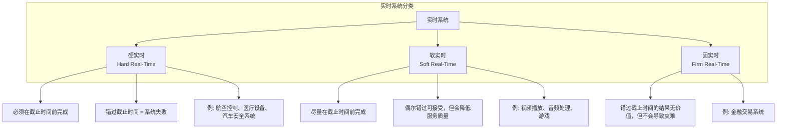
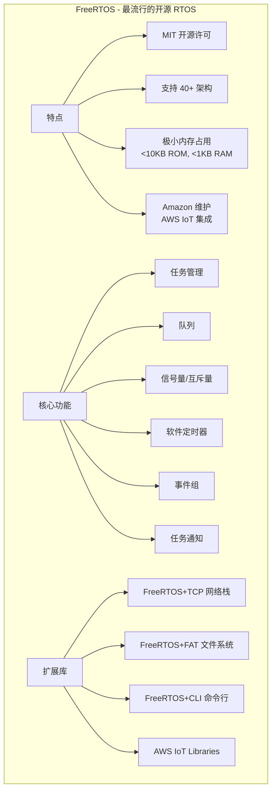
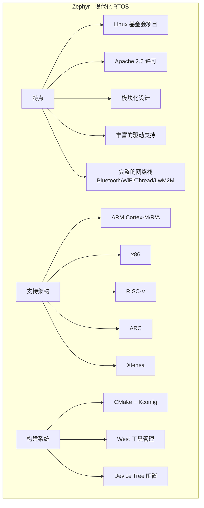
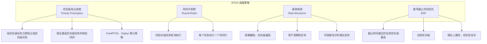
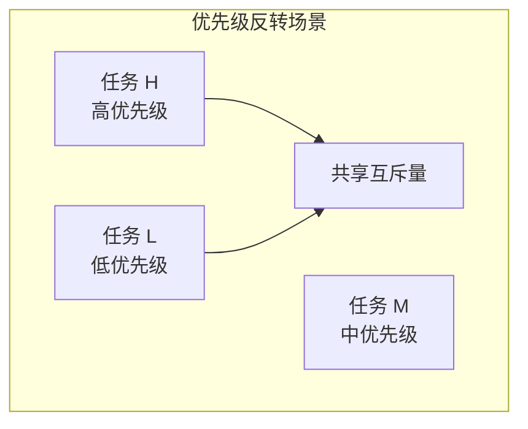
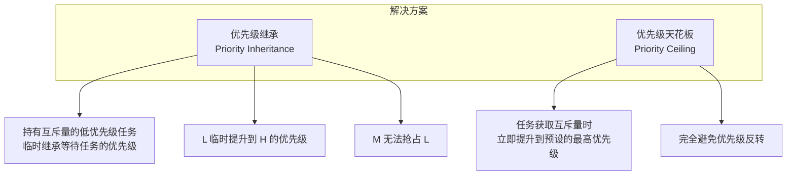
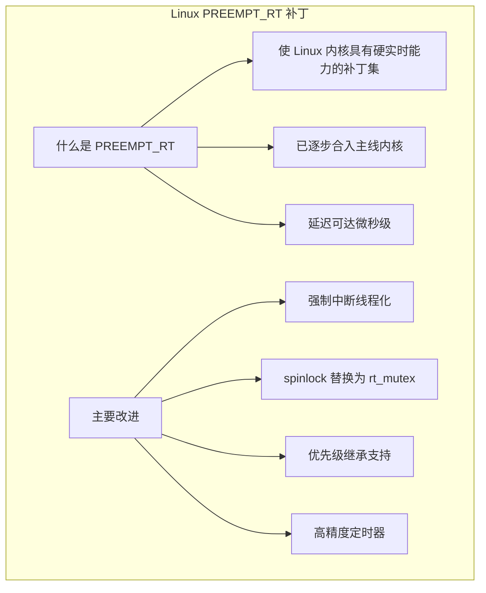
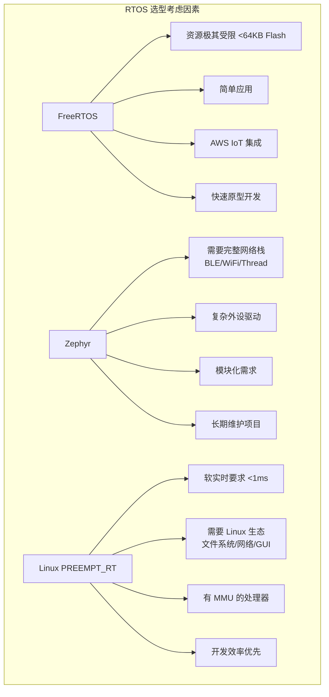

+++
title = "21. RTOS与实时系统开发"
date = 2026-02-06
weight = 21000
description = "实时操作系统详解：FreeRTOS、Zephyr任务调度、实时约束、与Linux PREEMPT_RT对比"
[taxonomies]
tags = ["rtos", "freertos", "zephyr", "real-time", "embedded"]
+++

## 概述

实时操作系统（RTOS）是嵌入式系统的核心组件，用于满足严格的时间约束。本文详解 RTOS 概念、常见系统（FreeRTOS、Zephyr）、任务调度、同步机制，以及与 Linux 实时方案的对比。

---

## 一、实时系统基础

### 1.1 什么是实时系统

**定义**：实时系统 = 正确性不仅取决于计算结果，还取决于结果产生的时间



**关键指标**：
- **延迟（Latency）**：事件到响应的时间
- **抖动（Jitter）**：延迟的变化范围
- **确定性（Determinism）**：响应时间的可预测性

### 1.2 RTOS vs 通用 OS

| 特性 | RTOS | Linux/Windows |
|------|------|---------------|
| 设计目标 | 确定性、低延迟 | 吞吐量、公平性 |
| 调度策略 | 优先级抢占 | 时间片轮转 |
| 中断延迟 | 微秒级 (1-10μs) | 毫秒级 (1-10ms) |
| 内存占用 | KB 级 | MB-GB 级 |
| 启动时间 | 毫秒级 | 秒级 |
| 功能丰富度 | 精简 | 完整 |
| 内存保护 | 可选/有限 | 完整 MMU |
| 文件系统 | 简单/可选 | 完整 |
| 网络栈 | 轻量级 | 完整 TCP/IP |

**RTOS 优势**：
- 可预测的响应时间
- 低资源消耗
- 快速启动
- 适合资源受限设备

**RTOS 劣势**：
- 功能有限
- 生态系统较小
- 开发复杂度（需要更多底层知识）

---

## 二、FreeRTOS

### 2.1 FreeRTOS 概述



### 2.2 任务管理

```c
/*
 * FreeRTOS 任务创建与管理
 */

#include "FreeRTOS.h"
#include "task.h"

/* 任务函数 */
void vTask1(void *pvParameters) {
    const char *taskName = (const char *)pvParameters;
    
    for (;;) {
        printf("Task: %s running\n", taskName);
        
        /* 延时 1000ms */
        vTaskDelay(pdMS_TO_TICKS(1000));
    }
    
    /* 如果退出循环，删除任务 */
    vTaskDelete(NULL);
}

void vTask2(void *pvParameters) {
    TickType_t xLastWakeTime = xTaskGetTickCount();
    const TickType_t xPeriod = pdMS_TO_TICKS(500);
    
    for (;;) {
        /* 精确周期延时（补偿执行时间） */
        vTaskDelayUntil(&xLastWakeTime, xPeriod);
        
        /* 周期性工作 */
        do_periodic_work();
    }
}

int main(void) {
    TaskHandle_t xTask1Handle, xTask2Handle;
    
    /* 创建任务 */
    xTaskCreate(
        vTask1,              /* 任务函数 */
        "Task1",             /* 任务名称 */
        configMINIMAL_STACK_SIZE,  /* 栈大小 */
        (void *)"Task1",     /* 参数 */
        tskIDLE_PRIORITY + 1,/* 优先级 */
        &xTask1Handle        /* 任务句柄 */
    );
    
    xTaskCreate(
        vTask2,
        "Task2",
        configMINIMAL_STACK_SIZE * 2,
        NULL,
        tskIDLE_PRIORITY + 2,  /* 更高优先级 */
        &xTask2Handle
    );
    
    /* 启动调度器 */
    vTaskStartScheduler();
    
    /* 不应该到达这里 */
    for (;;);
}

/*
 * 任务状态查询
 */
void vTaskInfo(void) {
    TaskStatus_t xTaskDetails;
    
    /* 获取任务信息 */
    vTaskGetInfo(xTask1Handle, &xTaskDetails, pdTRUE, eInvalid);
    
    printf("Task: %s\n", xTaskDetails.pcTaskName);
    printf("Priority: %lu\n", xTaskDetails.uxCurrentPriority);
    printf("Stack High Water Mark: %u\n", xTaskDetails.usStackHighWaterMark);
    
    /* 任务状态 */
    switch (xTaskDetails.eCurrentState) {
        case eRunning:   printf("State: Running\n"); break;
        case eReady:     printf("State: Ready\n"); break;
        case eBlocked:   printf("State: Blocked\n"); break;
        case eSuspended: printf("State: Suspended\n"); break;
        case eDeleted:   printf("State: Deleted\n"); break;
    }
}
```

### 2.3 队列与同步

```c
/*
 * FreeRTOS 队列
 */

#include "queue.h"

QueueHandle_t xQueue;

/* 数据结构 */
typedef struct {
    uint32_t id;
    uint32_t value;
} Message_t;

void vProducerTask(void *pvParameters) {
    Message_t msg;
    msg.id = 0;
    
    for (;;) {
        msg.value = read_sensor();
        msg.id++;
        
        /* 发送到队列，最多等待 100ms */
        if (xQueueSend(xQueue, &msg, pdMS_TO_TICKS(100)) == pdPASS) {
            printf("Sent: id=%lu, value=%lu\n", msg.id, msg.value);
        } else {
            printf("Queue full!\n");
        }
        
        vTaskDelay(pdMS_TO_TICKS(50));
    }
}

void vConsumerTask(void *pvParameters) {
    Message_t receivedMsg;
    
    for (;;) {
        /* 从队列接收，无限等待 */
        if (xQueueReceive(xQueue, &receivedMsg, portMAX_DELAY) == pdPASS) {
            printf("Received: id=%lu, value=%lu\n", 
                   receivedMsg.id, receivedMsg.value);
            process_data(&receivedMsg);
        }
    }
}

int main(void) {
    /* 创建队列：10 个元素，每个元素大小为 Message_t */
    xQueue = xQueueCreate(10, sizeof(Message_t));
    
    if (xQueue != NULL) {
        xTaskCreate(vProducerTask, "Producer", 256, NULL, 2, NULL);
        xTaskCreate(vConsumerTask, "Consumer", 256, NULL, 1, NULL);
        vTaskStartScheduler();
    }
    
    for (;;);
}

/*
 * 信号量与互斥量
 */

#include "semphr.h"

SemaphoreHandle_t xBinarySemaphore;
SemaphoreHandle_t xCountingSemaphore;
SemaphoreHandle_t xMutex;

/* 二值信号量：中断同步 */
void vISRHandler(void) {
    BaseType_t xHigherPriorityTaskWoken = pdFALSE;
    
    /* 释放信号量通知任务 */
    xSemaphoreGiveFromISR(xBinarySemaphore, &xHigherPriorityTaskWoken);
    
    /* 如果唤醒了更高优先级任务，请求上下文切换 */
    portYIELD_FROM_ISR(xHigherPriorityTaskWoken);
}

void vHandlerTask(void *pvParameters) {
    for (;;) {
        /* 等待信号量 */
        if (xSemaphoreTake(xBinarySemaphore, portMAX_DELAY) == pdTRUE) {
            /* 处理中断事件 */
            handle_interrupt_event();
        }
    }
}

/* 互斥量：保护共享资源 */
void vSharedResourceTask(void *pvParameters) {
    for (;;) {
        /* 获取互斥量 */
        if (xSemaphoreTake(xMutex, pdMS_TO_TICKS(100)) == pdTRUE) {
            /* 临界区 - 访问共享资源 */
            access_shared_resource();
            
            /* 释放互斥量 */
            xSemaphoreGive(xMutex);
        }
        
        vTaskDelay(pdMS_TO_TICKS(10));
    }
}

void init_sync_primitives(void) {
    xBinarySemaphore = xSemaphoreCreateBinary();
    xCountingSemaphore = xSemaphoreCreateCounting(10, 0);
    xMutex = xSemaphoreCreateMutex();
}
```

### 2.4 软件定时器

```c
/*
 * FreeRTOS 软件定时器
 */

#include "timers.h"

TimerHandle_t xOneShotTimer;
TimerHandle_t xAutoReloadTimer;

/* 定时器回调函数 */
void vOneShotTimerCallback(TimerHandle_t xTimer) {
    printf("One-shot timer expired!\n");
}

void vAutoReloadTimerCallback(TimerHandle_t xTimer) {
    static uint32_t count = 0;
    count++;
    printf("Auto-reload timer: count = %lu\n", count);
    
    /* 可以获取定时器 ID */
    uint32_t timerId = (uint32_t)pvTimerGetTimerID(xTimer);
    printf("Timer ID: %lu\n", timerId);
}

void init_timers(void) {
    /* 创建单次定时器：5 秒后触发 */
    xOneShotTimer = xTimerCreate(
        "OneShotTimer",
        pdMS_TO_TICKS(5000),
        pdFALSE,             /* 单次模式 */
        (void *)0,           /* 定时器 ID */
        vOneShotTimerCallback
    );
    
    /* 创建自动重载定时器：每 1 秒触发 */
    xAutoReloadTimer = xTimerCreate(
        "AutoReloadTimer",
        pdMS_TO_TICKS(1000),
        pdTRUE,              /* 自动重载模式 */
        (void *)1,
        vAutoReloadTimerCallback
    );
    
    /* 启动定时器 */
    xTimerStart(xOneShotTimer, 0);
    xTimerStart(xAutoReloadTimer, 0);
}

/* 定时器控制 */
void timer_control_example(void) {
    /* 停止定时器 */
    xTimerStop(xAutoReloadTimer, 0);
    
    /* 修改周期 */
    xTimerChangePeriod(xAutoReloadTimer, pdMS_TO_TICKS(500), 0);
    
    /* 重置定时器 */
    xTimerReset(xOneShotTimer, 0);
    
    /* 删除定时器 */
    xTimerDelete(xOneShotTimer, 0);
}
```

---

## 三、Zephyr RTOS

### 3.1 Zephyr 概述



### 3.2 Zephyr 任务

```c
/*
 * Zephyr 线程（任务）
 */

#include <zephyr/kernel.h>

#define STACK_SIZE 1024
#define PRIORITY 5

/* 静态定义线程 */
K_THREAD_STACK_DEFINE(my_stack, STACK_SIZE);
struct k_thread my_thread_data;

void my_thread_entry(void *p1, void *p2, void *p3) {
    int counter = 0;
    
    while (1) {
        printk("Thread running, count: %d\n", counter++);
        k_msleep(1000);  /* 睡眠 1000ms */
    }
}

/* 使用宏静态创建线程（编译时） */
K_THREAD_DEFINE(
    static_thread,      /* 线程名 */
    STACK_SIZE,         /* 栈大小 */
    my_thread_entry,    /* 入口函数 */
    NULL, NULL, NULL,   /* 参数 */
    PRIORITY,           /* 优先级 */
    0,                  /* 选项 */
    0                   /* 延迟启动时间 */
);

int main(void) {
    k_tid_t tid;
    
    /* 动态创建线程 */
    tid = k_thread_create(
        &my_thread_data,
        my_stack,
        STACK_SIZE,
        my_thread_entry,
        NULL, NULL, NULL,
        PRIORITY,
        0,
        K_NO_WAIT  /* 立即启动 */
    );
    
    /* 设置线程名（调试用） */
    k_thread_name_set(tid, "MyThread");
    
    /* 主循环 */
    while (1) {
        printk("Main thread\n");
        k_msleep(2000);
    }
    
    return 0;
}

/*
 * 线程控制
 */
void thread_control_example(k_tid_t tid) {
    /* 暂停线程 */
    k_thread_suspend(tid);
    
    /* 恢复线程 */
    k_thread_resume(tid);
    
    /* 设置优先级 */
    k_thread_priority_set(tid, 3);
    
    /* 终止线程 */
    k_thread_abort(tid);
    
    /* 等待线程结束 */
    k_thread_join(tid, K_FOREVER);
}
```

### 3.3 Zephyr 同步原语

```c
/*
 * Zephyr 信号量
 */

#include <zephyr/kernel.h>

K_SEM_DEFINE(my_sem, 0, 1);  /* 初始值 0，最大值 1 */

void producer_thread(void) {
    while (1) {
        /* 生产数据 */
        produce_data();
        
        /* 释放信号量 */
        k_sem_give(&my_sem);
        
        k_msleep(100);
    }
}

void consumer_thread(void) {
    while (1) {
        /* 等待信号量 */
        if (k_sem_take(&my_sem, K_MSEC(1000)) == 0) {
            /* 消费数据 */
            consume_data();
        } else {
            printk("Timeout waiting for semaphore\n");
        }
    }
}

/*
 * Zephyr 互斥量
 */

K_MUTEX_DEFINE(my_mutex);

void protected_function(void) {
    /* 获取互斥量 */
    k_mutex_lock(&my_mutex, K_FOREVER);
    
    /* 临界区 */
    access_shared_resource();
    
    /* 释放互斥量 */
    k_mutex_unlock(&my_mutex);
}

/*
 * Zephyr 消息队列
 */

K_MSGQ_DEFINE(my_msgq, sizeof(uint32_t), 10, 4);

void sender_thread(void) {
    uint32_t data = 0;
    
    while (1) {
        data++;
        
        if (k_msgq_put(&my_msgq, &data, K_NO_WAIT) != 0) {
            printk("Queue full\n");
        }
        
        k_msleep(50);
    }
}

void receiver_thread(void) {
    uint32_t received;
    
    while (1) {
        if (k_msgq_get(&my_msgq, &received, K_FOREVER) == 0) {
            printk("Received: %u\n", received);
        }
    }
}

/*
 * Zephyr 工作队列
 */

K_WORK_DEFINE(my_work, work_handler);

void work_handler(struct k_work *work) {
    printk("Work executed\n");
}

void trigger_work(void) {
    /* 提交工作到系统工作队列 */
    k_work_submit(&my_work);
}

/* 延迟工作 */
K_WORK_DELAYABLE_DEFINE(my_delayed_work, delayed_work_handler);

void delayed_work_handler(struct k_work *work) {
    printk("Delayed work executed\n");
}

void schedule_delayed_work(void) {
    /* 500ms 后执行 */
    k_work_schedule(&my_delayed_work, K_MSEC(500));
}
```

---

## 四、实时调度

### 4.1 调度策略



**优先级抢占调度示意**：

| 时间 | 任务 A (高优先级) | 任务 B (低优先级) | 说明 |
|------|-------------------|-------------------|------|
| t0 | - | 运行中 | B 正在执行 |
| t1 | 运行中 | 被抢占 | A 就绪，抢占 B |
| t2 | - | 恢复运行 | A 完成，B 继续 |

**时间片轮转示意**：

| 时间片 | 任务 A | 任务 B | 任务 C |
|--------|--------|--------|--------|
| t0-t1 | 运行 | 等待 | 等待 |
| t1-t2 | 等待 | 运行 | 等待 |
| t2-t3 | 等待 | 等待 | 运行 |
| t3-t4 | 运行 | 等待 | 等待 |

### 4.2 优先级反转



**时间序列**：

| 步骤 | 事件 | 问题 |
|------|------|------|
| 1 | L 获取互斥量 | - |
| 2 | H 就绪，抢占 L，请求互斥量，被阻塞 | H 等待 L |
| 3 | M 就绪，抢占 L（L 仍持有互斥量） | M 抢占了 L |
| 4 | M 运行完毕 | H 间接等待 M |
| 5 | L 继续，释放互斥量 | - |
| 6 | H 获取互斥量，继续运行 | - |

**问题**：H 等待 M，但 M 优先级比 H 低！



```c
/* FreeRTOS 优先级继承互斥量 */
SemaphoreHandle_t xMutex;

void init(void) {
    /* 创建互斥量（自动支持优先级继承） */
    xMutex = xSemaphoreCreateMutex();
}

/* Zephyr 优先级继承 */
K_MUTEX_DEFINE(my_mutex);  /* Zephyr 互斥量默认支持优先级继承 */
```

---

## 五、Linux 实时方案

### 5.1 PREEMPT_RT



**配置内核**：

```
CONFIG_PREEMPT_RT=y
CONFIG_HIGH_RES_TIMERS=y
CONFIG_NO_HZ_FULL=y
```

**延迟对比**：

| 系统 | 延迟 |
|------|------|
| 标准 Linux | 1-10ms |
| PREEMPT_RT Linux | 10-100μs |
| FreeRTOS | 1-10μs |

### 5.2 Linux 实时编程

```c
/*
 * Linux 实时应用编程
 */

#define _GNU_SOURCE
#include <pthread.h>
#include <sched.h>
#include <sys/mman.h>

void *realtime_thread(void *arg) {
    struct sched_param param;
    cpu_set_t cpuset;
    
    /* 设置实时调度策略 */
    param.sched_priority = 80;
    pthread_setschedparam(pthread_self(), SCHED_FIFO, &param);
    
    /* 绑定到特定 CPU */
    CPU_ZERO(&cpuset);
    CPU_SET(1, &cpuset);
    pthread_setaffinity_np(pthread_self(), sizeof(cpuset), &cpuset);
    
    /* 实时循环 */
    while (1) {
        do_realtime_work();
        usleep(1000);  /* 1ms 周期 */
    }
    
    return NULL;
}

int main(void) {
    pthread_t thread;
    pthread_attr_t attr;
    struct sched_param param;
    
    /* 锁定内存，防止换页 */
    mlockall(MCL_CURRENT | MCL_FUTURE);
    
    /* 设置线程属性 */
    pthread_attr_init(&attr);
    pthread_attr_setschedpolicy(&attr, SCHED_FIFO);
    param.sched_priority = 80;
    pthread_attr_setschedparam(&attr, &param);
    pthread_attr_setinheritsched(&attr, PTHREAD_EXPLICIT_SCHED);
    
    /* 创建实时线程 */
    pthread_create(&thread, &attr, realtime_thread, NULL);
    
    pthread_join(thread, NULL);
    
    return 0;
}

/*
 * 高精度定时器
 */
#include <time.h>

void periodic_task(long period_ns) {
    struct timespec next;
    
    clock_gettime(CLOCK_MONOTONIC, &next);
    
    while (1) {
        /* 计算下次唤醒时间 */
        next.tv_nsec += period_ns;
        if (next.tv_nsec >= 1000000000) {
            next.tv_sec++;
            next.tv_nsec -= 1000000000;
        }
        
        /* 精确睡眠到下次唤醒时间 */
        clock_nanosleep(CLOCK_MONOTONIC, TIMER_ABSTIME, &next, NULL);
        
        /* 执行周期任务 */
        do_periodic_work();
    }
}
```

---

## 六、选型指南



**其他 RTOS 选项**：

| RTOS | 特点 |
|------|------|
| NuttX | POSIX 兼容 |
| RT-Thread | 国产，中文文档好 |
| ThreadX | 商业级，已开源 |
| VxWorks | 航空航天级（商业） |
| QNX | 汽车、医疗（商业） |

---

## 七、最佳实践

```mermaid
graph TB
    subgraph 最佳实践["RTOS 开发最佳实践"]
        A[任务设计]
        B[同步与通信]
        C[内存管理]
        D[调试]
        E[实时性保证]
    end
    
    A --> A1[每个任务单一职责]
    A --> A2[避免过多任务]
    A --> A3[合理分配优先级]
    A --> A4[使用任务通知替代信号量]
    
    B --> B1[优先使用队列进行数据传递]
    B --> B2[使用互斥量保护共享资源]
    B --> B3[避免在中断中做复杂操作]
    B --> B4[注意优先级反转]
    
    C --> C1[静态分配优于动态分配]
    C --> C2[监控栈使用情况]
    C --> C3[避免内存碎片]
    
    D --> D1[使用 RTOS 感知调试器]
    D --> D2[启用栈溢出检测]
    D --> D3[记录运行时统计]
    D --> D4[使用跟踪工具 Tracealyzer]
    
    E --> E1[测量最坏情况执行时间 WCET]
    E --> E2[避免无界循环]
    E --> E3[禁用/最小化动态内存分配]
    E --> E4[做可调度性分析]
```



---

## 相关文章

- [上一篇：20 - U-Boot 与 Bootloader 详解](@/articles/embedded/embedded-20-U-Boot与Bootloader详解.md)
- [下一篇：22 - 端侧推理引擎对比](@/articles/embedded/embedded-22-端侧推理引擎对比.md)
- [09 - 嵌入式 Linux 驱动开发](@/articles/embedded/embedded-09-嵌入式Linux驱动开发.md)
- [10 - 无线通信与物联网协议](@/articles/embedded/embedded-10-无线通信与物联网协议.md)
