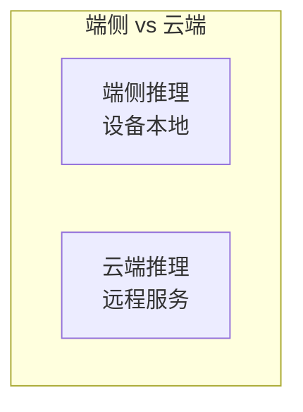
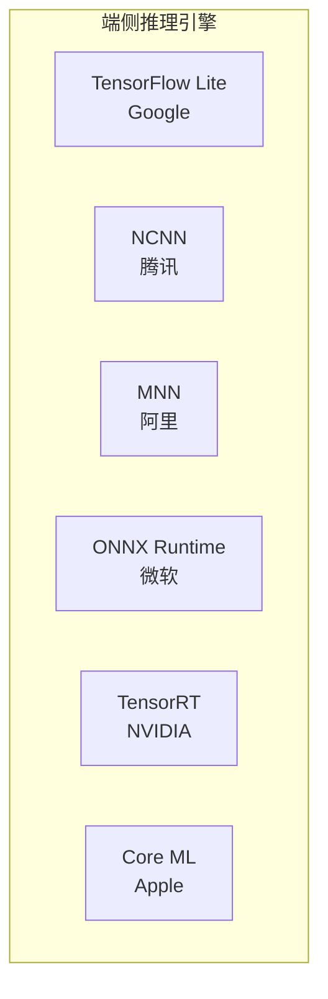
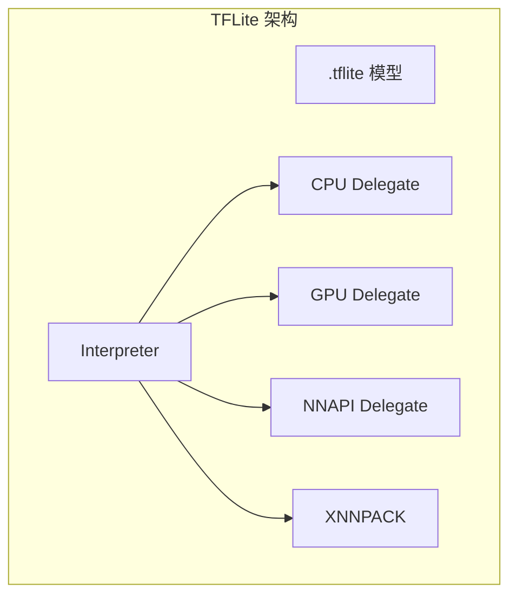
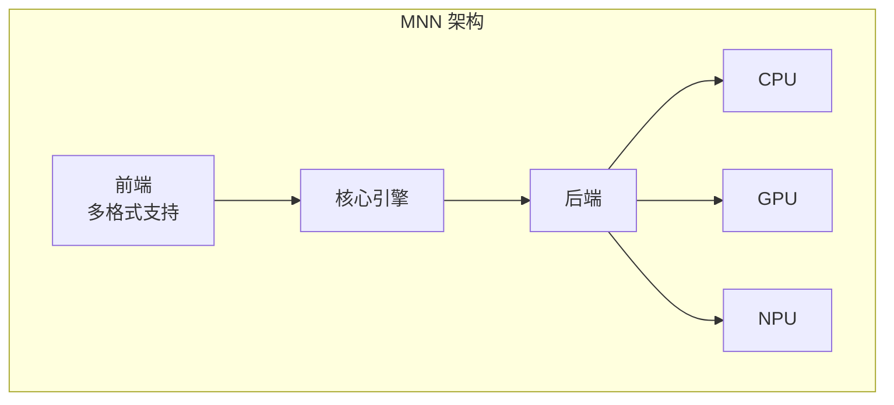
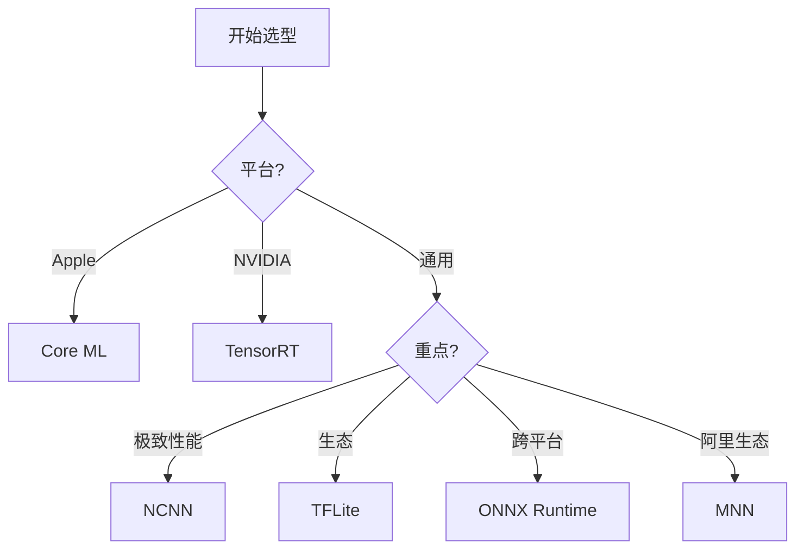

+++
title = "22. 端侧推理引擎对比"
description = "全面对比主流端侧 AI 推理引擎的特点与选型"
date = 2025-02-06
weight = 22000
updated = 2025-02-06
draft = false
[taxonomies]
tags = ["端侧推理", "TFLite", "NCNN", "MNN", "推理引擎"]
[extra]
toc = true
comments = true
+++

## 一、端侧推理概述

### 1.1 什么是端侧推理

### 1.2 端侧优势

| 优势 | 说明 |
|------|------|
| 低延迟 | 无网络往返 |
| 隐私 | 数据不出设备 |
| 离线 | 无需网络 |
| 成本 | 无云端费用 |

### 1.3 端侧挑战

| 挑战 | 说明 |
|------|------|
| 算力有限 | 移动芯片性能 |
| 内存有限 | 通常 2-8GB |
| 功耗限制 | 电池供电 |
| 硬件碎片化 | 各种芯片 |

---

## 二、主流推理引擎

### 2.1 引擎列表

### 2.2 快速对比

| 引擎 | 语言 | 平台 | 特点 |
|------|------|------|------|
| TFLite | C++ | 全平台 | 生态好 |
| NCNN | C++ | 全平台 | 轻量快速 |
| MNN | C++ | 全平台 | 阿里出品 |
| ONNX Runtime | C++ | 全平台 | 标准格式 |
| TensorRT | C++ | NVIDIA | 极致性能 |
| Core ML | Swift/ObjC | Apple | 苹果生态 |

---

## 三、TensorFlow Lite

### 3.1 概述

Google 官方移动端推理引擎

### 3.2 架构

### 3.3 特点

| 优点 | 缺点 |
|------|------|
| 官方支持 | 包体积较大 |
| 生态丰富 | 自定义算子复杂 |
| 文档完善 | 部分算子慢 |
| 量化工具好 | |

### 3.4 适用场景

- Google 生态应用
- 需要 NNAPI 支持
- TensorFlow 模型

---

## 四、NCNN

### 4.1 概述

腾讯优图开源的高性能推理引擎

### 4.2 特点

| 优点 | 缺点 |
|------|------|
| 极致轻量 | 文档较少 |
| 速度快 | 量化支持一般 |
| 无依赖 | 算子覆盖有限 |
| ARM 优化好 | |

### 4.3 技术亮点

| 特性 | 说明 |
|------|------|
| 零依赖 | 不需要 BLAS 等 |
| 内存优化 | 内存复用 |
| 汇编优化 | ARM NEON |
| GPU 支持 | Vulkan |

### 4.4 适用场景

- 极致性能要求
- 包体积敏感
- Android/嵌入式

---

## 五、MNN

### 5.1 概述

阿里巴巴开源的轻量级推理引擎

### 5.2 架构

### 5.3 特点

| 优点 | 缺点 |
|------|------|
| 多格式支持 | 社区相对小 |
| 训练推理一体 | |
| 量化支持好 | |
| 多后端 | |

### 5.4 适用场景

- 阿里生态
- 需要设备端训练
- 多模型格式

---

## 六、ONNX Runtime

### 6.1 概述

微软开源的跨平台推理引擎

### 6.2 特点

| 优点 | 缺点 |
|------|------|
| 标准格式 | 端侧优化一般 |
| 跨平台 | 包体积大 |
| 多后端 | |
| 图优化好 | |

### 6.3 执行提供者

| EP | 平台 |
|---|------|
| CPU | 通用 |
| CUDA | NVIDIA |
| TensorRT | NVIDIA |
| CoreML | Apple |
| NNAPI | Android |

### 6.4 适用场景

- 需要跨平台
- ONNX 模型
- 云端统一

---

## 七、TensorRT

### 7.1 概述

NVIDIA 官方 GPU 推理优化

### 7.2 特点

| 优点 | 缺点 |
|------|------|
| GPU 极致性能 | 仅 NVIDIA |
| 量化支持好 | 复杂度高 |
| 官方支持 | 移动端有限 |

### 7.3 适用场景

- NVIDIA Jetson
- 服务器 GPU
- 追求极致性能

---

## 八、Core ML

### 8.1 概述

Apple 官方机器学习框架

### 8.2 特点

| 优点 | 缺点 |
|------|------|
| Apple 生态最优 | 仅 Apple |
| 集成好 | |
| ANE 支持 | |

### 8.3 适用场景

- iOS/macOS 应用
- Apple 生态

---

## 九、对比总结

### 9.1 性能对比

| 引擎 | CPU | GPU | NPU |
|------|-----|-----|-----|
| TFLite | ★★★ | ★★★ | ★★★ |
| NCNN | ★★★★ | ★★★ | ★★ |
| MNN | ★★★★ | ★★★ | ★★★ |
| ONNX RT | ★★★ | ★★★ | ★★ |
| TensorRT | ★★ | ★★★★★ | - |
| Core ML | ★★★ | ★★★★ | ★★★★ |

### 9.2 包体积

| 引擎 | 体积 |
|------|------|
| NCNN | ~1MB |
| MNN | ~2MB |
| TFLite | ~3MB |
| ONNX RT | ~10MB |

### 9.3 选型建议

---

## 十、总结

### 10.1 核心认知

1. **没有最好，只有最适合**
   - 根据需求选择

2. **性能差异在细节**
   - 特定模型需测试

3. **生态很重要**
   - 文档、社区、工具

4. **趋势是融合**
   - 多后端、多格式

### 10.2 选型建议

| 场景 | 推荐 |
|------|------|
| 通用 Android | NCNN 或 MNN |
| iOS | Core ML |
| Jetson | TensorRT |
| 跨平台 | ONNX Runtime |
| Google 模型 | TFLite |

---

## 相关文章

- [上一篇：21 - RTOS 与实时系统开发](@/articles/embedded/embedded-21-RTOS与实时系统开发.md)
- [下一篇：23 - 端侧模型优化实战](@/articles/embedded/embedded-23-端侧模型优化实战.md)
- [18 - 边缘 AI 与端侧部署详解](@/articles/ai/ai-18-边缘AI与端侧部署详解.md)
- [16 - 推理框架优化技术详解](@/articles/ai/ai-16-推理框架优化技术详解.md)
