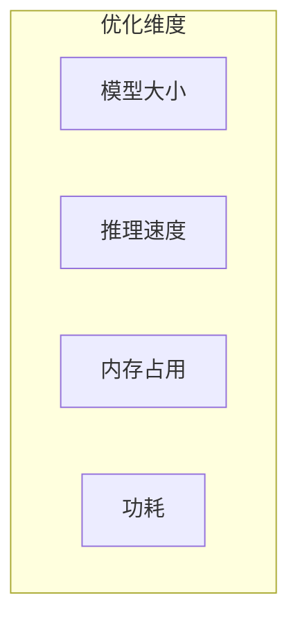
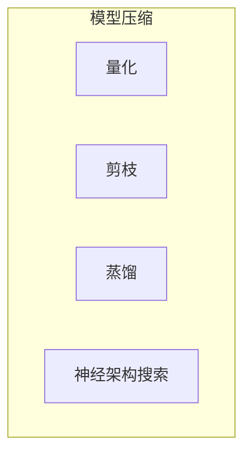
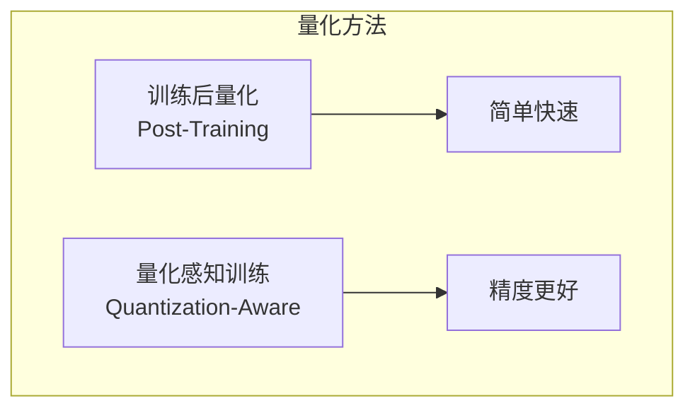
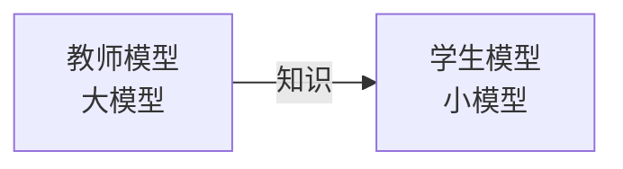
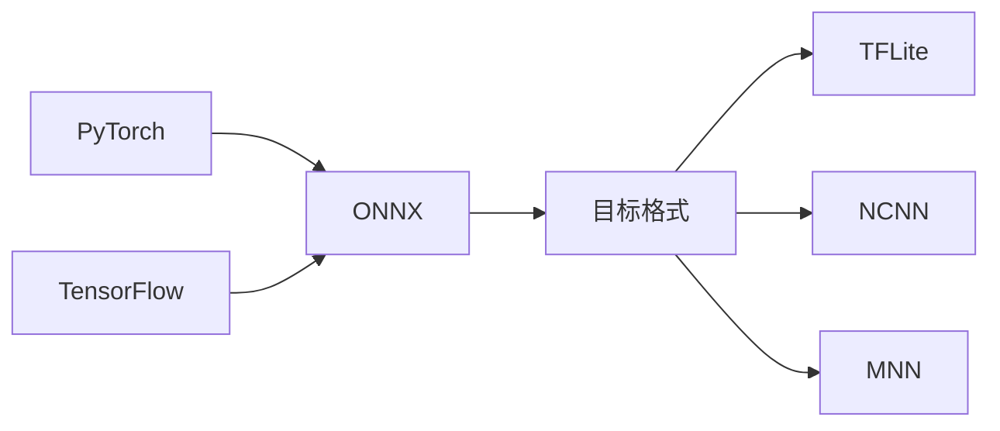
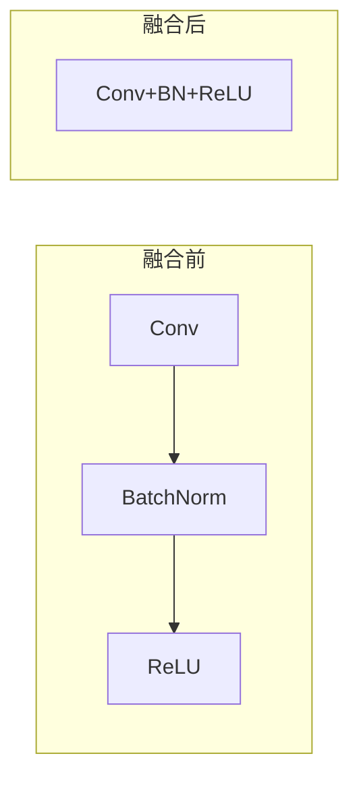
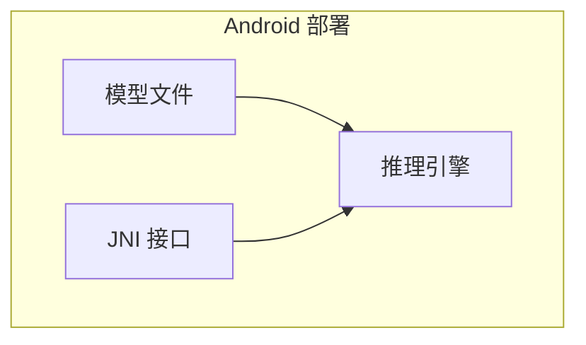
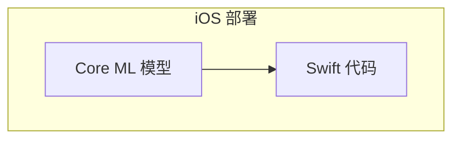
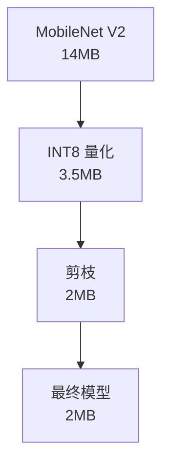

+++
title = "23 - 端侧模型优化实战"
description = "从模型压缩到部署优化的完整实战指南"
date = 2025-02-06
updated = 2025-02-06
draft = false
[taxonomies]
tags = ["模型优化", "量化", "剪枝", "端侧部署"]
[extra]
toc = true
comments = true
+++

## 一、优化目标

### 1.1 端侧约束

| 约束 | 典型值 |
|------|--------|
| 模型大小 | < 50MB |
| 内存占用 | < 500MB |
| 延迟 | < 100ms |
| 功耗 | 尽量低 |

### 1.2 优化维度

---

## 二、模型压缩技术

### 2.1 技术概览

### 2.2 量化

**降低数值精度**

| 精度 | 大小 | 精度损失 |
|------|------|----------|
| FP32 | 100% | 0 |
| FP16 | 50% | 极小 |
| INT8 | 25% | 小 |
| INT4 | 12.5% | 中等 |

**量化方法**：

### 2.3 剪枝

**移除不重要的权重**

| 类型 | 特点 |
|------|------|
| 非结构化 | 压缩率高，硬件难加速 |
| 结构化 | 真正减少计算 |

### 2.4 知识蒸馏

---

## 三、量化实战

### 3.1 训练后量化

**步骤**：

### 3.2 量化感知训练

**步骤**：

### 3.3 最佳实践

| 实践 | 建议 |
|------|------|
| 校准数据 | 100-1000 样本 |
| 敏感层 | 保持高精度 |
| 验证 | 量化后测试精度 |

---

## 四、模型转换

### 4.1 转换流程

### 4.2 常见问题

| 问题 | 解决 |
|------|------|
| 算子不支持 | 替换或自定义 |
| 形状不匹配 | 固定输入形状 |
| 精度下降 | 检查量化配置 |

---

## 五、推理优化

### 5.1 算子融合

### 5.2 内存优化

| 优化 | 方法 |
|------|------|
| 内存复用 | Tensor 复用 |
| 内存池 | 预分配 |
| 流式处理 | 分块计算 |

### 5.3 计算优化

| 优化 | 方法 |
|------|------|
| SIMD | NEON/AVX |
| 多线程 | OpenMP |
| GPU 加速 | Vulkan/Metal |

---

## 六、部署实战

### 6.1 Android 部署

### 6.2 iOS 部署

### 6.3 嵌入式部署

| 考虑 | 要点 |
|------|------|
| 内存 | 静态分配 |
| 实时性 | 确定性延迟 |
| 功耗 | 休眠策略 |

---

## 七、性能测试

### 7.1 测试指标

| 指标 | 测量方法 |
|------|----------|
| 延迟 | 多次取平均 |
| 吞吐 | 批量处理 |
| 内存 | 峰值占用 |
| 功耗 | 电池消耗 |

### 7.2 测试工具

| 工具 | 用途 |
|------|------|
| Benchmark | 性能测试 |
| Profiler | 热点分析 |
| Memory Analyzer | 内存分析 |

### 7.3 测试最佳实践

| 实践 | 建议 |
|------|------|
| 预热 | 先跑几次 |
| 多次测量 | 取平均值 |
| 真实数据 | 实际场景 |
| 不同设备 | 覆盖目标设备 |

---

## 八、案例：图像分类

### 8.1 优化流程

### 8.2 效果对比

| 阶段 | 大小 | 精度 | 延迟 |
|------|------|------|------|
| 原始 | 14MB | 72% | 50ms |
| INT8 | 3.5MB | 71.5% | 25ms |
| 剪枝 | 2MB | 71% | 20ms |

---

## 九、案例：目标检测

### 9.1 优化策略

| 策略 | 效果 |
|------|------|
| 小模型 | YOLO Nano |
| 量化 | INT8 |
| 输入尺寸 | 320x320 |
| NMS 优化 | 减少后处理 |

### 9.2 效果

| 配置 | mAP | 延迟 |
|------|-----|------|
| YOLOv5s FP32 | 37% | 100ms |
| YOLOv5s INT8 | 36% | 40ms |
| YOLO Nano INT8 | 28% | 15ms |

---

## 十、总结

### 10.1 优化流程

### 10.2 核心建议

| 建议 | 说明 |
|------|------|
| 从小模型开始 | MobileNet, EfficientNet |
| 优先量化 | 收益最大 |
| 测试验证 | 真实设备测试 |
| 迭代优化 | 持续改进 |

### 10.3 工具选择

| 场景 | 推荐 |
|------|------|
| 快速验证 | TFLite |
| 极致性能 | NCNN |
| 跨平台 | ONNX Runtime |
| Apple | Core ML |

---

## 相关文章

- [上一篇：22 - 端侧推理引擎对比](/articles/embedded/embedded-22-端侧推理引擎对比/)
- [18 - 边缘 AI 与端侧部署详解](/articles/ai/ai-18-边缘AI与端侧部署详解/)
- [16 - 推理框架优化技术详解](/articles/ai/ai-16-推理框架优化技术详解/)
