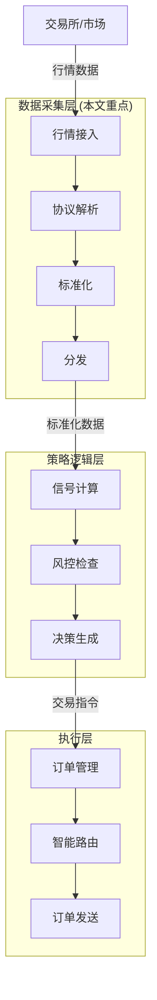
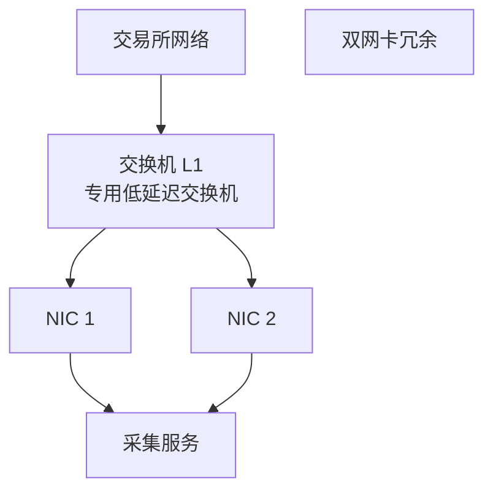
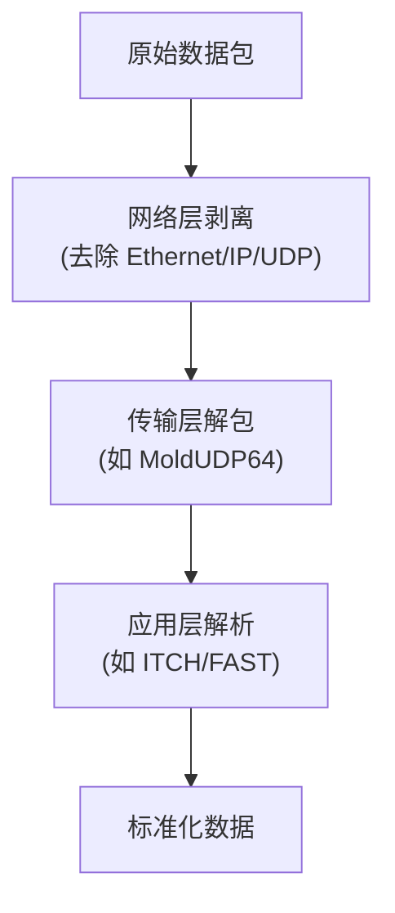
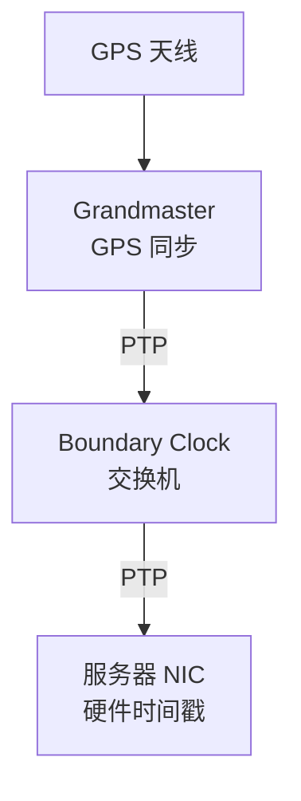
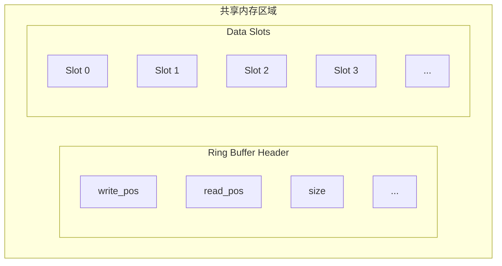
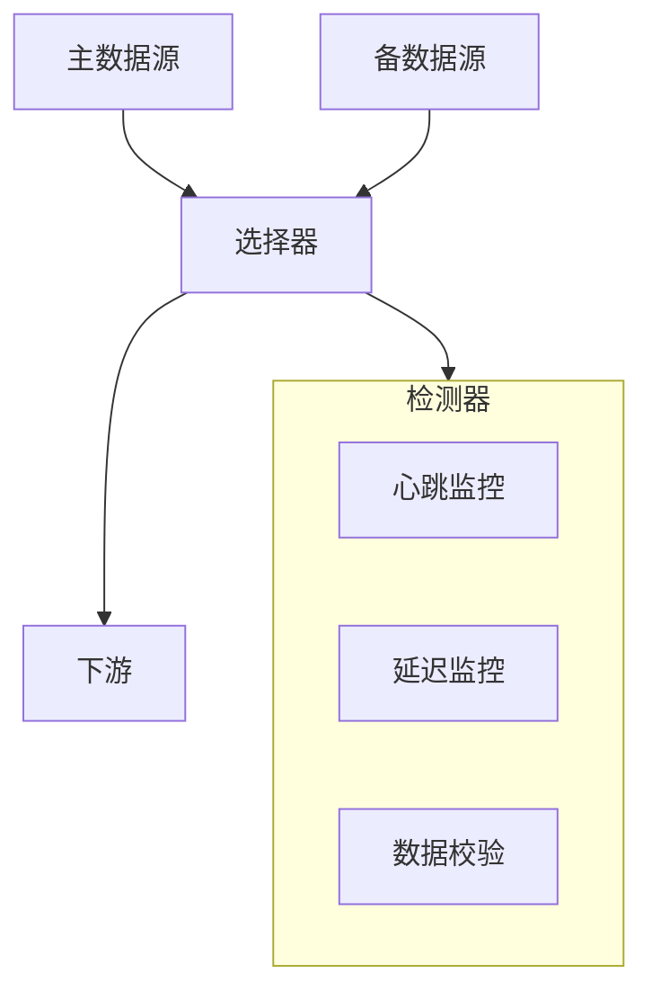
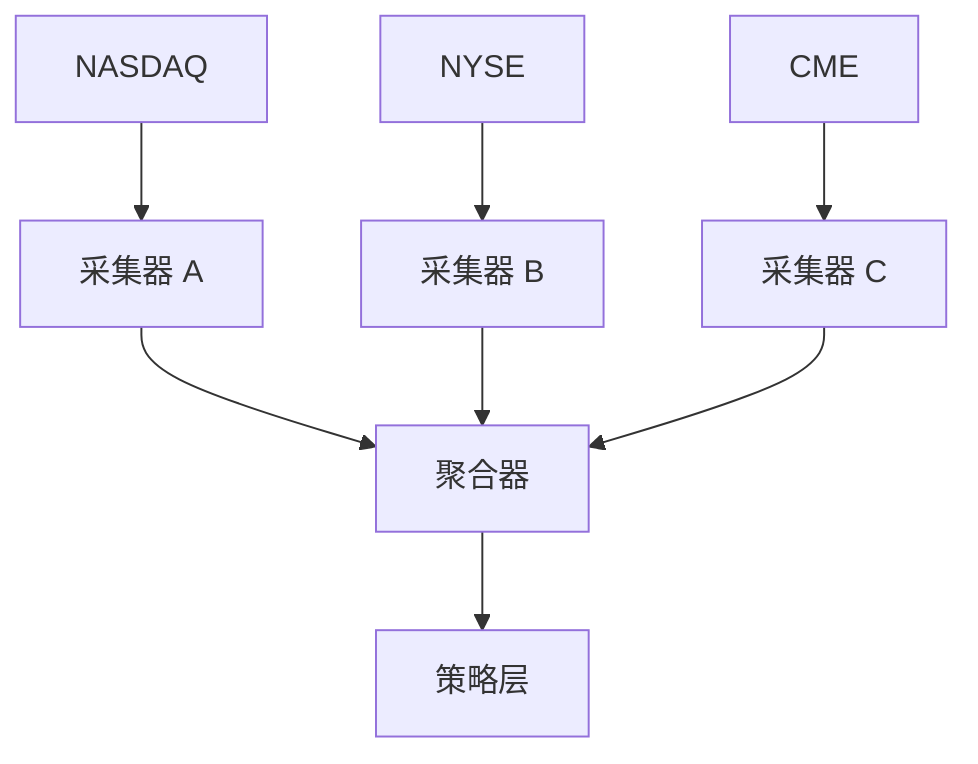

+++
title = "数据采集层设计"
date = 2026-01-13
weight = 5000
description = "高频交易系统数据采集层深度解析：行情接入、数据标准化、低延迟分发架构"
[taxonomies]
tags = ["hft", "architecture", "market-data", "low-latency"]
+++

# HFT架构系列-数据采集层设计

数据采集层是 HFT 系统的感知入口，负责以最低延迟获取、解析和分发市场数据。本文深入解析其架构设计与优化实践。

---

## 一、数据采集层定位

### 1.1 HFT 系统分层架构

### 1.2 数据采集层职责

| 职责 | 说明 |
|-----|------|
| 行情接入 | 连接交易所数据源 |
| 协议解析 | 解码各种行情协议 |
| 数据标准化 | 统一数据格式 |
| 时间戳 | 精确时间标记 |
| 分发 | 向下游组件分发 |
| 监控 | 延迟、丢包、异常 |

### 1.3 关键性能指标

| 指标 | 目标值 | 说明 |
|-----|-------|------|
| 解析延迟 | <1μs | 协议解码时间 |
| 端到端延迟 | <10μs | 收到到分发 |
| 吞吐量 | >1M msg/s | 峰值处理能力 |
| 丢包率 | 0 | 不丢失任何行情 |
| 抖动 | <1μs | 延迟稳定性 |

---

## 二、行情数据源

### 2.1 数据源类型

| 类型 | 说明 | 延迟特征 |
|-----|------|---------|
| 交易所直连 | 主机托管，最低延迟 | 最快 |
| 数据供应商 | Bloomberg、Reuters | 较慢 |
| 聚合行情 | 多源聚合 | 中等 |
| 备用源 | 容灾备份 | 次优先 |

### 2.2 主要交易所行情协议

| 交易所 | 行情协议 | 传输方式 |
|-------|---------|---------|
| NASDAQ | ITCH | UDP 组播 |
| NYSE | Pillar/XDP | UDP 组播 |
| CME | MDP 3.0 | UDP 组播 |
| 上交所 | FAST | UDP 组播 |
| 深交所 | Binary | UDP 组播 |
| 港交所 | OMD | TCP/UDP |

### 2.3 数据级别

| 级别 | 内容 | 数据量 |
|-----|------|--------|
| Level 1 | 最优买卖价和量 | 低 |
| Level 2 | 多档价格深度 | 中 |
| Level 3 | 完整订单簿 | 高 |
| 逐笔成交 | 每笔成交详情 | 高 |
| 逐笔委托 | 每笔委托详情 | 最高 |

---

## 三、接入架构

### 3.1 物理接入

### 3.2 网卡选择

| 特性 | 要求 |
|-----|------|
| 内核旁路 | DPDK/Solarflare OpenOnload |
| 硬件时间戳 | PTP 支持 |
| 低延迟 | <1μs 网卡延迟 |
| 组播支持 | IGMP v3 |
| RSS | 多队列接收 |

推荐型号：
- Solarflare X2/XtremeScale
- Mellanox ConnectX-6
- Intel E810

### 3.3 主机托管 (Colocation)

| 优势 | 说明 |
|-----|------|
| 最低延迟 | 物理距离最短 |
| 稳定性 | 专线连接 |
| 公平性 | 等长线缆 |
| 直连 | 无中间跳数 |

---

## 四、协议解析

### 4.1 解析器架构

### 4.2 解析优化策略

| 策略 | 说明 |
|-----|------|
| 零拷贝 | 直接在网络缓冲区解析 |
| 代码生成 | 根据协议自动生成解析器 |
| SIMD | 批量处理多字段 |
| 分支消除 | 查表替代条件判断 |
| 内联展开 | 避免函数调用开销 |
| 预取 | 提前加载后续数据 |

### 4.3 多协议支持

| 设计模式 | 说明 |
|---------|------|
| 策略模式 | 运行时选择解析器（有开销） |
| 模板特化 | 编译时多态（零开销） |
| 代码生成 | 每协议独立解析器 |
| 插件架构 | 动态加载（灵活但有开销） |

---

## 五、数据标准化

### 5.1 为什么需要标准化

| 问题 | 说明 |
|-----|------|
| 协议差异 | 不同交易所格式不同 |
| 字段差异 | 命名、类型不统一 |
| 精度差异 | 小数位数不同 |
| 时间差异 | 时区、精度不同 |

### 5.2 标准化数据模型

**行情快照**：

| 字段 | 类型 | 说明 |
|-----|------|------|
| symbol | string | 统一代码 |
| exchange | enum | 交易所 |
| timestamp | uint64 | 纳秒时间戳 |
| bid_price | int64 | 买一价（定点） |
| bid_size | uint32 | 买一量 |
| ask_price | int64 | 卖一价（定点） |
| ask_size | uint32 | 卖一量 |
| last_price | int64 | 最新成交价 |
| last_size | uint32 | 最新成交量 |

**订单簿更新**：

| 字段 | 类型 | 说明 |
|-----|------|------|
| symbol | string | 统一代码 |
| side | enum | 买/卖 |
| action | enum | 新增/修改/删除 |
| price | int64 | 价格 |
| size | uint32 | 数量 |
| order_id | uint64 | 订单标识 |

### 5.3 标准化处理

| 处理项 | 说明 |
|-------|------|
| 代码映射 | 交易所代码 → 内部代码 |
| 价格转换 | 统一精度（如 8 位小数） |
| 时间转换 | 统一为 UTC 纳秒 |
| 枚举映射 | 统一买卖、订单类型 |
| 数据校验 | 合理性检查 |

---

## 六、时间管理

### 6.1 时间戳来源

| 来源 | 精度 | 延迟 |
|-----|------|------|
| 系统时钟 | 纳秒 | 有偏差 |
| 网卡硬件时间戳 | 纳秒 | 最准确 |
| 交易所时间戳 | 纳秒 | 发送时间 |
| GPS/PTP | 纳秒 | 全球同步 |

### 6.2 时间同步

| 协议 | 精度 | 说明 |
|-----|------|------|
| NTP | 毫秒级 | 不适合 HFT |
| PTP | 微秒/纳秒 | 交易所标准 |
| GPS | 纳秒级 | 绝对时间源 |

**PTP 架构**：

### 6.3 时间戳记录点

| 记录点 | 用途 |
|-------|------|
| 网卡接收时间 | 真实延迟测量 |
| 解析完成时间 | 解析性能 |
| 分发时间 | 内部延迟 |
| 策略接收时间 | 端到端延迟 |

---

## 七、数据分发

### 7.1 分发模式

| 模式 | 说明 | 适用场景 |
|-----|------|---------|
| 直接调用 | 函数调用，最快 | 紧耦合 |
| 共享内存 | IPC，零拷贝 | 多进程 |
| 消息队列 | 解耦，有开销 | 松耦合 |
| 发布订阅 | 多订阅者 | 广播场景 |

### 7.2 共享内存设计

### 7.3 无锁队列

| 特性 | 说明 |
|-----|------|
| 单生产者单消费者 | 最简单高效 |
| 原子操作 | 无锁同步 |
| 缓存行填充 | 避免伪共享 |
| 序号机制 | 检测覆盖 |

### 7.4 分发延迟优化

| 优化 | 说明 |
|-----|------|
| 内存预分配 | 避免分配延迟 |
| 缓存预热 | 预加载热点数据 |
| CPU 绑定 | 避免迁移开销 |
| 忙等待 | 替代阻塞等待 |

---

## 八、可靠性设计

### 8.1 丢包检测与恢复

| 机制 | 说明 |
|-----|------|
| 序号检测 | 检测缺失序号 |
| 重传请求 | TCP 通道请求重传 |
| 快照同步 | 快照 + 增量恢复 |
| 备用源 | 切换到备用数据源 |

### 8.2 故障切换

### 8.3 监控指标

| 指标 | 说明 |
|-----|------|
| 消息速率 | 每秒消息数 |
| 延迟分布 | P50/P99/P99.9 |
| 丢包计数 | 序号跳跃次数 |
| 重传次数 | 恢复请求次数 |
| 源切换 | 故障切换次数 |

---

## 九、部署架构

### 9.1 多市场架构

### 9.2 冗余部署

| 冗余级别 | 说明 |
|---------|------|
| 网卡冗余 | 双网卡绑定 |
| 服务器冗余 | 主备服务器 |
| 数据源冗余 | A/B Feed |
| 机房冗余 | 多数据中心 |

---

## 十、设计检查清单

- [ ] **网络层**
  - [ ] 低延迟网卡
  - [ ] 内核旁路
  - [ ] 硬件时间戳
  - [ ] 组播配置
- [ ] **解析层**
  - [ ] 零拷贝解析
  - [ ] 代码生成/优化
  - [ ] 多协议支持
- [ ] **标准化**
  - [ ] 统一数据模型
  - [ ] 精度处理
  - [ ] 时间同步
- [ ] **分发层**
  - [ ] 无锁队列
  - [ ] 共享内存
  - [ ] CPU 绑定
- [ ] **可靠性**
  - [ ] 丢包检测
  - [ ] 故障切换
  - [ ] 监控告警

---

## 参考资料

- [NASDAQ Technical Documentation](https://www.nasdaqtrader.com/)
- [CME Group Market Data](https://www.cmegroup.com/market-data.html)
- [Low Latency Trading Infrastructure](https://queue.acm.org/detail.cfm?id=2534976)

---

## 相关文章

- [上一篇：ITCH与OUCH协议详解](@/articles/hft/hft-04-ITCH与OUCH协议详解.md)
- [下一篇：策略逻辑层设计](@/articles/hft/hft-06-策略逻辑层设计.md)
