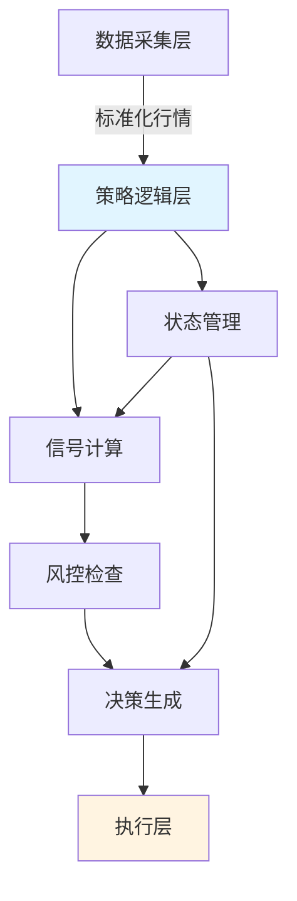
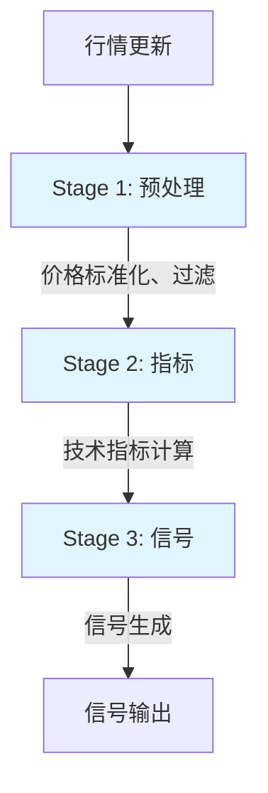
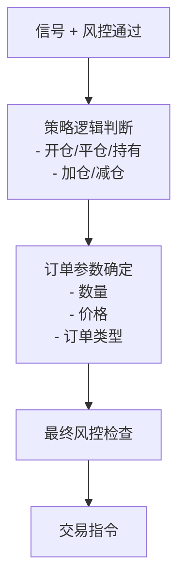
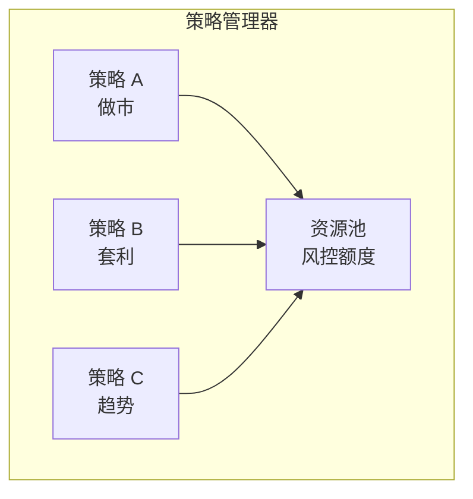
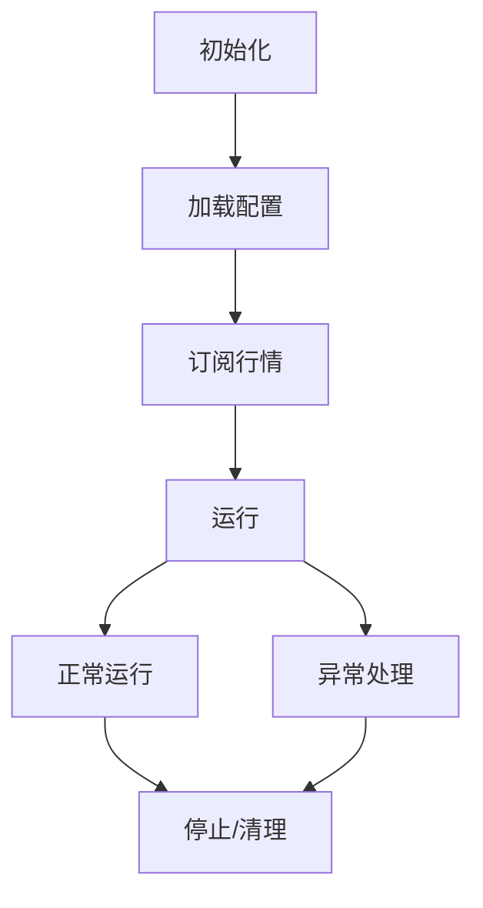

+++
title = "06. 策略逻辑层设计"
date = 2026-01-13
weight = 6000
description = "高频交易策略层深度解析：信号计算、风控集成、决策引擎与低延迟实现"
[taxonomies]
tags = ["hft", "architecture", "strategy", "trading"]
+++

# HFT架构系列-策略逻辑层设计

策略逻辑层是 HFT 系统的大脑，负责将市场数据转化为交易决策。本文深入解析其架构设计与核心机制。

---

## 一、策略层定位

### 1.1 在 HFT 系统中的位置



### 1.2 核心职责

| 职责 | 说明 |
|-----|------|
| 信号计算 | 基于行情计算交易信号 |
| 风险控制 | 实时检查交易风险 |
| 决策生成 | 生成订单指令 |
| 状态管理 | 维护持仓、订单状态 |
| 策略协调 | 多策略资源协调 |

### 1.3 关键性能指标

| 指标 | 目标值 | 说明 |
|-----|-------|------|
| 信号延迟 | <1μs | 计算到决策 |
| 风控延迟 | <500ns | 检查时间 |
| 总延迟 | <5μs | 行情到指令 |
| 吞吐量 | >100K/s | 决策频率 |
| 确定性 | 低抖动 | 延迟稳定 |

---

## 二、信号计算

### 2.1 信号类型

| 类型 | 说明 | 延迟敏感度 |
|-----|------|-----------|
| 行情驱动 | 价格/订单簿变化触发 | 极高 |
| 时间驱动 | 定时计算 | 中等 |
| 事件驱动 | 成交/订单状态触发 | 高 |
| 复合信号 | 多源组合 | 视情况 |

### 2.2 常见信号计算

**价格类**：
- 价差（Spread）
- 中间价（Mid Price）
- 加权平均价（VWAP）
- 价格动量

**订单簿类**：
- 买卖压力比
- 订单簿深度
- 订单簿倾斜度
- 大单检测

**统计类**：
- 移动平均
- 波动率
- 相关性
- 协整关系

### 2.3 计算优化

| 策略 | 说明 |
|-----|------|
| 增量计算 | 只更新变化部分 |
| 预计算 | 提前计算静态部分 |
| 近似算法 | 精度换速度 |
| 查表 | 复杂函数查表 |
| SIMD | 并行计算 |

**增量计算示例**：

```
传统方式：每次完整计算移动平均
  MA = (P1 + P2 + ... + Pn) / n

增量方式：利用前值
  MA_new = MA_old + (P_new - P_old) / n
```

### 2.4 计算流水线



---

## 三、风险控制

### 3.1 风控层级

| 层级 | 位置 | 延迟影响 |
|-----|------|---------|
| 策略内风控 | 策略代码内 | 最小 |
| 策略层风控 | 统一风控模块 | 小 |
| 执行层风控 | 订单发送前 | 中等 |
| 交易所风控 | 外部 | 无控制 |

### 3.2 实时风控检查项

**头寸限制**：

| 检查项 | 说明 |
|-------|------|
| 单品种持仓 | 最大持仓量 |
| 总持仓 | 组合总风险敞口 |
| 净持仓 | 多空净额 |
| 杠杆率 | 风险乘数 |

**订单限制**：

| 检查项 | 说明 |
|-------|------|
| 单笔数量 | 订单最大量 |
| 价格偏离 | 与市场价偏差 |
| 频率限制 | 下单速率 |
| 撤单比 | 撤单/下单比例 |

**损益限制**：

| 检查项 | 说明 |
|-------|------|
| 日内损失 | 单日最大亏损 |
| 持仓损失 | 持仓浮亏 |
| 回撤限制 | 从高点回撤 |

### 3.3 风控实现

| 要求 | 实现方式 |
|-----|---------|
| 低延迟 | 内联检查，无分支 |
| 原子性 | 预检查后立即扣减 |
| 准确性 | 整数运算，定点数 |
| 可恢复 | 检查失败可回滚 |

### 3.4 风控熔断

| 触发条件 | 动作 |
|---------|------|
| 损失超限 | 停止开新仓 |
| 异常行情 | 暂停策略 |
| 系统故障 | 平仓/停止 |
| 人工干预 | 立即停止 |

---

## 四、决策引擎

### 4.1 决策流程



### 4.2 订单类型选择

| 订单类型 | 适用场景 | 延迟敏感度 |
|---------|---------|-----------|
| 市价单 | 紧急成交 | 最高 |
| 限价单 | 价格敏感 | 高 |
| IOC | 即时部分成交 | 高 |
| FOK | 全部或取消 | 中 |

### 4.3 价格策略

| 策略 | 说明 |
|-----|------|
| 被动挂单 | 挂买卖盘等待 |
| 主动成交 | 吃对手盘 |
| 追价 | 逐步改价 |
| 加点 | 在最优价上加点 |

### 4.4 数量策略

| 策略 | 说明 |
|-----|------|
| 固定数量 | 每次固定 |
| 风险比例 | 按风险敞口 |
| 动态调整 | 按信号强度 |
| 分批 | 拆分成多笔 |

---

## 五、状态管理

### 5.1 状态类型

| 状态 | 说明 | 更新频率 |
|-----|------|---------|
| 持仓 | 当前持仓量 | 成交时 |
| 挂单 | 未成交订单 | 订单状态变化 |
| 损益 | 已实现/未实现 | 实时 |
| 风控额度 | 剩余可用额度 | 实时 |
| 策略参数 | 运行时参数 | 配置变化 |

### 5.2 状态一致性

| 挑战 | 解决方案 |
|-----|---------|
| 并发更新 | 无锁数据结构 |
| 消息乱序 | 序号排序 |
| 部分成交 | 事件驱动更新 |
| 网络延迟 | 本地状态 + 异步确认 |

### 5.3 持仓计算

```
净持仓 = 已成交买入 - 已成交卖出
待成交 = 未成交买单 - 未成交卖单
最大潜在敞口 = 净持仓 + 待成交买单
最小潜在敞口 = 净持仓 - 待成交卖单
```

### 5.4 状态恢复

| 场景 | 恢复方式 |
|-----|---------|
| 正常重启 | 持久化状态加载 |
| 崩溃恢复 | 从执行报告重建 |
| 日初 | 清零或从清算获取 |

---

## 六、多策略协调

### 6.1 策略隔离



### 6.2 资源分配

| 资源 | 分配方式 |
|-----|---------|
| 资金 | 按策略配额 |
| 风控额度 | 独立 + 共享 |
| 持仓限额 | 策略级限制 |
| 下单频率 | 总量控制 |

### 6.3 策略冲突处理

| 冲突类型 | 处理方式 |
|---------|---------|
| 同品种反向 | 优先级/合并 |
| 资源竞争 | 队列/抢占 |
| 风控共享 | 先到先得 |

---

## 七、低延迟实现

### 7.1 代码优化

| 技术 | 说明 |
|-----|------|
| 内联 | 消除函数调用 |
| 分支预测 | likely/unlikely |
| 循环展开 | 减少判断 |
| 常量折叠 | 编译时计算 |
| 无分配 | 预分配内存 |

### 7.2 数据结构

| 需求 | 推荐结构 |
|-----|---------|
| 快速查找 | 哈希表/数组直接索引 |
| 有序访问 | 跳表/平衡树 |
| 队列 | 无锁环形缓冲区 |
| 计数器 | 原子变量 |

### 7.3 内存优化

| 技术 | 说明 |
|-----|------|
| 内存池 | 预分配，快速分配 |
| 对象复用 | 避免频繁创建销毁 |
| 缓存对齐 | 64 字节对齐 |
| 热数据集中 | 提高缓存命中 |

### 7.4 线程模型

| 模型 | 说明 |
|-----|------|
| 单线程 | 最简单，无锁 |
| 分片 | 按品种分线程 |
| 流水线 | 阶段并行 |
| 混合 | 核心单线程 + 辅助多线程 |

---

## 八、策略开发框架

### 8.1 框架设计

| 组件 | 职责 |
|-----|------|
| 策略接口 | 统一策略 API |
| 事件分发 | 行情/订单事件路由 |
| 状态管理 | 持仓/订单状态 |
| 风控集成 | 统一风控接口 |
| 监控 | 性能和业务监控 |

### 8.2 策略生命周期



### 8.3 策略接口设计

| 方法 | 说明 |
|-----|------|
| on_init | 初始化 |
| on_quote | 行情更新 |
| on_order | 订单状态更新 |
| on_trade | 成交通知 |
| on_timer | 定时回调 |
| on_stop | 停止清理 |

---

## 九、测试与验证

### 9.1 测试类型

| 类型 | 说明 |
|-----|------|
| 单元测试 | 信号计算正确性 |
| 集成测试 | 完整流程 |
| 回测 | 历史数据验证 |
| 模拟盘 | 实时模拟 |
| 沙盒 | 交易所测试环境 |

### 9.2 关键验证点

| 验证项 | 方法 |
|-------|------|
| 信号准确性 | 对比预期值 |
| 风控有效性 | 边界测试 |
| 延迟稳定性 | 性能测试 |
| 状态一致性 | 日终对账 |

---

## 十、设计检查清单

- [ ] **信号计算**
  - [ ] 增量计算优化
  - [ ] 无分配实现
  - [ ] 延迟测量
- [ ] **风险控制**
  - [ ] 多层风控
  - [ ] 原子检查
  - [ ] 熔断机制
- [ ] **决策引擎**
  - [ ] 订单类型覆盖
  - [ ] 价格策略
  - [ ] 数量策略
- [ ] **状态管理**
  - [ ] 无锁实现
  - [ ] 状态恢复
  - [ ] 一致性保证
- [ ] **性能优化**
  - [ ] 内联优化
  - [ ] 缓存优化
  - [ ] 线程模型

---

## 参考资料

- [Trading and Exchanges: Market Microstructure](https://www.oxfordscholarship.com/)
- [Algorithmic Trading: Winning Strategies](https://www.wiley.com/)
- [High-Frequency Trading: A Practical Guide](https://www.wiley.com/)

---

## 相关文章

- [上一篇：数据采集层设计](@/articles/hft/hft-05-数据采集层设计.md)
- [下一篇：执行层设计](@/articles/hft/hft-07-执行层设计.md)
