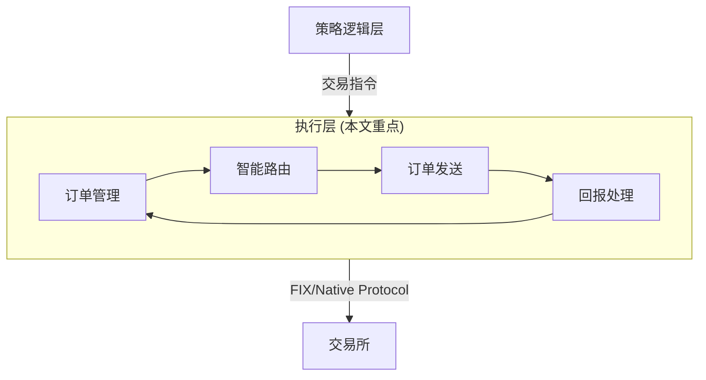
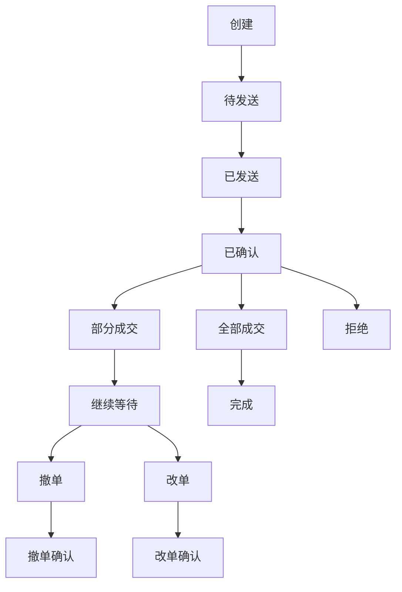
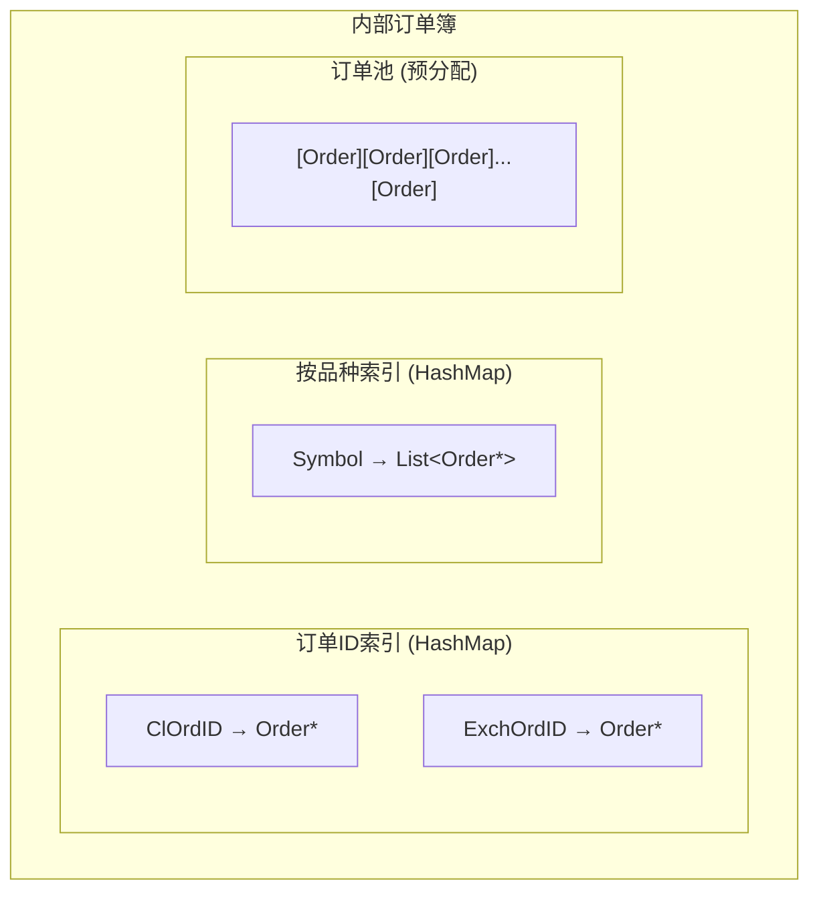
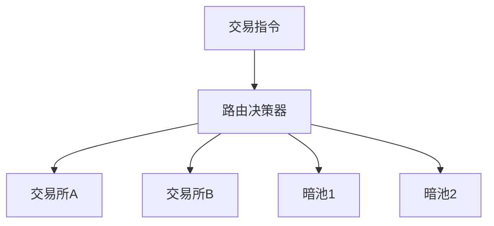
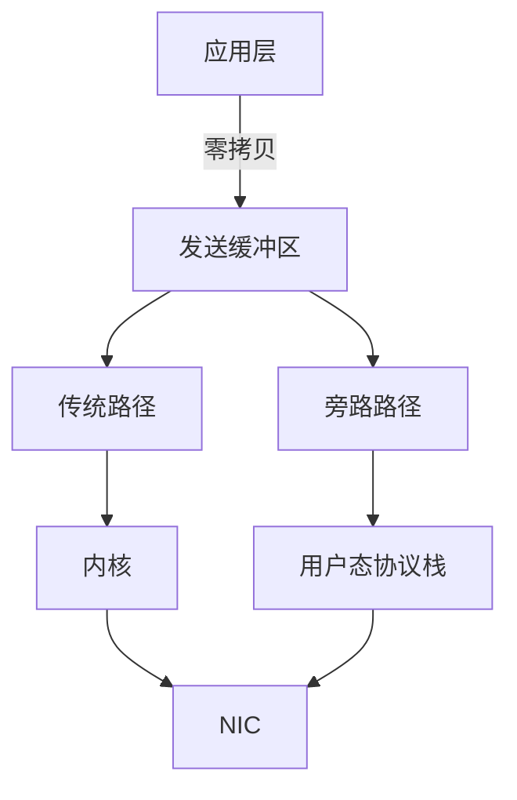
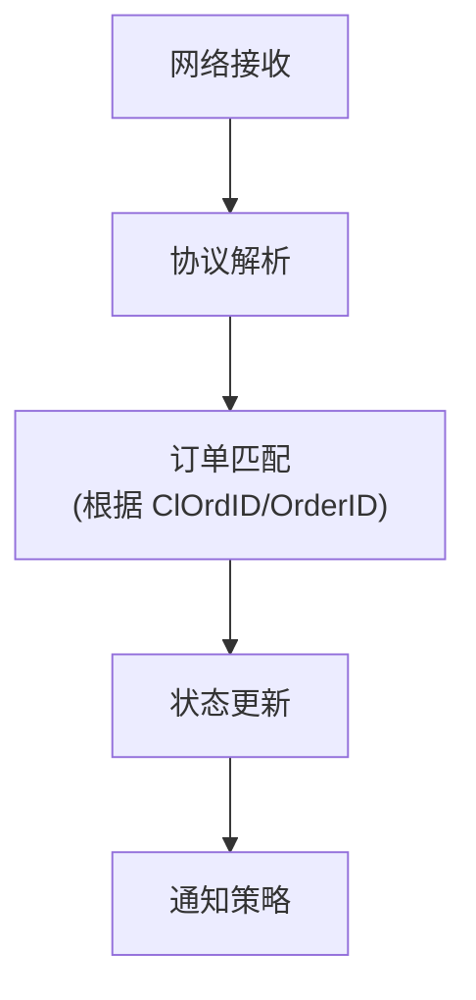
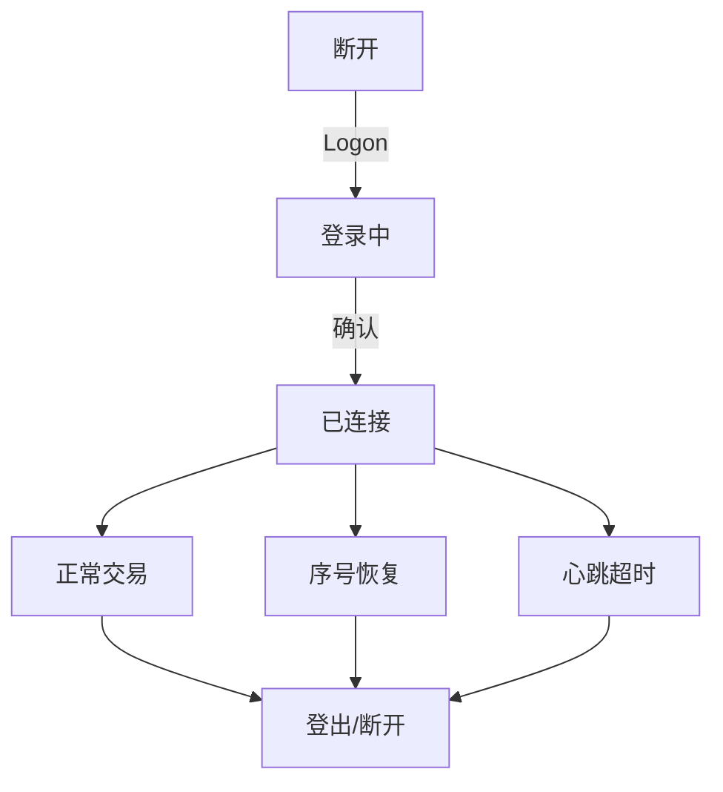
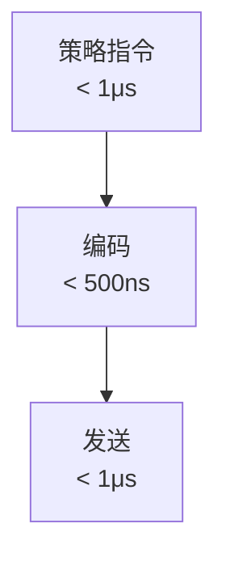

+++
title = "执行层设计"
date = 2026-01-13
weight = 7000
description = "高频交易执行层深度解析：订单管理、智能路由、协议编码与极致低延迟优化"
[taxonomies]
tags = ["hft", "architecture", "execution", "order-routing"]
+++

# HFT架构系列-执行层设计

执行层是 HFT 系统的最后一公里，负责将交易决策以最快速度送达交易所。本文深入解析其架构设计与优化实践。

---

## 一、执行层定位

### 1.1 在 HFT 系统中的位置



### 1.2 核心职责

| 职责 | 说明 |
|-----|------|
| 订单管理 | 订单生命周期管理 |
| 智能路由 | 选择最优执行场所 |
| 协议编码 | 转换为交易所协议 |
| 订单发送 | 网络传输 |
| 回报处理 | 执行报告处理 |
| 状态同步 | 与策略层同步 |

### 1.3 关键性能指标

| 指标 | 目标值 | 说明 |
|-----|-------|------|
| 编码延迟 | <500ns | 消息编码时间 |
| 发送延迟 | <1μs | 到网卡 |
| 总延迟 | <5μs | 决策到发出 |
| 回报延迟 | <2μs | 收到到通知策略 |
| 吞吐量 | >50K/s | 订单发送能力 |

---

## 二、订单管理

### 2.1 订单生命周期



### 2.2 订单状态管理

| 状态 | 说明 | 可转换状态 |
|-----|------|-----------|
| Pending | 待发送 | Sent, Cancelled |
| Sent | 已发送 | Confirmed, Rejected |
| Confirmed | 已确认 | PartialFill, Filled, Cancelled |
| PartialFill | 部分成交 | Filled, Cancelled |
| Filled | 全部成交 | - |
| Cancelled | 已撤销 | - |
| Rejected | 被拒绝 | - |

### 2.3 订单簿维护



### 2.4 订单 ID 管理

| ID 类型 | 说明 |
|--------|------|
| ClOrdID | 客户端订单ID，本地生成 |
| OrigClOrdID | 原订单ID（改单/撤单） |
| OrderID | 交易所订单ID |
| ExecID | 执行ID |

**ID 生成策略**：
- 高位：时间戳或日期
- 中位：策略/连接标识
- 低位：序号
- 保证唯一、有序、可追溯

---

## 三、智能路由

### 3.1 路由决策因素

| 因素 | 说明 |
|-----|------|
| 价格 | 最优执行价格 |
| 流动性 | 成交概率 |
| 延迟 | 到达时间 |
| 费用 | 交易成本 |
| 规则 | 监管要求 |

### 3.2 路由策略

| 策略 | 说明 | 适用场景 |
|-----|------|---------|
| 最优价格 | 选择最优报价 | 价格敏感 |
| 最快到达 | 选择最低延迟 | 时间敏感 |
| 流动性优先 | 选择深度最大 | 大单 |
| 成本最低 | 考虑手续费 | 高频小单 |
| 轮询 | 分散发送 | 分散执行 |

### 3.3 多市场路由



### 3.4 路由表设计

| 字段 | 说明 |
|-----|------|
| Symbol | 品种 |
| Venue | 交易场所 |
| Priority | 优先级 |
| Latency | 预估延迟 |
| Fees | 费用结构 |
| Constraints | 约束条件 |

---

## 四、协议编码

### 4.1 编码优化原则

| 原则 | 说明 |
|-----|------|
| 零分配 | 预分配缓冲区 |
| 零拷贝 | 直接写入发送缓冲区 |
| 模板复用 | 预填充静态字段 |
| 整数快速转换 | 避免通用方法 |
| 增量 CheckSum | 利用预计算 |

### 4.2 消息模板

**预构建模板**：

`8=FIX.4.4|9=XXX|35=D|49=SENDER|56=TARGET|...`

- `9=XXX` → 需更新
- `35=D` → 已固定

**发送时只更新**：
- BodyLength (9)
- MsgSeqNum (34)
- SendingTime (52)
- 业务字段 (ClOrdID, Symbol, Price, Qty...)
- CheckSum (10)

### 4.3 整数转换优化

**传统方式问题**：
- sprintf 开销大
- 多次除法运算

**优化方法**：
- 查表法：预计算 0-99 的两位字符串
- 分治法：分段处理大整数
- 专用函数：针对常见长度优化

### 4.4 CheckSum 优化

```
模板 CheckSum: 预计算静态部分和
动态部分: 只累加变化字段
最终 CheckSum = (模板和 + 动态和) mod 256
```

---

## 五、网络发送

### 5.1 发送路径



### 5.2 内核旁路技术

| 技术 | 说明 |
|-----|------|
| DPDK | Intel 数据平面开发套件 |
| Solarflare OpenOnload | 用户态 TCP/UDP |
| Mellanox VMA | 类似 OpenOnload |
| io_uring | 异步 I/O（较新） |

### 5.3 发送优化

| 优化 | 说明 |
|-----|------|
| 忙轮询 | 避免中断延迟 |
| 批量发送 | 减少系统调用 |
| CPU 绑定 | 避免迁移 |
| 网卡队列绑定 | 减少锁竞争 |
| TCP_NODELAY | 禁用 Nagle |

### 5.4 连接管理

| 场景 | 策略 |
|-----|------|
| 长连接 | 保持 TCP 连接 |
| 连接池 | 多连接负载均衡 |
| 自动重连 | 故障自动恢复 |
| 会话恢复 | FIX 序号恢复 |

---

## 六、回报处理

### 6.1 回报类型

| 类型 | 说明 | 处理优先级 |
|-----|------|-----------|
| 确认 | 订单已接受 | 中 |
| 成交 | 部分/全部成交 | 高 |
| 拒绝 | 订单被拒绝 | 高 |
| 撤单确认 | 撤单成功 | 中 |
| 改单确认 | 改单成功 | 中 |

### 6.2 回报处理流程



### 6.3 成交处理

| 步骤 | 说明 |
|-----|------|
| 验证 | 确认订单存在 |
| 更新订单 | 更新成交量、状态 |
| 更新持仓 | 调整持仓数量 |
| 更新损益 | 计算盈亏 |
| 通知策略 | 回调策略层 |
| 风控更新 | 更新风控额度 |

### 6.4 异常处理

| 异常 | 处理方式 |
|-----|---------|
| 未知订单 | 记录日志，不崩溃 |
| 乱序回报 | 缓存或重排 |
| 重复回报 | 幂等处理 |
| 连接断开 | 重连后状态同步 |

---

## 七、会话管理

### 7.1 FIX 会话

| 组件 | 职责 |
|-----|------|
| 会话层 | 登录、心跳、序号 |
| 应用层 | 业务消息 |
| 序号管理 | 发送/接收序号 |
| 消息存储 | 重传支持 |

### 7.2 会话状态



### 7.3 序号恢复

| 场景 | 处理 |
|-----|------|
| 正常重启 | 从持久化恢复 |
| 序号跳跃 | ResendRequest |
| 日切 | 重置序号 |
| 紧急情况 | ResetSeqNumFlag |

### 7.4 心跳管理

| 配置项 | 建议值 |
|-------|-------|
| HeartBtInt | 30秒 |
| 超时容忍 | 2-3倍心跳间隔 |
| TestRequest | 超时前发送 |

---

## 八、低延迟实现

### 8.1 关键路径优化

**关键路径 (最小化)**:



**非关键路径 (可异步)**: 日志、统计、状态持久化

### 8.2 编码优化总结

| 技术 | 收益 |
|-----|------|
| 模板预填充 | 减少 50% 编码时间 |
| 整数快速转换 | 减少 80% 转换时间 |
| 增量 CheckSum | 减少 70% 计算时间 |
| 零分配 | 消除 GC/分配延迟 |

### 8.3 发送优化总结

| 技术 | 收益 |
|-----|------|
| 内核旁路 | 减少 10-50μs |
| CPU 绑定 | 减少抖动 |
| 忙轮询 | 减少唤醒延迟 |
| TCP_NODELAY | 减少 Nagle 延迟 |

### 8.4 线程模型

| 模型 | 适用场景 |
|-----|---------|
| 单线程 | 简单场景，最低延迟 |
| 发送/接收分离 | 中等复杂度 |
| 每连接一线程 | 多交易所 |
| 事件驱动 | 高连接数 |

---

## 九、监控与诊断

### 9.1 延迟监控

| 测量点 | 说明 |
|-------|------|
| T1 | 策略发出指令时间 |
| T2 | 开始编码时间 |
| T3 | 发送到网卡时间 |
| T4 | 收到回报时间 |
| T5 | 通知策略时间 |

**关键延迟**：
- 内部延迟：T3 - T1
- 往返延迟：T4 - T3
- 总延迟：T5 - T1

### 9.2 监控指标

| 指标 | 说明 |
|-----|------|
| 订单量 | 发送/成交/撤单数 |
| 成交率 | 成交量/发送量 |
| 拒绝率 | 拒绝量/发送量 |
| 延迟分布 | P50/P99/P99.9 |
| 网络状态 | 连接数、重连次数 |

### 9.3 问题诊断

| 问题 | 排查方向 |
|-----|---------|
| 高延迟 | 编码/网络/内核 |
| 高拒绝 | 风控/格式/限额 |
| 连接不稳定 | 网络/心跳/序号 |
| 状态不一致 | 回报处理/并发 |

---

## 十、设计检查清单

- [ ] **订单管理**
  - [ ] 订单状态机完整
  - [ ] ID 管理唯一
  - [ ] 预分配订单池
- [ ] **智能路由**
  - [ ] 多场所支持
  - [ ] 路由策略灵活
  - [ ] 故障切换
- [ ] **协议编码**
  - [ ] 模板预填充
  - [ ] 快速整数转换
  - [ ] 增量校验和
- [ ] **网络发送**
  - [ ] 内核旁路
  - [ ] CPU 绑定
  - [ ] 连接管理
- [ ] **回报处理**
  - [ ] 快速解析
  - [ ] 状态更新
  - [ ] 异常处理
- [ ] **会话管理**
  - [ ] 序号恢复
  - [ ] 心跳机制
  - [ ] 自动重连

---

## 参考资料

- [FIX Protocol Specification](https://www.fixtrading.org/)
- [Direct Market Access](https://www.investopedia.com/terms/d/directmarketaccess.asp)
- [Exchange Connectivity Best Practices](https://www.cmegroup.com/confluence/)

---

## 相关文章

- [上一篇：策略逻辑层设计](@/articles/hft/hft-06-策略逻辑层设计.md)
- [下一篇：流水线技术详解](@/articles/hft/hft-08-流水线技术详解.md)
