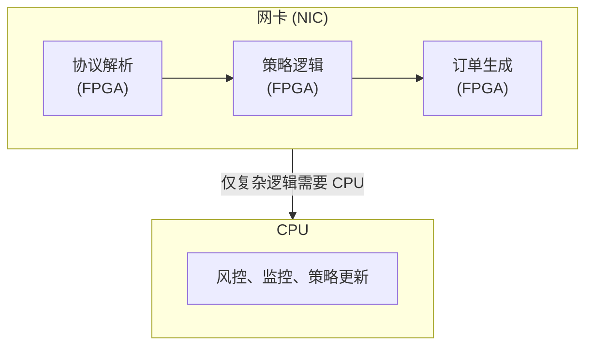
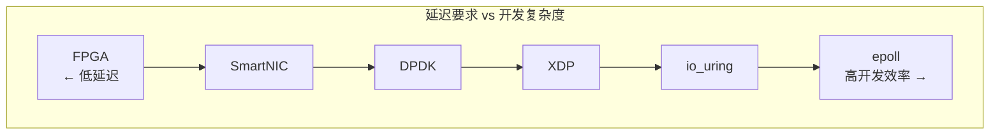

+++
title = "10. 低延迟系统前沿技术与新趋势"
date = 2025-01-10
weight = 10000
description = "高频交易领域近年来涌现的新技术与最佳实践，包括 FPGA、eBPF/XDP、io_uring、C++20/23、智能网卡等"
+++

# HFT 低延迟系统前沿技术与新趋势

本文探讨高频交易领域近年来涌现的新技术、新方法和业界最佳实践。这些技术正在被头部量化机构积极探索和采用。

---

## 一、FPGA 加速

### 1.1 为什么使用 FPGA

| 对比项 | CPU | FPGA |
|--------|-----|------|
| 延迟 | ~1-10μs | ~100ns-1μs |
| 确定性 | 低（OS 抖动） | 高（硬件级） |
| 吞吐量 | 中等 | 极高（并行） |
| 开发难度 | 低 | 高 |
| 灵活性 | 高 | 中等 |

### 1.2 FPGA 在 HFT 中的应用



### 1.3 主流 FPGA 平台

| 厂商 | 产品 | 特点 |
|------|------|------|
| Xilinx (AMD) | Alveo U250/U55C | 高端，生态完善 |
| Intel | Agilex/Stratix | 集成 CPU，易于部署 |
| Solarflare | X2 系列 | 专为交易设计 |

### 1.4 开发框架

```cpp
// 使用 HLS (High-Level Synthesis) 从 C++ 生成硬件
// Xilinx Vitis HLS 示例
#pragma HLS INTERFACE axis port=input
#pragma HLS INTERFACE axis port=output
#pragma HLS PIPELINE II=1  // 每周期处理一个数据

void processPacket(hls::stream<Packet>& input, 
                   hls::stream<Order>& output) {
    Packet pkt = input.read();
    
    // 协议解析 - 完全在 FPGA 上执行
    if (pkt.type == MARKET_DATA) {
        Order order = generateOrder(pkt);
        output.write(order);
    }
}
```

---

## 二、eBPF 与 XDP

### 2.1 XDP (eXpress Data Path)

XDP 允许在网卡驱动层处理数据包，绕过内核网络栈。

```
传统路径: NIC -> Driver -> Kernel Stack -> Socket -> App
XDP 路径: NIC -> Driver -> XDP Program -> App (或直接返回)
```

### 2.2 延迟对比

| 方案 | 延迟 |
|------|------|
| 传统 Socket | ~10-50μs |
| DPDK | ~1-5μs |
| XDP | ~2-10μs |
| FPGA | ~100ns-1μs |

### 2.3 XDP 程序示例

```c
// market_data_filter.bpf.c
#include <linux/bpf.h>
#include <bpf/bpf_helpers.h>

SEC("xdp")
int xdp_market_data_filter(struct xdp_md *ctx) {
    void *data = (void *)(long)ctx->data;
    void *data_end = (void *)(long)ctx->data_end;
    
    struct ethhdr *eth = data;
    if ((void *)(eth + 1) > data_end)
        return XDP_DROP;
    
    // 快速过滤非行情数据
    if (eth->h_proto != htons(ETH_P_IP))
        return XDP_DROP;
    
    struct iphdr *ip = (void *)(eth + 1);
    if ((void *)(ip + 1) > data_end)
        return XDP_DROP;
    
    // 只处理特定多播地址
    if (ip->daddr == MARKET_DATA_MULTICAST_IP) {
        return XDP_PASS;  // 传递给用户空间
    }
    
    return XDP_DROP;  // 丢弃无关数据
}
```

### 2.4 AF_XDP (Zero-Copy)

```cpp
// 用户空间使用 AF_XDP socket 零拷贝接收
#include <linux/if_xdp.h>

void setupAfXdp(const char* ifname) {
    // 创建 UMEM (用户态内存)
    struct xsk_umem_config cfg = {
        .fill_size = 2048,
        .comp_size = 2048,
        .frame_size = 4096,
        .frame_headroom = 0,
    };
    
    xsk_umem__create(&umem, buffer, BUFFER_SIZE, 
                     &fill_ring, &comp_ring, &cfg);
    
    // 创建 socket
    xsk_socket__create(&xsk, ifname, queue_id, 
                       umem, &rx_ring, &tx_ring, &xsk_cfg);
}
```

---

## 三、io_uring

### 3.1 io_uring 简介

Linux 5.1+ 引入的高性能异步 I/O 接口，通过共享内存环形队列减少系统调用。

```
传统异步 I/O:  每次操作 = 2 次系统调用 (submit + wait)
io_uring:      批量提交 = 1 次系统调用，甚至 0 次 (SQPOLL)
```

### 3.2 io_uring 用于网络

```cpp
#include <liburing.h>

class IoUringNetwork {
    struct io_uring ring_;
    
public:
    void init() {
        struct io_uring_params params = {};
        params.flags = IORING_SETUP_SQPOLL;  // 内核轮询，无系统调用
        params.sq_thread_idle = 10000;       // 10ms 后休眠
        
        io_uring_queue_init_params(256, &ring_, &params);
    }
    
    void submitRecv(int fd, void* buf, size_t len) {
        struct io_uring_sqe* sqe = io_uring_get_sqe(&ring_);
        io_uring_prep_recv(sqe, fd, buf, len, 0);
        io_uring_sqe_set_data(sqe, buf);  // 用户数据
        io_uring_submit(&ring_);
    }
    
    void pollCompletions() {
        struct io_uring_cqe* cqe;
        while (io_uring_peek_cqe(&ring_, &cqe) == 0) {
            void* buf = io_uring_cqe_get_data(cqe);
            int result = cqe->res;
            
            processData(buf, result);
            io_uring_cqe_seen(&ring_, cqe);
        }
    }
};
```

### 3.3 io_uring 多路复用模式

```cpp
// 注册固定缓冲区，避免每次拷贝
struct iovec iovs[NUM_BUFFERS];
io_uring_register_buffers(&ring_, iovs, NUM_BUFFERS);

// 使用固定缓冲区接收
struct io_uring_sqe* sqe = io_uring_get_sqe(&ring_);
io_uring_prep_recv(sqe, fd, nullptr, 0, 0);
sqe->buf_index = buffer_id;  // 使用预注册的缓冲区
sqe->flags |= IOSQE_BUFFER_SELECT;
```

---

## 四、C++20/23 新特性

### 4.1 consteval（立即函数）

```cpp
// consteval: 强制编译期求值
consteval uint64_t computeHash(std::string_view s) {
    uint64_t hash = 0;
    for (char c : s) {
        hash = hash * 31 + c;
    }
    return hash;
}

// 使用 - 保证编译期计算
constexpr auto AAPL_HASH = computeHash("AAPL");

// 编译错误如果无法在编译期计算
// auto hash = computeHash(runtime_string);  // Error!
```

### 4.2 Concepts（约束模板）

```cpp
// 定义低延迟策略的概念
template<typename T>
concept LowLatencyStrategy = requires(T t, const Tick& tick) {
    { t.onTick(tick) } noexcept -> std::same_as<void>;
    { t.getPosition() } noexcept -> std::convertible_to<int>;
    requires sizeof(T) <= 64;  // 适合缓存行
};

// 使用 concept 约束
template<LowLatencyStrategy Strategy>
class TradingEngine {
    Strategy strategy_;
public:
    void processTick(const Tick& tick) noexcept {
        strategy_.onTick(tick);
    }
};
```

### 4.3 std::atomic_ref (C++20)

```cpp
// 对非原子变量进行原子操作
struct alignas(64) SharedData {
    double price;
    int64_t quantity;
};

void atomicUpdate(SharedData& data, double newPrice) {
    std::atomic_ref<double> atomicPrice(data.price);
    atomicPrice.store(newPrice, std::memory_order_release);
}
```

### 4.4 协程 (Coroutines)

```cpp
// 用于非关键路径的异步操作
#include <coroutine>

struct Task {
    struct promise_type {
        Task get_return_object() { return {}; }
        std::suspend_never initial_suspend() { return {}; }
        std::suspend_never final_suspend() noexcept { return {}; }
        void return_void() {}
        void unhandled_exception() {}
    };
};

// 异步日志记录（非热路径）
Task asyncLog(std::string message) {
    co_await writeToFile(message);  // 异步写入
}
```

### 4.5 std::expected (C++23)

```cpp
// 替代异常的错误处理
#include <expected>

std::expected<Order, ErrorCode> parseOrder(const char* data, size_t len) {
    if (len < sizeof(OrderHeader)) {
        return std::unexpected(ErrorCode::INVALID_SIZE);
    }
    
    Order order;
    // ... 解析逻辑 ...
    return order;
}

// 使用
auto result = parseOrder(buffer, len);
if (result) {
    processOrder(*result);
} else {
    handleError(result.error());
}
```

---

## 五、智能网卡 (SmartNIC) 与 DPU

### 5.1 架构

```
传统架构:
  NIC -> PCIe -> CPU -> 处理

SmartNIC 架构:
  NIC -> 内置处理器/FPGA -> 预处理 -> PCIe -> CPU
                        ↓
                    直接响应
```

### 5.2 主流产品

| 产品 | 厂商 | 特点 |
|------|------|------|
| BlueField-3 | NVIDIA | ARM + DPU，可运行完整 Linux |
| Pensando DSC | AMD | P4 可编程 |
| Intel IPU | Intel | 高性能网络卸载 |
| Solarflare X2 | Xilinx | 交易专用，FPGA |

### 5.3 卸载场景

```cpp
// 在 SmartNIC 上执行的操作
// 1. 协议解析 (FIX, ITCH, OUCH)
// 2. 序列号检查和重复检测
// 3. 简单过滤和路由
// 4. 时间戳添加
// 5. 数据压缩/解压

// CPU 仍处理
// 1. 复杂策略逻辑
// 2. 风控决策
// 3. 状态管理
```

---

## 六、硬件时间戳

### 6.1 PTP (Precision Time Protocol)

```cpp
#include <linux/net_tstamp.h>

void enableHardwareTimestamp(int sock) {
    int flags = SOF_TIMESTAMPING_RX_HARDWARE |
                SOF_TIMESTAMPING_TX_HARDWARE |
                SOF_TIMESTAMPING_RAW_HARDWARE;
    
    setsockopt(sock, SOL_SOCKET, SO_TIMESTAMPING, &flags, sizeof(flags));
    
    // 获取时间戳
    struct hwtstamp_config config = {
        .flags = 0,
        .tx_type = HWTSTAMP_TX_ON,
        .rx_filter = HWTSTAMP_FILTER_ALL,
    };
    
    struct ifreq ifr = {};
    strcpy(ifr.ifr_name, "eth0");
    ifr.ifr_data = (void*)&config;
    ioctl(sock, SIOCSHWTSTAMP, &ifr);
}
```

### 6.2 读取硬件时间戳

```cpp
void receiveWithTimestamp(int sock) {
    char buffer[2048];
    char control[256];
    
    struct iovec iov = { buffer, sizeof(buffer) };
    struct msghdr msg = {
        .msg_iov = &iov,
        .msg_iovlen = 1,
        .msg_control = control,
        .msg_controllen = sizeof(control),
    };
    
    recvmsg(sock, &msg, 0);
    
    // 解析时间戳
    for (struct cmsghdr* cmsg = CMSG_FIRSTHDR(&msg);
         cmsg != nullptr;
         cmsg = CMSG_NXTHDR(&msg, cmsg)) {
        if (cmsg->cmsg_level == SOL_SOCKET &&
            cmsg->cmsg_type == SO_TIMESTAMPING) {
            struct timespec* ts = (struct timespec*)CMSG_DATA(cmsg);
            // ts[0] = 软件时间戳
            // ts[2] = 硬件时间戳
            uint64_t hw_ns = ts[2].tv_sec * 1000000000ULL + ts[2].tv_nsec;
        }
    }
}
```

---

## 七、Kernel Bypass 新方案

### 7.1 DPDK vs AF_XDP vs io_uring

| 特性 | DPDK | AF_XDP | io_uring |
|------|------|--------|----------|
| 延迟 | 最低 (~1μs) | 低 (~2-5μs) | 中 (~5-10μs) |
| 复杂度 | 高 | 中 | 低 |
| 内核集成 | 无 | 有 | 有 |
| 驱动支持 | 专用驱动 | 主流驱动 | 通用 |
| CPU 占用 | 100% 轮询 | 可配置 | 可配置 |

### 7.2 选择建议

```
延迟要求 < 5μs  → DPDK 或 FPGA
延迟要求 < 20μs → AF_XDP
延迟要求 < 50μs → io_uring
其他场景         → 传统 epoll
```

---

## 八、机器学习推理优化

### 8.1 低延迟推理

```cpp
// ONNX Runtime 推理示例
#include <onnxruntime_cxx_api.h>

class FastInference {
    Ort::Env env_;
    Ort::Session session_;
    Ort::MemoryInfo memory_info_;
    
public:
    FastInference(const char* model_path) 
        : env_(ORT_LOGGING_LEVEL_WARNING, "trading"),
          memory_info_(Ort::MemoryInfo::CreateCpu(
              OrtArenaAllocator, OrtMemTypeDefault)) {
        
        Ort::SessionOptions opts;
        opts.SetIntraOpNumThreads(1);  // 单线程，减少延迟
        opts.SetGraphOptimizationLevel(
            GraphOptimizationLevel::ORT_ENABLE_ALL);
        
        session_ = Ort::Session(env_, model_path, opts);
    }
    
    float predict(const std::array<float, 64>& features) {
        std::array<int64_t, 2> shape = {1, 64};
        Ort::Value input = Ort::Value::CreateTensor<float>(
            memory_info_, const_cast<float*>(features.data()),
            features.size(), shape.data(), shape.size());
        
        const char* input_names[] = {"input"};
        const char* output_names[] = {"output"};
        
        auto outputs = session_.Run(
            Ort::RunOptions{nullptr},
            input_names, &input, 1,
            output_names, 1);
        
        return outputs[0].GetTensorData<float>()[0];
    }
};
```

### 8.2 模型量化

```cpp
// INT8 量化推理，更快的速度
Ort::SessionOptions opts;
opts.AppendExecutionProvider_CUDA(cuda_options);  // GPU
// 或使用 TensorRT/OpenVINO 进一步优化
```

---

## 九、持久内存 (PMEM)

### 9.1 Intel Optane 应用

```cpp
#include <libpmem.h>

// 持久内存映射
void* mapPersistentMemory(const char* path, size_t size) {
    int is_pmem;
    void* addr = pmem_map_file(path, size,
                               PMEM_FILE_CREATE,
                               0666, nullptr, &is_pmem);
    return addr;
}

// 持久化写入
void persistData(void* dest, const void* src, size_t len) {
    pmem_memcpy_persist(dest, src, len);  // 原子持久化
}

// 应用场景：订单日志、状态快照
```

---

## 十、总结与展望

### 10.1 技术成熟度

| 技术 | 成熟度 | 采用率 | 推荐程度 |
|------|--------|--------|----------|
| FPGA | 成熟 | 头部机构 | ⭐⭐⭐⭐⭐ |
| DPDK | 成熟 | 广泛 | ⭐⭐⭐⭐⭐ |
| eBPF/XDP | 成熟 | 增长中 | ⭐⭐⭐⭐ |
| io_uring | 成熟 | 增长中 | ⭐⭐⭐⭐ |
| C++20/23 | 成熟 | 逐步采用 | ⭐⭐⭐⭐ |
| SmartNIC | 成熟 | 头部机构 | ⭐⭐⭐⭐ |
| PMEM | 成熟 | 小众 | ⭐⭐⭐ |

### 10.2 技术选型建议



### 10.3 未来趋势

1. **CXL (Compute Express Link)** - 新一代互联技术
2. **光纤直连交易所** - 微波/激光通信
3. **量子计算** - 目前仍在探索阶段
4. **Rust 在 HFT** - 部分公司开始探索
5. **边缘计算** - 将计算靠近交易所

---

## 十一、参考资源

- [DPDK 官方文档](https://doc.dpdk.org/)
- [eBPF/XDP 教程](https://ebpf.io/)
- [io_uring 文档](https://kernel.dk/io_uring.pdf)
- [Xilinx Vitis HLS](https://www.xilinx.com/products/design-tools/vitis.html)
- [LMAX Disruptor](https://lmax-exchange.github.io/disruptor/)
- Jane Street Tech Blog
- Two Sigma Engineering Blog

---

## 相关文章

- [上一篇：定点运算详解](@/articles/hft/hft-09-定点运算详解.md)
- [下一篇：Rust在HFT领域的实践与必知必会](@/articles/hft/hft-11-Rust在HFT的实践.md)
