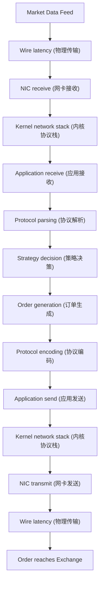

+++
title = "HFT系统延迟分析方法"
slug = "hft-12-HFT系统延迟分析方法"
date = 2026-01-21
weight = 12000
description = "深入剖析HFT系统延迟分析，包括延迟分解、测量点设计、百分位延迟、Tick-to-Trade和硬件时间戳"
[taxonomies]
tags = ["HFT", "延迟分析", "性能优化", "时间戳", "低延迟"]
+++

## 概述

延迟是HFT系统的核心指标。精确测量和分析延迟是优化系统性能的基础。

---

## 一、延迟分解

### 1.1 端到端延迟组成

**完整延迟** = 网络延迟 + 内核延迟 + 应用延迟 + 交易所延迟



### 1.2 各环节典型延迟

| 环节 | 典型延迟 | 优化后 |
|------|----------|--------|
| Wire (Co-lo) | 50-200ns | 50ns |
| NIC receive | 1-5μs | 100-500ns (Kernel Bypass) |
| Kernel stack | 5-20μs | 0 (Kernel Bypass) |
| Protocol parsing | 100-500ns | 50-100ns |
| Strategy decision | 100ns-10μs | 100-500ns |
| Protocol encoding | 100-500ns | 50-100ns |
| NIC transmit | 1-5μs | 100-500ns (Kernel Bypass) |

### 1.3 延迟预算分配

```cpp
// 典型的超低延迟系统延迟预算
struct LatencyBudget {
    // 网络层
    static constexpr uint64_t WIRE_LATENCY_NS = 100;
    static constexpr uint64_t NIC_RX_NS = 300;
    static constexpr uint64_t NIC_TX_NS = 300;
    
    // 应用层
    static constexpr uint64_t PARSING_NS = 100;
    static constexpr uint64_t STRATEGY_NS = 500;
    static constexpr uint64_t ENCODING_NS = 100;
    
    // 总预算
    static constexpr uint64_t TOTAL_NS = 
        WIRE_LATENCY_NS * 2 + NIC_RX_NS + NIC_TX_NS + 
        PARSING_NS + STRATEGY_NS + ENCODING_NS;
    // = 1500ns = 1.5μs
};
```

---

## 二、测量点设计

### 2.1 关键测量点

```cpp
enum class MeasurementPoint {
    // 入站路径
    NIC_RX_TIMESTAMP,      // 网卡接收时间戳
    KERNEL_RX,             // 内核接收（如使用）
    APP_RX,                // 应用接收
    PARSE_START,           // 解析开始
    PARSE_END,             // 解析结束
    STRATEGY_START,        // 策略开始
    STRATEGY_END,          // 策略结束
    
    // 出站路径
    ORDER_GENERATE,        // 订单生成
    ENCODE_START,          // 编码开始
    ENCODE_END,            // 编码结束
    APP_TX,                // 应用发送
    KERNEL_TX,             // 内核发送（如使用）
    NIC_TX_TIMESTAMP,      // 网卡发送时间戳
    
    // 外部
    EXCHANGE_ACK,          // 交易所确认
};
```

### 2.2 时间戳采集

```cpp
#include <x86intrin.h>

class LatencyTracker {
public:
    // 使用RDTSC获取CPU周期
    static inline uint64_t rdtsc() {
        return __rdtsc();
    }
    
    // 使用RDTSCP（带序列化）
    static inline uint64_t rdtscp() {
        unsigned int aux;
        return __rdtscp(&aux);
    }
    
    // 转换为纳秒
    uint64_t cycles_to_ns(uint64_t cycles) const {
        return cycles * 1000000000ULL / cpu_freq_hz_;
    }
    
    // 记录测量点
    void record(MeasurementPoint point) {
        timestamps_[static_cast<int>(point)] = rdtscp();
    }
    
    // 计算区间延迟
    uint64_t get_latency_ns(MeasurementPoint start, 
                            MeasurementPoint end) const {
        uint64_t cycles = timestamps_[static_cast<int>(end)] - 
                          timestamps_[static_cast<int>(start)];
        return cycles_to_ns(cycles);
    }

private:
    uint64_t cpu_freq_hz_ = 3000000000ULL;  // 3GHz
    std::array<uint64_t, 16> timestamps_{};
};
```

### 2.3 最小化测量开销

```cpp
// 低开销时间戳记录
class LowOverheadTimer {
public:
    // 内联且无分支
    __attribute__((always_inline))
    void record_inline() {
        *current_++ = __rdtsc();
    }
    
    // 使用环形缓冲区避免分配
    void record_ringbuf() {
        timestamps_[index_++ & MASK] = __rdtsc();
    }
    
    // 批量写入，减少内存访问
    void flush() {
        // 批量写入到持久化存储
        for (size_t i = 0; i < index_; ++i) {
            log_file_.write(&timestamps_[i], sizeof(uint64_t));
        }
        index_ = 0;
    }
    
private:
    static constexpr size_t SIZE = 4096;
    static constexpr size_t MASK = SIZE - 1;
    std::array<uint64_t, SIZE> timestamps_;
    size_t index_ = 0;
    uint64_t* current_ = timestamps_.data();
};
```

---

## 三、百分位延迟

### 3.1 延迟分布统计

```cpp
class LatencyHistogram {
public:
    LatencyHistogram(uint64_t max_ns = 1000000, uint64_t bucket_ns = 100) 
        : max_ns_(max_ns), bucket_ns_(bucket_ns),
          buckets_(max_ns / bucket_ns + 1, 0) {}
    
    void record(uint64_t latency_ns) {
        size_t bucket = std::min(latency_ns / bucket_ns_, buckets_.size() - 1);
        buckets_[bucket]++;
        count_++;
        sum_ += latency_ns;
        
        if (latency_ns < min_) min_ = latency_ns;
        if (latency_ns > max_) max_ = latency_ns;
    }
    
    // 获取百分位数
    uint64_t percentile(double p) const {
        uint64_t target = static_cast<uint64_t>(count_ * p / 100.0);
        uint64_t cumulative = 0;
        
        for (size_t i = 0; i < buckets_.size(); ++i) {
            cumulative += buckets_[i];
            if (cumulative >= target) {
                return i * bucket_ns_;
            }
        }
        return max_ns_;
    }
    
    // 统计信息
    double mean() const { return count_ > 0 ? double(sum_) / count_ : 0; }
    uint64_t min() const { return min_; }
    uint64_t max() const { return max_; }
    uint64_t p50() const { return percentile(50); }
    uint64_t p95() const { return percentile(95); }
    uint64_t p99() const { return percentile(99); }
    uint64_t p999() const { return percentile(99.9); }
    
private:
    uint64_t max_ns_;
    uint64_t bucket_ns_;
    std::vector<uint64_t> buckets_;
    uint64_t count_ = 0;
    uint64_t sum_ = 0;
    uint64_t min_ = UINT64_MAX;
    uint64_t max_ = 0;
};
```

### 3.2 HdrHistogram使用

```cpp
#include <hdr_histogram.h>

class HdrLatencyRecorder {
public:
    HdrLatencyRecorder() {
        // 1ns - 1s, 3位有效数字精度
        hdr_init(1, 1000000000, 3, &histogram_);
    }
    
    ~HdrLatencyRecorder() {
        hdr_close(histogram_);
    }
    
    void record(uint64_t latency_ns) {
        hdr_record_value(histogram_, latency_ns);
    }
    
    void print_report() const {
        printf("Latency Report:\n");
        printf("  Min:     %ld ns\n", hdr_min(histogram_));
        printf("  Max:     %ld ns\n", hdr_max(histogram_));
        printf("  Mean:    %.2f ns\n", hdr_mean(histogram_));
        printf("  P50:     %ld ns\n", hdr_value_at_percentile(histogram_, 50));
        printf("  P95:     %ld ns\n", hdr_value_at_percentile(histogram_, 95));
        printf("  P99:     %ld ns\n", hdr_value_at_percentile(histogram_, 99));
        printf("  P99.9:   %ld ns\n", hdr_value_at_percentile(histogram_, 99.9));
        printf("  P99.99:  %ld ns\n", hdr_value_at_percentile(histogram_, 99.99));
    }
    
private:
    hdr_histogram* histogram_;
};
```

### 3.3 尾延迟分析

```
关注尾延迟的原因：
- P99延迟可能是P50的10倍以上
- 尾延迟影响真实交易体验
- 识别系统性问题（GC、页错误、中断）

典型尾延迟来源：
1. CPU缓存未命中
2. 页错误（TLB miss、page fault）
3. NUMA远程内存访问
4. 中断处理
5. 后台任务（JIT编译、GC）
6. 系统调用
7. 锁竞争
```

---

## 四、Tick-to-Trade延迟

### 4.1 定义与测量

```cpp
// Tick-to-Trade: 从收到市场数据到发出订单的时间

class TickToTradeTimer {
public:
    // 记录市场数据接收
    void on_market_data_received(uint64_t sequence, uint64_t nic_timestamp) {
        pending_[sequence] = nic_timestamp;
    }
    
    // 记录订单发送
    void on_order_sent(uint64_t sequence, uint64_t nic_timestamp) {
        auto it = pending_.find(sequence);
        if (it != pending_.end()) {
            uint64_t tick_to_trade = nic_timestamp - it->second;
            histogram_.record(tick_to_trade);
            pending_.erase(it);
        }
    }
    
    void print_stats() const {
        printf("Tick-to-Trade Latency:\n");
        printf("  Mean: %.2f us\n", histogram_.mean() / 1000.0);
        printf("  P50:  %.2f us\n", histogram_.p50() / 1000.0);
        printf("  P99:  %.2f us\n", histogram_.p99() / 1000.0);
    }
    
private:
    std::unordered_map<uint64_t, uint64_t> pending_;
    LatencyHistogram histogram_;
};
```

### 4.2 分段计时

```cpp
struct TimingBreakdown {
    uint64_t wire_to_app_ns;      // 网络到应用
    uint64_t parsing_ns;           // 协议解析
    uint64_t strategy_ns;          // 策略处理
    uint64_t encoding_ns;          // 订单编码
    uint64_t app_to_wire_ns;      // 应用到网络
    
    uint64_t total() const {
        return wire_to_app_ns + parsing_ns + strategy_ns + 
               encoding_ns + app_to_wire_ns;
    }
    
    void print() const {
        printf("Timing Breakdown:\n");
        printf("  Wire->App:  %5lu ns (%4.1f%%)\n", 
               wire_to_app_ns, 100.0 * wire_to_app_ns / total());
        printf("  Parsing:    %5lu ns (%4.1f%%)\n", 
               parsing_ns, 100.0 * parsing_ns / total());
        printf("  Strategy:   %5lu ns (%4.1f%%)\n", 
               strategy_ns, 100.0 * strategy_ns / total());
        printf("  Encoding:   %5lu ns (%4.1f%%)\n", 
               encoding_ns, 100.0 * encoding_ns / total());
        printf("  App->Wire:  %5lu ns (%4.1f%%)\n", 
               app_to_wire_ns, 100.0 * app_to_wire_ns / total());
        printf("  Total:      %5lu ns\n", total());
    }
};
```

---

## 五、硬件时间戳

### 5.1 网卡硬件时间戳

```cpp
// 使用SO_TIMESTAMPING获取硬件时间戳
void enable_hw_timestamping(int sockfd) {
    int flags = SOF_TIMESTAMPING_TX_HARDWARE |
                SOF_TIMESTAMPING_RX_HARDWARE |
                SOF_TIMESTAMPING_RAW_HARDWARE;
    
    setsockopt(sockfd, SOL_SOCKET, SO_TIMESTAMPING, 
               &flags, sizeof(flags));
}

// 从控制消息中提取时间戳
uint64_t extract_hw_timestamp(struct msghdr* msg) {
    for (struct cmsghdr* cmsg = CMSG_FIRSTHDR(msg);
         cmsg != nullptr;
         cmsg = CMSG_NXTHDR(msg, cmsg)) {
        
        if (cmsg->cmsg_level == SOL_SOCKET &&
            cmsg->cmsg_type == SO_TIMESTAMPING) {
            
            struct timespec* ts = (struct timespec*)CMSG_DATA(cmsg);
            // ts[0] = software timestamp
            // ts[1] = deprecated
            // ts[2] = hardware timestamp
            return ts[2].tv_sec * 1000000000ULL + ts[2].tv_nsec;
        }
    }
    return 0;
}
```

### 5.2 PTP时间同步

```cpp
// 使用PTP（Precision Time Protocol）同步时间
// 精度可达亚微秒级别

// 获取PHC（PTP Hardware Clock）时间
#include <linux/ptp_clock.h>

int get_phc_time(int phc_fd, struct timespec* ts) {
    return clock_gettime(FD_TO_CLOCKID(phc_fd), ts);
}

// 与系统时钟对比
void measure_clock_offset() {
    struct timespec phc_time, sys_time;
    
    // 快速连续读取两个时钟
    get_phc_time(phc_fd, &phc_time);
    clock_gettime(CLOCK_REALTIME, &sys_time);
    
    int64_t offset_ns = 
        (phc_time.tv_sec - sys_time.tv_sec) * 1000000000LL +
        (phc_time.tv_nsec - sys_time.tv_nsec);
    
    printf("PHC-System offset: %ld ns\n", offset_ns);
}
```

### 5.3 时间戳校准

```cpp
class TimestampCalibrator {
public:
    // 校准RDTSC频率
    void calibrate_tsc() {
        struct timespec start_ts, end_ts;
        
        clock_gettime(CLOCK_MONOTONIC, &start_ts);
        uint64_t start_tsc = __rdtsc();
        
        // 等待一段时间
        usleep(100000);  // 100ms
        
        clock_gettime(CLOCK_MONOTONIC, &end_ts);
        uint64_t end_tsc = __rdtsc();
        
        uint64_t elapsed_ns = 
            (end_ts.tv_sec - start_ts.tv_sec) * 1000000000ULL +
            (end_ts.tv_nsec - start_ts.tv_nsec);
        uint64_t elapsed_tsc = end_tsc - start_tsc;
        
        tsc_freq_hz_ = elapsed_tsc * 1000000000ULL / elapsed_ns;
        ns_per_cycle_ = 1000000000.0 / tsc_freq_hz_;
        
        printf("TSC frequency: %.3f GHz\n", tsc_freq_hz_ / 1e9);
    }
    
    uint64_t tsc_to_ns(uint64_t tsc) const {
        return static_cast<uint64_t>(tsc * ns_per_cycle_);
    }
    
private:
    uint64_t tsc_freq_hz_ = 0;
    double ns_per_cycle_ = 0;
};
```

---

## 六、延迟优化实践

### 6.1 热路径分析

```cpp
// 使用perf分析热点
// perf record -e cycles:u -g ./trading_app
// perf report

// 代码级延迟追踪
#define TRACE_LATENCY(name) \
    LatencyScope _scope_##__LINE__(name)

class LatencyScope {
public:
    LatencyScope(const char* name) : name_(name), start_(__rdtsc()) {}
    
    ~LatencyScope() {
        uint64_t cycles = __rdtsc() - start_;
        // 记录到全局统计
        LatencyStats::record(name_, cycles);
    }
    
private:
    const char* name_;
    uint64_t start_;
};

// 使用
void process_market_data(const MarketData& md) {
    TRACE_LATENCY("process_market_data");
    
    {
        TRACE_LATENCY("parse");
        parse(md);
    }
    
    {
        TRACE_LATENCY("strategy");
        strategy_.on_data(md);
    }
}
```

### 6.2 延迟抖动分析

```cpp
class JitterAnalyzer {
public:
    void record_latency(uint64_t latency_ns) {
        if (last_latency_ != 0) {
            int64_t jitter = static_cast<int64_t>(latency_ns) - 
                            static_cast<int64_t>(last_latency_);
            jitter_histogram_.record(std::abs(jitter));
            
            // 检测异常抖动
            if (std::abs(jitter) > threshold_ns_) {
                log_spike(latency_ns, jitter);
            }
        }
        last_latency_ = latency_ns;
    }
    
private:
    uint64_t last_latency_ = 0;
    uint64_t threshold_ns_ = 10000;  // 10μs阈值
    LatencyHistogram jitter_histogram_;
    
    void log_spike(uint64_t latency, int64_t jitter) {
        printf("Latency spike: %lu ns (jitter: %ld ns)\n", 
               latency, jitter);
    }
};
```

---

## 总结

| 技术 | 精度 | 开销 | 适用场景 |
|------|------|------|----------|
| RDTSC | ~1ns | <10 cycles | 应用内部 |
| clock_gettime | ~20ns | ~50ns | 跨进程 |
| NIC硬件时间戳 | <10ns | 0 | 网络延迟 |
| PTP同步 | <1μs | 后台 | 跨机器 |

**最佳实践**：
1. 使用硬件时间戳测量网络延迟
2. 使用RDTSCP测量应用内部延迟
3. 关注尾延迟（P99、P99.9）
4. 持续监控并设置告警阈值
5. 定期校准时间源

---

## 相关文章

- [上一篇：Rust在HFT领域的实践与必知必会](@/articles/hft/hft-11-Rust在HFT的实践.md)
- [下一篇：Order Book实现详解](@/articles/hft/hft-13-OrderBook实现详解.md)
