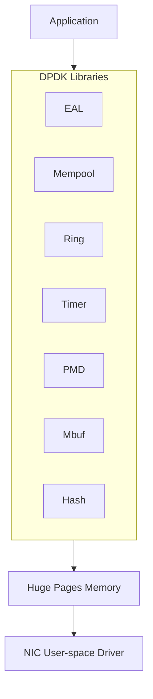

+++
title = "16.DPDK深度实践"
slug = "hft-20-DPDK深度实践"
date = 2026-01-21
description = "深入剖析DPDK的使用，包括内存池、Ring缓冲区、PMD、多队列和性能调优"
[taxonomies]
tags = ["HFT", "DPDK", "KernelBypass", "网络", "低延迟"]
+++

## 概述

DPDK（Data Plane Development Kit）是一套用于快速数据包处理的库，可以绑过内核协议栈，实现微秒级网络延迟。

---

## 一、DPDK基础

### 1.1 架构概述



### 1.2 EAL初始化

```cpp
#include <rte_eal.h>
#include <rte_ethdev.h>

int main(int argc, char* argv[]) {
    // 初始化EAL
    int ret = rte_eal_init(argc, argv);
    if (ret < 0) {
        rte_exit(EXIT_FAILURE, "EAL init failed\n");
    }
    
    // 获取可用端口数
    uint16_t nb_ports = rte_eth_dev_count_avail();
    printf("Available ports: %u\n", nb_ports);
    
    // 初始化端口
    for (uint16_t port = 0; port < nb_ports; port++) {
        if (init_port(port) < 0) {
            rte_exit(EXIT_FAILURE, "Port %u init failed\n", port);
        }
    }
    
    // 主循环
    while (1) {
        process_packets();
    }
    
    return 0;
}
```

---

## 二、内存池（Mempool）

### 2.1 创建内存池

```cpp
#include <rte_mempool.h>
#include <rte_mbuf.h>

struct rte_mempool* create_mempool(const char* name) {
    // 创建mbuf内存池
    struct rte_mempool* pool = rte_pktmbuf_pool_create(
        name,
        8192,           // 元素数量
        256,            // 缓存大小
        0,              // 私有数据大小
        RTE_MBUF_DEFAULT_BUF_SIZE,  // 数据缓冲区大小
        rte_socket_id() // NUMA节点
    );
    
    if (pool == NULL) {
        rte_exit(EXIT_FAILURE, "Cannot create mempool: %s\n",
                 rte_strerror(rte_errno));
    }
    
    return pool;
}
```

### 2.2 内存池优化

```cpp
// 高性能内存池配置
struct rte_mempool* create_optimized_mempool() {
    struct rte_mempool* pool;
    
    // 使用批量分配提高效率
    pool = rte_pktmbuf_pool_create(
        "optimized_pool",
        16384,          // 更大的池
        512,            // 更大的per-core缓存
        0,
        2048,           // 固定大小，适合大多数包
        rte_socket_id()
    );
    
    // 预热缓存
    struct rte_mbuf* mbufs[512];
    for (int i = 0; i < 512; i++) {
        mbufs[i] = rte_pktmbuf_alloc(pool);
    }
    for (int i = 0; i < 512; i++) {
        rte_pktmbuf_free(mbufs[i]);
    }
    
    return pool;
}
```

---

## 三、Ring缓冲区

### 3.1 无锁Ring队列

```cpp
#include <rte_ring.h>

// 创建Ring
struct rte_ring* create_ring(const char* name, unsigned count) {
    return rte_ring_create(
        name,
        count,              // 必须是2的幂
        rte_socket_id(),
        RING_F_SP_ENQ | RING_F_SC_DEQ  // 单生产者单消费者
    );
}

// 批量入队
int enqueue_batch(struct rte_ring* ring, void** objs, unsigned n) {
    return rte_ring_sp_enqueue_burst(ring, objs, n, NULL);
}

// 批量出队
int dequeue_batch(struct rte_ring* ring, void** objs, unsigned n) {
    return rte_ring_sc_dequeue_burst(ring, objs, n, NULL);
}
```

### 3.2 多生产者/多消费者Ring

```cpp
// 多生产者多消费者模式
struct rte_ring* create_mpmc_ring(const char* name, unsigned count) {
    return rte_ring_create(
        name,
        count,
        rte_socket_id(),
        0  // 默认多生产者多消费者
    );
}

// 使用
void producer(struct rte_ring* ring, void* obj) {
    while (rte_ring_mp_enqueue(ring, obj) != 0) {
        // 队列满，重试或处理
    }
}

void consumer(struct rte_ring* ring) {
    void* obj;
    while (rte_ring_mc_dequeue(ring, &obj) == 0) {
        process(obj);
    }
}
```

---

## 四、PMD（Poll Mode Driver）

### 4.1 端口初始化

```cpp
int init_port(uint16_t port) {
    struct rte_eth_conf port_conf = {};
    
    // 禁用校验和卸载（减少延迟）
    port_conf.rxmode.offloads = 0;
    port_conf.txmode.offloads = 0;
    
    // 配置端口
    int ret = rte_eth_dev_configure(port, 1, 1, &port_conf);
    if (ret < 0) return ret;
    
    // 配置接收队列
    ret = rte_eth_rx_queue_setup(
        port, 0, 256,
        rte_eth_dev_socket_id(port),
        NULL,
        mempool
    );
    if (ret < 0) return ret;
    
    // 配置发送队列
    ret = rte_eth_tx_queue_setup(
        port, 0, 256,
        rte_eth_dev_socket_id(port),
        NULL
    );
    if (ret < 0) return ret;
    
    // 启动端口
    ret = rte_eth_dev_start(port);
    if (ret < 0) return ret;
    
    // 开启混杂模式（可选）
    rte_eth_promiscuous_enable(port);
    
    return 0;
}
```

### 4.2 收发包

```cpp
// 高效收包循环
void rx_loop(uint16_t port) {
    struct rte_mbuf* bufs[32];
    
    while (1) {
        // 批量收包
        uint16_t nb_rx = rte_eth_rx_burst(port, 0, bufs, 32);
        
        if (nb_rx == 0) {
            // 无包，可以做其他事情或继续轮询
            continue;
        }
        
        // 处理数据包
        for (uint16_t i = 0; i < nb_rx; i++) {
            process_packet(bufs[i]);
            rte_pktmbuf_free(bufs[i]);
        }
    }
}

// 高效发包
void tx_packets(uint16_t port, struct rte_mbuf** bufs, uint16_t nb) {
    uint16_t sent = 0;
    
    while (sent < nb) {
        uint16_t ret = rte_eth_tx_burst(port, 0, 
                                         bufs + sent, nb - sent);
        sent += ret;
        
        if (ret == 0) {
            // 发送缓冲区满，等待或处理
        }
    }
}
```

---

## 五、多队列与RSS

### 5.1 配置多队列

```cpp
int init_port_multiqueue(uint16_t port, uint16_t nb_queues) {
    struct rte_eth_conf port_conf = {};
    
    // 启用RSS
    port_conf.rxmode.mq_mode = RTE_ETH_MQ_RX_RSS;
    port_conf.rx_adv_conf.rss_conf.rss_hf = 
        RTE_ETH_RSS_IP | RTE_ETH_RSS_TCP | RTE_ETH_RSS_UDP;
    
    int ret = rte_eth_dev_configure(port, nb_queues, nb_queues, &port_conf);
    if (ret < 0) return ret;
    
    // 为每个队列配置
    for (uint16_t q = 0; q < nb_queues; q++) {
        ret = rte_eth_rx_queue_setup(
            port, q, 256,
            rte_eth_dev_socket_id(port),
            NULL,
            mempool
        );
        if (ret < 0) return ret;
        
        ret = rte_eth_tx_queue_setup(
            port, q, 256,
            rte_eth_dev_socket_id(port),
            NULL
        );
        if (ret < 0) return ret;
    }
    
    return rte_eth_dev_start(port);
}
```

### 5.2 多核处理

```cpp
// 每个核心处理一个队列
int lcore_worker(void* arg) {
    uint16_t queue_id = (uint16_t)(uintptr_t)arg;
    struct rte_mbuf* bufs[32];
    
    printf("Worker on lcore %u handling queue %u\n",
           rte_lcore_id(), queue_id);
    
    while (1) {
        uint16_t nb_rx = rte_eth_rx_burst(0, queue_id, bufs, 32);
        
        for (uint16_t i = 0; i < nb_rx; i++) {
            process_packet(bufs[i]);
            rte_pktmbuf_free(bufs[i]);
        }
    }
    
    return 0;
}

// 启动多核处理
void start_workers(uint16_t nb_queues) {
    uint16_t queue_id = 0;
    unsigned lcore_id;
    
    RTE_LCORE_FOREACH_WORKER(lcore_id) {
        if (queue_id >= nb_queues) break;
        
        rte_eal_remote_launch(lcore_worker, 
                              (void*)(uintptr_t)queue_id,
                              lcore_id);
        queue_id++;
    }
}
```

---

## 六、性能调优

### 6.1 CPU亲和性

```cpp
// 绑定线程到特定CPU
void set_cpu_affinity(unsigned lcore_id) {
    cpu_set_t cpuset;
    CPU_ZERO(&cpuset);
    CPU_SET(lcore_id, &cpuset);
    
    pthread_setaffinity_np(pthread_self(), 
                           sizeof(cpuset), &cpuset);
}

// 使用isolcpus隔离CPU
// 在grub配置：isolcpus=2,3,4,5
```

### 6.2 大页配置

```bash
# 预留大页内存
echo 1024 > /sys/kernel/mm/hugepages/hugepages-2048kB/nr_hugepages

# 或使用1GB大页
echo 4 > /sys/kernel/mm/hugepages/hugepages-1048576kB/nr_hugepages

# 挂载
mkdir -p /mnt/huge
mount -t hugetlbfs nodev /mnt/huge
```

### 6.3 低延迟优化

```cpp
// 禁用中断聚合
void disable_interrupt_coalescing(uint16_t port) {
    struct rte_eth_dev_info dev_info;
    rte_eth_dev_info_get(port, &dev_info);
    
    // 设置最小中断延迟
    // 具体API取决于驱动
}

// 轮询优化
void optimized_poll_loop() {
    const unsigned BURST_SIZE = 32;
    struct rte_mbuf* bufs[BURST_SIZE];
    
    while (1) {
        // 使用prefetch提高缓存命中
        uint16_t nb_rx = rte_eth_rx_burst(0, 0, bufs, BURST_SIZE);
        
        if (likely(nb_rx > 0)) {
            // 预取下一批数据
            rte_prefetch0(rte_pktmbuf_mtod(bufs[0], void*));
            
            for (uint16_t i = 0; i < nb_rx; i++) {
                if (i + 1 < nb_rx) {
                    rte_prefetch0(rte_pktmbuf_mtod(bufs[i+1], void*));
                }
                process_packet(bufs[i]);
            }
            
            // 批量释放
            rte_pktmbuf_free_bulk(bufs, nb_rx);
        }
    }
}
```

---

## 七、HFT应用示例

### 7.1 低延迟UDP接收

```cpp
struct market_data_handler {
    void process(struct rte_mbuf* pkt) {
        // 直接访问数据，无拷贝
        struct rte_ether_hdr* eth = rte_pktmbuf_mtod(pkt, 
                                    struct rte_ether_hdr*);
        struct rte_ipv4_hdr* ip = (struct rte_ipv4_hdr*)(eth + 1);
        struct rte_udp_hdr* udp = (struct rte_udp_hdr*)(ip + 1);
        
        // 市场数据payload
        void* payload = (void*)(udp + 1);
        uint16_t payload_len = rte_be_to_cpu_16(udp->dgram_len) - 
                               sizeof(struct rte_udp_hdr);
        
        // 直接处理
        on_market_data(payload, payload_len);
    }
};
```

### 7.2 延迟测量

```cpp
class DPDKLatencyTracker {
public:
    void on_rx(struct rte_mbuf* pkt) {
        // 获取硬件时间戳（如果支持）
        uint64_t hw_ts = 0;
        if (pkt->ol_flags & RTE_MBUF_F_RX_IEEE1588_TMST) {
            rte_eth_timesync_read_rx_timestamp(port_, &hw_ts, 0);
        } else {
            hw_ts = rte_rdtsc();
        }
        
        rx_timestamp_ = hw_ts;
    }
    
    void on_tx(struct rte_mbuf* pkt) {
        uint64_t tx_ts = rte_rdtsc();
        uint64_t latency = tx_ts - rx_timestamp_;
        
        histogram_.record(cycles_to_ns(latency));
    }
    
private:
    uint16_t port_;
    uint64_t rx_timestamp_;
    LatencyHistogram histogram_;
};
```

---

## 总结

| 组件 | 延迟 | 吞吐量 |
|------|------|--------|
| 标准Socket | 10-50μs | 1-10Mpps |
| DPDK | 1-5μs | 10-100Mpps |
| DPDK优化 | <1μs | >100Mpps |

**最佳实践**：
1. 使用大页内存（1GB大页最佳）
2. CPU隔离和亲和性绑定
3. 禁用不需要的卸载功能
4. 批量处理和预取
5. 单生产者/单消费者模式

---

## 相关文章

- [上一篇：HFT风控系统设计](/articles/hft/hft-15-HFT风控系统设计/)
- [下一篇：Solarflare/Onload与FPGA网卡](/articles/hft/hft-17-Solarflare与FPGA网卡/)
